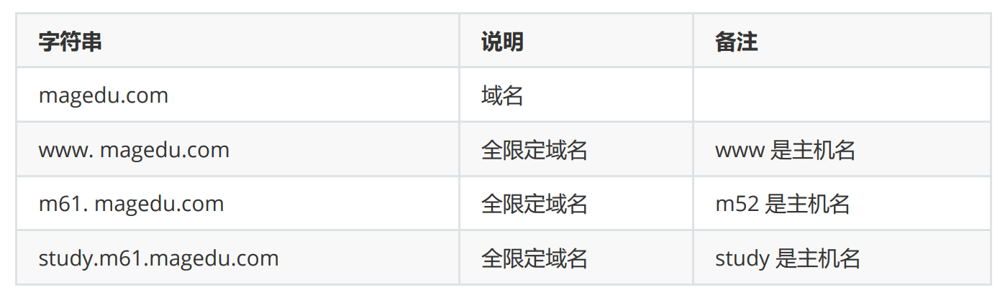
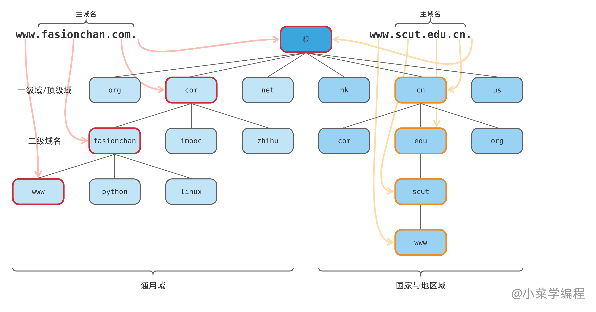
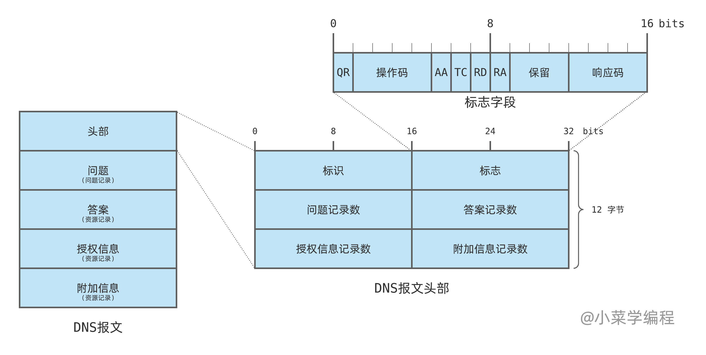
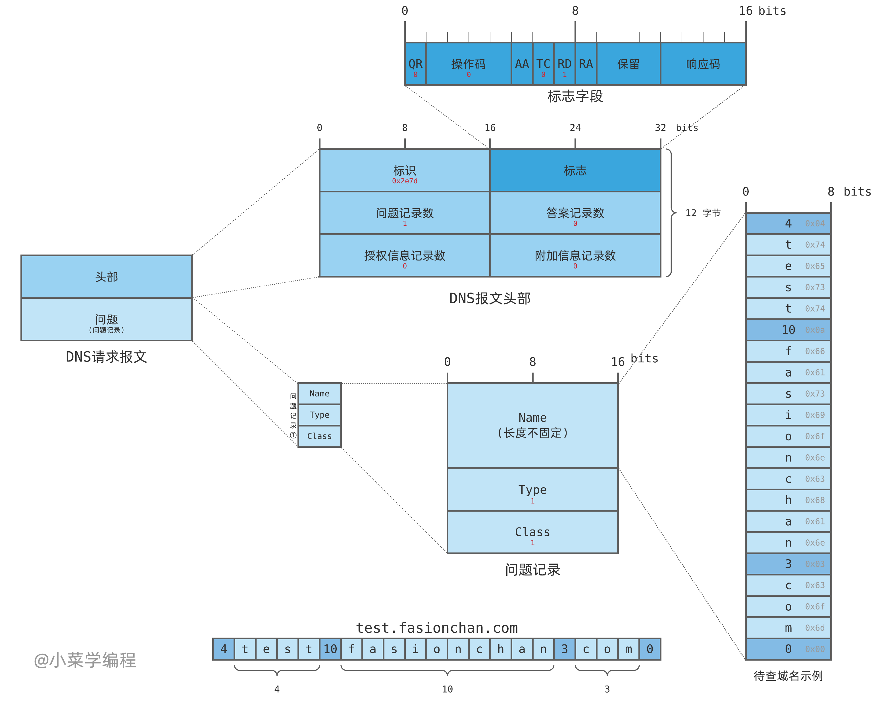
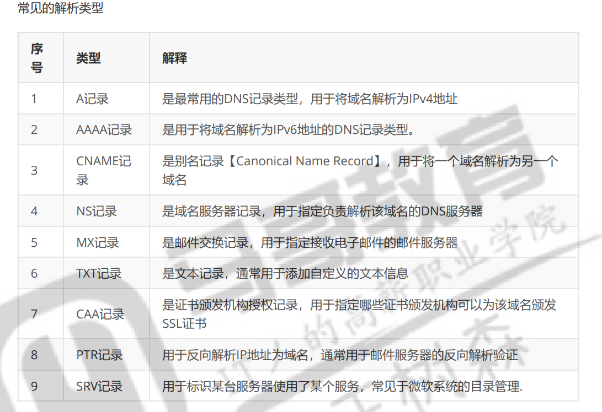
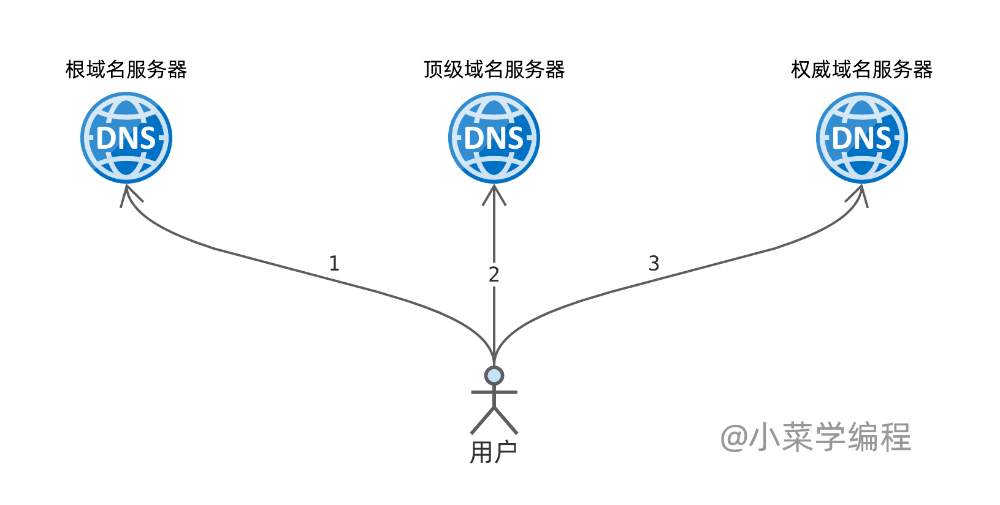
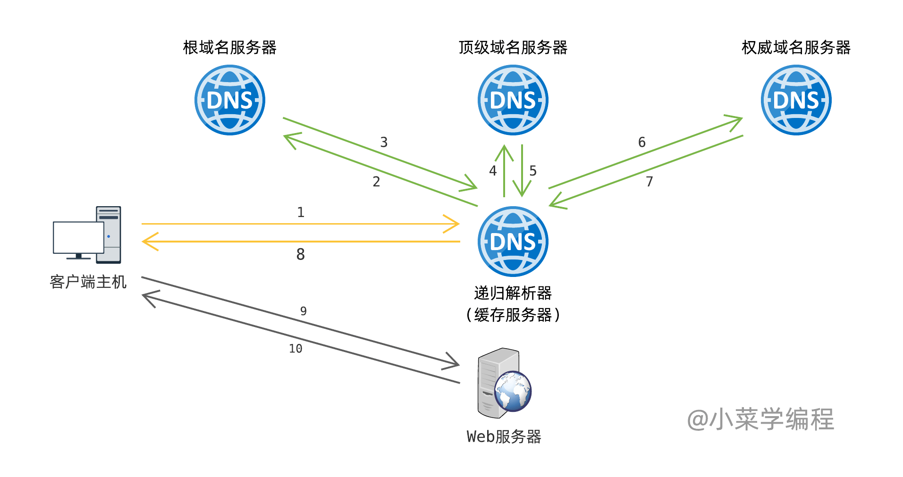
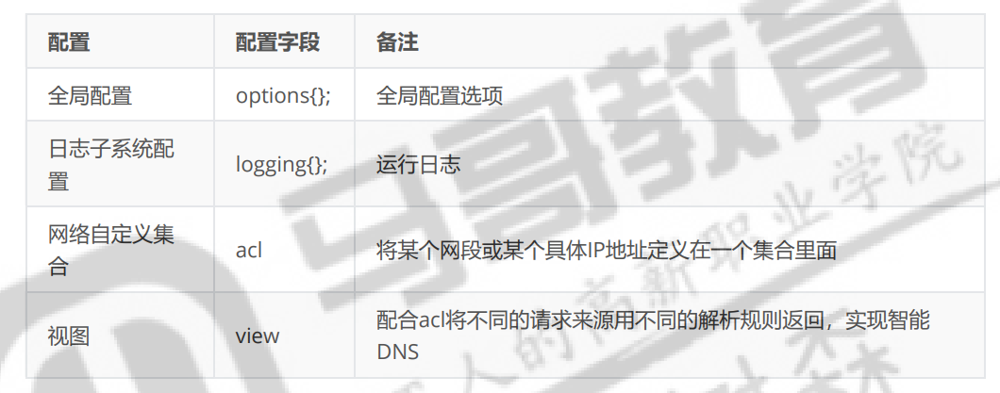
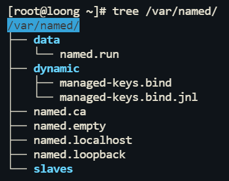
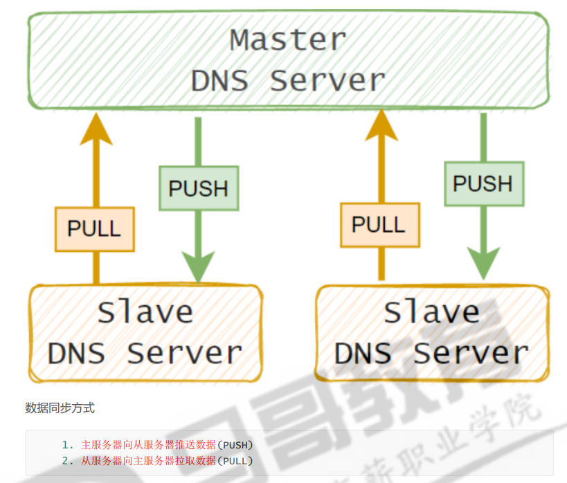

+++
author = "Loong"
title = "DNS"
date = "2024-12-10"
description = "Domain Name System (域名系统)"
tags = [
    "DNS","named","CDN"
]
categories = [
    "Linux service",
]

+++

# DNS，Domain Name System (域名系统)

## 概念

DNS用于维护主机IP与域名映射关系，域名解析。

将域名转化为IP地址。

### 查询顺序

1. 检查本地缓存
2. 检查 `/etc/hosts` 文件
3. DNS 查询

可通过`/etc/nsswitch.conf`文件调整

```shell
root@loong:~# cat /etc/nsswitch.conf
# /etc/nsswitch.conf
#
# Example configuration of GNU Name Service Switch functionality.
# If you have the `glibc-doc-reference' and `info' packages installed, try:
# `info libc "Name Service Switch"' for information about this file.

passwd:         files systemd
group:          files systemd
shadow:         files systemd
gshadow:        files systemd

hosts:          files dns		# 先files 再dns
networks:       files

protocols:      db files
services:       db files
ethers:         db files
rpc:            db files

netgroup:       nis
```


###  hosts文件

hosts文件是引入DNS服务之前的解析方案

将域名与IP写入文件

系统管理员可以将常用的域名和 IP 地址手动写入 `/etc/hosts`，跳过 DNS 查询。

```powershell
Windows系统中的hosts文件：
 %windir%\System32\drivers\etc\hosts
 - %windir%  是windows 系统中的环境变量写法，表示 Windows 安装目录，上述路径一般是
 C:\Windows\System32\drivers\etc
```

```powershell
Linux系统中的hosts文件
/etc/hosts

root@loong:~# cat /etc/hosts
127.0.0.1 localhost
127.0.1.1 loong

# The following lines are desirable for IPv6 capable hosts
::1     ip6-localhost ip6-loopback
fe00::0 ip6-localnet
ff00::0 ip6-mcastprefix
ff02::1 ip6-allnodes
ff02::2 ip6-allrouters
```


### Domain Name 域名

域名分层级。每层用`.`隔开。

最上层为顶级域（一级域），之后二级域......

最上层是根域`.`（一个点），通常省略


FQDN：(Fully Qualified Domain Name)全限定域名





```powershell
根域：
 	全球共有13组IPV4根域名服务器，其中10组在美国，2组在欧洲（英国，瑞典），1组在亚洲（日本）
 	
一级域名：
 	又称顶级域名，可分为三类，一类代表国家和地区(cn，hk，......)，一类代表各类组织(com，
edu，......)，以及新顶级域名（如.xyz、.top等）或其他特殊顶级域名（包括一些基础设施顶级域名
和.arpa用于逆向域名解析，以及国际化域名允许使用非ASCII字符）

二级域名：
 	某个具体组织，单位，机构，商业公司或个人使用，需要向域名管理机构申请(付费)才能获得使用权
二级域名以下的域名，由使用该域名的组织自行分配
```

IPV4根域名服务器13组（1主12辅）。Anycast技术，做到多台服务器共用一个IP，直接找最近的。


### 13根服务器的原因

为了使数据包不在网络层分片（效率低）。标准UDP数据包的最大有效载荷为 **512字节**。

​		当DNS报文的大小超过512字节时，如果仍然使用UDP进行传输，那么报文将被截断，导致查询失 败。所以DNS协议规定在数据量超过512字节时，应使用TCP协议进行传输，而不是UDP来传输报文，因为TCP 允许传输更大的数据包而不需要分片。


应答DNS数据包

```powershell
Head：					12字节

Question：				5字节 * 1 （一问） = 5字节

13个A记录（Address）：	16字节 * 13 = 208 字节

13个NS记录（Name Sever）
						31字节 + 15字节（压缩后）* 12 （其余12条NS）= 180字节
总共						436字节

剩余						512 - 436 = 76字节

加新根需要				 15 + 16 = 31字节
```

**现实中的约束**

早期根域名服务器还支持 `.com`、`.net.` 等顶级域名的查询功能（Priming查询），需要额外的空间来存储其 QNAME 信息。由于这种查询方式需要预留额外的 64 字节空间，因此：

- 可用空间：76 - 64 = **12 字节**。
- 12 字节不足以容纳新根服务器的记录。
- **结论**：根服务器数量的实际限制是 **13 台**。


### DNS报文

DNS 报文分为 **请求** 和 **应答** 两种，结构是类似的，大致分为五部分：

- 头部（ *header* ），描述报文类型，以及其下 4 个小节的情况；固定12字节；
- 问题节（ *question* ），保存查询问题；
- 答案节（ *answer* ），保存问题答案，也就是查询结果；
- 授权信息节（ *authority* ），保存授权信息；权威DNS服务器的信息
- 附加信息节（ *additional* ），保存附加信息；

#### 头部




- **标识**（ *identifier* ），一个 16 位的 ID ，在应答中原样返回，以此匹配请求和应答；
- **标志**（ *flags* ），一些标志位，共 16 位；
- **问题记录数**（ *question count* ），一个 16 位整数，表示问题节中的记录个数；
- **答案记录数**（ *answer count* ），一个 16 位整数，表示答案节中的记录个数；
- **授权信息记录数**（ *authority record count* ），一个 16 位整数，表示授权信息节中的记录个数；
- **附加信息记录数**（ *additional record count* ），一个 16 位整数，表示附加信息节中的记录个数；

标志位：

- QR 位标记报文是一个查询请求，还是查询应答；
  - 0 表示查询请求；
  - 1 表示查询应答；
- 操作码（opcode）占 4 位，表示操作类型：
  - 0 代表标准查询；
  - 1 代表反向查询；
  - 2 代表服务器状态请求；
- AA 位表示 **权威回答**（ *authoritative answer* ），意味着当前查询结果是由域名的权威服务器给出的；
- TC 位表示 **截短**（ *truncated* ），使用 UDP 时，如果应答超过 512 字节，只返回前 512 个字节；
- RD 位表示期望递归（ recursion desired），在请求中设置，并在应答中返回；
  - 该位为 1 时，服务器必须处理这个请求：如果服务器没有授权回答，它必须替客户端请求其他 DNS 服务器，这也是所谓的 **递归查询** ；
  - 该位为 0 时，如果服务器没有授权回答，它就返回一个能够处理该查询的服务器列表给客户端，由客户端自己进行 **迭代查询** ；
- RA 位表示可递归（ *recursion available* ），如果服务器支持递归查询，就会在应答中设置该位，以告知客户端；
- 保留位，这 3 位目前未用，留作未来扩展；
- 响应码（response code）占 4 位，表示请求结果，常见的值包括：
  - 0 表示没有差错；
  - 3 表示名字差错，该差错由权威服务器返回，表示待查询的域名不存在；

#### 问题



一个问题记录由 3 个字段组成：

- **待查询域名**（ Name ），这个字段长度不固定，由具体域名决定；
- 查询类型（ Type ），域名除了关联 IP 地址，还可以关联其他信息，常见类型包括（下节详细介绍）：
  - 1 表示 A 记录，即 IP 地址；
  - 28 表示 AAAA 记录，即 IPv6 地址；
  - etc
- **类** （ Class ）通常为 1 ，表示 TCP/IP 互联网地址；

#### 应答


回答、权威和附加部分的结构类似，包含DNS服务器返回的资源记录（RR，Resource Record），格式如下：

| 字段名称     | 长度     | 描述                                             |
| ------------ | -------- | ------------------------------------------------ |
| **NAME**     | 可变长度 | 当前记录适用的域名，通常以压缩格式存储（指针）。 |
| **TYPE**     | 16位     | 记录的类型（如 A、NS、CNAME、MX 等）。           |
| **CLASS**    | 16位     | 记录的类，通常为 `IN`（互联网）。                |
| **TTL**      | 32位     | 生存时间（秒），表示记录在缓存中存活的时间。     |
| **RDLENGTH** | 16位     | 数据部分的长度（字节）。                         |
| **RDATA**    | 可变长度 | 实际的数据，例如IP地址或域名。                   |


记录的类型：



## 原理

### 迭代查询



客户端逐级向每一级DNS服务器发起查询，请求获得下一步的指引，直到找到最终答案。


### 递归查询（缓存服务器）

DNS服务器代替客户端完成迭代查询




## DNS地址配置

1. 对应的网卡配置文件中

2. /etc/resolv.conf文件中 **优先**

   * rocky中为独立文件，修改后永久保存

   * ubuntu中为软链接文件，/etc/resolv.conf -> ../run/systemd/resolve/stub-resolv.conf

     * 由systemd-resolved.service服务管理
     * 重启systemd-resolved.service，或netplan apply后会刷新

     ```shell
     nameserver 127.0.0.53
     options edns0 trust-ad				# EDNS，DNSsec 相关
     search .							
     # 自动拼接列表，会非FDQN将域名（不已.结尾）与列表中的值做拼接
     ```

3. ubuntu：/etc/systemd/resolved.conf文件中

### systemd-resolved服务 resolvectl命令

rocky 安装

```shell
yum install -y systemd-resolved
```

```shell
## 查看DNS地址配置
resolvectl status

## 查看DNS缓存
resolvectl statistics

## 清理DNS缓存
resolvectl reset-statistics
```

/run/systemd/resolve

```shell
io.systemd.Resolve  io.systemd.Resolve.Monitor  netif  resolv.conf  stub-resolv.conf
```

#### 作用

systemd-resolved服务

- 缓存 DNS 查询结果，减少重复查询，提高效率。
- 转发 DNS 查询到上游 DNS 服务器（通过 `/run/systemd/resolve/resolv.conf` 中配置的 `nameserver` 条目）。

#### 127.0.0.53#53

本地 DNS 缓存代理服务的地址

系统的 DNS 查询会首先发送到 **`127.0.0.53`**，由 `systemd-resolved` 代理处理。


# DNS检测命令

## dig **贼好用**比其他

Domain Information Groper 域名信息查询工具

dig 命令不会查询本地` hosts`文件中定义的域名和IP对应关系

```shell
dig www.baidu.com

## 指定DNS服务器
dig www.baidu.com @dns-erver
dig  @dns-erver www.baidu.com

## 反向解析IP
dig -x IP

## 指定端口
-p port

## 指定查询类型
-t
## 使用指定IP去查询DNS，一般来说是本地ip地址
-b address#port   
```

## host

不会查询本地 hosts文件中定义的域名和IP对应关系

```shell
## 显示所有信息
host -a wwwbaidu.com

## 指定服务器
host www.magedu.com 114.114.114.114

```

## nslookup

不会查询本地 hosts文件中定义的域名和IP对应关系，也不能查询dns的递归或者迭代


# DNS服务器

## bind部署DNS解析服务（named服务）

环境部署

```shell
yum install bind -y		## 默认不去对外 

apt install bind9		## 默认对外
```

BIND 的核心进程（`named`）

**named**默认会占用TCP和UDP的**53**端口， **953**是给**rndc**管理工具使用的

127.0.0.1:53 本地环回自己用

IP:53 			给其他人用

## rndc 管理DNS服务工具

远程管理BIND（Berkeley Internet  Name Domain）DNS服务器的工具。

953/tcp

```powershell
常用子命令
    status #查看BIND服务状态
    reload #重载主配置文件和区域解析库文件
    reload zonename #重载区域解析库文件
    retransfer zonename #手动启动区域传送，而不管序列号是否增加
    notify zonename #重新对区域传送发通知
    reconfig #重载主配置文件
    querylog #开启或关闭查询日志文件/var/log/message
    trace #递增debug一个级别
    trace LEVEL #指定使用的级别
    notrace #将调试级别设置为 0
    flush #清空DNS服务器的所有缓存记录
```

## 配置文件



### rocky

```shell
## 配置文件，全局选项（options）、日志配置、ACL 规则，也可存放区域定义（zone）
/etc/named.conf
## listen-on port 53 { 127.0.0.1; }; 监听地址
## listen-on-v6 port 53 { ::1; };    ipv6
## allow-query     { localhost; };	 谁可用查询
### 加上any对外开放
## listen-on port 53 { 127.0.0.1; any;};
## listen-on-v6 port 53 { ::1; any;};
## allow-query     { localhost; any;};

## 专域名条目文件，定义了域名和具体解析规则文件的对应
/etc/named.rfc1912.zones

## 工作目录，存放域解析规则文件
/var/named
```



### ubuntu

```shell
## 配置文件
/etc/bind/named.conf
/etc/bind/named.conf.options
/etc/bind/named.conf.local
/etc/bind/named.conf.default-zones
## options中listen-on-v6为any，开放对外端口


## 域名条目文件，定义了域名和具体解析规则文件的对应
/etc/bind/zones.rfc1918

## 工作目录，存放域解析规则文件
/etc/bind
/var/cache/bind
```

## 解析规则配置

这些文件定义域名的具体解析规则，该文件有多条资源记录组成，每一行都是一条资源记录，在RFC文档 中，DNS解析记录被称为Resource Recode（资源记录），缩写为 RR。


### 目录与命名规范

```shell
## rocky
/etc/bind/db.*

## ubuntu
/var/named/named.*
```

### Resource Record（资源记录）

```powershell
Owner：记录的所有者，通常是一个域名。

TTL（Time to Live）：生存时间，指定其他DNS服务器在放弃缓存该记录之前应将其缓存多长时间。

CLASS：类，指示记录所属的类别。最常用的类别是IN（Internet类）。

TYPE：类型，指示记录的类型，
A记录			将域名映射到 IPv4 地址
AAAA记录		将域名映射到 IPv6 地址
NS记录		指定域名的权威名称服务器，用于管理该域的 DNS 记录。
PTR记录		域名指针，用IP地址反向解析域名
SOA记录		标志权威区域的开始 后接权威 DNS 服务器信息及区域同步参数。
			 主权威服务器的名称   管理员的邮箱地址  同步参数（Serial， Refresh，Retry， Expire， 				 Minimum TTL）
CNAME 记录	将一个域名设置为另一个域名的别名


RDATA：资源数据，随CLASS和TYPE的变化而变化，用于描述与记录相关的具体信息。
```

SOA示例

```shell
## dns缓存的存货时间 单位秒，可使用D，W，M
$TTL 100
## 域名       class   type     主权威服务器的名称      管理员的邮箱地址          从属服务器同步参数
example.com.   IN     SOA    ns1.example.com.     hostmaster.example.com.   (
                    									2024112201  ; 序列号
                    									3600        ; 刷新时间
                    									1800        ; 重试时间
                    									1209600     ; 记录失效的时间
                    									86400       ; 负向缓存的存活时间
                										)
```

缩写示例

```shell
# @ 的值由 SOA 记录或 zone 定义的域名决定
$TTL 100
@		IN		SOA		ns1.example.com.		hostmaster.example.com.		(
                    														2024112201 
                    														3600       
                    														1800      
                    														1209600    
                    														86400      
                															)
                															
# 之后的可用缩写，前面的要写全
## 域名为空就是 @
## 不为空,并且末尾无.,是非FQDN,会再后补上@
### www == www.@ == www.example.com.
### www. == www.	不补

        IN  	NS  	ns1.example.com.
        IN  	NS  	ns2.example.com.
www     IN  	A   	192.0.2.1
mail    IN  	A   	192.0.2.2
```

#### A 记录 和 AAAA记录

```shell
www.magedu.com.   86400  IN  A  10.0.0.21
```

#### CNAME 别名记录

用于将一个域名（别名，Alias）指向另一个域名（规范名称，Canonical Name）。

```shell
abc.magedu.com.  86400  IN  CNAME  def.magedu.com. 
```

当需要为主域名（如 `example.com`）提供多个子域名（如 `www.example.com`、`ftp.example.com`）时，可以通过 CNAME 指向主域名，而不是为每个子域名单独设置 A 记录。

```shell
www.example.com.  IN  CNAME  example.com.
ftp.example.com.  IN  CNAME  example.com.
```

#### NS 记录

指定域名的权威名称服务器

域名从哪域名服务器找

域名服务器地址

```shell
magedu.com.       86400 IN NS dns1.magedu.com.
magedu.com.       86400 IN NS dns2.magedu.com.

dns1.magedu.com.  86400 IN A  10.0.0.208
dns2.magedu.com.  86400 IN A  10.0.0.208
```

#### PTR 记录

```shell
# A记录
blog.magedu.com.  86400  IN  A  10.0.0.167

# 与其对应的PTR记录, 格式：IP地址"反着写"，后面跟 .in-addr.arpa.
167.0.0.10.in-addr.arpa.  86400  IN  PTR  blog.magedu.com.
```


# DNS服务器实践

## **不能有特殊字符，包括制表符。**

## 主服务器

```
zone "noob" { 
        type master; 
        file "/etc/bind/db.noob"; 
};
```

```shell
$TTL    1D
@       IN      SOA     noob.           loong.noob.com.         (
                                                                        3
                                                                        300
                                                                        100
                                                                        1D
                                                                        86400
                                                                )
        IN      NS      ns
        
ns      IN      A       123.123.123.1
loong   IN      A       123.123.123.2
```

```shell
named-checkzone noob /etc/bind/db.noob
rndc reload
```

```shell
# 测试
dig noob @10.0.0.12
```

## 主从同步服务器



### 主

```shell
zone "example.com" IN {         			# IN 可以省略不写
        type master; 						# type 为 主角色
        file "/etc/bind/db.example.com";
        allow-transfer { 10.0.0.12; }; 		# 【可选】从服务器的IP地址
        allow-update { none; }; 			# 【可选】该DNS区域不允许动态更新。
        notify yes;
        also-notify { 10.0.0.11; };
};

zone "noob" { 
        type master; 
        file "/etc/bind/db.noob";
        allow-transfer { 10.0.0.11; };
};
```

加上从dns的NS，与A

```
$TTL    1D
@       IN      SOA     noob.           loong.noob.com.         (
                                                                        3
                                                                        300
                                                                        100
                                                                        1D
                                                                        86400
                                                                )
        IN      NS      ns
slave        IN      NS      slave-dns
        

ns      IN      A       123.123.123.1
slave-dns     IN      A       10.0.0.11
loong   IN      A       123.123.123.2
```


### 从

```shell
zone "example.com" {
    type slave;                      # 定义此服务器为从 DNS 服务器
    file "slaves/db.example.com";    # 从服务器的区域文件，自动同步主服务器的数据
    masters { 192.168.1.10; };       # 定义主服务器的 IP 地址
};

zone "noob" IN {
        type slave;
        file "slaves/named.noob";
        masters {10.0.0.12; };
};
```


## DNS子域

指在主域名（或称为父域）下创建的更小的、相对独立的域。

将子域委派给其它的DNS服务器解析，实现分布式DNS服务

### 父域 l00ng

```shell
zone "l00n9" {
        type master;
        file "/etc/bind/db.l00n9";
};
```

```shell
$TTL 1D
@               IN              SOA             l00n9-dns.      loong.noob.com.         ( 20 3H 15M 1D 1W )

@               IN              NS              ns
sub             IN              NS              sub-dns

@               IN              A               123.123.123.200
ns              IN              A               123.123.123.200
sub-dns         IN              A               10.0.0.11
```

### 子域 sub.l00n9

```shell
zone "sub.l00n9" IN {
        type master;
        file "named.sub.l00n9";
};
```

```shell
@               IN              SOA             dns.sub.l00n9.          loong.noob.com.         ( 4 1W 1D 2W 3W )

@               IN              NS              ns

@               IN              A               123.123.123.201
ns              IN              A               123.123.123.201
no1             IN              A               123.123.123.202
```


## DNS转发

当前我们配置的DNS，如果在自己无法解析后，将直接请求根域的DNS服务器解析。 

在某些特定环境下，我们可以设置DNS转发服务，将当前无法解析的域名，转发给另外的DNS解析，如果 还是无法解析，再提交互联网。

转发模式：

* First模式
  * 本地DNS服务器收到一个无法解析的域名请求时，它会首先尝试将该请求转发到指定的上游DNS服务 器。
  * 上游DNS服务器也无法解析该域名，或者没有响应，那么本地DNS服务器会尝试自己进行递归查询。
* Only模式
  * 本地DNS服务器收到一个无法解析的域名请求时，它会首先尝试将该请求转发到指定的上游DNS服务 器。
  * 上游DNS服务器无法解析或没有响应，本地DNS服务器不进行递归查询，直接返回无法解析的结果给 客户端。


```shell
options {
 ......
 dnssec-validation no; #关闭加密验证 【很重要】
 forwarders { 10.0.0.14; }; #转发服务器
 forward first; #转发策略，如果间接DNS没有返回，则直接DNS再次向
根域请求解析
};

options {
 ...
 forwarders { 10.0.0.14; };
 forward only;
};

named-checkconf
```

### 特定域转发

```
zone "golang-magedu.com" IN {
  type forward;
  forward first;
  forwarders {10.0.0.14;};
};
```


## 反向解析

```shell
zone "123.123.123.in-addr.arpa" IN {
        type master;
        file "named.123.123.123.in-addr.arpa";
};
```

```shell
$TTL    1D
@               IN      SOA     ptr.noob.       loong.noob.com.       ( 1 13H 15M 1D 1W )

                IN      NS      ptr.ns.noob.

9               IN      PTR     no5.noob.
```


## DNS view（视图）

DNS视图是一种根据客户端的来源IP地址来解析不同DNS记录的功能。它允许DNS服务器根据请求者的IP 地址范围，返回不同的解析结果。这种功能在需要为内部网络和外部网络提供不同访问服务时非常有用.

例如，公司内部的员工和外部客户访问同一个域名时，可以解析到不同的IP地址。这样可以做到将客户端 解析到距离其物理地址最近的机房内，以达到加快访问速度，以及分流的目的。

1. 取消默认的zone入口 
2. 增加 acl规则和 view视图 
3. 定制各自的zone文件 
4. 综合测试

```shell
#include "/etc/bind/named.conf.default-zones"; #注释此行


options { ... };
# 定义一个名为test_net的ACL，包含IP地址范围192.168.8.0到192.168.8.255的所有客户端。
acl test_net{
 192.168.8.0/24;
};
# 定义一个名为prod_net的ACL，包含IP地址范围10.0.0.0到10.0.0.255的所有客户端。
acl prod_net{
 10.0.0.0/24;
};
# 定义一个名为other_net的ACL，包含所有客户端（即any）
acl other_net{
  any;
};

# 定义一个名为test_view的视图
view test_view{
 match-clients { test_net; };
 include "/etc/bind/named.conf.default-zones";
 include "/etc/bind/named.conf.test-zones";
};
# 定义一个名为prod_view的视图
view prod_view{
 match-clients { prod_net; };
 include "/etc/bind/named.conf.default-zones";
 include "/etc/bind/named.conf.prod-zones";
};
# 定义一个名为other_view的视图
view other_view{
 match-clients { other_net; };
 include "/etc/bind/named.conf.default-zones";
};

```

```shell
cat /etc/bind/named.conf.test-zones
zone "sre-magedu.com" {
 type master;
 file "/etc/bind/db.test.sre-magedu.com";
};


cat /etc/bind/db.test.sre-magedu.com 
$TTL 86400
@               IN   SOA  sre-magedu-dns. admin.sre-magedu.com. ( 123 3H 15M 1D
1W )
                NS   dns1
dns1            A    192.168.8.13
www             A    192.168.8.111
```

```shell
cat /etc/bind/named.conf.prod-zones
zone "sre-magedu.com" {
 type master;
 file "/etc/bind/db.prod.sre-magedu.com";
};


cat /etc/bind/db.prod.sre-magedu.com 
$TTL 86400
@               IN   SOA  sre-magedu-dns. admin.sre-magedu.com. ( 123 3H 15M 1D
1W )
                NS   dns1
dns1            A    10.0.0.13
www             A    10.0.0.111
```


# CDN

CDN的全称是Content Delivery Network，即内容分发网络。

**内容分发网络 (Content Delivery Network, CDN)** 是一种分布式服务器系统，旨在通过将内容分发到离用户最近的服务器节点，优化内容交付速度、可靠性和可用性，同时减轻源服务器的压力。


**CDN 的主要作用是通过在全球分布的边缘节点缓存和分发你的内容，加快访问速度，减轻源站压力，并提升可靠性和安全性。**

**CDN的作用就是将我主机上的内容先缓存到各个CDN服务商的边缘节点，使访问加速**


内容分发网络(CDN)是一个经策略性部署的整体系统，包括**内容存储**、负载均衡、**网络请求的 重定向**和内容管理4个要件。而**内容管理和全局的网络流量管理(Traffic Management)**是CDN的核心所在。 通过用户**就近性和服务器负载**的判断，CDN确保内容以一种极为高效的方式为用户的请求提供服务。

## **CDN 的工作原理**

###  **核心概念**

1. **缓存内容**：CDN 在全球分布的节点服务器上缓存静态资源（如 HTML、CSS、JavaScript 文件、图片、视频等）。
2. **用户访问**：当用户发起请求时，CDN 会将用户的请求路由到离其最近的节点。
3. 内容提供
   - 如果该节点缓存了请求的资源，则直接返回内容。
   - 如果节点没有缓存该内容，则向源服务器请求，并缓存到节点中供未来访问。


### **CDN 的主要组成部分**

1. **边缘节点（Edge Server）（CSDN服务商的）**：
   - 部署在全球各地，负责响应用户的内容请求。
   - 提供缓存内容，减少用户访问延迟。
2. **源站（Origin Server）（源主机，自己的）**：
   - 存储原始数据的服务器。
   - CDN 在缓存内容失效时回源请求资源。
3. **分布式控制系统**：
   - 管理和分配请求路由。
   - 确保负载均衡、缓存同步等功能。
4. **DNS 调度系统**：
   - 根据用户的地理位置和网络状况，将用户请求智能地调度到最佳节点。

### **CDN 的优缺点**

#### 优点：

- **加速网站和应用**：提高加载速度，减少延迟。
- **高可用性**：通过节点冗余，确保即使部分服务器失效也能提供服务。
- **节省成本**：减少对源服务器的请求，降低带宽费用。
- **增强安全性**：内置 DDoS 防护、WAF 和流量清洗功能。

#### 缺点：

- **缓存更新延迟**：动态内容或频繁更新的内容可能需要额外配置来避免缓存过期问题。
- **成本**：对于流量需求较大的企业，CDN 服务可能增加成本。
- **复杂性**：需要额外配置和监控以确保最佳性能。


## GLSB 全局负载均衡

GLSB 是在广域网上，对不同地域的服务器间的流量进行调度，通过判断服务器的负载，带宽的负载等， 决定服务器的可用性，同时判断客户端与服务器之间的链路状况，选择与客户端最佳匹配的服务器，并将客户 端请求调度到该服务器上。


GLSB的实现有三种方式： 

​		基于DNS实现、基于重定向实现、基于路由协议实现，其中最通用的是基于DNS的实现。 

GLSB 的使用范围： 

​		常用于有异地机房的WEB系统，或在CDN系统中作为核心的流量调度系统。


**作用是找到最近CDN边缘节点。**

## **CDN 的优缺点**

### 优点：

- **加速网站和应用**：提高加载速度，减少延迟。
- **高可用性**：通过节点冗余，确保即使部分服务器失效也能提供服务。
- **节省成本**：减少对源服务器的请求，降低带宽费用。
- **增强安全性**：内置 DDoS 防护、WAF 和流量清洗功能。

### 缺点：

- **缓存更新延迟**：动态内容或频繁更新的内容可能需要额外配置来避免缓存过期问题。
- **成本**：对于流量需求较大的企业，CDN 服务可能增加成本。
- **复杂性**：需要额外配置和监控以确保最佳性能。

# 智能DNS

智能DNS会自动判断用户的来路，做出一些智能化的处理，判断哪个IP地址离用户最近，然后将该地址返 回给用户。同时智能DNS还有一定程度的故障检测功能，如果发现解析的A主机出现问题，那么会将一个合格的 B主机地址返回给用户，从而提供一个高可靠永不宕机的服务。 

# whois 获取域名相关信息

用于查询域名和IP地址注册信息的工具

帮助用户获取有关域名或IP地址的所 有者、注册商、注册日期、到期日期以及其他相关信息。


# Anycast技术


# NSCD 缓存服务

用于缓存命名服务（如 DNS、用户和组信息）的查询结果，以提高系统性能并减少查询延迟。

尽管 NSCD 在过去被广泛使用，但随着现代系统需求的变化，其使用频率逐渐降低。一些替代方案。

## **NSCD 的作用**

NSCD 的主要功能是缓存以下类型的查询结果：

1. **DNS 缓存**：
   - 缓存主机名解析（通过 `/etc/resolv.conf` 和 `/etc/hosts` 配置的 DNS 查询）。
   - 减少对外部 DNS 服务器的重复查询，提升性能。
2. **用户信息缓存**：
   - 缓存 `/etc/passwd` 中的用户信息（如用户名和 UID）。
   - 用于用户身份认证相关操作。
3. **组信息缓存**：
   - 缓存 `/etc/group` 中的组信息（如组名和 GID）。
   - 减少对组信息的重复查询。

```
ndcd -g

sudo nscd -I all

sudo nscd -i hosts   # 清理 DNS 缓存
sudo nscd -i passwd  # 清理用户缓存
sudo nscd -i group   # 清理组缓存
```

