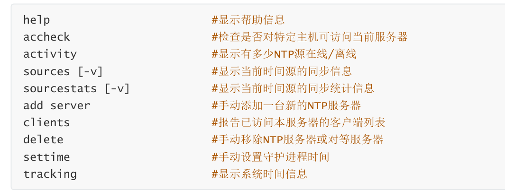
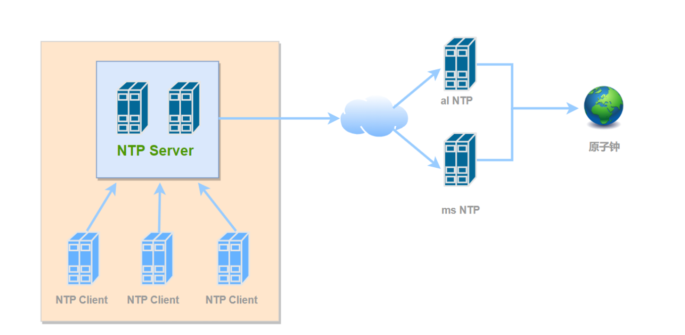

# timedatectl

```shell
命令格式：
timedatectl [OPTIONS...] COMMAND ...
常用子命令
status                                  #显示当前时间设置，默认项
show                                    #以友好格式显示，具体同容同 status 
set-time TIME                           #修改时间
set-timezone ZONE                       #修改时区   
list-timezones                          #列出当前可用时区
set-local-rtc BOOL                      #RPC时间是否关联本地时区
set-ntp BOOL                            #是否开启ntp 服务
```

时间不同步，则有很多网络服务都不能用。

```shell
## 关闭
timedatectl set-ntp 0

## 开启
timedatectl set-ntp 1

## 调整时间
date -s "+10 year"

curl https://www.baidu.com
# 失败

timedatectl set-time "2042-10-15 00:00:00"
```

# 时间同步协议

## NTP（Network Time Protocol，网络时间协议）

将系统时钟和世界协调时UTC同步，精度在局域网内可达0.1ms，在互联网上绝大多数的地方精度可以  达到1-50ms。ntp 是使用渐进性同步机制，如果本地时间与标准时间相差较大，则需要一定的时间才能同步 完成；

# 时间同步软件

## Chrony时间同步

Chrony通常运行在UDP 123端口上

```shell
Rocky系统
[root@rocky9 ~]# rpm -ql chrony
 /etc/chrony.conf
 /etc/chrony.keys
 /etc/dhcp/dhclient.d/chrony.sh
 /etc/logrotate.d/chrony
 /etc/sysconfig/chronyd
 Ubuntu系统
root@ubuntu24:~# tree /etc/chrony/
 /etc/chrony/
 ├── chrony.conf          # 核心配置文件               
 ├── chrony.keys           # 存储用于 NTP（网络时间协议）身份验证的密钥。              
 ├── conf.d
 │   └── README
 └── sources.d
     └── README


3 directories, 4 files
```

### chronyc 客户端



## 自建时间服务器

使用公共NTP可能会使系统暴露于各种安全威胁之下，例如公共NTP不可用、中间人攻击(MITM)、时钟欺骗 等。



### 服务端

/etc/chrony/chrony.conf

```shell
server ntp.aliyun.com iburst        # 这是之前配置好的
allow 10.0.0.0/24					# 允许10.0.0 网段的主机将本机作为时间同步服务器
local stratum 10					# 允许本机在不能与外网同步的情况下，还能提供服务
```

### 客户端

```shell
# pool 2.rocky.pool.ntp.org iburst # 禁用默认的
server 10.0.0.13 iburst

# iburst 快速初始同步
# burst：在每个同步轮询周期都会发送多次请求，通常用于高精度的时间同步，但可能对服务器产生更大压力。
```

