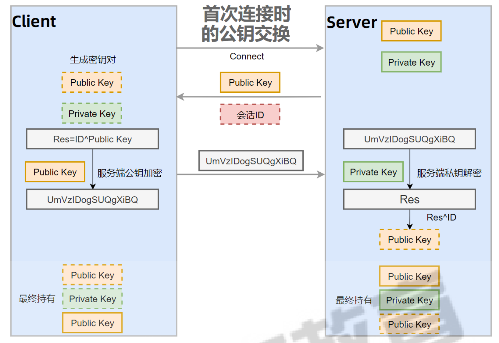
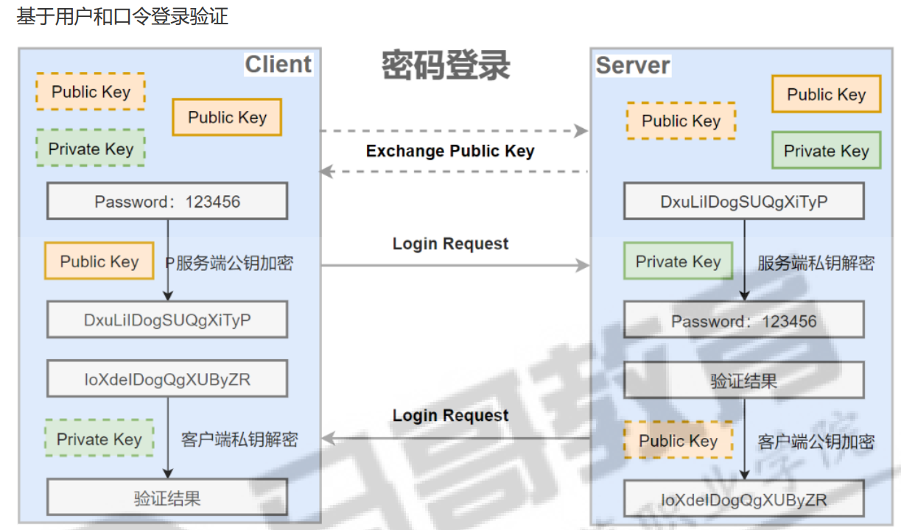
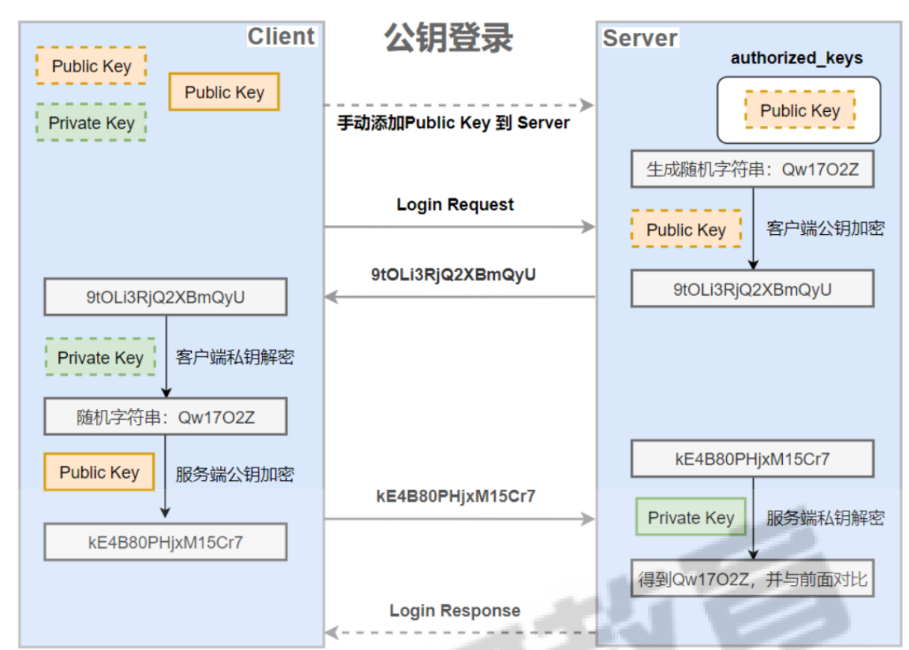
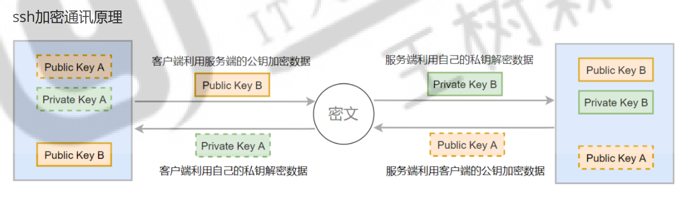
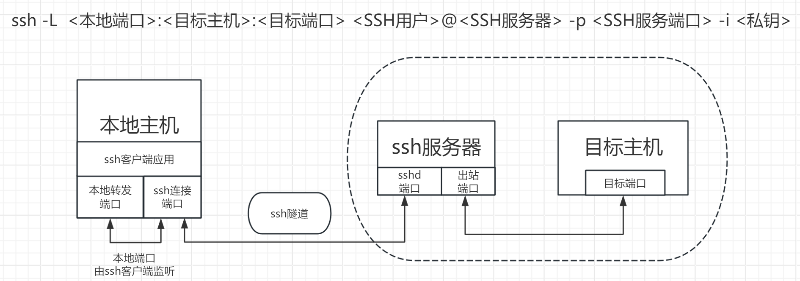
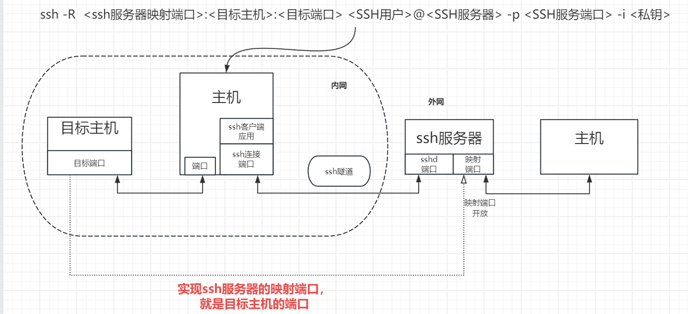
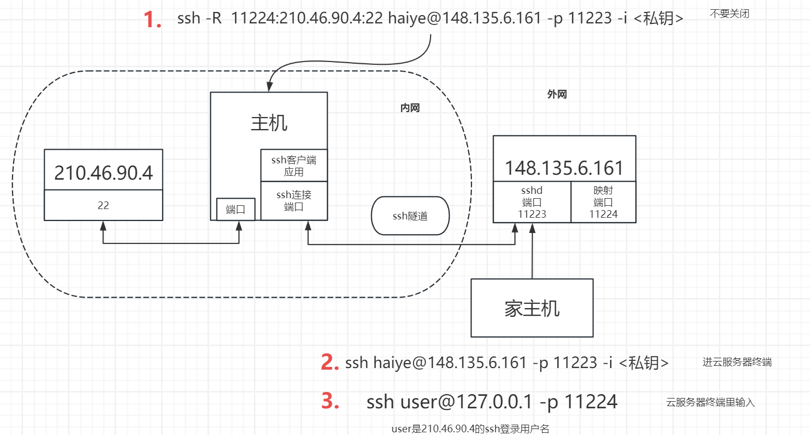

# SSH

## ssh服务功能

* 远程登录：SSH 最常见的用途是允许用户安全地登录到远程计算机上。用户可以通过 SSH 客户端（如 ssh 命令）连接到 SSH 服务器，并输入用户名和密码（或使用其他认证方法，如公钥认证）来登录。   
* 文件传输：SSH 还提供了安全的文件传输功能，通常通过 **scp**（Secure Copy Protocol）或 **sftp**（SSH File Transfer Protocol）实现。这些工具允许用户在两台计算机之间安全地传输文件。   
* 端口转发：SSH 可以配置为端口转发器，允许用户将一台计算机上的端口流量安全地转发到另一台计算 机上的端口。这对于**绕过防火墙或访问内部网络资源**非常有用。   
* 隧道：SSH 隧道允许用户创建加密的通道，通过该通道可以安全地传输各种协议的数据。例如，用户可 以使用 SSH 隧道来安全地访问远程数据库或 Web 服务。   
* 命令执行：SSH 允许用户远程执行命令，而无需登录到远程计算机。

### 密钥交换过程




1. 客户端发起链接请求 
2. 服务端返回自己的公钥，以及一个会话ID（这一步客户端得到服务端公钥） 
3. 客户端生成密钥对 ----- 没有实体文件 
4.  客户端用自己的公钥异或会话ID，计算出一个值Res，并用服务端的公钥加密 
5. 客户端发送加密后的值到服务端，服务端用私钥解密，得到Res  
6. 服务端用解密后的值Res异或会话ID，计算出客户端的公钥（这一步服务端得到客户端公钥） 
7. 最终：双方各自持有三个秘钥，分别为自己的一对公、私钥，以及对方的公钥，之后的所有通讯都会被加密


### 登录验证过程

#### 基于用户和口令登录验证



1. 客户端发起ssh请求，服务器会把自己的公钥发送给用户 
2. 用户会根据服务器发来的公钥对密码进行加密 
3. 加密后的信息回传给服务器，服务器用自己的私钥解密，如果密码正确，则用户登录成功

#### 基于密钥的登录方式



1. 首先在客户端生成一对密钥（ssh-keygen） 
2. 并将客户端的公钥ssh-copy-id 拷贝到服务端 **~/.ssh/authorized_keys**文件中
3. 当客户端再次发送一个连接请求，包括ip、用户名 
4. 服务端得到客户端的请求后，会到authorized_keys中查找，如果有响应的IP和用户，就会随机生成一 个字符串，例如：magedu 
5. 服务端将使用客户端拷贝过来的公钥进行加密，然后发送给客户端 
6. 得到服务端发来的消息后，客户端会使用私钥进行解密，然后将解密后的字符串使用服务端公钥加密后，发送给服务端 
7. 服务端接受到客户端发来的字符串后，私钥解密。跟之前的字符串进行对比，如果一致，就允许免密码登录

```shell
## 公私钥生成
ssh-keygen -t ed25519
```


### ssh加密通讯原理



## /etc/ssh/ 目录结构

```bash
/etc/ssh/
├── moduli
├── ssh_config
├── ssh_config.d
├── sshd_config
├── sshd_config.d
├── ssh_host_ecdsa_key
├── ssh_host_ecdsa_key.pub
├── ssh_host_ed25519_key
├── ssh_host_ed25519_key.pub
├── ssh_host_rsa_key
├── ssh_host_rsa_key.pub
└── ssh_import_id
```

* ssh_host_rsa_key 和 ssh_host_rsa_key.pub  
  * 这两对文件是SSH服务器用于RSA认证的密钥对。 服务器使用私钥进行认证，而公钥则分发给希望连接服务器的客户端。 
* ssh_host_ecdsa_key 和 ssh_host_ecdsa_key.pub 
  * 这两对文件是SSH服务器用于ECDSA（椭圆曲线数字签名算法）认证的密钥对。 ECDSA是一种较新的、更安全的算法，相对于RSA提供了更高的安全性。 
* ssh_host_ed25519_key 和 ssh_host_ed25519_key.pub 
  * 这两对文件是SSH服务器用于Ed25519认证的密钥对。 Ed25519是一种基于椭圆曲线的公钥加密算法，以其高效和安全性而著称。 
* moduli 
  * 这个文件包含了用于Diffie-Hellman密钥交换算法的参数。 Diffie-Hellman是一种安全协议，用于在不安全的通道上安全地交换密钥。

## ssh配置

```shell
Port  22     						#远程端口，生产建议修改
ListenAddress ip
LoginGraceTime 2m
PermitRootLogin yes 				#默认ubuntu不允许root远程ssh登录
StrictModes yes   					#检查.ssh/文件的所有者，权限等
MaxAuthTries 6     					#一次连接，最多可以输错6次密码
MaxSessions 10         				#同一个连接最大会话，就是xshell上的复制ssh隧道，修改后对新连接生效
PubkeyAuthentication yes     		#开启基于key验证
PermitEmptyPasswords no     		#不允许空密码连接
PasswordAuthentication yes   		#开启基于用户名和密码连接
MaxStartups 10:30:100   			#未认证连接最大值，默认值10
PrintMotd no 						#是否输出motd信息，改成yes 则motd 会输出两次
PrintLastLog yes 					#是否输出上次登录信息
UseDNS yes 							#是否需要解析主机名，no可加快连接速度
GSSAPIAuthentication yes 			#是否开启客户端对IP反解析，提高速度可改为no
Banner /path/file 					#远程连接时的登录前提示

#以下可以限制可登录用户的办法：
AllowUsers user1 user2 user3 			#用户名白名单
DenyUsers user1 user2 user3 			#用户名黑名单
AllowGroups g1 g2 						#用户组白名单
DenyGroups g1 g2 						#用户组黑名单
PubkeyAcceptedAlgorithms +ssh-rsa 		#支持旧版的rsa密钥认证
```

```shell
# 10s如果没有互动，则断开链接，永久生效可以写配置文件,例如可以写在 /etc/profile 里面
[root@rocky9 ~]# export TMOUT=10
```


## ssh远程登录

当用户远程连接ssh服务器时，会复制ssh服务器/etc/ssh/ssh_host*key.pub文件中的公钥到客户 机的 ~/.ssh/know_hosts中。下次连接时，会自动匹配相对应的私钥，不能匹配，将拒绝连接。


### 首次链接

首次链接时，显示主机指纹（主机的公钥sha256得到），并提示是否继续。yes后，会将主机公钥保存到客户机的 ~/.ssh/know_hosts文件中，用于下次验证。


首次链接要yes确认指纹的原因。

* know_hosts文件中没对应的IP的指纹
* 下次链接时，对不上，就有可能是公钥被更改。


### 命令

```shell
ssh
-p		# 端口
-v		# 显示过程
-i		# 指定私钥文件路径
```

## 远程执行命令

```shell
ssh root@10.0.0.13 cat /etc/lsb-release

ssh root@192.168.1.100 'reboot'
```

## 远程传输

### SCP

**全量备份**

```shell
scp SRC login_user@remote_addr:/path/to/target

-r		# 递归复制
-p		# 端口
-i		# 私钥
-q		# 静默
-p		# 保持文件属性
```

### rsync 文件同步

远程同步。从软件的名称就可以看出来，rsync具有可使 本地和远程两台主机之间的数据快速复制同步镜像、远程备份的功能。

**全量备份和增量备份**

```powershell
全量与增量备份：
	rsync支持全量备份和增量备份。全量备份意味着每次都会复制所有文件，而增量备份则只复制那些自上次备份以来已经改变的文件。

跨平台支持：
	rsync适用于Unix、Linux、Windows等多种操作系统平台，可以在不同平台之间进行数据同步。

保持文件属性：
	rsync在复制文件时，可以保持文件的权限、时间戳、软硬链接、属主、组等属性不变。

高效传输：
	rsync使用独特的“quick check”算法，仅同步大小或最后修改时间发生变化的文件或目录，提高了数据传输效率。

多种传输方式：
	rsync可以使用rcp、rsh、ssh等方式来配合进行隧道加密传输文件，也可以使用socket（进程方式）传输文件和数据。

匿名或认证传输：
	rsync支持匿名传输，也支持通过用户认证进行传输，保证了数据的安全性。

排除指定文件或目录：
	rsync具有排除指定文件或目录同步的功能，类似于打包命令tar的排除功能。
```

```shell
rsync [OPTION]... SRC [SRC]... DEST

-a|--archive 					#保留所有属性，但不包括acl和selinux
-v|--verbose 					#显示详细过程
-r|--recursive 					#递归复制

-n|--dry-run 					#只测试，不执行
-p|--perms 						#保留权限属性
-t|--times 						#保留修改时间戳
-g|--group 						#保留组信息
-o|--owner 						#保留所有者信息
-l|--links 						#将软链接文件本身进行复制（默认）
-L|--copy-links 				#将软链接文件指向的文件复制
-u|--update 					#如果接收者的文件比发送者的文件较新，将忽略同步
-z|--compress 					#压缩，节约网络带宽
--delete 						#如果原文件被删除，则目标中的对应文件也要被删除，配合-r使用
--progress 						#显示进度
--bwlimit=5120 					#限速以KB为单位,5120表示5M


本地复制：rsync [OPTION...] SRC... [DEST]
远程复制（推送）：rsync [OPTION...] SRC... [USER@]HOST:DEST
远程复制（拉取）：rsync [OPTION...] [USER@]HOST:SRC... [DEST]
```

rsync工具可以基于ssh和rsync协议实现高效率的远程系统之间复制文件，使用安全的shell连接做为 传输方式，比scp更快，基于增量数据同步，即只复制两方不同的文件，此工具来自于rsync包。

## 端口转发(跳板)(隧道)

SSH 隧道是通过 **SSH 协议**在客户端与服务器之间建立一个加密的安全通道，用于传输数据。利用 SSH 隧道，可以实现 **内网穿透** 或 **安全通信**。以下是 SSH 隧道的工作原理、配置方法及适用场景。

### 本地端口转发

将本地计算机上的端口与远程服务器上的端口进行绑定，允许你通过本地端口访问远程资源。

将目标主机的端口映射到本地端口, **ssh服务器作为跳板。**

本地是127.0.0.1（localhost）


本地执行：

```shell
ssh -L  <本地端口>:<目标主机>:<目标端口> <SSH用户>@<SSH服务器> -p <SSH服务端口> -i <私钥>
```



### 远程端口转发(反向 SSH 隧道)

将 **远程服务器的端口** 映射到 **本地主机或另一台主机的端口** 的方式。它允许将内网中无法直接访问的服务暴露到远程 SSH 服务器上，从而让外部主机可以通过 SSH 服务器访问这些服务。


远程服务器执行：

本地端口：远程服务器的本地端口

```shell
ssh -R  <本地端口>:<目标主机>:<目标端口> <SSH用户>@<SSH服务器> -p <SSH服务端口> -i <私钥>
```



#### 内网穿透方案



不开放端口，只做本地端口

### 动态端口转发

创建一个 **SOCKS5 代理服务器**。通过这个代理，SSH 客户端可以动态地将流量转发到不同的目标主机和端口。它非常适用于访问内网资源、匿名浏览、绕过防火墙或网络限制。

```shell
ssh -D <本地端口> <SSH用户>@<SSH服务器> -p <SSH服务端口> -i <私钥>
```


# sudo


sudo（superuser do 的缩写）是一个在类Unix操作系统（如Linux和macOS）中广泛使用的命令， 它允许授权的用户以另一个用户（通常是超级用户或root）的安全权限来运行命令,如halt，reboot，su 等。

## sudo原理

1. root用户将普通用户的名字，可以执行的特定命令，按照哪种用户或用户组的身份执行等信息，登记 在特殊文件中(通常是 /etc/sudoers)，即完成对该用户的授权(此时此用户被称为 sudoer )。 
2. 在一般用户需要取得特殊权限时，其可在命令前加上 sudo，此时sudo会询问该用户自己的密码(以确 定是当前用户在操作)，回答后系统即会将该命令的进程以root用户的权限运行。 
3. 之后的一段时间内(默认5分钟(redhat 系列)，可在/etc/sudoers 中自定义)，使用sudo 不需要 再次输入密码，由于不需要root 用户密码，部份unix 系统甚至利用 sudo 使一般用户取代root用户作为 管理员账号。


## sudo特性

1. sudo能够授权指定用户在指定主机上运行某些命令。如果未授权用户尝试使用 sudo，会提示联系管理员 
2. sudo提供了丰富的日志，详细地记录了每个用户干了什么。它能够将日志传到中心主机或者日志服务器 3
3. sudo使用时间戳文件来执行类似的“检票”系统。当用户调用sudo并且输入它的密码时，用户获得了一张 存活期为5分钟的票 
4. sudo的配置文件是sudoers文件，它允许系统管理员集中的管理用户的使用权限和使用的主机。它所存放 的位置默认是在/etc/sudoers，属性必须为0440

## 命令

```shell
## 授权编辑规则文件的工具 
sudoedit 

## 执行授权命令
sudo 


## 安全编辑授权规则文件和语法检查工具
visudo 
```

## /etc/sudoers 规则

```shell
# 授权user用户可以在host主机上以runas的身份执行 command，TAG可为空
# 常见的TAG： NOPASSWD，表示执行命令的时候，不需要验证
user host=(runas) [TAG:]command

wo wanda=(sicong) chifan    
# wo 在 wanda 以 sicong 的身份去 chifan，需要出示工牌

wo wanda=(sicong) NOPASSWD:chifan    
# wo 在 wanda 以 sicong 的身份去 chifan，不需要出示工牌

# 排除规则
sswang ALL=(root) /usr/sbin/,!/usr/sbin/useradd,!/usr/sbin/userdel
```

```shell
# 用于授权示例
root  ALL=(ALL:ALL) ALL # (所有者:归属组) 
root  ALL=(ALL)   ALL
# 注意：
# root 就是一个普通的用户名
# ALL 代指所有，在不同位置，就代表不同的所有对象
 
# 用户组授权示例
%wheel  ALL=(ALL) ALL
%#10   ALL=(%#0) /bin/cat /var/log/secure
# 注意：组名的写法 %groupName 或 %#gid
 
# 上面所有的部分都可以通过别名的方式来定制
# 类型：User_Alias|Runas_Alias|Host_Alias|Cmnd_Alias
# 格式：Alias_Type NAME = item1, item2, ...
 
# 注意：别名名称由大写字母开始，后面接大写字母，数字，下划线
NAME = [A-Z]([A-Z][0-9]_)*
```

```shell
# 关于有效期的控制文件在 /run/sudo/ts/ 目录下
[root@rocky9 ~]# ls /run/sudo/ts/
sswang
root@ubuntu24:~# ls /run/sudo/ts/
1000
# 注意：
# 只要把该文件删除，那么普通用户的sudo就需要重新输入密码
```

