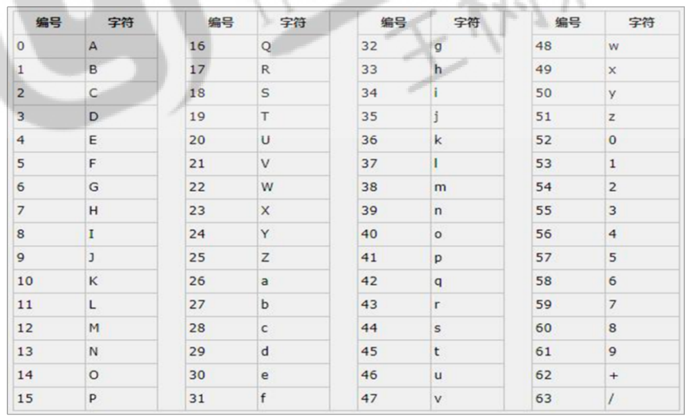
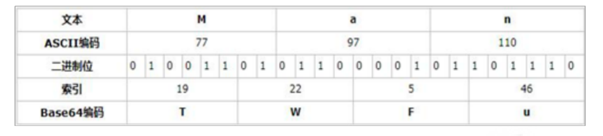
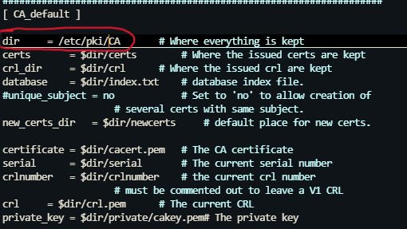

# Base64

```shell
man ascii
```



1. 将每3个字节放入一个24位的缓冲区中， 最后不足3个字节的，缓冲区的剩余部分用0来填补。 
2. 然后每次取出6位（2的6次方为64，使用64个字符即可表示所有），将高2位用0来填充，组成一个新的字节， 计算出这个新字节的十进制值，对应上面的编码表，输出相应的字符。 
3. 这样不断地进行下去，就可完成对所有数据的编码工作。



```powershell
echo Man | base64

	echo Man 实际上 Man 后面跟了一个换行符
    \n是显式指定的换行符，cat -v会将其显示为$
解析：
 换行符在 ascii 中对应的10进制数刚好是10，10换成8位二进制是 00001010,但 base64 以6位二进制来定义一个字符。所以 00001010 会被分为 000010 和 10 两部份，
 
 第一部份从低位开始算，000010对应10进制就是 2，则 base64 中就是 C
 
 第二部份会被算成高位，10后面补4个0,就变成 100000, 对应10进制是32，则base64中就是g,由于后面补了4个0，所以再标记两个==

# 不带换行
echo -n Man | base64
```


# openssl

## openSSL基础

Openssl功能主要包括对称加密（DES、3DES、AES等），非对称加密（RSA），散列（MD5、SHA1等） 以及证书的相关操作（创建、申请、颁发、吊销等）。


组成部分：

```powershell
libcrypto：
 	具有通用功能的加密库，包含了众多加密算法，如AES、DES、RSA等，用于加密和解密数据，以及生成和管理密钥。
 	
libssl：
 	实现SSL/TLS协议的客户端与服务器端功能，为网络通信提供加密隧道，确保数据在传输过程中的安全性。
 	
openssl：
 	一个多功能的命令行工具，允许用户执行从密钥生成到进行复杂的SSL/TLS测试等一系列操作。它提供了丰富的命令和选项，方便用户进行加密、解密、签名、验证等操作。

```

三类：

* Standard commands 非对称
* Message Digest commands 单向
* Cipher commands 对称

```shell
# 列出所有算法
openssl help
```

## 单向（摘要）

```shell
root@loong:~# openssl list -digest-commands
blake2b512        blake2s256        md5               rmd160            
sha1              sha224            sha256            sha3-224          
sha3-256          sha3-384          sha3-512          sha384            
sha512            sha512-224        sha512-256        shake128          
shake256          sm3
```

```shell
openssl md5 file
md5sum <<< "1"
openssl dgst -md5 file

openssl sha256 file
sha256sum <<< "1"
openssl dgst -sha256 file
```

## 密码生成

```shell
openssl passwd
	-1                 #使用MD5 加密算法
    -6                 #使用SHA512 算法加密
    -5                 #使用SHA256 算法加密
    -salt val           #手动指定盐值，默认每次自动随机生成
    
openssl passwd -1 -salt abcd1234 123456
```

## 随机数

```powershell
/dev/random #仅从熵池返回随机数；随机数用尽，阻塞   

/dev/urandom #从熵池返回随机数；随机数用尽，会利用软件生成伪随机数，非 阻塞
```

```shell
openssl rand NUM
NUM 				#字符个数
-base64             #base64编码后显示
-hex               	#16进制显示
-engine val         #指定随机数发生设备
```

## 密钥对生成

先有私钥，再有公钥

**非对称加密的基本原理**

- **私钥（Private Key）**：由用户随机生成，必须保密。
- **公钥（Public Key）**：由私钥派生，通过数学算法计算得出，可公开分发。
- 公钥和私钥具有特殊的数学关系：
  - 数据用公钥加密后，只有对应的私钥可以解密。
  - 数据用私钥签名后，公钥可以验证签名的有效性。

#### 私钥

```shell
openssl genrsa -out private.pem 2048

## 2048指定了密钥的长度（位数），可以根据需要调整（如1024、4096等）
## 生成的私钥文件通常以.pem或.key为扩展名

openssl genpkey -algorithm ED25519 -out private_key.pem
```

#### 公钥

```shell
openssl rsa  -in private.pem -pubout -out public.pem
-pubout           #指定导出公钥，默认输出私钥

openssl pkey -in private_key.pem -pubout -out public_key.pem
```

## 非对称加密

```shell
openssl pkeyutl [options]
-encrypt：使用 RSA 公钥加密数据。
-decrypt：使用 RSA 私钥解密数据。
-inkey file：指定私钥文件。
-pubin：从标准输入读取公钥，或者如果 -inkey 指定的文件包含公钥，则使用该公钥。
```

```shell
加密
openssl pkeyutl -encrypt -in hello.txt -inkey public.pem -pubin -out hello.en

解密
openssl pkeyutl -decrypt -in hello.en -inkey private.pem -out hello.de
```

## 签名

```shell
 -binary 		二进制输出

# 签名
openssl dgst -sha1 -sign private.pem -out sign.txt hello.txt
-sha1指定了摘要算法，
-sign指定了私钥文件，
-out指定了签名文件的名称。

# 验签
openssl dgst -verify public.pem -sha1 -signature sign.txt hello.txt
-verify指定了公钥文件，
-sha1指定了摘要算法（与签名时一致），
-signature指定了签名文件的名称。
```

# CA证书

基本流程

1. 生成私钥： 
   * 使用OpenSSL等工具生成CA的私钥，这是CA用于签名证书的关键。 
2. 创建自签名证书： 
   * 利用生成的私钥，CA可以创建自己的自签名证书。这个证书是CA自己的身份证明，用于签发其他证书。 
3. 设置数据库和序列号文件：
   * 为CA创建数据库文件（用于存储证书信息）和序列号文件（用于生成唯一的证书序列号）。 
4. 颁发证书： 
   * 当内部实体需要数字证书时，它们会生成自己的私钥和证书签名请求（CSR），然后将CSR提交给CA。CA 验证实体的身份后，使用自己的私钥对CSR进行签名，生成数字证书，并颁发给实体。 
5. 吊销证书： 
   * 如果某个数字证书需要被吊销（例如私钥泄露或证书过期），CA可以将其标记为吊销状态，并更新证书吊 销列表（CRL）


```shell
yum install openssl-libs
cat /etc/pki/tls/openssl.cnf		# 配置文件

apt install openssl libssl-dev
cat /etc/ssl/openssl.cnf			# 配置文件
```



```shell
# 生成目录结构
mkdir -pv /etc/pki/CA/{certs,crl,newcerts,private}
touch /etc/pki/CA/index.txt
echo 01 > /etc/pki/CA/serial

/etc/pki/CA
├── cacert.pem  	# CA自签证书(放在这里)
├── certs         	# (d) 存放发布的证书
├── crl             # (d) 证书的吊销列表
├── index.txt   	# 索引数据库
├── newcerts  		# (d)颁发的新证书备份到这里
├── private     	# (d)自己的私钥
└── serial        	# 证书的序列号
```

windows主机，默认 pem后缀的不识别，将.pem 改为.pem.crt 或者 直接改为 .crt


## CA创建自签证书

### 生成CA私钥

```shell
(umask 077; openssl genrsa -out /etc/pki/CA/private/cakey.pem 2048)
```


### 生成CA自签证书

```shell
openssl req -new -x509 -key /etc/pki/CA/private/cakey.pem -days 3650 -out /etc/pki/CA/cacert.pem
```


### 查看自签证书

```shell
openssl x509 -in /etc/pki/CA/cacert.pem -noout -text
```

## 请求并创建证书

### 请求主机创建私钥

```shell
openssl genrsa -out /root/rockySkey.key 2048
```

### 请求主机创建请求

`.csr` 文件

Certificate Signing Request（证书签名请求）

```shell
openssl req -new -key /root/rockySkey.key -out /root/rockyRequest.csr

## 如果证书申请文件中的配置项与CA机构的匹配规则不一致，将无法签发证书
```

### CA使用请求主机的请求创建它的证书

```shell
openssl ca -in /root/CArequest/rockyRequest.csr -out /etc/pki/CA/certs/rockyCA.crt -days 100
```

## 吊销证书

### 获取要吊销证书的serial

```shell
openssl x509 -in /etc/pki/CA/certs/rockyCA.crt -noout -serial -subject
```

### 根据serial吊销证书

```shell
openssl ca -revoke /etc/pki/CA/newcerts/01.pem
```

### 指定第一个吊销的证书编号（仅第一次吊销证书需要此操作）

```shell
echo 01  > /etc/pki/CA/crlnumber
```

### 更新证书吊销列表

```shell
openssl ca -genctl -out /etc/pki/CA/crl.pem
```

### 查看证书吊销列表

```shell
openssl crl -in /etc/pki/CA/crl.pem -noout -text
```

