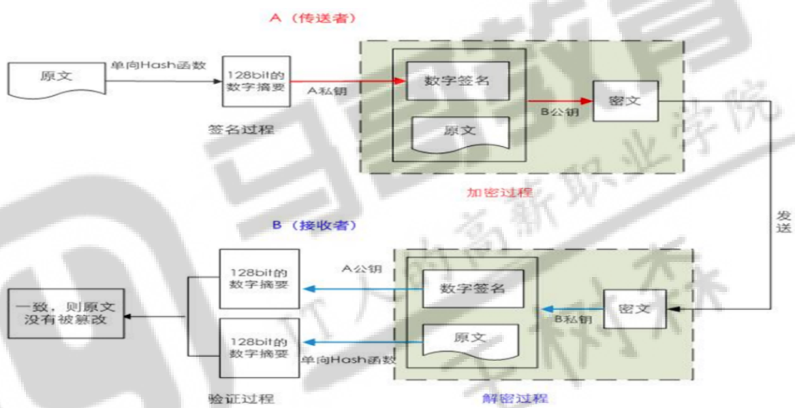
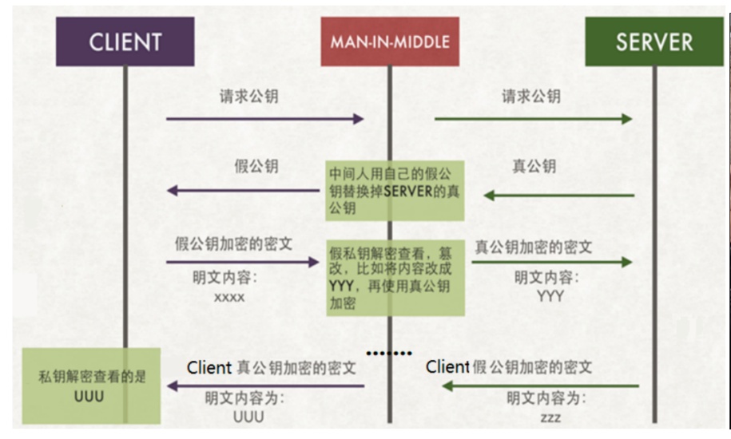
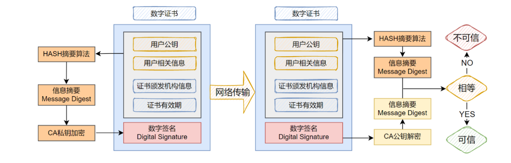
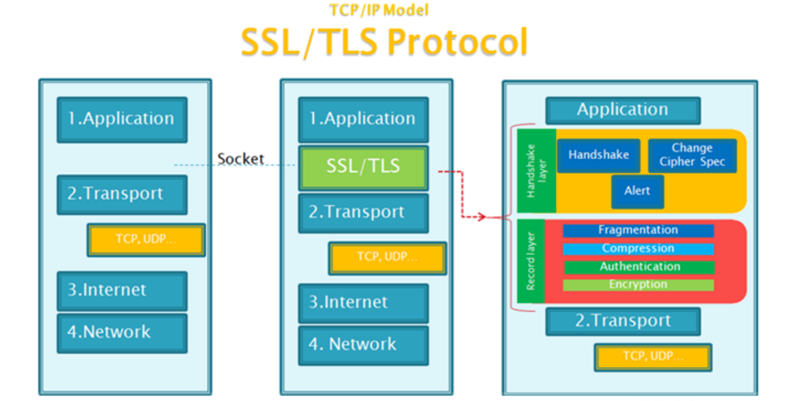

# 加密算法

## 对称加密

加密、解密使用同一个密钥，效率高；


### DES data encryption standard （数据加密标准）


### 3DES


### AES 高级加密标准


## 非对称加密

采用配对的公钥(public key)和私钥(secret key)对数据进行加解密操作


### RSA （Rivest-Shamir-Adleman算法）


### DSA（Digital Signature Algorithm）数字签名算法


### ECC（椭圆曲线密码学）


## 单向加密

### MD5


### SHA 256


# 数字签名

保证数据来源的可靠性、数据的完整性和一致性

## 签名

发送方：

```shell
data+SecretKey(hash(data))
```

接收方：

```powershell
接收到： data+SecretKey(hash(data))

PublicKey(SecretKey(hash(data))) == hash(data)[发送方]

hash(data[接收方接受的])

对比：
hash(data)[发送方] == hash(data[接收方接受的])[接收方]
相等验证成功
不等失败
```

## 签名+非对称

### Pk{Sk[hash(data)]+data}




# 密钥交换


# 证书&协议

### 中间人攻击



## CA证书

Linux的CA（Certificate Authority）认证是一种用于确保网络通信安全的技术。

CA认证，即证书 颁发机构认证，是一种通过数字证书来验证通信双方身份的技术。


CA机构的公钥已经内置在操作系统中了，操作系统已经天然的相信它了。




如果中间人改动公钥，信息摘要对不上

如果改动公钥和重新生成摘要并用自己的私钥加密。接收方使用CA公钥解密解不开，中间人被发现。


## 安全协议 SSL/TLS

```powershell
	SSL（Secure Sockets Layer）：安全套接层协议，最初由Netscape公司在1990年推出，用于在网络通信中建立Web浏览器和Web服务器之间的加密链接。它从1994年开始出现，到1996年升级到SSL3.0。
	
     SSL版本：包括SSL 1.0（未公开）、SSL 2.0（已废弃）、SSL 3.0（已废弃，存在安全漏洞）。
```

```powershell
	TLS（Transport Layer Security）：传输层安全协议，由IETF（互联网工程任务组）在SSL3.0的基础上设计，实际上相当于SSL的后续版本，提供了更强大的安全功能。目前主要使用的是TLS1.2,最新版是
	2018年出现的TLS1.3。
     TLS版本：包括TLS 1.0（存在安全漏洞）、TLS 1.1（存在安全漏洞）、TLS 1.2（需注意配置和更新）、TLS 1.3（提供了更高的安全性和效率）。
```

主要功能：

```powershell
数据加密：SSL/TLS协议能够对传输的数据进行加密，从而防止数据在传输过程中被窃听或篡改。

身份验证：通过证书认证机制，SSL/TLS协议可以确保通信双方的身份真实可靠。

数据完整性：传送的消息包括消息完整性检查（如使用MAC），以确保数据在传输过程中未被篡改
```

### SSL/TLS组成



SSL有很多子协议 

- Handshake协议：包括协商安全参数和密码套件、服务器身份认证（客户端身份认证可选）、密钥交换 
- ChangeCipherSpec 协议：一条消息表明握手协议已经完成 
- Alert 协议：对握手协议中一些异常的错误提醒，分为fatal和warning两个级别，fatal类型错误会 
- 直接中断SSL链接，而warning级别的错误SSL链接仍可继续，只是会给出错误警告 
- Record 协议：包括对消息的分段、压缩、消息认证和完整性保护、加密等

### HTTPS

HTTPS 协议：就是“HTTP 协议”和“SSL/TLS 协议”的组合。HTTP over SSL 或 HTTP over TLS  ，对http协议的文本数据进行加密处理后，成为二进制形式传输。