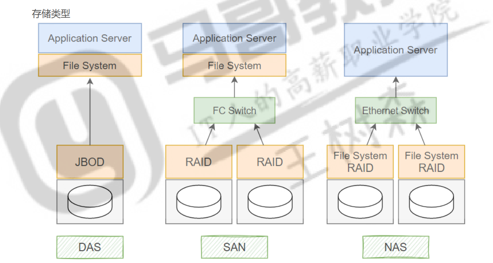
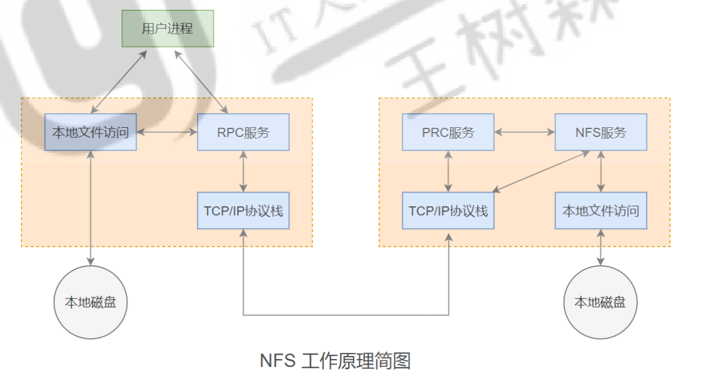

# ELK 日志服务

ELK 是三个开源软件的缩写，分别表示：Elasticsearch , Logstash, Kibana , 它们都是开源 软件。在后续发展的过程中增加了一个  FileBeat，这几款软件通常在一起配合使用，各司其职。ELK 主要 用于部署在企业架构中，收集多台设备上多个服务的日志信息，并将其统一整合后提供给用户。

# rsyslog

Linux日志服务管理主要涉及对系统中产生的各种日志文件进行收集、分析、备份、轮转和删除等操作， 以便监控系统的运行状况、诊断和解决问题，并提高系统的安全性和性能。 

日志记录的内容包括：

- 历史事件：时间，地点，人物，事件
- 日志级别：事件的关键性程度，Loglevel


rsyslog 主要用于单机日志管理

ELK 主要用于分布式集群环境中的日志管理。

## 基础

```powershell
	Rsyslog是一个开源工具，基于syslog协议完成系统日志的处理转发，它可用于接受来自各种来源的输入，转换它们，并将结果输出到不同的目的地。
	
	Rsyslog提供了高性能、强大的安全功能和模块化设计，支持多种输入和输出模块，可以与各种设备和系统集成，例如syslog、TCP、UDP、TLS等。同时，它还支持多种过滤和处理规则，可以根据需求定制化日志的存储、转发和处理方式。
```

### 特性

1. 支持输出日志到**各种数据库**，如 MySQL，PostgreSQL，MongoDB ElasticSearch，实现使用第三方服务对日志进行存储和分析； 
2. 精细的输出**格式控制**以及对日志内容的强大**过滤**能力，可实现过滤记录日志信息中的指定部份； 
3. 通过 RELP + TCP 实现数据的**可靠传输** 
4. 支持数据的**加密和压缩**传输等 
5. **多线程**

### 配置规则的相关概念

#### 设施

* facility 设施，从功能或程序上对日志进行归类
  * rsyslog 将日志进行了分类，相同类型的日志放一个文件，这样便于管理。

| **分类**                | **描述**                                        |
| ----------------------- | ----------------------------------------------- |
| **LOG_AUTH**            | 安全和认证相关的日志 (`auth`)                   |
| **LOG_AUTHPRIV**        | 安全和认证相关的日志，但具有私密性 (`authpriv`) |
| **LOG_CRON**            | 系统定时任务 (`crontab` 和 `at`) 相关的日志     |
| **LOG_DAEMON**          | 守护进程（后台服务）产生的日志 (`daemon`)       |
| **LOG_FTP**             | FTP 服务或守护进程产生的日志 (`ftp`)            |
| **LOG_KERN**            | 内核产生的日志信息 (`kern`)                     |
| **LOG_LOCAL0 - LOCAL7** | 自定义分类日志 (`local0` 到 `local7`)           |
| **LOG_LPR**             | 打印服务相关日志 (`lpr`)                        |
| **LOG_MAIL**            | 邮件服务相关的日志 (`mail`)                     |
| **LOG_NEWS**            | 网络新闻服务产生的日志 (`news`)                 |
| **LOG_SYSLOG**          | syslog 服务自身产生的日志 (`syslog`)            |
| **LOG_USER**            | 用户级别的日志 (`user`)                         |
| **LOG_UUCP**            | UUCP 子系统产生的日志 (`uucp`)                  |
| **`\*`（通配符）**      | 匹配所有日志分类                                |

```powershell
在 rsyslog 中，LOG_LOCAL0 到 LOG_LOCAL7 是一组特殊的日志设施（facility），它们被设计为供本地使用或开发者自定义的软件类别使用。这些设施允许系统管理员或开发者将特定服务的日志消息定向到指定的日志文件或执行特定的动作。

具体来说，每个 LOG_LOCAL 设施（从 LOG_LOCAL0 到 LOG_LOCAL7）都可以被视为一个自定义的日志通道，用于收集和记录来自特定应用程序或服务的日志信息。

注意：在rsyslog中，LOG_LOCAL0 到 LOG_LOCAL7 并不代表日志的级别，它仅用于自定义日志分类的设施标识
```

#### 优先级别

* Priority 优先级别，从高到低排序

| **日志级别**       | **描述**                                |
| ------------------ | --------------------------------------- |
| **LOG_EMERG**      | 紧急，致命错误（emerg/panic）           |
| **LOG_ALERT**      | 警告，当前状态必须立即进行纠正（alert） |
| **LOG_CRIT**       | 关键状态的警告，例如硬件故障（crit）    |
| **LOG_ERR**        | 其它错误（err/error）                   |
| **LOG_WARNING**    | 警告级别的信息（warning/warn）          |
| **LOG_NOTICE**     | 通知级别的信息（notice）                |
| **LOG_INFO**       | 通告级别的信息（info）                  |
| **LOG_DEBUG**      | 调试程序时的信息（debug）               |
| **`\*`（通配符）** | 所有级别的日志（所有日志）              |
| **none**           | 不需要任何日志                          |

#### 比较表达式

| **比较表达式**   | **功能描述**                                                 | **示例**                                                   |
| ---------------- | ------------------------------------------------------------ | ---------------------------------------------------------- |
| **contains**     | 判断字段是否包含指定的值（**区分大小写**）。                 | `if $msg contains "error" then /var/log/error.log`         |
| **contains_i**   | 判断字段是否包含指定的值（**不区分大小写**）。               | `if $msg contains_i "error" then /var/log/error.log`       |
| **isequal**      | 判断字段的内容是否与指定值完全相等（**区分大小写**）。       | `if $syslogfacility isequal "auth" then /var/log/auth.log` |
| **startswith**   | 判断字段的内容是否以指定值开头（**区分大小写**）。           | `if $msg startswith "WARN:" then /var/log/warning.log`     |
| **startswith_i** | 判断字段的内容是否以指定值开头（**不区分大小写**）。         | `if $msg startswith_i "warn:" then /var/log/warning.log`   |
| **regex**        | 使用基本正则表达式（Basic Regex）匹配字段内容。              | `if $msg regex "^[A-Z].*error$" then /var/log/error.log`   |
| **ereregex**     | 使用扩展正则表达式（Extended Regex）匹配字段内容，支持更复杂的正则语法。 | `if $msg ereregex "(ERROR                                  |
| **isempty**      | 判断字段是否为空（**不需要指定值**）。                       | `if $msg isempty then /var/log/empty.log`                  |

#### 基于属性的过滤条件（Property-based Filters）

**支持的属性**

| **属性**         | **描述**                                      |
| ---------------- | --------------------------------------------- |
| `$msg`           | 日志消息内容。                                |
| `$syslogtag`     | 日志的标签（通常是程序名+冒号，如 `cron:`）。 |
| `$hostname`      | 日志来源主机的主机名。                        |
| `$fromhost`      | 日志的实际来源主机名或 IP 地址。              |
| `$fromhost-ip`   | 日志来源的主机 IP 地址。                      |
| `$programname`   | 生成日志的程序名。                            |
| `$pri-text`      | 日志的优先级（文本表示，例如 `info`）。       |
| `$rawmsg`        | 原始日志消息，包括前缀。                      |
| `$timegenerated` | 日志生成的时间戳。                            |

#### 动作

```shell
path/file      	# 将日志内容写到指定文件

-/path/file     # 将日志内容写到指定文件，异步写入
				## 使用异步写入会将日志写入缓存后再批量写入文件，适合高并发场景，但可能在宕机时丢失未写入的日志。

/dev/null       # 将日志内容输出到指定设备
```

一些动作，要加载对应的模块

| **动作类型**             | **功能描述**                                              | **示例**                                                     |
| ------------------------ | --------------------------------------------------------- | ------------------------------------------------------------ |
| **远程服务器转发**       | 将日志通过网络发送到远程服务器（支持 TCP、UDP 或 TLS）。  | `@192.168.1.1:514`（UDP） 或 `@@192.168.1.1:6514`（TCP/TLS） |
| **用户消息广播**         | 使用 `omusrmsg` 模块，将日志广播到所有已登录的用户。      | `:omusrmsg:*`                                                |
| **运行脚本或程序**       | 调用外部程序或脚本处理日志数据。                          | `                                                            |
| **发送到消息队列**       | 将日志写入 Linux 系统消息队列（需 `ommq` 模块）。         | `action(type="ommq")`                                        |
| **数据库存储**           | 将日志存储到数据库中（如 MySQL、PostgreSQL）。            | `action(type="ommysql" server="localhost" db="Syslog" uid="user" pwd="password")` |
| **队列输出**             | 将日志写入自定义队列，以延迟或批量处理日志。              | `action(type="omfile" file="/var/log/delayed.log" queue.type="LinkedList" queue.size="1000")` |
| **发送到 Kafka**         | 将日志数据发送到 Apache Kafka 中（需 `omkafka` 模块）。   | `action(type="omkafka" topic="logs" broker="192.168.1.1:9092")` |
| **发送到 Elasticsearch** | 将日志写入 Elasticsearch（需 `omelasticsearch` 模块）。   | `action(type="omelasticsearch" server="http://192.168.1.2:9200" template="template-name")` |
| **发送到 Redis**         | 将日志写入 Redis 数据库（需 `omredis` 模块）。            | `action(type="omredis" server="127.0.0.1" port="6379" key="syslog")` |
| **发送到 WebSocket**     | 将日志通过 WebSocket 发送到远程服务（需 `omhttp` 模块）。 | `action(type="omhttp" server="https://example.com/logs" method="POST" template="json")` |

## 配置文件

```
centos
/etc/rsyslog.conf

ubuntu
/etc/rsyslog.d/
```

* 全局配置
* 模块配置
  * UDP模块
  * TCP模块
* 规则

### 全局配置

```shell
$PreserveFQDN off  # 默认行为是用IP地址代替无法解析的主机名
```

### 配置

```shell
facility.priority[;facility.priority;...]		[!]compare-operation, "value" 	   action
```

```shell
*.info;mail.none;authpriv.none;cron.none                /var/log/messages
authpriv.*                                              /var/log/secure
mail.*                                                  -/var/log/maillog
cron.*                                                  /var/log/cron
*.emerg                                                 :omusrmsg:*
uucp,news.crit                                          /var/log/spooler
local7.*                                                /var/log/boot.log
```

| **日志规则**                               | **日志级别/设施**                                  | **日志目标**        | **说明**                                                     |
| ------------------------------------------ | -------------------------------------------------- | ------------------- | ------------------------------------------------------------ |
| `kern.*`                                   | 所有内核日志                                       | `/dev/console`      | 所有内核日志（`kern`）发送到控制台。                         |
| `*.info;mail.none;authpriv.none;cron.none` | 除了 `mail`, `authpriv`, `cron` 之外的 `info` 日志 | `/var/log/messages` | 除邮件、认证和定时任务外的所有信息级别日志记录到 `/var/log/messages`。 |
| `authpriv.*`                               | 所有认证相关日志 (`authpriv`)                      | `/var/log/secure`   | 所有认证日志（如 SSH 登录、sudo 操作等）记录到 `/var/log/secure`。 |
| `mail.*`                                   | 所有邮件相关日志 (`mail`)                          | `/var/log/maillog`  | 所有邮件相关日志记录到 `/var/log/maillog`。                  |
| `cron.*`                                   | 所有定时任务相关日志 (`cron`)                      | `/var/log/cron`     | 所有定时任务日志记录到 `/var/log/cron`。                     |
| `uucp,news.crit`                           | `uucp` 和 `news` 的严重错误日志 (`crit`)           | `/var/log/spooler`  | `uucp` 和 `news` 系统的严重错误日志记录到 `/var/log/spooler`。 |
| `*.emerg`                                  | 紧急级别日志 (`emerg`)                             | `:omusrmsg:*`       | 所有紧急级别日志发送给所有登录的用户。                       |
| `local7.*`                                 | 自定义设施 `local7` 的日志                         | `/var/log/boot.log` | `local7` 的日志记录到 `/var/log/boot.log`                    |

### 日志输出模板（全局配置中）

#### 预设模板

* RSYSLOG_TraditionalFileFormat RSYSLOG_FileFormat  
* RSYSLOG_TraditionalForwardFormat  
* RSYSLOG_SysklogdFileFormat  
* RSYSLOG_ForwardFormat  
* RSYSLOG_SyslogProtocol23Format  
* RSYSLOG_DebugFormat  
* RSYSLOG_WallFmt  
* RSYSLOG_StdUsrMsgFmt  
* RSYSLOG_StdDBFmt  
* RSYSLOG_StdPgSQLFmt  
* RSYSLOG_spoofadr  
* RSYSLOG_StdJSONFmt


#### 自定义模板

```shell
template(name="MyTpl" type="list") {  
	property(name="timestamp" dateFormat="rfc3339")  
	constant(value=" ")  
	property(name="hostname")  
	constant(value=" ")  
	property(name="syslogtag")  
	constant(value=" ")  
	property(name="msg" spifno1stsp="on" droplastlf="on")  
	constant(value="\n")  
}
```

```shell
$template MyTpl,"%timestamp::date-rfc3389% %HOSTNAME% %syslogtag% %msg%\n"
```

```shell
template(name="RSYSLOG_TraditionalFileFormat" type="string"
string="%TIMESTAMP% %HOSTNAME% %syslogtag% %msg:::sp-if-no-1stsp% %msg:::drop-last-lf%\n")

%msg:::sp-if-no-1stsp%	# 如果消息体没有以空格开头，则在输出时加一个空格（sp 是 space 的缩写）。
%msg:::drop-last-lf%	# 移除消息体的最后一个换行符（如果有换行符）。
%APP-NAME%				# 
%FROMHOST%				# 日志的实际来源 IP 地址。优先返回主机名（通过 DNS 解析 IP 地址）。如果无法解析主机名，则返回来源						# 的 IP 地址。
%FROMHOST-IP%			# 日志来源的纯 IP 地址
```

#### 使用模板

```shell
## 模块使用模板
module(load="builtin:omfile" Template="RSYSLOG_TraditionalFileFormat")
```

动作（`action`）中覆盖模块默认模板，指定新的模板格式。

```shell
## 动作使用模板
*.* action(type="omfile" file="/var/log/custom.log" template="RSYSLOG_TraditionalFileFormat")
```

## logger 以手动生成相关日志

```shell
logger -t httpd-error -p local1.err "This is a test error log"
# -t  标签tag
# -p  指定日志的 设施（facility） 和 级别（severity）。
```

## 服务日志的rsyslog托管

可以用在服务中（找到各个服务中的日志配置）

比如将httpd的日志交给rsyslog管理

原本是直接输出到/var/logs/error_log文件中

```shell
# /etc/httpd/conf/httpd.conf中的配置
ErrorLog "logs/error_log"
```

改为

```shell
ErrorLog "|/usr/bin/logger -t httpd-error -p local1.err"
```


## mysql转储日志实践

### log服务器安装rsyslog-mysql（rsyslog模块）

```shell
apt install rsyslog-mysql
yum install rsyslog-mysql
```

#### 将SQL建表文件传输给MySQL服务器

* rocky

```bash
/usr/share/doc/rsyslog/mysql-createDB.sql
```

* ubuntu

```shell
/usr/share/dbconfig-common/data/rsyslog-mysql/install/mysql
```

传输文件到MySQL服务器

```shell
scp /path/of/file root@10.0.0.12:/root/rsyslog.sql
```

### log服务器配置rsyslog的模块与规则

在对应的rsyslog配置文件中配置

* 模块

```shell
module (load="ommysql")
```

* 规则

**rocky将rsyslog改为Syslog**

```shell
*.* action(type="ommysql" server="_DBC_DBSERVER_" db="rsyslog" uid="rsysloger" pwd="123456")
```

```shell
systemctl restart rsyslog.service
```

###  MySQL服务器配置

```shell
apt install mysql-server -y
yum install mysql-server -y

## 记得启动服务
```

#### Mysql端口监听

默认情况下，MySQL 可能只监听 `localhost`。你需要检查 MySQL 配置文件（通常是 `/etc/my.cnf` 或 `/etc/mysql/my.cnf`）中的 `bind-address` 设置，确保它允许来自其他机器的连接。

```shell
## 使 MySQL 接受来自任何 IP 地址的连接。如果只想允许特定 IP 地址（如你的 rsyslog 服务器）连接，可以将其设置为特定的 IP 地址。
bind-address = 0.0.0.0
```

#### 创建数据库

rocky中有创建数据库语句（Syslog），不需要自己创建；跳过这步。


* ubuntu中只有建表语句，没建库语句，需要自己建库。

```shell
mysql -e "create database rsyslog;"
```

#### 导入SQL文件建表

* ubuntu

```shell
mysql -e "use rsyslog; source /root/rsyslog.sql;"
```

* rocky

```shell
mysql -e "source /root/rsyslog.sql;"
```

**rocky将rsyslog改为Syslog**

```shell
 # 确认效果
 mysql -e "show tables from rsyslog;"
```

#### 创建rsysloger用户并授权

**rocky将rsyslog改为Syslog**

```shell
mysql -e "create user 'rsysloger'@'10.0.0.%' identified by '123456';"
mysql -e "grant all on rsyslog.* to 'rsysloger'@'10.0.0.%';"
mysql -e "create user 'rsysloger'@'localhost' identified by '123456';"
mysql -e "grant all on rsyslog.* to 'rsysloger'@'localhost';"
mysql -e "flush privileges;"

## % 是通配符，表示任何以 10.0.0. 开头的 IP
## grant all: 授予该用户对指定数据库的所有权限（包括 SELECT、INSERT、UPDATE、DELETE 等）
## on rsyslog.*: 指定该权限适用于 rsyslog 数据库的所有表（* 表示所有表）。省略.*语法错误
## flush privileges: 告诉 MySQL 重新加载用户权限表，以确保新创建的用户及其权限立即生效。
```

```shell
 ## 查看效果
 mysql -ursysloger -p123456 -e "show tables from rsyslog"
```

### 测试mysql转储

* log服务器

```shell
 logger "this msg from rocky-client 1"
 logger "this msg from rocky-client 2"
 logger "this msg from log-server"
```

* MySQL服务器

**rocky将rsyslog改为Syslog**

```shell
mysql -e "use rsyslog; select FromHost,Message from SystemEvents order by id desc limit 3;"
```

# 其他日志

## btmp 用户的失败尝试登录相关的日志

当前系统上，用户的失败尝试登录相关的日志 ( bad logins )，二 进制格式

```shell
# 文件位置
/var/log/btmp

# 查看命令
lastb
```

## lastlog 每一个用户最近一次的登录信息

每一个用户最近一次的登录信息，二进制格式

```shell
# 文件位置
/var/log/lastlog

# 查看命令
lastlog
```

## wtmp 用户正常登录系统的相关日志信息

当前系统上，用户正常登录系统的相关日志信息 ( who was logged in )，二进制格式

```shell
# 文件位置
/var/log/wtmp

# 查看命令
last
```

## dmesg 查看主机硬件相关日志

查看主机硬件相关日志


# 日志工具

日志事件都由 systemd 的 journald 守护进程来处理。journald 守 护进程收集所有来自 Linux 操作系统的各种日志，并将其作为二进制数据存储在文件中。


默认情况下，系统的日志一般会存两份： 

* 一份是文本的，由rsyslog去存 
* 一份是二进制的，由journald去存，由journctl去管理

## journalctl

journalctl是Linux系统中一个用于查看和管理日志信息的命令行工具，它是systemd日志记录系统 （systemd-journald服务）的一部分。

```shell
journalctl -xeu service.service

-x				# 显示详细的日志信息，包括与日志条目相关的所有上下文信息
-e				# 显示的时候，直接跳转到内容的末尾
-u				# 根据单元查看日志
-b				# 查看服务详细启动日志
--list-boots	# 列出系统启动日志
-f				# 日志跟随，显示最新日志
-r				# 倒序显示
-k				# 查看内核日志


journalctl -S "2023-10-18 12:0:0" -U "2024-10-18 15:30:0"
journalctl -S yesterday
journalctl --since "100 hour ago" --until "1 hour ago"

journalctl _PID=1
journalctl _UID=0

journalctl -p warning
journalctl --facility=auth
```


## logrotate 日志转储服务 

logrotate 程序是一个日志文件管理工具。用来把旧的日志文件删除，并创建新的日志文件，称为日志 转储或滚动。可以根据日志文件的大小，也可以根据其天数来转储，这个过程一般通过 cron 程序来执行。

```shell
 cat /etc/logrotate.conf
 
weekly                                    # 默认每周一次转储              
su root adm                               # 默认使用 adm 组              
rotate 4                                  # 默认保留4个文件
create                                    # 转储完成后生成新的空文件              
dateext                                   # 默认不使用日期后缀             
compress                                  # 默认不启用文件压缩             
include /etc/logrotate.d                  # 包含的子目录              
```

```shell
cat /etc/logrotate.d/rsyslog
/var/log/syslog
/var/log/mail.log
/var/log/kern.log
/var/log/auth.log
/var/log/user.log
/var/log/cron.log
{
        rotate 4
        weekly
        missingok				# 如果要转储的日志文件不存在，不提示错误，继续下一个
        notifempty				# 如果是空文件，不转储
        compress
        delaycompress			# 和 compress 一起使用时，转储的日志文件到下一次转储时才压缩
        sharedscripts			# 运行脚本，分别是转储前和转储后脚本
        
        postrotate				# 转储后脚本
                /usr/lib/rsyslog/rsyslog-rotate
        endscript				# 脚本结束块
}
```

```shell
prerotate 			# 转储前脚本
endscript

create <mode> <owner> <group>		# 指定新日志文件的权限（使用八进制格式，如 0644、0600 等）

daily #指定转储周期为每天
weekly #指定转储周期为每周
monthly

size <size>
# 无单位：默认为字节（bytes）。
# k：表示千字节（kilobytes）。
# M：表示兆字节（megabytes）。
# G：表示吉字节（gigabytes）。
```

**总结**

| **指令**               | **作用**                                                     |
| ---------------------- | ------------------------------------------------------------ |
| **`nocompress`**       | 禁用日志压缩。                                               |
| **`copytruncate`**     | 复制日志后截断原文件，适合日志文件无法关闭的应用。<br>将当前日志文件的内容复制到备份文件。然后截断原日志文件，使其大小为 0，供继续写入。 |
| **`nocopytruncate`**   | 禁用截断功能，默认行为。                                     |
| **`nocreate`**         | 禁止轮换后自动创建新日志文件。                               |
| **`su user group`**    | 设置轮换时使用的用户和用户组。                               |
| **`nodelaycompress`**  | 禁用延迟压缩，立即压缩轮换后的日志文件。                     |
| **`errors address`**   | 在轮换出错时发送邮件通知。                                   |
| **`ifempty`**          | 空文件时也触发轮换。                                         |
| **`notifempty`**       | 空文件时不触发轮换。                                         |
| **`mail address`**     | 将轮换后的日志通过邮件发送到指定地址。                       |
| **`nomail`**           | 禁用邮件发送功能。                                           |
| **`olddir directory`** | 将轮换后的日志文件存储到指定目录中。                         |
| **`noolddir`**         | 禁用旧日志文件目录功能，轮换后的日志保存在原目录。           |
| **`tabooext`**         | 指定哪些扩展名的文件不应轮换。                               |
| **`sharedscripts`**    | 只在所有日志文件轮换完成后运行脚本。                         |
| **`nosharedscripts`**  | 为每个日志文件单独运行脚本。                                 |
| **`nomissingok`**      | 禁用 `missingok`，日志文件不存在时抛出错误。                 |

```shell
# 手动执行转储
logrotate /etc/logrotate.d/test1.log

# 调用配置文件
logrotate -f /etc/logrotate.conf
```

# 共享存储

## 存储类型




直连式存储：Direct-Attached Storage (DAS)

​		可以理解为本地文件系统。这种设备直接连接到计算机主板总线上，通常是SCSI 或 FC 连接，计算机 将其识别为一个块设备，例如常见的硬盘，U盘等，也可以连到一个磁盘阵列柜，里面有很多块磁盘。 DAS 只 能连接一台服务器，其它服务器无法共享该存储。


存储区域网络：Storage Area Network (SAN)

​		存储区域网络，这个是通过光纤通道或以太网交换机连接存储阵列和服务器主机，最后成为一个专用的存 储网络。SAN经过十多年历史的发展，已经相当成熟，成为业界的事实标准（但各个厂商的光纤交换技术不完 全相同，其服务器和SAN存储有兼容性的要求）


网络附加存储：Network-Attached Storage (NAS)

​		NAS存储也通常被称为附加存储，顾名思义，就是存储设备通过标准的网络拓扑结构(例如以太网)添加到 一群计算机上。与DAS以及SAN不同，NAS是文件级的存储方法。采用NAS较多的功能是用来进行文件共享。而 且随着云计算的发展，一些NAS厂商也推出了云存储功能，大大方便了企业和个人用户的使用。NAS产品是真正 即插即用的产品。 

​		NAS设备一般支持多计算机平台，用户通过网络支持协议可进入相同的文档，因而NAS设备无需改造即可 用于混合Unix/Windows NT局域网内，同时NAS的应用非常灵活。

## 存储方式

* 块存储（本地硬盘）
  * 块存储（Block Storage Service）设备不能被操作系统直接访问，需要创建分区或逻辑卷，再创建 文件系统 (EXT3, EXT4, NTFS 等)，然后再经过挂载，才能使用。对于主机而言，其并不能识别出存储设 备是真正的物理设备还是二次划分的逻辑设备（RAID等），块存储不仅仅是直接使用物理设备，间接使用物理 设备的也叫块设备。比如虚拟机上创建的虚拟磁盘。 
  * 块存储大多数时候是本地存储，读写速度很快，但不利于扩展，数据不能被共享。
* 文件存储（移动磁盘）
  * 文件存储（File Storage Service）可以分为本地文件存储和网络文件存储。文件存储最明显的特征 是支持POSIX的文件访问接口，例如 open、read、write、seek、close 等 (这几个是常用的文件操作 API接口 )，与块存储不同，主机不需要再对文件存储进行格式化和创建文件系统，文件管理功能已由文件存 储自行管理。
  * 文件存储的特点是便于扩展和共享，但读写速度较慢。
* 对象存储（网盘）
  * 对象存储（Object Storage Service）也叫基于对象的存储，是一种解决和处理离散单元的方法，可 提供基于分布式系统之上的对象形式的数据存储服务。对象存储和我们经常接触到的块和文件系统等存储形态 不同，它提供 RESTful API数据读写接口及丰富的 SDK 接口，并且常以网络服务的形式提供数据的访问。 
  * 对象存储不支持随机读写，只能进行全读和全写操作（无法直接在存储上进行数据更改，只能以文件为单 位进行获取和删除），如果要修改数据，需要先在本地编辑完成后整文件上传。
  * 亚马逊的对象存储服务叫 S3(simple storage service),阿里云的对象存储叫OSS(Object  Storage Service)。
* 分布式存储


## NFS

网络文件系统：Network File System (NFS)，可以在本地挂载远程的存储空间，让本地用户和程序直接访问本地目录从而实现数据和存 储空间的共享。


NFS 中的远程访问是基于 RPC ( Remote Procedure Call Protocol，远程过程调用) 来实现的。



在NFS的工作流程中

前提：

* RPC服务需要先于NFS启动，NFS启动后，就会产生一些随机端口，然后向RPC服务去注册这些端口， 

* RPC提供了一组与机器、操作系统以及底层传送协议无关的存取远程文件的操作，使得NFS能够在不同 的计算机系统和设备之间共享文件和资源。  

请求建立连接 

- 客户端首先通过RPC（Remote Procedure Call，远程过程调用）协议到服务器端的RPC上要功能 对应的端口号，然后客户端将请求发送给服务器所对应的端口号，并接收服务器返回的响应数据。 
- 此后的数据传输便不再经过RPC，只在客户端和服务端之间进行数据传输。


### RPC简介

RPC（Remote Procedure Call，远程过程调用）是一种允许程序调用另一台计算机上的子程序或服务的技术，而不需要了解网络的底层细节。RPC让不同主机上的程序像调用本地函数一样进行远程通信。RPC的目标是使得分布式计算更加简便，使开发者可以将多个系统的功能集成到一个应用程序中，而不需要处理复杂的底层通信细节。

RPC的基本过程通常可以分为以下几个步骤：

1. **客户端调用**：客户端程序发起对远程服务或过程的调用。
2. **请求封装**：客户端将请求（包括函数名、参数等）封装成消息，并通过网络传输给服务器。
3. **请求发送**：客户端将封装好的请求通过网络发送给远程服务器。
4. **服务器接收请求**：远程服务器接收到请求后，将请求解封装，提取出要执行的函数及其参数。
5. **执行远程过程**：服务器执行对应的函数或过程，并生成结果。
6. **返回响应**：服务器将结果封装成消息，并通过网络返回给客户端。
7. **客户端处理响应**：客户端收到响应后，解封装数据并处理结果。


- 服务寻址
- 数据流的序列化和反序列化
- 网络传输

rpcbind（也称为portmapper）是RPC服务的核心组件，它监听TCP和UDP的111端口，用于将RPC程序 编号转换为网络地址和端口号。当客户端想要调用远程RPC服务时，它会首先联系rpcbind来获取服务的实际 位置。

### NFS 部署

```shell
# nfs-utils包含了客户端工具和服务端工具
yum install rpcbind nfs-utils

# 服务端包
apt install nfs-kernel-server

# 客户端包
apt install nfs-common
```

```shell
systemctl start rpcbind.service

systemctl start nfs-utils.service
```

```shell
# 显示本机注册到RPC的服务
rpcinfo -p

# 显示远端注册到RPC的服务
rpcinfo -s 10.0.0.13
```

```shell
# 关闭rpc的服务
sudo systemctl stop rpcbind.service
sudo systemctl disable rpcbind.service

# 关闭rpc的端口监听
sudo systemctl stop rpcbind.socket
sudo systemctl disable rpcbind.socket
```


### NFS服务端

* 主要进程
  * /usr/sbin/rpc.mountd 
    * #挂载和卸载nfs文件系统，包括权限管理  
  * /usr/sbin/rpc.nfsd 
    * #主要的nfs进程，管理客户端是否可登录 
  * /usr/sbin/rpc.statd 
    * #非必要，检查文件一致性，可修复文件

```shell
# 日志目录
/var/lib/nfs/
├── etab
├── export-lock
├── nfsdcld
│   └── main.sqlite
├── reexpdb.sqlite3
├── rmtab
├── sm
├── sm.bak
├── state
└── v4recovery
```

#### 配置

共享规则配置

/etc/exports 

```shell
# Example for NFSv2 and NFSv3:
# 共享目录路径		客户端主机  配置项
# /srv/homes       hostname1(rw,sync,no_subtree_check) hostname2(ro,sync,no_subtree_check)
#
# Example for NFSv4:
# /srv/nfs4        gss/krb5i(rw,sync,fsid=0,crossmnt,no_subtree_check)
# /srv/nfs4/homes  gss/krb5i(rw,sync,no_subtree_check)
#
# 配置项默认是 (ro,sync,root_squash,no_all_squash)

# 配置项
ro 							# 只读
rw 							# 读写
root_squash 				# 压榨，远程客户端主机上的 root 用户映射成 NFS 主机上的 UID=65534 的nobody用户
all_squash 					# 压榨，所有客户端用户都映射成 NFS 主机上的 UID=65534 的用户
                            # - 此项会覆盖 no_root_squash
sync 						# 同步落盘，在请求数据时立即写入NFS的磁盘上，性能低，安全性高
async 						# 异步落盘，数据先暂存于缓冲区，再一次性落盘，性能高，安全性低
no_subtree_check 			# 不检查父目录权限
no_root_squash 				# 远程客户端主机 root 用户映射成 NFS 服务器的 root
anonuid 					# 指定用户映射成特定的用户的UID
anongid 					# 指定用户映射成特定的用户的GID
insecure 					# 允许非授权访问
subtree_check 				# 如果共享子目录，强制NFS 检查父目录权限
wdelay 						# 多个用户写时等待同时写
no_wdelay 					# 多个用户写时不等待，立即写，当使用 async 项时，无需此设置 
hide 						# 不共享NFS 服务中的子目录，在 NFSv4中无效
no_hide 					# 共享NFS 服务器上的子目录，在 NFSv4中无效
secure NFS 					# 服务通过1024以下的安全TCP/IP端口通讯
insecure NFS 				# 服务通过1024以上的安全TCP/IP端口通讯

```


#### 命令

注意共享目录的权限配置，这可能导致读写执行失败

```shell
chmod 777 /srv/share
```

```shell
# 用于管理本机 NFS 文件系统，默认配置文件是 /etc/exports
exportfs
-a 		#全部挂载
-r 		#重新挂载
-u 		#卸载
-v 		#显示本机共享

exportfs -ua
```

```shell
# 显示己连接的客户端
showmount -a
```


### NSF客户端

#### 命令

```shell
# 客户端，显示指定NFS服务器上的配置列表
showmount -e 10.0.0.13
```

```shell
# 将远程NFS 服务器上共享出来的目录挂载到本机，可以直接写成 mount
mount.nfs
-r #只读挂载
-v #显示详细信息
-V #显示版本
-w #读写挂载
-n #不更新/etc/fstab 文件，默认项
-o #指定挂载参数

fg 						#前台挂载，默认
bg 						#后台挂载
hard 					#持续请求，如果挂不上，一直重试
soft 					#非持续挂载
intr 					#是否可以强制中断，配合hard 选项，如果挂不上，可以ctrl+c 中断
rsize=n 				#指定一次读的最大字节数，值必须为1024的倍数，最大为1048576，最小为1024，
						# 如果小于1024会被替换成4096，不指定由客户端和服务端协商
wsize=n 				#指定一次写的最大字节数，值必须为1024的倍数，最大 1048576，最小1024，
						# 如果小于 1024 会被替换成 4096，不指定则由客户端和服务端协商
_netdev 				#无网络服务时不挂载NFS资源
vers=n|nfsvers=n 		#指定nfs 协议版本号，如果NFS 服务端不支持此版本，则无法挂载，默认4.2


mount -o rw,fg,hard,intr 10.0.0.13:/testdir /mnt/nfs/
```

# MinIO ：快速搭建自己的对象存储服务

to be continued

# 实时同步

将数据或文件进行实时同步，保证数据更新后其它节点能立即获得最新的 数据。

数据同步方式

```powershell
PULL：拉，
     使用定时任务的方式配合同步命令或脚本等，从指定服务器上将数据同步到本地，一般是周期性定时同步
PUSH：推，
     如果当前机器上的数据或文件发生更新了，立即推送到指定的节点上，可以做到实时同步
```

##  方案

1. rsync +inotify
   * rsync 是一个常用的文件同步工具，而 inotify 是一个 Linux 内核功能，可以监控文件系统事件。 你可以结合这两个工具来实现实时同步。  
2. Lsyncd 
   * Lsyncd 是一个基于 rsync 和 inotify 的实时文件同步工具，它简化了同步配置的复杂性。  
3. Sersync 
   *  类似 于inotify，同样用于监控，但它克服了 inotify 的缺点，inotify 最大的不足是会产生重复 事件。Sersync使用多线程进行同步，还自带 crontab 功能。

4. Samba/CIFS 挂载 
   * 如果你需要将一个目录实时挂载到另一个目录，并且你的网络环境允许，你可以使用 Samba/CIFS 挂载 来实现。  
5. NFS 
   * NFS（Network File System）也是一种常见的网络文件系统，适用于 Linux 系统之间的文件共享 和同步。

## inotify + rsync 实时同步

利用内核中的 inotify 监控指定目录，当目录中的文件或数据发生变化时，立即调用 rsync 服务将 数据推送到远程主机上。

要实现双向的同步，双方都要配置inotify + rsync，通过 **互相推送文件** 完成的。但需要注意循环同步和冲突解决。


### inotify

inotify 是一个内核用于通知用户空间程序文件系统变化的机制，在监听到文件系统发生变化后，会向 相应的应用程序发送事件，如文件增加，修改，删除等事件发生后可以立即让用户空间知道。

https://github.com/rvoicilas/inotify-tools 

inotify 内核参数

```powershell
root@ubuntu24-13:~# cat /proc/sys/fs/inotify/max_queued_events
16384
参数解读：
 	inotify 事件队列最大长度，如值太小会出现 Event Queue Overflow 错误，默认 16384, 
 	生产环境建议调大,比如 327679
 	
root@ubuntu24:~# cat /proc/sys/fs/inotify/max_user_instances 
128
参数解读：
 	每个用户创建inotify实例最大值，默认值 128
 	
root@ubuntu24-13:~# cat /proc/sys/fs/inotify/max_user_watches
65536
参数解读：
 	每个inotify实例可以监视的文件的总数量
 	该值在rocky系统中，默认值是 12820

也就是说：
	一个用户可以最多开128个inotify实例，每个实例最多可以监控65536个文件

定制专属参数配置文件
root@ubuntu24:~# cat /etc/sysctl.d/inotify.conf
fs.inotify.max_queued_events=66666
fs.inotify.max_user_instances=256
fs.inotify.max_user_watches=100000
应用内核参数文件
root@ubuntu24:~# sysctl -p /etc/sysctl.d/inotify.conf
fs.inotify.max_queued_events = 66666
fs.inotify.max_user_instances = 256
fs.inotify.max_user_watches = 100000
```

#### 部署

```shell
yum install epel-release
yum install inotify-tools

apt install inotify-tools
```

```shell
/usr/bin/fsnotifywait 		# fsnotify监控工具，fsnotify 是 inotify 的新版本
/usr/bin/fsnotifywatch 		# fsnotify统计工具
/usr/bin/inotifywait 		# 实时监控指定目录的所有事件，在被监控的文件或目录上等待特定事件发生(open,close,write..)
/usr/bin/inotifywatch 		# 收集被监控的文件系统使用的统计数据，指文件系统事件发生的次数统计
```

#### 命令

```shell
inotifywait [ options ] file1 [ file2 ] [ file3 ] [ ... ]

@<file>       					#排除指定文件
--exclude <pattern> 			#不监控指定的文件或目录，正则匹配
--excludei <pattern> 			#不监控指定的文件或目录，正则匹配，不区分大小写
--include <pattern> 			#仅监控指定的文件或目录，正则匹配
--includei <pattern> 			#仅监控指定的文件或目录，正则匹配，不区分大小写
-m|--monitor 					#始终保持监听，直到超时
-d|--daemon   					#以守护进程方式执行，配合-o使用
-P|--no-dereference 			#不跟随软链接
-r|--recursive 					#对目录递归监控，即监控目录内所有内容
--fromfile <file> 				#从文件中读取要监控的内容
-o|--outfile <file> 			#将执行结果输出到指定文件
-s|--syslog   					#错误输出到syslog，而不是标准错误输出
-q|--quiet   					#简短输出，仅输出事件信息
-qq           					#禁用输出
--format <fmt> 					#指定输出格式
--no-newline 					#不换行输出，配合--format字段
--timefmt <fmt> 				#指定时间输出格式
-c|--csv     					#以CSV格式输出
-t|--timeout <seconds> 			#指定超时时长，值为0则永远不超时
-e|--event <event1> 			#只监听指定事件，默认监听所有事件

# --format 
%T 								#输出时间格式中定义的时间格式信息，
								#通过 --timefmt option 语法格式指定时间信息
%w 								#事件出现时，监控文件或目录的名称信息，相当于dirname
%f 								#事件出现时，将显示监控目录下触发事件的文件或目录信息，
								#否则为空，相当于basename
%e 								#显示发生的事件信息，不同的事件默认用逗号分隔
%Xe 							#显示发生的事件信息，不同的事件指定用X进行分隔

# --timefmt
    %Y 							#年份信息，包含世纪信息
    %y 							#年份信息，不包括世纪信息
    %m 							#显示月份，范围 01-12
    %d 							#每月的第几天，范围是 01-31
    %H 							#小时信息，使用 24小时制，范围 00-23
    %M 							#分钟，范围 00-59
    %S 							#秒，范例 0-60

# -e
    access 						#文件或目录内容被读取
    modify 						#内容发生变化
    attrib 						#属性发生变化
    close_write 				#写入模式打开后关闭
    close_nowrite 				#只读打开后关闭
    close 						#关闭事件，无关模式
    open 						#打开事件，无关模式
    moved_to 					#文件或目录被移动到监控的目录中
    moved_from 					#文件或目录从监控的目录中被移动
    move 						#文件或目录不管移动到或是移出监控目录都触发事件
    move_self 					#被移动之后同名文件不再被监控
    create 						#创建文件或目录
    delete 						#文件或目录被删除
    delete_self 				#被删除之后同名文件不再被监控
    unmount 					#取消挂载

```

```shell
# 单次监控
inotifywait /data/

# 持续监控
inotifywait -m /data/

# 递归监控，监控目录下所有行为，否则就目录一层，监控不到目录下的目录
inotifywait -m -r /data/

# 输出到文件
inotifywait -m -r /data/ -o inotify.txt

# 后台守护执行，并指定输出格式
inotifywait -drq /data/ -o inotify.log --timefmt "%Y-%m-%d %H:%M:%S" --format "%T %w %f event: %e"

# 指定事件
inotifywait -mrq /data/ --timefmt "%F %H:%M:%S" --format "%T %w%f event:%;e" -e create,delete,moved_to,close_write,attrib
```

### rsync

同步和传输文件和目录的命令行工具。它支持在本地和远程系统之间同步数据，同时提供增量同步、压缩和传输安全等功能。`rsync` 广泛应用于备份、数据迁移和文件分发。

**增量传输**：只传输源和目标之间的差异数据，节省时间和带宽。

**高效性**：通过检查文件内容或元数据（如时间戳、大小），避免传输已同步的文件。

**远程同步**：支持通过 SSH 或 `rsync` 协议进行远程文件传输。

**数据压缩**：在传输前对数据进行压缩以节省带宽。

**灵活性**：支持复杂的文件选择、排除模式（使用通配符或正则表达式）。

**安全性**：结合 SSH 使用，保证传输的安全性。


rsync 有三种工作方式

1. 本地文件系统上实现同步。 
2. 本地主机使用远程ssh和远程主机通信。 
3. 本地主机通过网络套接字连接远程主机上的 rsync daemon。

前两者的本质是通过本地或远程shell

第3种方式则是让远程主机上运行 rsyncd 服务，通过监听端口，等待客户端的连接，使用的rsync的 专有协议。

#### 部署

873 端口

```shell
yum install rsync
apt install rsync
```

#### 命令

```shell
# 本地文件同步
rsync [OPTION]		SRC [SRC]  						DEST 

# 远程文件同步
#PULL 拉，将远程主机上的文件拉到本地
rsync [OPTION]		[USER@]HOST:SRC 				DEST							

#PUSH 推，将本地文件推送到远程主机上
rsync [OPTION]		SRC [SRC]						[USER@]HOST:DEST 					

# 守护进程方式
#将远程主机上的文件拉到本地
rsync [OPTION]		[USER@]HOST::SRC 				DEST 							

rsync [OPTION]		rsync://[USER@]HOST[:PORT]/SRC 	DEST			

#将本地文件推送到远程主机上 
rsync [OPTION]		SRC [SRC]						[USER@]HOST::DEST 					

rsync [OPTION]		SRC [SRC]						rsync://[USER@]HOST[:PORT]/DEST 		
```

```shell
--verbose|-v             #显示详细过程，最多可以 -vvvv
--quiet|-q               #不输出错误信息
--archive|-a             #归档模式，保留文件属性
--recursive|-r           #递归
--backup|-b              #如果目标文件存在，先做备份，默认备份后缀是 ~
--backup-dir=DIR         #指定备份目录
--suffix=SUFFIX          #指定备份后缀
--update|-u              #仅在源mtime比目标已存在文件的mtime新时才拷贝，该选项是接收端判断的，不会影响删除行为
--links|-l               #传输软链接文件，而不是传输其指向的文件
--copy-links|-L          #跟随软链接，传输其指向的目标文件或目录
--perms|-p               #保留权限(不包括特殊权限)
--owner|-o               #保持owner属性
--group|-g               #保持group属性
-D                       #传输设备文件和特殊文件，同 --devices --specials
--times|-t               #保留mtime属性
--dry-run|-n             #测试模式，不实际传输，常合 -vvvv 配合查看细节
--whole-file|-W          #不使用增量传输，而使用全量传输，在网络带宽高于磁盘带宽时，该选项比增量传输更高效
--rsh=COMMAND|-e         #指定所要使用的远程shell程序，默认为ssh
--existing               #只更新远端已存在的文件，远端不存在的文件不传输。使用相对路径时如果上层目录不存在也不会传输
--ignore-existing        #只传输远程主机不存在的文件
--remove-source-files    #删除己传输成功的源文件
--del                    #在传输中删除，同 --delete-during
--delete                 #文件传输时，删除DEST中在SRC 中不存在的文件
--delete-before          #传输开始前先删除
--delete-during          #在传输过程中删除
--delete-delay           #在传输中确定要删除的文件，传输结束后删除
--delete-after           #传输结束后再删除
--delete-excluded        #删除远程主机上在此项中指定的文件
--force                  #强制删除目录，哪怕不为空
--max-delete=NUM         #最多删除NUM个文件
--max-size=SIZE          #限制rsync传输的最大文件大小，可以使用单位后缀，可以写小数值
--min-size=SIZE          #限制rsync传输的最小文件大小。可用于禁止传输小文件或垃圾文件，可以写小数值
--size-only              #默认传输有变化的文件，默认检查文件大小变化和 mtime，此项表示只检查文件大小变化
--compress|-z            #压缩传输
--exclude=PATTERN        #用正则来指定排除规则来排除不需要传输的文件
--exclude-from=FILE      #从文件中读取不需要被传送的文件
--include=PATTERN        #用正则来指定要传输的文件
--include-from=FILE      #从文件中读取要传输的文件
--port=PORT              #连接daemon时使用的端口号，默认为873端口
--human-readable|-h      #以人类友好的格式显示相关信息
-P                       #显示进度条，同 --partial --progress
--password-file=FILE     #daemon模式时密码文件,读取密码非交互式操作 这不是远程shell认证的密码，而是rsync模块认证的密码
```

#### 服务端

rocky 守护进程启动

```shell
rsync --daemon

# 关闭
kill -9 pid
```

ubuntu直接服务启动


配置文件配置项

```shell
# 全局配置部份
motd file=/etc/motd 									#motd 文件路径
log file=/var/log/rsyncd 								#日志文件
pid file=/var/run/rsyncd.pid 							#PID 文件
syslog facility=daemon 									#rsyslog 日志服务中的日志归类
socket options= 										#socket 选项，具体见 man setsockopt

# 目录配置
[ftp] 																#客户端显示的名称
comment = public archive 											#客户端列出该共享目录时的说明信息
path = /var/www/pub 												#服务端具体目录
use chroot = yes 													#更改映射目录的根目录
max connections=10 													#最大连接数，同时有多少客户端可以连接
lock file = /var/lock/rsyncd 										#锁文件
read only = yes 													#默认客户端只读访问
list = yes 															#客户端是否可以列出服务端内容
uid = nobody 														#默认将客户端上传的文件属主映射成 nobody
gid = nogroup 														#默认将客户端上传的文件属组映射成 nobody
exclude = 															#指定排除项，在此处指定的内容在客户端无法显示
exclude from = 														#从指定文件中读取排除项
include = 															#指定显示项，配合 exclude,exclude from 使用
include from =														#同上
auth users = 														#客户端用户名，启用此项表示禁用匿名连接
secrets file = /etc/rsyncd.secrets 									#客户端用户名和密码对应文件
strict modes = yes 												#严格检查权限，此选项用于 windows 系统上的rsync
hosts allow = 														#客户端白名单
hosts deny = 														#客户端黑名单
ignore errors = no 													#不忽略错误
ignore nonreadable = yes #
transfer logging = no 												#是否开启传输日志
log format = %t: host %h (%a) %o %f (%l bytes). Total %b bytes. 	#默认日志格式
timeout = 600 														#超时时长
refuse options = checksum dry-run 									#服务端拒绝客户端执行的命令列表
dont compress = *.gz *.tgz *.zip *.z *.rpm *.deb *.iso *.bz2 *.tbz 	#不压缩指定文件
```


```shell
touch /etc/rsyncd.conf

# 全局配置
uid = root						# rsync 守护进程将以 root 用户和 root 组身份运行。
gid = root
max connections = 0				# 表示无限制并发连接数。
log file = /var/log/rsyncd.log
pid file = /var/run/rsyncd.pid
lock file = /var/run/rsyncd.lock

[share]
path=/srv/rsync
comment = share dir
read only=no
auth users = rsyncer
secrets file = /etc/rsyncd.pwd

```

```shell
# 密码文件
echo 'rsyncer:123456' > /etc/rsyncd.pwd

chmod 600 /etc/rsyncd.pwd
```


#### 客户端

```shell
# rsync协议
rsync rsync://10.0.0.12

# 简化
rsync 10.0.0.12::
```

```shell
# 推文件
rsync /etc/hosts rsyncer@10.0.0.12::share

# 使用密码文件
echo "123456" > /etc/rsyncd.pwd
chmod 600 etc/rsyncd.pwd
rsync --password-file=/etc/rsyncd.pwd rsyncer@10.0.0.12::share

# a：保留文件属性；v：过程；z：压缩；--delete：删除DEST中在SRC 中不存在的文件
rsync -avz --delete --password-file=/etc/rsyncd.pwd /data/www/ rsyncer@10.0.0.13::dir1

# 拉文件
rsync --password-file=/etc/rsyncd.pwd rsyncer@10.0.0.12::share/* /srv/
```

### sersync

将本地的目录推送给远端

Sersync 是一个基于 **inotify** 的实时文件同步工具，专为解决 **inotify** 的缺陷设计。它结合 **rsync** 实现高效的文件同步，常用于需要实时监控和同步大规模文件变化的场景。

**Sersync 优于 inotify 的地方**

a. **处理重复事件**

- **inotify 的问题**：
  - 在监控目录下，如果有多个文件发生操作（如删除整个目录），inotify 会为目录本身和目录下的每个文件分别触发事件。
  - 这种行为会导致多次触发 **rsync**，增加了不必要的同步开销。
- **Sersync 的解决方案**：
  - Sersync 会合并短时间内的重复事件（如多个文件操作），减少不必要的 rsync 调用。
  - 例如，当删除一个包含 5 个文件的目录时，Sersync 只会触发一次同步操作。

b. **过滤无关事件**

- **inotify 的问题**：
  - 它会监听所有的文件系统事件，包括一些无关紧要的临时文件或非最终文件操作。例如：
    - 在使用 **vim** 编辑文件时，会生成临时文件（如 `.swp`），这些事件可能被 inotify 监控并触发 rsync。
    - 这种多余的事件会导致无意义的 rsync 操作。
- **Sersync 的解决方案**：
  - Sersync 提供了**事件过滤机制**，可以通过配置忽略特定类型的文件（如 `.swp`、`.tmp` 等）或目录。
  - 这减少了冗余事件的同步请求。

#### 部署

```shell
wget https://storage.googleapis.com/google-code-archive-downloads/v2/code.google.com/sersync/sersync2.5.4_64bit_binary_stable_final.tar.gz

tar xf sersync2.5.4_64bit_binary_stable_final.tar.gz

.
├── confxml.xml		# 配置文件
└── sersync2		# 执行文件
```

```xml
<?xml version="1.0" encoding="ISO-8859-1"?>
<head version="2.5">
    <host hostip="localhost" port="8008"></host>
    <debug start="false"/>
    <fileSystem xfs="false"/>
    <filter start="false">								# 不开启文件过滤功能，当为true
    <exclude expression="(.*)\.svn"></exclude>
    <exclude expression="(.*)\.gz"></exclude>
    <exclude expression="^info/*"></exclude>
    <exclude expression="^static/*"></exclude>
    </filter>
    <inotify>
    <delete start="true"/>
    <createFolder start="true"/>
    <createFile start="true"/>
    <closeWrite start="true"/>
    <moveFrom start="true"/>
    <moveTo start="true"/>
    <attrib start="true"/>
    <modify start="true"/>                                                                                                                                                  
    </inotify>

    <sersync>
        <localpath watch="/srv/sersync">						# 需要同步的目录
        <remote ip="10.0.0.12" name="share"/>					# ip与rsync目录
        <!--<remote ip="192.168.8.39" name="tongbu"/>-->
        <!--<remote ip="192.168.8.40" name="tongbu"/>-->
    </localpath>
    <rsync>
        <commonParams params="-artuz"/>
        <auth start="true" users="rsyncer" passwordfile="/etc/rsyncd.pwd"/>	# 指定rsync用户名和密码文件
        <userDefinedPort start="false" port="874"/><!-- port=874 -->
        <timeout start="false" time="100"/><!-- timeout=100 -->
        <ssh start="false"/>
    </rsync>
    <failLog path="/tmp/rsync_fail_log.sh" timeToExecute="60"/><!--default every 60mins execute once-->
    <crontab start="false" schedule="600"><!--600mins-->
        <crontabfilter start="false">
        <exclude expression="*.php"></exclude>
        <exclude expression="info/*"></exclude>
        </crontabfilter>
    </crontab>
    <plugin start="false" name="command"/>
    </sersync>

    <plugin name="command">
    <param prefix="/bin/sh" suffix="" ignoreError="true"/>  <!--prefix /opt/tongbu/mmm.sh suffix-->
    <filter start="false">
        <include expression="(.*)\.php"/>
        <include expression="(.*)\.sh"/>
    </filter>
    </plugin>

    <plugin name="socket">
    <localpath watch="/opt/tongbu">
        <deshost ip="192.168.138.20" port="8009"/>
    </localpath>
    </plugin>
    <plugin name="refreshCDN">
    <localpath watch="/data0/htdocs/cms.xoyo.com/site/">
        <cdninfo domainname="ccms.chinacache.com" port="80" username="xxxx" passwd="xxxx"/>
        <sendurl base="http://pic.xoyo.com/cms"/>
        <regexurl regex="false" match="cms.xoyo.com/site([/a-zA-Z0-9]*).xoyo.com/images"/>
    </localpath>
    </plugin>
</head>     
```

```shell
./sersync/sersync2 -dro ./sersync/confxml.xml

option: -d      run as a daemon
option: -r      rsync all the local files to the remote servers before the sersync work
option: -o      config xml name：  ./sersync/confxml.xml
```

