# http

HTTP（HyperText Transfer Protocol，超文本传输协议）是一种用于分布式、协作式和超媒体信 息系统的应用层协议。它允许将超文本标记语言（HTML）文档从 WEB 服务器传送到客户端的浏览器。 

HTTP 不是一个孤立的协议,它是互联网上应用最广泛的一种网络协议，用于从Web服务器传输超文本到 本地浏览器的传输协议。HTTP协议基于TCP/IP协议栈，通常运行在TCP的80端口（对于加密通信，HTTPS运 行在443端口）。 

依靠 IP 协议实现寻址和路由、TCP 协议实现可靠数据传输、DNS 协议实现域名查找、SSL/TLS 协议 实现安全通信。此外，还有一些协议依赖于HTTP，例如 WebSocket、HTTPDNS 等。这些协议相互交织，构 成了一个协议网，而HTTP 则处于中心地位。

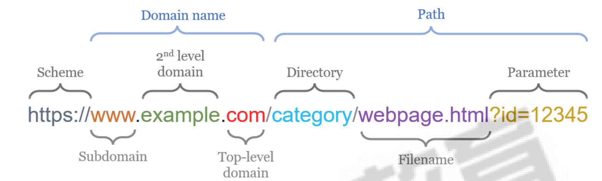

## 核心特点

* 请求-响应模型：客户端发送一个请求到服务器，服务器接收请求后返回一个响应。 
* **无状态协议**：服务器不会保留任何关于之前客户端请求的信息。每个请求都是独立的。 
* 资源标识符：HTTP使用统一资源标识符（URI）来定位互联网上的资源。 
* 方法（动作）：HTTP定义了几种请求方法，对互联网的资源进行各种操作。 
* 状态码：服务器在响应中包含一个状态码，用于指示请求是否成功，以及请求失败的原因。 
* 消息头：HTTP请求和响应都包含头部字段，用于传递额外的信息，如内容类型、编码、认证信息、缓存指令 等。 
* 版本：HTTP/1.0、HTTP/1.1和HTTP/2是目前主要的版本。HTTP/3则是基于QUIC协议，进一步提升了性 能

### 无连接

限制每次连接只处理一个请求。 服务器处理完客户的请求，并收到客户的应答后，即断开连接。 这种方式可以节省传输时间。

### 无状态

​		无状态, 这就意味着每个HTTP请求都是相互独立的，服务器在处理请求时不会保留先前请求的任何状态 信息，每个请求都是独立的、不相关的操作。 

​		这无状态的特性有助于简化协议的设计和实现，同时也使得它更具可伸缩性，每个请求都包含所有必要的 信息，而服务器无需维护每个客户端的状态。 

​		也就是说，不需要先前信息时它的应答就较快，从而降低了服务器的负担。


这意味着如果后续处理需要前面的信息，则它必须重传，可能导致每次连接传送的数据量增大。


## URI & URL  & URN

URI：（Uniform Resource Identifier），统一资源标识符，是一个用来唯一标识互联网上某一特定资 源的字符串 

URL：（Uniform Resource Locator），统一资源定位符

URN：（Uniform Resource Name），统一资源名称


## 前端

前端页面技术：HTML + CSS + Javascript

### 静态资源

**常见的静态资源**：

- **HTML** 文件
- **CSS** 文件
- **JavaScript** 文件（通常是客户端运行的脚本）
- 图片文件（如 `.jpg`、`.png`、`.gif` 等）
- 视频和音频文件
- 字体文件（如 `.woff`、`.ttf` 等）

**特点**：

1. 内容是固定的，通常是事先写好的文件。
2. 不依赖服务器端逻辑来生成。
3. 可以被缓存（如使用浏览器缓存或 CDN）。
4. 性能高，因为服务器只需直接返回文件。

### 动态资源

**常见的动态资源**：

- 动态生成的 HTML 页面（如使用 PHP、Python、Node.js）。
- API 返回的 JSON 或 XML 数据。
- 用户特定的内容（如推荐列表、购物车数据）。

**特点**：

1. 由服务器端程序处理后生成。
2. 响应内容可能因请求的参数、用户身份、时间等因素而不同。
3. 通常需要服务器端的计算和数据库访问。
4. 不易缓存（除非用特定策略，比如按 URL 参数缓存）。

## 网站流量指标

https://www.cnzz.com/o_index.php #CNZZ  

https://tongji.baidu.com/web/welcome/basic #百度统计  

http://www.alexa.cn/ #第三方网站流量及排名分析

## 工作机制

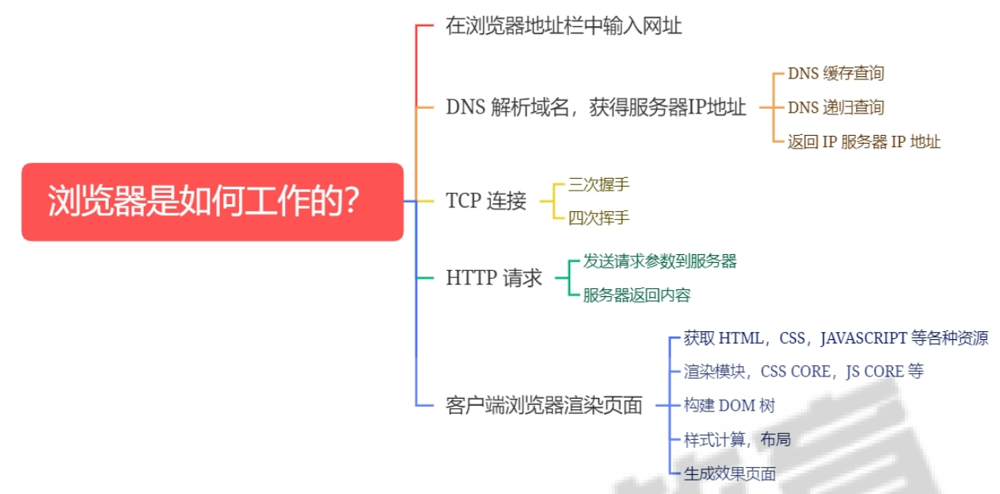

## 请求头

| **请求头字段**                | **作用**                                                     |
| ----------------------------- | ------------------------------------------------------------ |
| **Host**                      | 指定服务器的域名（必要），用于区分同一 IP 地址下的多个站点。 |
| **User-Agent**                | 客户端信息（浏览器类型、操作系统等），用于服务器识别客户端特性。 |
| **Accept**                    | 指定客户端可接受的响应类型（如 `text/html`, `application/json`）。 |
| **Accept-Encoding**           | 指定客户端支持的内容编码（如 `gzip`, `deflate`），用于压缩优化传输。 |
| **Accept-Language**           | 指定客户端首选的语言（如 `en-US`, `zh-CN`）。                |
| **Content-Type**              | 指定请求中的数据类型（如 `application/json`, `multipart/form-data`）。 |
| **Content-Length**            | 指定请求体的字节长度，用于告知服务器数据的大小。             |
| **Authorization**             | 用于传递身份验证凭据（如 `Bearer Token` 或 `Basic Auth`）。  |
| **Cookie**                    | 用于携带客户端的会话信息，常用于身份验证和状态管理。         |
| **Referer**                   | 指定请求的来源页面 URL，便于服务器跟踪来源流量。             |
| **Connection**                | 控制连接方式（如 `keep-alive`, `close`），用于优化连接性能。 |
| **Cache-Control**             | 指定缓存策略（如 `no-cache`, `max-age=3600`），用于控制缓存行为。 |
| **X-Requested-With**          | 标识请求的类型（如 `XMLHttpRequest`），常用于识别 AJAX 请求。 |
| **Origin**                    | 指定请求的来源域，用于跨域请求的验证（CORS）。               |
| **If-Modified-Since**         | 用于条件请求：如果指定时间后资源未修改，则返回 304 状态码。  |
| **If-None-Match**             | 用于条件请求：通过 ETag 判断资源是否未修改，避免重复下载。   |
| **Range**                     | 请求部分内容的字节范围，用于断点续传或流媒体请求。           |
| **Upgrade-Insecure-Requests** | 指示客户端希望升级到 HTTPS 请求，用于安全性优化。            |
| **DNT (Do Not Track)**        | 客户端请求不被跟踪的标志（`1` 表示不希望被跟踪）。           |


## 请求方法

| **请求方法** | **作用**                                                     | **是否有请求体** | **幂等性** | **安全性** |
| ------------ | ------------------------------------------------------------ | ---------------- | ---------- | ---------- |
| **GET**      | 请求从服务器获取资源（例如网页、数据），不会对服务器数据产生影响。 | 否               | 是         | 是         |
| **POST**     | 向服务器提交数据，用于创建资源或处理表单数据（如用户注册、登录）。 | 是               | 否         | 否         |
| **PUT**      | 向服务器发送数据，用于创建或更新资源，目标资源的状态由请求体决定。 | 是               | 是         | 否         |
| **PATCH**    | 部分更新资源，与 `PUT` 类似，但只修改目标资源的部分字段。    | 是               | 否         | 否         |
| **DELETE**   | 请求删除服务器上的指定资源。                                 | 否               | 是         | 否         |
| **HEAD**     | 与 `GET` 类似，但只返回响应头，不返回响应体，用于检查资源是否存在或获取元数据。 | 否               | 是         | 是         |
| **OPTIONS**  | 用于查询服务器支持的请求方法或功能，常用于跨域资源共享（CORS）的预检请求。 | 否               | 是         | 是         |
| **TRACE**    | 回显服务器接收到的请求，主要用于调试 HTTP 请求的中间链路。   | 否               | 否         | 否         |
| **CONNECT**  | 用于建立到服务器的隧道连接（通常用于 HTTPS 代理）。          | 否               | 否         | 否         |

| **请求方法** | **常见场景**                                                 |
| ------------ | ------------------------------------------------------------ |
| **GET**      | 获取网页、查询数据（如 `/users` 获取所有用户信息）。         |
| **POST**     | 提交表单、上传文件、新建资源（如 `/users` 创建新用户）。     |
| **PUT**      | 更新完整资源（如 `/users/123` 更新用户 ID 为 123 的数据）。  |
| **PATCH**    | 更新部分资源字段（如修改用户的某个字段）。                   |
| **DELETE**   | 删除资源（如 `/users/123` 删除用户 ID 为 123 的数据）。      |
| **HEAD**     | 检查资源是否存在、获取响应头（如检查文件大小或修改时间）。   |
| **OPTIONS**  | 查看服务器支持的方法或进行跨域资源请求的预检（如浏览器的 CORS 请求）。 |
| **TRACE**    | 调试 HTTP 请求路径或中间代理是否正确转发数据（危险性较高，不推荐在生产环境使用）。 |
| **CONNECT**  | 设置 HTTPS 的代理隧道连接（如通过 HTTP/1.1 建立到服务器的加密连接）。 |


## 响应头

| **响应头字段**                   | **作用**                                                     |
| -------------------------------- | ------------------------------------------------------------ |
| **Content-Type**                 | 指定响应内容的 MIME 类型（如 `text/html`, `application/json`），帮助客户端正确解析响应内容。 |
| **Content-Length**               | 指定响应体的字节大小，便于客户端处理数据。                   |
| **Content-Encoding**             | 指定响应内容的压缩方式（如 `gzip`, `deflate`），以优化传输性能。 |
| **Date**                         | 响应的时间和日期，表示服务器生成响应的时间。                 |
| **Server**                       | 指定服务器软件信息（如 `nginx/1.21.6`），便于客户端了解服务端技术栈（可通过配置隐藏或伪装）。 |
| **Set-Cookie**                   | 设置客户端的 Cookie 信息，用于会话跟踪或状态管理。           |
| **Cache-Control**                | 控制缓存策略（如 `no-cache`, `max-age=3600`），用于优化性能和减少带宽消耗。 |
| **Expires**                      | 指定资源的过期时间，常用于控制缓存行为。                     |
| **ETag**                         | 提供资源的唯一标识符，用于缓存验证（与 `If-None-Match` 请求头配合）。 |
| **Last-Modified**                | 指定资源的最后修改时间，用于条件请求（与 `If-Modified-Since` 请求头配合）。 |
| **Location**                     | 指定重定向的目标 URL，常用于 3xx 响应（如 301/302 重定向）。 |
| **Connection**                   | 指定连接管理方式（如 `keep-alive` 或 `close`），优化连接性能。 |
| **Content-Disposition**          | 指定响应的内容呈现方式（如 `inline` 或 `attachment`），用于文件下载。 |
| **Transfer-Encoding**            | 指定分块传输编码（如 `chunked`），用于分块传输大文件。       |
| **Access-Control-Allow-Origin**  | 指定允许跨域请求的源，用于跨域资源共享（CORS）。             |
| **Access-Control-Allow-Methods** | 指定允许的跨域请求方法（如 `GET`, `POST`, `OPTIONS`），常与 CORS 配合使用。 |
| **WWW-Authenticate**             | 用于身份验证，提示客户端提供验证信息（如 `Basic` 或 `Bearer` 认证）。 |
| **Retry-After**                  | 指定客户端在何时重新尝试请求，常用于 503 服务不可用或 429 请求过多的响应。 |
| **X-Powered-By**                 | 指定服务器所使用的技术（如 `PHP/7.4`），可隐藏以提高安全性。 |
| **X-Frame-Options**              | 防止网页被嵌入到其他网站的 `<iframe>` 中，增强安全性（如 `DENY`, `SAMEORIGIN`）。 |
| **X-Content-Type-Options**       | 防止 MIME 类型嗅探攻击（如 `nosniff`）。                     |
| **X-XSS-Protection**             | 启用或禁用浏览器的跨站脚本攻击（XSS）保护（如 `1; mode=block`）。 |

## 响应状态码

### 1xx：信息响应

| **状态码** | **含义**            | **说明**                                                     |
| ---------- | ------------------- | ------------------------------------------------------------ |
| **100**    | Continue            | 表示请求的初始部分已经接收，客户端可以继续发送请求的剩余部分。 |
| **101**    | Switching Protocols | 服务器同意客户端的协议切换请求（如切换到 WebSocket）。       |

------

### 2xx：成功

| **状态码** | **含义**   | **说明**                                               |
| ---------- | ---------- | ------------------------------------------------------ |
| **200**    | OK         | 请求成功，服务器返回请求的资源或结果。                 |
| **201**    | Created    | 请求成功，并创建了新的资源（常用于 `POST` 或 `PUT`）。 |
| **202**    | Accepted   | 请求已接收但尚未处理（异步操作）。                     |
| **204**    | No Content | 请求成功，但没有返回任何内容（常用于删除操作）。       |

------

### 3xx：重定向

| **状态码** | **含义**           | **说明**                                                     |
| ---------- | ------------------ | ------------------------------------------------------------ |
| **301**    | Moved Permanently  | 请求的资源已永久移动到新的 URL。                             |
| **302**    | Found              | 请求的资源临时移动到新的 URL（旧版定义为“临时重定向”）。     |
| **303**    | See Other          | 请求应该使用另一个 URL 获取资源，通常用于 `POST` 后的重定向。 |
| **304**    | Not Modified       | 资源未修改，客户端可以使用缓存的版本（结合条件请求）。       |
| **307**    | Temporary Redirect | 请求的资源临时重定向，但应使用原请求方法（例如 `POST` 不变为 `GET`）。 |

------

### 4xx：客户端错误

| **状态码** | **含义**           | **说明**                                             |
| ---------- | ------------------ | ---------------------------------------------------- |
| **400**    | Bad Request        | 请求格式错误或参数无效。                             |
| **401**    | Unauthorized       | 未授权，需要提供身份验证凭据。                       |
| **403**    | Forbidden          | 服务器拒绝执行请求，即使身份验证通过也无权访问资源。 |
| **404**    | Not Found          | 请求的资源不存在或路径错误。                         |
| **405**    | Method Not Allowed | 请求的方法（如 `POST`, `GET`）不被目标资源允许。     |
| **409**    | Conflict           | 请求与服务器的资源状态冲突（如编辑冲突）。           |
| **429**    | Too Many Requests  | 客户端发送的请求次数过多，被限流。                   |

------

### 5xx：服务器错误

| **状态码** | **含义**              | **说明**                                       |
| ---------- | --------------------- | ---------------------------------------------- |
| **500**    | Internal Server Error | 服务器遇到未知错误，无法完成请求。             |
| **501**    | Not Implemented       | 服务器不支持请求的方法或功能。                 |
| **502**    | Bad Gateway           | 网关或代理服务器从上游服务器接收到无效响应。   |
| **503**    | Service Unavailable   | 服务器暂时无法处理请求（过载或维护中）。       |
| **504**    | Gateway Timeout       | 网关或代理服务器未能及时从上游服务器获得响应。 |


## http的无状态应对策略：Cookie或Session

###  Cookie

一种在**客户端保存**状态信息的机制。服务器可以通过Set-Cookie头部向客户端发送一个Cookie，客户 端在下一次请求时将该Cookie发送回服务器。 

服务器可以根据Cookie的内容来识别客户端的身份，从而实现状态管理。

```powershell
Cookie 是一小段存储在用户计算机上的数据，由服务器通过 HTTP 协议发送给用户的浏览器，然后浏览器将其保存。每次用户访问同一站点时，浏览器都会将相应的 Cookie 发送回服务器，从而实现在客户端和服务器之间存储和传递信息的功能。Cookies 通常包含一些键值对，用于存储少量文本数据，例如用户的身份认证信息、首选语言、个性化设置等。
```


### Session

一种在**服务器保存**状态信息的机制。

服务器在接收到客户端的请求时，为该客户端创建一个Session对象，并将该**对象的ID**保存在一个 **Cookie**中发送给客户端。

```powershell
Session 是服务器端的一种机制，用于在用户和服务器之间存储信息。与 Cookie 不同，Session 数据并不直接存储在用户计算机上，而是存储在服务器上。

通常，服务器会为每个用户创建一个唯一的会话标识符（Session ID），该标识符通过 Cookie 或者URL 参数的形式发送给用户。在服务器端，与每个会话相关的数据都会被存储，这样在用户的不同请求之间可以保持状态。 Sessions 通常用于存储用户的登录状态、购物车内容、权限信息等。
```

* session共享
  * session 不再只存在某一台服务器上，而是放在某个**共享存储**中，后端服务器共用 所有的 session 信息
* session复制
  * session同步到该集群中其它 WEB 服务器


# IO

## IO基础

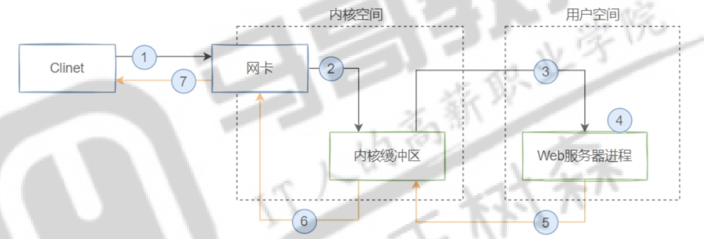

**DMA（Direct Memory Access，直接内存访问）** 是一种计算机系统的功能，允许外部设备（如硬盘、网卡等）直接访问主内存，而无需通过 CPU 的直接干预。通过 DMA，设备可以在 CPU 执行其他任务时独立地读取或写入内存，从而提高系统的效率。

```powershell
1. 客户端发送请求
2. 将请求数据从网卡缓冲区拷贝到内核缓冲区，这一步由硬件通过DMA直接完成
3. 将请求数据从内核缓冲区拷贝到用户空间的WEB服务器缓冲空间，这一步由操作系统完成
4. 用户空间WEB服务进程处理请求，构建响应数据
5. 将响应数据从WEB服务器缓冲区拷贝到内核缓冲区，这一步由操作系统完成
6. 将响应数据从内核缓冲区拷贝到网卡缓冲区，这一步由DMA直接完成
7. 返回响应数据给客户端
```

## 同步和异步

### 同步

同步是指任务的执行需要按照顺序完成，后续任务必须等待当前任务完成后才能开始。

### 异步

异步是指任务的执行可以并行进行，后续任务可以在当前任务完成之前开始。


## 阻塞和非阻塞

### 阻塞

阻塞是指在任务未完成时，**线程会暂停执行**，等待任务完成后才能继续。

### 非阻塞

非阻塞是指在任务未完成时，**线程不会等待**，可以继续执行其他任务。


## 5种IO模型

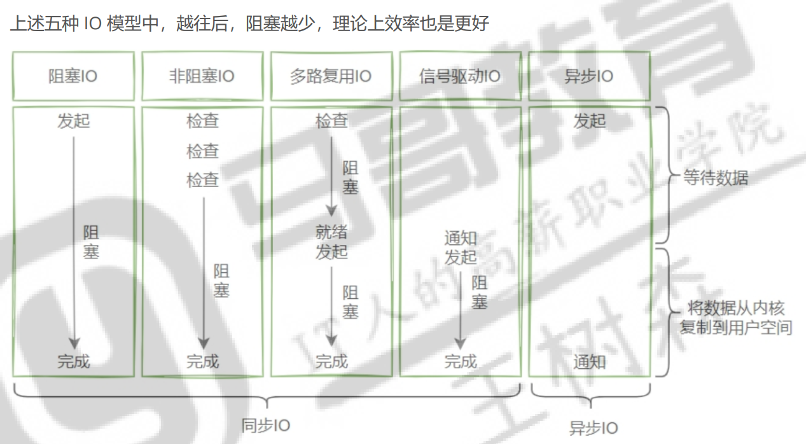

### **IO过程**

**第一阶段：客户端         ------------> 内核缓冲区**

**第二阶段：内核缓冲区 ------------> 应用缓冲区**

### 阻塞IO

用户线程在内核进行IO操作时被阻塞。


**第一，第二阶段都阻塞。**


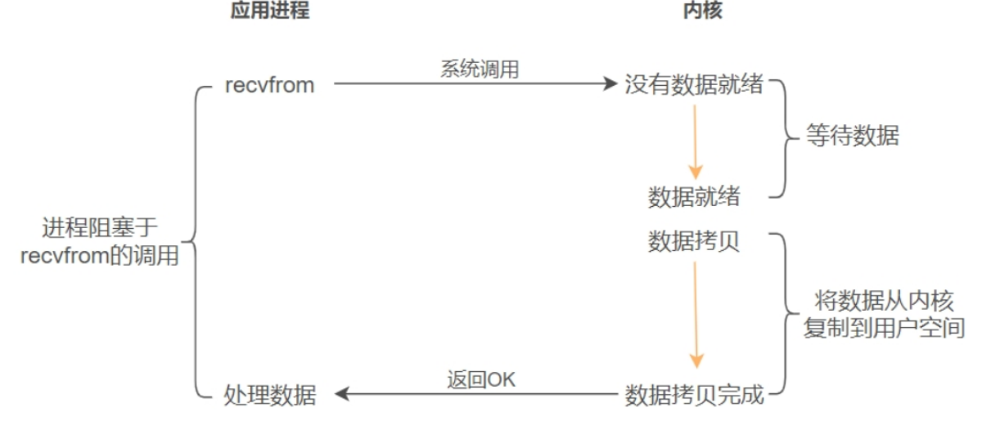

### 非阻塞IO

用户线程不阻塞，但会不断轮询IO是否准备好。

不询问时，会去干其他事。


**第一阶段不阻塞，第二阶段阻塞。（解决阻塞IO的第一阶段阻塞问题）**


```powershell
1 如果有大量文件描述符都要等，那么就得一个一个的 read。这会带来大量的 Context Switch（read是系统调用，每调用一次就得在用户态和核心态切换一次）。

2 轮询的时间不好把握，这里是要猜多久之后数据才能到。等待时间设的太长，程序响应延迟就过大；设的太短，就会造成过于频繁的重试，干耗CPU而已，是比较浪费CPU的方式，一般很少直接使用这种模型，而是在其他IO模型中使用非阻塞IO这一特性。
```

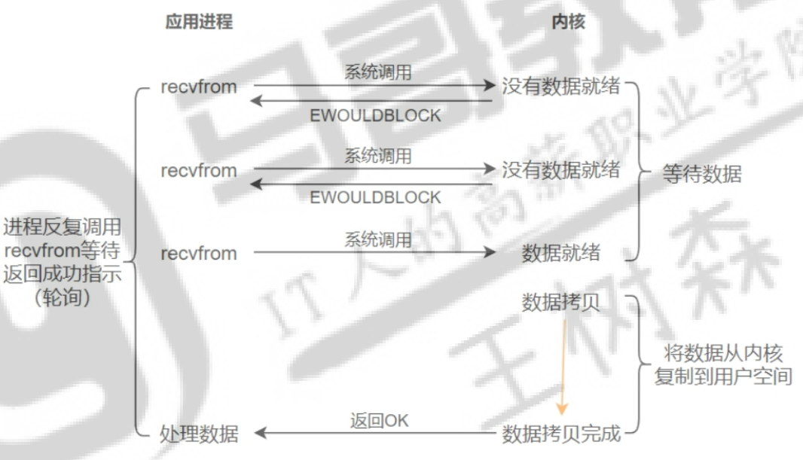


### 信号驱动IO

应用程序通过信号机制得知文件描述符的状态变化。当文件描述符可以执行 I/O 操作时，操作系统会向应用程序发送信号，通知它文件描述符已经准备好。

信号驱动依赖于操作系统发送信号，完全异步；

多路复用需要程序主动调用接口等待事件发生。


**第一阶段不阻塞，第二阶段阻塞。（解决非阻塞IO的轮询问题）**


### 异步 IO

**异步 I/O 让操作系统直接负责从数据准备到传输完成的整个过程**，而应用程序完全不用关心具体的 I/O 操作状态。


**第一阶段不阻塞，第二阶段不阻塞。（解决信号驱动IO的第二阶段阻塞问题）**


### 多路复用IO

多路复用IO指一个线程可以同时（实际是交替实现，即并发完成）监控和处理多个文件描述符对应各自的 IO，即复用同一个线程。


**第一阶段阻塞，第二阶段阻塞。**

**解决以上四种的处理单个文件描述符的问题。（解决多并发）**


**工作流程**

多路复用 I/O 模型的工作流程可以概括为以下几个步骤：

1. **创建监听套接字**：
   - 应用程序首先创建一个或多个套接字（例如用于网络通信的 TCP 套接字），并设置为非阻塞模式。
2. **注册文件描述符**：
   - 应用程序通过多路复用接口（如 `select`、`epoll`）将需要监控的文件描述符（例如套接字、管道等）注册到操作系统的事件监听队列中。
3. **监控事件**：
   - 应用程序通过多路复用机制（如 `select` 或 `epoll_wait`）等待事件的发生。当某个文件描述符的状态发生变化（例如套接字上有数据可读、可写）时，处理。
4. **处理 I/O 事件**：
   - 一旦文件描述符上有可读、可写等事件发生，应用程序就可以主动对这些事件进行处理（如调用 `read`、`write` 等系统调用来进行数据传输）。
5. **重复等待**：
   - 处理完一个或多个 I/O 事件后，程序继续等待下一个事件的发生。


无事就等，有事就干，干完再去看有没有事。

**等待的时间可以用来做其他事情**。程序的 I/O 处理和其他任务（如数据处理、计算、日志记录等）是 **异步分离** 的。程序通过事件循环或线程池等机制，将 I/O 操作和其他计算任务解耦，从而使得等待 I/O 操作完成的时间可以用来做其他事情。


## 单核CPU的同步IO的差异

**单核 CPU 内部确实由多个组件组成，它们能够并行处理不同类型的任务**，这就是为什么即使在单核 CPU 中，不同的同步 IO 模型仍然可能表现出差异的原因。这些组件在某种程度上实现了“并行化”，尽管核心逻辑运算仍然只能由一个主核心顺序执行。

### 单核 CPU 内部并行化的组件

#### 内核和用户空间的协作

- 单核 CPU 在运行时，会在用户空间和内核空间之间切换

  - 用户空间负责执行应用程序的逻辑。
  - 内核空间负责处理系统调用、设备 IO 和中断等任务。
  
- 当程序发起 IO 操作（如 `read` 或 `write`），内核会接管这些操作，而用户空间程序可以继续执行其他逻辑（视模型而定）。

#### 硬件支持并行处理

单核 CPU 内部虽然只有一个主计算核心，但有以下关键组件能够并行工作：

- **指令流水线（Pipeline）**：
  - 单核 CPU 使用流水线技术，可以将一条指令的执行分解为多个步骤（如取指、译码、执行、写回），并在同一时刻并行处理多条指令的不同阶段。
  - 流水线虽然不能真正并行执行多条指令，但能提高单核的执行效率。
- **分支预测与乱序执行**：
  - 单核 CPU 会预测接下来的操作，并提前准备数据，某些情况下可以隐藏 IO 等待带来的延迟。
- **内存控制器与缓存（Cache）**：
  - 当 CPU 等待磁盘 IO 时，内存控制器和缓存可以继续工作，预取数据或处理已有任务的数据。
  - 如果 IO 数据较小并已缓存（如通过文件系统缓存），程序的性能会显著提升。
- **中断机制**：
  - 硬件中断允许磁盘或其他外设在完成 IO 操作时，主动通知 CPU，避免 CPU主动轮询。
- **DMA（Direct Memory Access）**：
  - DMA 是一种允许设备直接将数据写入内存的机制，减少了 CPU 在数据传输中的参与。
  - 当磁盘 IO 使用 DMA 时，CPU 不需要参与数据传输，而是等待 DMA 完成后收到中断通知。

#### 外部设备并行性

- 磁盘控制器与网络适配器

  等外部设备可以独立于 CPU 工作：

  - 在程序发起 IO 请求后，磁盘控制器可以并行执行数据读取操作。
  - CPU 仅需在数据准备好时处理结果，而不需要实时监控磁盘的状态。

------

### 几种同步 IO 模型在单核 CPU 中的差别原因

由于单核 CPU 和外部设备的分工协作，不同的同步 IO 模型在单核环境中仍然可能表现出性能差异。

#### 阻塞 IO

- 特点

  - 在发起 IO 操作后，CPU 被完全阻塞，直到 IO 完成。
  - 在阻塞期间，CPU 无法执行任何其他任务。
  
- 性能差异原因

  - CPU 的主核心完全空闲，无法充分利用硬件资源（如流水线、缓存、DMA 等）。
- 在单核 CPU 中，这种浪费尤其明显，因为没有其他核心可以分担任务。

#### 非阻塞 IO

- 特点

  - IO 操作不会阻塞，程序可以主动轮询 IO 状态。
  - 如果 IO 未完成，CPU 会立即返回，执行其他操作。
  
- 性能差异原因

  - CPU 在轮询状态时仍然需要执行无效指令（检查 IO 状态），这会占用流水线和缓存资源。
- 如果 IO 数据可以被缓存，非阻塞 IO 可以更快返回。

#### 多路复用 IO

- 特点

  - 程序通过 `select`、`poll` 或 `epoll` 同时监听多个文件描述符的状态。
  - 程序只在有 IO 事件就绪时才进行操作。
  
- 性能差异原因

  - 多路复用减少了轮询开销，充分利用了单核 CPU 的中断机制。
- CPU 可以高效调度多个 IO 任务，而不需要阻塞等待某个任务完成。

#### 信号驱动 IO

- 特点

  - 内核通过信号机制通知程序 IO 就绪，程序仅在收到信号后才进行处理。

- 性能差异原因

  - 信号的处理依赖硬件中断机制，CPU 在等待信号时可以处理其他任务。
- 信号处理逻辑可能引入额外的开销，尤其是在高频信号场景中。

#### 异步 IO

- 特点

  - IO 操作完全由内核处理，程序无需等待或轮询，内核在 IO 完成后通知程序。

- 性能差异原因

  - 异步 IO 最大化利用了 DMA 和中断机制，CPU 仅参与逻辑运算，不参与数据传输。
- 如果 IO 数据量较大，异步 IO 的性能会显著优于其他模型。

------

### 单核 CPU 内部组件并行性对 IO 模型的优化

1. **流水线技术的优化**：
   - 对于非阻塞 IO 和多路复用 IO，CPU 在执行任务切换时，可以充分利用流水线并行处理不同任务的指令，提高整体吞吐量。
2. **DMA 与中断机制的优化**：
   - 异步 IO 可以完全依赖 DMA 和中断完成数据传输，CPU 在此过程中可以处理其他任务，提高单核系统的整体性能。
3. **缓存的利用**：
   - 非阻塞 IO 和多路复用 IO 可以在用户态缓存中处理小量数据，减少对磁盘或网络的实际访问。
   - 阻塞 IO 和异步 IO 的缓存利用率较低，因为它们等待的数据通常不在缓存中。
4. **外部设备的并行性**：
   - 即使是单核 CPU，外部设备（如磁盘控制器）可以与 CPU 并行工作。
   - 异步 IO 和信号驱动 IO 能更好地利用外设并行处理能力。

------

### 总结

- **单核 CPU 内部确实有并行的组件**，如流水线、缓存、DMA、中断机制等，这些组件在硬件和系统级别实现了并行工作。

- 不同 IO 模型的性能差异主要来源于是否充分利用这些组件

  - 阻塞 IO 浪费了硬件资源，性能最低。
  - 非阻塞 IO 和多路复用 IO 能更好地利用硬件资源，但可能引入轮询开销。
  - 异步 IO 最大化利用了 DMA 和中断机制，性能最优。
  
- 即使在单核环境下，合理选择 IO 模型仍然可以显著优化系统性能。


# Apache

## 特点

特性

- 高度模块化：core + modules 
- DSO：Dynamic Shared Object 动态加载/卸载 
- MPM：multi-processing module 多路处理模块

功能

* 虚拟主机：IP，Port，FQDN 
* CGl：Common Gateway lnterface，通用网关接口 
* 反向代理、负载均衡、路径别名 
* 丰富的用户认证机制：basic，digest 
* 支持第三方模块

## 工作模式

###  prefork

预派生模式，有一个主控制进程，然后生成多个子进程，每个子进程有一个独立的线程响应用户请求，相 对比较占用内存，但是比较稳定，可以设置最大和最小进程数，是最古老的一种模式，也是最稳定的模式，适 用于访问量不是很大的场景。

```
优点：工作稳定

缺点：每个用户请求需要对应开启一个进程，占用资源较多，并发性差，不适用于高并发场景
```

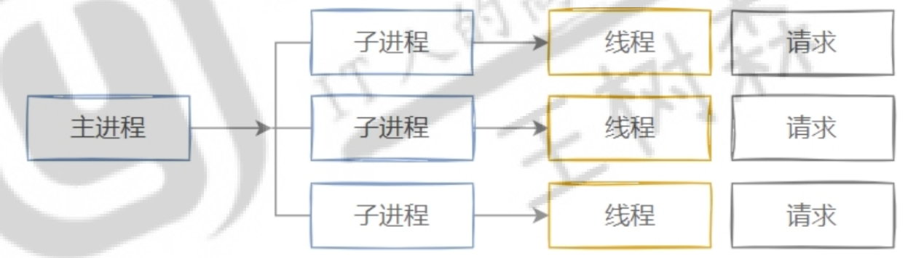

### worker

一种多进程和多线程混合的模型，有一个控制进程，启动多个子进程，每个子进程里面包含固定的线程， 使用线程来处理请求，当线程不够使用的时候会再启动一个新的子进程，然后在进程里面再启动线程处理请 求，由于其使用了线程处理请求，因此可以承受更高的并发。

```
优点：相比prefor模型，其占用的内存较少，可以同时处理更多的请求

缺点：使用keepalive的长连接方式，某个线程会一直被占据，即使没有传输数据，也需要一直等待到超时才会被释放。如果过多的线程被这样占据，也会导致在高并发场景下的无服务线程可用。（该问题在prefork模式下，同样会发生）
```

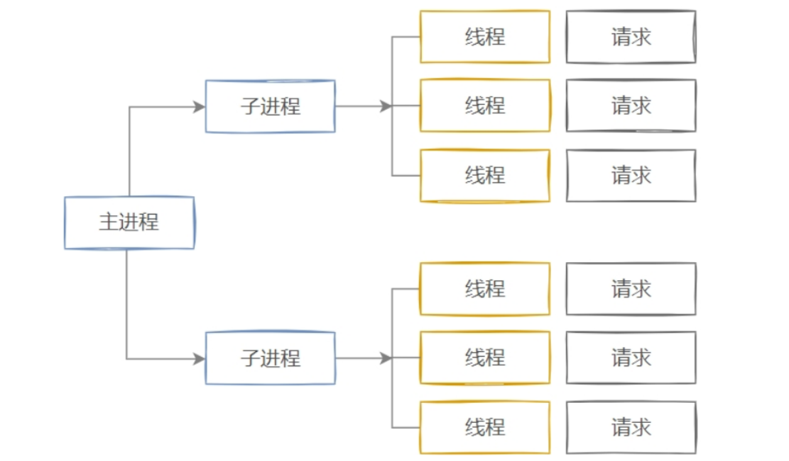

### event

Apache2 中最新的模式，2012年发布的apache 2.4.X系列正式支持event 模型，属于事件驱动模型 (epoll)，每个进程响应多个请求，在现在版本里的已经是稳定可用的模式，它和worker模式很像。


最大的区别在于，它解决了keepalive场景下，长期被占用的线程的资源浪费问题（某些线程因为被 keepalive，空挂在哪里等待，中间几乎没有请求过来，甚至等到超时）。


event MPM中，会有一个专门的线程来管理这些keepalive类型的线程，当有真实请求过来的时候，将 请求传递给服务线程，执行完毕后，又允许它释放。这样增强了高并发场景下的请求处理能力。

```
优点：单线程响应多请求，占据更少的内存，高并发下表现更优秀，会有一个专门的线程来管理keepalive类型的线程，当有真实请求过来的时候，将请求传递给服务线程，执行完毕后，又允许它释放

缺点：没有线程安全控制
```

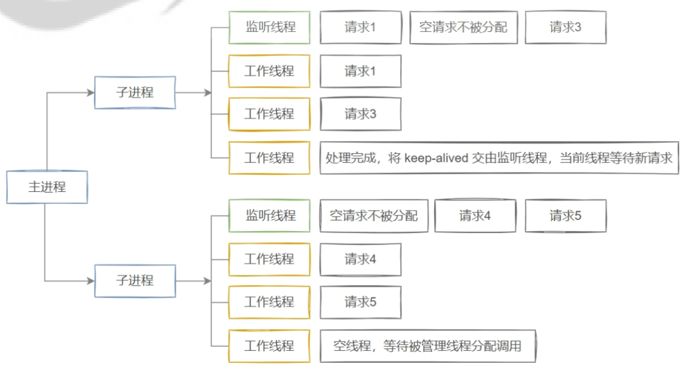

## 安装

```shell
yum install httpd -y


apt install apache2 -y
```

## 配置结构

```shell
/etc/apache2/
├── apache2.conf		# 主配置文件
├── conf-available		# 可用配置目录
├── conf-enabled		# 开启配置目录
├── envvars				# 全局环境变量配置文件
├── magic				# 配合 mod_mime_magic模块判断 MIME 类型的配置文件
├── mods-available		# 可用模块目录
├── mods-enabled		# 开启模块目录
├── ports.conf			# 默认端口配置文件
├── sites-available		# 可用站点目录
└── sites-enabled		# 开启站点目录

.htaccess				# 可以写在目录及其子目录的 .htaccess 文件中，但可能会因overrides的设置而不起作用
```

```shell
# 语法检查
apachectl -t

# 启动模块列表
apache2ctl -M
```

## 配置段

### 目录配置段

```powershell
<Directory "/path/to/dir"> ... </Directory>
 - 用于指定服务器上一个具体目录的各种访问控制
<DirectoryMatch "^/path/to/dir/.*$"> ... </DirectoryMatch>
 - 使用正则表达式来匹配目录路径。这允许你对符合特定模式的多个目录应用相同的配置。
```

### 文件配置段

```powershell
<Files "config.file"> ... </Files>
 - 用于指定服务器上特定文件的配置。你可以在这个容器内设置访问控制、MIME类型等指令。
<FilesMatch "\.(php|html)$"> ... </FilesMatch>
 - 使用正则表达式来匹配文件名。这允许你对符合特定模式的多个文件应用相同的配置
```

### url配置段

```powershell
<Location "/admin"> ... </Location>
 - 用于指定基于URL路径的配置，这对于处理别名、重定向或基于URL的访问控制非常有用。
<LocationMatch "^/secure/.*$"> ... </LocationMatch>
 - 使用正则表达式来匹配URL路径。这允许你对符合特定模式的多个URL路径应用相同的配置。
```

### 虚拟主机配置段

```powershell
- 基于端口实现：用不同的端口标识不同的虚拟主机
 <virtualhost *:80> ... </VirtualHost>
- 基于IP实现：用不同的IP地址标识不同的虚拟主机；用于有多公共IP的情况
 <virtualhost 10.0.0.12:80> ... </VirtualHost>
- 基于域名实现：用不同的域名标识不同的虚拟主机
 <virtualhost *:80>
  ... 
  ServerName www.example.com
  ...
 </VirtualHost>
```

## 配置字段

### ServerTokens 配置响应头中的Server 字段信息

```
/etc/apache2/conf-available/security.conf
```

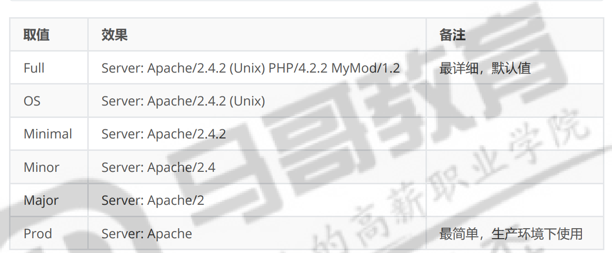

### 持久连接

```shell
/etc/apache2/apache2.conf

KeepAlive On #默认开启了持久连接
MaxKeepAliveRequests 100 #在一个持久连接内，最多可以累计处理100次请求
KeepAliveTimeout 5 #持久连接保持时间
```

关闭KeepAlive功能后，获取到一个资源后立即断开


### Alias别名

如果 alias 定义的目录在 DocumentRoot 之外，则需要单独授权，否则不可用

```shell
# 定义别名
Alias "/test/" "/var/www/html/source/"
# url中的/test/变为/var/www/html/source/
```

```powershell
AliasPreservePath Off|On

# 通常用off
off：
请求：http://example.com/static/js/app.js
实际映射路径：/var/www/static_files/js/app.js

on：
请求：http://example.com/static/js/app.js
实际映射路径：/var/www/static_files/static/js/app.js
```

## 访问控制配置

### options

子目录不使用父级目录的权限

```powershell
Options [+|-]选项				# + 启用 - 禁用

选项：
Indexes						# 允许 Apache 在目录中没有 index.html 或其他默认页面时，自动生成目录列表页面。

FollowSymLinks				# 允许服务器跟随符号链接（symlink）

Includes					# 启用服务器端包含（Server-Side Includes, SSI）
							# 处理嵌入在 HTML 文件中的 SSI 指令
							# <!--#include virtual="/header.html" -->
							# 服务器会将 /header.html 的内容嵌入到当前页面。


SymLinksifOwnerMatch		# 允许符号链接，但仅当符号链接的所有者与目标文件的所有者相同时才允许访问。

ExecCGI						# 启用目录中的 CGI 脚本执行。

Multiviews					# 启用内容协商机制，允许根据客户端请求自动选择最佳文件。

All							# 启用除 MultiViews 之外的所有选项

None						# 禁用所有选项。
```

### AllowOverride

**`AllowAccess`**指令用于控制`.htaccess`文件（每个目录的配置文件）是否可以覆盖主服务器配置文件中指定的设置。它对于微调访问控制和配置灵活性特别有用。

```shell
AllowOverride All|None|directive-type

ALL   			# 所有指令都可以在 .htaccess 文件中生效
None  			# 不使用 .htaccess 文件中的指令
directive-type 	# 是如下指令：AuthConfig，FileInfo，Indexes，Limit，Options[=选项,...]
 				# - AuthConfig  只能在 .htaccess 文件中配置 AuthConfig 相关指令
				# - Options=FollowSmlinks Indexes 可以在 .htaccess 文件中配置 FollowSmlinks Indexes

```

### Require

```shell
Require all granted 									# 所有用户都可以访问
Require all denied 										# 所有用户都不可以访问
Require method http-method [http-method] ... 			# 特定请请求方法可以访问
Require user userid [userid] ... 						# 特定用户可以访问
Require group group-name [group-name] ... 				# 特定组中的用户可以访问
Require valid-user 										# 所有有效用户可以访问
Require ip 10 172.20 192.168.2 							# 指定IP可以访问
Require forward-dns dynamic.example.org 				# 指定主机名或域名可以访问 

Require not
```

```shell
#基于正则，文件后缀名控制，禁止访问图片
<FilesMatch ".+\.(gif|jpe?g|png)$">
    Require all denied
</FilesMatch>

# 基于正则，URL路径控制，txt文件无法访问
<LocationMatch "/dira/.+\.txt$">
    Require all denied
</LocationMatch>
```

* RequireAll
  * RequireAll 用于包含一组授权指令，其中所有指令都必须成功才能使整个 RequireAll 指令 成功。换句话说，只有当所有列出的条件都得到满足时，访问请求才会被允许。
* RequireAny
  * 作用：RequireAny 用于包含一组授权指令，其中至少有一个指令必须成功才能使整个 RequireAny  指令成功。这意味着，只要列出的条件中有一个得到满足，访问请求就会被允许。

```shell
<Location "/dira/*">
  <RequireAll>
     Require all granted
     Require not ip 10.0.0.12
  </RequireAll>
</Location>

<Directory "/var/www/html/dirb/">
  <RequireAny>
     Require all denied
     Require ip 10.0.0.12
  </RequireAny>
</Directory>
```

## 特殊配置

### 将所有请求重定向到https

```shell
#RewriteCond %{HTTPS} off  
#RewriteRule ^(.*)$ https://%{HTTP_HOST}%{REQUEST_URI} [L,R=301] 
```


### 将所有非www请求重定向到www

```shell
#RewriteCond %{HTTP_HOST} ^example\.com [NC]  
#RewriteRule ^(.*)$ http://www.example.com/$1 [L,R=301] 
```


### 启用Gzip压缩

```shell
# AddEncoding gzip .gz  
# AddOutputFilterByType DEFLATE text/html text/plain text/xml text/css text/javascript application/javascript application/x-javascript application/json
```


### 设置图片防盗链

```shell
# RewriteCond %{HTTP_REFERER} !^http://(.+\.)?example\.com/ [NC]  
# RewriteRule \.(gif|jpg|png)$ - [F,L] 
```


### 允许/拒绝特定IP地址的访问

```shell
# Order Allow,Deny  
# Allow from 192.168.1.0/24  
# Deny from all  

```


### 允许/拒绝特定用户代理的访问

```shell
# <Limit GET POST>  
#     Order Allow,Deny  
#     Deny from "badbot"  
#     Allow from all  
# </Limit> 
```


### 设置MIME类型

```shell
# AddType application/x-font-woff woff  
# AddType application/vnd.ms-fontobject eot  
```


## 模块

* .load文件
* .conf文件

###  mod_deflate 数据压缩模块

deflate_module模块用于对 HTTP 响应的内容进行压缩，以减少传输的数据量，从而加快网页加载速 度并减少带宽使用。

```html
/etc/apache2/mods-enabled/deflate.conf
<IfModule mod_filter.c>
        AddOutputFilterByType DEFLATE text/html text/plain text/xml text/css text/javascript
        AddOutputFilterByType DEFLATE application/x-javascript application/javascript application/ecmascript
        AddOutputFilterByType DEFLATE application/rss+xml
        AddOutputFilterByType DEFLATE application/wasm
        AddOutputFilterByType DEFLATE application/xml
    
		<IfModule mod_filter.c>
			AddOutputFilterByType DEFLATE image/png # 增加png图片压缩
			DeflateCompressionLevel 9 #压缩比最高
        </IfModule>
</IfModule>
```

### mod_status 状态页

允许运维人员实时监控Apache服务器的运行状态、负载情况 以及连接数等关键指标。显示Apache服务器的内部状态信息。

```
1 加载mod_status模块
status.load
 
2 配置访问权限
<Location /server-status> ... </Location>
 
3 重启服务
```

```
<Location /server-status>
        SetHandler server-status
        Require local
        #Require ip 192.0.2.0/24
</Location>
ExtendedStatus On  # 这个是详细显示信息的功能
```

### auth_basic_module 访问验证


```shell
AuthType None|Basic|Digest|Form 		# 采用基础认证方式
AuthName "Restricted Area" 				# 登录提示语，大部份浏览器"不支持"
AuthBasicProvider file 					# 从文件中提取验证信息
AuthUserFile /etc/httpd/.htpasswd 		# 指定认证文件
Require user xxx 						# 设定可以登录的用户 
```

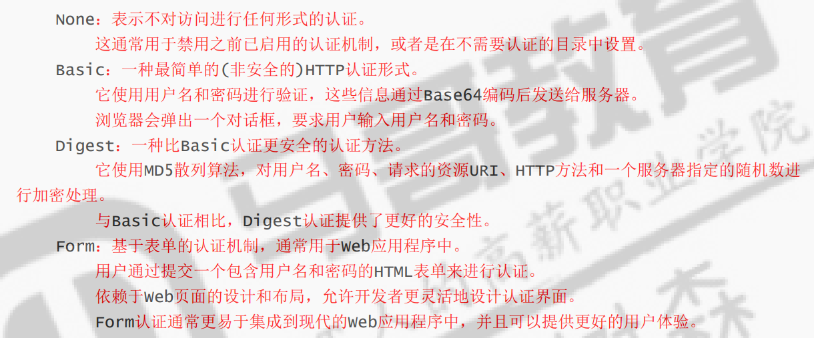

生成密码的命令

```shell
htpasswd [opt...] passwordfile username
htpasswd [opt...] passwordfile username password

# c 创建新文件 首次创建时使用
htpasswd -c /usr/share/apache2/apache2-pwd tom

htpasswd /usr/share/apache2/apache2-pwd sswang
```

### 工作模式模块

```
mpm_worker mpm_prefork mpm_event
```

### ssl 模块 Https

加上ssl模块

```shell
ssl.conf
ssl.load
```

开启443端口

配置虚拟主机

```powershell
<VirtualHost *:443>
        ServerAdmin webmaster@localhost
        DocumentRoot /var/www/html
        ErrorLog ${APACHE_LOG_DIR}/error.log
        CustomLog ${APACHE_LOG_DIR}/access.log combined
        SSLEngine on
        # SSL证书文件 和 私钥文件
        SSLCertificateFile      /etc/ssl/certs/ssl-cert-snakeoil.pem
        SSLCertificateKeyFile   /etc/ssl/private/ssl-cert-snakeoil.key
        # SSL证书链文件，上级CA证书
        #SSLCertificateChainFile /etc/apache2/ssl.crt/server-ca.crt
        # 顶级CA证书文件，与上面证链文件二选一
        #SSLCACertificateFile /etc/apache2/ssl.crt/ca-bundle.crt
        <FilesMatch "\.(?:cgi|shtml|phtml|php)$">
                SSLOptions +StdEnvVars
        </FilesMatch>
        <Directory /usr/lib/cgi-bin>
                SSLOptions +StdEnvVars
        </Directory>
</VirtualHost>

```

```shell
apt install easy-rsa -y
# 简单签发证书
easy-rsa

cd /usr/share/easy-rsa/

# 初始化证书目录
./easyrsa init-pki

# 生成不需要密码的CA机构证书
./easyrsa build-ca nopass

# 为 www.a.com生成私钥和证书文件请求
./easyrsa gen-req a.com.server nopass

# 为a.com.server文件签发证书
./easyrsa sign-req server a.com.server
```

## URL重定向

### Redirect

```powershell
- 301（Moved Permanently）：永久重定向
 服务器向客户端发送指令，告诉客户端当前请求的 URL 被永久的重定向到其它的URL，客户端下次请求该资源应该使用新的 URL。

- 302（Moved Temporarily）：临时重定向
 服务器向客户端发送指令，告诉客户端当前请求的 URL 被临时重定向到其它的URL，客户端下次请求该资源还可以继续使用原来的 URL
```

```shell
Redirect [status] URL-path URL

# 状态码
    status 		# 重定向状态码，默认temp
                # permanent，状态码301，永久重定向
                # temp，状态码302，临时重定向，默认值
                # seeother，状态码303，表示资源己经被替代
                # gone，状态码410，表示资源被删除
```


```shell
# 临时重定向
<virtualhost *:80>
  DocumentRoot /data/server/apache/web1/
  ServerName www.a.com
  Redirect temp "/" "http://www.b.com"		# 请求根时，重定向，/a时不会
  # 定制的路径必须使用Directory配置段
  <Directory /data/server/apache/web1/>
    Require all granted
  </Directory>
</virtualhost>

# 永久重定向
<virtualhost *:80>
  DocumentRoot /data/server/apache/web1/
  ServerName www.a.com
  Redirect permanent "/" "https://www.a.com"	# 请求根时，重定向，/a时不会
  # 定制的路径必须使用Directory配置段
  <Directory /data/server/apache/web1/>
    Require all granted
  </Directory>
</virtualhost>

```

### Rewrite模块，重定向

rewrite.load

```
<virtualhost *:80>
  DocumentRoot /data/server/apache/web1/
  ServerName www.a.com
  RewriteRule ^(/.*)$ https://%{HTTP_HOST}$1 [redirect=302]
  # Redirect permanent "/" "https://www.a.com"
  # 定制的路径必须使用Directory配置段
  <Directory /data/server/apache/web1/>
    Require all granted
  </Directory>
</virtualhost>
```

###  HSTS 安全重定向

HTTP严格传输安全（HTTP Strict Transport Security）

HSTS 是一种网站用来声明他们只能使用安全连接（HTTPS）访问的方法，如果一个网站声明了 HSTS  策略，浏览器必须拒绝所有的 HTTP 连接并阻止用户接受不安全的 SSL 证书。 目前大多数主流浏览器都支 持 HSTS。


防止协议降级攻击

HSTS是在浏览器"首次"访问支持该策略的网站时，由服务器通过"HTTP响应头"触发的。一旦触发，浏览 器会在指定的时间内"强制"使用HTTPS协议访问该网站。 HSTS通过强制浏览器使用HTTPS协议，可以有效防止中间人攻击和协议降级攻击。

加载模块

```
headers.load
```

```
<virtualhost *:80>
  DocumentRoot /data/server/apache/web1/
  ServerName www.a.com
  # 添加此行，向客户端返回一个头，有效期一年
  Header always set Strict-Transport-Security "max-age=31536000" 
  Redirect permanent "/" "https://www.a.com"
  # 定制的路径必须使用Directory配置段
  <Directory /data/server/apache/web1/>
    Require all granted
  </Directory>
</virtualhost>
```

# LAMP


```powershell
LAMP架构是一种常用的Web应用程序开发和部署架构，它由四个核心组件组成，分别是：
    - L 是指 Linux 操作系统
    - A 是指 Apache ，用来提供Web服务
    - M 指 MySQL，用来提供数据库服务
    - P 指 PHP，是动态网站的的一种开发语言
    
 LAMP 是中小型动态网站的常见组合，虽然这些开放源代码程序本身并不是专门设计成同另几个程序一起工作的，但由于它们各自的特点和普遍性，使得这个组合在搭建动态网站这一领域开始流行起来。
```

## apache 连通 php

### mod_php 模块加载

模块加载运行方式（mod_php） 

PHP 处理器（解释器）以模块的形式加载到 Apache2 中，成为 Apache2 的内置功能，当客户端请求 PHP 动态资源时，由 Apache2 中的内置模块完成 PHP 动态代码的解析，再将运行结果返回给客户端 


使用这种方式的优点是性能相对较好，因为 PHP 代码的执行与 WEB 服务器在同一进程中，避免了额外 的进程通信开销，缺点是可伸缩性较差，因为 Apache2 和 PHP 解析器是一个整体，无法拆分

```shell
apt install php -y

# 安装完PHP后工作模型变为 prefork模型了
# PHP必须在 apache2 的 prefork 模型下工作，否则apache2将无法启动

<?php phpinfo(); ?>
```


### CGI 和 FastCGI

FastCGI 运行方式 

FastCGI 是一种通信协议，允许 Web 服务器与外部的 FastCGI 进程（例如 PHP 解释器）进行通 信，当 Apache2 收到 PHP 动态资源请求的时候，就将此解析请求转发给 FastCGI 进程，由 FastCGI  进程负责解析PHP，再将解析结果回传给 Apache2，然后 Apache2 再将结果返回给客户端 


当使用 FastCGI 时，每个请求都可以由一个独立的外部 FastCGI 进程处理，这提供了更好的可伸缩 性，因为 FastCGI 进程可以独立于 We 服务器运行，但需要消耗一些额外的通信开销

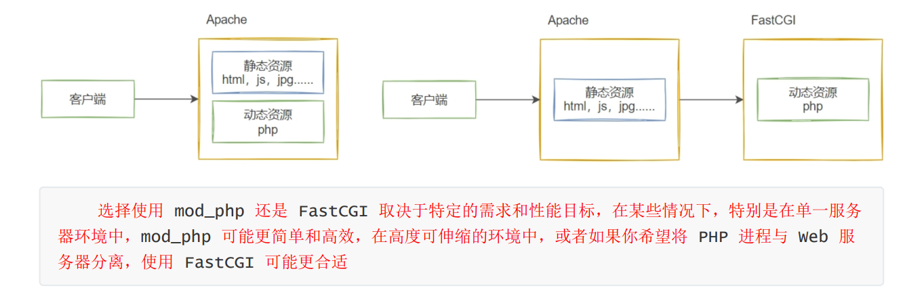

```
apt install php-fpm -y

cat /etc/php/8.3/fpm/pool.d/www.conf
```

加载模块

```shell
proxy_fcgi.load
proxy.load
proxy.conf
```


```powershell
cat > proxy.conf <<-eof
<FilesMatch ".+\.ph(ar|p|tml)$">
    SetHandler "proxy:unix:/run/php/php8.3-fpm.sock|fcgi://localhost"
</FilesMatch>
eof
配置解析：
 因为fpm默认启动的监听机制是 /run/php/php8.3-fpm.sock 
 当然，该选项可以可以直接在一个特定的虚拟主机上进行配置
 当php-fpm的监听地址是 127.0.0.1:9000 的时候，SetHandler属性可以写成如下配置
 SetHandler "proxy:fcgi://127.0.0.1:9000"
```

```shell
对于 PHP 这样的解释型语言来说，每次的运行都会将所有的代码进行一次加载解析，这样一方面的好处是代码随时都可以进行热更新修改，因为我们不需要编译。但是这也会带来一个问题，那就是无法承载过大的访问量。

OPcache 通过将 PHP 脚本预编译的字节码存储到共享内存中来提升 PHP 的性能， 存储预编译字节
码的好处就是省去了每次加载和解析 PHP 脚本的开销。

cat /etc/php/8.3/fpm/conf.d/10-opcache.ini
```

## wordpress

1. 安装 Apache2，PHP-FPM，MySQL 等相关软件 
2. 配置 Apache2，PHP-FPM，保证 Apache2 能解析 PHP 
3. 配置MySQL，创建数据库，连接账号，完成授权等 
4. 下载 Wordpress 源码，并解析到相关目录 
5. 在 Apache2 中配置虚拟主机 
6. 在浏览器中测试，完成部署流程

```shell
apt install mysql-server -y

# php和mysql的模块
apt install php-fpm php-mysqlnd php-json php-gd php-xml php-mbstring php-zip
```

```shell
cat > /etc/apache2/sites-enabled/blog.com.conf <<-eof
<virtualhost *:80>
  DocumentRoot /var/www/html/blog.com/
  ServerName blog.sswang.com
  <FilesMatch \.php$>
    SetHandler "proxy:unix:/run/php/php8.3-fpm.sock|fcgi://localhost"
  </FilesMatch>
  <Directory /var/www/html/blog.com/>
    Require all granted
  </Directory>
</virtualhost>
eof
```

```shell
# mysql修改默认的监听服务
sed -i '/^bind-address/s#127.0.0.1#10.0.0.13#' 

# 配置数据库
create database wordpress;
create user 'wordpresser'@'10.0.0.%' identified with mysql_native_password by '123456';
grant all on wordpress.* to 'wordpresser'@'10.0.0.%';

# 测试
mysql -u'wordpresser' -h 10.0.0.13 -p'123456' -e "select version();"
```

```shell
wget https://cn.wordpress.org/latest-zh_CN.zip
unzip latest-zh_CN.zip
mv wordpress/* /var/www/html/blog.com/
```

到网页点点点