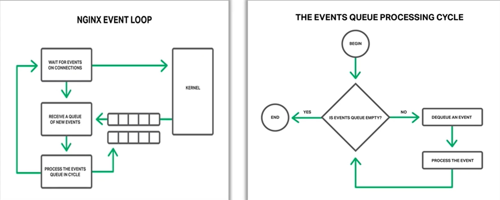
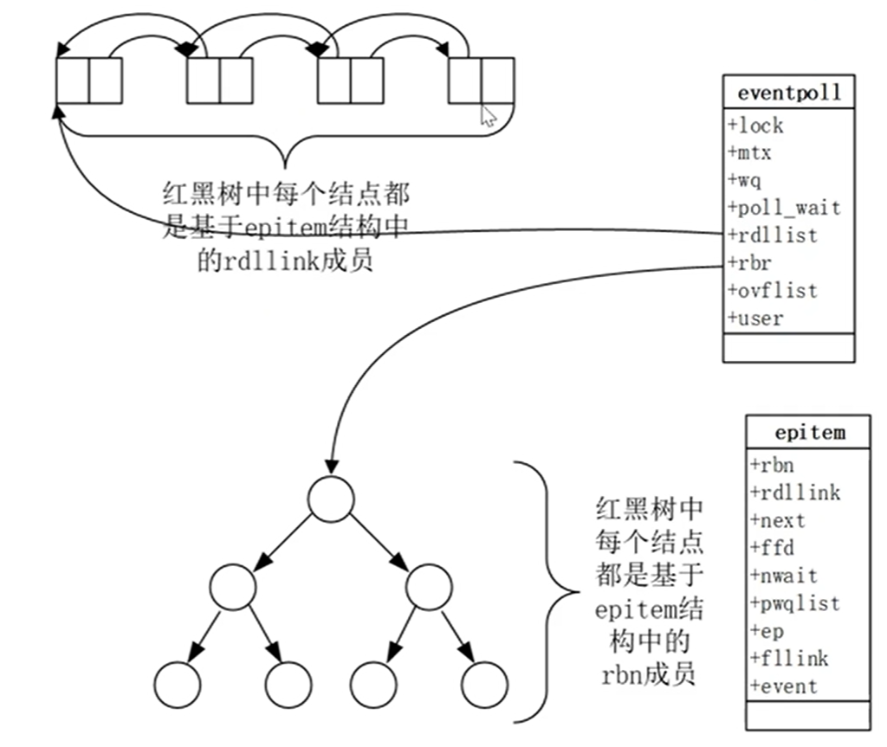
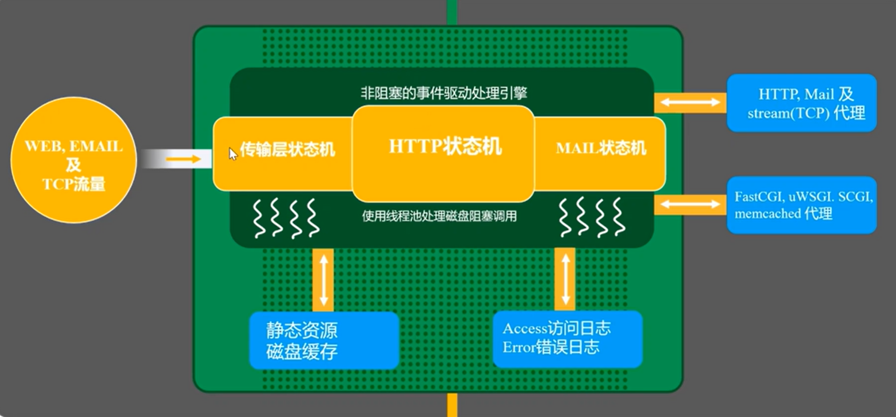
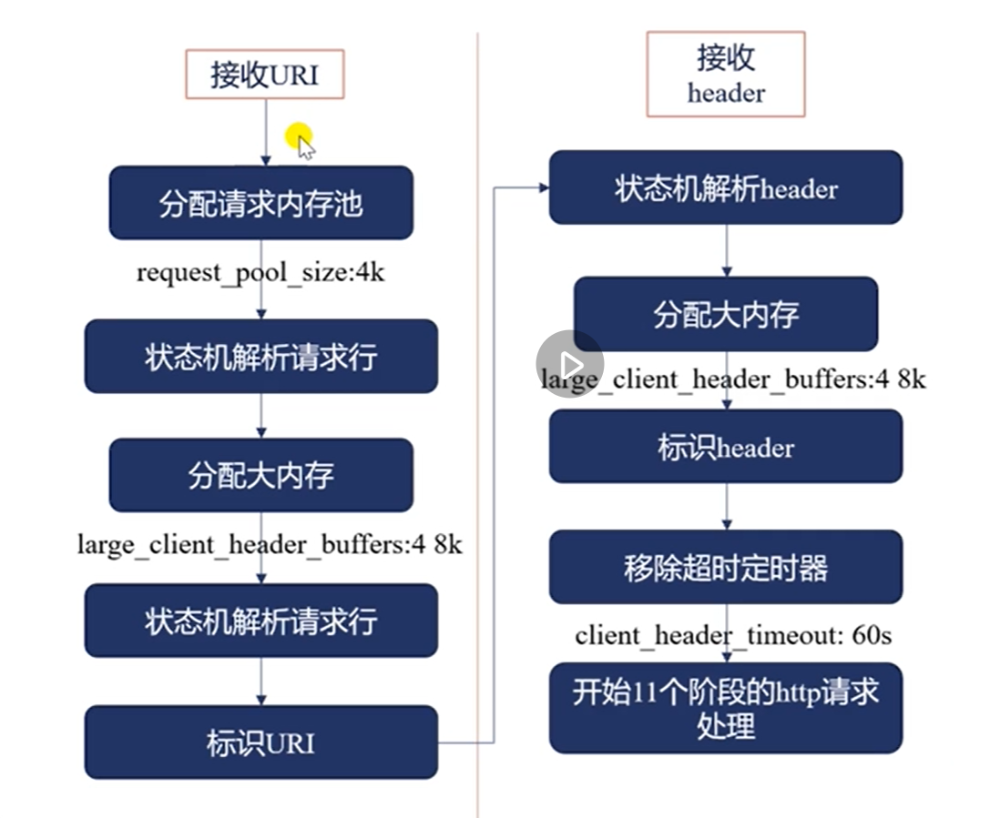
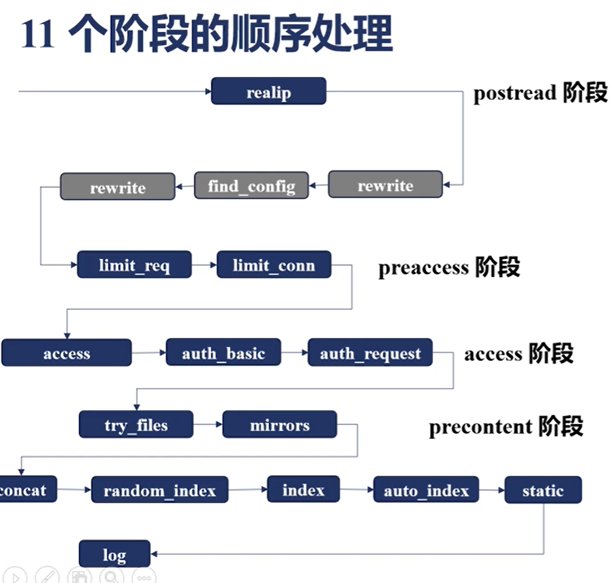
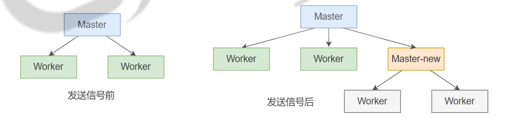
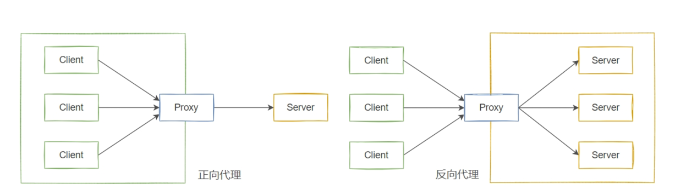
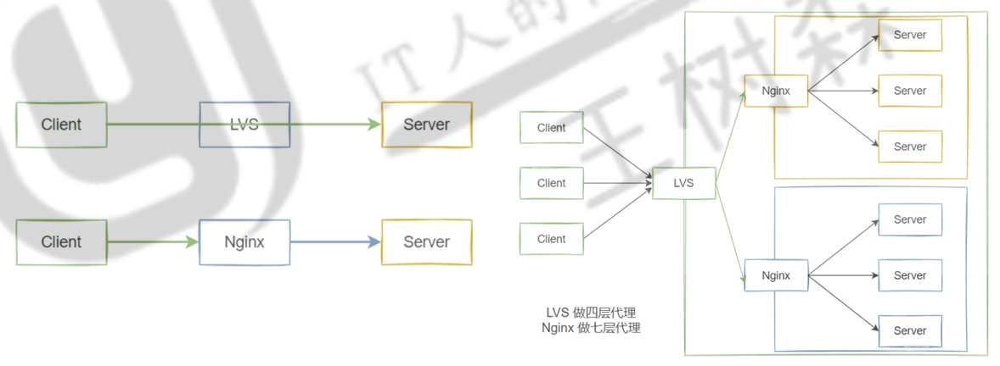
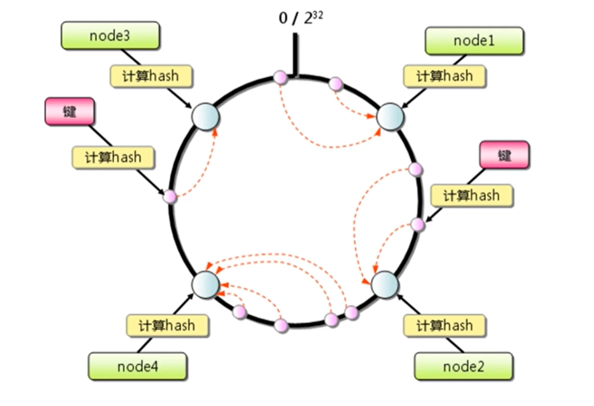
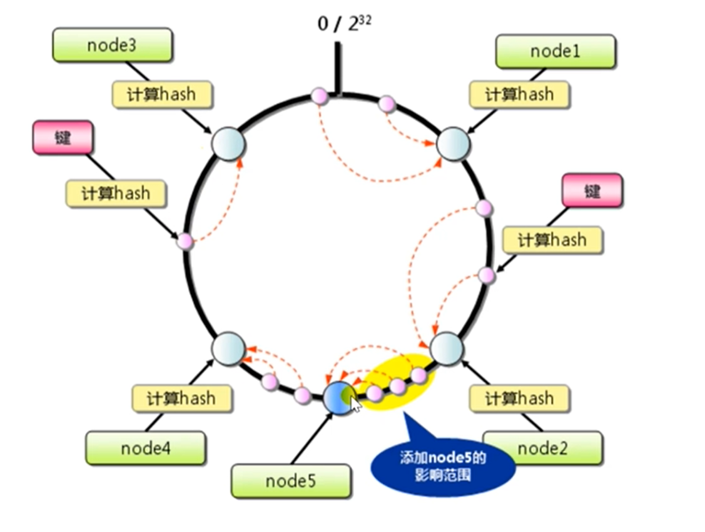

+++
author = "Loong"
title = "NGINX"
date = "2024-12-10"
description = "nginx的安装，配置，使用；以及架构基础的浅薄理解。更多关于架构的细节，可以参考https://www.mysticalrecluse.com/script/teach/Nginx-th.pdf"
tags = [
    "nginx",
]
categories = [
    "Linux service",
]
+++

**<font size=6>模块化，事件驱动，异步，单线程，非阻塞架构，成为nginx代码的基础。</font>**

# Nginx的架构基础

## Nginx进程结构

多进程结构

Apache在使用多线程的时候，因为线程之间是共享同一个地址空间的，当有一个第三方模块引发了一个地址空间引发的段错误时，在地址越界出现时，可能导致整个 Apache 进程崩溃。

而Nginx多进程的模型往往不会出现这种问题，避免了单个进程的崩溃影响整个服务。

## 事件驱动架构

### 事件

Nginx是一个事件驱动的框架，所谓事件指的是网络事件，Nginx每一个连接会自然对应两类网络事件，一个读事件，一个写事件。

事件它本身是一个生产者，是网络中自动生产到nginx中的，我们对每种事件要建立一个消费者

- 比如连接建立事件的事件消费者，就是我们对accept()的调用，那么http模块就会去建立一个新的连接
- 还有很多读事件或者写事件，在http的状态机中，不同的事件，我们会调用不同的方法，也就是每一个消费者去处理。


通过三次握手感受Nginx网络事件处理

```powershell
三次握手的过程：

当浏览器向Nginx服务器发起请求时，会经历经典的TCP三次握手：
第一次握手：浏览器向服务器发送SYN包，表示请求建立连接。
第二次握手：服务器收到SYN包后，返回SYN+ACK包，表示同意建立连接。
第三次握手：浏览器收到SYN+ACK包后，再发送一个ACK包，表示确认连接已经建立。
浏览器和操作系统的通信：

在三次握手的过程中，浏览器发出的数据包（SYN和ACK等）通过操作系统的TCP/IP栈处理，网络层负责实际的数据包传输。
这期间，Nginx服务器并不会立即被通知到，操作系统的内核会负责处理这个TCP连接的建立。
操作系统通知Nginx进程：

只有在三次握手成功完成后，操作系统才会将这个新的连接通知给Nginx。这是因为，在握手过程中，连接还没有正式建立，操作系统只是在处理网络数据包。
当操作系统收到浏览器发送的最后一个ACK包（三次握手的第三步），连接才被认为成功建立。这时，操作系统会通知Nginx服务器进程，告诉它有一个新的连接已经建立，并触发Nginx的读事件。

Nginx的读事件：
Nginx作为一个事件驱动的服务器，会等待内核的通知，通常通过epoll（或kqueue在BSD系统上）监听新连接的到来。内核收到ACK包后，Nginx的事件循环就会被唤醒，并触发相应的读事件（也就是开始处理来自浏览器的HTTP请求）。这个读事件对应的是一个建立新连接，所以nginx此时应该调用accept()这个方法，去建立一个新的连接
```

### Worker 进程与事件循环（Event Loop）

每个 Worker 进程运行一个事件循环，持续监听和处理各种事件（如新连接、数据读取、数据写入等）。事件循环的核心是一个无限循环，依次获取事件并调用相应的处理程序。

每个 Worker 进程维护一个事件循环，主要包括以下步骤：

1. **等待事件**：通过操作系统的事件通知机制（如 `epoll_wait`）等待新事件的到来。
2. **获取就绪事件**：当有事件发生时，获取所有**就绪的事件列表**。
3. **处理事件**：遍历就绪事件列表，根据事件类型调用相应的回调函数进行处理。
4. **循环等待**：处理完所有就绪事件后，继续等待下一个事件。

这种方式避免了线程切换的开销，同时通过单线程的事件驱动模型有效管理大量并发连接。



### epoll

epoll 是 Linux 提供的一种高效的 I/O 事件通知机制，尤其适用于需要处理大量并发连接的场景。

相比于传统的 select 和 poll，epoll 可以处理大规模并发连接，而不会随着监听的文件描述符数量增加而线性增长。

原因：

* `epoll` 内部维护一个红黑树（或其他高效的数据结构）来存储所有监视的文件描述符，并维护一个就绪事件的就绪列表（Ready Double Linked Link List）。这种设计允许 `epoll` 在 O(1) 的时间复杂度内处理事件。


**两种主要数据结构**

* **红黑树**
  * **存储，管理epitem的定时器**
  * **所有epitem的定时器都在树上**
  * 红黑树的根节点始终是 **最近即将超时的定时器**。
  * O(logN)
* **就绪双向链表**
  * **当连接上有可读或可写事件时， epoll 会将epitem标记为活跃，并添加到链表中。**
  * **只存储有有就绪事件（可读/可写）的epitem**
  * O(Nready)


epoll工作流程：

* **创建 `epoll` 实例**：通过 `epoll_create` 创建一个 `epoll` 实例，返回一个文件描述符（`epoll_fd`）。
* **注册和修改事件**：使用 `epoll_ctl` 向 `epoll` 实例中添加、修改或删除感兴趣的文件描述符及其事件。
* **等待和处理事件**：通过 `epoll_wait` 阻塞等待事件的发生，并获取**就绪事件列表**，进行相应的处理。


<font size =6>`epoll` 的关键系统调用</font>

`epoll_create`

```c
int epoll_create(int size);
```

- **参数:**
  - `size`：建议传递大于需要监控的文件描述符数量，但自 Linux 2.6.8 之后，此参数被忽略，建议传递任意正整数。
- **返回值**：成功时返回一个新的 `epoll` 文件描述符，失败时返回 -1 并设置 `errno`。

 `epoll_ctl`

```c
int epoll_ctl(int epfd, int op, int fd, struct epoll_event *event);
```

- **参数**：
  - `epfd`：`epoll` 实例的文件描述符，由 `epoll_create` 返回。
  - `op`：操作类型，可以是 `EPOLL_CTL_ADD`、`EPOLL_CTL_MOD` 或 `EPOLL_CTL_DEL`。
  - `fd`：需要监视的文件描述符。
  - `event`：指向 `epoll_event` 结构的指针，描述感兴趣的事件。
- **返回值**：成功时返回 0，失败时返回 -1 并设置 `errno`。

 `epoll_wait`

```c
int epoll_wait(int epfd, struct epoll_event *events, int maxevents, int timeout);
```

- **参数**：
  - `epfd`：`epoll` 实例的文件描述符。
  - `events`：用户空间数组，用于存储就绪事件。
  - `maxevents`：`events` 数组的最大容量。
  - `timeout`：等待的毫秒数。-1 表示无限等待，0 表示立即返回。
- **返回值**：成功时返回就绪事件的数量，失败时返回 -1 并设置 `errno`。

`epoll_event` 结构

```c
struct epoll_event {
    uint32_t events;    // 事件类型
    epoll_data_t data;  // 用户数据
};
```

- **`events`**：位掩码，表示感兴趣的事件类型，如 `EPOLLIN`、`EPOLLOUT` 等。
- **`data`**：用户自定义的数据，可以是指针、文件描述符或其他数据类型，用于在事件处理时识别具体的资源。


100w个并发连接，但我可能只接收到几百个活跃的连接，我只需要处理几百个活跃的请求，而select或者poll，它们的实现是有问题的，因为每一次我去取操作系统的事件的时候，我都需要把这100w个连接统统的扔给操作系统，让它去依次判断哪些连接上面有事件进来了，所以可以看到这里操作系统做了大量的无用功，它扫描了大量不活跃的连接

epoll使用了一种特性，因为高并发连接中，每次处理的活跃连接数量占比很小




内核空间结构

* `epitem` 即“`epoll item`”。用于表示被 **`epoll`** 监视的每一个文件描述符（File Descriptor, FD）及其相关的事件信息。

* `rdllink` 的全称为 **"Ready Double Linked List Link"**，即 **“就绪双向链表链接”**。通常用于管理 **就绪事件** 或 **超时事件**。
  * 这个列表允许 `epoll` 在调用 `epoll_wait` 时，能够高效地遍历和处理这些已就绪的事件。

* `rbn` 对 **`rb_node`** 的简称。`rb_node` 是红黑树（Red-Black Tree）中的一个节点结构，用于在 `epoll` 的红黑树中组织和管理被监视的文件描述符（File Descriptors, FD）。


示例：

1. 初始化阶段

   * 调用 `epoll_create()` 创建 `epoll` 实例 ( fd )。
   * 初始化红黑树
   * 初始化就绪双向链表（`rdllist`）
   * 调用`epoll_ctl()`注册`listen_fd`，监听`EPOLLIN`（可读）事件

2. 新连接到来

   * 内核会将客户端的请求从`SYN` 队列转移到 `accept` 队列。
   * `listen_fd` 的可读状态变为 true，并触发`EPOLLIN` 事件。
   * `listen_fd`的`epitem`的指针被引用到`rdllist`（就绪链表）
   * `epoll_wait()`取出`rdllist`里的就绪事件fd
   * Nginx 使用 `accept() `从 `accept` 队列中取出新连接的 `client_fd`
   * e`poll_ctl()` 将 `client_fd` 注册到 `epoll`，并加入红黑树中（定时器）

3. 第一个请求

   * `client_fd`有读事件，它的`epitem`的指针被引用到`rdllist`（就绪链表）
   * `epoll_wait()`取出`rdllist`里的就绪事件fd
   * 刷新连接的定时器。
   * 将红黑树中的旧节点删除。插入新的超时节点，更新超时时间。
   * Nginx 处理http请求
   * 将生成的响应数据存入缓冲区
   * 调用 `epoll_ctl(EPOLL_CTL_MOD)`，将 `client_fd` 的事件类型改为 **`EPOLLOUT`（可写事件）**。等待 socket 可写。

4. 写事件处理

   * 当 socket 可写时，内核将 `client_fd` 的 `epitem` 加入到 `rdllist`。

   * `epoll_wait()` 返回写事件。

   * Nginx调用连接的 `write` 回调函数，将缓冲区的数据写入客户端。

   * 如果响应数据发送完成且连接关闭：

     - 调用 `epoll_ctl(EPOLL_CTL_DEL)` 将 `client_fd` 从 `epoll` 中移除。
     - 将连接资源释放，返回到空闲连接池。

     如果是长连接，则继续监听读事件（`EPOLLIN`）。

## Nginx中的连接池

### worker_connections 数组

Nginx 维护的“连接池（连接数组）”是 Nginx 用来高效管理客户端连接的一个重要机制。

每个新的 client_fd（客户端连接的文件描述符）会在 Nginx 中与一个 `ngx_connection_t` 结构体关 联，这个结构体用来管理和表示与这个客户端连接的所有相关数据和上下文。


连接数组的本质是一个静态分配的 ngx_connection_t 结构体的数组。 

每个 ngx_connection_t 代表一个客户端的 TCP 连接。 

这些数组会在Nginx worker 进程启动时提前分配好，不在请求的过程中动态分配。


用户空间中，Nginx使用`ngx_connection_t`结构体数组（连接池）存放所有连接。

内核空间中，内核使用`epitem`结构体存放连接的信息，红黑树存放所有连接的定时器，`rdllist`存放有就绪事件的连接。


* `epitem` 属于**内核态**，管理文件描述符的事件（监听哪些事件、是否就绪等）。

* `ngx_connection_t` 属于**用户态**，提供对文件描述符及其事件的逻辑处理。

用户通过 `epoll_ctl()` 将 `ngx_connection_t` 的文件描述符注册到 `epoll`。

内核会为该文件描述符创建一个 `epitem`。

当 `epitem` 触发事件时，`epoll_wait()` 返回该文件描述符，用户态通过这个文件描述符找到对应的 `ngx_connection_t`。


**连接池的核心结构** 

* Nginx 在每个 worker 进程中都会维护一个连接池，这个连接池是一个数组。 
* 这个数组的大小是 `worker_connections` ，所以每个 worker 进程最多可以管理的并发连接数是 `worker_connections`。

**连接池的分配和回收** 

* 新连接到来时，从连接池中取出一个可用的 `ngx_connection_t`，并将 `client_fd` 赋值给它。 
* 连接关闭时，将这个 `ngx_connection_t` 重新放回到空闲连接池，以供复用。


Nginx 使用一个空闲链表 (free_connections) 来维护当前未使用的连接对象。 

当新的client_fd 到来时，Nginx 会从free_connections 链表头中获取一个 ngx_connection_t。 

当连接关闭时，将 ngx_connection_t 放回到 free_connections 链表头，实现复用连接对象的目 的。


**连接分配的过程** 

当有一个新的客户端请求到来时，Nginx 需要分配一个 ngx_connection_t ，这个过程如下： 

1. 从 free_connections 中取出一个 ngx_connection_t： 
   * Nginx 检查 free_connections 是否为空。 
   * 如果空闲链表不为空，则将 free_connections 链表的第一个节点从链表中移除，并将其作为 新连接的 ngx_connection_t。 
   * 更新 free_connection_n，减少 1。 
2. 初始化 ngx_connection_t：
   * 设置 client_fd：将 accept() 返回的 client_fd 存入 ngx_connection_t->fd 。 
   * 分配内存池：为这个连接分配一个512 字节的内存池 ngx_pool_t。 
   * 监听事件：将 client_fd 注册到 epoll 中。

**连接释放的过程** 

当客户端关闭连接时，Nginx 需要释放这个连接，这个过程如下： 

1. 释放内存池：
   * Nginx 销毁这个连接的 内存池 (ngx_pool_t)。 
2. 将 ngx_connection_t 重新放回 free_connections ： 
   * 将这个 ngx_connection_t 连接重新加入到 free_connections 链表头。 
   * 更新 free_connection_n，增加 1。


### 读事件和写事件数组

在 Nginx 启动时，除了worker_connections 数组外，Nginx 还会创建两个同样长度的读事件和写事件 的数组。这两个数组分别用于管理读事件和写事件，这也是 Nginx 的事件驱动模型的核心。

同一连接的worker_connections 数组，读数组与写事件数组的索引相同。


## Nginx处理请求流程



* 进入Nginx后，有三个大的状态机处理三种流量不同流量

  - 一个是处理TCP，UDP的传输层状态机

  - 一个处理应用程的HTTP状态机

  - 以及处理邮件的MAIL状态机

* nginx中，核心的深绿色的框，它使用非阻塞的事件驱动处理引擎，也就是EPOLL

* 当整个内存已经不足以缓存住所有的文件缓存信息时
  - 会退化成阻塞的磁盘调用，通常使用线程池处理磁盘阻塞调用
* 对于每一个处理完成的请求
  - 记录access日志和error日志，这两个日志也是记录磁盘中的，可以通过rsyslog，把它记录到远程主机上
  - 更多的时候，nginx作为负载均衡和反向代理使用
  - 这个时候可以把请求协议级传输到后面的服务器
  - 也可以通过例如：应用层的一些协议，fasetcgi、uWSGL，SCGL等代理到相应的应用服务器


## Http请求处理

### 解析请求行与请求头



这里处理请求和处理连接是不一样的，处理连接的话，可能我只需要把连接收到我的nginx内存中就ok，但处理请求可能需要进行大量的上下文分析，去分析http协议，分析每一个header，所以此时要分配一个请求内存池，请求内存池默认分配4k，因为请求的上下文通常涉及业务，因此分配的会大一点，4k通常是比较合适的数值

分配完内存池后，nginx会使用状态机解析请求行，解析请求行的时候可能会发现有的url特别大，已经超过了刚刚分配的1k的内存，此时就要分配一个更大的内存`large_client_header_buffers:4 8k`（这里并不是直接分配32k，而是先分配1个8k，然后将1k的内容拷贝到这里，此时还剩7k，我们用剩余的7k内存再去接收httpurl，看url是不是解析完了，如果8k的url实在是太长了，8k还没有接收完，就会再分配第二个8k，最多分配32k）

当我完整的解析完请求行，通过解析到\of\path，我就可以标识url，那么标识完url，nginx会继续解析http的各首部字段header

状态机解析header各字段，然后如果当前分配的内存不足以放header的各字段，就还会分配内存，这里接受请求行的内存和接收header各字段的共用一个内存，共用4*8k的内存

接收完完整的header后，标识header，标识header的过程中，但是收到hosts的字段时会确定哪个server块来处理这个请求，当我标识完所有的header后，会移除超时定时器，`client_header_timeout: 60s`

开始11个阶段的http请求处理，上述所有的过程都是nginx的框架处理的，后续的内容才是http模块来处理。


### Http状态机

**11个阶段**

| **阶段名称**                      | **索引位置** | **状态机执行的操作**                                     |
| --------------------------------- | ------------ | -------------------------------------------------------- |
| **NGX_HTTP_POST_READ_PHASE**      | 0            | 读取请求体，调用相关的请求体过滤器。                     |
| **NGX_HTTP_SERVER_REWRITE_PHASE** | 1            | 服务器级别的 URL 重写，执行 `rewrite` 指令。             |
| **NGX_HTTP_FIND_CONFIG_PHASE**    | 2            | 查找 `location {}` 的匹配规则，确定请求的处理方式。      |
| **NGX_HTTP_REWRITE_PHASE**        | 3            | `location` 级别的 URL 重写阶段，调用相关模块的重写规则。 |
| **NGX_HTTP_POST_REWRITE_PHASE**   | 4            | URL 重写结束后的阶段，执行重写后的收尾操作。             |
| **NGX_HTTP_PREACCESS_PHASE**      | 5            | 权限检查前的阶段，预处理权限相关逻辑。                   |
| **NGX_HTTP_ACCESS_PHASE**         | 6            | 访问控制阶段，控制 IP 地址、白名单等访问权限。           |
| **NGX_HTTP_POST_ACCESS_PHASE**    | 7            | 访问控制后的阶段，通常用于访问控制的后续处理。           |
| **NGX_HTTP_TRY_FILES_PHASE**      | 8            | 执行 `try_files` 指令，根据配置尝试匹配文件路径。        |
| **NGX_HTTP_CONTENT_PHASE**        | 9            | 生成响应的阶段，调用模块的 `content` 指令处理响应内容。  |
| **NGX_HTTP_LOG_PHASE**            | 10           | 记录日志阶段，通常记录到 `access.log` 或 `error.log`。   |


**可以挂载钩子函数的阶段**

| **阶段名称**                      | **阶段索引** | **是否可挂钩子函数** | **常见用途**                                                 |
| --------------------------------- | ------------ | -------------------- | ------------------------------------------------------------ |
| **NGX_HTTP_POST_READ_PHASE**      | 0            | ✅ 是                 | 用于读取和过滤请求体，解析请求的预处理。                     |
| **NGX_HTTP_SERVER_REWRITE_PHASE** | 1            | ✅ 是                 | 服务器范围的 URL 重写，可插入自定义 URL 转发逻辑。           |
| **NGX_HTTP_FIND_CONFIG_PHASE**    | 2            | ❌ 否                 | 查找 `location {}` 配置的阶段，不允许挂钩子函数（核心内部逻辑）。 |
| **NGX_HTTP_REWRITE_PHASE**        | 3            | ✅ 是                 | `location {}` 范围的 URL 重写规则。                          |
| **NGX_HTTP_POST_REWRITE_PHASE**   | 4            | ✅ 是                 | URL 重写结束后的收尾阶段，适合处理重写后需要额外处理的逻辑。 |
| **NGX_HTTP_PREACCESS_PHASE**      | 5            | ✅ 是                 | 权限检查前的阶段，可插入预处理逻辑（如用户身份初始化）。     |
| **NGX_HTTP_ACCESS_PHASE**         | 6            | ✅ 是                 | 访问控制阶段，用于 IP 白名单、认证模块的扩展。               |
| **NGX_HTTP_POST_ACCESS_PHASE**    | 7            | ✅ 是                 | 访问控制后的阶段，通常用于访问控制的后续处理逻辑。           |
| **NGX_HTTP_TRY_FILES_PHASE**      | 8            | ❌ 否                 | `try_files` 指令的执行阶段，不允许挂钩子函数（内部优化逻辑）。 |
| **NGX_HTTP_CONTENT_PHASE**        | 9            | ✅ 是                 | 响应生成阶段，可扩展为动态内容服务或自定义响应模块。         |
| **NGX_HTTP_LOG_PHASE**            | 10           | ✅ 是                 | 日志记录阶段，扩展日志模块或请求统计逻辑。                   |


钩子函数就是会被某个阶段会被触发的函数。

可以自己写个函数，将其注册到某一阶段中。当状态到达那一阶段，函数就会被触发。





## 零拷贝

传统Linxu中I/O的问题

大量数据的拷贝，用户态和内核态的频繁切换，会消耗大量的CPU资源，严重影响数据传输的性能


什么是零拷贝

- 零拷贝就是上述问题的一个解决方案，通过尽量避免拷贝操作，来缓解CPU压力


### MMAP技术


数据在内核空间，不拷贝到用户空间。

应用通过用户空间存储的数据地址直接修改内核空间数据。

### SENDFILE


静态资源不需要应用处理，可以直接发送的数据，不经过用户空间。

### DMA辅助的SENDFILE（需要专用硬件支持）


# nginx 源码安装 ubuntu

```shell
# 编译环境准备
apt install build-essential gcc g++ libc6 libc6-dev libpcre3 libpcre3-dev libssl-dev libsystemd-dev zlib1g-dev

apt install libxml2 libxml2-dev libxslt1-dev php-gd libgd-dev geoip-database libgeoip-dev

# 创建运行用户
useradd -r -s /usr/sbin/nologin nginx

# 下载最新版源码并解压
wget https://nginx.org/download/nginx-1.24.2.tar.gz
tar xf nginx-1.24.2.tar.gz

# 定制配置
cd nginx-1.24.2/
./configure --prefix=/nginx --user=nginx --group=nginx --with-http_ssl_module --with-http_v2_module --with-http_realip_module --with-http_stub_status_module --with-http_gzip_static_module --with-pcre --with-stream --with-stream_ssl_module --with-stream_realip_module

./configure --prefix=/nginx --user=nginx --group=nginx --with-compat --with-debug --with-pcre-jit --with-http_ssl_module --with-http_stub_status_module --with-http_realip_module --with-http_auth_request_module --with-http_v2_module --with-http_dav_module --with-http_slice_module --with-threads --with-http_addition_module --with-http_flv_module --with-http_gunzip_module --with-http_gzip_static_module --with-http_mp4_module --with-http_random_index_module --with-http_secure_link_module --with-http_sub_module --with-mail_ssl_module --with-stream_ssl_module --with-stream_ssl_preread_module --with-stream_realip_module --with-http_geoip_module=dynamic --with-http_image_filter_module=dynamic --with-http_perl_module=dynamic --with-http_xslt_module=dynamic --with-mail=dynamic --with-stream=dynamic --with-stream_geoip_module=dynamic

# 编译安装
make && make install
```

```shell
# 修改目录属主属组并查看
chown -R nginx:nginx /nginx/

# 创建软链接
ln -sv /nginx/sbin/nginx /usr/sbin/nginx

# 导入手册
cp man/nginx.8 /usr/share/man/man8/

mandb

# 创建PID 目录
mkdir /nginx/run

vim /nginx/conf/nginx.conf
pid    /nginx/run/nginx.pid;

# 创建nginx服务脚本
vim /usr/lib/systemd/system/nginx.service
[Unit]
Description=nginx - high performance web server
Documentation=http://nginx.org/en/docs/
After=network-online.target remote-fs.target nss-lookup.target
Wants=network-online.target

[Service]
Type=forking
PIDFile=/nginx/run/nginx.pid
ExecStart=/nginx/sbin/nginx -c /nginx/conf/nginx.conf
ExecReload=/bin/kill -s HUP $MAINPID
ExecStop=/bin/kill -s TERM $MAINPID
LimitNOFILE=100000

[Install]
WantedBy=multi-user.target

# 重载服务脚本
systemctl daemon-reload
systemctl start nginx
```

# Nginx 命令

```shell
# 检查配置文件语法，并测试配置文件
nginx -t

nginx -g "worker_processes 3;"

# 前台运行
nginx -g "daemon off;"
```

信号

```shell
stop 				#立即停止，没处理完的请求也会被立即断开，相当于信号 SIGTERM,SIGINT
quit 				#优雅退出，不再接收新的请求，但己建立的连接不受影响，相当于信号 SIGQUIT
reopen 				#重开一个新的日志文件，日志内容写新文件，相当于信号 SIGUSR1 
reload 				#重新加载配置文件，重新生成worker 进程，不中断正在处理的请求，
   					#己建立的连接按旧配置处理，新连接用新配置处理
                    #同 systemctl reload nginx
SIGUSR2 			#平滑升级二进制文件，适用于版本升级 
SIGWINCH 			#优雅的停止工作进程，适用于版本升级
```

```shell
# 服务端发送 stop 信号，客户端会立即断开
nginx -s stop

# 服务端发送 quit 信号，服务器完成传输后退出
nginx -s quit
```

# 版本更新

## 平滑升级

Nginx 的平滑升级是指在不中断服务的情况下进行软件版本或配置文件的更新。通过平滑升级，Nginx  能够在运行时应用新的配置或软件版本，继续处理请求，而不影响现有的连接。

然而，需要注意的是，平滑升级并不适用于所有场景，特别是在某些配置或软件更改可能导致 不兼容性问题的情况下，在进行平滑升级之前，建议先在测试环境中进行充分的测试。

```powershell
- 新版本或配置准备：
 准备好新版本的 Nginx 可执行文件或配置文件，并确保它们没有问题
- 新版本资源替换旧版本资源：
 进行资源替换，此步骤要备份旧版本资源，可以用作回滚
- 发送信号：
 使用 nginx -s SIGUSR2，nginx -s reload 等方式向 Nginx 主进程发送重新加载的信号
- 新的工作进程启动：
 Nginx 主进程接收到重新加载信号后，会启动新的工作进程，并使用新的配置文件或软件版本
- 平滑过渡：
 新的工作进程逐渐接管现有的连接。现有的连接会在旧的工作进程中继续处理，而新的连接会由新的工作
进程处理
- 旧的进程退出：
 当旧的工作进程不再有活动连接时，它会被关闭
```

```shell
nginx -V
# 查看现有版本配置，完全复制
```

```shell
./configure --with-cc-opt='-g -O2 -fno-omit-frame
pointer -mno-omit-leaf-frame-pointer -ffile-prefix-map=/build/nginx-DlMnQR/nginx
1.25.0=. -flto=auto -ffat-lto-objects -fstack-protector-strong -fstack-clash
protection -Wformat -Werror=format-security -fcf-protection -fdebug-prefix
map=/build/nginx-DlMnQR/nginx-1.25.0=/usr/src/nginx-1.25.0-2ubuntu7.1 -fPIC 
Wdate-time -D_FORTIFY_SOURCE=3' --with-ld-opt='-Wl,-Bsymbolic-functions 
flto=auto -ffat-lto-objects -Wl,-z,relro -Wl,-z,now -fPIC' -
prefix=/usr/share/nginx --conf-path=/etc/nginx/nginx.conf --http-log
path=/var/log/nginx/access.log --error-log-path=stderr --lock
path=/var/lock/nginx.lock --pid-path=/run/nginx.pid --modules
path=/usr/lib/nginx/modules --http-client-body-temp-path=/var/lib/nginx/body -
http-fastcgi-temp-path=/var/lib/nginx/fastcgi --http-proxy-temp
path=/var/lib/nginx/proxy --http-scgi-temp-path=/var/lib/nginx/scgi --http-uwsgi
temp-path=/var/lib/nginx/uwsgi --with-compat --with-debug --with-pcre-jit --with
http_ssl_module --with-http_stub_status_module --with-http_realip_module --with
http_auth_request_module --with-http_v2_module --with-http_dav_module --with
http_slice_module --with-threads --with-http_addition_module --with
http_flv_module --with-http_gunzip_module --with-http_gzip_static_module --with
http_mp4_module --with-http_random_index_module --with-http_secure_link_module -
with-http_sub_module --with-mail_ssl_module --with-stream_ssl_module --with
stream_ssl_preread_module --with-stream_realip_module --with
http_geoip_module=dynamic --with-http_image_filter_module=dynamic --with
http_perl_module=dynamic --with-http_xslt_module=dynamic --with-mail=dynamic -
with-stream=dynamic --with-stream_geoip_module=dynamic
```

```shell
make	# 不要执行 make install，make install可能会将旧配置替换
# 库文件都是携带版本号的，编译的时候，很多是不带版本号的，所以创建一个软连接
# 编译会报错，哪个库文件报错，创建哪个不带版本号的软链接
ln -s /usr/lib/x86_64-linux-gnu/libperl.so.5.38 /usr/lib/x86_64-linux-gnu/libperl.so
## --with-http_perl_module=dynamic
```

```shell
# 确认生成的文件
ls objs/
```

```shell
# 新旧版本切换

# 备份旧执行文件
mv /usr/sbin/nginx /usr/sbin/nginx-1.24

# 应用新执行文件
chmod +x ./objs/nginx
cp ./objs/nginx /usr/sbin/

# 为了避免版本兼容性相关的问题，删除启用动态功能模块.
rm -rf /etc/nginx/modules-enabled/*

# nginx 检测，配置文件可用，版本己更新
nginx -t
```

```shell
# master进程交接

# 向旧版本master进程发起信号
kill -USR2 26077

# kill -USR2 命令会让 Nginx 主进程通过发送 USR2 信号来启动一个新的主进程，该新主进程会加载新的二进制文件（比如升级后的 Nginx 可执行文件）。

# 新版本master挂再旧版本master下

# 让旧版本master下的工作进程 优雅退出；关闭旧的 woker 进程，新请求交由新的 worker 进程处理
kill -WINCH 26077

# 旧版本woker 进程全部退出，但是旧的master进程依然处于存活状态。

# 旧版本master退出
kill -QUIT 26077
# done

# 不直接使用QUIT信号的原因
# QUIT会停止nignx的接收后续请求；新请求也不会交给新的 worker 进程处理
```



## 平滑回退

旧版本 master 未退出时进行，`kill -QUIT 26077` 前发现 nginx 工作异常，开始回滚。

```shell
# 执行文件替换
mv /usr/sbin/nginx /usr/sbin/nginx-1.25
mv /usr/sbin/nginx-1.24 /usr/sbin/nginx

# 依然是新版本的nginx提供服务访问

# 拉起旧版本master
kill -HUP 26077
# 旧master拉起俩worker

# 退出新版本master
kill -QUIT 31819
```

# 新增第三方模块

`--add module=PATH`

`--add-dynamic-module`

```powershell
0 准备nginx源码- 如果本地没有源码的话，可以从官网下载一个同版本的nginx源码
1 下载模块
2 编译安装
3 测试效果
```

```powershell
ngx_http_upstream_hash_module
实现基于哈希的负载均衡，可以根据请求的某些特征（如URL、请求头等）来计算哈希值，并将请求分发到相应的后端服务器。这有助于实现更智能、更均衡的负载均衡策略。

echo-nginx-module
在Nginx中输出一些信息，可以用来实现简单接口或排错。通过配置该模块，可以在Nginx中直接打印变量值、处理结果等信息，方便开发者进行调试和测试。

WebDAV支持模块
为Nginx添加WebDAV（基于HTTP的远程文件访问协议）支持，使得用户可以通过HTTP协议对服务器上的文件进行上传、下载、删除等操作。

Lua脚本集成模块
允许在Nginx中集成Lua脚本，实现更复杂的请求处理和响应生成逻辑。通过Lua脚本，可以灵活地处理请求参数、访问后端服务、生成响应内容等。

https://github.com/vozlt/nginx-module-vts           # 第三方流量监控模块
https://github.com/openresty/echo-nginx-module		#  echo 模块，可以直接输出
```

```shell
# 编译安装时带上
--add-module=/usr/local/echo-nginx-module-0.63

# 编译
make

# 替换执行文件
mv /usr/sbin/nginx /usr/sbin/nginx-1.24
chmod +x ./objs/nginx
cp ./objs/nginx /usr/sbin/

# 重启服务
systemctl restart nginx
```

# nginx 配置

nginx.conf 核心配置

```shell
# --- 全局配置段 --
user ...;
worker_processes ...;
...
 
# --- 事件驱动相关的配置 --
events {
	...;
}

# --- http/https 协议相关配置段 ---
http {
	...;
	server {
		...;
		location {
			...;
		}
	}
}

# --- mail 协议相关配置段，默认被注释 --
mail {
	server {
		...;
	}
}

# --- stream 协议相关配置 --
stream {
	...;
}
```

## 全局配置

```shell
user <user> [group];								# 指定worker 进程运行时的用户和组，默认值为 nobody

worker_processes  auto|N; 							# worker 进程数量

worker_cpu_affinity auto|cpumask;					# 绑定CPU核心
													# 几个CPU几个0
													# 双核：01   10
													# 四核：0001 0010 0100 1000

pid /path/file;										# pid 文件路径

worker_priority N;									# worker 进程优先级，默认值为0
													# 此处设定的是 nice 值，取值为 -20 到 19

worker_rlimit_nofile N;								# 所有worker进程可以打开的文件描述符数量之和，默认不限制
													# 此值并不仅仅是指nginx 与客户端的连接数，包括与后端服务的连接数
													
daemon on|off;										# 默认值为on, 表示以后台守护进程方式运行，off 表示前台运行

master_process on|off;								# 默认值为on, 表示以 master-worker 模式运行，off 只有master 														进程，用于开发调试

include /path/file;									# 文件包含,指定要包含的文件路径及规则，可以使用通配符
```

## evnets 配置

```shell
events {

worker_connections N;					# 默认值512，单个worker进程所支持的最大并发连接数

multi_accept on|off;					# 默认值 off，on 表示worker 进程一次可以接收多个新的连接请求

accept_mutex on|off;					# 默认值 off，表示master 进程获得客户端请求后，会通知所有的worker 进程，由当前										 状态最佳的worker进程处理请求；此过程也被称为 惊群。多个worker同时竞争致性能问题
										# on 表示 master 进程轮流给 worker进程分配要处理的连接，此处建议设置为 on

use method;							 	# 指定事件驱动模型,默认不设置此项，nginx 会根据当前系统自行选择
                                    	# 可用值 select|pool|kqueue|epoll|/dev/poll|eventport
}
```

## http 配置

```shell
http {
charset  charset|off;						# 是否在响应头 Content-Type 行中添加字符集，默认 off
											# 中文字符集 utf-8

sendfile on|off;							# 默认值 off，on表示使用 sendfile 函数来传送数据,即零拷贝
											# on：在文件描述符之间传输数据，不需要在用户态和内核态之间反复切换。静态文件												的高效传输
# 零拷贝技术，数据不经过用户缓冲区
# 1. sendfile 将静态数据直接从内核缓冲区发出
# 2. 内存映射（Memory Mapping，mmap）将内核空间地址映射到用户空间，这就可用直接处理内核空间的数据

tcp_nopush on|off;							# 默认值 off。减少 TCP 数据包的分片，提升传输效率。将小数据合并

tcp_nodelay on|off;							# Nagle 算法 相关的配置项，主要用于优化小数据包的发送。
											# off：小数据包延迟0.2秒发送
											# on：禁用 Nagle 算法。小数据包会立即发送，无需等待缓冲区填满或接收到 													ACK。

# tcp_nopush与tcp_nodelay同时开启时，小数据包会被合并，0.2秒后一起发送

keepalive_timeout timeout [header_timeout]; # 会话保持的时长，单位为秒，第二个值会出现在响应头中，可以和第一个值不一样

keepalive_requests number;					# 一次请求不断开连接的情况下最多可以传送多少个资源
											# 默认值 keepalive_requests 1000;

types_hash_max_size N; 						# 默认值1024，用于设置 MIME 类型哈希表大小

server_tokens on|off|build|string; 			# 默认值on，是否在响应头中显示 nginx 信息，off 表示不显示

server_names_hash_bucket_size N;			# 默认值32|64|128，服务器名哈希桶大小，当配置了大量虚拟主机时，
											#此项可用来提升性能

server_name_in_redirect on|off; 			# 默认值off,表示在重定向时响应头中不包含 Server行
											# on 表示显示 Server 头
include /etc/nginx/mime.types;				# #规定了各种后缀文件在响应报文中的 Content-Type 对应的值

default_type application/octet-stream;		# 除了上述映射外，其它类型文件都用此值

ssl_protocols [SSLv2] [SSLv3] [TLSv1|.1|.2|.3];	# 当前nginx 可支持的 ssl协议版本

ssl_prefer_server_ciphers on|off;			# 默认off，表示在 SSL/TLS 握手时优先使用客户端加密套件

access_log path [format [buffer=size] [gzip[=level]] [flush=time] [if=condition]];

error_log file [level]; 

error_page code ... [=[response]] uri;		# 定义指定状态码的错误页面，可以多个状态码共用一个资源

# 压缩配置
gzip on|off;

gzip_vary on|off;					#在启用了压缩的情况下，是否在响应头中添加 Vary: Accept-Encoding 行，默认off

gzip_proxied off|expired|no-cache|no-store|private|no_last_modified|no_etag|auth|any ...;

gzip_comp_level N;
gzip_buffers number size;

gzip_http_version N; 
	
gzip_min_length length;				# 资源体积多大才启用压缩，默认20，

gzip_types mime-type ...;			# 根据 MIME 来决定是否对数据进行压缩,默认值text/html

# 站点配置
server { ... }
# 见下文
}
```

## http 中 server 配置

```shell
server { 
listen address[:port] [default_server] [ssl];       
listen port [default_server] [ssl];
listen unix:path [default_server] [ssl];

# default_server：将当前 server 块设置为默认服务器，处理未匹配任何 server_name 的请求。
# ssl：启用 SSL/TLS（HTTPS）支持

ssl_certificate  file;

ssl_certificate_key file;

ssl_session_cache off|none|[builtin[:size]] [shared:name:size];	# 是否启用 ssl 缓存，默认 none

ssl_session_timeout N;									# 客户端连接可以复用 ssl session cache 中缓存的有效时长，默认															5m

ssl_ciphers ciphers;									# 指定 SSL/TLS 加密算法，默认值 HIGH:! aNULL:! MD5;

ssl_prefer_server_ciphers on|off;						# 默认 off，表示在 SSL/TLS 握手时优先使用客户端加密套件，
														# on 表示优先使用服务端套件


server_name example.com;					# 虚拟主机域名，可以写多个值，客户端请求头中的 Host 字段会与此处匹配
											# 默认值是 ""，用来匹配请求头中 Host 字段值为空的请求
											# 还可以写成 _,@ 等用来表示无效域名，和 listen 中的 default_server 配合

root /nginx/html;							# 当前虚拟主机网页文件目录，写在 location 中，文件路径是 root+location
index index.html index.htm;


}
```

``` shell
server {
	listen 80 default_server;
	server_name www.a.com;
	root /data/server/nginx/web1;
}

server {
	listen 80;
	server_name www.b.com;
	root /data/server/nginx/web2;
}

server {
	listen 80;
	server_name www.c.com;
	root /data/server/nginx/web3;
}
```


## server 中 Location配置

``` shell
Location /  { ... }
Location /string  { ... }

Location [ = | ~ | ~* | ^~ ] uri { ... }
# = ：精确匹配。
# ~ ：区分大小写的正则匹配。
# ~* ：不区分大小写的正则匹配。
# ^~：优先的前缀匹配（用于关闭正则匹配）。

Location @name  { ... }
# 定义一个 name 的动作，供调用
error_page 404 = @not_found;
location @not_found {
        return 404 "Custom 404 Page Not Found";
}
```

``` shell
Location {
alias path;											# 定义路径别名，把访问路径重新映射到其它目录

root path;											# 定义网站在文件系统上的家目录

index file ...;

return code [text]|code URL|URL;					# 直接给客户端返回状态码+字符串或 URL

proxy_pass URL;										# 设置反向代理，将符合规则的请求转发到后端服务器进行处理

fastcgi_pass address;

fastcgi_index name;

fastcgi_param parameter value [if_not_empty];

deny address|CIDR|unix:|all;						# 拒绝访问的客户端，黑名单

allow address|CIDR|unix:|all;						# 允许访问的客户端，白名单，可以是具体 IP

try_files file ... uri|file ... = code; 				# 按顺序查询文件是否存在，并返回匹配到的信息

}
```

### url匹配

**匹配优先级**

当多个 `location` 指令可能匹配同一个 URI 时，Nginx 会按照以下顺序选择最优的匹配规则：

1. **精确匹配 (`=`)**：
   - 如果找到了精确匹配，则立即使用。
2. **普通前缀匹配**：
   - 如果 URI 匹配多个普通前缀，选择最长匹配的前缀。
3. **优先前缀匹配 (`^~`)**：
   - 如果 URI 匹配了 `^~` 前缀规则，则立即使用此规则，不再继续检查正则匹配。
4. **正则匹配 (`~` 和 `~\*`)**：
   - 如果没有精确匹配或优先前缀匹配，则检查正则规则，并选择第一个匹配的规则。
5. **默认前缀匹配**：
   - 如果没有匹配到任何规则，使用默认的前缀匹配（通常是 `location /`）。

#### 精确匹配 (`=`)

```
location = /login {
    return 200 "This is the login page.";
}
```

- 请求 `/login`：匹配此规则。
- 请求 `/login/` 或 `/login.html`：不会匹配此规则。

#### 正则匹配 (`~` 和 `~*`)

```
location ~ \.php$ {
    fastcgi_pass 127.0.0.1:9000;
}
```

- 请求 `/index.php`：匹配。
- 请求 `/INDEX.PHP`：不匹配。

```
ocation ~* \.(jpg|jpeg|png|gif|ico)$ {
    expires max;
    log_not_found off;
}
```

- 请求 `/image.JPG` 或 `/image.jpg`：匹配。
- 请求 `/image.TXT`：不匹配。

#### 优先前缀匹配 (`^~`)

```
location ^~ /static/ {
    root /var/www/static;
}
```

- 请求 `/static/css/style.css`：匹配此规则，且不会再检查其他正则规则。
- 请求 `/dynamic/script.php`：不匹配此规则，会继续检查其他规则。


### root & alias

``` shell
location /img/ {                               
	alias /var/www/image/;                        
}
# http://localhost/img/，nginx 找/var/www/image/目录下的文件

location /img/ {
	root /var/www/image;
}
# http://localhost/img/，nginx 找/var/www/image/img/目录下的文件

# 一般情况下，在 location /中配置 root，在 location /other 中配置 alias
```

### 访问控制

配合正则

在上面的规则更强

``` shell
location /web3/ {
	alias /data/server/nginx/web3/;
	allow 127.0.0.1;    # 放行 127.1
	deny 10.0.0.13;     # 拒绝 10.0.0.13
    allow 10.0.0.0/24;  # 放行 10.0.0.0/24 所有 IP，但 10.0.0.13 在上一条被拒绝
	deny all;           
}
```

### 错误页面，重定向

``` shell
server {
	listen 80 default_server;
	error_page 400 502 503 504 error.html;    
	
	location = /error.html {
		root /data/server/nginx/errors/;
	}
	
	location = /error2.html {
		# 通过 302 临时重定向到 index.hmtl
		error_page 400 404 = 302 /index.html;
	}
	
	error_page 404 @error;
 	
 	location @error {
 		default_type text/html;
 		return 200 "page not found\n";
 	}
}
```

### try_files url条件判断

``` shell
server {
    listen 80 default_server;
	try_files $uri $ uri.html $uri/index.html /index.html;
	
	# 如果有 web1 或 web1.html 会匹配到，返回状态码是 200，如果没有则返回 404 错误页面
	location /web1 {
 		try_files $uri $ uri.html = 404;
	}

}
```

### 内置变量

Nginx 变量可以在配置文件中使用，用作判断或定义日志格式等场景，Nginx 变量可以分为内置变量和自定 义变量两种

``` shell
# 自定义变量
set $variable value;
```

**请求相关变量**

| **变量**                     | **描述**                                                     | **示例值**                               |
| ---------------------------- | ------------------------------------------------------------ | ---------------------------------------- |
| `$remote_addr`               | 客户端的公网 IP 地址。                                       | `203.0.113.1`                            |
| `$proxy_add_x_forwarded_for` | 包含代理链中的所有 IP（由 `X-Forwarded-For` 添加的 IP 列表）。 | `203.0.113.1, 192.168.1.1`               |
| `$remote_port`               | 客户端的随机端口号。                                         | `52345`                                  |
| `$remote_user`               | 通过 HTTP Basic Auth 验证的用户名（如果启用认证）。          | `admin`                                  |
| `$request_method`            | 客户端请求的 HTTP 方法。                                     | `GET`、`POST`、`DELETE`                  |
| `$request_uri`               | 完整的请求 URI，包括参数。                                   | `/index.html?user=admin`                 |
| `$document_uri`              | 不包含参数的 URI。                                           | `/index.html`                            |
| `$args`                      | 请求 URL 中的所有参数。                                      | `user=admin&action=delete`               |
| `$is_args`                   | 是否有参数，值为 `?`（有参数）或为空（无参数）。             | `?` 或空                                 |
| `$http_user_agent`           | 客户端的 User-Agent 信息。                                   | `Mozilla/5.0`                            |
| `$http_cookie`               | 请求头中的所有 Cookie。                                      | `session=abc123; user=admin`             |
| `$cookie_<name>`             | 获取指定的 Cookie 值。                                       | `$cookie_session` -> `abc123`            |
| `$arg_<name>`                | 获取指定的 URL 参数值。                                      | `$arg_user` -> `admin`                   |
| `$http_<name>`               | 获取指定请求头字段的值，字段名中的 `-` 替换为 `_`。          | `$http_x_forwarded_for` -> `203.0.113.1` |

**服务器相关变量**

| **变量**            | **描述**                                               | **示例值**                 |
| ------------------- | ------------------------------------------------------ | -------------------------- |
| `$server_addr`      | 服务器的 IP 地址。                                     | `192.168.1.100`            |
| `$server_name`      | 服务器的主机名。                                       | `example.com`              |
| `$server_port`      | 服务器监听的端口号。                                   | `80` 或 `443`              |
| `$scheme`           | 请求的协议（HTTP/HTTPS）。                             | `http` 或 `https`          |
| `$server_protocol`  | 客户端请求的协议版本（HTTP/1.0、HTTP/1.1、HTTP/2.0）。 | `HTTP/1.1`                 |
| `$document_root`    | 当前资源在服务器文件系统上的根目录。                   | `/var/www/html`            |
| `$request_filename` | 当前资源在文件系统上的完整路径。                       | `/var/www/html/index.html` |

**响应相关变量**

| **变量**            | **描述**                                            | **示例值**                               |
| ------------------- | --------------------------------------------------- | ---------------------------------------- |
| `$sent_http_<name>` | 获取指定响应头字段的值，字段名中的 `-` 替换为 `_`。 | `$sent_http_content_type` -> `text/html` |

### 限速，限制客户端并发连接数，请求限制

目前 Nginx 中主要的三种限速操作分别是：限制请求数（request），限制连接数 （connection），限制响应速度（rate），对应在 Nginx 中的模块指令分别是 limit_req， limit_conn 和  limit_rate 三部分。

``` shell
limit_rate rate;        #对单个客户端连接限速，默认单位为字节，其它单位需要显式指定，
						#表示每秒的下载速度，限速只对单一连接而言，同一客户端两个连接，
						#总速率为限速 2 倍，默认值 0，表示不限制
limit_rate_after size;  #在传输了多少数据之后开始限速，默认值 0，表示一开始就限速
```

限制客户端并发连接数

``` shell
limit_conn_zone key zone = name: size;		# 定义一个限速规则，供 limit_req 指令调用

limit_conn zone number; 				# zone 表示要调用的规则，number 表示要限制的连接数，不能写变量

# 定义一个名为 perip 的共享内存区域，用于存储基于客户端二进制 IP 地址的连接状态，内存大小为 10MB。
limit_conn_zone $binary_remote_addr zone = perip: 10m;
# 限制每个客户端最多允许 20 个并发连接。
limit_conn perip 20;
```

``` shell
limit_conn_zone \$binary_remote_addr zone = mylimit: 10m;

server {
	listen 80 default_server;
	root /data/server/nginx/web1;
	
	location /100M.img {
		limit_rate 10k;         #每秒下载速度为 10K
		limit_rate_after 1m;    #前 1M 不开启限速
	}

	location /200M.img {
		limit_rate 10k;         #每秒下载速度为 10K
		limit_conn mylimit 2;   #限制每个客户端最多允许 2 个并发连接。

	}
}
```

``` shell
# 定制 mylimit 内存区域，用于存储客户端二进制 IP 地址的连接状态，内存大小为 10MB。限制每秒请求数为 2 个。
# 2r/s，也就是说 nginx 在 500ms 里面可以处理 1 个请求
limit_req_zone \$binary_remote_addr zone = mylimit: 10m rate = 2r/s;

server {
	listen 80 default_server;
	root /data/server/nginx/web1;
	
	location / {
		limit_req zone = mylimit burst = 5 nodelay;     # 调用请求规则
		# burst = 5：允许额外的 5 个突发请求。
		# nodelay：立即处理突发请求，不引入额外延迟。
	}
}
```

### Https

``` shell
ssl on|off;

ssl_buffer_size size;					# 在读取和写入 SSL/TLS 握手数据时使用的缓冲区大小，无关数据发送，默认值 16k

ssl_certificate file;					# 虚拟主机的证书和 CA 机构的证书

ssl_certificate_key file;				# 私钥

ssl_protocols [SSLv2] [SSLv3] [TLSv1] [TLSv1.1] [TLSv1.2] [TLSv1.3];

ssl_session_cache off|none|[builtin[: size]] [shared:name:size];		# 配置 SSL 缓存

ssl_session_timeout time;				# 配置 SSL/TLS 会话缓存的超时时间，默认值 5m
```

``` nginx
 server {
        listen       443 default_server ssl;
        server_name  l00n9.icu;

        ssl_certificate      /nginx/conf/ssl/cert.pem;
        ssl_certificate_key  /nginx/conf/ssl/secret.key;

        ssl_session_cache    shared: SSL: 1m;
        ssl_session_timeout  5m;

        ssl_ciphers  HIGH:! aNULL:! MD5;
        ssl_prefer_server_ciphers  on;

        location / {
            root   html;
            index  index.html index.htm;
        }

    }
```

### 防盗链

Referer头信息，告 诉服务器我是从哪个页面链接过来的。

``` nginx
location ~* \.(jpg|jpeg|png|gif|mp4|webp)$ {
    valid_referers none blocked yourdomain.com *.yourdomain.com partner.com;
    
    if ($invalid_referer) {
        return 403;
    }
}
```

### Rewrite 模块

rewrite 指令用于重写 URI，允许 Nginx 修改客户端请求的 URI


模块指令

``` nginx
break;
# break 命令之后，ngx_http_rewrite_module 模块其他指令则不再生效，比如 set 和 return

return code [text];
return code URL;
return URL;     
# 不写 code ，默认值为 302       
# 直接向客户端返回状态码，字符串，或者 URL，
# 如果返回的字符串中包含空格，要加引号，如果返回 URL，要写完整
# 此指令后的其它指令或配置将不再执行，作用域 server, location, if

set $variable value;
```

#### if 条件判断

``` nginx
if (condition) { ... }
# if 指令仅能做单次判断，不支持 if else 多分支

# 支持的运算符
# =         比较变量和字符串是否相等
# !=        比较变量和字符串是否不相等
# ~         区分大小写，是否匹配正则，包含
# !~        区分大小写，是否不匹配正则，包含
# ~*        不区分大小写，是否匹配正则，包含
# !~*       不区分大小写，是否不匹配正则，不包含
# -f|!-f    判断文件是否存在|不存在
# -d|!-d    判断目录是否存在|不存在
# -x|!-x    判断文件是否可执行|不可执行
# -e|!-e    判断文件(包括文件，目录，软链接)是否存在|不存在
```

``` nginx
server {
	listen 80 default_server;
	root /data/server/nginx/web1;

	location /file {
		if (!-e \$request_filename){
			return 200 "\$request_filename 文件不存在";
		}
	}
}
```

``` nginx
server {
	listen 80 default_server;
	root /data/server/nginx/web1;

    location /noslow.img {
		break;
		set $slow 1;
        
		if ($slow) {
			limit_rate 10k;
		}
	}
    
	location /slow.img{
		set $slow 1;
        
		if ($slow) {
			limit_rate 10k;
		}
	}
}

```

#### 重定向

```
rewrite regex replacement [flag]（可选）;
```

常用的 `rewrite` 标志包括：

| 标志        | 含义                                                         |
| ----------- | ------------------------------------------------------------ |
| `last`      | 停止当前 location 的处理，重新开始新的匹配（类似于内部重定向）。改完url，去找新匹配到的location。 |
| `break`     | 停止重写，不进行其他的 `rewrite` 或规则处理，但继续在当前 location 内处理请求。<br>改完url，继续在当前location。 |
| `redirect`  | 返回 **302 临时重定向**，告知客户端重新发起请求（URL 替换时会包含完整域名）。 |
| `permanent` | 返回 **301 永久重定向**，告知客户端新的 URL 是永久有效的（更适合 SEO）。<br>客户端应该将其缓存并在未来访问新地址。 |

# 反向代理



正向代理（Forward Proxy）

* 正向代理是一个代理服务器，位于客户端与目标服务器之间，**为客户端提供代理服务**。
* 客户端通过正向代理间接访问目标服务器。

* 用途：

  - 突破访问限制：用于绕过网络访问限制，访问受限制的资源

  - 隐藏客户端身份：客户端可以通过正向代理隐藏其真实 IP 地址
  - 缓存加速： 正向代理可以缓存一些常用资源，提升访问速度。
  - 内容过滤： 如企业对员工访问的网络内容进行控制。

反向代理（Reverse Proxy）

* 反向代理是一个代理服务器，位于客户端与目标服务器之间，**为服务器提供代理服务**。
* 客户端不知道目标服务器的实际地址，所有请求都由反向代理转发。
* 用途：
  * 负载均衡： 将客户端请求分发到多个后端服务器，提升性能和可靠性。
  * 隐藏服务器身份： 客户端无法直接接触后端服务器，增强安全性。
  * SSL卸载： 反向代理可以处理SSL加密，减少后端服务器的负担。
  * 缓存加速： 缓存静态资源，减少后端服务器负载。
  * 安全防护： 提供防火墙功能，过滤恶意流量


Nginx 和 LVS（Linux Virtual Server） 都是流行的代理和负载均衡解决方案，但它们有一些不 同的特点和应用场景。 选择使用 Nginx 还是 LVS 取决于具体的应用需求和复杂度。Nginx 更适合作为 Web 服务器和应用 层负载均衡器，而 LVS 更适用于传输层负载均衡。

| 特性             | **Nginx**                         | **LVS**                        |
| ---------------- | --------------------------------- | ------------------------------ |
| **工作层次**     | 应用层（L7）                      | 传输层（L4）                   |
| **协议支持**     | HTTP、HTTPS、WebSocket 等         | TCP、UDP                       |
| **性能**         | 优秀，适合中等流量                | 极高，适合大规模流量           |
| **负载均衡算法** | 丰富（轮询、最少连接、IP 哈希等） | 较简单（IP 哈希、加权等）      |
| **健康检查**     | 支持复杂的健康检查（主动和被动）  | 依赖外部工具（如 Keepalived）  |
| **SSL 支持**     | 支持 SSL 卸载                     | 不支持                         |
| **配置难度**     | 简单，易于上手                    | 复杂，需深入理解内核和网络     |
| **典型应用场景** | 应用层的 Web 服务负载均衡         | 大规模高并发服务的四层负载均衡 |



## 反向代理配置

```nginx
location{
proxy_pass URL; 									# 转发的后端服务器地址，可以写主机名,域名，IP地址，端口

proxy_pass_header field;							# 显式指定要回传给客户端的后端服务器响应头中的字段

proxy_pass_request_body on|off; 					# 是否向后端服务器发送客户端 http 请求的body

proxy_pass_request_headers on|off;					# 是否向后端服务器发送客户端 http 请求的头部信息

proxy_hide_header field;							# 指定不回传的响应头字段

proxy_connect_timeout time;							# Nginx与后端服务器建立连接超时时长

proxy_read_timeout time;							# 等待后端服务器返回数据的超时时长

proxy_send_timeout time;							# Nginx 向后端服务器发送请求的超时时长

proxy_set_body value;								# 重新定义传给后端服务器的请求的正文

proxy_set_header field value;						# 更改或添加请求头字段并发送到后端服务器

proxy_http_version 1.0|1.1;							# 

proxy_ignore_client_abort on|off;					# 客户端中断连接，Nginx 是否继续执行与后端的连接
 
proxy_headers_hash_bucket_size size; 				# 设置nginx保存HTTP报文头的hash表的大小，默认值 64

proxy_headers_hash_max_size size;					# hash表的大小上限，默认值 512

proxy_next_upstream error|timeout|invalid_header|...| off ...;
}
```

```nginx
server {
	listen 80 default_server;
	root /data/server/nginx/web1;
	
	location / {
		proxy_pass http://10.0.0.13:81; # 交给后端的81端口服务
		proxy_connect_timeout 2s; # 设置连接超时时间为2s
	}

	location /1 {
		proxy_pass http://10.0.0.13:88; # 交给后端的81端口服务
	}
}

server {
	listen 81 default_server;

	root /data/server/nginx/web2;
	access_log /var/log/nginx/access_client.log;
}

# 如果后端服务不可用，从客户端访问会返回502
# 如果连接后端服务器超时，会报504
```

## 动静分离

Nginx的动静分离是一种在Web服务器架构中优化资源处理和提高系统性能的方法。

动静分离是指将Web 服务器上的**静态页面**与**动态页面**或者**静态内容接口**和**动态内容接口**分开，由不同的系统或服务器进行处理。这 样做的目的是提升整个服务访问的性能和可维护性。


## 代理缓存

Nginx代理缓存允许Nginx作为反向代理服务器时，缓存从后端服务器获取的资源（如网页、文件等）。

当客户端请求这些资源时，Nginx会首先检查缓存中是否存在对应的资源。

如果缓存命中，Nginx将直接返回 缓存中的资源，而无需再次向后端服务器发起请求。这样可以显著减少后端服务器的负载，提高网站的响应速 度和用户体验。


```nginx
proxy_cache zone|off;					#  是否启用代理缓存

proxy_cache_path path [args];			# 开启代理缓存后指定缓存数据的存放路径

proxy_cache_key string; 				# 指定缓存数据的key，不同的key 对应不同的缓存文件
										# 默认$scheme$proxy_host$request_uri

proxy_cache_valid [code ...] time; 		# 为不同响应状态码的数据设置不同的缓存时长

proxy_cache_use_stale error|timeout|invalid_header|...|off ...; 
										# 在后端服务器报哪些错误的情况下，直接使用过期缓存数据响应请求
proxy_cache_methods GET|...;			# 缓存哪些请求类型的数据，默认值 GET HEAD
```

```nginx
proxy_cache_path /tmp/proxycache levels=1:2 keys_zone=proxycache:20m inactive=60s max_size=1g;

# 这条proxy_cache_path指令配置了一个名为/tmp/proxycache的缓存目录，具有两级目录结构，一个20MB的内存区域用于存储缓存键和元数据，缓存项在不活跃60秒后可以被删除，并且整个缓存目录的最大大小为1GB。
```

```nginx
proxy_cache_path /tmp/proxycache levels=1:2 keys_zone=proxycache:20m inactive=60s max_size=1g;

server {
	listen 80 default_server;
    server_name sswang.magedu.com;
	root /data/server/nginx/web1;

	location /static {
		rewrite ^/static(.*)$ /index.html break;  # 重写url

        proxy_pass http://10.0.0.14;
		proxy_set_header Host "static.magedu.com";
		proxy_cache proxycache;                    
		proxy_cache_key $request_uri;
		proxy_cache_valid 200 302 301 90s;         
		proxy_cache_valid any 2m;               	
	}
}
```

```shell
# Apache Benchmark 模拟并发访问
ab -c 100 -n 10000 -H "sswang.magedu.com" 10.0.0.13/static+

# -c 100 并发数
# -n 10000 总请求数
```

## IP透传 （IP透明传输）

```nginx
# 记录代理服务器前一个IP
proxy_set_header X-Real-IP $remote_addr;

# 记录所有IP
proxy_set_header X-Forwarded-For $proxy_add_x_forwarded_for;
```

# 其他代理

## stream 代理

`ngx_stream_proxy_module` 是 Nginx 的一个模块，用于实现 **TCP 和 UDP 协议的代理功能**。这个模块使得 Nginx 能够作为 **流量代理** 来转发 TCP 和 UDP 流量，而不仅仅是 HTTP 流量。

```nginx
stream {
 	upstream mysqlserver{
		server 10.0.0.16:3306;
	}
    
	upstream redisserver{
		server 10.0.0.14:6379;
	}
    
	server{
		listen 3306;
		proxy_pass mysqlserver;
	}   
    
	server{
		listen 6379;
		proxy_pass redisserver;
	}
}
```

## FastCGI代理

```nginx
fastcgi_index name;				# 后端 FastCGI 服务器默认资源，默认值为空

fastcgi_pass address;			# 指定后端 FastCGI 服务器地址，可以写 IP:port，也可以指定socket 文件

fastcgi_param parameter value [if_not_empty];
								# 设置传递给FastCGI服务器的参数值，
```

```nginx
location ~ \.php$ {
        root           /nginx/html/wordpress;
        fastcgi_pass   127.0.0.1:9000;
        fastcgi_param  SCRIPT_FILENAME  $document_root$fastcgi_script_name;
        include        fastcgi_params;
}
```


# 负载均衡

负载均衡 是一种分布式计算技术，用于将网络流量和用户请求分散到多台服务器上，以此来提高网络服务的可用性和可 靠性。它通过优化资源使用、最大化吞吐量以及最小化响应时间，增强了网络、服务器和数据中心的伸缩性和 灵活性。


Nginx的负载均衡功能主要通过其反向代理模式实现。当客户端发送请求到Nginx服务器时，Nginx会根 据预设的负载均衡策略将请求转发给后端服务器，并将后端服务器的响应返回给客户端。Nginx作为代理服务 器，有效地分摊了请求压力，提高了系统的处理能力。


```nginx
upstream name { 
    [...]
    server address [parameters]; 
    server address [parameters]; 
    ......
}
```

[...]

```nginx
hash key [consistent];			# 使用自行指定的 Key 做 hash 运算后进行调度
								# consistent 表示使用一致性 hash,最大限度地减少了服务器变动

ip_hash;						# 源地址hash调度方法,基于的客户端的remote_addr做hash

least_conn;						# 最少连接调度算法，优先将客户端请求调度到当前连接最少的后端服务器

keepalive connections;			# 配置与后端服务器的 长连接数量

keepalive_time time;			# 保持活动连接的超时时间
```

parameters

```nginx
weight=number						# 指定该 server 的权重，默认值都是1
max_conns=number 					# 该 Server 的最大活动连接数，达到后将不再给该 Server 发送请求，
									# 可以保持的连接数=代理服务器的进程数乘以max_conns,默认值0，表示不限制
max_fails=number 					# 后端服务器的下线条件,后端服务器连续进行检测多少次失败,而后标记为不可用，默认为1
									# 当客户端访问时，才会利用TCP触发对探测后端服务器健康性检查，而非周期性的探测

fail_timeout=time 					# 负载均衡池中被 排除的时间，超时后再次进行健康检查。默认为10秒
backup 								# 标记该 Server 为备用，当所有后端服务器不可用时，才使用此服务器
down 								# 标记该 Server 临时不可用，可用于平滑下线后端服务器，
									# 新请求不再调度到此服务器，原有连接不受影响
```

## Round-Robin 轮流调度

```nginx
upstream group1 {
	# 定制一个 三比一 的权重负载效果
	server 10.0.0.16 weight=3;
    server 10.0.0.15 backup；
	server 10.0.0.14 max_conns=2;
    server 10.0.0.14 down;		# 新请求不再调度到此服务器，原有连接不受影响
}

server {
	listen 80 default_server;
	location / {
		proxy_pass http://group1;
	}
}
```

为客户端提供服务的服务器一直变动，不利于会话保持。

## 源IP哈希

解决会话保持的问题。

```nginx
upstream group1 {
	ip_hash;
	server 10.0.0.16;
	server 10.0.0.14;
}

server {
	listen 80 default_server;
	location / {
		proxy_pass http://group1;
	}
}
```

但服务器变动时，会话还是保持不了。


## 一致性哈希

一致性哈希可以确保即使增加或删除后端服务器，也不会大量影响已存在的请求。

减少在后端服务器变动时，流量重新分配的影响。

哈希值会被映射到一个虚拟环（哈希环）上，并根据这个哈希值决定将请求路由到哪个后端服务器。

```plaintext
在一致性哈希中，所有可能的数据节点或服务器被映射到一个虚拟的环上。这个环的范围通常是一个固定的哈希空间，比如0到2^32-1，每个数据节点或服务器被映射到环上的一个点，通过对其进行哈希计算得到。这个哈希值的范围也是在0到2^32-1之间。

在这个环上，数据会被分散到最接近它的节点。当有新的数据要存储时，首先通过哈希计算得到该数据的哈希值，然后在环上找到离这个哈希值最近的节点，将数据存储在这个节点上。同样，当要查询数据时，也是通过哈希计算得到数据的哈希值，然后找到最近的节点进行查询。

由于哈希环是一个环形结构，节点的添加和删除对整体的影响相对较小。当添加或删除节点时，只有相邻的节点受到影响，而其他节点保持不变。这使得一致性哈希算法在分布式系统中能够提供较好的负载均衡性能，同时减小了数据迁移的开销。

总的来说，一致性哈希中的哈希环是通过哈希计算将数据节点映射到环上，以实现数据分片和负载均衡的分布式算法。
```

```nginx
upstream backend {
    hash $request_uri consistent;  	# 一致性哈希，基于请求的 URI
    least_conn;                     # 最少连接调度算法
    keepalive 32;                   # 与后端服务器保持 32 个长连接
    keepalive_time 60s;             # 保持活动连接的时间为 60 秒

    server 192.168.1.1;
    server 192.168.1.2;
    server 192.168.1.3;
}
```

* 一致性hash算法：扩容前



* 一致性hash算法：扩容后



环偏移

```plaintext
在一致性哈希中，哈希环可能会面临的一个问题是环偏移（Ring Wrapping）。环偏移指的是哈希环上的某个区域过于拥挤，而其他区域相对空闲，这可能导致负载不均衡。为了解决这个问题，一些改进的一致性哈希算法引入了虚拟节点（Virtual Nodes）的概念。

虚拟节点是对物理节点的一种扩展，通过为每个物理节点创建多个虚拟节点，将它们均匀地分布在哈希环上。这样一来，每个物理节点在环上的位置会有多个副本，而不是只有一个位置。这样一来，即使哈希环上的某个区域过于拥挤，也可以通过调整虚拟节点的数量来使得负载更均衡
```

## 最少连接数算法

```nginx
least_conn;
```


## upstream_zone模块；跨worker进程生效负载均衡

之前所有的负载均衡算法都默认只在一个worker进程生效

ngx_http_upstream_zone_module

使用共享内存使负载均衡策略对所有worker进程生效:`upstream_zone`模块

```nginx
upstream backend {
    zone backend_zone 64k;  # 创建名为 backend_zone 的共享内存区，大小为64K
    server backend1.example.com;
    server backend2.example.com;
    # ...其他配置如权重、失败重试等
}
```

