+++

author = "Loong"
title = "Java，Tomcat"
date = "2024-12-11"
description = "Tomcat 的安装，配置，使用；JVM调优。"
tags = [
    "tomcat", "java","JVM调优"
]
categories = [
    "Linux service",
]

+++


# Web 架构发展历史

## Web 服务后端架构

目前主流的 Web 服务后端架构包括 单体架构，SOA 架构，微服务架构三种

* 单体服务是整个应用程序作为一个单一单元运行的架构，

* SOA 是一种通过服务实现松散耦合的架构，

* 而微服务 架构是一种通过小型自治服务实现灵活、可维护的架构。选择适当的架构取决于项目的规模、复杂性和需求


单体架构（Monolithic Architecture）

* **整体部署**：所有功能模块（用户认证、业务逻辑、数据库访问等）都打包在一个应用中。

* **单一进程运行**：整个应用作为一个进程运行，所有模块共享一个代码库。

* **集中管理**：统一开发、测试、部署和维护。

SOA（Service-Oriented Architecture，面向服务的架构）

- **服务化分割**：应用被划分为多个独立的服务，每个服务完成特定功能。
- **松耦合**：服务之间通过标准协议（如 HTTP、SOAP、REST）通信。
- **集中式服务管理**：通常使用企业服务总线（ESB）管理服务通信和路由。

 微服务架构（Microservices Architecture）

- **完全分布式**：每个服务是一个独立的微服务，专注于实现单一业务功能。
- **自治性**：每个微服务拥有自己的代码库，可以使用不同的编程语言和数据库。
- **去中心化管理**：没有类似 ESB 的集中管理，服务间通过轻量化协议（如 HTTP、gRPC）通信。

| 架构类型       | 优点                         | 缺点                           | 适用场景                         |
| -------------- | ---------------------------- | ------------------------------ | -------------------------------- |
| **单体架构**   | 简单、部署方便、开发成本低   | 难以扩展、维护成本高、风险较高 | 小型应用、初创项目               |
| **SOA**        | 松耦合、复用性强、扩展性较高 | 系统复杂度高、性能瓶颈可能存在 | 企业级应用、跨业务系统集成       |
| **微服务架构** | 高扩展性、高可靠性、独立部署 | 运维复杂、成本高、开发难度增加 | 大型互联网应用、大型企业技术转型 |

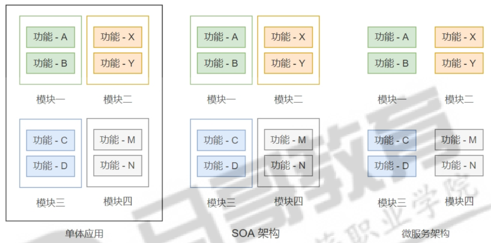

## 微服务框架

Dubbo

- 阿里开源贡献给了 ASF，目前已经是 Apache 的顶级项目 
- 一款高性能的 Java RPC 服务框架，微服务生态体系中的一个重要组件
- 将单体程序分解成多个功能服务模块，模块间使用 Dubbo 框架提供的高性能 RPC 通信 
- 内部协调使用 Zookeeper，实现服务注册、服务发现和服务治理


Spring cloud

* 一个完整的微服务解决方案，相当于 Dubbo 的超集 
* 微服务框架，将单体应用拆分为粒度更小的单一功能服务 
* 基于 HTTP 协议的 REST(Representational State Transfer 表述性状态转移）风格实现模块间通信


# Java

## java 简介

Java 组成：

* 语言、语法规范。关键字，如: if、for、class 等   
* 源代码 source code   
* 依赖库，标准库(基础)、第三方库(针对某些应用)。底层代码太难使用且开发效率低，封装成现成的库  
* JVM 虚拟机。将源代码编译为中间码即字节码后，再运行在 JVM 之上


java 有编译的过程，会生成编译后的产物 -- java 字节码，但是这个产物不是二进制，不能直接运行在 OS 上，而是运行在 OS 之上的 JVM 上，然后由不同的 JVM 来对接不同的 OS。

JVM 与普通的虚拟机不一样，它只能跑 Java 程序。

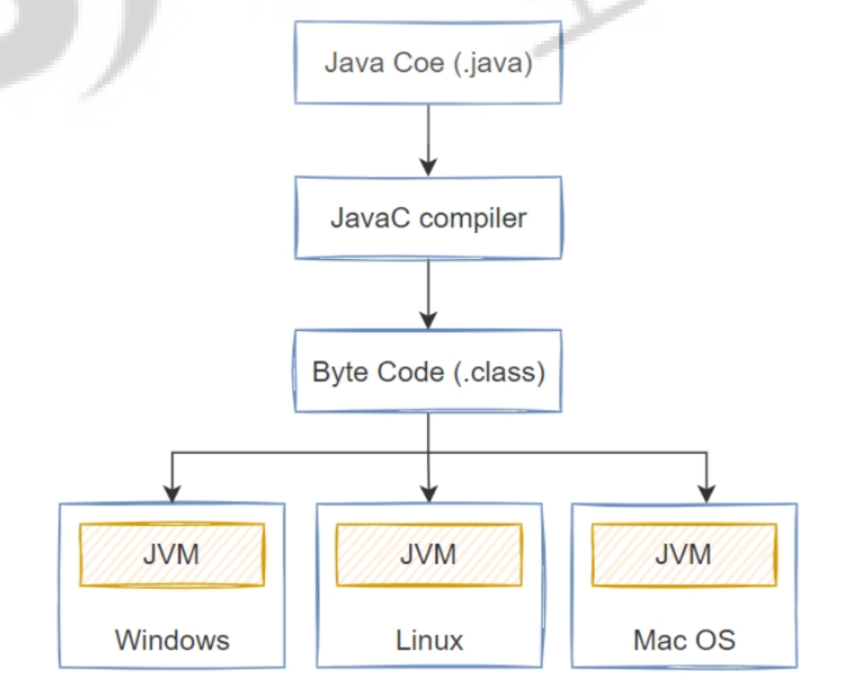

## Java 动态网页技术 

### servlet

servlet - java 第一代的动态网页技术，对于开发人员不是那么的友好。

用 Servlet 构建 Web 应用，则需要 **将 Html 标签嵌套在 Java 的逻辑代码** 中，而 Html 代 码又要频繁迭代，相应的，需要重新编译，这种开发模式非常不方便。

```java
import java.io.*;
import javax.servlet.*;
import javax.servlet.http.*;
public class HelloWorld extends HttpServlet {
	private String message;
    
    public void init() throws ServletException{
		message = "Hello World";
	}
    
	public void doGet(HttpServletRequest request,HttpServletResponse response) 
		throws ServletException, IOException {
        response.setContentType("text/html"); //响应报文内容类型
        PrintWriter out = response.getWriter(); //构建响应报文内容
        out.println("<h1>" + message + "</h1>");
		out.println("<p><a href=http://www.magedu.com>马哥教育</a>欢迎你</p>");
	}
    
	public void destroy(){
 
	}
}
```

### JSP

JSP（Java Server Pages）是一种用于创建动态 Web 页面的 Java 技术。与 Servlet 一样，JSP 也是在 服务器端执行的，但其主要目标是简化 Web 页面的开发，允许开发者 **在 HTML 页面中嵌入简单的 Java 程序 逻辑代码**。

```html
<%@ page language="java" contentType="text/html; charset=UTF-8"pageEncoding="UTF-8"%>
<!DOCTYPE html>
<html>
	<head>
		<meta charset="utf-8">
		<title>jsp例子</title>
	</head>
	<body>
		本行后面的内容是服务器端动态生成字符串，最后拼接在一起
		<%
		out.println("你的 IP 地址 " + request.getRemoteAddr());
		%>
	</body>
</html>
```

## web 开发框架

### MVC

MVC（Model-View-Controller）是一种设计模式，用于组织和管理软件应用程序的结构。它将应用 程序分为三个主要组件，分别是模型（Model）、视图（View）和控制器（Controller）

* 模型（Model）： 
  * 模型表示应用程序的数据和业务逻辑。它负责处理数据的存储、检索和更新，同时包含应用程序的业务规 则。模型通常不包含有关用户界面或展示方式的信息，而是专注于处理数据 
* 视图（View）： 
  * 视图负责用户界面的呈现和展示。它接收来自模型的数据，并将其以用户友好的方式显示。视图不负责处 理数据，而只关注展示和用户交互 
* 控制器（Controller）： 
  * 控制器充当模型和视图之间的协调者。它接收用户的输入（通常来自用户界面），然后根据输入更新模型 和/或视图。控制器负责处理用户请求、更新模型的状态以及选择适当的视图进行展示

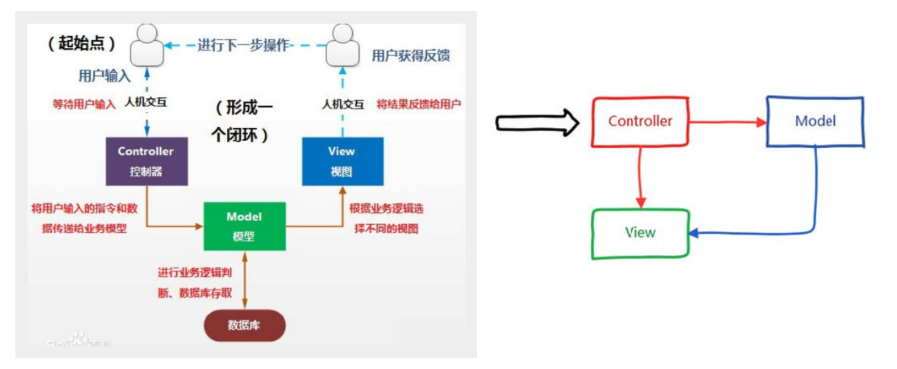

**Controller** 调用 **Model**。

**Model** 更新数据，并通过 **View** 显示给用户。

**Controller** 和 **View** 之间也有直接通信的关系。


### REST

**REST**（**Representational State Transfer**，表现层状态转移）是一种常用的 **Web 服务架构风格**，被广泛应用于 **Web API** 的设计和实现。REST 并不是一个协议，而是一组架构原则或约束条件。基于 REST 的服务称为 **RESTful 服务**。

REST 的核心思想是使用 **HTTP** 协议中的标准操作（GET、POST、PUT、DELETE 等）来实现资源的操作。

基于 **MVC** 模式改进的架构风格，通常称为 **前后端分离** 模式。通过引入 **AJAX** 请求（ Asynchronous JavaScript and XML 异步的 JavaScript 和 XML）和 **JSON 数据格式**，实现了更高效的数据交互和更好的用户体验。

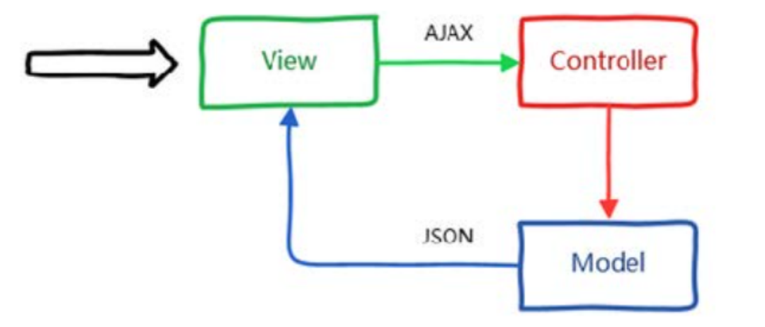


REST 就是一种设计 API 的模式。最常用的数据格式是 JSON。由于 JSON 能直接被 JavaScript 读取，所 以，以 JSON 格式编写的 REST 风格的 API 具有简单、易读、易用的特点。 

所以说，REST 本质上是 API 的一种接口风格。

由于 API 就是把 Web App 的功能全部封装了，所以，通过 API 操作数据，可以极大地把前端和后端的代码 隔离，使得后端代码易于测试，前端代码编写更简单。

前端拿到数据只负责展示和渲染，不对数据做任何处 理。

后端处理数据并以 JSON 格式传输出去.

定义这样一套统一的接口，在 web，ios，android 三端都可以用 相同的接口，通过客户端访问 API，就可以完成通过浏览器页面提供的功能，而后端代码基本无需改动。


## JDK；JRE

JRE 的目的是只要能够将 java 程序跑起来就行，JDK 则是在 java 程序跑起来的基础上，整合了更多的开发 工具。

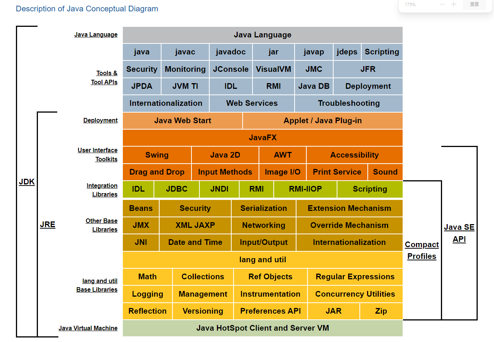

* JRE（Java Runtime Environment)
  * JDK 是 Java 开发工具包，它是 Java 开发的完整包。J
  * DK 不仅包含了 JRE，还包含了用于开发 Java 应用程序的工具和库。

* JDK（Java Development Kit）
  * JRE 是 Java 运行时环境，提供了在计算机上运行 Java 应用程序所需的所有组件。

只是希望运行 Java 程序，安装 JRE 就足够了。如果你要进行 Java 应用程序的开发，那么你需 要安装 JDK


**JVM：Java 虚拟机**

**共识：开源一定会走向分裂**

```plaintext
HotSpot JVM (Oracle) -- 官方的
	HotSpot是由Oracle提供的官方JVM实现，是当前最广泛使用的Java虚拟机。
	
OpenJ9 (Eclipse Adoptium)
     OpenJ9是Eclipse Adoptium项目（之前称为AdoptOpenJDK）提供的一种JVM实现。
```

**Oracle JDK 版本**

| **Java 版本** | **发布日期** | **支持结束时间（公共支持）** | **扩展支持结束时间** | **备注**              |
| ------------- | ------------ | ---------------------------- | -------------------- | --------------------- |
| **Java 8**    | 2014 年 3 月 | 2022 年 3 月（已结束）       | 2030 年 12 月        | 最早的 LTS 版本       |
| **Java 11**   | 2018 年 9 月 | 2026 年 9 月                 | 2030 年 12 月        | 推荐用于迁移自 Java 8 |
| **Java 17**   | 2021 年 9 月 | 2029 年 9 月                 | 2031 年 9 月         | 当前稳定 LTS 版本     |
| **Java 21**   | 2023 年 9 月 | 2031 年 9 月                 | 2035 年 9 月         | 最新 LTS 版本         |

* JavaSE：标准版，适用于桌面平台 
* JavaEE：企业版，java 在企业级开发所有规范的总和，共有 13 个大的规范，Servlet、Jsp 都包含在 JavaEE 规范中 
* JavaME：微型版，适用于移动、无线、机顶盒等设备环境


**Open JDK**

OpenJDK（Open Java Development Kit）

由自由和开放源代码社区维护的、基于 Java 平台 的开发工具包。

| **版本**    | **发布日期** | **支持结束时间（官方社区支持）**     | **说明**                                |
| ----------- | ------------ | ------------------------------------ | --------------------------------------- |
| **Java 8**  | 2014 年 3 月 | 2023 年 5 月（Red Hat 提供更长支持） | 最初的 LTS 版本，经典稳定版。           |
| **Java 11** | 2018 年 9 月 | 2026 年 9 月                         | 企业升级的主要目标版本。                |
| **Java 17** | 2021 年 9 月 | 2029 年 9 月                         | 当前最广泛采用的 LTS 版本。             |
| **Java 21** | 2023 年 9 月 | 2031 年 9 月                         | 最新的 LTS 版本，支持虚拟线程等新特性。 |

## java 安装

Oracle JDK 因其 **许可证限制** 和 **专有软件的性质**，不会被直接包含在 Linux 的官方包管理器中。对于大多数开发者和企业来说，使用 **OpenJDK** 通常足够。


* Oracle 官网下载二进制包 Oracle JDK

```shell
dpkg -i jdk-23_linux-x64_bin.deb
rpm -ivh jdk-23_linux-x64_bin.rpm
```

* yum/apt 安装 OpenJDK

```shell
apt list openjdk*
apt install openjdk-11-jdk -y

yum list java*openjdk*
yum install java-11-openjdk-devel -y
# java-11-openjdk不全，java-11-openjdk-devel全
```

java 的家目录有好几层软链接，使用 `ls -l` 找到真正的 Java 家目录

将 java 家目录加入环境变量

```shell
vim /etc/profile.d/java.sh
export JAVA_HOME=/usr/lib/jvm/java-11-openjdk-amd64
export JAVA_BIN=$JAVA_HOME/bin
export PATH=$JAVA_BIN:$PATH

source /etc/profile.d/java.sh
```

# Tomcat

Tomcat（全称为 Apache Tomcat）是一个开源的、轻量级的应用服务器，由 Apache 软件基金会开发 和维护，它实现了 Java Servlet、Java Server Pages（JSP）和 Java Expression  Language（简称 JEXL java 表达式语言）等 Java EE 规范，并提供了一个运行这些 Web 应用程序的环 境。 

在使用 Tomcat 时，将 Java Web 应用程序（包括 Servlet、JSP 等文件）部署到 Tomcat 服务器 中，然后通过 HTTP 协议访问这些应用程序，Tomcat 提供了一个简单而强大的方式来托管和运行 Java Web 应用程序。

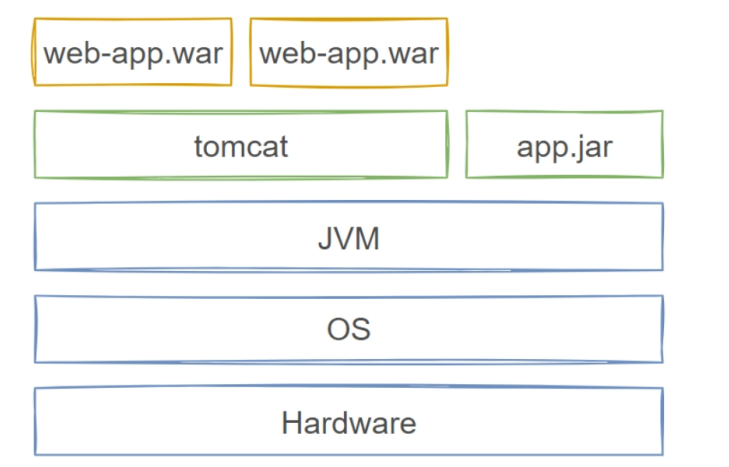

tomcat 与 java 的版本匹配

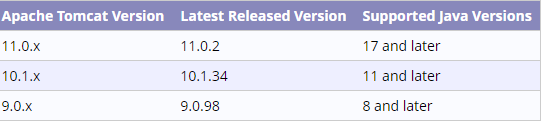


**Tomcat 的核心结构分为以下三个主要部分**

- **Web 容器（HTTP Connector）**：负责处理 HTTP 请求和静态资源。
- **JSP 容器**：将 JSP 文件翻译为 Java 代码的 Servlet 类，编译成字节码，并交给 Servlet 容器运行。
- **Catalina（Servlet 容器）**：运行 Servlet 并处理动态请求。


## 安装 Tomcat

### 二进制安装

先安装 Java 环境，并添加到环境变量。

```shell
apt install openjdk-21-jdk -y
apt install openjdk-17-jdk -y
apt install openjdk-11-jdk -y
apt install openjdk-8-jdk -y
```

```shell
vim /etc/profile.d/java.sh
export JAVA_HOME=/usr/lib/jvm/java-11-openjdk-amd64
export JAVA_BIN=$JAVA_HOME/bin
export PATH=$JAVA_BIN:$PATH

source /etc/profile.d/java.sh
```

安装 tomcat

```shell
apt install tomcat10 -y
```

### 源码部署

先安装 Java 环境，并添加到环境变量。

```shell
apt install openjdk-21-jdk -y
apt install openjdk-17-jdk -y
apt install openjdk-11-jdk -y
apt install openjdk-8-jdk -y

yum install java-11-openjdk-devel.x86_64
yum install java-17-openjdk-devel.x86_64
yum install java-21-openjdk-devel.x86_64
```

```shell
vim /etc/profile.d/java.sh
export JAVA_HOME=/usr/lib/jvm/java-11-openjdk-amd64
export JAVA_BIN=$JAVA_HOME/bin
export PATH=$JAVA_BIN:$PATH

source /etc/profile.d/java.sh
```

下载源码包

```shell
tar xf apache-tomcat-9.0.97.tar.gz
mv ./apache-tomcat-9.0.97 /tomcat9

tomcat目录/bin/catalina.sh
```

tomcat 加入环境变量

```shell
vim /etc/profile.d/tomcat.sh
export CATALINA_BASE=/tomcat10
export CATALINA_HOME=/tomcat10
export CATALINA_TMPDIR=$CATALINA_HOME/temp
export CLASSPATH=$CATALINA_HOME/bin/bootstrap.jar:$CATALINA_HOME/bin/tomcatjuli.jar                         export PATH=$CATALINA_HOME/bin:$PATH

source /etc/profile.d/tomcat.sh
```

systemd 服务脚本

```shell
vim /lib/systemd/system/tomcat.service
[Unit]
Description=Tomcat
After=syslog.target network.target
Wants=network-online.target

[Service]
Type=forking
# Environment=JAVA_HOME=/usr/lib/jvm/java-11-openjdk-amd64/
ExecStart=/tomcat10/bin/startup.sh
ExecStop=/tomcat10/bin/shutdown.sh
PrivateTmp=true
# User=tomcat
# Group=tomcat

[Install]
WantedBy=multi-user.target

systemctl daemon-reload
```

## 目录结构

```shell
/tomcat9
├── bin				# 管理脚本文件
├── conf			# 配置文件
├── lib				# 库文件
├── logs			# 日志
├── temp
├── webapps			# 默认的应用程序
├── Mywebapps		# 自己应用程序的目录
└── work			# 运行时缓存，包括 JSP 编译生成的 Java 文件和类文件

```

## Tomcat 组件

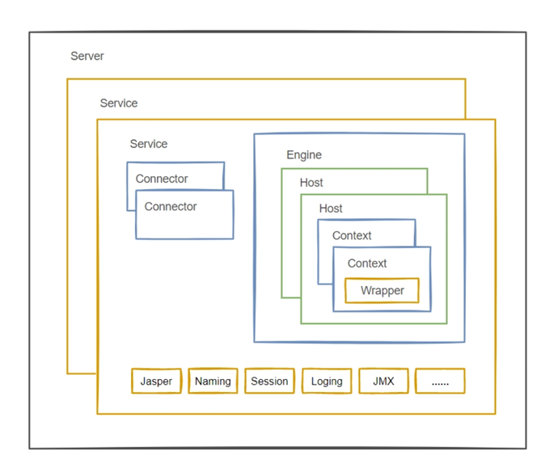

1. **Server**
   - Tomcat 的最高层组件。
   - 包含多个 `Service`。
2. **Service**
   - 包含一个 `Engine` 和多个 `Connector`。
   - 将 `Connector` 接收到的请求传递给 `Engine` 处理。
3. **Connector**
   - 接收来自客户端的 HTTP/HTTPS 请求。
   - 将请求解析后交给 `Engine`。
4. **Engine**
   - 处理请求，匹配虚拟主机（`Host`）。
   - 将请求路由到正确的 Web 应用（`Context`）。
5. **Host**
   - 虚拟主机，用来区分多个域名或 IP 的请求。
   - 包含多个 `Context`，每个 `Context` 表示一个 Web 应用。
6. **Context**
   - Web 应用的上下文，定义 URL 和实际资源目录之间的映射关系


| **组件**      | **说明**                                                     |
| ------------- | ------------------------------------------------------------ |
| **Server**    | 服务器，表示 Tomcat 的运行实例。每个 Tomcat 实例只有一个 Server 元素，用于管理整个服务器的配置和生命周期。一个 Server 中可以包含多个 Service，但通常只有一个。 |
| **Service**   | 服务，用来组织 `Engine` 和 `Connector` 的对应关系。一个 Service 中可以有多个 `Connector` 和一个 `Engine`，将客户端请求从 Connector 转发到 Engine 处理。 |
| **Connector** | 连接器，负责处理客户端的协议连接（如 HTTP、HTTPS、AJP）。一个 `Connector` 只属于一个 `Engine`，用来接收客户端请求并将其交给 `Engine` 处理。 |
| **Engine**    | 引擎，Tomcat 的核心部分，处理所有的请求和响应。一个 `Engine` 用于处理某个 `Service` 的请求，并可以绑定多个 `Connector`。 |
| **Host**      | 虚拟主机，用于支持多虚拟主机功能。可以通过主机头（Host Header）区分不同的主机，每个虚拟主机可以包含多个 `Context`。 |
| **Context**   | 应用的上下文，表示一个 Web 应用实例。负责配置特定 URL 路径和目录的映射关系（如 `url => directory`）。每个 `Context` 对应一个 Web 应用。 |

## 配置

```shell
/tomcat9/conf/
├── Catalina
│   └── localhost
├── catalina.policy					# 定义 Java 安全策略（Policy），用于限制 Web 应用的权限
├── catalina.properties				# tomcat 环境变量配置以及 jvm 调优相关参数
├── context.xml						# 定义所有 Web 应用共享的默认上下文（Context）配置。
├── jaspic-providers.xml			# 配置Java Authentication SPI for Containers (JASPIC) 提供的身份验证模块
├── jaspic-providers.xsd			# 上述文件中的标签取值约束
├── logging.properties				# 日志配置
├── server.xml						# 主配置文件
├── tomcat-users.xml				# 配置 Tomcat 的用户和角色，用于访问管理页面
├── tomcat-users.xsd				# 上述文件中的标签取值约束
└── web.xml							# 全局 Web 应用配置文件
```

### web.xml 配置

```xml
<web-app xmlns="http://xmlns.jcp.org/xml/ns/javaee"
  xmlns:xsi="http://www.w3.org/2001/XMLSchema-instance"
  xsi:schemaLocation="http://xmlns.jcp.org/xml/ns/javaee
                      http://xmlns.jcp.org/xml/ns/javaee/web-app_4_0.xsd"
  version="4.0">
	......
    <!-- 定义 Web 应用的核心组件 -->
	<servlet>
        <servlet-name>default</servlet-name>  <!-- Tomcat 的默认静态资源处理 Servlet -->
        <servlet-class>org.apache.catalina.servlets.DefaultServlet</servlet-class>
        <init-param>
            <param-name>debug</param-name>
            <param-value>0</param-value>
        </init-param>
        <init-param>
            <param-name>listings</param-name>  <!-- 禁用目录列表显示 -->
            <param-value>false</param-value>
        </init-param>
        <load-on-startup>1</load-on-startup>
    </servlet>

    <servlet>
        <servlet-name>jsp</servlet-name>  <!-- 处理 .jsp 和 .jspx 文件，将其编译为 Servlet 并执行。-->
        <servlet-class>org.apache.jasper.servlet.JspServlet</servlet-class>
        <init-param>
            <param-name>fork</param-name><!-- JSP 编译时不创建新线程 -->
            <param-value>false</param-value>
        </init-param>
        <init-param><!-- 禁用 X-Powered-By 头，避免暴露服务器信息。 -->
            <param-name>xpoweredBy</param-name>
            <param-value>false</param-value>
        </init-param>
        <load-on-startup>3</load-on-startup>
    </servlet>
	......
    <!-- Servlet 映射 -->
    <!-- 定义 URL 和 Servlet 的映射关系。 -->
    <servlet-mapping>
        <servlet-name>default</servlet-name>
        <url-pattern>/</url-pattern>
    </servlet-mapping>

    <servlet-mapping>
        <servlet-name>jsp</servlet-name>
        <url-pattern>*.jsp</url-pattern>
        <url-pattern>*.jspx</url-pattern>
    </servlet-mapping>
	......
    
    <!-- Filter 配置 -->
    <!-- 增强功能，如安全过滤或日志记录。 -->
    <filter>
        <filter-name>httpHeaderSecurity</filter-name>
        <filter-class>org.apache.catalina.filters.HttpHeaderSecurityFilter</filter-class>
        <async-supported>true</async-supported>
    </filter>
    ......
    <!-- Filter 映射 -->
    <filter-mapping>
        <filter-name>httpHeaderSecurity</filter-name>
        <url-pattern>/*</url-pattern>
        <dispatcher>REQUEST</dispatcher>
    </filter-mapping>
    ......
    <!-- MIME 映射 -->
    <!-- 定义文件扩展名与 MIME 类型的映射关系。 -->    
    <mime-mapping>
        <extension>jpeg</extension>
        <mime-type>image/jpeg</mime-type>
    </mime-mapping>
    ......
    <!-- 定义默认主页 -->
    <welcome-file-list>
        <welcome-file>index.html</welcome-file>
        <welcome-file>index.htm</welcome-file>
        <welcome-file>index.jsp</welcome-file>
    </welcome-file-list>
</web-app>
```

### server.xml 配置

主要配置文件

配置 Tomcat 服务器的全局设置、连接器（Connectors）、虚拟主机（Virtual Hosts）等。

```xml
<!-- Tomcat 的顶级容器，表示整个服务器实例。 -->
<Server port="8005" shutdown="SHUTDOWN">
    
  <!-- 监听 Tomcat 的生命周期事件（启动、关闭等）。 -->
  <Listener className="org.apache.catalina.startup.VersionLoggerListener" />
  <Listener className="org.apache.catalina.security.SecurityListener" />
  <Listener className="org.apache.catalina.core.AprLifecycleListener" />
  <Listener className="org.apache.catalina.core.JreMemoryLeakPreventionListener" />
  <Listener className="org.apache.catalina.mbeans.GlobalResourcesLifecycleListener" />
  <Listener className="org.apache.catalina.core.ThreadLocalLeakPreventionListener" />

    <!-- 配置全局命名资源 -->
  <GlobalNamingResources>
    <Resource name="UserDatabase" auth="Container"
              type="org.apache.catalina.UserDatabase"
              description="User database that can be updated and saved"
              factory="org.apache.catalina.users.MemoryUserDatabaseFactory"
              pathname="conf/tomcat-users.xml" />
  </GlobalNamingResources>

  <!-- 管理连接器（Connector）和引擎（Engine） -->
  <!-- 包含一个 Engine 和多个 Connector。 -->  
  <Service name="Catalina">
	<!-- 定义线程池，优化线程管理。 -->
    <Executor name="tomcatThreadPool" namePrefix="catalina-exec-"
        maxThreads="150" minSpareThreads="4"/>
      
    <!-- 连接器负责接受客户端请求并将其传递给 Engine -->
    <Connector port="8080" protocol="HTTP/1.1"
               connectionTimeout="20000"
               redirectPort="8443"
               maxParameterCount="1000"
               />
    <Connector executor="tomcatThreadPool"
               port="8080" protocol="HTTP/1.1"
               connectionTimeout="20000"
               redirectPort="8443"
               maxParameterCount="1000"
               />

    <!-- HTTPS 连接器（NIO 协议） -->
    <Connector port="8443" protocol="org.apache.coyote.http11.Http11NioProtocol"
               maxThreads="150" SSLEnabled="true"
               maxParameterCount="1000"
               >
        <SSLHostConfig>
            <Certificate certificateKeystoreFile="conf/localhost-rsa.jks"
                         certificateKeystorePassword="changeit" type="RSA" />
        </SSLHostConfig>
    </Connector>
	<!-- HTTPS 连接器（Apr 协议） -->
    <Connector port="8443" protocol="org.apache.coyote.http11.Http11AprProtocol"
               maxThreads="150" SSLEnabled="true"
               maxParameterCount="1000"
               >
        <UpgradeProtocol className="org.apache.coyote.http2.Http2Protocol" />
        <SSLHostConfig>
            <Certificate certificateKeyFile="conf/localhost-rsa-key.pem"
                         certificateFile="conf/localhost-rsa-cert.pem"
                         certificateChainFile="conf/localhost-rsa-chain.pem"
                         type="RSA" />
        </SSLHostConfig>
    </Connector>

    <Connector protocol="AJP/1.3"
               address="::1"
               port="8009"
               redirectPort="8443"
               maxParameterCount="1000"
               />
    
     <!-- Engine 是 Tomcat 的核心组件，用于处理请求 -->  
    <Engine name="Catalina" defaultHost="localhost">
        
		<!-- 支持分布式会话复制和集群功能。 -->
      <Cluster className="org.apache.catalina.ha.tcp.SimpleTcpCluster"/>

        <!-- Tomcat 的认证和授权模块 -->
      <Realm className="org.apache.catalina.realm.LockOutRealm">
             resources under the key "UserDatabase".  Any edits
             that are performed against this UserDatabase are immediately
        <Realm className="org.apache.catalina.realm.UserDatabaseRealm"
               resourceName="UserDatabase"/>
      </Realm>

        <!-- 虚拟主机 -->
      <Host name="localhost"  appBase="webapps"
            unpackWARs="true" autoDeploy="true">

        <Valve className="org.apache.catalina.authenticator.SingleSignOn" />

        <Valve className="org.apache.catalina.valves.AccessLogValve" directory="logs"
               prefix="localhost_access_log" suffix=".txt"
               pattern="%h %l %u %t &quot;%r&quot; %s %b" />

      </Host>
    </Engine>
  </Service>
</Server>
```

#### \< Server \> 

Server 元素是配置整个 Tomcat 服务器的根元素，它包含了 Tomcat 的全局设置

```shell
className           # 指定实现此组件的java类，默认 org.apache.catalina.core.StandardServer
port                # 定义关闭服务的端口，-1 表示禁用远程关闭
shutdown="SHUTDOWN" # 终止服务时要发送给服务端的字符串
address             # 监听端口绑定的地址，不指定默认为 localhost
```

#### \< Listener \>

Listener 是监听器配置，指定监听器的特性，日志、内存泄露、应用创建销毁等


#### \< GlobalNamingResources \>

配置全局命名资源


#### \< Service \>

定义了 Tomcat 中的一个服务(实例)，一个 tomcat 服务器可以开多 个实例，不同实例可以监听不同的端口，使用不同的配置和部署不同的 web 应用程序，每个实例被定义成一个  Service，一个 Service 可以包含多个连接器和多个虚拟主机

```shell
className           # 指定实现的java类，默认 org.apache.catalina.core.StandardService
name				# 指定实例名称
```

#### \< Executor \>

配置 Service 的共享线程池

```shell
className					# 指定实现的java类，默认 org.apache.catalina.core.StandardThreadExecutor
name						# 指定线程池名称，其它组件通过名称引用线程池
threadPriority				# 线程优先级，默认值为5
daemon						# 线程是否以daemon的方式运行，默认值为true
namePrefix					# 执行器创建每个线程时的名称前缀，最终线程的名称为:namePrefix+threadNumber
maxThreads					# 线程池激活的最大线程数量。默认值为200
minSpareThreads				# 线程池中最少空闲的线程数量。默认值为25
maxIdleTime					# 空闲线程被销毁的保留时长
maxQueueSize				# 可执行任务的最大队列数，达到队列上限时的连接请求将被拒绝
prestartminSpareThreads		# 在启动executor时是否立即创建minSpareThreads个线程数，默认为false，即在需要时才创建线程
```

#### \< Connector \>

用于配置 Tomcat 的连接器，负责处理客户端与 Tomcat 之间的通信，一个 service 中可以有多个 Connector，每个 Connector 定义了一个端口和协议的组合，允许 Tomcat 在不同的端口上监听不同的网络协议或配置不同的连接器属性

```shell
port
#监听端口

address
#监听IP，默认本机所有IP

protocol
#协议版本

connectionTimeout
#超时时长

redirectPort
#安全连接重定向的端口

executor
#指定共享线程池

maxThreads
#最大并发连接数，默认为200
#如果引用了executor创建的共享线程池，则该属性被忽略

acceptCount
#等待队列的最大长度

maxConnections
#允许建立的最大连接数

connectionTimeout
#等待客户端发送请求的超时时间

keepAliveTimeout
#长连接状态的超时时间

enableLookups
#是否通过DNS查询获取客户端的主机名；默认为true，应设置为false可减少资源消耗

compression
#是否压缩数据。默认为off，on 表示只压缩 text 文本，force表示压缩所有内容

useSendfile
#是否启用sendfile的功能。默认为true，启用该属性将会禁止

URIEncoding
#用于指定编码URI的字符编码，默认 UTF-8
```

#### \<Engine\>

engine是service组件中用来分析协议的引擎机器，它从一个或多个 connector上接收请求，并将请求交给对应的虚拟主机进行处理，最后返回完整的响应数据给connector， 通过connector将响应数据返回给客户端，engine元素必须嵌套在每个service中，且engine必须在其所 需要关联的connector之后，这样在engine前面的connector都可以被此engine关联，而在engine后面的 connector则被忽略，一个service中只允许有一个engine，其内可以嵌套一个或多个Host作为虚拟主机， 且至少一个host要和engine中的默认虚拟主机名称对应。除了host，还可以嵌套releam和valve组件。

```shell
className
# 指定实现的java类，默认 org.apache.catalina.core.StandardEngine 

defaultHost
# 默认虚拟主机，在Engine中定义的多个虚拟主机的主机名称中至少有一个跟defaultHost定义的主机名称同名

name
# 指定组件名称

jvmRoute
# 在启用session粘性时指定使用哪种负载均衡的标识符。
# 所有的tomcat server实例中该标识符必须唯一，它会追加在session标识符的尾部，
# 因此能让前端代理总是将特定的session转发至同一个tomcat实例上
```

#### \<Realm\>

在Engine内部配置了一个安全领域（Realm）用于身份验证和授权，该配置对Engine下的所有Host生效

```shell
className
#指定实现的java类，不同的 className 表示组件功能不一样，会有其它不同的属性

JAASRealm
#基于Java Authintication and Authorization Service实现用户认证

JDBCRealm
#通过JDBC访问某关系型数据库表实现用户认证

JNDIRealm
#基于JNDI使用目录服务实现认证信息的获取

MemoryRealm
#查找tomcat-user.xml文件实现用户信息的获取

UserDatabaseRealm
#基于UserDatabase文件(通常是tomcat-user.xml)实现用户认证
```


#### \<Host\>

host容器用来定义虚拟主机，engine从connector接收到请求进行分析 后，会将相关的属性参数传递给对应的(筛选方式是从请求首部的host字段和虚拟主机名称进行匹配)虚拟 host进行处理。如果没有合适的虚拟主机，则传递给默认虚拟主机。因此每个容器中必须至少定义一个虚拟主 机，且必须有一个虚拟主机和engine容器中定义的默认虚拟主机名称相同，其下级标签包括 Alias， Cluster，Listener，valve，Realm、 Context。

```shell
className
# 指定实现的java类，默认 org.apache.catalina.core.StandardHost
 
name
# 指定主机名，忽略大小写，可以使用通配符，匹配优先级低
 
appBase
# 此项目的程序目录
 
xmlBase
# 此虚拟主机上的context xml目录
 
startStopThreads
# 启动context容器时的并行线程数。如果使用了自动部署功能，
# 则再次部署或更新时使用相同的线程池deploy或自动更新部署，默认true
 
autoDeploy
# Tomcat处于运行状态时放置于appBase目录中的应用程序文件是否自动进行
 
unpackWars
# 自动解压缩 war 包
 
workDir
# 该虚拟主机的工作目录。每个webapp都有自己的临时IO目录，
# 默认该工作目录为$CATALINA_BASE/work
```


#### \<Context\>

配置WEBAPP的上下文，tomcat 对请求URI与context中定义的path进行最 大匹配前缀的规则进行挑选，从中选出使用哪个context来处理该HTTP请求，必须要有一个context的path 为空字符串，用于处理无法被现有规则命中的URI

```shell
className
# 指定实现的java类，默认值  org.apache.catalina.core.StandardContext
 
cookies
# 默认为true，表示启用cookie来标识session
 
docBase
# 指定程序代码目录，docBase 不在 appBase 目录中时才需要指定
 
path
# 定义生效的URL路径规则，如果配置是独立文件，此属性值可以为空，
# tomcat 可以用文件名来推出 path
 
reloadable
# 是否监控/WEB-INF/class和/WEB-INF/lib两个目录中文件的变化，
# 变化时将自动重载，默认 false
 
wrapperClass
# 实现wrapper容器的类，wrapper用于管理该context中的servlet
 
xmlNamespaceAware
# 和web.xml的解析方式有关，默认为true，设置为false可以提升性能
 
xmlValidation
# 和web.xml的解析方式有关，默认为true，设置为false可以提升性能
 
```


#### \<Valve\>

定义一个特定功能的组件，可以有多条，按照定义顺序生效

```shell
className
#指定实现的java类，不同的 className 表示组件功能不一样，会有其它不同的属性

AccessLogValve
#访问日志

ExtendedAccessValve
#扩展功能的访问日志

JDBCAccessLogValve
#通过JDBC将访问日志信息发送到数据库中

RequestDumperValve
#请求转储

RemoteAddrValve
#基于远程地址的访问控制

RemoteHostValve
#基于远程主机名称的访问控制

SemaphoreValve  
#用于控制Tomcat主机上任何容器上的并发访问数量

JvmRouteBinderValve     
#配合apache 做负载均衡的场景下，此值可以定义备用节点

ReplicationValve
#设置 session 复制

SingleSignOn           
#设置多个 WEBAPP 单点认证

ClusterSingleSingOn
#对SingleSignOn的扩展，要 ClusterSingleSignOnListener 配合
```

### tomcat-users.xml

定义用户和角色。它主要用于 Tomcat 的安全配置，管理 Web 应用程序的访问权限。你可以在其中定义用户和角色，并将角色分配给用户，这样用户就可以通过角色访问某些特定的 Web 应用或管理功能。

```xml
  <user username="admin" password="123456" roles="manager-gui"/>
  <user username="robot" password="123456" roles="manager-script"/>
  
	  <!-- 定义角色 -->
  <role rolename="tomcat"/>
  <role rolename="role1"/>

  <!-- 定义用户并分配角色 -->
  <user username="tomcat" password="<must-be-changed>" roles="tomcat"/>
  <user username="both" password="<must-be-changed>" roles="tomcat,role1"/>
  <user username="role1" password="<must-be-changed>" roles="role1"/>

	  <role rolename="admin-gui"/>
  <role rolename="manager-gui"/>
  <role rolename="manager-status"/>
  <user username="tomcat" password="s3cret" roles="admin-gui,manager-gui,managerstatus"/>
```


### 应用程序目录


```shell
webapps/
├── docs					# http://10.0.0.12:8080/docs
│   ├── index.
│   ├── META-INF
│   │   └── context.xml
│   └── WEB-INF
│       └── web.xml
├── examples				# http://10.0.0.12:8080/examples
│   ├── index.html
│   ├── WEB-INF
│       └── web.xml
├── host-manager			# http://10.0.0.12:8080/host-manager
│   ├── index.jsp
│   ├── META-INF
│   │   └── context.xml
│   └── WEB-INF
│       └── web.xml
├── manager					# http://10.0.0.12:8080/manager
│   ├── index.jsp
│   ├── META-INF
│   │   └── context.xml
│   └── WEB-INF
│   │   ├── jsp
│   │   │   ├── 401.jsp
│   │   │   ├── ...
│   │   │   ├── connectorCerts.jsp
│   │   │   ├── ...
│       └── web.xml
└── ROOT					# http://10.0.0.12:8080/
    ├── index.jsp
    └── WEB-INF
        └── web.xml
```

#### `META-INF/context.xml`

* 定义 Web 应用的上下文配置，常见内容：
    - 数据源配置（JNDI）。
    - 特定应用的环境变量。
    - IP 限制规则。

```xml
<Context antiResourceLocking="false" >
  <Valve className="org.apache.catalina.valves.RemoteAddrValve"
         allow="127\.\d+\.\d+\.\d+|::1|0:0:0:0:0:0:0:1" />
</Context>
```

添加可访问IP

```xml
<Context antiResourceLocking="false" privileged="true">
 <!-- 将Valve注释，或者添加允许访问的IP  |10\.0\.0\.\d+，或删除 -->
			  <Valve className="org.apache.catalina.valves.RemoteAddrValve"   
         	allow="127\.\	d+\.\d+\.\d+|::1|0:0:0:0:0:0:0:1|10\.0\.0\.\d+" />
</Context>
```

有些页面要用户名与密码

#### `WEB-INF/web.xml`

* Web 应用的部署描述符，定义：
    - Servlet 映射规则。
    - 过滤器配置。
    - 会话管理配置。
    - 安全约束（如登录认证，配置可登录的角色）。

### 访问端口

server.xml配置文件中

远程管理端口8005

`<Server port="8005" shutdown="SHUTDOWN">`

普通用户可以通过此端口关闭tomcat

Tomcat的8005端口是用于Shutdown命令的监听端口 

当Tomcat收到通过这个端口发送的匹配此字符串SHUTDOWN的命令时，它会启动关闭过程。

* 禁用远程关闭
    * \<Server port="**0**" shutdown="SHUTDOWN"\>
        * 随机端口
    * \<Server port="**-1**" shutdown="SHUTDOWN"\>
        * 禁用端口

## 应用程序部署

部署应用有三种方式：

1. 现有Host下，以文件或war 包直接部署

2. 在 Tomcat 配置文件 `/conf/server.xml` 中找到 `<Host>` 节点。在 `<Host>` 节点中添加 `<Context>` 子节点，用于指定应用的路径和目录。

3. 在conf/[Engine]/[Host]/ （默认是 `/conf/Catalina/localhost/`）目录下创建独立配置。配置文件名为应用路径名，例如访问路径为 `/myapp`，配置文件名为 `myapp.xml`。

    

### 默认首页配置

全局默认主页配置

```xml
conf/web.xml

    <welcome-file-list>
        <welcome-file>index.html</welcome-file>
        <welcome-file>index.htm</welcome-file>
        <welcome-file>index.jsp</welcome-file>
    </welcome-file-list>
```

各目录的默认主页

```xml
webapps/examples/WEB-INF/web.xml

    <welcome-file-list>
        <welcome-file>index.html</welcome-file>
        <welcome-file>index.xhtml</welcome-file>
        <welcome-file>index.htm</welcome-file>
        <welcome-file>index.jsp</welcome-file>
    </welcome-file-list>
```

### 部署新WEB

```shell
mkdir -pv /tomcat9/mywebapps/ROOT
```

html初始页

```html
/tomcat9/mywebapps/ROOT/index.html

<!DOCTYPE html>
<html lang="en">
			 <head>
  <meta charset="UTF-8">
  <meta name="viewport" content="width=device-width, initial-scale=1.0">
  <title>Welcome to Tomcat</title>
 </head>
 <body>
  <h1>Welcome to Tomcat by sswang</h1>
 </body>
</html>
```

jsp初始页

```jsp
/tomcat9/mywebapps/ROOT/index.jsp

<%@ page contentType="text/html;charset=UTF-8" language="java" %>
<!DOCTYPE html>
 <html lang="en">
 <head>
  <meta charset="UTF-8">
  <meta name="viewport" content="width=device-width, initial-scale=1.0">
  <title>Welcome to Tomcat JSP</title>
 </head>
 <body>
  <h1>Welcome to Tomcat by sswang</h1>
 </body>
</html>
```

调整默认首页为jsp

```xml
vim /tomcat9/mywebapps/ROOT/WEB-INF/web.xml

    <welcome-file-list>
        <welcome-file>index.jsp</welcome-file>
        <welcome-file>index.html</welcome-file>
        <welcome-file>index.xhtml</welcome-file>
        <welcome-file>index.htm</welcome-file>
    </welcome-file-list>
```

向server.xml添加新Host

```
<Host name="a.com"  appBase="/tomcat9/mywebapps" unpackWARs="true" autoDeploy="true">
</Host>
```

#### war包部署新路径

创建war包

```shell
app1/
├── index.html
└── path
    └── index.jsp
```

```shell
cd app1/
jar cvf ../app1.war *
```

部署war

```shell
mv app1.war /tomcat9/mywebapps/
```

因为tomcat在配置host的时候，定制了 unpackWARs="true" - 自动解包，autoDeploy="true" - 自动部 署

目标目录下，的压缩文件已经展开了

```shell
ls /tomcat9/mywebapps/
app1  app1.war  ROOT
```

访问`a.com:8080/app1/`

#### war部署项目 jpress

**jpress不支持tomcat10+版本**

**垃圾**

下载源码包

```shell
tar xf jpress-v5.1.2.tar.gz
cd jpress-v5.1.2/
apt install maven
mvn clean package
```

```shell
vim jpress/starter/target/starter-5.0/jpress.sh
# 取消下行注释
JAVA_OPTS="-Dundertow.port=80 -Dundertow.host=0.0.0.0 -Dundertow.devMode=false"

# 启动
./jpress.sh start
```

war部署

```shell
# 转移文件
cp ~/jpress/starter-tomcat/target/starter-tomcat-5.0.war /tomcat9/mywebapps/

# 转移配置文件 
cp ~/jpress/starter-tomcat/target/classes/* /tomcat9/conf/
```


定制数据库配置

```shell
apt install mariadb-server -y
vim /etc/mysql/mariadb.conf.d/50-server.cnf
```

```
mysql
create database jpress;
CREATE USER 'jpresser'@'localhost';
ALTER USER 'jpresser'@'localhost' IDENTIFIED BY '123456';
grant all on jpress.* to jpresser@'localhost';
exit
```

访问

http://a.com:8080/starter-tomcat-5.0

#### jar包部署halo 项目

```shell
wget https://dl.halo.run/release/halo-1.6.1.jar -O halo.jar

# 启动
java -jar halo.jar
# 8版本低，换版本
/usr/lib/jvm/java-11-openjdk-amd64/bin/java -jar halo.jar
# 或修改之前配置的/etc/profile.d/java.sh

# 访问
http://10.0.0.12:8090/
```

## tomcat + nginx


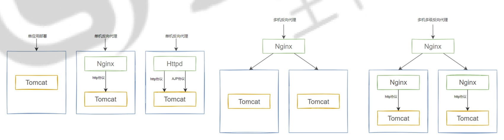

* 单应用部署： 
    * 仅部署单机 Tomcat ，由 Tomcat 直接响应客户端请求 
* 单机反向代理部署： 
    * 前端部署 Nginx 或 Httpd 来响应客户端请求，将需要由 Tomcat 处理的请求转发到后端，可实现动 静分离 多机
* 反向代理部署： 
    * 前端部署 Nginx 来响应客户端请求，配合负载均衡将动态请求轮流转发到后端 Tomcat 服务器处理， 可以将静态资源直接部署在前端 Nginx 上，实现动静分离 
* 多机多级反向代理部署： 
    * 可以分别用 Nginx 实现四层和七层的代理

### Nginx多机反向代理Tomcat

nginx配置

```nginx
upstream tomcat {
 # ip_hash;
 # hash $cookie_JSESSION consistent;
 # hash $remote_addr;  # 三选一可以实现会话保持功能
	 server 10.0.0.11:8080;
 server 10.0.0.12:8080;
}

server{
 listen 80;
 server_name a.com;
    
 location ~* \.jsp$ {
 proxy_pass http://tomcat;
 proxy_set_header host $http_host;
 }
}

```

test.jsp文件

```shell
echo 'Tomcat jsp page from ubuntu<br />SessionID = <span style="color:blue"><%=session.getId() %>' > /tomcat9/mywebapps/ROOT/test.jsp
```

如果上游对应服务器崩了，会话还使保持不了


##  会话实践

在上述 Nginx 代理多机 Tomcat 的架构中，我们在 Nginx 代理节点通过调度算法实现会话绑定，将 来自于同一客户端的请求调度到同相的后端服务器上，在这种情况下，如果后端 Tomcat 服务不可用， Nginx 在检测后会将请求调度到可用的后端节点，则原来的 Session 数据还是会丢失。

会话保持方法

*   会话绑定
*   会话复制
*   会话共享

### tomcat的会话复制

[Apache Tomcat 9 (9.0.98) - Clustering/Session Replication How-To](https://tomcat.apache.org/tomcat-9.0-doc/cluster-howto.html)

我们可以使用 Tomcat 中的  session 复制功能，实现在多台 Tomcat 服务器上复制 Session 的 功能，这种配置下，任何一台 Tomcat 服务器都有全量的 Session 数据。

一旦当前session访问的后端应用异常，那么会话切换到另外一台主机上的时候，如果存在相同的会话 id，就直接使用，如果新主机上没有旧的会话id，则创建一个新的会话id。


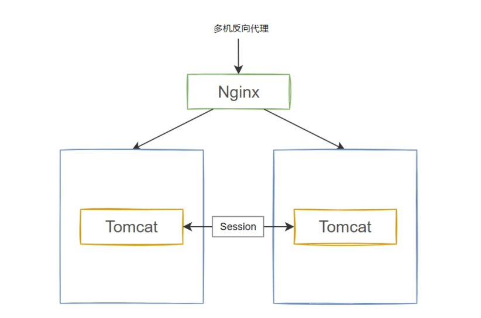

配置

server.xml

```xml
<!-- 在 server.xml 中 指定域名的 Host 标签内添加下列内容 -->
        <Cluster className="org.apache.catalina.ha.tcp.SimpleTcpCluster"
                 channelSendOptions="8">

          <Manager className="org.apache.catalina.ha.session.DeltaManager"
                   expireSessionsOnShutdown="false"
                   notifyListenersOnReplication="true"/>
            
<!-- Channel定义了用于节点间通信的通道 -->
          <Channel className="org.apache.catalina.tribes.group.GroupChannel">
            <Membership className="org.apache.catalina.tribes.membership.McastService"
                        address="228.0.0.4"
                        port="45564"
                        frequency="500"
                        dropTime="3000"/>
              <!-- 接收数据的地址，auto 会解析当前主机名，使用该IP，使用时请明确指定 -->
            <Receiver className="org.apache.catalina.tribes.transport.nio.NioReceiver"
                      address="auto"
                      port="4000"
                      autoBind="100"
                      selectorTimeout="5000"
                      maxThreads="6"/>

            <Sender className="org.apache.catalina.tribes.transport.ReplicationTransmitter">
              <Transport className="org.apache.catalina.tribes.transport.nio.PooledParallelSender"/>
            </Sender>
            <Interceptor className="org.apache.catalina.tribes.group.interceptors.TcpFailureDetector"/>
            <Interceptor className="org.apache.catalina.tribes.group.interceptors.MessageDispatchInterceptor"/>
          </Channel>

          <Valve className="org.apache.catalina.ha.tcp.ReplicationValve"
                 filter=""/>
          <Valve className="org.apache.catalina.ha.session.JvmRouteBinderValve"/>

          <Deployer className="org.apache.catalina.ha.deploy.FarmWarDeployer"
                    tempDir="/tmp/war-temp/"
                    deployDir="/tmp/war-deploy/"
                    watchDir="/tmp/war-listen/"
                    watchEnabled="false"/>

          <ClusterListener className="org.apache.catalina.ha.session.ClusterSessionListener"/>
        </Cluster>
```

/tomcat9/mywebapps/ROOT/WEB-INF/web.xml

没有就自己写

```xml
<?xml version="1.0" encoding="UTF-8"?>
<web-app xmlns="https://jakarta.ee/xml/ns/jakartaee"
  xmlns:xsi="http://www.w3.org/2001/XMLSchema-instance"
  xsi:schemaLocation="https://jakarta.ee/xml/ns/jakartaee
                      https://jakarta.ee/xml/ns/jakartaee/web-app_6_0.xsd"
  version="6.0"
  metadata-complete="true">


    <distributable />                                                                                                                                                                 
</web-app>
```

### NoSQL

NoSQL（Not Only SQL）是一种非关系型数据库管理系统的范畴，它主要是为了解决传统关系型数据库 在处理大数据、高并发、半结构化/非结构化数据等方面的局限性而提出的。与传统的关系型数据库不同， NoSQL数据库通常采用了更为灵活的数据模型，以适应不同类型的数据处理需求。

* 键值存储（Key-Value Stores）
    * Redis：基于内存的数据存储系统，支持丰富的数据类型（字符串、哈希、列表等），常用于缓存、消 息队列、会话存储等场景
    *  Amazon DynamoDB：由亚马逊提供的托管键值存储服务，具有高可扩展性、高可用性和低延迟的特 点，适用于云原生应用开发
    * Apache Cassandra：分布式键值存储系统，具有高可扩展性、高可用性和容错性，特别适合处理大 规模数据
    * Memcached：是一种高性能的分布式内存对象缓存系统，主要用于减轻数据库负载和提高动态 Web  应用的性能
* 列存储（Column-Family Stores）
    * Apache HBase：基于 Hadoop 的列存储数据库，提供高可扩展性和高性能，通常用于实时读写大规 模数据
    * Apache Cassandra：虽然 Cassandra 主要被归类为键值存储，但其数据模型也可以视为列存储
* 文档存储（Document Stores）
    * MongoDB：基于文档的 NoSQL 数据库，采用 JSON 格式存储数据，支持复杂的查询和索引，常用于 Web应用和大数据分析
    * Couchbase：结合了键值存储和文档存储的特点，具有高性能、高可用性和灵活的数据模型
* 图形数据库（Graph Databases）
    * Neo4j：基于图形理论的 NoSQL 数据库，专注于处理复杂的关系型数据，适用于社交网络、推荐系 统等应用场景
* 搜索引擎（Search Engines）
    * Elasticsearch：基于 Lucene 的分布式搜索引擎，支持实时搜索、分析和数据可视化，常用于构 建全文搜索、日志分析等系统
* 时序数据库（Time-Series Databases）
    * InfluxDB：专门用于处理时序数据的开源数据库，适用于监控、物联网、工业传感器等场景


### Memcached 会话保持

#### 简介

Memcached（Memory Cache Daemon）是一种开源的、高性能的分布式内存对象缓存系统，主要用于 减轻数据库负载，提高动态 Web 应用的性能。

**特性**

* 分布式缓存
    * 可以在多台服务器上运行，形成一个分布式缓存系统。
    * 可以横向扩展以处理大量 的请求和数据存储需求。
* 内存存储
    * 快速的读写操作。
* 简单的键值存储
    * 键值对存储系统，每个键对应一个值。
* 缓存有效期
    * 设置生存时间，一旦超过该时间，数据将被自动删除。
* 高性能
    * 高并发、大规模应 用
* 分布式哈希表
    * 使用一致性哈希算法来确定数据存储在哪个节点上，这确保了在添加或删除节点时，数据的 迁移量被最小化，同时保持了负载均衡。
* 支持多种编程语言

**限制**

* 内存存储，存储容量受到物 理内存的限制
* 不具备持久性存储能力，数据一般在服务重启后会丢失。

#### 工作机制

应用程序运行需要使用内存存储数据，但对于一个缓存系统来说，申请内存、释放内存将十分频繁，非常 容易导致大量内存碎片，最后导致无连续可用内存可用。

Memcached 采用了Slab Allocator机制来分配、管理内存

* Chunk（块）
    * 内存分配的最小单位。
    * 用于缓存记录 k/v 值的内存空间，Memcached 会根据数据大小选择存到哪一个 chunk 中
* Slab（页，page）
    * 由多个 Chunk 组成，大小通常为一个固定的页大小（如 1 MB）。
    * 每个 Slab 只能分配给一个特定大小的 Chunk。
* Slab Class（类别）
    * 按 Chunk 大小分组，形成多个类别。

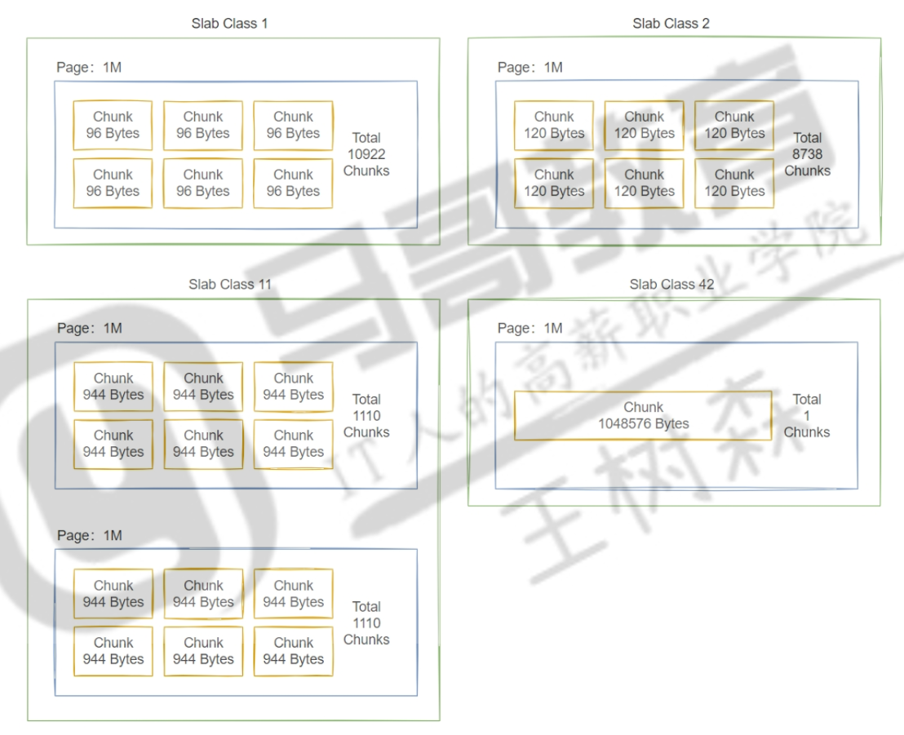

特性

* 懒过期 Lazy Expiration
    *  memcached 不会监视数据是否过期，而是在取数据时才看是否过期，如果过期，把数据有效期限标识为  0，并不清除该数据。以后可以覆盖该位置存储其它数据。
* LRU
    * 当内存不足时，memcached会使用最近最少使用算法 LRU（Least Recently Used）机制来查找可用 空间，分配给新记录使用

#### Memcached安装与使用

默认端口11211

```shell
apt install memcached -y
yum install memcached -y
```

配置文件/etc/memcached.conf或是/etc/sysconfig/memcached

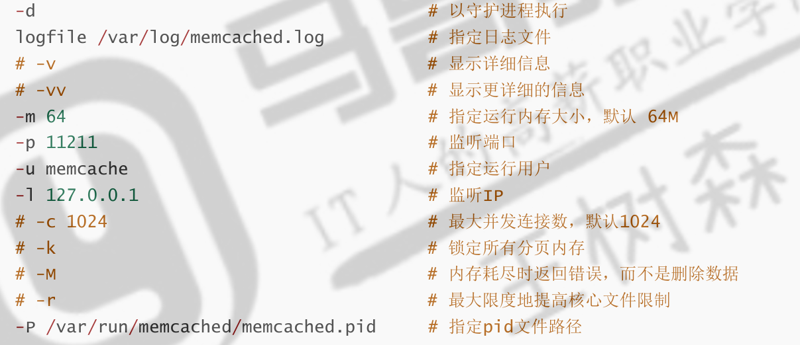

**增长因子**

```shell
# 查看
memcached -p 11211 -u memcache -vv

# 调整memcache的增长因子
memcached -p 11211 -f 2 -u memcache -vv
```

```shell
# 命令格式
<command name> <key> <flags> <exptime> <bytes> [noreply] <data block> 
# 格式解读
<command name>     # 具体命令
<key>              # 任意字符串，用于存取数据的标识
<flags>            # 任意一个无符号整型数字，该字段对服务器不透明，客户端可将其作为位域来存储数据特定信息
<exptime>          # 缓存有效期，以秒为单位，0不过期， -1立即失效，最长30天，超过30天被当作时间戳来处理
<bytes>            # 此次写入的数据占用的空间大小
<cas unique>       # (compare and set)，一个64位现有item的值，客户端可以使用gets命令获取cas的值
[noreply]          # 可选，表示服务器不用返回任何数据
```

```shell
# 命令
stats                  # 显示当前 memcached 服务状态
set                    # 设置一个 key/value，无论key是否已经存在
add                    # key 不存在时，新增一个 key/value，只有在指定的键不存在时才会成功存储数据。
replace                # 替换一个己存在的 key 中的内容，
append                 # 追加数据到 key 的尾部
prepend                # 插入数据到 key 的头部
get                    # 获取 key 的 flag 及 value
delete				   # 删除一个 key
incr                   # 对 key 做自加1，key 中保存的数据必须是整型
decr				   # 对 key 做自减1，key 中保存的数据必须是整型
flush_all              # 清空所有数据
```

```shell
telnet 10.0.0.11 11211
set test 1 30 3			# 设置一个 key/value ， key=test，flag=1，exp=30S，bytes=3
abc						# 输入要存储的值，此处只能存3字节，不能多也不能少
get test 				# 获取数据
delete test				# 删除数据
add test1 1 30 7		# 增加key
aa						# 输入内容，换行符占1位
aaa						# 输入内容，换行符占1为
flush_all				# 清除
```

#### MSM集群

**仅支持到tomcat9版本**

Memcached Session Manager核心特性是将用户的会话数据备份到Memcached缓存服务，从而允许在多台Tomcat实例之间共享会话状 态。

故障转移：支持两种配置模式 -- 粘性会话与非粘性会话。

* Sticky 模式
    * 会话数据直接存储在内存中，并给其他的Memcached共享。自己的Memcached中不会有自己的会话。
    * 绑定的服务器宕机，用户会话可能丢失。
* 非Sticky 模式
    * 服务器从 Memcached 中读取或写入用户的会话数据。会话共享给所有Memcached包括自己的Memcached，自己不留会话信息。
    * 新增服务器后，不需要重新绑定会话。
    * 性能略低

##### Sticky 模式

sticky 模式即前端 tomcat 和后端 memcached 有关联(粘性)关系

tomcat自己的session信息不会保存在自己的memcached中，会自己留存。

**写入规则**：每个会话根据一致性哈希算法分配到一个特定的 Memcached 节点，并存储在该节点中。

**读取规则**：Tomcat 实例按一致性哈希算法从分配的目标节点读取会话数据。

**故障处理**：

- 如果目标节点崩溃，MSM 不会自动尝试从其他节点恢复会话数据。
- 如果设置了冗余节点，会写入冗余节点

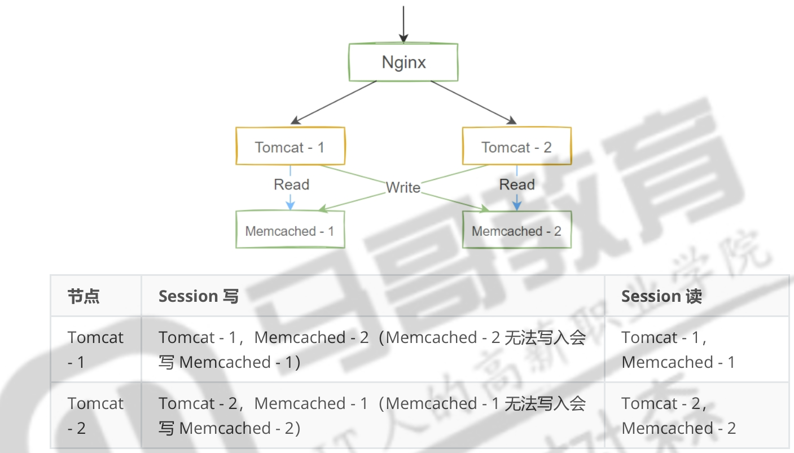

如上图所示，Tomcat -1 上生成的 Session 信息，除了在 Tomcat -1 这个节点保存一份之外，还 往 Memcached - 2 中写一份，当一个前端请求在 Tomcat - 1 中生成了 Session 信息后，下次被调度 到 Tomcat - 2 中，之前的 Session 信息可以在 Memcached - 2 中获取。

如果 Memcached - 2 中无法写入数据，Tomcat -1 会将 Session 数据写入 Memcached - 1  节点，此时，如果一个请求被调度到 Tomcat - 2，则之前在 Tomcat - 1 中生成的 Session 信息无法 从 Memcached - 2 中获取，那么，该请求的会话信息会丢失。


**部署**

MSM集群依赖文件

tomcat/lib中，注意包是否下载完全。特别这俩kryo3.0.3.jar；reflectasm1.11.9.jar

```shell
wget https://repo1.maven.org/maven2/org/ow2/asm/asm/5.2/asm-5.2.jar
wget https://repo1.maven.org/maven2/com/esotericsoftware/kryo/3.0.3/kryo3.0.3.jar
wget https://repo1.maven.org/maven2/de/javakaffee/kryo-serializers/0.45/kryo-serializers-0.45.jar
wget https://repo1.maven.org/maven2/de/javakaffee/msm/memcached-session-manager/2.3.2/memcached-session-manager-2.3.2.jar
wget https://repo1.maven.org/maven2/de/javakaffee/msm/memcached-session-manager-tc9/2.3.2/memcached-session-manager-tc9-2.3.2.jar
wget https://repo1.maven.org/maven2/com/esotericsoftware/minlog/1.3.1/minlog-1.3.1.jar
wget https://repo1.maven.org/maven2/de/javakaffee/msm/msm-kryo-serializer/2.3.2/msm-kryo-serializer-2.3.2.jar
wget https://repo1.maven.org/maven2/org/objenesis/objenesis/2.6/objenesis-2.6.jar
wget https://repo1.maven.org/maven2/com/esotericsoftware/reflectasm/1.11.9/reflectasm1.11.9.jar
wget https://repo1.maven.org/maven2/net/spy/spymemcached/2.12.3/spymemcached-2.12.3.jar
```

**配置**

配置了 `failoverNodes="m1"` 时，只有在 **主节点发生故障** 时，会话数据才会被存储到指定的故障转移节点（如 `m1`）。也就是说，`m1` 并不会在正常情况下主动存储会话数据，而是作为备用节点来提供服务。

```xml
vim /tomcat/conf/context.xml

<Context>
    ...
<Manager className="de.javakaffee.web.msm.MemcachedBackupSessionManager"
 memcachedNodes="m1:10.0.0.11:11211,m2:10.0.0.12:11211"
 failoverNodes="m1"
 requestUriIgnorePattern=".*\.(ico|png|gif|jpg|css|js)$" transcoderFactoryClass="de.javakaffee.web.msm.serializer.kryo.KryoTranscoderFactory"/>
    ...
</Context>
```

**memcache监控py脚本**

```shell
apt install python3-pip -y
pip3 install python-memcached
```


```python
#!/usr/bin/python3
import memcache

client = memcache.Client(['10.0.0.13:11211','10.0.0.16:11211'],debug=True)

for i in client.get_stats('items'):
	    print(i)
print('-' * 35)

# slab class的值到上面查找并修改下面的值‘5’
for i in client.get_stats('cachedump 5 0'):
    print(i)
```

**情景分析**

tomcat-1创建会话session-1

* 自己存一份

* memcached-2一份

memcached-2崩溃

* 情况1：下次负载到tomcat-2
    * tomcat-2自己没有session-1
    * 根据一致性哈希算法查找会话，找到memcached-1。memcached-1没有session-1。
    * tomcat-2创建新会话session-2
    * **会话未保持**
* 情况2：下次负载到tomcat-1
    * 因memcached-2崩溃，存memcached-1
        * tomcat-1一份
        * memcached-1一份
    * 切换tomcat-2，根据一致性哈希查找会话，找到memcached-1。从memcached-1读到session-1。
    * **会话保持：俩节点下的特例**
    * **如果是更多memcached节点，一致性哈希可能负载到其他memcached节点，会话还是未保持**


##### 非Sticky 模式

非 Sticky 模式的设计目标是实现会话数据的 **分布式共享**，使所有 Tomcat 实例都可以通过 Memcached 集群访问同一份会话数据。

会话数据完全存储在 Memcached 中。

**备份数据规则**：

- 主数据存储在通过一致性哈希算法确定的节点（如 `m1` 或 `m2`）。
- 备份数据存储在主节点之后的下**一个节点**（环状分布）。

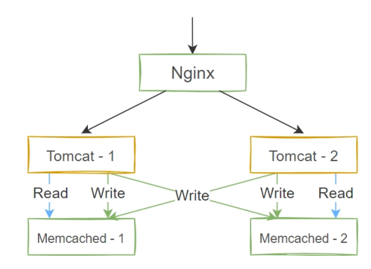

```xml
<Context>
    ...
 <Manager className="de.javakaffee.web.msm.MemcachedBackupSessionManager"
 memcachedNodes="m1:10.0.0.11:11211,m2:10.0.0.12:11211"
 sticky="false"      
 sessionBackupAsync="false"
 lockingMode="uriPattern:/path1|/path2"
 requestUriIgnorePattern=".*\.(ico|png|gif|jpg|css|js)$"
 transcoderFactoryClass="de.javakaffee.web.msm.serializer.kryo.KryoTranscoderFactory"
 />
 ...   
</Context>
```

冗余备份`copyBackupToMemcached="true"`控制会话数据是否在**多个 Memcached 节点**上冗余存储。


### Redis 会话保持

* 数据持久化
    * Redis支持数据持久化，可以将数据写入磁盘以防止数据丢失。它提供了多种持久化选项，包括快照和日 志。而Memcached不支持数据持久化，一旦服务器重启或发生故障，缓存中的数据将会丢失。
* 功能丰富
    * Redis提供了许多附加功能，例如发布/订阅、事务、Lua脚本等，使得它不仅仅是一个缓存系统，还可 以用作消息队列、计数器等。
* 丰富的数据类型
    * 适合处理 复杂的数据结构。

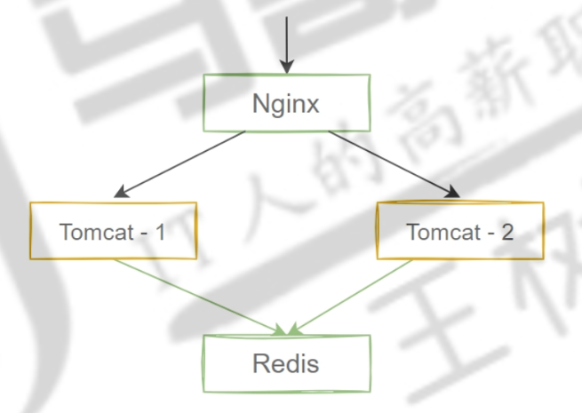

可以通过MSM实现redis会话存储，memcachedNodes的协议

**不推荐**

```shell
# tomcat/lib中，，注意前环境中包的干扰
wget https://repo1.maven.org/maven2/redis/clients/jedis/3.0.0/jedis-3.0.0.jar

# 在之前的配置中修改对应属性
memcachedNodes="redis://10.0.0.15"
```

MSM，不好用，只支持到tomcat9。

#### 部署redis环境

单独服务器

端口6379

```shell
yum install redis -y
apt install redis-server -y
```

```shell
vim /etc/redis/redis.conf
bind 0.0.0.0
protected-mode no

# 测试
redis-cli  keys "*"
```

#### redis会话共享配置

tomcat/lib中，**注意前环境中包的干扰，注意版本**

```shell
wget https://repo1.maven.org/maven2/org/redisson/redisson-all/3.27.2/redisson-all-3.27.2.jar
wget https://repo1.maven.org/maven2/org/redisson/redisson-tomcat-9/3.27.2/redisson-tomcat-9-3.27.2.jar
```

```xml
<Context>
 ...
 <Manager className="org.redisson.tomcat.RedissonSessionManager"
 configPath="/tomcat10/conf/redisson.conf"
 readMode="REDIS" updateMode="DEFAULT" 
		 broadcastSessionEvents="false"
 keyPrefix=""
 />
 ...
<Context>
```

/tomcat10/conf/redisson.conf

```yaml
singleServerConfig:
  idleConnectionTimeout: 10000
  connectTimeout: 10000
  timeout: 3000
  retryAttempts: 3
  retryInterval: 1500
  password: null
  subscriptionsPerConnection: 5
  clientName: null
  address: "redis://10.0.0.204:6379"
  subscriptionConnectionMinimumIdleSize: 1
  subscriptionConnectionPoolSize: 50
  connectionMinimumIdleSize: 24
  connectionPoolSize: 64
  database: 0
  dnsMonitoringInterval: 5000
threads: 16
nettyThreads: 32
codec: !<org.redisson.codec.Kryo5Codec> {}
transportMode: "NIO"

```

# 性能优化

1. test.jsp 文件是一个 JSP（JavaServer Pages）文件，通常包含 HTML 代码和嵌入的 Java 代 码（如 JSP 标签、脚本片段等）。当客户端（如浏览器）请求这个 JSP 文件时，Tomcat 服务器会处理 它。

2. Tomcat 会将 JSP 文件转换成等效的 Java 源代码文件（即 .java 文件），这个文件包含了 JSP  页面中的所有逻辑和输出。这个过程称为 JSP 编译。注意，test_jsp.java 文件通常是临时文件，存储在 Tomcat 的工作目录中，并且不会在文件系统中 持久化。

3. 当 Tomcat 将 JSP 文件转换成 Java 源代码后，它会进一步编译这个 Java 源代码文件，生成一个  .class 文件（即字节码文件）。这个 .class 文件包含了 JSP 页面的所有逻辑和输出，并且可以在  JVM（Java 虚拟机）上执行。当客户端请求 JSP 页面时，Tomcat 实际上是在执行这个 .class 文件。

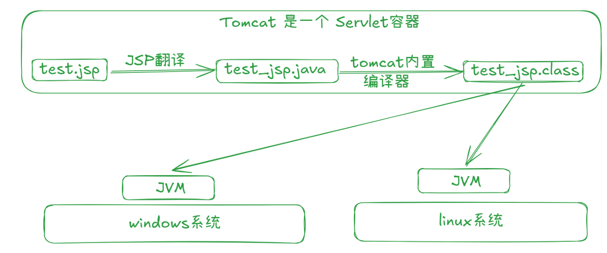

由JVM充当Java应用和底层操作系统之间的中间层，Java源代码经过编译后生成的字节码可以 在任何支持JVM的平台上运行。

## JVM基础

JVM，全称Java Virtual Machine，即Java虚拟机。它是一个运行在计算机上的程序，主要职责是运 行Java字节码文件。

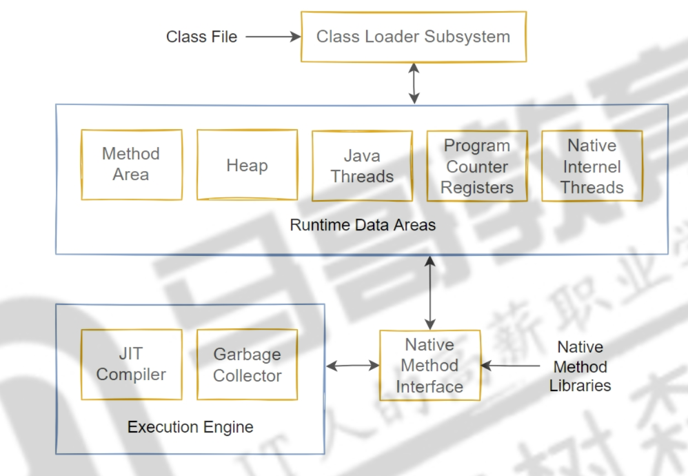

* 类加载子系统（Class Loader Subsystem）
    * 负责将 `.class` 文件加载到 JVM 中。
    * 验证类文件的正确性（字节码验证）。
    * 初始化类的静态变量和静态代码块。
    * 组成
        * 加载器（Loaders）
        * 运行时常量池（Runtime Constant Pool）
* 运行时数据区（Runtime Data Areas）
    * 方法区（Method Area） **永久代（PermGen）元空间（Metaspace）**
        * 线程共享
        * 存储
            * 类的元数据（类名、访问修饰符、字段、方法信息）。
            * 静态变量
            * 运行时常量池。
        * 元空间存储在本地内存中，而不是 JVM 堆中。
    * 堆（Heap）
        * 线程共享
        * 新生代（Young Generation）
            * Eden 区和两个 Survivor 区（S0 和 S1）
        * 老年代（Old Generation）
            * 存储生命周期较长的对象。
    * 虚拟机栈（JVM Stack）
        * 线程私有
        * 存储方法调用的信息，包括局部变量表、操作数栈、动态链接、方法出口。
        * 每个方法执行时会创建一个 **栈帧（Stack Frame）**，存储该方法的局部变量和方法运行状态。
        * 线程结束后，栈空间会自动释放。
        * 可能抛出 `StackOverflowError`（栈溢出）或 `OutOfMemoryError`（内存不足）。
    * 本地方法栈（Native Method Stack）
        * 调用本地方法（Native Code）的相关信息。本地方法，使用 native 关健字修饰的方法。
        * 与操作系统底层交互。
    * 程序计数器（Program Counter, PC）
        * 存储当前线程执行的字节码指令地址。

*  执行引擎（Execution Engine）
    * 解释器（Interpreter）
        * 按照字节码逐行解释执行。
        * 初次运行字节码时，由解释器执行。
        * 缺点：速度较慢。
    * 即时编译器（JIT Compiler）
        * 将热点代码（频繁执行的代码）编译为本地机器码，提高执行效率。
    * 垃圾回收器（Garbage Collector, GC）
        * 回收不再使用的对象，释放内存。
        * VM 提供多种垃圾回收算法和垃圾回收器（如 G1、CMS、Parallel GC）。
* 本地方法接口
    * 将本地方法栈通过JNI(Java Native Interface)调用本地方法库（Native Method Libraries）
    * 提供与本地操作系统交互的能力。
    * 调用非 Java 语言实现的功能（如 C/C++）。
*  内存模型（Java Memory Model, JMM）
    * 主内存：所有线程共享的内存区域。
    * 工作内存：每个线程的私有区域，存储主内存中变量的副本。

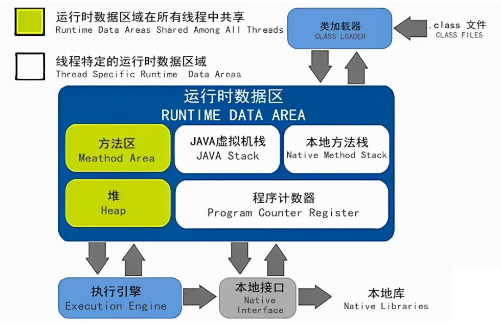

## GC垃圾回收基础

我们学习GC垃圾回收，只需要关注两个点：

1. 什么叫垃圾回收

2. 如何启动jvm参数去指定一些特性


在堆内存中如果创建的对象不再使用，仍占用着内存，此时即为垃圾，需要进行垃圾回收，从而释放内存 空间给其它对象使用。

注意内存碎片，内存碎片越少越好

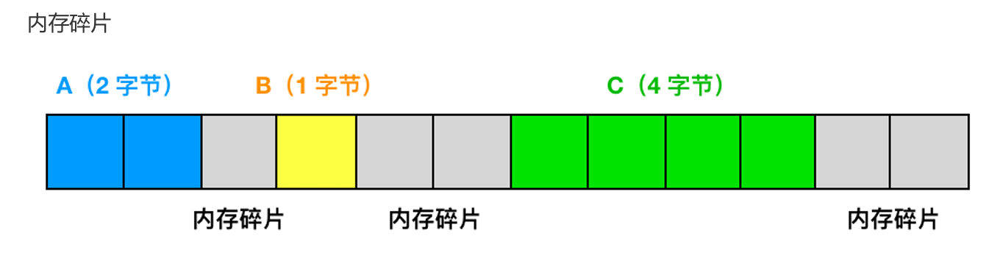

希望的效果


对于垃圾回收，需要解决三个问题

* 哪些是垃圾要回收
* 怎么回收垃圾
* 什么时候回收垃圾

### Garbage 垃圾确定方法

* 引用计数

    * 原理
        * 每个对象维护一个引用计数器（计数值）。
        * 当一个对象被其他对象引用时，引用计数器 +1。
        * 当对象的引用被清除或对象超出作用域时，引用计数器 -1。
        * 如果某个对象的引用计数为 0，则说明该对象不再被任何其他对象引用，可以被判定为垃圾，进行回收。
    * 优点
        * 实现简单
        * 回收及时
    * 缺点
        * 无法处理循环引用：如果两个对象互相引用，但没有被其他对象引用，引用计数器永远不会变为 0，导致无法回收。
        * 性能开销大

* 根搜索 (可达) 算法：Root Searching

    * 通过一组称为 **GC Roots** 的对象作为起点，沿着引用关系向下搜索。
    * 如果一个对象无法从 GC Roots 到达（即没有可达路径），则认为该对象是垃圾，可以被回收。
    * GC Roots 的对象
        * 当前线程栈中引用的对象（如局部变量）。
        * 方法区中静态变量引用的对象。
        * 方法区中常量引用的对象（如字符串常量池中的对象）。
        * NI（本地方法）引用的对象。
    * 优点
        * 能够正确处理循环引用问题。
        * 较好的性能和准确性
    * 缺点
        * 定期进行全局扫描，可能会增加额外的开销。
        * 在高并发环境下，需要暂停应用线程（Stop-The-World）来进行 GC。

    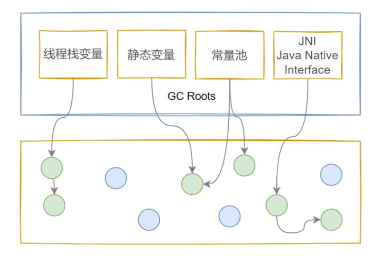

### 垃圾回收算法

对于大多数垃圾回收算法而言，**GC线程工作时，停止所有工作的线程，进行内存整理工作**，称为  **Stop The World（STW）**。GC 完成时，内存整理完毕，开始恢复其他工作线程运行。这也是 JVM 运行 中最头疼的问题

#### 标记-清除算法（Mark-Sweep）

1. 标记所有可达对象。

2. 清除未标记的对象。


**优点**：简单直接。

**缺点**：

- 造成内存碎片。
- 清理效率较低。


#### 标记-整理（压缩）算法（Mark-Compact）

1. 标记所有可达对象。

2. 将存活对象移动到一端，清除无效内存。


**优点**：减少内存碎片。

**缺点**：对象移动有额外开销。

#### 复制算法（Copying）

1. 将内存分为两块：活动区（50%）和空闲区（50%）。
2. 只复制存活对象到空闲区，清空活动区。

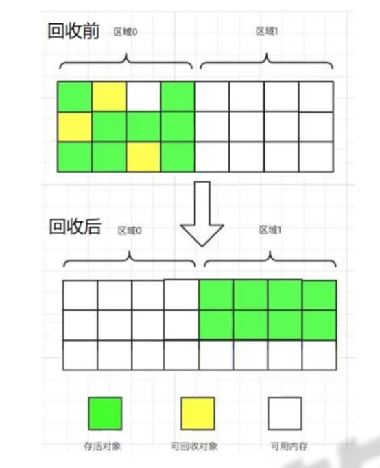

**优点**：效率高，无碎片。

**缺点**：内存浪费（50% 的空间被空闲区占用）。

#### 比较以上算法

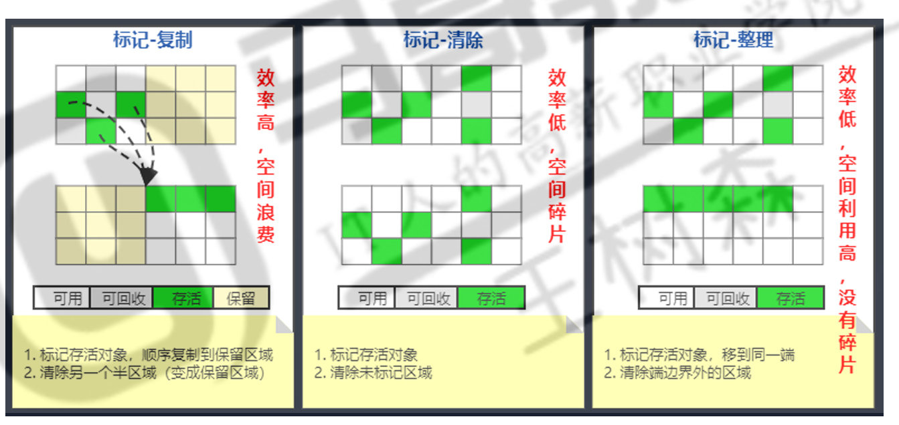

* 效率：复制算法>标记清除算法> 标记压缩算法
* 内存整齐度：复制算法=标记压缩算法> 标记清除算法
* 内存利用率：标记压缩算法=标记清除算法>复制算法

#### JVM 分代收集算法（Generational Collection）

JVM 中广泛使用的算法，结合以上算法的优点：

- 新生代：采用复制算法。
- 老年代：采用标记-整理算法。
- 方法区/永久代/元空间：采用标记-清除算法。


* 新生代（Young Generation）
    * 划分为Eden伊甸园区和两个Survivor幸存区（From和To）
    * 2个幸存区大小相等、地位相同、可互换
    * 通过Minor GC（新生代垃圾回收）来清理不再使用的对象。

* 老年代（Old Generation）
    * 用于存放经过多次Minor GC后仍然存活的对象。这些对象通常是比较稳定的，不会被频繁回收。
    * Major GC（老年代垃圾回收）会清理年老代中不再使用的对象。

* 永久代/元空间（PermGen/Metaspace）
    * 存放保存 JVM 自身的类的元数据信息、常量池、存储 JAVA 运行时的环境信息等。
    * 元空间位于本地内存中，而不是堆内存中。关闭JVM会释放此区域内存，所以此空间不存在垃圾回收。
    * 元空间在物理上不属于heap内存，但逻辑上归属于heap内存。


默认大小

* 堆内存
    * 默认堆大小由 JVM 启动时的物理内存大小决定
        * 最小值（`-Xms`）通常为物理内存的 **1/64**，且不能超过 **1GB**。
        * 最大值（`-Xmx`）通常为物理内存的 **1/4**，且不能超过 **32GB**（64 位 JVM）。
* 新生代
    * 堆大小的 **1/3**
    * Eden 区 和 两个 Survivor 区的默认比例为 **8:1:1**。
    * 参数 `-XX:SurvivorRatio` 调整该比例
        * 例如，`-XX:SurvivorRatio=8` 表示 Eden 占用 80%，两个 Survivor 各占 10%。
* 老年代
    * 堆大小的 **2/3**
    * 晋升的条件
        * 在新生代经历多次垃圾回收后，达到一定年龄（由 `-XX:MaxTenuringThreshold` 决定）。
        * Survivor 区的空间不足以容纳存活对象时，直接晋升到老年代。
* 永久代/元空间
    * 初始大小：**21MB**。
    * 最大大小：没有固定限制，但可以通过 `-XX:MaxMetaspaceSize` 设置上限。
    * 参数：`-XX:MetaspaceSize`（初始大小），`-XX:MaxMetaspaceSize`（最大大小）。


使用java程序代码来获取 java堆的信息

Heap.java

```java
public class Heap {
    public static void main(String[] args) {
        Runtime runtime = Runtime.getRuntime();

        // 当前已分配的堆内存
        long totalMemory = runtime.totalMemory();
        // 当前空闲的堆内存
        long freeMemory = runtime.freeMemory();
        // JVM 可用的最大堆内存
        long maxMemory = runtime.maxMemory();

        System.out.println("Total Memory: " + totalMemory / (1024 * 1024) + " MB");
        System.out.println("Free Memory: " + freeMemory / (1024 * 1024) + " MB");
        System.out.println("Max Memory: " + maxMemory / (1024 * 1024) + " MB");
    }
}
```

```shell
javac Heap.java
java Heap.java
```

详细查看程序垃圾收集信息数据

```shell
java -XX:+PrintGCDetails Heap.java
java -Xlog:gc*  Heap.java
```

##### 年轻代回收 Minor GC

1. 起始时，所有新建对象(特大对象直接进入老年代)都出生在eden，当eden满了，启动GC。这个称为 Young GC 或者 Minor GC
2. 先标记eden存活对象，然后将存活对象复制到s0（假设本次是s0，也可以是s1，它们可以调换），eden 剩余所有空间都清空。GC完成

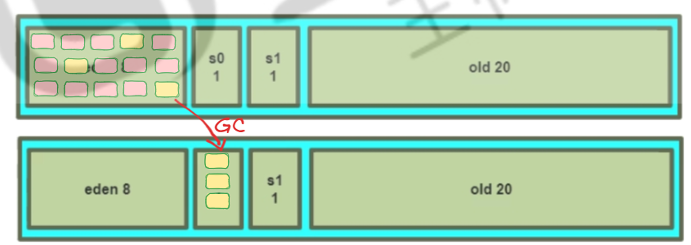

3. 继续新建对象，当eden再次满了，启动GC
4. 先同时标记eden和s0中存活对象，然后将存活对象复制到s1。将eden和s0清空，此次GC完成

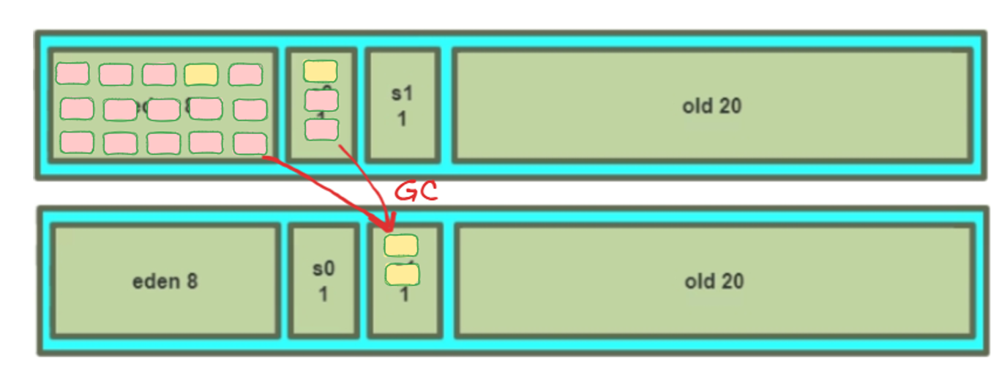

5. 继续新建对象，当eden满了，启动GC
6. 先标记eden和s1中存活对象，然后将存活对象复制到s0。将eden和s1清空,此次GC完成
7. 以后就重复上面的步骤

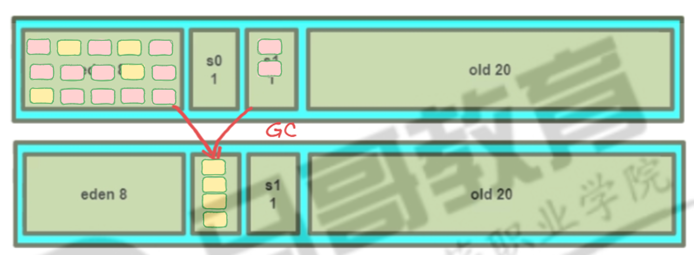

通常场景下，大多数对象都不会存活很久，而且创建活动非常多，新生代就需要频繁垃圾回收。

但是， 如果一个对象一直存活，它最后就在from、to来回复制，如果from区中对象复制次数达到阈值(默认15 次，CMS（标记清除）为6次，可通过java的选项 -XX:MaxTenuringThreshold=N )，就直接复制到老年代。

如果对象本身非常大，无法放入新生代（包括 Eden 和 Survivor），则会直接分配到老年代。

##### 老年代回收 Major GC

进入老年代的数据较少，所以老年代区被占满的速度较慢，所以垃圾回收也不频繁。

由于老年代对象也可以引用新生代对象，所以先进行一次Minor GC，然后在Major GC会提高效率。所 以，我们一般认为，回收老年代的时候完成了一次FullGC。

所以，一般情况下，我们可以认为 MajorGC = FullGC

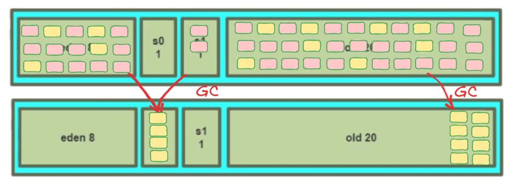

### GC 触发条件

* Minor GC 触发条件：当eden区满了触发 
    * Minor GC 可能会引起短暂的STW暂停。当进行 Minor GC 时，为了确保安全性，JVM 需要在某些特 定的点上暂停所有应用程序的线程，以便更新一些关键的数据结构。这些暂停通常是非常短暂的，通常在毫秒 级别，并且很少对应用程序的性能产生显著影响

* Full GC 触发条件：老年代满了；System.gc()手动调用（不推荐）
    * Major GC的暂停时间通常会比Minor GC的暂停时间更长，因为老年代的容量通常比年轻代大得多。这 意味着在收集和整理大量内存时，需要更多的时间来完成垃圾收集操作
    * 尽管Major GC会引起较长的STW暂停，但JVM通常会尽量优化垃圾收集器的性能，以减少这些暂停对应 用程序的影响。例如，通过使用并行或并发垃圾收集算法，可以减少STW时间，并允许一部分垃圾收集工作与 应用程序的线程并发执行。

### JVM 垃圾回收器的分类

针对这些垃圾回收方式的实施特点，我们可以将其划分为不同的类型方式。


按工作模式不同：指的是GC线程和工作线程是否一起运行

* 独占垃圾回收器
    * 只要GC在工作，STW 一直进行到回收完毕，工作线程才能继续执行
* 并发垃圾回收器
    * 让GC线程垃圾回收的**某些阶段** 可以和 工作线程一起进行
    * 如：标记阶段并发，回收阶段仍然独占


按回收线程数：指的是GC线程是否串行或并行执行

* 串行垃圾回收器（Serial GC）
    * 一个GC线程完成内存资源的回收工作
* 并行垃圾回收器（Parallel GC）
    * 多个GC线程同时一起完成内存资源的回收工作，充分利用CPU的多核并发执行的计算资源


GC该如何调整策略？

因为各种java系生态圈产品的功能定位不一样，所以，在不同领域和场景对JVM需要不同的调整策略：

*  减少 STW 时长，串行变并行
* 减少 GC 次数，要分配合适的内存大小，这样的话，可以实现数据填充的速度慢一些，从而减少GC次数。
    * 提供更大的堆内存，适当调整分代回收的阈值。

一般情况下，大概可以使用以下原则：

* 客户端或较小程序，内存使用量不大，可以使用串行回收
*  对于服务端大型计算，可以使用并行回收
* 大型WEB应用，用户端不愿意等待，尽量少的STW，可以使用并发回收
    * 合理使用小字节变量，选择合适的类型
    * 提前申请环境变量


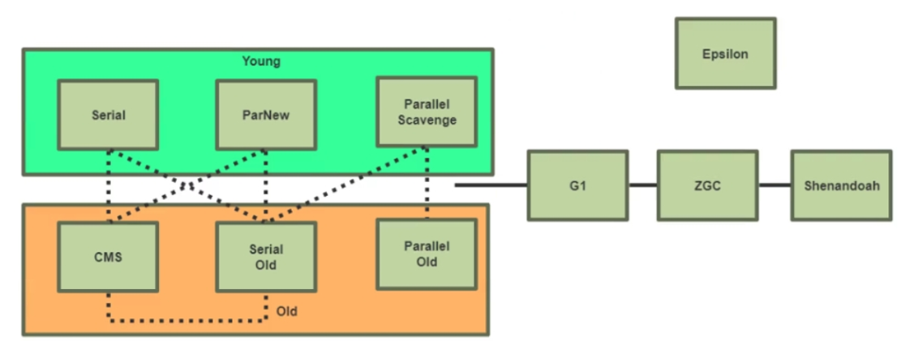

**对比总结**

| **垃圾回收器**    | **适用代**    | **算法**           | **特点**                       | **适用场景**                 |
| ----------------- | ------------- | ------------------ | ------------------------------ | ---------------------------- |
| Serial            | 新生代        | 复制算法           | 单线程，简单高效               | 单线程或低并发环境           |
| Parallel Scavenge | 新生代        | 复制算法           | 多线程，吞吐量优先             | 高吞吐量应用                 |
| ParNew            | 新生代        | 复制算法           | 多线程，适合与 CMS 搭配        | 延迟敏感的多线程应用         |
| CMS               | 老年代        | 标记-清除          | 并发回收，低延迟               | 延迟敏感场景（如 Web 应用）  |
| Serial Old        | 老年代        | 标记-整理          | 单线程，适合单线程环境         | 内存小、单线程应用           |
| Parallel Old      | 老年代        | 标记-整理          | 多线程，吞吐量优先             | 批处理或后台任务             |
| G1                | 新生代+老年代 | 标记-整理+复制算法 | 分区化设计，低延迟，内存碎片少 | 高并发、低延迟应用           |
| ZGC               | 新生代+老年代 | 并发标记清除       | 超低停顿，支持超大堆内存       | 实时系统，大堆内存，实验阶段 |
| Shenandoah        | 新生代+老年代 | 并发标记清除和整理 | 低停顿，内存压缩               | 大堆内存，低延迟，实验阶段   |
| Epsilon           | 不适用        | 无                 | 无垃圾回收，性能测试           | 短生命周期或测试             |


#### 新生代垃圾回收器

* 串行收集器 Serial
    * 单线程、独占式串行，采用复制算法，简单高效但会造成STW

* 并行回收收集器 PS(Parallel Scavenge)
    * 多线程并行、独占式，会产生STW, 使用复制算法关注调整吞吐量，此收集器关注点是达到一个可控制的吞吐量
    * 具有自适应调节策略
* 并行收集器ParNew
    * 尽可能地缩短垃圾收集时用户线程的停顿时间
    * Serial 收集器的多线程版，将单线程的串行收集器变成了多线程并行、独占式，使用复制算法
    * 相当于PS的改进版,但是与PS不一样的在于，ParNew可以和老年代的CMS组合使用


#### 老年代垃圾回收器

* 串行收集器Serial Old
    * Serial Old是Serial收集器的老年代版本,单线程、独占式串行，回收算法使用标记压缩
* 并行回收收集器Parallel Old
    * 多线程、独占式并行，回收算法使用标记压缩，关注调整吞吐量。它是默认的新老年代的垃圾回收器。
    * Parallel Old收集器是Parallel Scavenge 收集器的老年代版本
    * Parallel Scavenge 收集器无法与CMS收集器配合工作,因为一个是为了吞吐量，一个是为了客户体验

#### CMS收集器

CMS（Concurrent Mark Sweep）收集器是一种基于标记清除算法，追求最短停顿 时间的真正意义上的第一款并发垃圾收集器。

在某些阶段尽量使用和工作线程一起运行，减少STW时长(200ms以内)，提升响应速度，是互联网服务端 BS系统上较佳的回收算法。

它主要分为4个阶段：**初始标记、并发标记、重新标记、并发清除**，在**初始标记、重新标记时需要STW**。


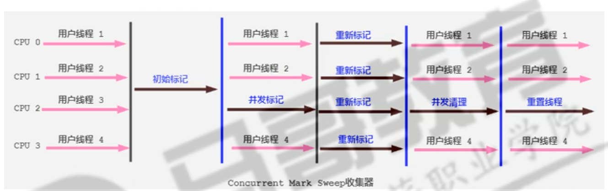

* 初始标记
    * 需要STW（Stop The Word），只标记一下GC Roots能直接关联到的对象
* 并发标记
    * GC Roots进行扫描可达链的过程，为了找出哪些对象需要收集。
* 重新标记
    * 修正在并发标记期间出现的遗漏情况。
    * 需要暂停应用程序线程（即**STW**）确保在这一阶段的标记结果是准确的。
* 并发清理
    * 在并发标记和重新标记之后，垃圾回收系统开始并发清除阶段。

问题：

* 对处理器资源非常敏感
    * CMS虽然在并发阶段不会导致用户线程的停顿，但却占用了CPU，导致用户的应用变慢，导致应用的吞吐 量下降。
* 频繁产生浮动垃圾，占用内存资源。
    * 在CMS并发标记和并发清除阶段，用户线程是活跃的，自然也会产生新的垃圾对象，这些垃圾对象就只能等 到下一次垃圾回收的时候才能进行清除，这就是“浮动垃圾”。
* 大量的内存碎片
    * CMS是基于标记-清除的算法实现的垃圾收集器，所以CMS垃圾收集会产生大量的空间碎片，由于大量的空 间碎片的产生，当分配大对象找不到足够的空间时，就不得不提前进行一次Full GC。
    * **回退到 Serial Old GC 以完成垃圾回收**。

#### 无代限制的收集器 G1

G1收集器是最新垃圾回收器，从JDK1.6实验性提供，JDK1.7发布，其设计目标是在多处理器、大内存 服务器端提供优于CMS收集器的吞吐量和停顿控制的回收器。


特点

* 面向服务端，回收尽可能多的垃圾

* 充分的利用多CPU，使用多个CPU来缩短STW停顿的时间(10ms以内)
* 可预测的停顿，可指定消耗在垃圾收集的时间不得超过N毫秒

* 基于标记压缩算法，不会产生大量的空间碎片，有利于程序的长期执行

* 分为4个阶段：初始标记、并发标记、最终标记、筛选回收。并发标记并发执行，其它阶段STW只有GC线程并行执行.


## 调优

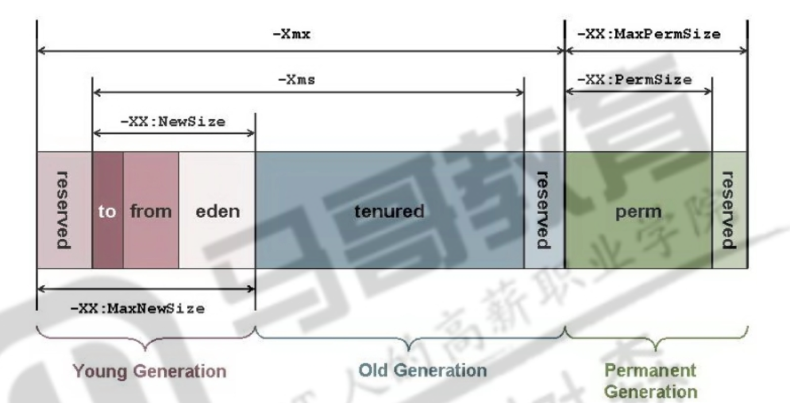

| 参数              | 说明                                                         | 范例                                    |
| ----------------- | ------------------------------------------------------------ | --------------------------------------- |
| -Xms              | 设置应用程序初始使用的堆内存大小（年轻代 + 老年代）          | -Xms2g                                  |
| -Xmx              | 设置应用程序能获得的最大堆内存，建议不超过 32G，内存管理效率下降 | -Xmx4g                                  |
| -XX:NewSize       | 设置初始新生代（年轻代）大小                                 | -XX:NewSize=128m                        |
| -XX:MaxNewSize    | 设置最大新生代（年轻代）内存空间                             | -XX:MaxNewSize=256m                     |
| -Xmn              | 同时设置 -XX:NewSize 和 -XX:MaxNewSize                       | -Xmn1g                                  |
| -XX:NewRatio      | 以比例方式设置新生代和老年代                                 | -XX:NewRatio=2 即 new:old=1:2           |
| -XX:SurvivorRatio | 以比例方式设置 Eden 和 Survivor（S0 或 S1）                  | -XX:SurvivorRatio=6 即 Eden:S0:S1=6:1:1 |
| -Xss              | 设置 Native Area 每个线程私有的栈空间大小                    | -Xss256k                                |

### jvisualvm 监控内存

```shell
apt install libxrender1 libxrender1 libxtst6 libxi6 fontconfig -y
wget https://github.com/oracle/visualvm/releases/download/2.1.8/visualvm_218.zip
unzip visualvm_218.zip
export DISPLAY=10.0.0.1:0.0
./visualvm_218/bin/visualvm
```

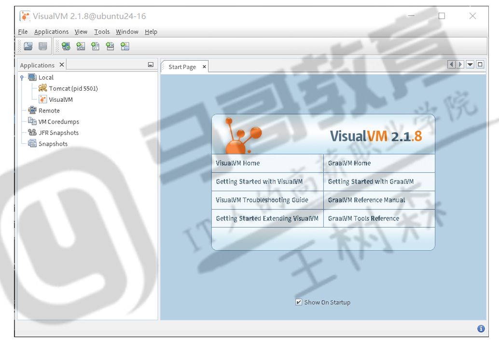

安装GC插件

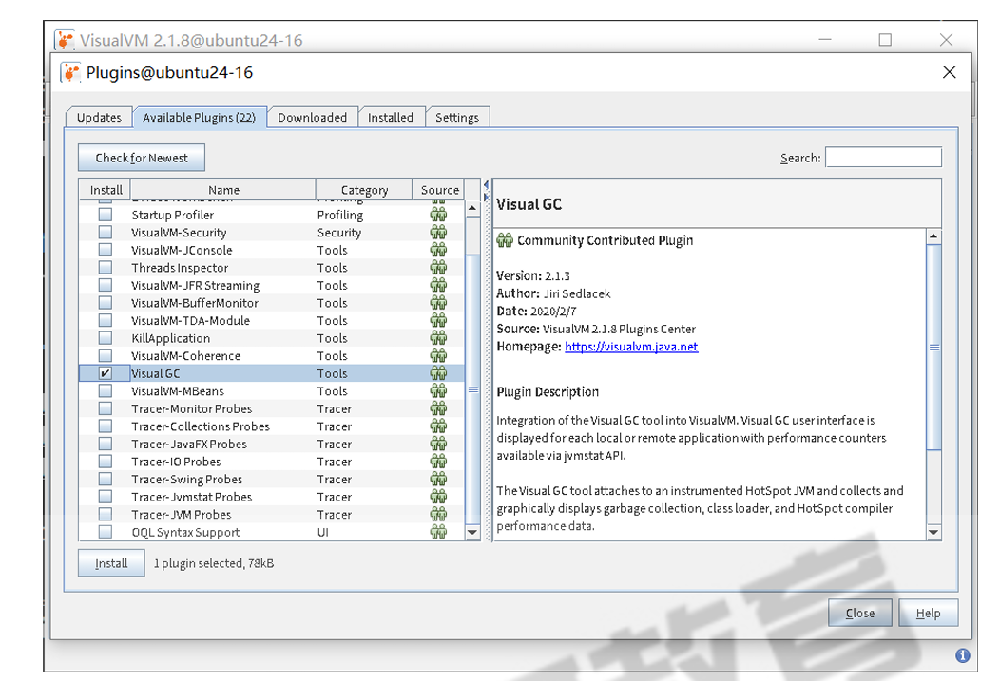


### tomcat 调优

默认启动参数

```shell
/usr/bin/java 
-Djava.util.logging.config.file=/tomcat10/conf/logging.properties 
-Djava.util.logging.manager=org.apache.juli.ClassLoaderLogManager 
-Djdk.tls.ephemeralDHKeySize=2048 -Djava.protocol.handler.pkgs=org.apache.catalina.webresources 
-Dorg.apache.catalina.security.SecurityListener.UMASK=0027 
--add-opens=java.base/java.lang=ALL-UNNAMED 
--add-opens=java.base/java.io=ALL-UNNAMED 
--add-opens=java.base/java.util=ALL-UNNAMED 
--add-opens=java.base/java.util.concurrent=ALL-UNNAMED 
--add-opens=java.rmi/sun.rmi.transport=ALL-UNNAMED 
-classpath /tomcat10/bin/bootstrap.jar:/tomcat10/bin/tomcat-juli.jar 
-Dcatalina.base=/tomcat10 
-Dcatalina.home=/tomcat10 
-Djava.io.tmpdir=/tomcat10/temp 
org.apache.catalina.startup.Bootstrap 
start
```

#### 内存空间优化

添加启动项，修改内存

/tomcat/bin/catalina.sh中添加

```shell
JAVA_OPTS='-Xms1g -Xmx1g -XX:NewRatio=2 -XX:SurvivorRatio=6'
# 堆内存初始值1G，最大值1G，年轻代和老年代内存比例为 1:2，eden区和幸存区的内存比例为6:1:1
```

```shell
JAVA_OPTS="-server -Xms4g -Xmx4g -XX:NewSize= -XX:MaxNewSize= "            
-server					#服务器模式                                       
-Xms					#堆内存初始化大小
-Xmx					#堆内存空间上限
-XX:NewSize=			#新生代空间初始化大小
-XX:MaxNewSize= 		#新生代空间最大值
```

`-server`，VM 会进行一系列优化，以提高程序的长期性能。客户端模式（`-client`）适合启动速度和较低内存消耗为优先的环境，通常用于桌面应用或小型应用。

* **性能优化**：当使用 `-server` 参数时，JVM 会进行一系列优化，以提高程序的长期性能。这些优化通常包括：

    - **更激进的 JIT 编译**：JVM 会启用更强的即时编译（JIT）策略，通常在长时间运行的应用中效果更好。与客户端模式相比，JVM 在服务器模式下会投入更多的资源进行优化，以实现更高的执行效率。

    - **更长的热启动时间**：启动时间可能比 `-client` 模式稍慢，但运行时性能更高。

    - **更多的堆内存**：服务器模式下的堆内存大小一般较大，这适合需要较大内存的应用程序。

* **垃圾回收优化**：在 `-server` 模式下，JVM 可能会使用更先进的垃圾回收策略（如 ParallelGC、G1GC 等），这些策略对处理大规模堆内存的应用更为合适。

* **更适合生产环境**：`-server` 模式一般用于服务器端应用程序，例如数据库、Web 服务和其他企业级应用。它优化了稳定性和吞吐量，适合需要较高负载和持续运行的应用。


生产案例

```shell
JAVA_OPTS="-server -Xms4g -Xmx4g -Xss512k -Xmn1g
XX:CMSInitiatingOccupancyFraction=65 -XX:+AggressiveOpts -XX:+UseBiasedLocking
XX:+DisableExplicitGC -XX:MaxTenuringThreshold=10 -XX:NewRatio=2 
XX:PermSize=128m -XX:MaxPermSize=512m -XX:CMSFullGCsBeforeCompaction=5 
XX:+ExplicitGCInvokesConcurrent -XX:+UseConcMarkSweepGC -XX:+UseParNewGC 
XX:+CMSParallelRemarkEnabled -XX:+UseCMSCompactAtFullCollection 
XX:LargePageSizeInBytes=128m -XX:+UseFastAccessorMethods"
```

* 调整 JVM 的内存分配和垃圾回收策略，以提高性能和响应时间。

* 配置更合适的线程栈、年轻代和老年代的内存大小。

* 启用并发垃圾回收并调整相关设置，减少 GC 停顿时间。

* 通过优化锁机制、禁用显式垃圾回收等手段提高多线程应用的吞吐量。

1. **内存设置**

    - **`-Xms4g`**
        设置初始堆内存大小为 4GB。JVM 启动时会分配这个大小的内存。

    - **`-Xmx4g`**
        设置最大堆内存大小为 4GB。这是 JVM 可使用的最大内存量。

    - **`-Xss512k`**
        设置每个线程的栈大小为 512KB。较小的栈大小可以节省内存，但对于需要较多栈空间的程序可能会引发 `StackOverflowError`。

    - **`-Xmn1g`**
        设置年轻代的大小为 1GB。年轻代是 Java 堆的一部分，包含了新生的对象，适当调整年轻代大小可以改善垃圾回收效率。

2. **垃圾回收配置**

    - **`-XX:CMSInitiatingOccupancyFraction=65`**
        该参数设置 CMS（并发标记清除）垃圾回收器触发的内存占用比例为 65%。当老年代的内存占用达到此值时，会启动垃圾回收。

    - **`-XX:+UseConcMarkSweepGC`**
        启用 **并发标记清除（CMS）** 垃圾回收器，它适用于长时间运行的应用程序，并尽量减少垃圾回收期间的停顿时间。

    - **`-XX:+UseParNewGC`**
        启用并行年轻代垃圾回收。它与 `-XX:+UseConcMarkSweepGC` 一起使用，提供并行处理年轻代的垃圾回收。

    - **`-XX:+CMSParallelRemarkEnabled`**
        启用并行标记的优化，在 CMS GC 的标记阶段使用多线程。

    - **`-XX:+UseCMSCompactAtFullCollection`**
        启用 CMS GC 完全收集时进行压缩，帮助老年代空间的整理。

    - **`-XX:CMSFullGCsBeforeCompaction=5`**
        设置 CMS GC 完全回收之前的次数，达到 5 次后进行老年代的压缩。

    - **`-XX:+ExplicitGCInvokesConcurrent`**
        启用显式垃圾回收时并发执行。这意味着通过调用 `System.gc()` 时，GC 会并发执行而不是暂停应用程序。

3. **优化和锁定**

    - **`-XX:+AggressiveOpts`**
        启用一些 JDK 内部的实验性优化，这些优化可能会提高性能，但也可能在某些情况下导致不稳定。

    - **`-XX:+UseBiasedLocking`**
        启用偏向锁优化，适用于多线程环境中的轻量级锁。偏向锁可以减少线程之间的竞争，提高性能。

    - **`-XX:+DisableExplicitGC`**
        禁用显式垃圾回收（即禁用 `System.gc()`）。这样可以防止不必要的垃圾回收暂停，避免程序因调用 `System.gc()` 而出现性能瓶颈。

    - **`-XX:MaxTenuringThreshold=10`**
        设置对象晋升到老年代的阈值为 10。若一个对象在年轻代经历的垃圾回收次数超过 10 次，它将晋升到老年代。

    - **`-XX:NewRatio=2`**
        设置年轻代和老年代的内存比例为 2:1，即年轻代的大小是老年代的一半。

4. **持久代和元空间（在 JDK 8 之前）**

    - **`-XX:PermSize=128m`**
        设置 **持久代（PermGen）** 的初始大小为 128MB。持久代存储类信息、方法等元数据（对于 JDK 8 之前的版本有效，JDK 8 及以后使用元空间替代持久代）。

    - **`-XX:MaxPermSize=512m`**
        设置持久代的最大大小为 512MB（JDK 8 之前的版本）。

5.  **其他配置**
    - **`-XX:LargePageSizeInBytes=128m`**
        启用大页面内存（HugePages）机制，每页的大小设置为 128MB。大页面内存能够提高内存的使用效率，尤其适用于需要大量内存的应用。
    - **`-XX:+UseFastAccessorMethods`**
        启用加速访问方法的特性，以提高 Java 方法的调用效率。

#### 线程池调整

`server.xml`中

```xml
<Connector port="8080" protocol="HTTP/1.1" connectionTimeout="20000"
           redirectPort="8443" maxThreads="2000"/>
```

改后

```xml
<Connector port="8080" protocol="HTTP/1.1"
           connectionTimeout="20000"
           maxThreads="200"
           minSpareThreads="25"
           maxSpareThreads="75"
           acceptCount="100"
           URIEncoding="UTF-8"
           enableLookups="false"
           compression="on"
           compressionMinSize="1024"
           compressableMimeType="text/css,text/javascript,application/json,text/html"
/>
```

可添加参数

- **connectionTimeout**: 连接超时时长，单位是毫秒（ms）。
- **maxThreads**: 最大线程数，默认值是 200。
- **minSpareThreads**: 最小空闲线程数。
- **maxSpareThreads**: 最大空闲线程数。
- **acceptCount**: 启动线程满后，等待队列的最大长度，默认值是 100。
- **URIEncoding**: URI 地址编码格式，建议使用 UTF-8。
- **enableLookups**: 是否启用客户端主机名的 DNS 反向解析，默认禁用，建议禁用，仅使用客户端 IP。
- **compression**: 是否启用传输压缩机制，建议开启（"on"），平衡 CPU 和流量。
- **compressionMinSize**: 启用压缩传输的数据流最小值，单位是字节。
- **compressableMimeType**: 可以进行压缩的 MIME 类型（如 `text/css`, `text/javascript`）。


### JVM调优

优化调整 Java 相关参数的目标：尽量减少FullGC和STW

#### JVM 堆和新生代内存设置

| 参数              | 说明                                                         |
| ----------------- | ------------------------------------------------------------ |
| -Xms<size>        | 初始堆大小，默认值是物理内存的 1/64。                        |
| -Xmx<size>        | 最大堆大小，默认值是物理内存的 1/4。                         |
| -Xmn<size>        | 年轻代大小，Eden + 2 个 Survivor space。                     |
| -XX:NewSize       | 设置年轻代大小。                                             |
| -XX:MaxNewSize    | 设置年轻代最大值。                                           |
| -XX:PermSize      | 设置持久代（PermGen）初始值，默认值为物理内存的 1/64。       |
| -XX:MaxPermSize   | 设置持久代最大值，默认值为物理内存的 1/4。                   |
| -Xss<size>        | 每个线程的栈大小。                                           |
| -XX:NewRatio      | 年轻代（包括 Eden 和两个 Survivor 区）与老年代的比例（除去持久代）。 |
| -XX:SurvivorRatio | 设置 Eden 和 Survivor 的比例。例如：-XX:SurvivorRatio=4 表示 Eden:S0:S1=4:1:1。 |

#### JVM 编译和对象分配优化

| 参数                        | 说明                                                      |
| --------------------------- | --------------------------------------------------------- |
| -XX:+AggressiveOpts         | 加快编译速度。                                            |
| -XX:+UseBiasedLocking       | 锁机制性能改善。                                          |
| -Xnoclassgc                 | 禁用垃圾回收对类的处理。                                  |
| -XX:SoftRefLRUPolicyMSPerMB | 设置堆空间内 SoftReference 的存活时间。                   |
| -XX:PretenureSizeThreshold  | 对象超过指定大小直接在老年代分配，默认值为 0。            |
| -XX:TLABWasteTargetPercent  | TLAB（线程本地分配缓冲区）占 Eden 区百分比，默认值为 1%。 |
| -XX:+CollectGen0First       | Full GC 是否先收集年轻代（YGC），默认值为 `false`。       |

#### JVM 页面大小和垃圾回收优化

| 参数                        | 说明                                                       |
| --------------------------- | ---------------------------------------------------------- |
| -XX:LargePageSizeInBytes    | 内存页面大小，不可设置过大，会影响 Perm 的大小，默认 12M。 |
| -XX:+UseFastAccessorMethods | 原始类型的快速优化。                                       |
| -XX:+DisableExplicitGC      | 关闭 `System.gc()`。                                       |
| -XX:MaxTenuringThreshold    | 控制对象从年轻代进入老年代的最大年龄（经过 GC 的次数）。   |

#### 垃圾回收器选择

| 参数                    | 说明                                                         |
| ----------------------- | ------------------------------------------------------------ |
| -XX:+UseSerialGC        | 单线程垃圾收集器，适合单 CPU 环境。                          |
| -XX:+UseParNewGC        | 新生代使用 ParNew GC，老年代使用 Serial Old GC。             |
| -XX:+UseParallelGC      | 新生代使用 Parallel Scavenge GC，老年代使用 Parallel Old GC，适合关注吞吐量的场景。 |
| -XX:+UseConcMarkSweepGC | 新生代使用 ParNew GC，老年代使用 CMS GC，响应时间短，适合低延迟场景。 |
| -XX:+UseG1GC            | 使用 G1 垃圾收集器，是 JVM 11 的默认垃圾收集器。             |

#### GC基础模式设置

| 参数                  | 说明                                                         |
| --------------------- | ------------------------------------------------------------ |
| -server               | 指定为 Server 模式，也是默认值，一般使用此工作模式。         |
| -XX:+UseSerialGC      | 运行在 Client 模式下，新生代使用 Serial GC，老年代使用 Serial Old GC。 |
| -XX:+UseParNewGC      | 新生代使用 ParNew GC，老年代使用 Serial Old GC。             |
| -XX:+UseParallelGC    | 新生代使用 Parallel Scavenge，老年代使用 Parallel Old，此为 JDK8 默认值，关注吞吐量。 |
| -XX:+UseParallelOldGC | 与 -XX:+UseParallelGC 相同，关注吞吐量。                     |

#### 垃圾回收线程及老年代策略

| 参数                                 | 说明                                                         |
| ------------------------------------ | ------------------------------------------------------------ |
| -XX:ParallelGCThreads=N              | 在关注吞吐量的场景使用此选项增加并行线程数。                 |
| -XX:+UseConcMarkSweepGC              | 新生代使用 ParNew，老年代优先使用 CMS，备选为 Serial Old，响应时间短，停顿短。 |
| -XX:CMSInitiatingOccupancyFraction=N | 设置触发 CMS 回收的老年代占用百分比（0-100 的整数）。        |
| -XX:+UseCMSCompactAtFullCollection   | 开启此值，在 CMS 收集后进行内存碎片整理。                    |
| -XX:CMSFullGCsBeforeCompaction=N     | 设定多少次 CMS 后进行一次内存碎片整理。                      |
| -XX:+CMSParallelRemarkEnabled        | 降低 CMS 标记停顿时间。                                      |

#### G1 垃圾收集器

| 参数         | 说明                                            |
| ------------ | ----------------------------------------------- |
| -XX:+UseG1GC | 使用 G1 垃圾收集器，是 JVM11 的默认垃圾收集器。 |
| -XX:G1HeapRegionSize=<size>     | 设置 G1 堆的区域（Region）大小，范围 1MB-32MB（默认根据堆大小自动分配）。             |
| -XX:G1NewSizePercent=<value>    | 设置新生代大小占整个堆大小的百分比（默认值为 5%）。                                   |
| -XX:G1MaxNewSizePercent=<value> | 设置新生代占整个堆大小的最大百分比（默认值为 60%）。                                   |
| -XX:MaxGCPauseMillis=<value>      | 设置 G1 GC 停顿时间目标（默认 200 毫秒）。                                           |
| -XX:ParallelGCThreads=<value>     | 设置并行 GC 工作线程数，建议设置为 CPU 核心数的一半。                                |
| -XX:ConcGCThreads=<value>         | 设置并发标记线程数，建议设置为 `ParallelGCThreads` 的 1/4。                         |

#### GC 日志相关

| 参数                   | 说明                                           |
| ---------------------- | ---------------------------------------------- |
| -XX:+PrintGC           | 输出 GC 信息。                                 |
| -XX:+PrintGCDetails    | 输出 GC 详细信息。                             |
| -XX:+PrintGCTimeStamps | 与前两个参数组合使用，在 GC 信息中添加时间戳。 |
| -XX:+PrintHeapAtGC     | 生成 GC 前后堆栈的详细信息，日志会更大。       |


# Oracle JDK 内置命令

很多命令是orale jdk的内置命令。Open JDK虽然也有但是无法使用，只有一个空壳子。

```shell
wget https://download.oracle.com/java/21/latest/jdk-21_linux-aarch64_bin.tar.gz
tar xf jdk-21_linux-aarch64_bin.tar.gz
ls /usr/lib/jvm/jdk-21.0.5/bin/
jar        javap      jdeps   jlink     jrunscript  jwebserver
jarsigner  jcmd       jfr     jmap      jshell      keytool
java       jconsole   jhsdb   jmod      jstack      rmiregistry
javac      jdb        jimage  jpackage  jstat       serialver
javadoc    jdeprscan  jinfo   jps       jstatd
```

* jconsole            
    * 图形工具    
* jinfo               
    * 查看进程的运行环境参数，主要是jvm命令行参数   
* jmap                
    * 查看jvm占用物理内存的状态   
* jps                 
    * 查看所有jvm进程   
* jstack              
    * 查看所有线程的运行状态   
* jstat               
    * 对jvm应用程序的资源和性能进行实时监控


测试代码

```java
import java.text.SimpleDateFormat;
import java.util.Date;
import java.io.FileWriter;
import java.io.IOException;
import java.io.PrintWriter;
import java.util.concurrent.TimeUnit;

public class DaemonLogThread extends Thread {
    private final PrintWriter writer;
    private final SimpleDateFormat dateFormat;

    public DaemonLogThread(String logFileName) throws IOException {
        // 设置线程为守护线程
        setDaemon(true);
        // 初始化日期格式
        dateFormat = new SimpleDateFormat("yyyy-MM-dd HH:mm:ss");
        // 初始化文件写入器
        writer = new PrintWriter(new FileWriter(logFileName, true), true);
    }
    
    @Override
    public void run() {
        while (true) {
            try {
                // 获取当前时间并格式化为字符串
                String currentTime = dateFormat.format(new Date());
                // 写入日志
                writer.println(currentTime);
                // 休眠1秒
                TimeUnit.SECONDS.sleep(1);
            } catch (InterruptedException e) {
                Thread.currentThread().interrupt(); // 恢复中断状态
                System.out.println("Daemon thread was interrupted.");
                break;
            }
        }
    }
    
    public static void main(String[] args) {
        try {
            // 创建守护线程并启动
            DaemonLogThread daemonLogThread = new DaemonLogThread("daemon_log.txt");
            daemonLogThread.start();
            // 主线程休眠一段时间以观察守护线程的工作，然后退出
            TimeUnit.HOURS.sleep(1);
            System.out.println("Main thread is exiting. Daemon thread will continue running until JVM exits.");
        } catch (IOException | InterruptedException e) {
            e.printStackTrace();
        }
    }
}
```

```shell
./jdk-21.0.5/bin/javac DaemonLogThread.java
./jdk-21.0.5/bin/java -cp . DaemonLogThread
```

## jps 显示java进程

```shell
root@loong:~# jdk-21.0.5/bin/jps -lv
25250 DaemonLogThread
25320 jdk.jcmd/sun.tools.jps.Jps -Denv.class.path=/tomcat9/bin/bootstrap.jar:/tomcat9/bin/tomcatjuli.jar -Dapplication.home=/root/jdk-21.0.5 -Xms8m -Djdk.module.main=jdk.jcmd
```

## jinfo 指定java的PID显示详细信息

```shell
# root@loong:~# jdk-21.0.5/bin/jinfo -flags 25250
root@loong:~# jdk-21.0.5/bin/jinfo 25250
Java System Properties:
#Mon Dec 16 01:48:51 UTC 2024
file.encoding=UTF-8
file.separator=/
java.class.path=.
java.class.version=65.0
java.home=/root/jdk-21.0.5
java.io.tmpdir=/tmp
java.library.path=/usr/java/packages/lib\:/usr/lib64\:/lib64\:/lib\:/usr/lib
java.runtime.name=Java(TM) SE Runtime Environment
java.runtime.version=21.0.5+9-LTS-239
java.specification.name=Java Platform API Specification
java.specification.vendor=Oracle Corporation
java.specification.version=21
java.vendor=Oracle Corporation
java.vendor.url=https\://java.oracle.com/
java.vendor.url.bug=https\://bugreport.java.com/bugreport/
java.version=21.0.5
java.version.date=2024-10-15
java.vm.compressedOopsMode=32-bit
java.vm.info=mixed mode, sharing
java.vm.name=Java HotSpot(TM) 64-Bit Server VM
java.vm.specification.name=Java Virtual Machine Specification
java.vm.specification.vendor=Oracle Corporation
java.vm.specification.version=21
java.vm.vendor=Oracle Corporation
java.vm.version=21.0.5+9-LTS-239
jdk.debug=release
line.separator=\n
native.encoding=UTF-8
os.arch=amd64
os.name=Linux
os.version=6.8.0-50-generic
path.separator=\:
stderr.encoding=UTF-8
stdout.encoding=UTF-8
sun.arch.data.model=64
sun.boot.library.path=/root/jdk-21.0.5/lib
sun.cpu.endian=little
sun.io.unicode.encoding=UnicodeLittle
sun.java.command=DaemonLogThread
sun.java.launcher=SUN_STANDARD
sun.jnu.encoding=UTF-8
sun.management.compiler=HotSpot 64-Bit Tiered Compilers
user.country=US
user.dir=/root
user.home=/root
user.language=en
user.name=root
user.timezone=Etc/UTC

VM Flags:
-XX:CICompilerCount=2 -XX:ConcGCThreads=1 -XX:G1ConcRefinementThreads=2 -XX:G1EagerReclaimRemSetThreshold=12 -XX:G1HeapRegionSize=1048576 -XX:G1RemSetArrayOfCardsEntries=12 -XX:G1RemSetHowlMaxNumBuckets=8 -XX:G1RemSetHowlNumBuckets=4 -XX:GCDrainStackTargetSize=64 -XX:InitialHeapSize=33554432 -XX:MarkStackSize=4194304 -XX:MaxHeapSize=505413632 -XX:MaxNewSize=303038464 -XX:MinHeapDeltaBytes=1048576 -XX:MinHeapSize=8388608 -XX:NonNMethodCodeHeapSize=5826188 -XX:NonProfiledCodeHeapSize=122916026 -XX:ProfiledCodeHeapSize=122916026 -XX:ReservedCodeCacheSize=251658240 -XX:+SegmentedCodeCache -XX:SoftMaxHeapSize=505413632 -XX:-THPStackMitigation -XX:+UseCompressedOops -XX:+UseG1GC 

VM Arguments:
java_command: DaemonLogThread
java_class_path (initial): .
Launcher Type: SUN_STANDARD
```

## jstat 统计状态

```shell
# 列出所有可统计的项目
root@loong:~# jdk-21.0.5/bin/jstat -options
-class
-compiler
-gc
-gccapacity
-gccause
-gcmetacapacity
-gcnew
-gcnewcapacity
-gcold
-gcoldcapacity
-gcutil
-printcompilation

# 统计指定进程的GC信息
root@loong:~# jdk-21.0.5/bin/jstat -gc 25250
    S0C         S1C         S0U         S1U          EC           EU           OC           OU          MC         MU       CCSC      CCSU     YGC     YGCT     FGC    FGCT     CGC    CGCT       GCT   
        0.0         0.0         0.0         0.0       6144.0       2048.0      26624.0          0.0        0.0        0.0       0.0       0.0      0     0.000     0     0.000     0     0.000     0.000
        
# 1S统计一次，共3次
jstat -gcnew 3219 1000 3
```

## 故障代码定位

定位 JAVA 程序占用CPU率高的问题

测试代码

```java
public class CPUIntensiveTask{
    public static void main(String[]args){
        int numberOfThreads = Runtime.getRuntime().availableProcessors();//获取可用的处理器核心数
        
        for(int i=0; i < numberOfThreads; i++){
            Thread thread = new Thread(new IntensiveTask());
            thread.start();
        }
    }
    
    static class IntensiveTask  implements Runnable {
        @Override
        public void run(){
            boolean flag = true;
            while(flag){
                ;
            }
            System.out.println("Thread " + Thread.currentThread().getId() + "completed.");
        }
    }
}
```

### 定位java进程

```shell
ps aux | grep java
root       25449  197  1.3 2721420 26752 pts/0   Sl+  01:57   2:53 java CPUIntensiveTask
```

### 定位进程中占有率高线程

```shell
top -H -p 25449
    PID USER      PR  NI    VIRT    RES    SHR S  %CPU  %MEM     TIME+ COMMAND 
  25461 root      20   0 2721420  26752  18176 R  99.9   1.4   3:13.30 Thread-0      
  25462 root      20   0 2721420  26752  18176 R  99.0   1.4   3:13.27 Thread-1     
  25449 root      20   0 2721420  26752  18176 S   0.0   1.4   0:00.00 java     
  25450 root      20   0 2721420  26752  18176 S   0.0   1.4   0:00.14 java     
  25451 root      20   0 2721420  26752  18176 S   0.0   1.4   0:00.00 GC task thread 
  25452 root      20   0 2721420  26752  18176 S   0.0   1.4   0:00.00 GC task thread  
  25453 root      20   0 2721420  26752  18176 S   0.0   1.4   0:00.00 VM Thread       
```

获取16进程线程ID

```shell
printf '0x%x\n' 25461
0x6375
printf '0x%x\n' 25462
0x6376
```

### jstack 定位代码

```shell
root@loong:~# jstack -l 25449 | grep -A10 0x6375
"Thread-0" #8 prio=5 os_prio=0 tid=0x000078e77c15c800 nid=0x6375 runnable [0x000078e76a0fb000]
   java.lang.Thread.State: RUNNABLE
        at CPUIntensiveTask$IntensiveTask.run(CPUIntensiveTask.java:15)
        at java.lang.Thread.run(Thread.java:750)

   Locked ownable synchronizers:
        - None
```

定位到CPUIntensiveTask.java第15行


## JConsole图形化工具

JMX（Java Management Extensions，即Java管理扩展）是一个为JAVA应用程序、设备、系统等植 入管理功能的框架。JMX可以跨越一系列异构操作系统平台、系统体系结构和网络传输协议，灵活的开发无缝 集成的系统、网络和服务管理应用。

JMX最常见的场景是监控Java程序的基本信息和运行情况，任何Java程序都可以开启JMX，然后使用 JConsole或Visual VM进行预览


win下的JConsole直接在jdk/bin下可找到


为Java程序开启JMX

```shell
java \
  -Dcom.sun.management.jmxremote \
  -Djava.rmi.server.hostname=10.0.0.100 \
  -Dcom.sun.management.jmxremote.port=12345 \
  -Dcom.sun.management.jmxremote.authenticate=false \
  -Dcom.sun.management.jmxremote.ssl=false \
  -jar app.jar

```

tomcat 中直接在catalina.sh的`JAVA_OPTS`中增加对应的参数


# Maven：Java 程序编译

C语言的编译时，对于单文件，我们可以使用 `gcc` 命令直接编译即可，但如果是 大型商业项目，源码文件多，存在各种依赖，各种配置路径，各种库的支持等，几乎无法手动编译，所以我们通常会借助 `make` 命令的编译工具链来完成大型项目的编译。


java语言编译出来的可执行文件，并不是严格意义层面的二进制文件，我们一般将其称为 字节码文件。 该文件只能运行到JVM的平台上，通过各个OS里面的JVM能力，来实现所谓跨平台能力。

针对单个的 java 源码文件，我们可以直接使用 `javac` 命令进行编译。但是在使用 Java 语言开发的大型 商业项目中，我们也需要使用专门的编译工具进行编译。


Java 中主要有三大构建工具：`Ant`、`Maven` 和 `Gradle`，经过多年的发展，Ant 几乎销声匿迹, 当前  Maven 占主流地位。

Maven 翻译为 "专家，内行"，诞生于2004年7月， 是 Apache 基金会旗下的一个纯 Java 开发的 开源项目。Maven 是一个项目管理工具，可以对  Java 项目进行构建、解决打包依赖等。

它为开发者提供了一套完整的构建生命周期框架，开发团队很容易地就能够自动完成工程的基础构建配 置，在有多个开发团队环境的情况下，Maven 能够在很短的时间内使得每项工作都按照标准进行，那是因为大 部分的工程配置操作都非常简单并且可复用


1. 获取 Java 程序源码 
2. 进入源码目录，运行 `mvn` 命令
    * `mvn `会根据项目中的 `pom.xml` 文件和编译参数编译源码，得到 `.war`  或 `.jar` 结尾的目标文件 
3. 部署运行

## Maven

- Maven 3.3 要求 JDK 1.7 或以上
- Maven 3.2 要求 JDK 1.6 或以上
- Maven 3.0/3.1 要求 JDK 1.5 或以上

```shell
apt install maven

# 二进制安装 自己去https://maven.apache.org/看
```

Maven基于项目对象模型(`POM` project object model)实现项目管理，`POM`即一段描述信息（**配置**) 可以用来管理项目的构建，因此每个maven项目都有一个`pom.xml`文件


pom.xml 文件中可以指定以下配置:

* 项目依赖 
* 插件 
* 执行目标 
* 项目构建 profile 
* 项目版本 
* 项目开发者列表, 相关邮件列表信息 
* 用\<packaging\> 指定项目打包形式，jar或者war

## Maven的仓库分类

**中央仓库(Central Repository)**

Maven官方服务器里面存放了绝大多数市面上流行的 jar 包，允许用户注册后，上传自己的项目到官方 仓库服务器

https://mvnrepository.com/ 

https://repo.maven.apache.org


**镜像仓库(Mirror Repository)**

镜像仓库就是中央仓库的备份/镜像

国内开发者多使用阿里云镜像或华为云镜像，这样可以大大提升从中央仓库下载资源的速度

但它仍然是一个远程库


**本地仓库(Local Repository)**

本地仓库指本机的一份拷贝,用来缓存从远程仓库下载的包

Maven的默认配置的本地仓库路径 ： `${HOME}/.m2/repository`

可以在maven的配置文件 settings.xml 文 中指定本地仓库路径

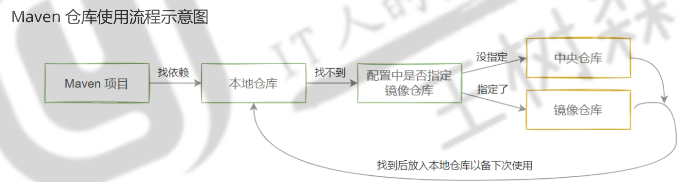

## Maven 主要配置文件

在 maven 中主要的配置文件有三个，分别是全局的 `settings.xml` ，用户的 `settings.xml`，和每个项 目单独的配置文件 `pom.xml`


`全局 settings.xml` 是 maven 的全局配置文件，一般位于  ${maven.home}/conf/settings.xml，即 maven 文件夹下的 conf 中。

`用户 setting.xml` 是 maven 的用户配置文件，一般位于 ${user.home}/.m2/settings.xml，即每 位用户都有一份配置文件。 默认情况下，该目录是不存在的。

` pom.xml` 文件是项目配置文件，一般位于项目根目录下或子目录下


配置优先级从高到低：`pom.xml` > `本地 settings` > `全局 settings`

如果这些文件同时存在，在应用配置时，会合并它们的内容，如果有重复的配置，优先级高的配置会覆盖优 先级低的。


## mvn

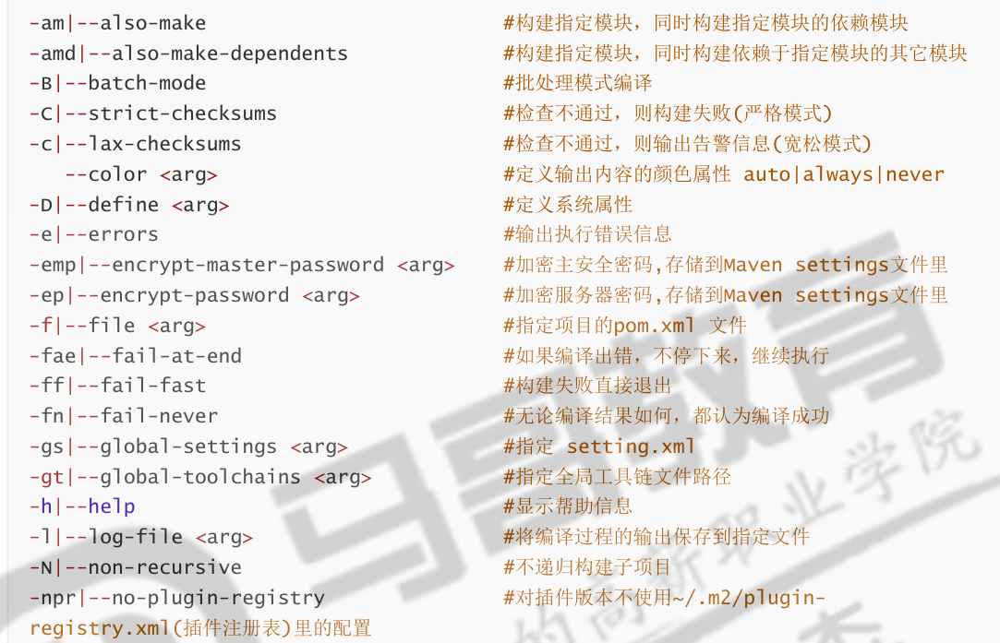

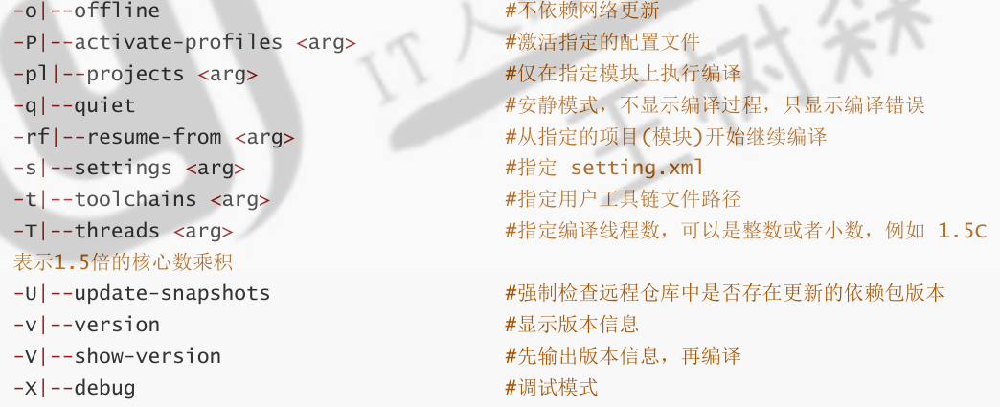

mvn 二级命令

* 全部命令列表 - 中文
    * https://maven.org.cn/plugins/index.html   

* 全部命令列表 - 英文
    * https://maven.apache.org/plugins/index.html   

| 命令                   | 说明                                                        |
| ---------------------- | ----------------------------------------------------------- |
| **clean**              | 清理之前已构建和编译的产物                                  |
| **compile**            | 将源码编译成 `.class` 字节码文件                            |
| **test**               | 运行项目的单元测试                                          |
| **package**            | 将项目打包成 `.war` 包或 `.jar` 包                          |
| **install**            | 将项目打包并安装到本地 Maven 仓库, 以便其他项目可以使用     |
| **deploy**             | 将项目发布到远程仓库，通常是用于发布到公司或公共 Maven 仓库 |
| **dependency:resolve** | 解析并下载项目依赖                                          |
| **dependency:tree**    | 显示项目依赖树                                              |
| **clean install**      | 先清理，再编译安装                                          |

```shell
# 清理，打包，并安装
mvn clean install package

# 清理，打包，并安装，跳过单元测试部份
mvn clean install package -Dmaven.test.skip=true

# 4线程编译
mvn -T 4 clean install package -Dmaven.test.skip=true

# 2倍CPU核心线程数编译
mvn -T 2C clean install package -Dmaven.test.skip=true

# 多线程编译
mvn clean install package -Dmaven.test.skip=true -Dmaven.compile.fork=true

# 构建docker镜像，要在pom.xml中配置
mvn -f mall-gateway clean package dockerfile:build
```

## java项目mvn编译案例

### spring-boot-helloworld

```shell
git clone https://gitee.com/lbtooth/spring-boot-helloworld.git
cd spring-boot-helloworld

.
├── deploy
│   ├── 01-namespace.yaml
│   ├── 02-service.yaml
│   └── 03-deployment.yaml
├── Dockerfile
├── Dockerfile-multistages
├── Jenkinsfile
├── LICENSE
├── pom.xml
├── README.md
├── sonar-project.properties
└── src  # 源码文件
    ├── main
    │   ├── java
    │   │   └── com
    │   │       └── neo
    │   │           ├── Application.java
    │   │           └── controller
    │   │               └── HelloWorldController.java
    │   └── resources
    │       └── application.properties
    └── test  # 单元测试代码
        └── java
            └── com
                └── neo
                    ├── ApplicationTests.java
                    └── controller
                        ├── HelloTests.java
                        └── HelloWorldControlerTests.java
```

编译

```shell
mvn clean package -Dmaven.test.skip=true

# 完成后会多出 target 目录，里面时编译后的结果
target/
├── classes
│   ├── application.properties
│   └── com
│       └── neo
│           ├── Application.class
│           └── controller
│               └── HelloWorldController.class
├── generated-sources
│   └── annotations
├── maven-archiver
│   └── pom.properties
├── maven-status
│   └── maven-compiler-plugin
│       └── compile
│           └── default-compile
│               ├── createdFiles.lst
│               └── inputFiles.lst
├── spring-boot-helloworld-0.3-SNAPSHOT.jar
└── spring-boot-helloworld-0.3-SNAPSHOT.jar.original
```


### RuoYi 公司管理系统

mysql环境

```mysql
create database ruoyi;
create user ruoyier@'10.0.0.%' identified with mysql_native_password  by '123456';
grant all on ruoyi.* to ruoyier@'10.0.0.%';
flush privileges;
```

ruoyi数据库配置修改

```shell
vim RuoYi/ruoyi-admin/src/main/resources/application-druid.yml
```

数据表导入

```sql
use ruoyi;
source /data/codes/RuoYi/sql/quartz.sql;
source /data/codes/RuoYi/sql/ry_20240601.sql;
```

编译

```shell
mvn clean package
```

启动

```shell
java -jar ./ruoyi-admin/target/ruoyi-admin.jar --server.port=9999
```


# 使用 Nexus 构建私有仓库

Nexus 是一个非常流行的开源软件项目，主要用于软件包管理和存储，它最初是由 Sonatype 开发 的，旨在帮助开发人员和组织管理他们的软件构建、依赖关系和存储库，Nexus 主要有两个版本：Nexus  Repository Manager 和 Nexus Firewall

 Nexus Repository Manager 是一个用于管理软件构建和依赖关系的存储库管理器。它支持多种包类 型，包括 Maven、npm、Docker、RubyGems、PyPI 等。

- 包管理：开发人员可以使用 Nexus Repository Manager 来存储、管理和共享各种软件包和构建组 件；
- 代理远程存储库：Nexus 可以代理远程存储库，使您能够在本地缓存外部依赖项，提高构建速度和稳定 性；
- 安全和权限：Nexus 具有丰富的安全功能，可以管理用户访问权限，设置安全策略，保护组织的代码库免 受潜在的安全漏洞；
- 镜像和同步：Nexus 支持镜像和同步功能，让您能够创建多个存储库实例，并确保它们之间的数据同步；


https://www.sonatype.com/ 

```shell
wget https://download.sonatype.com/nexus/3/nexus-3.70.3-01-java11-unix.tar.gz
tar xf nexus-3.70.3-01-java11-unix.tar.gz -C ./nexus/
```

`nexus-3.70.3-01/etc/nexus-default.properties`主配置文件，指定监听的端口号和IP

`nexus-3.70.3-01/bin/nexus.rc`运行身份配置，改为root，会有不推荐提示信息

```shell
# 启动
./nexus-3.70.3-01/bin/nexus start
# nexus 启动时间有些长。1分钟左右才会看到端口
# 端口8081
```

服务脚本

```shell
vim /lib/systemd/system/nexus.service
 [Unit]
 Description=nexus service
 After=network.target
 [Service]
 Type=forking
 LimitNOFILE=65536
 ExecStart=/data/server/nexus/bin/nexus start
 ExecStop=/data/server/nexus/bin/nexus stop
 User=root
 #User=nexus
 Restart=on-abort
 [Install]
 WantedBy=multi-user.target
```

第一次登录，获取密码**/root/nexus/sonatype-work/nexus3/admin.password**


仓库type类型

* proxy           
    * 代理仓，如果 nexus 服务器上没有，则先去 maven 的官方仓库下载回来
*  hosted           
    * 本地仓，如果 nexus 服务器上没有，不会去公网下载，一般存放自己定制的模块文件。 
* group              
    * 多个仓库的集合，仅支持 maven 仓库，yum 和 apt 仓库不能合并 

## 配置使用本地nexus仓库

修改默认的settings.xml 文件

```xml
vim /etc/maven/settings.xml
<mirrors>
 <id>11-maven</id>
    <mirrorOf>*</mirrorOf>
    <name>loong-mvn-repo</name>
    <url>http://10.0.0.11:8081/repository/maven-public/</url>
</mirrors>
```

修改项目的专属pom.xml文件

```xml
<repositories>
    <repository>
        <id>loong-mvn-repo</id>
        <url>http://10.0.0.11:8081/repository/maven-public/</url>
        <releases>
            <enabled>true</enabled>
        </releases>
        <snapshots>
            <enabled>false</enabled>
        </snapshots>
    </repository>
  </repositories>
  <pluginRepositories>
     <pluginRepository>
        <id>loong-mvn-repo</id>
        <url>http://10.0.0.11:8081/repository/maven-public/</url>                               
         <releases>
            <enabled>true</enabled>
        </releases>
        <snapshots>
            <enabled>false</enabled>
        </snapshots>
     </pluginRepository>
  </pluginRepositories>
```

编译

```shell
mvn clean package
```

结果

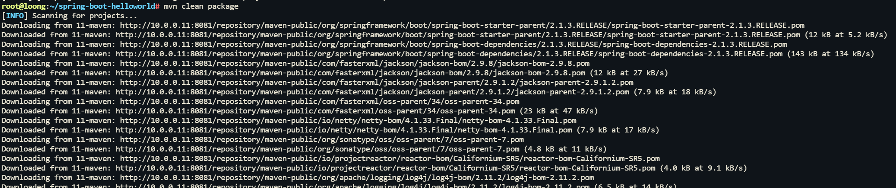

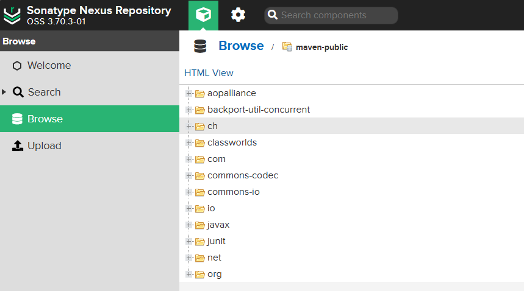

## Nexus 配置 Apt 仓库

```shell
# 创建存储目录
mkdir /blobs
```

添加blob存储

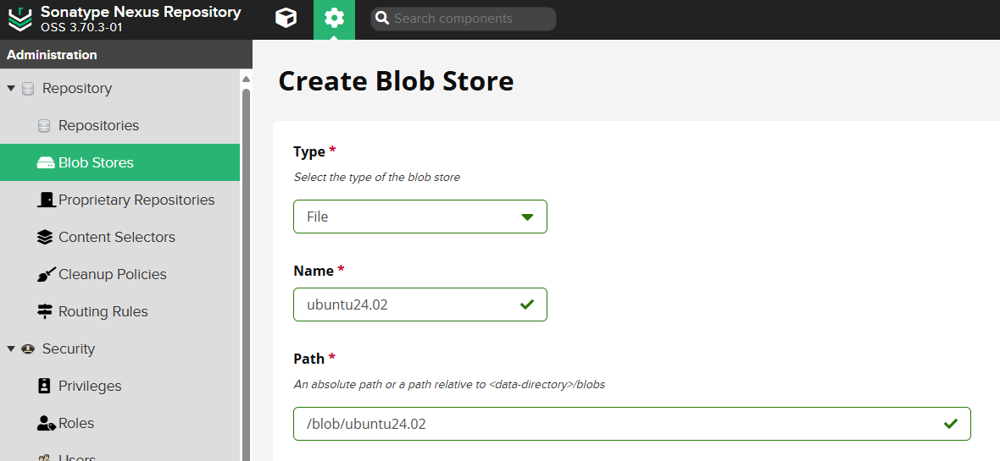

创建同步的源信息

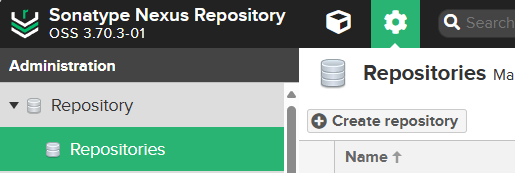

选择`apt(proxy)`，配置信息

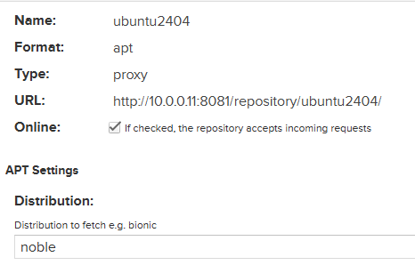

测试

```shell
vim /etc/apt/sources.list.d/ubuntu.sources
Types: deb
URIs: http://10.0.0.11:8081/repository/ubuntu2404/                                                         Suites: noble noble-updates noble-security
Components: main restricted universe multiverse
Signed-By: /usr/share/keyrings/ubuntu-archive-keyring.gpg
```

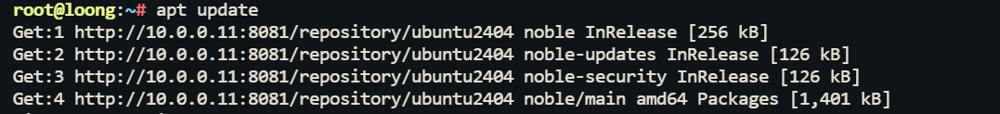

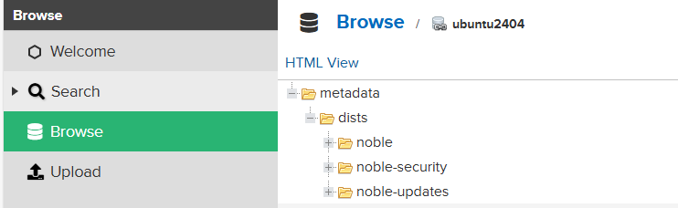

## Nexus 配置 yum 仓库

添加blob存储

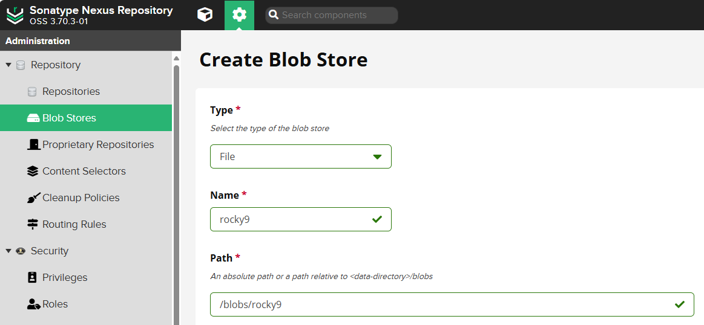

创建同步的源信息

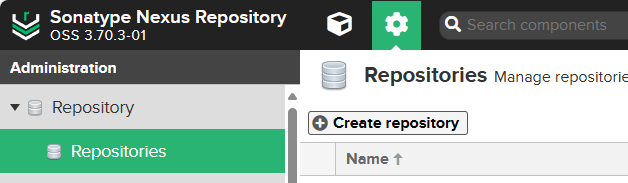

选择`yum(proxy)`，配置信息


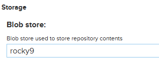

测试

```shell
vim /etc/yum.repos.d/rocky.repo
[loong-repo]
name=Loong's yum repo
baseurl=http://10.0.0.11:8081/repository/Rocky9/$releasever/BaseOS/$basearch/os/   
```


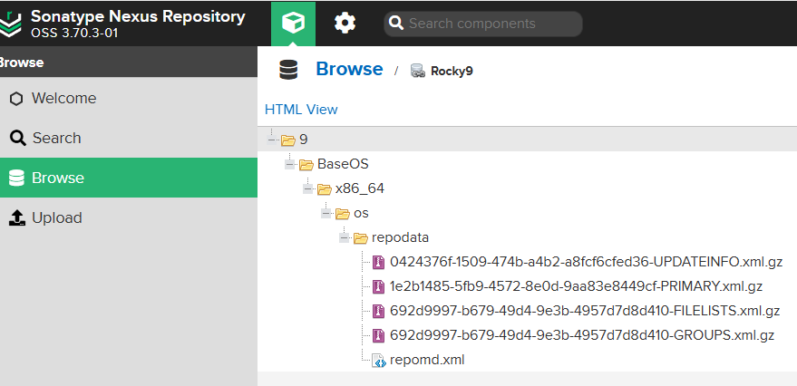
