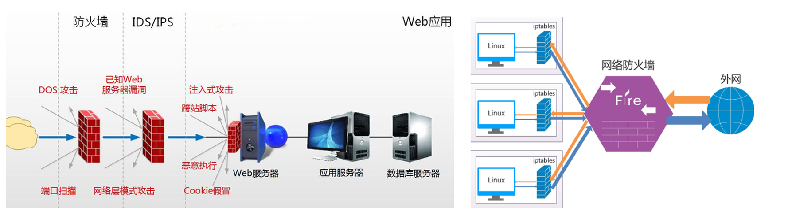

# 网络安全技术

## 入侵检测系统 IDS

**入侵检测系统（Intrusion Detection System，IDS）** 的主要目的是监控网络流量和主机活动，检测潜在的恶意活动或不正常行为，并通过报警的方式通知管理员。IDS 不会主动阻止攻击，而是检测并记录事件，通常 **只提供警报和日志**。

**被动反应**：IDS 不直接阻止或防止攻击，它只是作为一个被动的监控工具，依赖管理员采取进一步行动。


*   **网络入侵检测系统（NIDS）**：部署在网络边界处，监控进入和离开网络的流量。
*   **主机入侵检测系统（HIDS）**：安装在单台主机上，监控该主机的操作系统、应用程序和日志等数据。HIDS 通常不处理网络流量，而是关注主机内部的活动。


总结：统计，分析数据，做出判断。


## 入侵防御系统 IPS

**入侵防御系统（Intrusion Prevention System，IPS）** 是 IDS 的升级版。IPS 不仅可以检测入侵行为，还可以自动采取措施（例如丢弃恶意流量、封锁攻击源）来防止攻击。

**监测与防护**：IPS 不仅像 IDS 一样监测流量，还能实时阻止攻击。它能够根据检测到的攻击采取措施，如阻止恶意流量、封锁攻击源 IP 等。

**主动防御**：IPS 具有主动防御功能，当它检测到攻击时，会立刻采取行动，比如丢弃恶意数据包、隔离受感染的设备，甚至修改路由表。

**部署位置**：IPS 通常部署在网络中的关键位置，尤其是紧接在防火墙之后的位置，这样它可以对所有进出网络的数据流进行实时分析和防御。

可能会误杀正常流量，导致合法用户受到影响。

配置和管理较为复杂，错误配置可能导致系统不稳定。


总结：统计，分析数据，做出判断，做出动作。


## 防火墙 FW ，非军事区 DMZ 和 防水墙 WW

## FW

防火墙系统是在内部网络和外部网络之间，专用网络与公共网络之间，可信网络和不可信网络之间建立屏 障。

它是一种 "隔离"  技术，是在两个网络通讯时执行的一种访问控制尺度，它能允许经你 “同意”的个人 和数据进入你的网络，同时将你 “不同意” 的个人和数据拒之门外，最大限度的阻止非法的流量和数据进入系 统或网络。

同时防火墙也可以根据规则禁止本地网络向外发送数据报文，以及根据规则转发网络流量等。



**分层管控**

防火墙本质上就是通过对网络传输的数据进行特定的管理操作，才能实现数据信息传输的安全管控，根据 我们对数据传输的理解，防火墙可以在数据链路层、网络层、传输层、应用层进行响应的管控操作

*   数据链路层
    *   基于源 MAC、目标 MAC 来指定防火墙的规则
*   网络层
    *   基于源 IP、目标 IP 来指定防火墙的规则
*   传输层
    *   基于源 Port、目标 Port 来指定防火墙的规则
*   应用层
    *   基于数据内容的某些关键字来指定防火墙的规则


经过主机的数据流


**普通服务器**：不会经过 **FORWARD** 链，数据流是 `PREROUTING -> INPUT -> OUTPUT -> POSTROUTING`。

**路由服务器/网关**：会经过 **FORWARD** 链，数据流是 `PREROUTING -> FORWARD -> POSTROUTING`。


## DMZ

**DMZ（Demilitarized Zone，非军事区）** 是网络架构中用于增强安全性的设计理念。它通过将内网和外网之间隔离开来，保护内部系统免受外部攻击，同时允许外部用户访问某些特定的服务或资源。DMZ 通常用于部署对外提供服务的系统，如 Web 服务器、邮件服务器、DNS 服务器等。它的主要作用是充当内网和外网之间的缓冲区，以实现网络安全隔离。

**隔离内网和外网**：DMZ 使得外部网络（如互联网）与内部网络（如公司内部局域网）之间没有直接联系。即使外部攻击者成功攻破 DMZ 中的某个服务，仍然无法直接访问内网。

**暴露必要的服务**：DMZ 允许外部用户访问公司提供的公共服务（如 Web、FTP、邮件等），而不直接暴露内部网络。通过这种方式，组织可以向外部用户提供服务，同时减少潜在风险。

**安全防护**：通过将外部服务放置在 DMZ 中，组织可以增加多重安全防护层级。例如，即使 DMZ 中的一个服务遭到攻击，攻击者也需要突破更多的安全措施才能进入内网。


**外部流量到 DMZ**：防火墙会设置规则，只允许外部流量访问特定服务（如 Web 服务、FTP 服务）。这些流量不能直接访问内网。

**DMZ 到内网的流量**：防火墙会严格控制来自 DMZ 的流量，通常只允许经过认证的流量进入内网。只有必要的通信（例如从 Web 服务器到数据库服务器）被允许通过。

**DMZ 内部的服务隔离**：即便 DMZ 内部有多个服务，它们也应相互隔离，以防止攻击者通过一个服务突破防线后横向攻击其他服务。


**常见部署在 DMZ 中的服务**

-   **Web 服务器**：对外提供网站或 Web 应用服务，用户可以访问公司官网、在线商店等。
-   **邮件服务器**：处理公司与外部的电子邮件通信。
-   **FTP 服务器**：用于文件传输的服务。
-   **DNS 服务器**：为域名解析提供服务。
-   **VPN 网关**：允许外部用户通过 VPN 连接进入公司网络。
-   **Proxy 服务器**：代理外部请求，增加额外的安全层。

## WW

与防火墙相对，防水墙是一种防止内部信息泄漏的安全产品。

它利用透明加解密，身份认证，访问控制和 审计跟踪等技术手段，对涉密信息，重要业务数据和技术专利等敏感信息的存储，传播和处理过程，实施安全 保护；最大限度地防止敏感信息泄漏、被破坏和违规外传，并完整记录涉及敏感信息的操作日志，以便日后审 计。 

与防火墙关注外部流量进入的攻击行为，防水墙主要关注的是内部流量的隐患行为。


# iptabes/netfilter

Netfilter/iptables 是 Linux 平台下的包过滤防火墙系统，由 Netfilter 框架和 iptables 两部分组成，

*   Netfilter
    *   **`netfilter` 是实现数据包过滤和处理的核心框架**，它在内核空间中工作。
    *   `netfilter` 提供了 **多个钩子点**（hooks），允许在数据包处理的不同阶段进行拦截与处理
*   iptables
    *   **`iptables` 是用户空间的命令行工具**，充当了 **用户与内核之间的接口**，用于向 `netfilter` 提交规则和策略。
    *   `iptables` 并不直接处理数据包，它通过用户定义的规则告诉 `netfilter` 如何在钩子点上处理数据包。
    *   **`iptables` 内核模块** 只是 `netfilter` 的一种实现，它定义了规则和操作机制，依赖 `netfilter` 钩子进行实际数据包处理。

## 防火墙工具

*   iptables
    *   虽然不同发行版本的操作系统都是 iptables 命令，但是底层的真正的命令就不再一样了，从 Centos8 之后，就变成了 `xtables-nft-multi`
    *   `xtables-nft-multi` 是一个用于在 Linux 系统中管理 iptables、arptables 和 ebtables  规则的工具集，它基于 `nftables` 的后端来实现。
*   nftables
    *   **`nftables`** 是 `iptables` 的替代方案，统一了 IPv4、IPv6、ARP 和桥接过滤管理。
*   firewalld
    *   Firewalld 提供了支持网络区域（zone）定义网络连接以及接口安全等级的动 态防火墙管理工具。它允许系统管理员在不需要重启防火墙或停止网络服务的情况下，实时更改防火墙规则。
    *   让防火墙的功能操作更加简单
*   ufw
    *   UFW（Uncomplicated Firewall）是一款基于 iptables 的主机级防火墙配置工具。
    *   轻量化配置 iptables 而开发的一款工具。让配置防火墙变得更加简单，同时保 持足够的灵活性以满足一般用户和管理员的需求。


## 原理

### netfilter

`netfilter` 提供了 **多个钩子点**（hooks），允许在数据包处理的不同阶段进行拦截与处理，例如：

| 链名            | 说明                               |
| --------------- | ---------------------------------- |
| **PREROUTING**  | 数据包刚到达时的处理（地址转换等） |
| **INPUT**       | 数据包进入本地系统之前的处理       |
| **FORWARD**     | 数据包需要转发到其他主机时的处理   |
| **OUTPUT**      | 本地主机发出的数据包的处理         |
| **POSTROUTING** | 数据包即将离开本地系统时的处理     |


### iptables 基本结构

`iptables` 提供了 4 个主要表（tables），每个表处理特定的网络功能：

| 表名         | 作用                             | 常用链                                          |
| ------------ | -------------------------------- | ----------------------------------------------- |
| **filter**   | 过滤数据包（默认表）             | INPUT, FORWARD, OUTPUT                          |
| **nat**      | 网络地址转换（NAT）              | PREROUTING, POSTROUTING, OUTPUT                 |
| **mangle**   | 修改数据包内容                   | PREROUTING, INPUT, FORWARD, OUTPUT, POSTROUTING |
| **raw**      | 跳过连接跟踪                     | PREROUTING, OUTPUT                              |
| **security** | 应用安全上下文标记（SELinux 等） | INPUT, FORWARD, OUTPUT                          |

-   **默认表** 是 `filter`，如果没有指定表，iptables 会操作 `filter` 表。


数据包走向

*   数据流入：
    *   PREROUTING --> INPUT
*   数据流出：
    *   OUTPUT --> POSTROUTING
*   数据转发：
    *   PREROUTING --> FORWARD --> POSTROUTING


## 使用

ptables 完整命令由四部份组成

`iptables <Table>  <Chain>  <Rule>`

| **字段**       | **说明**                                                     |
| -------------- | ------------------------------------------------------------ |
| **iptables**   | 防火墙工具，用于配置 Linux 内核的 `netfilter` 框架。         |
| **Table**      | 要操作的表，用 `-t` 参数指定。表类型：`raw`、`mangle`、`nat`、`filter`、`security`。默认是 `filter` 表。 |
| **Chain**      | 要操作的链。链是数据包处理的不同阶段：`PREROUTING`、`INPUT`、`FORWARD`、`OUTPUT`、`POSTROUTING`。 |
| **Rule**       | 数据包匹配规则，由 **匹配条件** 和 **目标** 组成。如果满足匹配条件，就执行目标指定的操作。 |
| **匹配条件**   | 定义规则触发的条件，如源 IP 地址、目标端口、协议等。例如：`-p tcp --dport 22`。 |
| **目标（-j）** | 指定匹配条件满足时执行的操作。常见目标包括：`ACCEPT`、`DROP`、`REJECT`、`SNAT`、`DNAT`、`LOG` 等。 |

### 基础命令

```shell
默认显示 filter 过滤表
iptables -vnL
iptables -t raw -vnL

# v 详细信息
# n 数字 ip 与端口
# L 显示规则条目
# --line-numbers 显示规则的标号

# 命令格式显示
iptables -S

# 规则保存
iptables-save > iptables.rules

# 规则加载
iptables-restore < iptables.rules

# 清除所有规则
iptables -F [chain]
# 清除 user-defined chain
iptables -X [chain] 

#  指定规则编号或规则删除
iptables -D chain rulenum
iptables -D INPUT 4
iptables -D chain rule
iptables -D INPUT -s 10.0.0.11 -j DROP

# 清除规则计数
iptables -Z [chain [rulenum]]

# 操作具体规则
-A # 将规则追加到指定链的末尾。
iptables -A INPUT -p tcp --dport 22 -j ACCEPT

-I # 将规则插入到指定链的指定位置，默认是第一条。
iptables -I INPUT 1 -p tcp --dport 22 -j ACCEPT

-C # 检查某条规则是否存在。
iptables -C INPUT -p tcp --dport 22 -j ACCEPT

-R # 替换指定位置的规则。
iptables -R INPUT 2 -p tcp --dport 80 -j ACCEPT

-P # 设置链的默认行为。
iptables -P INPUT DROP

-E # 重命名自定义链。
iptables -E old_chain_name new_chain_name
```


显示规则字段说明


### target 目标，处理动作

内置目标是 `iptables` 自带的核心操作，常用于直接控制数据包的处理流程。

| **目标**   | **作用**                                                     |
| ---------- | ------------------------------------------------------------ |
| **ACCEPT** | 允许数据包通过，不再匹配后续规则。                           |
| **DROP**   | 丢弃数据包，不做任何响应。                                   |
| **REJECT** | 拒绝数据包，并返回一个错误响应给发送方（如 `ICMP port-unreachable`）。 |
| **LOG**    | 将数据包信息记录到系统日志，但不影响数据包的继续处理。       |
| **QUEUE**  | 将数据包发送到用户空间供应用程序处理。                       |
| **RETURN** | 停止当前链的规则匹配，返回到调用此链的上一级链继续处理。     |

```shell
# LOG 是 iptables 的一种特殊目标，用于将匹配的数据包相关信息记录到系统日志（通常是 /var/log/messages 或 /var/log/syslog）中。
iptables -A INPUT -p tcp --dport 22 -j LOG --log-prefix "SSH ATTEMPT: "

# 将匹配的数据包的 IP 选项字段记录到日志中。
iptables -A INPUT -p tcp --dport 22 -j LOG --log-ip-options

# 将 HTTP 请求的 TCP 选项记录到日志中。
iptables -A INPUT -p tcp --dport 80 -j LOG --log-tcp-options
```

NAT 和地址转换目标

| **目标**       | **作用**                                                     |
| -------------- | ------------------------------------------------------------ |
| **SNAT**       | 修改数据包的源地址（Source NAT）。通常用于内网设备访问外网时进行地址转换。 |
| **DNAT**       | 修改数据包的目标地址（Destination NAT）。常用于端口转发或负载均衡。 |
| **MASQUERADE** | 动态的 SNAT，常用于公网动态 IP 场景，自动使用接口的 IP 作为源地址。 |
| **REDIRECT**   | 将数据包重定向到本地的某个端口。通常用于透明代理或端口劫持。 |


这些目标通常用于标记流量或与安全模块（如 SELinux）结合使用。

| **目标**     | **作用**                                                     |
| ------------ | ------------------------------------------------------------ |
| **MARK**     | 给数据包打标记（mark），用于 QoS 或其他规则的进一步处理。    |
| **CONNMARK** | 给连接打标记，适用于连接跟踪模块（conntrack）。              |
| **SECMARK**  | 为数据包应用安全标记（security context），配合 SELinux 使用。 |


### 规则策略（匹配条件）

iptables 防火墙中的规则，在生效时会按照顺序，从上往下生效，当前一条规则命中后，不再继续往下 匹配。

如果多条规则里面，匹配条件中有交集，或者有包含关系，则这些规则，要注意前后顺序，

范围小的，需要精确匹配的，要往前放，

范围大的，往后放，

负责兜底的，放在最后。


如果多条规则里面，匹配条件没有交集，彼此不会互相影响，则无所谓前后顺序，

但是从效率上来讲，更 **容易命中** 的要放在前面


#### IP

```shell
源 IP 匹配
iptables -A INPUT -s 192.168.1.1 -j ACCEPT

# 目标 IP 匹配
iptables -A OUTPUT -d 10.0.0.1 -j ACCEPT

# 多 IP 匹配
iptables -A INPUT -s 192.168.1.1,192.168.1.2 -j DROP

# 取反，网段匹配
iptables -A INPUT ! -s 192.168.1.0/24 -j DROP

# IP 范围，iprange 扩展模块实现
iptables -t filter -A INPUT -m iprange --src-range 10.0.0.13-10.0.0.99 -p tcp --dport 80 -j REJECT
```


#### protocol

支持 `tcp`、`udp`、`icmp`、`all`（所有协议）等。

```shell
accept 22 端口 tcp
iptables -A INPUT -p tcp --dport 22 -j ACCEPT

# 取反
iptables -A INPUT ! -p tcp -j DROP
```


#### 网卡

`-i` 用于匹配数据包进入的网络接口（网卡）。

通常用于 **INPUT** 链和 **FORWARD** 链。

```shell
允许通过网卡 eth0 接收的数据包。
iptables -A INPUT -i eth0 -j ACCEPT

# 丢弃所有不是从 wlan0 接口接收的流量。
iptables -A INPUT ! -i wlan0 -j DROP
```

`-o` 用于匹配数据包发送的网络接口（网卡）。

通常用于 **OUTPUT** 链和 **FORWARD** 链。

```shell
允许从网卡 eth0 发出的数据包。
iptables -A OUTPUT -o eth0 -j ACCEPT

# 丢弃所有不是从 eth0 接口发出的流量。
iptables -A OUTPUT ! -o eth0 -j DROP
```

### 扩展匹配条件

**扩展匹配条件** 需要加载扩展模块才能使用

```shell
dpkg -L iptables | grep libxt_.*.so
/usr/lib/x86_64-linux-gnu/xtables/libxt_AUDIT.so
/usr/lib/x86_64-linux-gnu/xtables/libxt_CHECKSUM.so
/usr/lib/x86_64-linux-gnu/xtables/libxt_CLASSIFY.so
/usr/lib/x86_64-linux-gnu/xtables/libxt_CONNMARK.so
/usr/lib/x86_64-linux-gnu/xtables/libxt_CONNSECMARK.so
...
```

扩展匹配条件分为隐式扩展和显示扩展两种

*   显示扩展
    *   显示扩展即必须使用 `-m` 选项指明要调用的扩展模块名称，需要手动加载扩展模块。
*   隐式扩展
    *   iptables 在使用 -p 选项指明了特定的协议时，无需再用 -m 选项指明扩展模块的扩展机制，不需要 手动加载扩展模块，不需要用 -m 显式指定的扩展，即隐式扩展。
    *   tcp，upd，icmp 这三个协议是可以用  -m 指定的模块，同时，也可以在基本匹配里面用 -p 来指定这 几个协议

```shell
root@loong:~# dpkg -L iptables | grep tcp.so
/usr/lib/x86_64-linux-gnu/xtables/libxt_tcp.so
root@loong:~# dpkg -L iptables | grep udp.so
/usr/lib/x86_64-linux-gnu/xtables/libxt_udp.so
root@loong:~# dpkg -L iptables | grep icmp.so
/usr/lib/x86_64-linux-gnu/xtables/libipt_icmp.so
# 隐式模块，因为它们的协议名和模块名是一样的。
```

#### port 端口

TCP/UDP

```shell
源端口
iptables -A INPUT -p tcp --sport 443 -j ACCEPT

# 目标端口
iptables -A INPUT -p tcp --dport 22 -j ACCEPT

# 源端口和目标端口
iptables -A INPUT -p tcp --ports 22 -j ACCEPT

# 端口范围
iptables -A INPUT -p tcp --sport 1024:65535 -j ACCEPT

# 多端口, 最多匹配 15 个端口
iptables -A INPUT -p tcp -m multiport --dport 80,443 -j ACCEPT

# 多端口+端口范围
iptables -A INPUT -p tcp -m multiport --dports 22,80,1000:2000 -j ACCEPT

# 取反
iptables -A INPUT -p udp ! --sport 53 -j DROP
```

#### flags TCP 报文的标志位

```shell
匹配 TCP 报文的标志位
# SYN：表示请求建立连接（同步）。
# ACK：表示确认。
# FIN：表示结束连接。
# RST：表示重置连接。

# 允许包含 SYN 标志且不包含 ACK、FIN、RST 的数据包（即新连接的请求）。
iptables -A INPUT -p tcp --tcp-flags SYN,ACK,FIN,RST SYN -j ACCEPT

# 匹配 SYN 报文（新连接请求），ACK、FIN、RST 标志必须未设置。
iptables -A INPUT -p tcp --syn -j ACCEPT
```

#### icmp （Ping）

```shell
拒绝 ICMP 的请求包
iptables -A INPUT -p icmp --icmp-type 8 -j REJECT
# 8 代表 ICMP 协议中的 回显请求，即发出去 ping 请求包。
# 0 代表 ICMP 协议中的 回显应答，即返回的 ping 应答包。
```

#### MAC

mac 模块可以指明源 MAC 地址，适用于：PREROUTING, FORWARD，INPUT chains

```shell
iptables -t filter -A INPUT -d 10.0.0.110 -m mac --mac-source 00:0c:29:b1:f4:54 -j ACCEPT
```

####  string 扩展

对报文中的应用层数据做字符串模式匹配检测

注意：因为是基于内容的方式实现的信息过滤，所以，它的效率是很差的。


8 字节前导信息： 用于同步接收方的时钟与发送方的时钟，确保数据的准确接收。 

6 字节目标mac地址：标识数据帧的接收方。 

6 字节源mac地址：标识数据帧的发送方。 

2 字节数据类型|长度：表示数据帧的类型或有效数据的长度。

 ... 

也就是说，真正获取到应用数据是 从 62字节的位置开始的。

``` shell
--algo {bm|kmp}						# 过滤算法，bm 默认算法，匹配效率高，适用于较长字符串的匹配。
--from offset						# 开始偏移量，用于跳过数据包的部分头部。
--to offset							# 结束偏移量，限制检查范围。
[!] --string pattern				# 匹配数据包中包含的字符串内容，默认大小写敏感。
[!] --hex-string pattern 			# 匹配数据包中包含的十六进制字符串，用于匹配非文本数据或二进制协议内容。
```


``` shell
# 允许包含特定 HTTP 请求的流量
iptables -A INPUT -m string --string "GET /index.html" --algo bm -j ACCEPT

# 屏蔽包含特定恶意内容的流量
iptables -A INPUT -m string --string "malware" -j DROP

# 设置出口规则，在返回的数据包中，跳过前 62 字节的报文头，如果内容中出现 baidu，则拒绝返回
iptables -t filter -A OUTPUT -m string --algo kmp --from 62 --string "baidu" -j REJECT
```

#### time 扩展

根据将报文到达的时间与指定的时间范围进行匹配，此扩展中**默认使用UTC时间**，所以使用时，要根 据当前时区进行计算。

``` shell
# 规则在 2024 年 1 月 1 日到 2024 年 1 月 31 日期间生效。
iptables -A INPUT -m time --datestart 2024-01-01 --datestop 2024-01-31 -j ACCEPT

# 规则在 2024 年 1 月 1 日的 08:00 到 18:00 生效。
iptables -A INPUT -m time --datestart 2024-01-01T08:00:00 --datestop 2024-01-01T18:00:00 -j ACCEPT

# 规则每天从 08:00 到 18:00 生效。
iptables -A INPUT -m time --timestart 08:00 --timestop 18:00 -j ACCEPT

# 规则在每月的 1 日、15 日和 31 日生效。
iptables -A INPUT -m time --monthdays 1,15,31 -j ACCEPT

# 规则在周一和周五生效。
iptables -A INPUT -m time --weekdays Mon, Fri -j ACCEPT
```


#### connlimit 扩展

根据每客户端IP做并发连接数数量匹配，可防止 Dos(Denial of Service，拒绝服务)攻击


``` shell
# 允许每个源 IP 地址最多建立 10 个到 TCP 80 端口的连接。
iptables -A INPUT -p tcp --dport 80 -m connlimit --connlimit-upto 10 -j ACCEPT

# 丢弃每个源 IP 地址到 TCP 80 端口的超过 10 个的连接。
iptables -A INPUT -p tcp --dport 80 -m connlimit --connlimit-above 10 -j DROP

# 对同一个 /24 子网（如 192.168.1.0/24）的所有 IP 地址，总连接数超过 50 时丢弃流量。
iptables -A INPUT -p tcp --dport 80 -m connlimit --connlimit-above 50 --connlimit-mask 24 -j DROP
```

#### limit 扩展

`limit` 扩展模块主要用于控制数据包的匹配速率，以实现**限流**功能。它可以限制规则的触发频率，避免规则对大量数据包频繁触发，从而控制流量或防止滥用。

``` shell
# 每秒最多允许 1 个 ICMP Ping 请求。
iptables -A INPUT -p icmp --icmp-type echo-request -m limit --limit 1/sec -j ACCEPT


# 每分钟允许最多 3 个新的 SSH 连接，但在速率限制生效前可以额外处理 10 个连接。
# 一旦突发限制被耗尽，后续匹配将受到速率限制。
iptables -A INPUT -p tcp --dport 22 -m limit --limit 3/min --limit-burst 10 -j ACCEPT
```

#### state 扩展

以下是 `state` 扩展支持的连接状态

| **状态**          | **含义**                                                     |
| ----------------- | ------------------------------------------------------------ |
| **`NEW`**         | 数据包属于新建连接的第一个数据包，尚未被连接跟踪模块标记为已建立。 |
| **`ESTABLISHED`** | 数据包属于已建立的连接（即连接已经通过 SYN/ACK 确认），或是已有跟踪记录的连接中的后续数据包。 |
| **`RELATED`**     | 数据包与已建立连接相关，例如 FTP 数据连接（与控制连接相关）或 ICMP 错误消息。 |
| **`INVALID`**     | 数据包无法被连接跟踪模块识别或不属于任何已知连接，通常表示异常或错误的数据包。 |

``` shell
# 允许新建 SSH 连接（TCP 22 端口）。
iptables -A INPUT -m state --state NEW -p tcp --dport 22 -j ACCEPT

# 允许所有已建立连接的数据包通过。
iptables -A INPUT -m state --state ESTABLISHED -j ACCEPT

# 允许与当前连接相关的数据包，例如 FTP 数据连接。
iptables -A INPUT -m state --state RELATED -j ACCEPT

# 丢弃所有状态无效的数据包。
iptables -A INPUT -m state --state INVALID -j DROP
```

在较新的 `iptables` 版本中，`state` 模块被 **`conntrack` 模块**替代。

`conntrack` 提供了更强大的功能，推荐使用 `-m conntrack --ctstate` 代替 `-m state --state`。

``` shell
iptables -A INPUT -m conntrack --ctstate ESTABLISHED, RELATED -j ACCEPT
iptables -A INPUT -m conntrack --ctstate INVALID -j DROP
iptables -A INPUT -p tcp --dport 22 -m conntrack --ctstate NEW -j ACCEPT
```


``` shell
# 启用连接跟踪机制之后，连接状态是记录在文件中的
cat /proc/net/nf_conntrack
ipv4     
1 2 icmp 29 src = 10.0.0.13 dst = 10.0.0.12 type = 8 code = 0 id = 4398 mark = 0 zone = 0 use = 2

# 29 无后续包进入时无效的秒数，如果 29 秒之内没有数据包再来，这条记录就丢弃。
```

当我们发现，将某个wget连接断开后，再重新wget的时候，提示之前的连接还在，原因就是上面的原 因，这个连接的信息会在这里维持30秒。超过30秒后，该记录被清理掉，后面再创建相同的连接，就可以正常 连接了。 

30s的来源：每秒发送1次测试包，连续29次检测异常，那就是30个包的时间。

``` shell
# 内核参数，保存多少追踪的记录
cat /proc/sys/net/netfilter/nf_conntrack_max
65536

# 连接数超过了可跟踪记录的最大值，报文被抛弃

# 追踪时长
ls /proc/sys/net/netfilter/*_timeout_*

# 己追踪的连接数量
cat  /proc/sys/net/netfilter/nf_conntrack_count
```

追踪链接表满了，怎么办

*   加大连接限制
    *   /etc/sysctl.conf中设定
        *   net.nf_conntrack_max = 393216 
        *   net.netfilter.nf_conntrack_max = 393216
*   降低 nf_conntrack timeout时间
    *   /etc/sysctl.conf中设定
        *    net.netfilter.nf_conntrack_tcp_timeout_established = 300 
        *   net.netfilter.nf_conntrack_tcp_timeout_time_wait = 120 
        *   net.netfilter.nf_conntrack_tcp_timeout_close_wait = 60 
        *   net.netfilter.nf_conntrack_tcp_timeout_fin_wait = 120

## 开机规则导入

```shell
# 要有执行权限
# /etc/rc.d/rc.local
vim /etc/rc.local
iptables-restore < /root/iptables.rules

sudo chmod +x /etc/rc.local
sudo systemctl enable rc-local.service
```

# NAT

**NAT (Network Address Translation)** 是一种在路由器或防火墙等设备上使用的技术，用于在私有网络与公共网络（如互联网）之间进行IP地址转换。NAT可以隐藏私有IP地址并将其转换为公共IP地址，从而保护内部网络，并有效地解决IPv4地址匮乏的问题。


## **NAT的工作原理**

NAT的基本思想是通过修改IP包的源地址或目标地址，使得私有网络中的多个设备共享一个公共IP地址访问外部网络。NAT设备（通常是路由器或防火墙）会保持一个地址转换表，将私有IP地址与公共IP地址的映射关系记录下来，从而在数据包往返时进行相应的转换。


## **NAT的类型**

*   **静态NAT (Static NAT)**：
    *   在静态NAT中，内部设备的私有IP地址与公共IP地址之间存在固定的映射关系。
*   **动态NAT (Dynamic NAT)**：
    *   动态NAT将内部设备的私有IP地址映射到池中的公共IP地址之一。池中的公共IP地址是动态分配的，这意味着每次内部设备访问外部网络时，可能会使用不同的公共IP地址。
    *   映射是临时的，某些长期连接可能会被中断。
*   **端口地址转换 (PAT) 或叫做NAT Overloading**：
    *   PAT是一种常见的NAT实现方式，它允许多个内部设备共享一个公共IP地址。PAT通过在公共IP地址的基础上使用不同的端口号来区分多个内部设备的连接。也称为“端口复用”或“地址池复用”。


## **NAT 如何避免回程流量混淆**

**源端口重写（Port Overloading）**：

-   当 NAT 设备对多个主机的连接进行转换时，如果两个主机使用了相同的源端口访问相同的目标 IP 和端口，NAT 会将它们的源端口分别重新分配为唯一的端口。
-   这样，在转换后的五元组（源 IP、源端口、目标 IP、目标端口、协议）中，**源端口始终唯一**，确保回程流量能够正确匹配到连接。

**例子**：

-   主机 A 和主机 B 都访问 `8.8.8.8:80`：
    -   主机 A 的五元组：
        -   原始：`192.168.1.100:12345 -> 8.8.8.8:80`
        -   NAT 后：`203.0.113.1:40001 -> 8.8.8.8:80`
    -   主机 B 的五元组：
        -   原始：`192.168.1.101:12345 -> 8.8.8.8:80`
        -   NAT 后：`203.0.113.1:40002 -> 8.8.8.8:80`
-   当回程流量到达 NAT：
    -   数据包 `8.8.8.8:80 -> 203.0.113.1:40001` 被还原为 `8.8.8.8:80 -> 192.168.1.100:12345`。
    -   数据包 `8.8.8.8:80 -> 203.0.113.1:40002` 被还原为 `8.8.8.8:80 -> 192.168.1.101:12345`。


SNAT时将源端口固定会**出现冲突**

```shell
iptables -t nat -A POSTROUTING 1 -s 10.0.0.0/24 ! -d 10.0.0.0/24 -o ens37 -p tcp --dport 80 -j SNAT --to-source 192.168.8.13:12345
```

**不推荐**在`--to-source`的IP后加上端口

原因：

*   将所有匹配的数据包的源端口强制转换为 `12345`。
*   如果有多个主机或应用程序同时从 `10.0.0.0/24` 访问外部 HTTP 服务（`TCP:80`），所有的流量都会映射到 `192.168.8.13:12345`。
*   因为 TCP 会话需要源 IP 和源端口的组合来区分不同的连接，这种做法会导致源端口冲突，进而导致通信失败或连接中断。


## SNAT 源IP地址转换

### SNAT

数据包转发的能力

```shell
sysctl -w "net.ipv4.ip_forward = 1"
sysctl -a | grep ip_forward
```

SNAT：Source NAT，源地址转换，基于nat表，工作在 POSTROUTING 链上。

将经过当前主机转发的请求报文的源IP地址转换成根据防火墙规则指定的IP地址。

```shell
iptables -t nat -A POSTROUTING -s 10.0.0.0/24 ! -d 10.0.0.0/24 -j SNAT --to-source 192.168.8.13

iptables -t nat -R POSTROUTING 1 -s 10.0.0.0/24 ! -d 10.0.0.0/24 -o ens37  -j SNAT --to-source 192.168.8.123-192.168.8.125

```

### MASQUERADE

数据包转发的能力

```shell
sysctl -w "net.ipv4.ip_forward = 1"
sysctl -a | grep ip_forward
```

MASOUERADE 可以从主机网卡上自动获取IP 地址当作出口IP地址。

更适合于 **动态 IP 地址**（即经常变化的 IP 地址），而 `SNAT` 一般用于静态 IP 地址场景。

```
iptables -t nat -R POSTROUTING 1 -s 10.0.0.0/24 ! -d 10.0.0.0/24 -j MASQUERADE
```


## DNAT 目的IP地址转换

数据包转发的能力

```shell
sysctl -w "net.ipv4.ip_forward = 1"
sysctl -a | grep ip_forward
```

DNAT：Destination NAT，目标地址转换，基于nat表，工作在 PREROUTING 链上。

```shell
iptables -t nat -A PREROUTING -d 10.0.0.13 -p tcp --dport 8080 -j DNAT --to-destination 192.168.8.14
```

## REDIRECT

**NAT 的本地重定向** 功能

**`iptables` 的 `REDIRECT` 目标动作** 的设计目的就是将流量重定向到本机（localhost）处理。将**流量劫持**到本地（宿主机）进行处理。

REDIRECT 的作用是将目标 IP **强制重定向到本地主机**（`localhost`）的某个端口，从而改变流量的最终目的地。

只能重定向到 **本地地址**（`localhost`），无法将流量重定向到其他主机。


**用途**：

-   创建透明代理服务器。
-   HTTP/HTTPS 流量劫持。
-   本地端口映射和服务转发。


**作用链**：通常用于 **PREROUTING** 链或 **OUTPUT** 链。

**REDIRECT 只能在 NAT 表中使用**


**PREROUTING 链**：

处理所有进入主机的流量，在路由决策之前劫持流量。

**常见用途**：

-   流量劫持：将外部请求转发到本地服务。
-   透明代理：拦截外部流量并转发到代理服务器。

```shell
iptables -t nat -A PREROUTING -p tcp --dport 80 -j REDIRECT --to-port 8080
```


**OUTPUT 链**：

处理本机发出的流量，在流量离开主机之前劫持它。

**常见用途**：

-   本地端口映射：将本地主机的目标端口请求重定向到另一个本地端口。

```shell
iptables -t nat -A OUTPUT -p tcp --dport 80 -j REDIRECT --to-port 8080
```


# FORWARD转发

**FORWARD** 链：处理转发的数据包（既不是发送到本机的，也不是从本机发出的，而是通过本机转发的）。

```shell
sysctl -w net.ipv4.ip_forward=1

# 拒绝所有喜欢发
iptables -A FORWARD -j REJECT

# 追加，允许内网新连接转发
iptables -I FORWARD 1 -s 192.168.8.0/24 ! -d 192.168.8.0/24 -m state --state NEW -j ACCEPT
```

# 自定义链

```shell
# 添加自定义链
iptables -t filter -N web_chain

# 修改自定义链名字
iptables -t filter -E web_chain WEB_CHAIN

# 自定义链加规则
iptables -t filter -A WEB_CHAIN -p tcp -m multiport --dports 80,443 -j ACCEPT

# 自定义链关联默认链
iptables -t filter -A INPUT -j WEB_CHAIN

# 删除自定义链，自定义链中还有规则，无法删除
iptables -t filter -F WEB_CHAIN
iptables -t filter -X WEB_CHAIN
```

# firewalld 

## 图形化

需要有图形系统

```shell
yum install epel-release
yum install xorg-x11-xauth xorg-x11-fonts-* xorg-x11-fonts Type1

yum install -y firewall-config
# export DISPLAY=10.0.0.1:0.0
firewall-config 
```

## firewall-cmd 工具

```shell
firewall-cmd --state
firewall-cmd --check-config

# 默认zone
firewall-cmd --get-default-zone
firewall-cmd --get-zones

# 显示当前默认的zone中的 service
firewall-cmd --list-services
firewall-cmd --zone=public --list-services

firewall-cmd --get-active-zones

firewall-cmd --zone=0-zone-test --list-services

......
```

