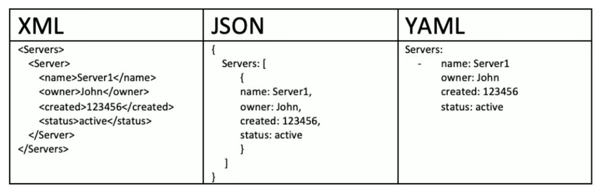

# Ansible 简介

Ansible 是一个开源的基于Python语言实现自动化工具，用于配置管理、应用部署、任务执行以及多台机器间的协调操作。

Ansible 主要通过 SSH 或 Windows 的 WinRM 协议与目标主机进行通信，不需要在目标主机上安装任何代理。


**常见用途**

1.  **配置管理**：自动化系统配置，例如管理用户、安装软件、配置服务等。
2.  **应用部署**：自动化软件的部署与更新。
3.  **多节点协调操作**：自动化执行跨多个主机的任务，适用于大规模集群管理。
4.  **基础设施即代码**：通过代码管理和配置基础设施，可以与 DevOps 流程相结合。


**Ansible 的核心概念**

1.  **Playbook**：Playbook 是 Ansible 的配置文件，采用 YAML 格式。它定义了一组任务，指定在哪些主机上执行，并规定执行这些任务时所需的具体操作步骤。

    示例 Playbook：

    ```yaml
    - name: Install and start Apache web server
      hosts: webservers
      tasks:
        - name: Install httpd
          yum:
            name: httpd
            state: present
        - name: Start httpd service
          service:
            name: httpd
            state: started
            enabled: yes
    ```

2.  **Inventory**：Inventory 文件是用于定义和管理 Ansible 所管理的主机的列表。可以是一个简单的文本文件，列出主机名或 IP 地址，或者是一个动态生成的文件或脚本。

    示例 Inventory 文件：

    ```csharp
    [webservers]
    web1.example.com
    web2.example.com
    ```

3.  **模块**：Ansible 的模块是实现任务的具体工具。每个任务都是通过一个模块来执行的。例如，`yum` 模块用于安装软件包，`copy` 模块用于拷贝文件等。

4.  **任务**：任务是 Playbook 中的一部分，描述了要在目标主机上执行的具体操作。每个任务都是一个模块调用，并且通常包括模块参数。

5.  **角色（Roles）**：角色是一个组织 Playbook 和其他文件的方式，允许你以逻辑方式将任务、处理、模板、文件等分开，使得 Playbook 更加模块化和可重用。

6.  **Handler**：Handler 是一种特殊的任务，当某个任务改变了系统状态时，通知并执行一个操作。通常用于重新启动服务等。


**工作流程**

1.   用户基于命令或者playbook方式，向ansible的控制端发起用户请求 
2.   ansible根据用户请求目标，到控制端的主机列表中验证目标是否存在 
3.   若目标主机存在，然后基于连接插件与被控端处于连接状态 
4.   根据用户请求指令，结合相应的功能模块，指定目标主机执行相应的功能 
5.   目标主机执行完毕后，会将相应的状态结果返回给控制端。 
6.   控制端在处理过程中，还会通过插件工具实现日志、邮件等辅助功能


# 软件部署

通用环境需求

*   ansible的服务端和客户端基于ssh协议进行通信，所以必须提前准备ssh环境

控制端专用需求

*   控制端支持类unix系统，不支持Windows系统 

*   需要python支持，提前准备python2.7+或者python3.5+的环境

被控端专用需求

*   一般功能无需部署额外python环境，linux自带python。如果涉及到Python业务的话，必须配置相应的Python环境
    *   被控端Python版本小于2.4，需要安装python-simplejson
    *   被控端如开启SELinux需要安装libselinux-python
    *   windows 只能做为被控制端


安装方式

*   官方软件源

*   源码方式

*   Git方式

*   Pip方式


## 二进制安装

```shell
apt update
#  PPA（个人软件包档案）相关的工具。
apt install -y software-properties-common

# ansible的专用软件源
add-apt-repository --yes --update ppa:ansible/ansible

apt install -y ansible
ansible --version
ansible [core 2.17.7]
# 不安装ansible的专用软件源，使用默认的软件源的话，ansible的软件版本是 2.16.3
```


```shell
yum install epel-release
yum install ansible
ansible --version
ansible [core 2.14.17]
```

## pip安装

需要python虚拟环境

```shell
# 准备pip环境
apt install python3 python3-venv python3-pip -y

# 创建虚拟环境
mkdir ansible_env && cd ansible_env
python3 -m venv ansisble_venv

# 加载虚拟环境
source ansisble_venv/bin/activate

# pip安装
pip3 install -i https://pypi.tuna.tsinghua.edu.cn/simple  ansible

ansible --version
2.18.1

# 退出虚拟环境
deactivate
```

## git

```shell
git clone https://github.com/ansible/ansible.git
cd ./ansible

source ./hacking/env-setup

yum install python3 python3-venv python3-pip -y
python3 -m pip install --user -r ./requirements.txt

ansible --version
ansible [core 2.19.0.dev0]
```

# 配置文件

```shell
/etc/ansible/
├── ansible.cfg
├── hosts
└── roles
```

## ansible.cfg - 配置文件

`ansible.cfg` 是 Ansible 的主要配置文件，里面包含了 Ansible 运行时的各种参数和设置。它用于定制 Ansible 的行为，覆盖默认配置。

官方配置模板

[ansible/examples/ansible.cfg at stable-2.9 · ansible/ansible · GitHub](https://github.com/ansible/ansible/blob/stable-2.9/examples/ansible.cfg)

**常见的配置项：**

-   inventory: 指定主机清单文件的位置。

    ```ini
    inventory = /etc/ansible/hosts
    ```

-   remote_user: 设置默认的远程登录用户。

    ```ini
    remote_user = user_name
    ```

-   private_key_file: 指定私钥文件路径，用于 SSH 登录。

    ```ini
    private_key_file = /path/to/private_key
    ```

-   host_key_checking: 是否检查远程主机的 SSH 密钥。

    ```ini
    host_key_checking = False
    ```

-   roles_path: 设置角色目录的路径（默认为 ./roles）。

    ```ini
    roles_path = /etc/ansible/roles
    ```

这个文件有助于定制 Ansible 在每次运行时的行为。你可以在这里设置连接方式、日志记录、缓存和插件等。


**初始化主配置文件**

```shell
ansible-config init --help
ansible-config init -t all --disabled > /etc/ansible/ansible.cfg
```


##  hosts - 主机清单文件（Inventory）

`hosts` 文件是一个文本文件，列出了 Ansible 需要管理的主机或主机组。你可以在此文件中定义要连接的主机，并将它们组织成不同的组，以便灵活管理。

格式：

-   **组**：主机可以分配到组中，组名后面跟着该组内的主机。
-   **单个主机**：每一行是一个主机，主机名后面可以加上 IP 地址或 FQDN（完全限定域名）。
-   **组和主机混合**：多个组和主机可以共存。

**示例：**

```ini
# 单个主机
webserver1 ansible_host=192.168.1.10
webserver2 ansible_host=192.168.1.11

# 主机组
[webservers]
webserver1
webserver2

[databases]
db1 ansible_host=192.168.1.20
db2 ansible_host=192.168.1.21
```

**访问示例：**

通过 `hosts` 文件，Ansible 可以指定对特定主机组的操作。例如，执行针对 `webservers` 组的操作：

```shell
ansible webservers -m ping
```

**高级功能：**

-   **变量**：在主机清单中，你可以为不同的主机或主机组设置变量。

    ```ini
    [webservers]
    webserver1 ansible_host=192.168.1.10
    webserver2 ansible_host=192.168.1.11
    
    [webservers:vars]
    ansible_user=admin
    ```

-   **动态库存**：如果你有动态的主机清单（例如通过云平台创建的实例），你可以使用动态库存脚本来替代静态的 `hosts` 文件。


### 文件配置

**相关参数**

ssh认证相关

```shell
ansible_ssh_host
ansible_ssh_port
ansible_ssh_user
ansible_ssh_pass
ansible_sudo_pass
ansible_sudo_exe
ansible_ssh_private_key_file
```

ssh连接相关

```shell
ansible_connection
ansible_shell_type 
ansible_python_interpreter 
```

示例

```ini
[test]
10.0.0.12  ansible_connection=local
10.0.0.13  ansible_connection=ssh  ansible_ssh_port=22  ansible_ssh_user=root ansible_ssh_password=password 
10.0.0.14  ansible_connection=ssh  ansible_ssh_user=root ansible_ssh_password=123456

# web01为别名
[websrvs]
web01 ansible_ssh_host=10.0.0.21
web02 ansible_ssh_host=10.0.0.22

[websrvs:vars]
ansible_ssh_password=123456passwd

# 组名只能有 字母、数据、下划线组成，不能用其他符号(特别是-)，而且不能以数字开头
```

默认是密钥登录

```shell
# -k 会让输入ssh密码
ansible 10.0.0.16 -a "ls /root" -k 
```


### 免密码认证

```ini
10.0.0.12           ansible_connection=local ansible_python_interpreter=python3
10.0.0.11           ansible_python_interpreter=python3
10.0.0.14           ansible_python_interpreter=python3
10.0.0.204          ansible_python_interpreter=python3 
```

命令

```
ssh-keygen
ssh-copy-id root@10.0.0.204
```

脚本

```shell
#!/bin/bash

# Description: Batch ssh-copy-id script to copy SSH keys to multiple hosts with automatic password input.

# Define the list of hosts. Modify the IP addresses as needed.
HOSTS=(
  "10.0.0.204"
  "10.0.0.205"
  "10.0.0.206"
)

# Define the username. Change "root" if a different user is required.
USERNAME="root"

# Prompt for the password
read -p "Enter the password for $USERNAME: " PASSWORD

echo ""

# Check if ssh-copy-id command is available
if ! command -v ssh-copy-id &> /dev/null; then
  echo "ssh-copy-id command not found. Please install it first."
  exit 1
fi

# Loop through each host
for HOST in "${HOSTS[@]}"; do
  echo "Copying SSH key to $USERNAME@$HOST..."

  # Use sshpass to automate password input
  sshpass -p "$PASSWORD" ssh-copy-id -o StrictHostKeyChecking=no $USERNAME@$HOST

  # Check if the command was successful
  if [ $? -eq 0 ]; then
    echo "Successfully copied SSH key to $USERNAME@$HOST."
  else
    echo "Failed to copy SSH key to $USERNAME@$HOST."
  fi

done

# Completion message
echo "\nBatch SSH key copy completed."
```


### 目标主机匹配

*   `all`：表示所有主机 
*   `ungrouped`：所有没有组的主机
*   `localhost`：本机
*   正则匹配：`*`(通配符)
*   逻辑或 (并集)：`:`   
*   逻辑与(交集)：`:&`
*   逻辑非(排除)：`:!`

在涉及到**特殊字符**(&!*)的时候，一定要采用**双引号或者单引号**括住，但是**有些特殊字符只能用单引号**， 所以我们推荐直接采用单引号。


```ini
10.0.0.12 ansible_connection=local
[nginx]
10.0.0.11  

[mysql]
10.0.0.14
10.0.0.204
                                                                                                                                                                                             
[tomcat]
10.0.0.204 
```


```shell
# 并集
ansible nginx:mysql -m ping
11, 14, 204

# 交集
ansible 'tomcat:&mysql' -m ping
204

# 补集
ansible 'mysql:!tomcat' -m ping
14

ansible 'nginx:mysql:!tomcat' -m ping
11, 14

# 限定主机
ansible mysql -l 10.0.0.14 -m ping
```


## roles - 角色目录

Ansible 角色（roles）是一种组织和复用任务、处理程序、变量、文件和模板的方式。角色将 Ansible 配置文件的不同组件分成不同的目录，使得代码更加模块化和可维护。

**角色目录结构：**

通常，一个角色包含以下子目录：

```css
roles/
└── example_role/
    ├── defaults/
    ├── files/
    ├── handlers/
    ├── meta/
    ├── tasks/
    ├── templates/
    └── vars/
```

-   **defaults/**：包含角色的默认变量，优先级最低。
-   **files/**：包含角色需要的文件，通常用于通过 `copy` 模块复制文件到远程主机。
-   **handlers/**：包含处理程序（handlers），用于响应任务状态的变化（如服务重启）。
-   **meta/**：包含角色的元数据，如依赖关系和作者信息。
-   **tasks/**：包含任务文件，任务是在 playbook 中执行的操作。
-   **templates/**：包含模板文件，通常使用 Jinja2 模板语法。
-   **vars/**：包含角色的变量，优先级高于 `defaults/`。

**示例角色结构：**

```css
roles/
└── webserver/
    ├── defaults/
    │   └── main.yml
    ├── files/
    │   └── nginx.conf
    ├── handlers/
    │   └── main.yml
    ├── tasks/
    │   └── main.yml
    ├── templates/
    │   └── nginx.conf.j2
    └── vars/
        └── main.yml
```

**使用角色的例子：**

在 Playbook 中调用角色：

```yaml
---
- name: Configure Web Servers
  hosts: webservers
  become: yes
  roles:
    - webserver
```

# 相关命令

## ansible

```shell
ansible <目标主机> -m 模块 -a 模块参数
```

### 执行命令的流程

Ansible 执行命令的流程大致如下：

1.  **加载配置文件**：解析 Ansible 配置文件，确定连接设置、模块选项等。
2.  **加载指定模块**：选择并加载指定的 Ansible 模块。
3.  **获取目标主机并进行认证**：从主机清单中选择目标主机，并通过 SSH 或其他连接方式进行认证。
4.  执行命令：
    -   生成临时执行文件。
    -   通过插件与目标主机建立连接并传输临时文件。
    -   在目标主机上执行命令并返回结果。
5.  **显示结果并退出**：根据执行结果显示信息，清理临时文件，断开连接。

### sudo相关

前提，远程用户有sudo权限，最好是免密sudo

```shell
# 加入有sudo权限的组
usermod -G wheel loong

# sudoer文件配置免密
%wheel   ALL=(ALL:ALL) NOPASSWD:ALL
```


```shell
# -b 使用sudo运行命令
ansible remote_user -u loong -a "ls /root" -b
```

### 详细过程

```shell
# -v，最多6个v
ansible remote_user -u loong -a "ls /root" -b -vvvvvv
```

### 设定变量

```shell
ansible web -e 'head=ntp tail=.example' -m hostname -a "name={{ head }}-{{ hostid }}{{ tail }}"
```


## ansible-doc

用来查看ansible的模块帮助信息

```shell
-a # 显示所有帮助信息，该参数已经被 --metadata-dump 参数替代
-l # 显示所有模块
-s # 显示简单的帮助
```


```shell
# 查看模块帮助
ansible-doc <module> -s
```


## ansible-config

```shell
# 查看ansible配置
ansible-config view

# 查看ansible的默认环境变量
ansible-config dump

# 罗列ansible详细的配置项
ansible-config list

# 创建初始化配置项
ansible-config init --help
ansible-config init -t all --disabled > /etc/ansible/ansible.cfg
```

## ansible-console

交互终端形式执行命令


## ansible-playbook

运行playbook文件

```shell
-C				# check模式，用于模拟运行，不实际执行任务。
-l				# 限定主机
--list-hosts	# 列出将在 Playbook 中被操作的主机。
--list-tags		# 列出 Playbook 中所有可用的任务标签。
--list-tasks	# 列出 Playbook 中定义的所有任务。
--step			# Ansible 会在每个任务之前暂停并提示是否继续执行。
--syntax-check	# 检查 Playbook 的语法是否正确。
```


```yaml
- hosts: 10.0.0.16
  remote_user: root
  vars:
  		  - zabbix_version: '5.4.9'

  tasks:
    - name: hello world # 这个是命令代号
    command: wall "hello world" # 这个是具体的命令
    tags:
      - hello_world- name: extra vars
 
  debug:
   msg: "{{ zabbix_version }}"
```


## ansible-vault

ansible-vault 命令的作用就是采用安全加密的方式来操作相关文件。

```shell
ansible-vault create /tmp/vault

ansible-vault view /tmp/vault

ansible-vault edit /tmp/vault

ansible-vault decrypt /tmp/vault

ansible-vault encrypt hello.yml

ansible-vault rekey hello.yml
```


## ansible-galaxy

```shell
ansible-galaxy list <username.role_name>

ansible-galaxy install username.role_name
# /etc/ansible/roles/功能角色名

# 更改下载的位置
ansible-galaxy install --roles-path . username.role_name

# 版本
ansible-galaxy install username.role_name,v1.0.0

# 在git仓库
ansible-galaxy install git+https://github.com/geerlingguy/ansible-role-apache.git,<branch_id|hash_check_num>

# 多内容下载
ansible-galaxy install -r requirements.yml

# 删除
davidwittman.redis
```


```yaml
# 从 galaxy 官方下载
- src: username.role_name

# 从 GitHub 地址下载
- src: https://github.com/galaxy/nginx

# 获取的时候，指定版本和名称
- src: https://github.com/galaxy/nginx
  version: master
  name: nginx_role

# 从web网站获取
- src: https://some.webserver.example.com/files/master.tar.gz
  name: http-role
```


```shell
# 使用init命令初始化新角色的基本结构，节省创建各种目录和main.yml文件的时间
ansible-galaxy init roles_name

roles_name/
├── defaults
│   └── main.yml
├── files
├── handlers
│   └── main.yml
├── meta
│   └── main.yml
├── README.md
├── tasks
│   └── main.yml
├── templates
├── tests
│   ├── inventory
│   └── test.yml
└── vars
    └── main.yml
    
ansible-galaxy list --roles-path .
```


## ansible-pull

`ansible-pull` 是用来将配置和剧本（Playbook）从版本控制系统（如 Git）拉取到目标主机，并在目标主机上执行这些配置的工具。


与传统的 `ansible-playbook` 命令将配置推送到目标主机不同，`ansible-pull` 让每个客户端主动拉取自己的配置。


## ansible-inventory

```shell
# 列出所有主机信息
ansible-inventory --export --list

ansible-inventory --export --graph
ansible-inventory --vars --graph

# 指定主机
ansible-inventory --host=10.0.0.16
```


# 模块

## ping模块

测试主机存活的模块

```shell
ansible <目标主机> -m ping
```


## 命令操作模块

### command模块

初始默认模块是`command`，在不指定`-m`是，默认使用`command`。

默认模块可在主配置文件中更改

```shell
ansible <目标主机> -a 模块参数
```


```shell
chdir:			# 切换目录
creates:		# 判定文件是否存在；不存在，执行命令
removes:		# 判定文件是否存在；存在，执行命令
```


```shell
# 切换目录
ansible 10.0.0.11 -a "chdir=/tmp mkdir cmd_test"

# creates,不存在test.txt，创建test.txt
ansible 10.0.0.11 -a "chdir=/tmp/cmd_test creates=test.txt touch test.txt"

# removes，存在test.txt。删除test.txt
ansible 10.0.0.11 -a "chdir=/tmp/cmd_test removes=test.txt rm -rf test.txt"
```

command默认情况下，可执行命令中不允许出现命令别名 和管道符等特殊符号

对于系统默认的环境变量，command可以正常执行，但是涉及到一些自定义变量和特殊符号就不行了


### shell模块

shell：command对于某些特殊的符号命令执行效果不好，专用的shell模块可以满足要求

```shell
ansible <目标主机> -m shell -a '可执行命令'
```

示例

```shell
# 自定义环境变量
ansible 10.0.0.11 -m shell -a 'export HAHA=NIHAO; echo $HAHA'

# 管道
ansible 10.0.0.11 -m shell -a 'cat /proc/cpuinfo | grep "model name" | wc -l'

# 重定向
ansible 10.0.0.11 -m shell -a 'echo -e "#!/bin/bash\necho \$1" > /tmp/test.sh'
ansible 10.0.0.11 -m shell -a "/bin/bash /tmp/test.sh 12"
```

可在`ansible.cfg`主配置文件配置shell为默认模块

```ini
[defaults]
module_name=shell
```

### scripts模块

scripts：批量的系统命令可以写成一个脚本文件，然后基于scripts的方式来运行，类似scp+shell的功 能。

Ansible 的 **`script`** 模块用于将本地脚本传输到目标主机并在目标主机上执行。

```shell
ansible <host-pattern> -m script -a "<local-script-path>"
```

示例

```shell
# 本地脚本
vim test.sh
echo $1

# 使用scripts
ansible 10.0.0.11 -m script -a "/root/test.sh 1"
10.0.0.11 | CHANGED => {
    "changed": true,
    "rc": 0,
    "stderr": "Shared connection to 10.0.0.11 closed.\r\n",
    "stderr_lines": [
        "Shared connection to 10.0.0.11 closed."
    ],
    "stdout": "1\r\n",
    "stdout_lines": [
        "1"
    ]
}

ansible 10.0.0.11 -m script -a "/root/test.sh 12 executable=/bin/bash"
```

## 系统管理模块

### hostname模块

主机名相关

```shell
# 更改的主机名，是立刻生效而且是永久生效的
ansible <目标主机> -m hostname -a 'name=主机名'

ansible 10.0.0.11 -m hostname -a "name=rocky-11"
```


### user模块

对远程主机的用户进行干预操作

```shell
ansible <目标主机> -m user -a '属性1=值1 属性2=值2 ... 属性n=值n'

# 常见属性
comment
group		
groups		# 可以有多个值，多个值之间可以用逗号隔开
home
password
shell
state		# absent, present
system
uid
remove		# emove: yes 删除用户时同时删除主目录和文件。no（或省略此选项）时删除用户但保留主目录。
```

`state: present`如果用户已经存在，什么也不做；如果用户不存在，Ansible 会创建该用户。

**期望** 用户存在

`state: absent`如果用户已经存在，Ansible 会删除该用户；如果用户本来就不存在，Ansible 什么也不做。

**期望** 用户不存在


创建用户

```shell
# 定制的系统用户webapp，属组是root和bin，uid为10086,禁止登陆，家目录在/tmp/webapp
ansible 10.0.0.16 -m user -a "name=webapp system=yes groups=root,bin uid=10086 comment='webapp' shell=/sbin/nologin home=/tmp/webapp state=present"

# 创建一个携带ssh认证的用户
ansible 10.0.0.16 -m user -a "name=webapp1 home=/tmp/webapp1 generate_ssh_key=yes ssh_key_bits=2048 ssh_key_file=.ssh/id_rsa"
```

删除用户

```shell
ansible 10.0.0.16 -m user -a "name=webapp state=absent remove=yes"
```


### group模块

```shell
ansible <目标主机> -m group -a '属性1=值1 属性2=值2 ... 属性n=值n'

# 创建
ansible 10.0.0.16 -m group -a "name=webap system=yes gid=10088"

# 删除
ansible 10.0.0.16 -m group -a "name=webap state=absent"
```


### cron模块

```shell
ansible <host> -m cron -a "name='<job_name>' minute='<minute>' hour='<hour>' day='<day>' month='<month>' weekday='<weekday>' job='<command>'"

# 每小时的第 15 分钟执行 /usr/bin/backup.sh 脚本
ansible 10.0.0.11 -m cron -a "name='backup job' minute='15' hour='*' job='/usr/bin/backup.sh'"

# 特定用户
ansible 10.0.0.11 -m cron -a "name='backup job' minute='30' hour='2' job='/usr/bin/backup.sh' user=john"

# 禁用
ansible 10.0.0.11 -m cron -a "name='backup job' disabled=yes job='/usr/bin/backup.sh'"

# 启用
ansible 10.0.0.11 -m cron -a "name='backup job' disabled=no job='/usr/bin/backup.sh'"

# 删除
ansible 10.0.0.11 -m cron -a "name='backup job' state=absent"

# */1表示隔多久
```

*   **`minute`**：分钟（0-59）

*   **`hour`**：小时（0-23）

*   **`day`**：日期（1-31）

*   **`month`**：月份（1-12）

*   **`weekday`**：星期几（0-6，0表示星期日）

### setup模块

收集目标主机的属性信息

```shell
# 所有信息
ansible 10.0.0.16 -m setup

# 指定
ansible 10.0.0.16 -m setup -a "filter=ansible_memtotal_mb"
```


### selinux模块

```shell
# 模式
ansible 10.0.0.16 -m selinux -a "state=enforcing"

ansible 10.0.0.16 -m selinux -a "state=disabled"

ansible 10.0.0.16 -m selinux -a "state=permissive"

# 策略
ansible 10.0.0.16 -m selinux -a "policy=targeted"

ansible 10.0.0.16 -m selinux -a "policy=mls"
```


### mount模块

```shell
# 挂载光盘,永久挂载，并立即生效
ansible 10.0.0.16 -m mount  -a 'src=/dev/sr1 path=/mnt/ state=mounted fstype=iso9660'

# 写入挂载配置文件，不现在挂载
ansible 10.0.0.16 -m mount  -a 'src=/dev/sr1 path=/mnt/ state=present fstype=iso9660'

# 重新挂载
ansible 10.0.0.16 -m mount  -a 'src=/dev/sr1 path=/mnt/ state=remounted'

# 取消挂载，不删配置
ansible 10.0.0.16 -m mount  -a 'src=/dev/sr1 path=/mnt/ state=unmounted'

# 取消挂载，永久生效，删配置
ansible 10.0.0.16 -m mount  -a 'src=/dev/sr1 path=/mnt/ state=absent'
```


### sysctl模块

修改远程主机上的内核参数

`state=present|absent`：是否保存到文件，默认present，保存

```shell
# 更新参数，并写入/etc/sysctl.conf文件
ansible 10.0.0.16 -m sysctl -a 'name=net.ipv4.ip_forward value=1'

# /etc/sysctl.conf中，清理属性
ansible 10.0.0.16 -m sysctl -a 'name=net.ipv4.ip_forward state=absent'
```


##  文件管理模块

### copy模块

参数说明：

-   **`src`**：指定源文件或目录的路径（控制主机上的路径）。
-   **`dest`**：指定目标文件或目录的路径（目标主机上的路径）。
-   **`owner`**：指定目标文件的所有者（用户）。
-   **`group`**：指定目标文件的所属组。
-   **`mode`**：指定目标文件的权限（如 `0755`）。
-   **`backup`**：如果目标文件已存在，是否备份该文件。若设为 `yes`，Ansible 会在替换文件前先备份。

```shell
# 文件
ansible 10.0.0.16 -m copy -a "src=/home/user/testfile dest=/etc/testfile backup=yes owner=root group=root mode=0644"

# 利用内容，直接生成目标文件
ansible 10.0.0.11 -m copy -a "content='test content\n' dest=/tmp/content.sh"

# 目录复制
# /root/123/， 目录下内容复制
ansible 10.0.0.11 -m copy -a "src=/root/123/ dest=/root/mydir/ owner=root group=root mode=0755"
# /root/123 包括目录复制
ansible 10.0.0.11 -m copy -a "src=/root/123 dest=/root/mydir/ owner=root group=root mode=0755"
```


```shell
# 复制目录 高效
ansible 10.0.0.16 -m synchronize -a "src=/home/user/mydir dest=/etc/mydir recursive=yes"
```


### fetch模块

从远程主机拉取文件到本地目录

**`flat=yes`**：表示将文件直接复制到目标目录 `/tmp/backup/`，而不是远程主机的原始路径结构。

只能拉取单文件，而且它不支持通配符

通过压缩包的方式，来实现多文件的传输

```shell
ansible 10.0.0.11 -m fetch -a "src=/tmp/tpircs.sh dest=/tmp"
```


### file模块

于管理远程主机的文件，操作远程文件的各种动作。

参数说明

-   **`path`**：文件或目录的路径，指定要操作的文件或目录。
-   `state`：定义文件或目录的状态。常用的值包括：
    -   **`file`**：确保目标路径是一个常规文件。
    -   **`directory`**：确保目标路径是一个目录。
    -   **`link`**：确保目标路径是一个符号链接。
    -   **`absent`**：删除文件或目录。
    -   **`touch`**：确保文件存在，但不修改文件内容（可以更新文件的时间戳）。
-   **`mode`**：设置文件的权限，以八进制格式表示（例如，`0644`）。
-   **`owner`**：设置文件的所有者（用户名）。
-   **`group`**：设置文件的所属组（组名）。
-   **`src`**：源文件路径，仅在创建符号链接时使用，表示源文件的位置。
-   **`recurse`**：如果目标是一个目录，设置为 `yes` 时，会递归地应用 `owner`、`group` 和 `mode` 到该目录及其子目录。

```shell
# 创建文件并设置权限
ansible 10.0.0.16 -m file -a "path=/tmp/testfile state=file mode=0644 owner=root group=root"

# 创建目录并设置权限
ansible 10.0.0.16 -m file -a "path=/tmp/testdir state=directory mode=0755 owner=root group=root"

# 删除文件或目录
ansible 10.0.0.16 -m file -a "path=/tmp/testfile state=absent"

# 创建符号链接
ansible 10.0.0.16 -m file -a "path=/tmp/symlink src=/tmp/testfile state=link"

# 修改目录及其子目录的权限
ansible 10.0.0.16 -m file -a "path=/tmp/testdir state=directory mode=0755 owner=root group=root recurse=yes"
```


### stat模块

```shell
ansible 10.0.0.16 -m stat -a "path=/tmp/script.sh"
```


## Get_url模块

```shell
ansible 10.0.0.16 -m get_url -a 'url=http://nginx.org/download/nginx-1.18.0.tar.gz dest=/usr/local/src/nginx.tar.gz checksum="md5:b2d33d24d89b8b1f87ff5d251aa27eb8"'
```


## archive模块 unarchive模块

打包压缩，源于目的都是远程主机

```shell
ansible 10.0.0.16 -m archive -a 'path=/tmp/logs/ dest=/data/log.tar.gz format=gz  owner=sswang mode=0600'
```

解包

`copy`：默认为yes。

当copy=yes，拷贝的文件是从ansible主机复制到远程主机上，

 如果设置为copy=no，会在远程主机上寻找src源文件

`remote_src`：远程主机src

```shell
# src本地，远程dest
ansible 10.0.0.16 -m unarchive -a 'src=/root/passwd.tar.gz dest=/data/passwd'
```


## 编辑模块

### Lineinfile模块

ansible在使用sed进行替换时，经常会遇到需要转义的问题，而且ansible在遇到特殊符号进行替换 时，存在问题，无法正常进行替换 。

一般在ansible当中去修改某个文件的单行进行替换的时候需要使用lineinfile模块


```shell
# 整行替换
ansible 10.0.0.16 -m lineinfile -a "path=/tmp/nginx_test.conf regexp='listen' line='  listen 80'"

# 整行删除
ansible 10.0.0.16 -m lineinfile -a 'dest=/tmp/fstab state=absent regexp="^#"'
```


### Replace模块

```shell
ansible 10.0.0.16 -m replace -a "path=/tmp/fstab regexp='(defau.*)' replace='#\1'"

ansible 10.0.0.16 -m replace -a "path=/tmp/fstab regexp='#(defau.*)' replace='\1'"
```


## 软件模块

### apt模块

参数说明

-   **`name`**：要安装、升级或删除的软件包名称。可以指定多个包名，或使用 `.deb` 文件的路径。
-   **`state`**：
    -   **`present`**：确保包安装。如果包已安装，什么也不做；如果未安装，则会安装它。
    -   **`absent`**：确保包被删除。如果包未安装，什么也不做；如果已安装，则会删除它。
    -   **`latest`**：确保包是最新版本。如果安装的不是最新版本，进行升级。
-   **`deb`**：指定 `.deb` 文件的路径，用于本地安装（通过 `apt` 安装 `.deb` 文件）。
-   **`autoclean=yes|no`**：如果设置为 `yes`，会自动清理已下载的包缓存。
-   **`autoremove=yes|no`**：如果设置为 `yes`，会自动删除不再需要的包（自动移除依赖）。
-   **`only_upgrade=yes|no`**：仅更新，不安装
-   **`noupdate_cache=yes|no`**：如果设置为 `yes`，在安装或升级包之前不会更新 apt 缓存。

```shell
# 安装软件包
ansible 10.0.0.16 -m apt -a "name=nginx state=present"

# 升级软件包
ansible 10.0.0.16 -m apt -a "name=nginx state=latest"

# 删除软件包
ansible 10.0.0.16 -m apt -a "name=nginx state=absent"

# 安装本地 .deb 文件
ansible 10.0.0.16 -m apt -a "deb=/path/to/package.deb state=present"

# 更新 apt 缓存
ansible 10.0.0.16 -m apt -a "update_cache=yes"

# 自动清理已下载的包缓存。只删除己卸载的软件的 deb包
ansible 10.0.0.16 -m apt -a "autoclean=yes"
```


### apt_repository模块


```shell
ansible 10.0.0.16 -m apt_repository -a 'repo="deb http://dl.google.com/linux/chrome/deb/ stable main" filename="chrome" update_cache=no'

# repo=str 具体源
# filename=/path/file 具体文件名，默认加到 /etc/apt/sources.list 中
# absent 删除,present 新增，默认 present
```


###  apt_key 模块

```shell
# 添加
ansible 10.0.0.16 -m apt_key -a 'url=https://download.ceph.com/keys/release.asc state=present'
# 删除
ansible 10.0.0.16 -m apt_key -a 'url=https://download.ceph.com/keys/release.asc state=absent'
```


###  yum模块

参数说明

-   **`name`**：要管理的包的名称，可以指定多个包名（用逗号分隔），也可以使用通配符。
-   `state`：
    -   **`present`**：确保包安装。如果包未安装，会安装它。
    -   **`installed`**：确保包已安装。与 `present` 类似，`installed` 主要是为了兼容旧版本的 Ansible。
    -   **`latest`**：确保包升级到最新版本。如果已经是最新版本，什么也不做。
    -   **`absent`**、**`removed`**：确保包删除。如果包已安装，会删除它。
-   `list`：指定列出包的信息，可以是以下几种值之一：
    -   **`installed`**：列出已安装的包。
    -   **`updates`**：列出可用的更新。
    -   **`available`**：列出可用的软件包。
    -   **`repos`**：列出可用的仓库。
-   **`download_dir`**：指定包下载的目录。
-   **`download_only`**：如果设置为 `yes`，则仅下载包而不安装。默认为 `no`。
-   **`update_only`**：如果设置为 `yes`，则仅升级已安装的包，不安装新包。默认为 `no`。
-   **`use_backend`**：指定使用的包管理工具。可以是 `auto`（自动选择）、`yum`、`yum4` 或 `dnf`（对于 CentOS 8 及更高版本，`dnf` 是推荐的包管理工具）。
-   **`autoremove`**：如果设置为 `yes`，会自动删除不再需要的依赖包。默认为 `no`。
-   **`disablerepo`**：禁用指定的仓库。
-   **`enablerepo`**：启用指定的仓库。
-   **`validate_certs`**：是否验证 SSL 证书。默认为 `yes`。
-   **`disable_gpg_check`**：是否禁用 GPG 签名检查。默认为 `no`。

```shell
# 列出指定软件包
ansible 10.0.0.12 -m yum -a 'list=nginx'

# 列出所有 repo
ansible 10.0.0.12 -m yum -a 'list=repos'

# 安装软件
ansible 10.0.0.12 -m yum -a "name=nginx state=present"

# 卸载软件
ansible 10.0.0.12 -m yum -a "name=nginx state=absent"

# rpm 包中安装，不校验 ssl 证书，不校验包
ansible 10.0.0.12 -m yum -a 'name=https://mirrors.tuna.tsinghua.edu.cn/zabbix/zabbix/6.0/rhel/8/x86_64/zabbix-agent-6.0.0-1.el8.x86_64.rpm state=present validate_certs=no disable_gpg_check=yes'

# 更新
ansible 10.0.0.12 -a "yum makecache"
```


###  yum_repository模块

```shell
# 添加yum 源
ansible 10.0.0.12 -m yum_repository -a 'name=nginx description=nginx-desc baseurl="http://nginx.org/packages/centos/$releasever/$basearch/" gpgcheck=1 enabled=1 gpgkey=https://nginx.org/keys/nginx_signing.key'

# 删除
ansible 10.0.0.12 -m yum_repository -a 'name=nginx state=absent'
```


### service模块

```shell
# 开机自启动
ansible 10.0.0.16 -m service -a 'name=nginx enabled=true'
ansible 10.0.0.16 -m service -a 'name=nginx enabled=false'

# 启动服务
ansible 10.0.0.16 -m service -a 'name=nginx state=started'

# 重启服务
ansible 10.0.0.16 -m service -a 'name=nginx state=restarted'

# 重载服务
ansible 10.0.0.16 -m service -a 'name=nginx state=reloaded'

# 关闭服务
ansible 10.0.0.16 -m service -a 'name=nginx state=stopped'
```


## 信息模块

### Setup模块

```shell
ansible 10.0.0.11 -m setup

# 内存
ansible 10.0.0.11 -m setup -a "filter=ansible_memtotal_mb"

# 网卡
ansible 10.0.0.16 -m setup -a "filter=*ens*"

# 所有IP
ansible 10.0.0.16 -m setup -a 'filter=ansible_all_ipv4_addresses'
 
# 默认IP
ansible 10.0.0.16 -m setup -a 'filter="ansible_default_ipv4"'

# 其他
ansible 10.0.0.16 -m setup -a "filter=ansible_nodename"
ansible 10.0.0.16 -m setup -a "filter=ansible_hostname"
ansible 10.0.0.16 -m setup -a "filter=ansible_domain"
ansible 10.0.0.16 -m setup -a "filter=ansible_memtotal_mb"
ansible 10.0.0.16 -m setup -a "filter=ansible_memory_mb"
ansible 10.0.0.16 -m setup -a "filter=ansible_memfree_mb"
ansible 10.0.0.16 -m setup -a "filter=ansible_os_family"
ansible 10.0.0.16 -m setup -a "filter=ansible_distribution_major_version"
ansible 10.0.0.16 -m setup -a "filter=ansible_distribution_version"
ansible 10.0.0.16 -m setup -a "filter=ansible_processor_vcpus"
ansible 10.0.0.16 -m setup -a "filter=ansible_all_ipv4_addresses"
ansible 10.0.0.16 -m setup -a "filter=ansible_architecture"
ansible 10.0.0.16 -m setup -a "filter=ansible_processor*"

```


### debug模块

参数说明

-   **`msg`**：要显示的调试信息，通常是一个字符串，可以包含变量，支持 Jinja2 模板语法。
-   **`var`**：用于输出指定变量的内容，常用于调试时查看变量值。
-   **`verbosity`**：指定输出信息的详细程度，默认值为 `1`，数值越大输出的信息越详细。
-   **`failed_when`**：设置调试信息是否被认为是失败，默认情况下 `debug` 模块不会影响任务状态（即不标记为成功或失败）。如果设置此项，`debug` 信息将根据条件被标记为失败。
-   **`changed_when`**：类似于 `failed_when`，这个选项控制任务是否被标记为有变动。

```shell
ansible all -m debug -a "msg='This is a debug message'"

# 输出变量的值
ansible all -m debug -a "var=ansible_hostname"

#  使用 Jinja2 模板渲染变量
ansible all -m debug -a "msg='The host is {{ ansible_hostname }}'"

# 根据条件判断输出调试信息
- name: Debugging a variable based on condition
  debug:
    msg: "The variable is greater than 10"
  when: my_variable > 10

# 显示所有变量
ansible all -m debug -a "var=hostvars"

```


```yaml
- hosts: all
  tasks:
    - name: Check if a variable exists
      debug:
        msg: "Variable 'my_var' exists and its value is {{ my_var }}"
      when: my_var is defined

    - name: Debug the system's hostname
      debug:
        var: ansible_hostname

    - name: Debug a complex dictionary
      debug:
        var: some_complex_dict

```


# playbook

[使用 Ansible 剧本 - Ansible 社区文档](https://docs.ansible.org.cn/ansible/latest/playbook_guide/index.html)

## YAML

三种常见的数据格式

*   XML
*   JSON
*   YAML



*   大小写敏感 
*   使用缩进表示层级关系 
*   缩进时不允许使用Tab键，只允许使用空格。 
*   缩进的空格数目不重要，只要相同层级的元素左侧对齐即可
*   \# 表示注释，从这个字符一直到行尾，都会被解析器忽略
*   文件内容分隔符"---",简单来说，多个文件合并在一个文件中的的分隔符号

```shell
---
name: Alice
age: 30
is_employee: true
---
name: Bob
age: 25
is_employee: false
---
name: Carol
age: 28
is_employee: true

```

`...` 是 YAML 中的文档结束标记，通常在多文档场景下使用，但也是可选的。

```shell
---
name: Alice
age: 30
is_employee: true
...
---
name: Bob
age: 25
is_employee: false
...

```

### 简单键值对

```yaml
name: John Doe
age: 30
is_employee: true
```

### 列表

#### 简单列表

```yaml
skills:
  - Python
  - JavaScript
  - DevOps
```

#### 对象列表

```yaml
employees:
  - name: Alice
    age: 28
    department: Engineering
  - name: Bob
    age: 35
    department: Marketing
```

### 嵌套结构

```yaml
company:
  name: TechCorp
  address:
    street: 123 Main St
    city: New York
    zip: 10001
  departments:
    - name: Engineering
      employees: 25
    - name: HR
      employees: 10
```

## playbook组件

### hosts

```yaml
- hosts: webservers
  tasks:
    - name: Ensure Nginx is installed
      yum:
        name: nginx
        state: present
```

如果主机数量过多的话，我们可以通过 serial 属性来限制一次多少台主机来执行任务，从而减轻所有 任务执行时候的并行压力。

```yaml
- hosts: webservers
  serial: "2"   # 每次只同时处理2台主机
  # serial: "20%"   # 每次只同时处理20%的主机
  tasks:
    - name: Ensure Nginx is installed
      yum:
        name: nginx
        state: present
```

### remote_user

```yaml
- hosts: all
  remote_user: deployer
  tasks:
    - name: Ensure Nginx is installed
      yum:
        name: nginx
        state: present
```

针对特定任务

```yaml
- hosts: all
  tasks:
    - name: Execute command as a specific user
      command: whoami
      remote_user: admin
```

### tasks

每个动作是tasks列表中的元素

最好tasks为每个动作加上name，形成对象列表，使输出容易理解

```yaml
- hosts: web
  remote_user: root
  tasks:
    - name: test connection
      ping: 
    - name: hostname
      shell: hostname
```

两种格式

1.   action: 模块 具体动作 
2.   模块: 具体动作（推荐）


在一个任务中，如果存在多个action动作，只有最后一个action动作生效

```yaml
- hosts: 10.0.0.13
  remote_user: root
  tasks:
    - name: hostname
      shell: hostname  # 未执行
      shell: ls -a  # 执行成功
```

安装nginx

```yaml
- hosts: web
  remote_user: root
  tasks:
    - name: create new user
      user: name=nginx-test system=yes uid=82 shell=/sbin/nologin
    - name: create web root
      file: name=/data/webserver/html owner=nginx-test state=directory
    - name: touch web index
      shell: echo '<h1>welcome to ansible</h1>' > /data/webserver/html/index.html
    - name: install package
      apt: name=nginx state=present
    - name: copy config
      copy: src=nginx.conf dest=/etc/nginx/nginx.conf
    - name: copy subconfig
      copy: src=nginx-define.conf dest=/etc/nginx/conf.d
    - name: start service
      service: name=nginx state=restarted enabled=yes
```

如果 **Nginx 已经安装**，运行 Playbook 时，Ansible 会检测到目标系统上的状态，并**跳过已安装的任务**（显示ok，而不是change）。

### ignore_errors

ignore_errors配置项 放到tasks字段下，表示针对所有的子任务 

ignore_errors配置项 放到一个具体的子任务下，表示针对的是当前的子任务

```shell
- hosts: web
  remote_user: root
  tasks:
    - name: create new user
      user: name=nginx-test system=yes uid=82 shell=/sbin/nologin
    - name: test new user
      shell: getend passwd | grep nginx-test1 # 正确是getent passwd
      ignore_errors: True
```

### notify---handlers处理任务依赖

在 **Ansible** 中，**任务依赖**（Task Dependencies）指的是一个任务在执行时需要依赖另一个任务的结果或状态。

比如在上面安装完nginx后，修改完配置需要重启服务。

**工作流程**：

1.  **`notify`**：当一个任务的状态发生变化时（如文件被修改、包被安装或更新等，任务状态为`change`），它会通知某个 **handler**。
2.  **`handlers`**：接收到通知的 handler 会执行特定的操作（如服务重启、配置文件更新等），但只有在任务发生变化时才会执行。

```yaml
- hosts: web
  remote_user: root
  tasks:
    - name: create new user
      user: name=nginx-test system=yes uid=82 shell=/sbin/nologin
    - name: test new user
      shell: getend passwd | grep nginx-test1
      ignore_errors: True
    - name: create web root
      file: name=/data/webserver/html owner=nginx-test state=directory
    - name: touch web index
      shell: echo '<h1>welcome to ansible</h1>' > /data/webserver/html/index.html
    - name: install package
      apt: name=nginx state=present
    - name: copy config
      copy: src=nginx.conf dest=/etc/nginx/nginx.conf
    - name: copy subconfig  # 更改配置的changed会触发notify，不变时是ok
      copy: src=nginx-define.conf dest=/etc/nginx/conf.d
      notify: 
        - restart nginx
        - check nginx
    - name: start service
      service: name=nginx state=started enabled=yes
  handlers:
    - name: restart nginx
      service: name=nginx state=restarted
    - name: check nginx
      shell: netstat -tnulp | grep nginx > /tmp/nginx.test
```

### tags

用于标记任务或 Playbook 的一部分，便于按需执行。

```yaml
- hosts: all
  tasks:
    - name: Install Nginx
      yum:
        name: nginx
        state: present
      tags: 
        - install
    - name: Start Nginx
      service:
        name: nginx
        state: started
      tags:
        - start
```

运行时按标签执行：

```shell
ansible-playbook site.yml --tags "install"
```

## 预编译mysql的ansible playbook

```yaml
- hosts: mysql
  remote_user: root
  gather_facts: no

  tasks:
    - name: install packages1
      apt: name=libaio-dev,libncurses-dev
    - name: download libaio1
      copy:
        src: /data/ansible/playbook/case/mysql_case/libaio1_0.3.113-4_amd64.deb
        dest: /tmp/
        owner: root
        group: root
    - name: install libaio1 # MySQL异步 I/O 依赖
      shell: apt install /tmp/libaio1_0.3.113-4_amd64.deb
    - name: create mysql group
      group: name=mysql gid=3306
    - name: create mysql user
      user: name=mysql uid=3306 group=mysql shell=/sbin/nologin system=yes create_home=no 
    - name: copy tar to remote host and file mode
      copy: src=/data/ansible/playbook/case/mysql_case/mysql-8.0.26-linux-glibc2.12-x86_64.tar.xz dest=/data/softs/ owner=root group=root
    - name: untar remote  file
      shell: tar xf /data/softs/mysql-8.0.26-linux-glibc2.12-x86_64.tar.xz -C /usr/local/
    - name: create linkfile  /usr/local/mysql
      file: src=/usr/local/mysql-8.0.26-linux-glibc2.12-x86_64 dest=/usr/local/mysql state=link force=yes
    - name: Mkdir data dir
      file: path=/usr/local/mysql/data state=directory group=mysql owner=mysql
    - name: Mkdir log dir
      file: path=/var/log/mysql state=directory group=mysql owner=mysql
    - name: pre init
      shell: rm -rf /usr/local/mysql/data/*
    - name: mysql init
      shell: /usr/local/mysql/bin/mysqld --initialize-insecure --user=mysql --basedir=/usr/local/mysql/ --datadir=/usr/local/mysql/data/
      tags: data
    - name: mkdir mysql conf.d
      file: path=/etc/mysql/conf.d state=directory group=mysql owner=mysql
    - name: config mysql.cnf
      copy: src=/data/ansible/playbook/case/mysql_case/mysql.cnf dest=/etc/mysql/conf.d/mysql.cnf
    - name: config my.cnf
      copy: src=/data/ansible/playbook/case/mysql_case/my.cnf dest=/etc/mysql/my.cnf force=yes
    # - name: service stop
      # shell: kill -9 $(lsof -Pti :3306)
    - name: start service
      shell: /usr/local/mysql/support-files/mysql.server start
      tags: service
    - name: PATH variable
      copy: content='PATH=/usr/local/mysql/bin:$PATH' dest=/etc/profile.d/mysql.sh

```

my.cnf

```ini
[client-server]
!includedir /etc/mysql/conf.d/
```

mysql.cnf

```ini
[mysqld]
socket=/tmp/mysql.sock
user=mysql
bind-address            = 127.0.0.1
symbolic-links=0
datadir=/usr/local/mysql/data
innodb_file_per_table=1
log-bin

[client]
port=3306
socket=/tmp/mysql.sock

[mysqld_safe]
log-error=/var/log/mysql/mysqld.log
```


## 预编译mariadb的ansible playbook

```yaml
- hosts: mysql
  remote_user: root
  gather_facts: no

  tasks:
    - name: install packages1
      apt:
        name:
          - libaio-dev
          - libncurses-dev
    state: present
    - name: download libaio1
      copy:
        src: /data/ansible/playbook/case/mysql_case/libaio1_0.3.113-4_amd64.deb
        dest: /tmp/
        owner: root
        group: root
    - name: install libaio1
      apt:
        deb: /tmp/libaio1_0.3.113-4_amd64.deb
    - name: create group
      group: name=mysql system=yes
    - name: create user
      user: name=mysql system=yes group=mysql shell=/sbin/nologin
    - name: mkdir datadir
      file: path=/data/mysql owner=mysql group=mysql state=directory
    - name: unarchive package
      unarchive: src=mariadb-10.2.27-linux-x86_64.tar.gz dest=/usr/local/ owner=root group=root
    - name: link
      file: src=/usr/local/mariadb-10.2.27-linux-x86_64 path=/usr/local/mysql state=link
    - name: install database
      shell: /usr/local/mysql/scripts/mysql_install_db --datadir=/data/mysql --user=mysql
    - name: config file
      copy: src=my.cnf  dest=/etc/ backup=yes
    - name: service script
      shell: /bin/cp  /usr/local/mysql/support-files/mysql.server /etc/init.d/mysqld
    - name: link # 解决动态链接库版本兼容性问题
      file: src=/usr/lib/x86_64-linux-gnu/libncurses.so.6 path=/usr/lib/x86_64-linux-gnu/libncurses.so.5 state=link
    - name: start service
      service: name=mysqld state=started enabled=yes
    - name: PATH variable
      copy: content='PATH=/usr/local/mysql/bin:$PATH' dest=/etc/profile.d/mysql.sh
```

my.cnf

```ini
[mysql]
default-character-set=utf8
[mysqld]
skip-name-resolve
port = 3306
datadir=/data/mysql
max_connections=200
character-set-server=utf8
default-storage-engine=INNODB
lower_case_table_names=1
max_allowed_packet=16M
```

## 变量

优先级

**命令行 > 变量文件 > playbook内 > 主机清单 > 主机属性**


### 主机属性变量--已定义好

Ansible Playbook有内建的 `facts` 模块，它会自动收集目标主机的信息，并将这些信息作为变量提供。

```yaml
---
- name: Get default IPv4 address
  hosts: 10.0.0.11
  tasks:
    - name: Get ansible default IPv4 address
      debug:
        msg: "{{ ansible_facts['ansible_default_ipv4']['address'] }}"
```

### hosts文件中定义

**主机变量**

hosts

```ini
[web]
10.0.0.12 hostid=master
10.0.0.13 hostid=node1
10.0.0.15 hostid=node2
10.0.0.16 hostid=node3
10.0.0.19 hostid=node4
```

playbook

```yaml
- hosts: web
  remote_user: root
  tasks:
    - name: set hostname
      hostname: name=ansible-{{ hostid }}.example.com
```

**主机组变量**

hosts

```ini
[web]
10.0.0.12 hostid=master
10.0.0.13 hostid=node1
10.0.0.15 hostid=node2
10.0.0.16 hostid=node3
10.0.0.19 hostid=node4
[web:vars]
head=ansible
tail=.magedu.com
```

playbook

```yaml
- hosts: web
  remote_user: root
  tasks:
    - name: set hostname
      hostname: name={{ head }}-{{ hostid }}{{ tail }}
```

当主机组变量与主机变量存在同样的变量名的时候，主机变量的优先级高 主机组变量是默认的变量

### playbook命令行设定变量

```shell
ansible-playbook  -e 'head=http. tail=.com' 03-variable-hostname-pre.yml
```

### playbook中定义变量

*   **在 Playbook 头部定义变量**：
    *   命令行-e 设定的变量优先级高

```yaml
---
- name: Example Playbook
  hosts: 10.0.0.11
  vars:
    http_port: 8080
    db_host: "db.example.com"
  tasks:
    - name: Display uptime
      ansible.builtin.debug:
        msg: "Uptime is {{ http_port }}"

```

*   `register` 将任务的输出保存为变量，供后续任务使用。

```yaml
- name: Get server uptime
  ansible.builtin.command:
    cmd: uptime
  register: uptime_output

- name: Display uptime
  ansible.builtin.debug:
    msg: "Uptime is {{ uptime_output.stdout }}"
    # msg: "{{ name.stdout_lines }}" 逐行标准输出,适用于多行显示
    # msg: "{{ name.stdout.find('关键字') }}"
```

### vars变量文件

**在 `vars` 文件中定义变量**：你可以将变量分离到一个或多个 YAML 文件中，使用 `vars_files` 引入。

*   默认情况下，导入文件是**相对于playbook.yaml 所在的目录**
*   变量文件的优先级比playbook内vars高

```yaml
---
- name: Example Playbook with vars_file
  hosts: all
  vars_files:
    - vars.yml
  tasks:
    - name: Print the db host
      ansible.builtin.debug:
        msg: "DB host is {{ db_host }}"
```

`	vars.yml` 文件内容：

```yaml
db_host: "db.example.com"
http_port: 8080
```

## 使用 `set_fact` 动态生成变量名

```yaml
- name: Register dynamic variable for each item
  hosts: localhost
  tasks:
    - name: Set dynamic variable for each item
      ansible.builtin.set_fact:
        "{{ item }}_num": "{{ item | length }}"
      loop:
        - apple
        - banana
        - cherry

    - name: Show the results
      ansible.builtin.debug:
        msg: "The length of {{ item }} is {{ lookup('vars', item ~ '_num') }}"
      loop:
        - apple
        - banana
        - cherry

```

解释：

1.  **`register`** 不支持动态变量名，所以你不能直接在 `register` 中使用 `{{ item }}_num`。
2.  **`set_fact` 模块**：在每次循环中，我们通过 `set_fact` 动态创建了一个变量。这里，`{{ item }}_num` 表示每个循环项（`item`）后面加上 `_num`，从而生成了如 `apple_num`、`banana_num` 这样的动态变量。
3.  **`lookup('vars', ...)`**：在后续的任务中，我们通过 `lookup('vars', item ~ '_num')` 来访问动态创建的变量。这允许我们动态地获取每个水果名称的长度。


# 模板文件

*   模板专用目录：跟playbook.yaml同目录下创建一个templates目录
*   基准配置文件：基准配置文件放在templates目录下，文件后缀必须是".j2"
*   自动替换数据：通过jinja2模板语言将数据传递到基准配置文件中。

```yaml
- name: Generate config file from template
  hosts: all
  vars:
    db_host: "127.0.0.1"
    db_port: 3306
    db_user: "admin"
    db_password: "password"
    server_name: "example-server"
  tasks:
    - name: Render configuration file from template
      template:
        src: ./templates/config.j2       # 模板文件路径
        dest: /etc/myconfig.conf  # 目标路径

```

## 变量使用

```jinja2
# config.j2

[database]
host = {{ db_host }}
port = {{ db_port }}
user = {{ db_user }}
password = {{ db_password }}

[server]
name = {{ server_name }}

```

## 条件使用

```jinja2
# config.j2


password = {{ db_password }}

password = default_password


```

## 循环使用

```jinja2
# config.j2


user_{{ loop.index }} = {{ user }}


```


# playbook 流程控制

## 条件判断 when

*   根据变量值执行任务

比较操作 ==, !=, >, >=, <, <= 等

```yaml
- name: Example Playbook
  hosts: all
  vars:
    http_port: 8080
  tasks:
    - name: Install Apache if port is 8080
      ansible.builtin.yum:
        name: httpd
        state: present
      when: http_port == 8080

```

*   检查变量是否定义

```yaml
- name: Install a package if the variable is defined
  ansible.builtin.yum:
    name: "{{ package_name }}"
    state: present
  when: package_name is defined

```

*   与事实（Facts）结合

```yaml
- name: Check if the OS is Ubuntu
  ansible.builtin.debug:
    msg: "This is Ubuntu!"
  when: ansible_facts['os_family'] == "Debian"

```

*   组合多个条件

逻辑运算 and, or, not, (表达式组)

```yaml
- name: Install a package on specific OS and version
  ansible.builtin.yum:
    name: nginx
    state: present
  when: ansible_facts['os_family'] == "RedHat" and ansible_facts['distribution_version'] == "7"

```

block组合任务

```yaml
- name: Install software based on environment
  hosts: all
  tasks:
    - block:
        - name: Install Apache
          ansible.builtin.yum:
            name: httpd
            state: present
        - name: Install MySQL
          ansible.builtin.yum:
            name: mysql
            state: present
      when: environment == 'development'
```

*   `when` 语句中的条件也可以使用 Jinja2 表达式，例如字符串匹配、正则表达式等。

```yaml
- name: Install a package if the name matches a pattern
  ansible.builtin.yum:
    name: "{{ item }}"
    state: present
  with_items:
    - apache2
    - nginx
  when: item is match('apache.*')

```

## 循环

### with_items 

```yaml
tasks:
  - name: Task that processes each item
    ansible.builtin.module_name:
      param: "{{ item }}"
    with_items:
      - item1
      - item2
      - item3

```

示例：

处理一个列表中的多个包

```yaml
- name: Install multiple packages
  ansible.builtin.yum:
    name: "{{ item }}"
    state: present
  with_items:
    - nginx
    - vim
    - wget

```

### loop

```yaml
- name: Install multiple packages
  ansible.builtin.yum:
    name: "{{ item }}"
    state: present
  loop:
    - nginx
    - vim
    - wget

```

字典列表

```yaml
- name: Create users based on a list
  ansible.builtin.user:
    name: "{{ item.name }}"
    state: present
    group: "{{ item.group }}"
  loop:
    - { name: "alice", group: "admin" }
    - { name: "bob", group: "users" }

```

# roles

Ansible 的 **roles** 是**一种目录结构和配置组织方式**，旨在帮助你更好地管理和复用任务、变量、文件等内容。通过 roles，你可以将复杂的 Playbook **分解**为**更小、更可维护**的模块。


典型的 role 的目录结构：

为每个子角色目录创建标准role结构(files、handlers、meta、tasks、templates和vars 等)，用不到的目录可以创建为空目录或者不创建

```shell
roles/
├── all_roles.yaml		# 总剧本
├── role_name1/
│   ├── tasks/          # 包含主要任务列表的目录
│   │   └── main.yml    # 主任务文件
│   ├── handlers/       # 包含处理程序的目录（例如重启服务）
│   │   └── main.yml
│   ├── files/          # 包含由 copy 或 script 模块使用的文件
│   ├── templates/      # 包含由 template 模块使用的 Jinja2 模板
│   ├── vars/           # 包含定义的变量，优先级高
│   │   └── main.yml
│   ├── defaults/       # 包含默认变量，优先级低
│   │   └── main.yml
│   ├── meta/           # 包含依赖信息
│   │   └── main.yml
│   ├── tests/          # 包含测试 Playbook 和其他测试文件
│   │   ├── inventory
│   │   └── test.yml
│   └── README.md       # 角色的文档
├── role_name2/
│   ├──***
***
```

通过 Ansible 的命令来创建一个 role 的目录结构：

```shell
ansible-galaxy init my_role
```

role的使用（all_roles.yaml）

```yaml
- name: Apply roles
  hosts: all
  roles:
    - role_name1
    - role_name2
    - { role: role_nginx, nginx_port: 8888 } # 变量传入
    - { role: role_nginx, nginx_port: 10086, when: ansible_hostname == 'top_node' } # when判断
    - { role: role_nginx1, nginx_port: 100, tags: ['nginx1', 'web'] } # 执行剧本内指定标签
```

task/main.yaml要include所有子任务剧本文件

```yaml
-include_tasks: groups.yaml
- include_tasks: users.yaml
- include_tasks: packages.yaml
- include_tasks: configs.yaml
- include_tasks: services.yaml
```

# 基于Role实现LNMP


```shell
lnmp.yaml # 总剧本
lnmp_roles/
├── mysql
│   ├── files
│   │   └── grant.sql
│   ├── tasks
│   │   ├── main.yaml
│   │   ├── user.yaml
│   │   ├── group.yaml
│   │   ├── install.yaml
│   │   ├── restart.yaml
│   │   ├── copy_file.yaml
│   │   └── grant.yaml
│   └── templates
├── nginx
│   ├── files
│   ├── tasks
│   │   ├── main.yaml
│   │   ├── user.yaml
│   │   ├── group.yaml
│   │   └── install.yaml
│   └── templates
├── php
│   ├── files
│   ├── tasks
│   │   ├── main.yaml
│   │   ├── user.yaml
│   │   ├── group.yaml
│   │   └── install.yaml
│   └── templates
├── service
│   ├── files
│   ├── tasks
│   │   ├── main.yaml
│   │   └──service.yaml
│   └── templates
└── wordpress
    ├── files
    ├── tasks
    │   ├── main.yaml
    │   ├── wp_get_code.yaml
    │   ├── wp_unarchive.yaml
    │   └── wp_set_nginx.yaml
    └── templates
        └── nginx_wp.conf.j2
```

## nginx剧本

*   lnmp_roles/nginx/tasks/main.yaml

```yaml
- include_tasks: user.yaml
- include_tasks: group.yaml
- include_tasks: install.yaml
```

*   lnmp_roles/nginx/tasks/user.yaml

```yaml
- name: add-nginx-user
  user: name=nginx group=800 system=yes uid=800 create_home=no
```

*   lnmp_roles/nginx/tasks/group.yaml

```yaml
- name: add-nginx-user
  user: name=nginx group=800 system=yes uid=800 create_home=no
```

*   lnmp_roles/nginx/tasks/install.yaml

```yaml
- name: install-nginx
  apt: name=nginx state=present
```


## php剧本

lnmp_roles/php/tasks/main.yaml 

```yaml
- include_tasks: user.yaml
- include_tasks: group.yaml
- include_tasks: install.yaml
```

lnmp_roles/php/tasks/user.yaml

```yaml
- name: add-php-user
  user: name=www-data group=33 system=yes uid=33 create_home=yes home=/var/www shell=/usr/sbin/nologin
```

lnmp_roles/php/tasks/group.yaml

```yaml
- name: add-php-group
  group: name=www-data gid=33 system=yes
```

lnmp_roles/php/tasks/install.yaml

```yaml
- name: install-php
  apt: name=php-fpm,php-mysqlnd,php-json,php-gd,php-xml,php-mbstring,php-zip state=present
```

## wordpress剧本

*   lnmp_roles/wordpress/tasks/main.yaml

```yaml
- include_tasks: wp_get_code.yaml
- include_tasks: wp_unarchive.yaml
- include_tasks: wp_set_domain.yaml
```

*   lnmp_roles/wordpress/tasks/wp_get_code.yaml

```yaml
- name: wget-wordpress
  get_url: url=https://cn.wordpress.org/latest-zh_CN.zip dest=/var/www/html/wordpress.zip
```

*   lnmp_roles/wordpress/tasks/wp_unarchive.yaml

```yaml
- name: wp-unarchive
  unarchive: src=/var/www/html/wordpress.zip dest=/var/www/html/ owner=www-data group=www-data remote_src=yes
```

*   lnmp_roles/wordpress/tasks/wp_set_nginx.yaml

```yaml
- name: set-wp-domain
  template: src=nginx_wp.conf.j2 dest=/etc/nginx/sites-enabled/{{ WP_DOMAIN }}.conf
- name: rm-default-conf
  shell: rm -rf /etc/nginx/sites-enabled/default
```

*   lnmp_roles/wordpress/templates/nginx_wp.conf.j2

```jinja2
server{
   listen {{ WP_PORT }};
   server_name {{ WP_DOMAIN }};
   include /etc/nginx/default.d/*.conf;
   root {{ WP_PATH }};
   index index.php index.html;
   location ~ \.php$ {
     include snippets/fastcgi-php.conf;
     fastcgi_pass unix:/run/php/php8.3-fpm.sock;
   }
}
```

## service剧本

*   lnmp_roles/service/tasks/main.yaml

```yaml
- include_tasks: service.yaml
```

*   lnmp_roles/service/tasks/service.yaml

```yaml
- name: service
  service: name={{ item.name }} state={{ item.state }} enabled={{ item.enabled }}
  loop: "{{ SERVICE_LIST }}"
```

## mysql剧本

lnmp_roles/mysql/tasks/main.yaml

```
- include_tasks: user.yaml
- include_tasks: group.yaml
- include_tasks: install.yaml
- include_tasks: restart.yaml
- include_tasks: copy_file.yaml
- include_tasks: grant.yaml
```

lnmp_roles/mysql/tasks/user.yaml

```yaml
- name: add-mysql-user
  user: name=mysql group=306 system=yes uid=306 create_home=no
```

lnmp_roles/mysql/tasks/group.yaml

```yaml
 - name: add-mysql-group
  group: name=mysql gid=306 system=yes
```

lnmp_roles/mysql/tasks/install.yaml

```yaml
- name: apt-install-mysql-server
  apt: name=mysql-server state=present update_cache=yes
  
- name: set-mysqld-conf-task-1
  lineinfile: path=/etc/mysql/mysql.conf.d/mysqld.cnf backrefs=yes regexp='^(bind-address.*)$' line='#\1'
  
- name: set-mysqld-conf-task-2
  lineinfile: path=/etc/mysql/mysql.conf.d/mysqld.cnf  line='skip-name-resolve'

- name: set-mysqld-conf-task-3
  lineinfile: path=/etc/mysql/mysql.conf.d/mysqld.cnf  line='default-authentication-plugin=mysql_native_password'  
```

lnmp_roles/mysql/tasks/restart.yaml

```yaml
- name: restart-mysql-service
  service: name=mysql enabled=yes state=restarted
```

lnmp_roles/mysql/tasks/copy_file.yaml

```yaml
- name: copy-mysql-file
  copy: src=files/grant.sql dest=/tmp/grant.sql
```

lnmp_roles/mysql/tasks/grant.yaml

```yaml
- name: mysql-client-init
  shell: mysql </tmp/grant.sql
```

lnmp_roles/mysql/files/grant.sql

```mysql
create database if not exists wordpress;
create user 'wp_user'@'10.0.0.%' identified by '123456';
grant all on wordpress.* to 'wp_user'@'10.0.0.%';
flush privileges;
```

## 总剧本

lnmp.yaml

```yaml
---
- name: Setup LNMP stack for 10.0.0.16
  hosts: 10.0.0.16
  remote_user: root
  gather_facts: no
  vars:
    WP_PORT: 80
    WP_DOMAIN: blog.magedu.com
    WP_PATH: /var/www/html/wordpress
    SERVICE_LIST:
      - { name: nginx, state: restarted, enabled: yes }
      - { name: php8.3-fpm, state: started, enabled: yes }
  roles:
    - lnmp_roles/nginx
    - lnmp_roles/php
    - lnmp_roles/wordpress
    - lnmp_roles/service

---
- name: Setup MySQL for 10.0.0.19
  hosts: 10.0.0.19
  remote_user: root
  gather_facts: no
  roles:
    - lnmp_roles/mysql
    
```

