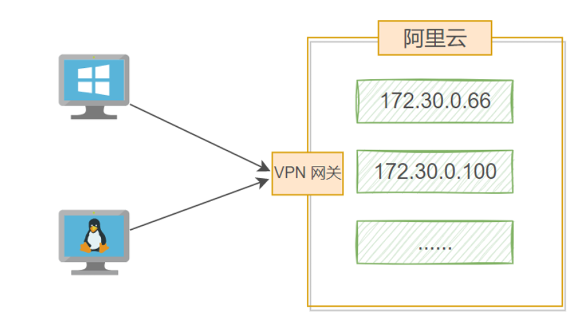
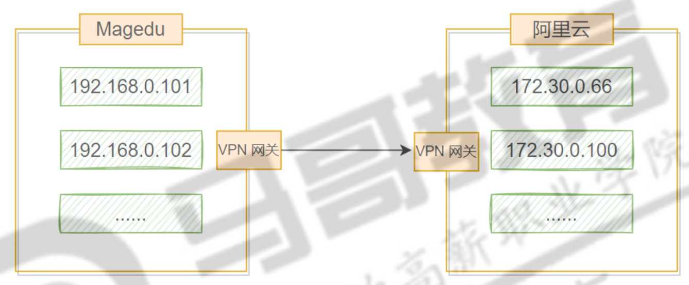
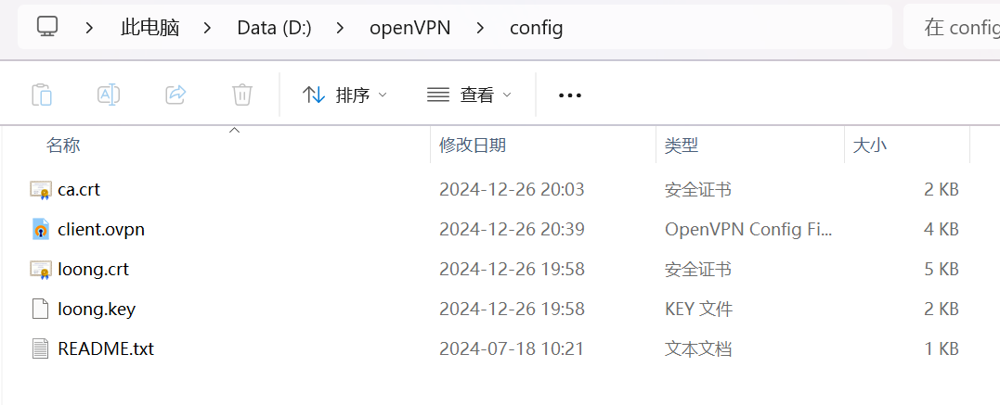

# VPN简介

VPN:  (Virtual Private Network)  虚拟专用网络

VPN 是虚拟专用网络，是专用网络的一种延伸，属于远程访问技术的一种。 

VPN 可以在公用网络的基础上建立专用网络，但其并不是物理意义上的专线，而是在公共的互联网的基础上虚 拟出一个专用网络，所以被称为虚拟专用网络。


**VPN 常见应用模式**

*   点对站点 peer to site



*   站点对站点 site to site



# OpenVPN

OpenVPN 是 Linux下开源的 VPN 应用，它提供了良好的性能和友好的用户 GUI。OpenVPN 是一个 基于 OpenSSL 库的应用层 VPN 实现。和传统 VPN 相比，它的优点是简单易用。

## 服务端

### 安装

```shell
apt update;apt install openvpn easy-rsa
```

`easy-rsa`用于管理证书

```
tree /etc/openvpn 
/etc/openvpn
|-- client
|-- server
`-- update-resolv-conf
```

### 证书相关


####  配置CA证书

准备证书环境，让证书和 openvpn 配置处于一个目录，方便迁移

```shell
cp -r /usr/share/easy-rsa/ /etc/openvpn/

tree /etc/openvpn
/etc/openvpn
|-- client
|-- easy-rsa
|   |-- easyrsa
|   |-- openssl-easyrsa.cnf
|   |-- vars.example
|   `-- x509-types
|       |-- COMMON
|       |-- ca
|       |-- client
|       |-- code-signing
|       |-- email
|       |-- kdc
|       |-- server
|       `-- serverClient
|-- server
`-- update-resolv-conf
```

easy-rsa目录下初始化证书目录pki

```shell
./easyrsa init-pki

/easy-rsa
|-- easyrsa
|-- openssl-easyrsa.cnf
|-- pki
|   |-- inline
|   |-- issued
|   |-- private
|   |-- reqs
|   `-- vars.example
|-- vars
`-- x509-types
    |-- COMMON
    |-- ca
    |-- client
    |-- code-signing
    |-- email
    |-- kdc
    |-- server
    `-- serverClient
```

生成CA机构证书

```shell
./easyrsa  build-ca nopass

# 查看CA证书
./easyrsa show-ca
openssl x509 -in pki/ca.crt  -noout -text
```

openVPN服务器证书申请文件

```shell
./easyrsa gen-req server nopass
```

颁发openVPN服务器证书

```shell
./easyrsa sign-req server server
#                  证书类型  申请文件名
```

创建 Diffie-Hellman 密钥

Diffie-Hellman 密钥交换方法是一种建立秘钥的方法，而不是加密方法，所以秘钥必须和其他一种加密 算法结合使用。这种密钥交换技术的目的在于使两个用户安全地交换一个密钥，用此密钥做为对称密钥来加密 后续的报文传输。

```shell
./easyrsa gen-dh

# 也可以使用openssl创建
openssl dhparam -out /etc/openvpn/dh2048.pem 2048
```

#### 配置客户端证书

vars中有效期不能太长

```ini
set_var EASYRSA_CERT_EXPIRE     180
```

客户证书申请文件

```shell
./easyrsa gen-req loong nopass
```

颁发证书

```
./easyrsa sign-req client loong

./easyrsa show-cert loong
openssl x509 -in pki/issued/loong.crt -noout -text
```

#### 证书整理

服务证书目录

```shell
/etc/openvpn/server
|-- ca.crt
|-- dh.pem
|-- server.crt
`-- server.key
```

客户端证书目录

```shell
/etc/openvpn/client
`-- loong
    |-- ca.crt
    |-- loong.crt
    `-- loong.key
```

### openVPN服务端配置

配置文件默认不存在，需要手动创建

```shell
cp /usr/share/doc/openvpn/examples/sample-config-files/server.conf /etc/openvpn/server/
```

主要修改的配置

```shell
port 1194
proto tcp
dev tun
ca /etc/openvpn/server/ca.crt
cert /etc/openvpn/server/server.crt
key /etc/openvpn/server/server.key
dh /etc/openvpn/server/dh.pem
server 10.8.0.0 255.255.255.0  # 建立的内网IP端与掩码
#  push "route 172.30.0.0 255.255.255.0"  可推送路由至客户端
keepalive 10 120
user root
group root
```

### 启动服务端命令

```
systemctl start openvpn-server@server.service
```

## 客户端

### 客户端配置文件

```shell
cp /usr/share/doc/openvpn/examples/sample-config-files/client.conf /etc/openvpn/client/loong/
```

主要修改的配置

```
remote 39.101.79.252 1194
proto tcp
ca ca.crt
cert loong.crt
key loong.key
```

### 文件放置

#### win

D:\openVPN\config下放置



#### linux

```shell
/etc/openvpn/client/
└── loong
    ├── ca.crt
    ├── client.ovpn
    ├── loong.crt
    ├── loong.key
    └── ta.key

```


### 启动

```
openvpn --daemon --cd /etc/openvpn/client --config client.ovpn --log-append /var/log/openvpn.log
```


# OpenVPN 管理

## 安全增强功能

服务端生成openvpn专用的加密 key

```shell
openvpn --genkey secret /etc/openvpn/server/ta.key
```

服务端配置

```shell
vim /etc/openvpn/server.conf
tls-auth /etc/openvpn/server/ta.key 0

# 重启服务
systemctl restart openvpn-server@server.service 
```

客户端配置

```
tls-auth ta.key 1
```

## 客户端私钥设置密码

生成证书申请时设置密码

```shell
./easyrsa gen-req spike # 无密码时加上nopass
Enter PEM pass phrase:                      #输入密码 123456
Verifying - Enter PEM pass phrase:          #确认密码 123456
```

## 证书管理 

### 证书过期

```shell
vim /etc/openvpn/easy-rsa/vars
set_var EASYRSA_CERT_EXPIRE     180 # 证书过期时间
```

### 手工吊销证书

```shell
./easyrsa revoke spike

# 查看证书索引
cat pki/index.txt
R  250606044112Z   241208045136Z   42D58255100AC5B38735D15023C1E3D1 unknown /CN=spike  # R 表示被吊销

# 更新证书吊销列表文件
./easyrsa gen-crl

# 每次吊销证书后都需要更新证书吊销列表文件
```

修改服务端配置，指定证书吊销列表文件路径

```
vim /etc/openvpn/server/server.conf
crl-verify /etc/openvpn/easy-rsa/pki/crl.pem

systemctl restart  openvpn-server@server.service
```

对于新的重名用户，可以删除不再使用的重名用户证书，再签发新证书，或者换一个用户名签发证书即 可。

