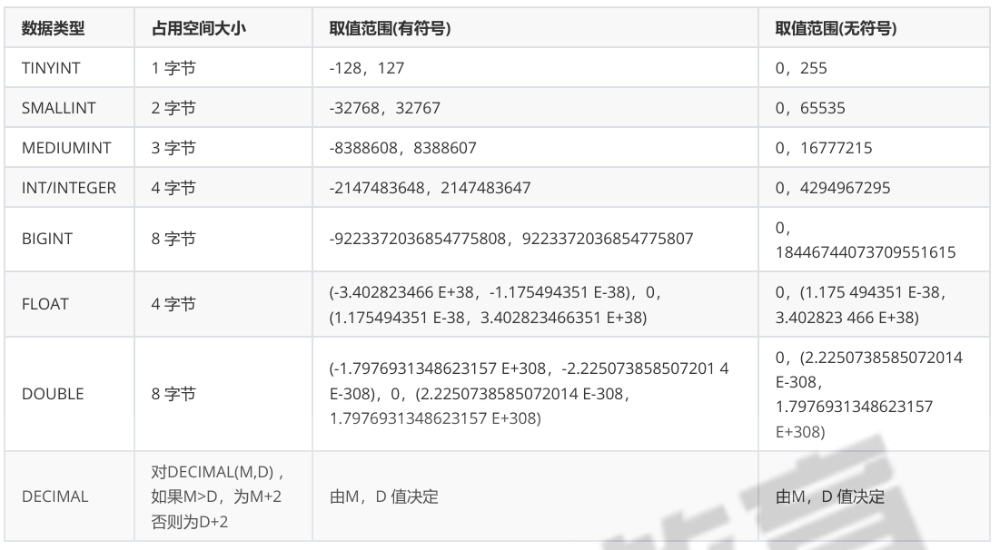
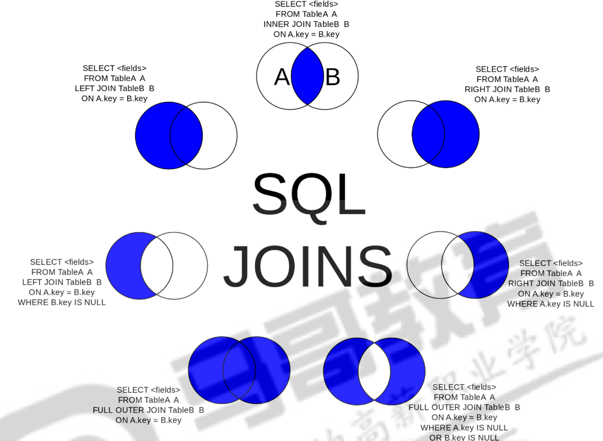
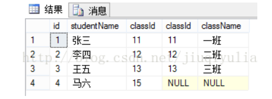
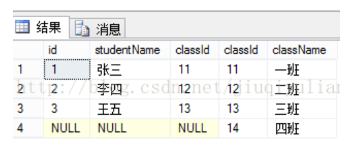
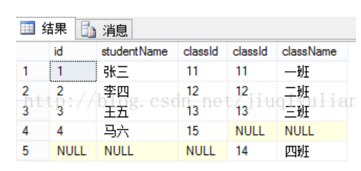

# 关系数据库的构成

| 组成部分                         | 描述                                                         | 示例                                                         |
| -------------------------------- | ------------------------------------------------------------ | ------------------------------------------------------------ |
| **表（Table）**                  | 数据库中的基本数据结构，用于存储数据。由行（记录）和列（字段）组成。 | `CREATE TABLE employees (employee_id INT PRIMARY KEY, first_name VARCHAR(50));` |
| **行（Row）**                    | 表中的一条记录，表示一个实体实例，包含所有字段的具体值。     | `INSERT INTO employees (employee_id, first_name) VALUES (1, 'John');` |
| **列（Column）**                 | 表的一个字段，定义了数据的属性或类型。每列有名称和数据类型。 | `first_name VARCHAR(50)`                                     |
| **主键（Primary Key）**          | 唯一标识表中的每一行记录，保证数据的唯一性和完整性。         | `employee_id INT PRIMARY KEY`                                |
| **外键（Foreign Key）**          | 用于表示表与表之间的关系，引用其他表的主键。                 | `FOREIGN KEY (department_id) REFERENCES departments(department_id)` |
| **索引（Index）**                | 用于加速数据查询的结构，通常创建在常用查询的列上。           | `CREATE INDEX idx_last_name ON employees (last_name);`       |
| **视图（View）**                 | 基于查询结果的虚拟表，不存储数据，简化复杂的查询操作。       | `CREATE VIEW employee_details AS SELECT employee_id, first_name FROM employees;` |
| **存储过程（Stored Procedure）** | 一组预定义的 SQL 语句，可以通过调用来执行一系列操作。        | `CREATE PROCEDURE GetEmployeeDetails (IN emp_id INT) BEGIN SELECT * FROM employees WHERE employee_id = emp_id; END;` |
| **触发器（Trigger）**            | 与表的操作（插入、更新、删除）关联的自动执行过程，常用于保证数据一致性。 | `CREATE TRIGGER before_insert_employee BEFORE INSERT ON employees FOR EACH ROW SET NEW.hire_date = NOW();` |
| **事务（Transaction）**          | 一组数据库操作的集合，要么全部执行，要么全部不执行，保证数据一致性。 | `START TRANSACTION; UPDATE employees SET salary = salary + 1000 WHERE employee_id = 1; COMMIT;` |

等

# SQL 语言规范

-   在数据库系统中，SQL 语句不区分大小写，建议用大写。
-   SQL语句可单行或多行书写，默认以 " ; " 结尾。
-   关键词不能跨多行或简写。
-   用空格和TAB 缩进来提高语句的可读性。
-   子句通常位于独立行，便于编辑，提高可读性。


`@`与`@@`

@ 符号单独使用时，通常用于引用用户定义的会话变量（session variables），这些变量是在当 前用户会话的上下文中定义的。

@@ 符号则用于引用全局系统变量或会话系统变量，具体取决于上下文。如果没有明确指定会话级别 （使用 SET SESSION），则默认引用全局系统变量。


注释

```sql
-- select version();
# select version();

# 多行注释 /*...*/
/*                      
select version()\G;
select version()\G;
*/
```

命名规则

*   必须以字母开头，后续可以包括字母，数字和三个特殊字符（# _ $）
*   不能使用MySQL的保留字
*   如果名字中存在 _ 之类的特殊字符，那么需要在外面使用 **反引号(`)** 包括它们


# SQL 语句

## 语句类型

| **SQL 语句类型** | **说明**                                  | **具体语句**                               |
| ---------------- | ----------------------------------------- | ------------------------------------------ |
| **DDL**          | Data Definition Language 数据定义语言     | `CREATE`, `DROP`, `ALTER`                  |
| **DML**          | Data Manipulation Language 数据操纵语言   | `INSERT`, `DELETE`, `UPDATE`               |
| **DQL**          | Data Query Language 数据查询语言          | `SELECT`                                   |
| **DCL**          | Data Control Language 数据控制语言        | `GRANT`, `REVOKE`                          |
| **TCL**          | Transaction Control Language 事务控制语言 | `BEGIN`, `COMMIT`, `ROLLBACK`, `SAVEPOINT` |


## 帮助文档

```sql
# 命令行下查看服务端可用的命令模块
help contents;

# 查看特定的模块里面包含哪些命令
help Data Definition;

# 查看具体的命令使用方法
help CREATE DATABASE;
```

## 字符集，排序规则

**推荐使用 `utf8mb4`：**

-   如果需要支持多语言（包括中文、日文、韩文、俄文等），或者需要支持表情符号（如 😊），建议使用 `utf8mb4`。
-   从 MySQL 5.5.3 开始，`utf8mb4` 已成为最佳选择。

**`latin1` 和 `ascii` 的使用场景：**

-   如果只存储英文或西欧字符，可以选择 `latin1` 或 `ascii`，因为存储效率更高。

```shell
# 查看当前 MySQL 服务器的默认字符集
SHOW VARIABLES LIKE 'character%';
# utf8：支持多语言字符，但不支持 4 字节字符。
# utf8mb4：是 utf8 的升级版，支持所有 Unicode 字符（包括表情符号）。

# 查看当前 MySQL 服务器的默认排序规则
SHOW VARIABLES LIKE 'collation%';
# utf8mb4_general_ci：大小写不敏感的通用排序规则。ci是大小写不敏感
# utf8mb4_bin：按二进制值进行比较，大小写敏感。
```

**设置默认字符集**

修改 `my.cnf` 配置文件设置 MySQL 的默认字符集。

```
[mysqld]
character-set-server = utf8mb4
collation-server = utf8mb4_general_ci

[client]
default-character-set = utf8mb4
```

**修改字符集**

-   修改数据库的字符集：

    ```sql
    ALTER DATABASE mydb CHARACTER SET utf8mb4 COLLATE utf8mb4_general_ci;
    ```

-   修改表的字符集：

    ```sql
    ALTER TABLE mytable CONVERT TO CHARACTER SET utf8mb4 COLLATE utf8mb4_general_ci;
    ```

*   修改列的字符集：

    ```sql
    ALTER TABLE mytable CHANGE name name VARCHAR(255) CHARACTER SET utf8mb4 COLLATE utf8mb4_general_ci;
    ```

**生产环境，使用 utf8mb4 编码，使用默认排序规则。**

## 管理数据库语句

### 查看数据库列表

```sql
mysql> SHOW DATABASES;
+--------------------+
| Database           |
+--------------------+
| information_schema |
| mysql              |
| performance_schema |
| sys                |
+--------------------+
4 rows in set (0.00 sec)
```

*   information_schema
    *   这是一个特殊的系统数据库，包含了关于其他数据库的信息，如表结构、列信息、索引、权限等。包含了关于数据库结构（表、列、索引等）以及系统对象的元数据。
*   mysql
    *   存储服务器的系统级信息，如用户账户、权限、存储过程和事件等。它是服务器正常运行所必需的。存储了服务的配置信息，例如用户、权限、插件、系统变量等。
*   performance_schema
    *   服务器性能的信息，如查询执行时间、锁等待、表I/O等。它可以帮助数 据库管理员监控和优化数据库的性能。与information_schema一样，您不应该在这个数据库中存储用户数 据。
*   sys
    *   自 MySQL 5.7 起新增的一个虚拟数据库，包含了用户友好的视图，方便对性能和系统状态进行查询和分析，基于 `performance_schema`。是基于 `performance_schema` 的一层抽象，提供了一些易于使用的视图。

### 创建新数据库

```sql
create database testdb1;
# 如果己存在，再次创建会报错

create database if not exists testdb1;

# 查看数据库创建语句，在数据存在的情况下
SHOW CREATE DATABASE DBNAME;

# 创建数据库时指定字符集
create database testdb2 DEFAULT CHARACTER SET latin1;
```

创建数据库，本质上是在硬盘上创建目录

在mysql家目录的data下(二进制编译包)或是`/var/lib/mysql/`(二进制包)

### 修改数据库相关

可以通过 `ALTER DATABASE` 修改数据库的字符集和排序规则。

```shell
ALTER DATABASE database_name CHARACTER SET utf8mb4 COLLATE utf8mb4_general_ci;
```

**MySQL 不支持直接修改数据库名称**，但可以通过以下方法间接实现：

方法：重命名数据库（备份与还原）

1.  **备份原数据库** 使用 `mysqldump` 工具将数据库导出为 SQL 文件：

    ```shell
    mysqldump -u username -p old_database_name > backup.sql
    ```

    替换 `username` 和 `old_database_name` 为你的用户名和数据库名。

2.  **创建新数据库** 在 MySQL 中创建一个新数据库：

    ```sql
    CREATE DATABASE new_database_name;
    ```

3.  **导入数据到新数据库** 使用 `mysql` 命令将备份的数据导入到新数据库：

    ```shell
    mysql -u username -p new_database_name < backup.sql
    ```

4.  **删除原数据库（可选）** 如果确认数据已成功迁移，可以删除旧数据库：

    ```sql
    DROP DATABASE old_database_name;
    ```

### 删除数据库


```sql
DROP DATABASE testdb1;

DROP DATABASE IF EXISTS testdb1;
```

## 数据类型

MySQL 支持多种类型，大致可以分为三类：数值、日期/时间和字符串(字符)类型。

-   更小的通常更好，尽量使用可正确存储数据的最小数据类型 
-   简单就好，简单数据类型的操作通常需要更少的CPU周期
-   尽量避免NULL，包含为NULL的列，对MySQL更难优化


### 数值型

1个int 4个字节，一个字节8位，所以一个int占32位，一个bit位能表示两个数字0和1， 所以一个int能够表示 0 ~ 2^32 -1 的数字范围。


**显示宽度**

数值型在使用时要设置一个长度，这个长度是指查询时该字段的显示宽度，并不影响数字范围。

对于实际 数据的存储和计算来说 int(1) 和 int(10) 是相同的。

INT(1) 和 INT(10) 中的数字（1和10）指定了"显示宽度"。

这个显示宽度通常只影响某些客户端工 具或应用程序在显示数据时的格式化方式,比如插入了一个值7，它可能会显示为07（前面填充了一个零）。

需要注意的是，这个显示宽度并不总是有效的，许多现代客户端和应用程序可能完全忽略这个显示宽度。




#### 整数类型

整数类型用于存储没有小数部分的数值，包括正数和负数。它们的范围取决于是否启用了 **UNSIGNED**（无符号）属性。

| **数据类型**       | **存储大小** | **范围（有符号）**                                      | **范围（无符号）**              | **说明**                         |
| ------------------ | ------------ | ------------------------------------------------------- | ------------------------------- | -------------------------------- |
| `TINYINT`          | 1 字节       | -128 到 127                                             | 0 到 255                        | 适合存储很小的整数值，如标志位。 |
| `SMALLINT`         | 2 字节       | -32,768 到 32,767                                       | 0 到 65,535                     | 适合存储小范围的整数值。         |
| `MEDIUMINT`        | 3 字节       | -8,388,608 到 8,388,607                                 | 0 到 16,777,215                 | 适合存储中等范围的整数值。       |
| `INT` 或 `INTEGER` | 4 字节       | -2,147,483,648 到 2,147,483,647                         | 0 到 4,294,967,295              | 常用的整数类型，适合大部分场景。 |
| `BIGINT`           | 8 字节       | -9,223,372,036,854,775,808 到 9,223,372,036,854,775,807 | 0 到 18,446,744,073,709,551,615 | 用于存储超大范围的整数值。       |

#### 小数和浮点类型

小数和浮点类型用于存储具有小数部分的数值，比如价格、重量等。

| **数据类型**                     | **存储大小**     | **范围**                                            | **精度**           | **说明**                             |
| -------------------------------- | ---------------- | --------------------------------------------------- | ------------------ | ------------------------------------ |
| `FLOAT(M,D)`                     | 4 字节（单精度） | -3.402823466E+38 到 3.402823466E+38                 | 大约 7 位小数      | 存储小范围的浮点数值。               |
| `DOUBLE(M,D)` 或 `REAL`          | 8 字节（双精度） | -1.7976931348623157E+308 到 1.7976931348623157E+308 | 大约 16 位小数     | 存储大范围的浮点数值。               |
| `DECIMAL(M,D)` 或 `NUMERIC(M,D)` | 取决于定义的长度 | 依赖 M 和 D（最大 65 位）                           | 精确到定义的小数位 | 用于存储精确值（推荐用于财务数据）。 |

**说明：**

-   **`M`**：总位数（整数位 + 小数位）。
-   `D`：小数位数。
    -   例如：`DECIMAL(10,2)` 表示最多 10 位数，其中小数位最多 2 位（如 `12345678.90`）。
-   `FLOAT` 和 `DOUBLE` 的区别：
    -   `FLOAT`：用于存储精度要求较低的小数值。
    -   `DOUBLE`：用于存储精度要求较高的大范围小数值。
-   `DECIMAL` 的特殊性：
    -   它以字符串形式存储，因此可以存储高精度数据，适合处理财务、货币等需要精确计算的场景。

### 日期和时间型

| **数据类型** | **存储大小** | **格式**              | **范围**                                               | **说明**                                                |
| ------------ | ------------ | --------------------- | ------------------------------------------------------ | ------------------------------------------------------- |
| `DATE`       | 3 字节       | `YYYY-MM-DD`          | `1000-01-01` 到 `9999-12-31`                           | 仅存储日期，不包含时间部分。                            |
| `DATETIME`   | 8 字节       | `YYYY-MM-DD HH:MM:SS` | `1000-01-01 00:00:00` 到 `9999-12-31 23:59:59`         | 存储日期和时间。支持高精度时间（MySQL 5.6+ 支持微秒）。 |
| `TIMESTAMP`  | 4 字节       | `YYYY-MM-DD HH:MM:SS` | `1970-01-01 00:00:01 UTC` 到 `2038-01-19 03:14:07 UTC` | 与 UTC 时间有关，受时区影响，适合存储事件的时间戳。     |
| `TIME`       | 3 字节       | `HH:MM:SS`            | `-838:59:59` 到 `838:59:59`                            | 存储时间部分，可存储负值，常用于记录时长。              |
| `YEAR`       | 1 字节       | `YYYY`                | `1901` 到 `2155`                                       | 存储年份值，仅包含年份部分。                            |

**注意事项**

1.  **默认值**：对于 `TIMESTAMP`，可以使用 `DEFAULT CURRENT_TIMESTAMP` 作为默认值，但 `DATETIME` 不支持类似的默认值。
2.  **时区**：`TIMESTAMP` 会受时区影响，而 `DATETIME` 不受时区影响。
3.  **日期校验**：插入无效日期（如 `'2024-02-30'`）会报错，除非 SQL 模式中启用了 `ALLOW_INVALID_DATES`。


**日期和时间操作函数**

| **函数**           | **描述**                                                 |
| ------------------ | -------------------------------------------------------- |
| `NOW()`            | 返回当前日期和时间。                                     |
| `CURDATE()`        | 返回当前日期（`YYYY-MM-DD`）。                           |
| `CURTIME()`        | 返回当前时间（`HH:MM:SS`）。                             |
| `DATE()`           | 从 `DATETIME` 或 `TIMESTAMP` 提取日期部分。              |
| `TIME()`           | 从 `DATETIME` 或 `TIMESTAMP` 提取时间部分。              |
| `YEAR()`           | 返回日期的年份部分。                                     |
| `MONTH()`          | 返回日期的月份部分（1 到 12）。                          |
| `DAY()`            | 返回日期的天部分（1 到 31）。                            |
| `DATE_ADD()`       | 向日期添加指定的时间间隔。                               |
| `DATE_SUB()`       | 从日期中减去指定的时间间隔。                             |
| `DATEDIFF()`       | 返回两个日期之间的天数差。                               |
| `TIMEDIFF()`       | 返回两个时间值之间的差值。                               |
| `STR_TO_DATE()`    | 将字符串转换为日期格式。                                 |
| `UNIX_TIMESTAMP()` | 将日期转换为 Unix 时间戳（从 `1970-01-01` 开始的秒数）。 |

#### 获取当前日期和时间

```sql
mysql> SELECT NOW(), CURDATE(), CURTIME();
+---------------------+------------+-----------+
| NOW()               | CURDATE()  | CURTIME() |
+---------------------+------------+-----------+
| 2024-12-29 19:50:58 | 2024-12-29 | 19:50:58  |
+---------------------+------------+-----------+
1 row in set (0.00 sec)
```

#### 日期加减操作

```sql
mysql> SELECT 
    ->     DATE_ADD('2024-12-29', INTERVAL 5 DAY) AS AddDays,
    ->     DATE_SUB('2024-12-29', INTERVAL 10 DAY) AS SubDays;
+------------+------------+
| AddDays    | SubDays    |
+------------+------------+
| 2025-01-03 | 2024-12-19 |
+------------+------------+
1 row in set (0.00 sec)
```

#### 计算两个日期的天数差

```sql
mysql> SELECT DATEDIFF('2024-12-31', '2024-12-29') AS DaysDifference;
+----------------+
| DaysDifference |
+----------------+
|              2 |
+----------------+
1 row in set (0.00 sec)
```

### 字符串类型


| **类型**       | **说明**                                                     | **最大长度**                     | **用途**                                                     |
| -------------- | ------------------------------------------------------------ | -------------------------------- | ------------------------------------------------------------ |
| `CHAR(M)`      | 固定长度字符串，不足时使用空格填充。                         | 最多 255 个字符                  | 存储固定长度的字符串（如邮编、电话号码）。                   |
| `VARCHAR(M)`   | 可变长度字符串，存储时需要额外 1-2 个字节记录长度信息。      | 最多 65,535 字节（受行大小限制） | 存储变长字符串（如名字、描述等）。                           |
| `TINYTEXT`     | 非常小的文本字符串。                                         | 最多 255 个字符                  | 存储小型文本（如简短备注或评论）。                           |
| `TEXT`         | 小型文本字符串。                                             | 最多 65,535 个字符               | 存储中等长度的文本（如文章内容）。                           |
| `MEDIUMTEXT`   | 中型文本字符串。                                             | 最多 16,777,215 个字符           | 存储更大的文本（如文档、报告）。                             |
| `LONGTEXT`     | 大型文本字符串。                                             | 最多 4,294,967,295 个字符（4GB） | 存储非常大的文本（如完整的书籍或日志）。                     |
| `BINARY(M)`    | 固定长度的二进制字符串，不足时以零字节填充。                 | 最多 255 字节                    | 存储固定大小的二进制数据（如加密值或二进制标识）。           |
| `VARBINARY(M)` | 可变长度的二进制字符串，存储时需要额外 1-2 字节记录长度信息。 | 最多 65,535 字节（受行大小限制） | 存储变长的二进制数据（如图像、文件数据）。                   |
| `TINYBLOB`     | 非常小的二进制数据。                                         | 最多 255 字节                    | 存储小型二进制数据（如小文件或二进制对象）。                 |
| `BLOB`         | 小型二进制数据。                                             | 最多 65,535 字节                 | 存储中等长度的二进制数据（如文件、图片）。                   |
| `MEDIUMBLOB`   | 中型二进制数据。                                             | 最多 16,777,215 字节             | 存储更大的二进制数据（如视频片段、压缩文件）。               |
| `LONGBLOB`     | 大型二进制数据。                                             | 最多 4,294,967,295 字节（4GB）   | 存储非常大的二进制数据（如完整视频文件）。                   |
| `ENUM`         | 字符串枚举类型，用户可以从预定义的值列表中选择一个值。       | 最多 65,535 个枚举值             | 存储固定集合中的一个值（如状态：'active', 'inactive'）。     |
| `SET`          | 字符串集合类型，用户可以从预定义的值列表中选择多个值。       | 最多 64 个集合成员               | 存储固定集合中的多个值（如权限：'read', 'write', 'execute'）。 |

#### CHAR 和 VARCHAR

**`CHAR`**：存储定长字符串，不足部分用空格填充，适合存储固定长度的数据。

**`VARCHAR`**：存储可变长度的字符串，占用的存储空间更少。

`char(n)` 和 `varchar(n)` 中括号中 n 代表字符的个数


**`CHAR` 的存储**

-   `CHAR` 是固定长度的字符串。如果存储的数据长度小于定义长度，会在右侧用空格补齐。
-   数据检索时，MySQL 会自动去掉填充的空格。

**`VARCHAR` 的存储**

`VARCHAR`是可变长度的字符串，存储的数据只占用实际长度，外加 1 字节或 2 字节的长度信息：

-   如果最大长度 ≤ 255，则额外占用 1 字节。
-   如果最大长度 > 255，则额外占用 2 字节。

示例存储情况：

| **类型**      | **定义长度** | **实际存储数据** | **存储空间**                  |
| ------------- | ------------ | ---------------- | ----------------------------- |
| `CHAR(10)`    | 10           | `'abc'`          | 10 字节                       |
| `VARCHAR(10)` | 10           | `'abc'`          | 4 字节（3 字符 + 1 字节长度） |


**`CHAR` 的性能更高**

-   因为 `CHAR` 是固定长度，检索数据时无需计算实际长度，性能更好。
-   适用于长度固定的数据，例如状态码、国家代码、性别等。

**`VARCHAR` 更节省空间**

-   如果存储的数据长度差异较大，`VARCHAR` 的可变长度特性能够有效节省存储空间。
-   适用于长度变化较大的数据，例如描述、标题等。


**存储数据改变时的影响**

**`VARCHAR` 的行为**

-   **存储变化**：
    -   当存储的数据长度发生变化时，`VARCHAR` 会重新计算长度，并调整存储位置。如果新的数据长度超过了原来的存储空间，就需要额外的存储操作。
    -   数据长度增加时，MySQL 可能需要重新分配存储空间，并将数据移动到新的位置。这可能导致 **额外的磁盘 I/O 开销** 和 **碎片化问题**。
-   **存储碎片问题**：
    -   当数据长度变化频繁时（特别是长度增加时），表中可能会出现碎片化。因为原来的存储空间不够，需要在其他位置重新存储新数据，这会降低检索性能。

定期优化表

```sql
OPTIMIZE TABLE table_name;
# 重新整理表中的数据，回收碎片空间，提高存储效率和查询性能。
```


#### TEXT 和 BLOB

**TEXT** 类型用于存储大文本数据，不能指定默认值。

**BLOB** 类型用于存储二进制数据，适合存储文件、图片等。

| **特性**       | **`TEXT`**                                          | **`BLOB`**                                         |
| -------------- | --------------------------------------------------- | -------------------------------------------------- |
| **数据类型**   | 以文本（字符串）的方式存储数据。                    | 以二进制（Binary）的方式存储数据。                 |
| **大小写区分** | **区分大小写**（受排序规则影响）。                  | **不区分大小写**，按字节存储，比较时按二进制处理。 |
| **字符编码**   | 支持字符编码（如 `utf8mb4`）。                      | 不支持字符编码，存储的是原始二进制数据。           |
| **用途**       | 用于存储大段文本数据（如文章、评论）。              | 用于存储二进制数据（如图像、文件、音频）。         |
| **索引**       | 受字符集和排序规则（collation）影响，允许前缀索引。 | 不受字符集和排序规则影响，允许前缀索引。           |


#### ENUM 和 SET

**ENUM**：枚举类型，适用于固定值集合。多选一

**SET**：集合类型，允许存储多个选项。多选多

```sql
CREATE TABLE enum_set_example (
    col_enum ENUM('small', 'medium', 'large'),
    col_set SET('a', 'b', 'c', 'd')
);
```

### 修饰符

#### 数值类型修饰符

| **修饰符**           | **作用**                                                     | **示例**                                   |
| -------------------- | ------------------------------------------------------------ | ------------------------------------------ |
| **`UNSIGNED`**       | 无符号，表示值只能为非负数（0 或正数），将负数的范围移到正数。 | `INT UNSIGNED`（范围：0 到 4,294,967,295） |
| **`ZEROFILL`**       | 在输出数值时用零填充到定义的显示宽度。会自动添加 `UNSIGNED` 属性。 | `INT(5) ZEROFILL`（结果：00001、00123）    |
| **`AUTO_INCREMENT`** | 自动生成一个唯一的递增值，通常用在主键字段上。               | `id INT AUTO_INCREMENT PRIMARY KEY`        |

#### 字符串类型修饰符

| **修饰符**    | **作用**                                                     | **示例**                           |
| ------------- | ------------------------------------------------------------ | ---------------------------------- |
| **`CHARSET`** | 设置字段的字符集。通常用于 `VARCHAR` 或 `TEXT` 类型字段。    | `VARCHAR(255) CHARSET utf8mb4`     |
| **`COLLATE`** | 设置字段的排序规则，影响数据的比较和排序行为。               | `VARCHAR(255) COLLATE utf8mb4_bin` |
| **`BINARY`**  | 强制区分大小写的字符串比较，通常用于 `CHAR` 或 `VARCHAR` 字段。 | `VARCHAR(255) BINARY`              |

#### 时间和日期修饰符

| **修饰符**                        | **作用**                                                     | **示例**                                           |
| --------------------------------- | ------------------------------------------------------------ | -------------------------------------------------- |
| **`DEFAULT CURRENT_TIMESTAMP`**   | 设置字段的默认值为当前时间（仅适用于 `TIMESTAMP` 和 `DATETIME`）。 | `created_at TIMESTAMP DEFAULT CURRENT_TIMESTAMP`   |
| **`ON UPDATE CURRENT_TIMESTAMP`** | 当记录更新时，自动更新字段的值为当前时间（仅适用于 `TIMESTAMP` 和 `DATETIME`）。 | `updated_at TIMESTAMP ON UPDATE CURRENT_TIMESTAMP` |

#### NULL 和 NOT NULL

| **修饰符**     | **作用**                                   | **示例**                     |
| -------------- | ------------------------------------------ | ---------------------------- |
| **`NULL`**     | 表示该列可以存储空值（默认）。             | `name VARCHAR(50) NULL`      |
| **`NOT NULL`** | 表示该列不能为空值，插入数据时必须提供值。 | `email VARCHAR(50) NOT NULL` |

#### 默认值修饰符

| **修饰符**    | **作用**                                                 | **示例**                                             |
| ------------- | -------------------------------------------------------- | ---------------------------------------------------- |
| **`DEFAULT`** | 指定字段的默认值。如果插入记录时未提供值，则使用默认值。 | `status ENUM('active', 'inactive') DEFAULT 'active'` |

#### PRIMARY KEY、UNIQUE 和其他约束修饰符

| **修饰符**        | **作用**                                               | **示例**                                     |
| ----------------- | ------------------------------------------------------ | -------------------------------------------- |
| **`PRIMARY KEY`** | 定义主键，字段值必须唯一且不能为空。                   | `id INT PRIMARY KEY`                         |
| **`UNIQUE`**      | 定义字段值必须唯一，可以为空值，但 NULL 值可重复出现。 | `email VARCHAR(50) UNIQUE`                   |
| **`INDEX`**       | 创建索引以加速查询速度。                               | `CREATE INDEX idx_name ON users(name)`       |
| **`FOREIGN KEY`** | 定义外键，强制表之间的关系。                           | `FOREIGN KEY (user_id) REFERENCES users(id)` |
| **`CHECK`**       | 定义列值的条件约束（MySQL 8.0 及以上支持）。           | `age INT CHECK (age >= 18)`                  |

#### 表修饰符

| **修饰符**           | **作用**                                 | **示例**                                                     |
| -------------------- | ---------------------------------------- | ------------------------------------------------------------ |
| **`ENGINE`**         | 设置存储引擎，如 `InnoDB` 或 `MyISAM`。  | `CREATE TABLE test (id INT) ENGINE=InnoDB`                   |
| **`AUTO_INCREMENT`** | 为表定义自动递增字段。                   | `id INT AUTO_INCREMENT`                                      |
| **`CHARACTER SET`**  | 设置表的字符集（影响所有字符串字段）。   | `CREATE TABLE test (name VARCHAR(50)) CHARACTER SET utf8mb4` |
| **`COLLATE`**        | 设置表的排序规则（影响所有字符串字段）。 | `CREATE TABLE test (name VARCHAR(50)) COLLATE utf8mb4_general_ci` |

## DDL 语句 表操作

### 查看表

```sql
# 显示数据库里的所有表
SHOW TABLES FROM db_name;
# 进入数据库，显示所有表
use mysql;
show tables;

# 查看表结构（列信息）
# DESC 是 DESCRIBE 的缩写，作用是查看表结构。
DESC db_name.tb_name;

# 查看特定表的状态
show table status like user1;
# 查看指定数据库中的表状态
show table status from db1;
```

### 创建表

```sql
CREATE TABLE student (
    id int UNSIGNED AUTO_INCREMENT PRIMARY KEY,
    name VARCHAR(20) NOT NULL,
    age tinyint UNSIGNED,
    -- height DECIMAL(5,2),
    gender ENUM('M', 'F') default 'M'
) ENGINE=InnoDB AUTO_INCREMENT=10 DEFAULT CHARSET=utf8mb4;

# 使用其他表创建表，仅表结构
create table user2 like user1;

# 使用其他表创建表，带有数据
create table user1 select Host,User,Password from mysql.user;

# 查看创建表时的语句
show create table user2;
```

### 修改表结构

```sql
# 修改表名
ALTER TABLE student RENAME stu;

# 添加表字段
ALTER TABLE table_name ADD column_name column_definition;
ALTER TABLE stu ADD phone varchar(11) AFTER name;
ALTER TABLE stu ADD is_del bool DEFAULT false;

# 添加主键
ALTER TABLE table_name ADD PRIMARY KEY (column_name);
## 将name字段设置为主键
ALTER TABLE student2 ADD PRIMARY KEY (name);
## 创建id字段，并设为主键
ALTER TABLE student2 ADD COLUMN id INT AUTO_INCREMENT PRIMARY KEY FIRST;

# 修改表字段
## 修改字段类型，MODIFY只修改列的定义
ALTER TABLE stu MODIFY phone int;
ALTER TABLE table_name MODIFY COLUMN column_name new_column_definition;
## CHANGE 修改字段名称和类型
ALTER TABLE stu CHANGE COLUMN phone mobile char(11);
ALTER TABLE table_name CHANGE COLUMN old_column_name new_column_name new_column_definition;
## 修改列默认值
ALTER TABLE table_name ALTER COLUMN column_name SET DEFAULT default_value;
alter table stu alter column age set default '18';

# 删除表字段
ALTER TABLE stu DROP COLUMN gender;

# 删除主键
ALTER TABLE table_name DROP PRIMARY KEY;
ALTER TABLE student2 DROP PRIMARY KEY;
 
# 表字符集修改
ALTER TABLE table_name CONVERT TO CHARACTER SET charset_name;
# 更改存储引擎
ALTER TABLE table_name ENGINE = new_engine;
```

### 删除表

```sql
drop table user1;
```

## DML 语句 数据操作

### 插入数据

```sql
# 单条插入
INSERT INTO table_name (column1, column2, column3, ...)
VALUES (value1, value2, value3, ...);

insert stu (name,age) values('xiaoming',20);

# 多条插入
INSERT INTO stu (name,age)VALUES('test1',20),('test2',21),('test3',22);
 
INSERT INTO student (name, age, gender) 
VALUES 
    ('Daisy', 21, 'F'),
    ('Evan', 24, 'M'),
    ('Fiona', 22, 'F');
    
    
# 插入数据时处理主键或唯一键冲突的情况。
# 如果插入的记录不会引发主键或唯一键冲突，则正常插入数据。
# 如果插入的记录引发主键或唯一键冲突，则执行 UPDATE 子句来更新已有记录。
INSERT INTO student (id, name, age)
VALUES (1, 'Alice', 20)
ON DUPLICATE KEY UPDATE
    name = 'Alice',
    age = 20;

INSERT INTO stu (id,name) VALUES(12,'zhangsan') ON DUPLICATE KEY UPDATE name='zhangsan';

# 插入select筛选出的数据
INSERT INTO student (name, age, gender)
SELECT name, age, gender FROM student_temp;

insert into stu (name,age) select name,age from stu where id=11;
```

### 更新数据

更新数据一定要加条件限制，没有条件则会更新表中的所有记录。

```sql
 update stu SET age=31 WHERE id>15;
 
 update stu SET age=21 WHERE ( id=15 OR name IS NULL );
 
 # 对于NUll的空值条件判断，要使用 IS NULL，否则会导致失败
 update stu set age=35 where mobile IS NULL;
```

限制所有更新, 在没有限制条件的情况下，禁止更新所有

```shell
# -U|--safe-updates|--i-am-a-dummy 进入数据库时加上
mysql -U

# 客户端配置中加入
safe-updates
```

一旦限制安全更新的功能之后，就不能随便更新数据了

必须要指定主键

### 删除数据

```sql
delete from stu where id=10;
```

在直实生产环境中，一般不会对数据做物理删除，而是用字段来标记为逻辑删除，将对应字段值设为某 个特定项，认为是己删除

```sql
UPDATE stu SET is_del=0 WHERE id>11;

# 通过属性标识的方式，标明要删除对应的数据
UPDATE stu SET is_del=1 WHERE id=15;
```

### 清空表数据

`TRUNCATE` 和 `DELETE` 清空表数据，但保留表结构。

`DROP TABLE 表名;` 会直接删除表及其结构。

```sql
TRUNCATE TABLE 表名; # 不支持事务回滚，特定数据库（如 PostgreSQL 或 SQL Server）可能支持回滚。

DELETE FROM 表名;    # 支持事务回滚

DROP TABLE 表名;     # 不支持事务回滚，特定数据库（如 PostgreSQL 或 SQL Server）可能支持回滚。
```

*   TRUNCATE
    *   快速清空表的数据。
    *   不记录单行删除的日志（操作较快）。
    *   不触发表上的触发器。
    *   重置表的自增计数器（如果表有自增字段）。
    *   不能对有外键依赖的表使用。
*   DELETE
    *   逐行删除数据。
    *   可以加条件删除部分数据（例如：`DELETE FROM 表名 WHERE 条件`）。
    *   会触发表上的触发器。
    *   如果需要删除表中所有数据而保留表结构，也可用 `DELETE`，但性能不如 `TRUNCATE`。

## DQL 语句 数据查询

执行顺序

1.   数据表的查询顺序：
2.    先执行FROM table_name;
3.   再执行 where 条件；
4.   然后执行select后要查找的字段（包含别名）
5.   最后看order by排序

也因此，where不能使用别名，但是order by可以，因为再执行where的时候，还没有执行到字段的别名。

```sql
#SQL99语法：
SELECT ...,...,...(存在聚合函数)
FROM ...(LEFT/RIGHT/INNER)JOIN...ON... 多表连接条件
JOIN...ON...
WHERE 不包含聚合函数的过滤条件
GROUP BY ...,...
HAVING 包含聚合函数的过滤条件
ORDER BY ...,...(ASC/DESC)
LIMIT ...,...

# SQL语句的执行过程
1. FROM <left_table>
2. ON <join_condition>
3. <join_type> JOIN <right_table>
4. WHERE <where_condition>
5. GROUP BY <group_by_list>
6. HAVING <having_condition>
7. SELECT
8. DISTINCT <select_list>
9. ORDER BY <order_by_condition>
10. LIMIT <limit_number>
```


### SELECT

```sql
SELECT 1 + 1 FROM DUAL; # dual是伪表，用于不需要任何表的情况下执行操作

# 给列取别名
SELECT employee_id emp_id FROM employees;
SELECT last_name AS lname FROM employees; 
SELECT department_id "部门id" FROM employees;

SELECT DISTINCT department_id FROM employees;
-- DISTINCT 去除重复数据

# 关键字与表名冲突
SELECT * FROM `order`; -- 使用``反引号

# WHERE
SELECT * FROM employees WHERE department_id = 90； -- WHERE使用在FROM后
```

### WHERE 子句 和过滤条件

**WHERE 子句的作用**

-   用于在查询中指定过滤条件，从而实现对数据的 "选择" 功能。
-   过滤条件是一个布尔型表达式，根据条件的值（`TRUE` 或 `FALSE`）决定是否返回某行


**过滤条件**可以由字段、常量、算术表达式、比较表达式和逻辑操作符组成。

**算术操作符**

| 操作符 | 含义             |
| ------ | ---------------- |
| `+`    | 加法             |
| `-`    | 减法             |
| `*`    | 乘法             |
| `/`    | 除法             |
| `%`    | 取模（返回余数） |

**比较操作符**

| 操作符       | 含义                       |
| ------------ | -------------------------- |
| `=`          | 等于                       |
| `<=>`        | 相等或都为空（MySQL 专有） |
| `<>` 或 `!=` | 不等于                     |
| `>`          | 大于                       |
| `>=`         | 大于或等于                 |
| `<`          | 小于                       |
| `<=`         | 小于或等于                 |

**逻辑操作符**

| 操作符 | 含义                                            |
| ------ | ----------------------------------------------- |
| `NOT`  | 逻辑非，将条件结果取反                          |
| `AND`  | 逻辑与，所有条件为 `TRUE` 时结果为 `TRUE`       |
| `OR`   | 逻辑或，任一条件为 `TRUE` 时结果为 `TRUE`       |
| `XOR`  | 逻辑异或，当且仅当一个条件为 `TRUE` 时为 `TRUE` |

范例查询：`BETWEEN min_num AND max_num `

不连续的查询：`IN (element1，element2，...)  `

空查询：`IS NULL,，IS NOT NULL`


在 SQL 中，`AS` 用于为表或列指定别名。这是一个可选的关键字，用于简化查询中的字段名称、提高代码可读性，或避免命名冲突。

```sql
select id as 学号,name as 姓名,age as 年纪 from stu;
select id,name from stu where id in (2,4,6);
select id,name from stu where id=2;
```

### like 模糊匹配查询

```sql
select id,name from stu where name like 't%';

-- LIKE 模糊匹配
SELECT last_name
FROM employees
WHERE last_name LIKE '%a%';
-- % ，代表零个、一个或多个字符
-- '_'，代表一个单一的字符
```

`RLIKE` 和 `REGEXP` 都用于通过正则表达式模式匹配字符串，这可以让你执行更复杂的查询。但它们有一些限制和性能影响，特别是对于大型数据集来说，可能会导致索引失效，进而影响查询性能。

### 范围过滤

连续范围

```sql
select id,name from stu where id between 6 and 8;
```

不连续范围

```sql
select id,name from stu where id in (2,5,7);
select id,name from stu where id not in (2,3,5,8);
```

### 统计 聚合函数

- 概述：什么是聚合函数
    - 作用于一组数据，并对一组数据返回一个值
        - 比如；一组数据中，在多个数据里选出最大值，就是一个聚合函数

- 常用聚合函数类型
    - AVG()
    - SUM()
    - MAX()
    - MIN()
    - COUNT()
    - 注意：
        - AVG()和SUM()只适用于数值类型的字段（或变量）
        - COUNT(*)和COUNT(1)能够查看表中有多少条记录
        - COUNT(具体字段)不能准确查出，因为COUNT()无法识别NULL

```sql
# 记录统计
select count(*) as total from stu;

# 字段中有 null,不统计
select count(age) from stu;

select max(id),min(id),avg(age) from stu;

select sum(age) from stu;
```

### 分组

#### GROUP BY

在 SQL 中，**`GROUP BY` 子句要求 SELECT 中的非聚合字段必须出现在 `GROUP BY` 中**，这是为了保证查询的语义一致性。

**原因**

-   **聚合函数的作用**：`GROUP BY` 是用来将数据分组的，每一组数据通常会通过聚合函数（如 `SUM`、`COUNT`、`AVG` 等）来生成汇总值。
-   **非聚合字段的规则**：如果一个字段不是聚合函数的结果，就必须明确指明该字段如何分组，因此它必须出现在 `GROUP BY` 中，否则会导致查询语义不明确。

```sql
# 有聚合函数
select avg(age),is_del from stu group by is_del;

# 需求：查询各个department_id,job_id的平均工资
SELECT department_id,job_id,AVG(salary)
FROM employees
GROUP BY department_id,job_id;

# 当字段和GROUP BY 的分组不匹配时，MySQL的给出的信息是错误的，Oracle会报错
SELECT department_id,job_id,AVG(salary)
FROM employees
GROUP BY department_id; -- oracle报错，job_id不在group by里
```

#### HAVING

用来过滤数据，类WHERE

```sql
select count(*) as total,max(id),avg(age),is_del from stu where mobile is null group by is_del having total=3;

SELECT department_id,MAX(salary)
FROM employees
GROUP BY department_id
HAVING MAX(salary) > 10000;

# 可以同时使用
SELECT department_id,MAX(salary)
FROM employees
WHERE department_id IN (10,20,30,40)
GROUP BY department_id
HAVING MAX(salary > 10000);
  
# 过滤聚合函数（MAX，AVG）时，必须用HAVING
# HAVING适用范围更广
# 如果过滤条件没有聚合函数，WHERE效率更高
```

### 排序

```sql
# ORDER BY 排序
SELECT employee_id,last_name,salary FROM employees ORDER BY salary;
-- 升序：ASC 默认
-- 降序：DESC

# 使用别名排序
SELECT employee_id,salary,salary*12 as annual_sal FROM employees ORDER BY annual_sal;
-- 别名只能在排序中使用，不能再WHERE中只用，会报错

# 二级排序，在一级相同的情况下，使用二级排序
SELECT employee_id,salary,department_id FROM employees ORDER BY department_id DESC,salary ASC;
-- 多个排序嵌套查询，各级之间用逗号排序
```

### 数据去重

```sql
#  distinct(属性) 方式去重
select distinct age from stu order by age desc;
```

### 分页 limit

```sql
# LIMIT
SELECT 
    employee_id, first_name, last_name
FROM
    employees
ORDER BY first_name
LIMIT 5;
-- 显示前五行

# 跳行
SELECT 
    employee_id, first_name, last_name
FROM
    employees
ORDER BY first_name
LIMIT 5 OFFSET 3;
-- 跳过前3行，输出后面的5行

SELECT employee_id, last_name FROM employees LIMIT 0，20；
-- 跳过前0行，输出后面的20行

# 通过上面，LIMIT可以实现数据的分页
SELECT employee_id, last_name FROM employees LIMIT 0，20；
-- 偏移量为0，一页20个；返回的就是第1页的20行

SELECT employee_id, last_name FROM employees LIMIT 20，20；
-- 偏移量为20到达第二页首行，一页20个；返回的就是第2页的20行
```

###  多表查询



| 查询分类         | 说明                                                         | 示例                                                         |
| ---------------- | ------------------------------------------------------------ | ------------------------------------------------------------ |
| **子查询**       | SQL语句中嵌套着查询语句，性能较差。                          | `SELECT name FROM employees WHERE department_id = (SELECT id FROM departments WHERE name = 'Engineering');` |
| **联合查询**     | 在查询中连接多张表。                                         | `SELECT a.name, b.department FROM employees a INNER JOIN departments b ON a.department_id = b.id;` |
| **等值内连接**   | 返回两个表中符合条件的记录。                                 | `SELECT a.name, b.department FROM employees a INNER JOIN departments b ON a.department_id = b.id;` |
| **不等值内连接** | 用于表之间字段不等值的连接。                                 | `SELECT a.name, b.salary FROM employees a INNER JOIN salaries b ON a.salary > b.salary;` |
| **自然连接**     | 去掉重复列的等值连接。                                       | `SELECT a.name, b.department FROM employees a NATURAL JOIN departments b;` |
| **左外连接**     | 返回左表的所有记录，即使右表中没有匹配的记录。               | `SELECT a.name, b.department FROM employees a LEFT JOIN departments b ON a.department_id = b.id;` |
| **右外连接**     | 返回右表的所有记录，即使左表中没有匹配的记录。               | `SELECT a.name, b.department FROM employees a RIGHT JOIN departments b ON a.department_id = b.id;` |
| **完全外连接**   | 返回左表和右表中所有的记录。                                 | `SELECT a.name, b.department FROM employees a FULL OUTER JOIN departments b ON a.department_id = b.id;` |
| **交叉连接**     | 返回两个表的笛卡尔积，每个左表记录都会与右表的每个记录组合。 | `SELECT a.name, b.department FROM employees a CROSS JOIN departments b;` |
| **自连接**       | 同一张表与自己进行连接。                                     | `SELECT a.name AS employee, b.name AS manager FROM employees a JOIN employees b ON a.manager_id = b.id;` |
| **联合操作**     | 合并多个 `SELECT` 语句的结果。默认去重。                     | `SELECT name FROM employees WHERE department_id = 1 UNION SELECT name FROM employees WHERE department_id = 2;` |

#### 子查询

在查询语句的内部嵌套另一个查询语句。

先计算子查询语句，使用子查询的结果继续查询。

子查询可以一次性完成很多逻辑上需要多个步骤才能完成的 SQL 操作。子查询虽然可以使查询语句很灵 活，但执行效率不高。执行子查询时，需要为内层查询语句的查询结果建立一个临时表。

然后外层查询语句从临时表中查询记录。查询完毕后，再撤销这些临时表。因此，子查询的速度会受到一 定的影响。如果查询的数据量比较大，这种影响就会随之增大。


可以使用**连接(JOIN)查询**来替代子查询。连接查询不需要建立临时表，其速度比子查询要快，如果查询 中使用到索引的话，性能会更好。


##### 单行子查询

子查询返回一行数据

- 单行操作符
    - `=` equal to
    - `！=` not equal to
    - `>` greater than
    - `<` less than
    - `>=` greater than or equal to
    - `<=` less than or equal to
    - `<>` not equal to

```sql
-- 题目：查询与141号员工的manager_id和department_id相同的其他员工的employee_id, manager_id,department_id
-- 方式1
SELECT employee_id,manager_id,department_id
FROM employees
WHERE manager_id = (
      SELECT manager_id
      FROM employees
      WHERE employee_id = 141
)
AND department_id = (
      SELECT department_id
      FROM employees
      WHERE employee_id = 141
)
AND employee_id <> 141;

-- 方式2
-- 方式1中，查询的表格和过滤条件都一样，仅有查询字段不同，可以同时将两个字段一起查询
SELECT employee_id,manager_id,department_id
FROM employees
WHERE (manager_id,department_id) = (
      SELECT manager_id,department_id
      FROM employees
      WHERE employee_id = 141
)
AND employee_id <> 141;
```

##### 多行子查询

特点：

- 内查询返回多行
- 使用多行比较操作符

多行比较操作符

| 操作符 | 含义                                                         |
| ------ | ------------------------------------------------------------ |
| IN     | 等于列表中的任意一个                                         |
| ANY    | 需要和单行比较操作符一起使用，和子查询返回的某一个值比较；<font color="#FF0000">任意</font>一条符合筛选 |
| ALL    | 需要和单行比较操作符一起使用给，和子查询返回的所有值比较；<font color="#FF0000">所有都</font>符合筛选 |
| SOME   | 实际上是ANY别名，作用相同，一般使用ANY；<font color="#FF0000">一些（>=1）</font>符合顺序 |

```sql
-- IN 举例:
SELECT employee_id, last_name
FROM employees
WHERE salary IN (
        SELECT MIN(salary)
        FROM employees
        GROUP BY department_id
);

-- ANY/ALL
-- 题目：返回其他job_id中比job_id为'IT_PROG'部门任一工资低的员工的员工号，姓名，job_id以及salary
SELECT employee_id,last_name,job_id,salary
FROM employees
WHERE job_id <> 'IT_PROG'
AND salary < ANY (
        SELECT salary
        FROM employees
        WHERE job_id = 'IT_PROG'
);

-- 题目：返回其他job_id中比job_id为'IT_PROG'部门所有工资低的员工的员工号，姓名，job_id以及salary
SELECT employee_id,last_name,job_id,salary
FROM employees
WHERE job_id <> 'IT_PROG'
AND salary < ALL (
        SELECT salary
        FROM employees
        WHERE job_id = 'IT_PROG'
);

-- 题目：查询平均工资最低的部门id
-- 方法1：
SELECT department_id
FROM employees
GROUP BY department_id
ORDER BY AVG(salary) ASC
LIMIT 0,1;

-- 单行函数可以嵌套，聚合函数不支持嵌套，例如MAX（COUNT（））

-- 方法2：
SELECT department_id
FROM employees
GROUP BY department_id
HAVING AVG(salary) = (
	SELECT MIN(avg_sal) 
	-- 聚合函数不支持嵌套，但是可以将结果作为一张新表，然后再用聚合函数计算
    FROM(
        SELECT AVG(salary) avg_sal,department_id
        FROM employees
        GROUP BY department_id
	) dept_avg_sal -- 新表别名 dept_avg_sal
);

-- 方式3：

SELECT department_id
FROM employees
GROUP BY department_id
HAVING AVG(salary) <= ALL(
	SELECT AVG(salary) avg_sal
	FROM employees
	GROUP BY department_id
); 
```

##### 相关子查询

构造子查询的查询条件时需要用到父查询的某一字段。

关键字：**EXISTS**，**NO EXISTS**

过程：

1. 从父查询中获取字段
2. 子查询使用父查询的字段
3. 子查询进行判断

```sql
-- 题目：查询departments表中，不存在于employees表中的部门的department_id和department_name
-- 方式1：
SELECT d.department_id,d.department_name
FROM demployees e RIGHT JOIN departments d
ON e.department_id = d.department_id
WHERE e.department_id IS NULL

-- 方式2：使用NOT EXISTS
SELECT department_id,department_name
FROM departments d
WHERE NOT EXISTS (
          SELECT *
          FROM employees e
          WHERE e.department_id = d.department_id
);
```


#### 内连接 交集

```sql
SELECT a.name, b.department
FROM employees a
INNER JOIN departments b ON a.department_id = b.id;

SELECT a.name, b.salary
FROM employees a
INNER JOIN salaries b ON a.salary > b.salary;
```

#### 交叉连接

返回左表和右表的笛卡尔积，即每个左表记录都会与右表的每个记录组合。返回n*m条记录

```sql
SELECT a.name, b.department
FROM employees a
CROSS JOIN departments b;

select * from stu,teacher;
```


#### 自然连接

自动根据两个表中相同的列名进行连接。连接条件是两张表中列名和数据类型都相同的列。

SQL自然连接（NATURAL JOIN）是一种特殊的内连接，用于在两个或多个表之间基于相同列名进行匹 配，并将匹配到的记录组合在一起，同时消除重复的列。

-   当源表和目标表共享相同名称的列时，就可以在它们之间执行自然连接，而无需指定连接列。
-   在使用纯自然连接时，如没有相同的列时，会产生交叉连接（笛卡尔乘积）。

```sql
SELECT a.name, b.department
FROM employees a
NATURAL JOIN departments b;
```

#### 左外连接

返回左表中的所有记录，即使右表中没有匹配的记录。没有匹配的右表记录将返回 `NULL`。

```sql
SELECT a.name, b.department
FROM employees a
LEFT JOIN departments b ON a.department_id = b.id;
```



#### 右外连接

返回右表中的所有记录，即使左表中没有匹配的记录。没有匹配的左表记录将返回 `NULL`。

```sql
SELECT a.name, b.department
FROM employees a
RIGHT JOIN departments b ON a.department_id = b.id;
```



#### 全外连接

返回左表和右表中所有的记录。没有匹配的地方会返回 `NULL`。

```sql
SELECT a.name, b.department
FROM employees a
FULL OUTER JOIN departments b ON a.department_id = b.id;

```



#### 联合操作（UNION）

将多个 `SELECT` 语句的结果合并为一个结果集。`UNION` 默认去重，如果需要包含重复数据可以使用 `UNION ALL`。

字段数量一致

非同名的 类型一致字段可以合并

```sql
SELECT name FROM employees WHERE department_id = 1
UNION
SELECT name FROM employees WHERE department_id = 2;

```

但是我们可以通过给他补一个"填充数据"，从而让两张表实现字段数量的对齐，从而让语句能够正常执行

```sql
select is_del,name,age from stu 
union 
select id,name,"test-data" from teacher;
```

#### 自连接

自连接（Self Join）是SQL中的一种连接操作，它允许一个表与其自身进行连接。这种操作在处理需要 比较表中记录之间关系的场景时非常有用。通过自连接，你可以将表看作两个不同的表，并基于它们之间的某 些匹配条件来组合数据。

自连接的基本语法类似于其他类型的连接，但**关键在于给同一个表指定两个不同的别名**。

```sql
SELECT a.*, b.*
FROM table_name a
JOIN table_name b
ON a.common_column = b.common_column; 
```

### 单行函数

- 特点：
    - 操作数据对象
    - 接收参数返回一个结果
    - 只对一行进行变换
    - 每行返回一个结果
    - 可以嵌套
    - 参数可以是一列或一个值

#### 数值函数

- 基本函数
    - ABS(x) 返回x的绝对值
    - SIGN(x) 返回x的符号，正数返回1，负数返回-1，0返回0
    - PI() 返回圆周率的值
    - CEIL(x),CEILNG(x) 返回大于或等于某个值的最小整数
    - FLOOR(x) 返回小于或等于某个值的最大整数
    - LEAST(e1,e2,e3) 返回列表中的最小值
    - GREATEST(e1,e2,e3) 返回列表中的最大值
    - MOD(x,y) 返回x除以y的余数
    - RAND() 返回0~1的随机数
    - RAND(x) 返回一个随机数，x作为种子或因子，当x的值相同时，随机数产生的值必然相同
    - ROUND(x) 返回一个对x进行四舍五入后的整数
    - ROUND(x,y) 返回一个对x进行四舍五入，后保留到小数点后y位的数（y的值可正可负，负值表示向前移位进行判断，比如ROUND(123,-1) 结果为120）
    - TRUNCATE(x,y) 返回数字x截断为y位小数的结果
    - SQRT(x) 返回x的平方根，当x的值为负数时，返回NULL

- 角度与弧度的互换
    - RADIANS(x) 将角度转化为弧度，其中参数x为角度值
    - DEGREES(x) 将弧度转化为角度，其中参数x为弧度值

- 三角函数
    - SIN(x)
    - ASIN(x) 相当于SIN(x)的反函数，返回值为弧度值，建议使用DEGREES转换为角度值，方便阅读
    - COS(x)
    - ACOS(x)
    - TAN(x)
    - ATAN(x)
    - COT(x)

- 指数和对数
    - POW(x,y) 返回x**y的值
    - POWER(x,y) 同POW(x,y)
    - EXP(x) 返回一个以e为底，x为n次幂的值，e为2.71828
    - LN(x) 返回一个以e为底，求x的对数
    - LOGN(x) 返回一个以N为底，求x的对数，比如LOG10(10) 结果为1

- 进制间转换
    - BIN(x) 返回x的二进制编码
    - HEX(x) 返回x的十六进制编码
    - OCT(x) 返回x的八进制编码
    - CONV(x,f1,f2) 返回f1进制的数x，转换为f2进制的数，比如CONV(10,2,8) 结果为2，因为：2进制数10，在8进制中，结果是2

#### 字符串函数

- ASCII(S) 返回字符串S中的第一个字符的ASCII码值
- CHAR_LENGTH(s) 返回字符串s的字符数。作用与CHARARTER_LENGTH(s)相同
- LENGTH(s) 返回字符串s的字节数，和字符集有关
- CONCAT(s1,s2,…,sn) 连接s1,s2……,sn为一个字符串
- CONCAT_WS(x,s1,s2,…,sn) 同CONCAT()函数，但是每个字符串之间要加上x
- INSERT(str,idx,len,replacestr) 将字符串str从第idx位置开始，len个字符长的子串替换为字符串replacestr
    - <font color=tomato> SQL中字符串的索引idx是从1开始的</font>
- REPLACE(str,a,b)  用字符串b替换字符串str中所有出现的字符串a
- UPPER(s)或UCASE(s) 将字符串s的所有字母转化为大写字母
- LOWER(s)或LCASE(s) 将字符串s的所有字母转换成小写字母
- LEFT(str,n)  返回字符串str最左边的n个字符
- RIGHT(str,n)  返回字符串str最右边的n个字符
- LPAD(str,len,pad) 用pad的字符并将字符串str补全到len的长度，左补
- RPAD(str,len,pad) 用pad的字符并将字符串str补全到len的长度，右补
- LTRIM(s) 去掉字符串s左侧的空格
- RTRIM(s) 去掉字符串s右侧的空格
- TRIM(s) 去掉字符串s两侧的空格
- TRIM(s1 FROM s) 去掉字符串s开始与结尾的s1
- TRIM(LEADING s1 FROM s) 去掉字符串开始处的s1
- TRIM(TRAILING s1 FROM s) 去掉字符串结尾处的s1
- REPEAT(str,n) 返回str重复n次的结果
- SPACE(n) 返回n个空格
- STRCMP(s1,s2) 比较字符串s1,s2的ASCII码值的大小
    - 返回值1，表示前面的值大，-1表示后面的值大，0表示一样大
- SUBSTR(s,index,len) 返回从字符串s的index位置其len个字符
- LOCATE(substr,str) 返回字符串substr在字符串str中首次出现的位置
    - 未找到，则返回0
    - 等同于position(substr,str)和INSTR(substr,str)
- ELT(m,s1,s2,...,sn) 返回指定位置的字符串，如果m=1，则返回s1，如果m=2,则返回s2，以此类推
- FIELD(s,s1,s2,...,sn) 返回字符串s在字符串列表第一次出现的位置
- FIND_IN_SET(s1,s2) 返回字符串s1在字符串s2中出现的位置。其中，字符串s2是一个以逗号分隔的字符串
- REVERSE(s) 返回反转后的字符串
- NULLIF(value1,value2) 比较两个字符串，如果value1与value2相同，则返回NULL，否则返回value1

#### 日期和时间函数

- 获取日期、时间
    - CURDATE(),CURRENT_DATE()
        - 返回当前日期，只包含年、月、日
    - CURTIME(),CURRENT_TIME()
        - 返回当前时间，只包含时、分、秒
    - NOW()/SYSDATE()/CURRENT_TIMESTAMP()/LOCALTIME()/LOCALTIMESTAMP() 
        - 返回当前系统时间和日期
    - UTC_DATE() 返回UTC(时间标准时间)日期
    - UTC_TIME() 返回UTC(时间标准时间)时间

- 日期与时间戳的转换
    - UNIX_TIMESTAMP()
        - 以UNIX时间戳的形式返回当前时间
    - UNIX_TIMESTAMP(date)
        - 将时间date以UNIX时间戳的形式返回
    - FROM_UNIXTIME(timestamp) 
        - 将UNIX时间戳的时间转换为普通格式的时间

- 获取月份、星期、星期数、天数等函数   
    - YEAR(date)/MONTH(date)/DAY(date)
        - 返回具体的日期值
    - HOUR(time)/MINUTE(time)/SECOND(time)
        - 返回具体的时间值
    - MONTHNAME(date)
        - 返回月份：january...
    - DAYNAME(date)
        - 返回星期几：MONDAY，TUESDAY...
    - WEEKDAY(date)
        - 返回周几，注意，周一是0，周二是1...
    - QUARTER(date)
        - 返回日期对应的季节，范围为1~4
    - WEEK(date),WEEKOFYEAR(date)
        - 返回一年中的第几周
    - DAYOFYEAR(date)
        - 返回日期是一年中的第几天
    - DAYOFMONTH(date)
        - 返回日期位于所在月份的第几天
    - DAYOFWEEK(date)
        - 返回周几，注意：周日是1，周一是2...周六是7

- 日期的操作函数
    - EXTRACT(type FROM date)
        - 返回指定日期中特定的部分，type指定返回的值
        - type取值
            - MICROSECOND 返回毫秒数
            - SECOND 返回秒数
            - MINUTE 返回分钟数
            - HOUR 返回小时数
            - DAY 返回天数
            - WEEK 返回日期在一年中的第几个星期
            - MONTH 返回日期在一年中的第几个月
            - QUARTER 返回日期在一年中的第几个季度
            - YEAR 返回日期的年份
            - 多个参数组合，使用下划线拼接
                - SECOND_MICROSECOND
                - HOUR_SECOND

- 时间和秒钟转换的函数
    - TIME_TO_SEC(time)
        - 将time转化为秒并返回结果值，转化公式为小时*3600+分钟*60+秒
    - SEC_TO_TIME(seconds)

- 计算日期和时间的函数（较常用）
    - DATE_ADD(datetime,INTERVAL expr type),ADDDATE(date,INTERVAL expr type)
        - 返回与给定日期时间相差INTERVAL时间段的日期时间
    - DATE_SUB(datetime,INTERVAL expr type),SUBDATE(date,INTERVAL expr type)
        - 返回与给定日期时间相差INTERVAL时间段的日期时间
    - ADDTIME(time1,time2)
        - 返回time1加上time2的时间。当time2为一个数字时，代表的是秒，可以为负数
    - SUBTIME(time1,time2)
        - 返回time1减去time2后的时间。当time2为一个数字时，代表的是秒，可以为负数
    - DATEDIFF(date1,date2)
        - 返回date1-date2的日期间隔天数
    - TIMEDIFF(time1,time2)
        - 返回time1-time2的时间间隔
    - FROM_DAY(N) 
        - 返回从0000年1月1日，N天以后的日期
    - TO_DAYS(date)
        - 返回日期date距离0000年1月1号的天数
    - LAST_DAT(date) 
        - 返回date所在月份的最后一天的日期
    - MAKEDATE(year,n) 
        - 针对给定年份与所在年份中的天数返回一个日期
    - MAKETIME(hour,minute,second)
        - 将给定的小时，分钟和秒组合成时间并返回
    - PERIOD_ADD(time,n)
        - 返回time加上n后的时间

- 日期的格式化与解析
    - DATE_FORMAT(date,fmt)
        - 按照字符串fmt格式化日期date值
        - 例：SELECT DATE_FORMAT(CURDATE(),'%Y-%M-%D')
    - TIME_FORMAT(time,fmt)
        - 按照字符串fmt格式化时间time值
    - GET_FORMAT(date_type,format_type)
        - 返回日期字符串的显示格式
    - STR_TO_DATE(str,fmt)
        - 按照字符串fmt对str进行解析，解析为一个日期
    - fmt参数的常用格式符
        - %Y：4位数字表示年份
        - %y：两位数字表示年份
        - %M：月名表示月份(January)
        - %m：两位数字表示月份(01,02,03...)
        - %b：缩写的月名(Jan,Feb...)
        - %c：数字表示月份(1,2,3)
        - %D：英文后缀表示月中的天数(1st,2nd,3rd)
        - %d：两位数字表示月中的天数(01,02...)
        - %e：数字形式表示月中的天数(1,2,3,4...)
        - %H：两位数表示小时，24小时制(01,02...)
        - %h和%I：两位数表示小时，12小时制(01,02...)
        - %k:数字形式的小时，24小时制(1,2,3)
        - %l：数字形式的小时，12小时制(1,2,3,4...)
        - %i：两位数字表示分钟(00,01,02)
        - %S和%s：两位数字表示秒(00,01,02...)
        - %W：一周中的星期名称(Sunday...)
        - %a：一周中的星期缩写(Sun,Mon,Tues,...)
        - %w：以数字表示周中的天数(0=Sunday,1=Monday...)
        - %j：以3位数字表示年中的天数(001,002...)
        - %U：以数字表示年中的第几周，(1,2,3...)其中Sunday为周中的第一天
        - %u：以数字表示年中的第几周，(1,2,3...)其中Monday为周中的第一天


#### 流程控制函数 

- IF(value,value1,value2)

    - 如果value的值为TRUE，返回value1，否则返回value2

- IFNULL(value1,value2)

    - 如果value1不为NULL，返回value1,否则返回value2

- CASE WHEN 条件1 THEN 结果1 WHEN 条件2 THEN 结果2...[ELSE resultn] END

    - 整理：CASE WHEN...THEN...WHEN...THEN...ELSE...END
    - 相当于Java的if...elseif...else...
    - 示例：

    ```sql
    SELECT last_name,salary,CASE WHEN salary >= 15000 THEN '白骨精'
                                 WHEN salary >= 10000 THEN '潜力股'
                                 WHEN salary >= 8000 THEN '小屌丝'
                                 ELSE '草根' END "details"
    FROM employees;
    ```

- CASE expr WHEN 常量值1 THEN 值1 WHEN 常量值2 THEN 值2...[ELSE 值n] END

    - 相当于JAVA的switch... case...

#### 加密与解密函数

- 概述：加密与解密函数主要用于对数据库中的数据进行加密和解密处理，以防止数据被他人窃取。这些函数在保证数据库安全是非常有用。
- PASSWORD(str)
    - 返回字符串str的加密版本，41位长的字符串。加密结果不可逆，常用于用户的密码加密
    - <font color=tomato>MySQL8.0中弃用</font>
- MD5(str)
    - 返回字符串str的MD5加密后的值，也是一种加密方式。若参数为NULL，则会返回NULL
- SHA(str)
    - 从原明文密码str计算并返回加密后的密码字符串，当参数为NULL时，返回NULL。SHA加密算法比MD5更加安全
- ENCODE(value,password_seed)
    - 返回使用password_seed作为加密密码加密value
    - <font color=tomato>MySQL8.0中弃用</font>
- DECODE(value,password_seed)
    - 返回使用password_seed作为加密密码解密value
    - <font color=tomato>MySQL8.0中弃用</font>

#### MySQL信息函数

- VERSION()
    - 返回当前MYSQL的版本号
- CONNECTION_ID()
    - 返回当前MySQL服务器的连接数
- DATABASE(),SCHEMA()
    - 返回MySQL命令行当前所在的数据库
- USER(), CURRENT_USER(), SYSTEM_USER(), SESSION_USER()
    - 返回当前连接MySQL的用户名，返回结果格式为“主机名@用户名”
- CHARSET(valuse)
    - 返回字符串value自变量的字符集
- COLLATION(value)
    - 返回字符串value的比较规则

#### 其他函数

- FORMAT(value,n)
    - 返回对数字value机型格式化后的结果数据。n表示四舍五入后保留小数点后n位
    - 如果n的值小于或者等于0，则只保留整数
- CONV(value,from,to)
    - 将value的值进行不同进制之间的转换
- INET_ATON(ipvalue)
    - 将以点分隔的IP地址转化为一个数字
- INET_NTON(value)
    - 将数字形式的IP转化为以点分隔的IP地址
- BENCHMARK(n,expr)
    - 将表达式expr重复执行n次。用于测试MySQL处理expr表达式所耗费的时间
- CONVERT(value USING char_code)
    - 将value所使用的字符编码修改为char_code

## sql高阶语法

常见数据库对象

- 表(TABLE)
    - 表是存储数据的逻辑单元，以行和列的形式存在，列就是字段，行就是记录
- 数据字典
    - 就是系统表，存放数据库相关信息的表，系统表的数据通常由数据库系统维护，程序员通常不应该修改，只可查看
- 约束（CONSTRAINT）
    - 执行数据校验规则，用于保证数据完整性的规则
- 视图(VIEW)
    - 一个或多个数据表里的数据的逻辑显示，视图并不存储数据
- 索引(INDEX)
    - 用于提高查询性能，相当于书的目录
- 存储过程(PROCEDURE)
    - 用于完成一次完整的业务处理，没有返回值，但可通过传出参数将多个值传给调用环境
- 存储函数(FUNCTION)
    - 用于完成一次特定的计算，具有一个返回值
- 触发器(TRIGGER)
    - 相当一个事件监听器，当数据库发生特定事件后，触发器被触发，完成相应的处理


### 数据完整性与约束

- 数据完整性(Data Integrity)是指数据的精确性(Accuracy)和可靠性(Reliability)。它是防止数据库中存在不符合语义规定的数据和防止因错误信息的输入输出造成无效操作或错误信息而提出的
    - 为了保证数据的完整性，SQL规范以约束的方式对<font color=red>表数据进行额外的条件限制</font>。从以下四个方面考虑：
        - <font color=tomato>实体完整性(Entity Integrity)</font>: 例如，同一个表中，不能存在两条完全相同无法区分的记录
        - <font color=tomato>域完整性(Domain Integrity)</font>: 例如：年龄范围0-120，性别范围“男/女”
        - <font color=tomato>引用完整性(Referential Integrity)</font>: 例如：员工所在部门，在部门表中要能找到这个部门
        - <font color=tomato>用户自定义完整性(User-defined Integrity)</font>: 例如：用户名唯一，密码不能为空等，本部门经理的工资不得高于本部门职工的平均工资的5倍
- 约束是表级的强制规定
    - 可以在创建表时规定约束 (<font color=red>通过CREATE TABLE语句</font>)，或者在表创建之后通过<font color=red>ALTER TABLE</font>语句规定约束

#### 约束的分类

- 角度1：约束的字段个数
    - 单列约束
    - 多列约束

- 角度2：约束的作用范围
    - 列级约束
        - 将此约束声明在字段后面
    - 表级约束
        - 在表中所有字段都声明完之后，在所有字段的后面声明的约束

- 角度3：约束的作用
    - `not null`  非空约束
    - `unique`  唯一性约束
    - `primary key`  主键约束
    - `foreign key`  外键约束
    - `check`  检查约束
    - `default`  默认值约束

```sql
SELECT * FROM information_schema.table_constraints
WHERE table_name='表名称';
```

#### 非空约束

- 作用：限定某个字段/某列的值不允许为空

- 关键字：`NOT NULL`

- 特点：

    -  默认，所有的类型的值都可以是NULL，包括INT、FLOAT等数据类型
    -  非空约束只能出现在表对象的列上，只能某个列单独限定非空，不能组合非空
    -  一个表可以有很多列都分别限制非空
    -  空字符''不等于NULL，0也不等于NULL

- 添加非空约束

    - 建表时

    ```sql
    CREATE TABLE 表名称(
      字段名 数据类型,
      字段名 数据类型 NOT NULL,
      字段名 数据类型 NOT NULL
    );
    ```

    - 示例

    ```sql
    CREATE DATABASE dbtest;
    USE dbtest;
    
    CREATE TABLE test1(
      id INT NOT NULL,
      last_name VARCHAR(15) NOT NULL,
      email VARCHAR(25),
      salary DECIMAL(10,2)
    )
    
    INSERT INTO test1
    VALUES(1,'Tom','tom@123.com',3400);
    
    INSERT INTO test1(id,email,salary)
    VALUES(2,'tom@123.com',3400); -- 因为last_name未填值，默认为NULL
    -- 又因为在创建表单的时候添加了非空约束，因此报错
    ```

#### 唯一性约束

- 作用：用来限制某个字段/某列的值不能重复

- 关键字：`UNIQUE`

- 特点：

    - 同一个表可以有多个唯一约束
    - 唯一约束可以是某一个列的值唯一，也可以多个列组合的值唯一
    - 唯一性约束允许列值为空
    - 在创建唯一约束的时候，如果不给唯一约束命名，就默认和列名相同
    - <font color=red>MySQL会给唯一约束的列上默认创建一个唯一索引</font>

- 添加唯一性约束

    - 建表时

    ```sql
    CREATE TABLE test2(
      id INT UNIQUE, -- 列级约束
      last_name VARCHAR(15),
      email VARCHAR(25) UNIQUE,
      salary DECIMAL(10,2)
    );
    
    CREATE TABLE test2(
      id INT, 
      last_name VARCHAR(15),
      email VARCHAR(25),
      salary DECIMAL(10,2),
    
      -- 表级约束
      CONSTRAINT uk_test2_email UNIQUE(email)
      -- 给email字段添加UNIQUE约束，约束名为uk_test2_email
      UNIQUE(id)
      -- 也可以不加约束名，直接给字段添加唯一约束，约束名默认和字段名相同
    );
    ```

    - 建表后指定唯一约束

    ```sql
    -- 方式1：
    -- 可以创建多字段，复合唯一，即多个字段的组合是唯一的
    ALTER TABLE 表名称 ADD UNIQUE KEY(字段列表);
    ```

    ```sql
    -- 方式2：
    ALTER TABLE 表名称 MODIFY 字段名 UNIQUE;
    ```

    - 删除唯一性约束
        - 添加唯一性约束的列上也会自动创建唯一索引
        - 删除唯一约束只能通过删除唯一索引的方式删除
        - 删除时需要指定唯一索引名，唯一索引名和唯一约束名相同
        - 如果创建唯一约束时未指定名称，如果是单列，就默认和列名相同；如果是组合列，那么默认和()中排在第一个的列名相同。也可以自定义唯一性约束名
    - 删除唯一索引示例：

    ```sql
    -- 如何删除唯一性索引
    ALTER TABLE test2
    DROP INDEX last_name; -- INDEX后面接唯一约束名
    ```

#### 主键约束(PRIMARY KEY)

- 作用：用来唯一标识表中的一行记录

- 关键字：`PRIMARY KEY`

- 特点：

    - 主键约束相当于唯一约束+非空约束的组合，主键约束列不允许重复，也不允许出现空值
    - <font color=tomato>一个表最多只能有一个主键约束</font>，建立主键约束可以在列级别创建，也可以在表级别上创建
    - 主键约束对应着表中的一列或者多列（复合主键）
    - 如果是多列组合的复合主键约束，那么这些列都不允许为空值，并且组合的值不允许重复
    - <font color=tomato>MySQL主键名总是PRIMARY，就算自己命名了主键约束名也没用</font>
    - 当创建主键约束时，系统默认会在所在的列或列组合上建立对应的主键索引（能够根据主键查询的，就根据主键查询，效率更高）。如果删除主键约束了，主键约束对应的索引就自动删除了
    - 需要注意的一点是，不要修改主键字段的值。因为主键是数据记录的唯一标识，如果修改了主键的值，就有可能会破环数据的完整性。

- 添加主键约束

    - 在CREATE TABLE时添加约束

    ```sql
    CREATE TABLE test3(
      id INT PRIMARY KEY,  -- 列级约束
      last_name VARCHAR(15),
      salary DECIMAL(10,2),
      email VARCHAR(25)
    );
    
     CREATE TABLE test3(
      id INT,
      last_name VARCHAR(15),
      salary DECIMAL(10,2),
      email VARCHAR(25),
    
      PRIMARY KEY(id)  -- 表级约束，没有必要起名字 
    );
    ```

    ```sql
    -- 创建复合主键
    CREATE TABLE user1(
      id INT,
      `name` VARCHAR(15),
      `password` VARCHAR(25),
    
      PRIMARY KEY(`name`,`password`)
    );
    ```

    - 在ALTER TABLE时添加约束

    ```sql
    CREATE TABLE test6(
      id INT,
      last_name VARCHAR(15),
      salary DECIMAL(10,2),
      email VARCHAR(25)
    );
    
    ALTER TABLE test6
    ADD PRIMARY KEY(id);
    ```

    - 删除主键约束

    ```sql
    ALTER TABLE 表名称 DROP PRIMARY KEY;
    ```

    - <font color=tomato>在实际开发中，不会去删除表中的主键约束</font>

#### 自增列：AUTO_INCREMENT

- 作用：某个字段的值自增

- 关键字：`AUTO_INCREMENT`

- 特点和要求

    - <font color=tomato>一个表最多只能有一个自增长列</font>
    - 当需要产生唯一标识符或顺序值时，可设置自增长
    - 自增长列约束的列必须是键列(主键列，唯一键列)
    - 自增约束的列的数据类型必须是整数类型
    - 如果自增长列指定了0和null，会在当前最大值的基础上自增；如果自增列手动指定了具体值，直接赋值为具体值

- 创建自增长列

    - 在CREATE TABLE时添加

    ```sql
    CREATE TABLE test7(
      id INT PRIMARY KEY AUTO_INCREMENT,
      last_name VARCHAR(15)
    );
    -- 开发中，通常将自增长列添加到主键约束上
    ```

    - 在ALTER TABLE时添加

    ```sql
    ALTER TABLE test7
    MODIFY id INT AUTO_INCREMENT;
    ```

- 在ALTER TABLE时删除

```sql
ALTER TABLE test7
MODIFY id INT; -- 修改时不添加，则自动删除自增长
```

- MySQL8.0新特性-自增变量的持久化

    - MYSQL5.7演示

    ```sql
    CREATE TABLE test9(
      id INT PRIMARY KEY AUTO_INCREMENT
    );
    
    INSERT INTO test9
    VALUES(0),(0),(0),(0);
    
    SELECT * FROM test9; -- id的列值为1，2，3，4
    
    DELETE FROM test9
    WHERE id = 4;
    
    INSERT INTO test9
    VALUES(0); -- id的值为1，2，3，5
    
    DELETE FROM test9
    WHERE id = 5;
    
    重启MySQL
    
    SELECT * FROM test9;  -- 此时id的值为1,2,3
    
    INSERT INTO test9
    VALUES(0);  -- id的值为1，2，3，4
    
    原理：重启后，内存中的数据不在了，id依然从3开始自增
    ```

    - MySQL8.0演示

    ```sql
    CREATE TABLE test9(
      id INT PRIMARY KEY AUTO_INCREMENT
    );
    
    INSERT INTO test9
    VALUES(0),(0),(0),(0);
    
    SELECT * FROM test9; -- id的列值为1，2，3，4
    
    DELETE FROM test9
    WHERE id = 4;
    
    INSERT INTO test9
    VALUES(0); -- id的值为1，2，3，5
    
    DELETE FROM test9
    WHERE id = 5;
    
    重启MySQL
    
    SELECT * FROM test9;  -- 此时id的值为1,2,3
    
    INSERT INTO test9
    VALUES(0);  -- id的值为1，2，3，6
    ```

    - MySQL8.0持久化自增原理
        -  原理：MySQL8.0将自增主键计数器持久化到重做日志中，每次计数器发生变化，都会将其写入重做日志中。如果 数据库重启，InnoDB会根据重做日志的信息来初始化计算器的内存值

#### 外键约束-FOREIGN KEY

- 作用：

    - 限定某个表的某个字段的引用完整性
    - 比如：员工表的员工所在部门的选择，必须在部门表能找到对应的部分

- 关键字：`FOREIGN KEY`

- 主表和从表/父表和子表

    - 主表(父表)：被引用的表，被参考的表
    - 从表(子表)：引用别人的表，参考别人的表
    - 例如：员工表的员工所在部门这个字段的值要参考部门表：部门表是主表，员工表是从表

- 特点：

    1. 从表的外键列，必须引用/参考主表的键主键或唯一约束的列

      - 为什么：因为被依赖/被参考的值必须唯一

    2. 在创建外键约束时，如果不给外键约束命名，默认不是列名，而是自动产生一个外键名(例如:student_ibfk_1;)，也可以指定外键约束名
    3. 创建(CREATE)表时就指定外键的话，先创建主表，再创建从表
    4. 删表时，先删从表(或先删除外键约束)，再删主表
    5. 当主表的记录被从表参照时，主表的记录将不允许删除，如果要删除数据，需要先删除从表中依赖该记录的数据，然后才可以删除主表的数据
    6. 在“从表”中指定外键约束，并且一个表可以建立多个外键约束
    7. 从表的外键与主表被参照的列名称可以不相同，但是数据类型必须一样，逻辑意义一致。如果类型不一样，创建子表时，就会出现报错
    8. 当创建外键约束时，系统默认会在所在的列上建立对应的普通索引。但是索引名是列名，不是外键的约束名（根据外键查询效率很高）
    9. 删除外键约束后，必须手动删除对应的索引

- 添加外键约束

    - 在CREATE TABLE时添加

    ```sql
    -- 主表和从表；父表和子表
    -- 先创建主表
    CREATE TABLE dept1(
      dept_id INT,
      dept_name VARCHAR(15)
    );
    
    -- 再创建从表
    CREATE TABLE emp1(
      emp_id INT PRIMARY KEY AUTO_INCREMENT,
      emp_name VARCHAR(15),
      department_id INT,
    
      -- 表级约束
      CONSTRAINT fk_emp1_dept_id FOREIGN kEY (department_id) REFERENCES dept1(dept_id)
    )
    -- 上述操作报错，因为主表中的dept_id上没有主键约束或唯一性约束
    添加
    ALTER TABLE dept1
    ADD PRIMARY KEY(dept_id);
    
    -- 重新创建从表
    CREATE TABLE emp1(
      emp_id INT PRIMARY KEY AUTO_INCREMENT,
      emp_name VARCHAR(15),
      department_id INT,
    
      -- 表级约束
      CONSTRAINT fk_emp1_dept_id FOREIGN kEY (department_id) 
      REFERENCES dept1(dept_id)
    )
    ```

    - 演示外键效果

    ```sql
    INSERT INTO emp1
    VALUES (1001,'TOM',10);
    -- 出现报错
    -- 因为主表中的department_id还没有数据，因此从表添加失败
    
    INSERT INTO dept1
    VALUES(10,'IT');
    INSERT INTO emp1
    VALUES(1001,'TOM',10);
    
    -- 删除失败
    DELETE FROM dept1
    WHERE dept_id = 10;
    
    -- 更新失败
    UPDATE dept1
    SET dept_id = 20
    WHERE dept_id = 10;
    
    -- 在从表的外键数据还在使用主表的数据时，主表的数据不能删除或更新，否则报错
    ```

    - ALTER TABLE时添加外键约束

    ```sql
    CREATE TABLE dept2(
      dept_id INT PRIMARY KEY,
      dept_name VARCHAR(15)
    );
    
    ALTER TABLE emp2
    ADD CONSTRAINT fk_emp2_dept_id FOREIGN KEY(department_id)
    REFERENCES dept2(dept_id);
    ```

- 约束等级

    - <font color=tomato>Cascade方式</font>：在父表上update/delete记录时，同步update/delete掉子表的匹配记录
    - <font color=tomato>Set null方式</font>：在父表上update/delete记录时，将子表上匹配记录的列设为null，但要注意子表的外键列表不能为NOT NULL
    - <font color=tomato>No action方式</font>：如果子表中有匹配的记录，则不允许对父表对应候选键进行udpate/delete操作
    - <font color=tomato>Restrict方式</font>：同no action，都是立即检查外键约束
    - <font color=tomato> Set default方式</font>：（在可视化工具SQLyog中可能显示空白）：父表有变更时，子表将外键设置成一个默认的值，但Innodb不能识别
    - 如果没有指定等级，就相当于Restrict方式
    - 对于外键约束，最好是采用：ON UPDATE CASCADE ON DELETE RESTRICT的方式
    - 演示

    ```sql
    CREATE TABLE dept(
      did INT PRIMARY KEY,
      dname VARCHAR(50)
    );
    
    CREATE TABLE emp(
      eid INT PRIMARY KEY,
      ename VARCHAR(5),
      deptid INT,
      FOREIGN KEY(deptid) REFERENCES dept(did)
      ON UPDATE CASCADE ON DELETE SET NULL -- 添加约束等级
    )
    ```

    - 推荐使用：`ON UPDATE CASCADE ON DELETE RESTRICT`


- 删除外键约束

    - 删除流程

    ```sql
    -- 第一步：先查看约束名和删除外键约束
    SELECT * FROM information_schema.table_constraints
    WHERE table_name = '表名称' -- 查看某个表的约束名
    
    ALTER TABLE 从表名 DROP FOREIGN KEY 赛健约束名;
    
    -- 第二步：查看索引名和删除索引，（注意只能手动删除）
    SHOW INDEX FROM 表名称;   -- 查看某个表的索引名
    ALTER TBALE 从表名 DROP INDEX 索引名;
    ```

- 开发场景：

    - 问题1：建和不建外键约束有什么区别？

    ```
    答：
    建外键约束，你的操作（创建表、删除表、添加、修改、删除）会受到限制，从语法层面受到限制。例如：在员工表中不可能添加一个员工信息，它的部门的值在部门表中找不到
    
    不建外键约束，你的操作（创建表、删除表、添加、修改、删除）不受限制，要保证数据的引用完整性，只能依靠程序员的自觉，或者是在Java程序中进行限定。例如：在员工表中，可以添加一个员工的信息，它的部门指定为一个完全不存在的部门
    ```

    - 问题2：建和不建外键约束和查询有没有关系

    ```
    答：没有
    在MySQL里，外键约束是有成本的，需要消耗系统资源。对于大并发的SQL操作，有可能不适合。比如大型网站的中央数据库，可能会因为外键约束的系统开销而变得非常慢。所以，MySQL允许你不使用系统自带的外键约束，在应用层面完成检查数据一致性的逻辑。也就是说，即使你不用外键约束，也要有办法通过应用层面的附加逻辑，来实现外键约束的功能，确保数据的一致性
    ```

- 阿里开发规范

    - 【强制】不得使用外键与级联，一切外键概念必须在应用层解决
        - 说明：(概念解释)学生表中的student_id是主键，那么成绩表中的student_id则为外键。如果更新学生表中的student_id,同时触发成绩表中的student_id更新，即为级联更新。外键与级联更新更适用于单机低并发，不适合分布式，高并发集群；级联更新是强阻塞，存在数据库更新风暴的风险；外键影响数据库的插入速度

#### 检查约束

- 作用：检查某个字段的值是否符合xxx要求，一般指值的范围

- 关键字：`CHECK`

- 说明：MySQL5.7不支持

    - MySQL5.7可以使用check约束，但check约束对数据验证没有任何作用。添加数据时，没有任何错误和警告
    - <font color=tomato>但是MySQL8.0中可以使用check约束了</font>

    ```sql
    CREATE TABLE employee(
      eid INT PRIMARY KEY,
      ename VARCHAR(5),
      gender CHAR CHECK(gender = '男' OR gender = '女')
    );
    -- check后面的选值必须落实到具体的字段
    
    CREATE TABLE test10(
      id INT,
      last_name VARCHAR(15),
      salary DECIMAL(10,2) CHECK(salary > 2000)
    );
    ```

- 如果要修改或删除检查约束所约束的字段时，需要先修改或删除检查约束

- 删除检查约束

```sql
ALTER TABLE table_name DROP CONSTRAINT constraint_name;
```

- 查看检查约束名constraint_name

```sql
SHOW CREATE TABLE table_name;
```

- 修改检查约束

```sql
ALTER TABLE table_name DROP CONSTRAINT constraint_name;
ALTER TABLE table_name ADD CONSTRAINT new_constraint_name CHECK (condition);
```

#### DEFAULT约束

- 作用：给某个字段/某列指定默认值，一旦设置默认值，在插入数据时，如果此字段没有显示赋值，则赋值为默认值

- 关键字：`DEFAULT`

- 给字段加默认值

    - CREATE TABLE时添加约束

    ```sql
    CREATE TABLE test11(
      id INT,
      last_name VARCHAR(15),
      salary DECIMAL(10,2) DEFAULT 2000
    );
    ```

    - ALTER TABLE时添加约束

    ```sql
    ALTER TABLE test
    MODIFY salary DECIMAL(10,2) DEFAULT 2500;
    ```

- 删除默认值约束

```sql
ALTER TABLE test
MODIFY salary DECIMAL(10,2);
-- 不加DEFAULT，表示删除默认值 
```

### view 视图

视图：虚拟表，保存有实表的查询结果

视图就好像是一个表的特定窗口，你可以让员工只能看到指定的表的内容，这样员工只能在这个特定窗口下增删改查

视图只是一个窗口，因此视图并不存储数据，视图上的数据和操作，都是在源数据上的操作

视图建立在已有表的基础上，视图赖以建立的这些表称为基表

视图的本质，可以看作是存储起来的SELECT语句

#### 创建视图

单表

```sql
CREATE VIEW vu_emp1
AS
SELECT employee_id, last_name,salary
FROM emps;

SELECT * FROM vu_emp1;

-- 确定视图中字段名的方式1
CREATE VIEW vu_emp2
AS
-- 查询语句中字段的别名会作为视图中字段名称出现
SELECT employee_id emp_id, last_name lname,salary
FROM emps
WHERE salary > 8000;

-- 确定视图中的字段名方式2（使用字段列表）
-- 字段列表要和select字段一一匹配
create view vu_emp3(emp_id,lname,monthly_sal)
as
select employee_id, last_name,salary
from emps
where salary > 8000;
```

因为使用了聚合函数和别名等原因，因此视图中的字段在基表中可能没有对应的字段

```sql
CREATE VIEW vu_emp_sal
AS
SELECT department_id, AVG(salary) avg_sal
FROM emps
WHERE department_id IS NOT NULL
GROUP BY department_id; 
```

多表

```sql
CREATE VIEW vu_emp_dept
AS 
SELECT e.employee_id,e.department_id, d.department_name
FROM emps e JOIN depts d
ON e.department_id = d.department_id;

SELECT * FROM vu_emp_dept;
```

利用视图对数据进行格式化

```sql
CREATE VIEW vu_emp_dept1
AS ## CONCAT函数用来连接
SELECT CONCAT(e.last_name,'(',d.department_name,')') emp_info
FROM emps e JOIN depts d
ON e.department_id = d.department_id;

SELECT * FROM vu_emp_dept1;
```

基于视图创建视图

```sql
CREATE VIEW vu_emp4
AS
SELECT employee_id, last_name
FROM vu_emp1;

SELECT * FROM vu_emp4;
```

#### 查看视图

语法1：查看数据库的表对象，视图对象

```sql
-- 会同时显示表和视图
SHOW TABLES
```

语法2：查看视图结构

```sql
DESC 视图名称;
```

语法3：查看视图的属性信息

```sql
-- 查看视图信息（显示数据表的存储引擎、版本、数据行数和数据大小）
SHOW TABLE STATUS LIKE '视图名称'\G
```

语法4：查看视图的详细定义信息

```sql
SHOW CREATE VIEW 视图名称;
```

#### 更新视图数据

"更新"视图中的数据

- 一般情况下，可以更新视图中的数据

```sql
UPDATE vu_emp1
SET salary = 20000
WHERE employee_id = 101;

# 此时数据表同步更新
SELECT employee_id, last_name, salary
FROM emps;
```

- 视图中的字段在基表中可能没有对应的字段，且该字段如果是聚合函数或其他方法计算得出的，则无法更新视图中的数据

```sql
CREATE VIEW vu_emp_sal
AS
SELECT department_id, AVG(salary) avg_sal
FROM emps
WHERE department_id IS NOT NULL
GROUP BY department_id;

-- 更新失败
UPDATE vu_emp_sal
SET avg_sal = 5000
WHERE department_id = 30;
```

注意：虽然可以更新视图，但总的来说，视图作为虚拟表，主要用于方便查询，不建议更新视图的数据。对视图数据的更改，都是通过对实际数据表里数据的操作来完成的。

#### 修改视图

```sql
-- 方式1：
CREATE OR REPLACE VIEW vu_emp1
AS
SELECT employee_id, last_name, salary, email
FROM emps
WHERE salary > 7000;

-- 方式2：
ALTER VIEW vu_emp1
AS
SELECT employee_id, last_name, salary, email, hire_date
FROM emps;
```

#### 删除视图

```sql
DROP VIEW IF EXISTS 视图名称;

DROP VIEW IF EXISTS 视图名称1, 视图名称2...;
```


### 变量

#### 查看所有或部分系统变量

```sql
-- 查看所有全局变量
SHOW GLOBAL VARIABLES;

-- 查看所有会话变量
SHOW SESSION VARIABLES;

SHOW VARIABLES;

-- 查看满足条件的部分系统变量
SHOW GLOBAL VARIABLES LIKE '%标识符%';

-- 查看部分满足条件的会话变量
SHOW SESSION VAARIABLES LIKE '%标识符%';
```

#### 查看指定系统变量

作为MySQL编码规范，MySQL中的系统变量以两个'@'开头，其中"@@global"仅用于标记全局系统变量，"@@session"仅用于标记会话系统变量。"@@首先标记会话系统变量，如果会话系统变量不存在，则标记全局系统变量

```sql
-- 查看指定的系统变量的值
SELECT @@global.变量名;

-- 查看指定的会话变量的值
SELECT @@session.变量名;

SELECT @@变量名;
```

#### 修改系统变量的值

- 方法1：修改MySQL配置文件，继而修改MySQL系统变量的值（该方法需要重启MySQL服务）
- 方式2：在MySQL服务运行期间，使用"set"命令重新设置系统变量的值

```sql
-- 为某个系统变量赋值
-- 方式1：
SET @@global.变量名=变量值;

-- 方式2：
SET GLOBAL 变量名=变量值;

-- 会话变量
SET @@session.变量名=变量值;
SET SESSION 变量名=变量值;
```

#### 用户变量

用户变量是用户自己定义的，作为MySQL编码规范，MySQL中用户变量以一个"@开头。根据作用域不同，又分为`会话变量`和`局部变量`。

- 会话用户变量：作用域和会话变量一样，只对当前连接有效
- 局部变量：只在BEGIN和END语句中有效。局部变量只能在存储过程中和函数中使用

##### 会话用户变量

- 变量的定义

```sql
-- 方式1：“=” 或 “:=”
SET @用户变量 = 值;
SET @用户变量 := 值;

-- 方式2：“:=” 或 INTO关键字
SELECT @用户变量 := 表达式[FROM等子句];
```

- 范例

```sql
-- 方式1：
SET @m1 = 1;
SET @m2 := 2;
SET @sum = @m1 + @m2;

SELECT @sum;

-- 方式2：
SELECT @count := COUNT(*) FROM employees;

SELECT AVG(salary) INTO @avg_sal
FROM employees;

-- 查看某个未声明的变量时，将得到NULL值
SELECT @big;
```

##### 局部用户变量

定义：可以使用DECLARE语句定义一个局部变量
作用域：仅仅在定义它的BEGIN...END中有效
位置：只能放在BEGIN...END中，而且只能放在第一句


```sql
BEGIN
    -- 声明局部变量
    DECLARE 变量名1 变量数据类型 [DEFAULT 变量默认值];l
    DECLARE 变量名2 变量名3,... 变量数据类型

    -- 为局部变量赋值
    SET 变量名1 = 值;
    SELECT 值 INOT 变量名2 [FROM 子句];

    -- 查看局部变量的值
    SELECT 变量1, 变量2, 变量3;
```

示例

```sql
DELIMITER //

CREATE PROCEDURE test_var()
BEGIN
    -- 声明局部变量
    DECLARE a INT DEFAULT 0;
    DECLARE b INT;
    -- DECLARE a, b INT DEFAULT 0;
    DECLARE emp_name VARCHAR(25);l

    -- 赋值
    SET a = 1;
    SET b := 2;

    SELECT last_name INTO emp_name FROM employees WHERE employee_id = 101;

    -- 使用
    SELECT a, b,emp_name;
END //
DELIMITER ;

-- 调用存储过程
CALL test_var();
```

示例2：声明局部变量，并分别赋值为employees表中employee_id为102的last_name和salary

```sql
DELIMITER //

CREATE PROCEDURE test_pro()
BEGIN
    DECLARE emp_name VARCHAR(25);
    DECLARE sal DOUBLE(10,2) DEFAULT 0.0;
    -- 赋值
    SELECT last_name, salary INTO emp_name,sal
    FROM employees
    WHERE employee_id = 102;
    -- 使用
    SELECT emp_name, sal;
END //

DELIMITER ;
```

示例3

```sql
DELIMITER //

CREATE PROCEDURE add_value()
BEGIN
    -- 声明
    DECLARE value1, value2, sum_val INT;

    -- 赋值
    SET value1 = 10;
    SET value2 := 100;

    SET sum_val = value1 + value2;

    -- 使用
    SELECT sum_val;

END //

DELIMITER ;
```

示例4：创建存储过程“different salary”查询员工和他领导的薪资差距，并用IN参数emp_id接受员工id，用OUT参数dif_salary输出薪资差距结果

```sql
DELIMITER //
CREATE PROCEDURE different_salary(IN emp_id INT, OUT dif_salary DOUBLE)
BEGIN
    -- 分析：查询出emp_id员工的工资，查询出emp_id的管理者的id，查询管理者的工资，计算差值
    DECLARE emp_sal DOUBLE DEFAULT 0.0
    DECLARE mgr_sal DOUBLE DEFAULT 0.0

    DECLARE mgr_id INT DEFAULT 0;

    -- 赋值
    SELECT salary INTO emp_sal FROM employees WHERE employee_id = emp_id;

    SELECT manager_id INTO mgr_id FROM employees WHRER employee_id = emp_id;

    SELECT salary INOT mgr_sal FROM employees WHERE employee_id = mar_id;

    SET dif_salary = mgr_sal - emp_sal;
END //
DELIMITER ;

-- 调用
SET @emp_id = 102;
CALL different_salary(@emp_id, @diff_sal);

-- 查看
SELECT @diff_sal;
```


### 存储过程与存储函数

#### 存储过程

- 含义
    - 存储过程的英文Stored Procedure.
    - 本质就是一组经过预先编译的SQL语句的封装
    - 执行过程：
        - 存储过程预先存储在MySQL服务器上，需要执行的时候，客户端只需要向服务端发出调用存储过程的命令，服务器端就可以把预先存储好的一系列SQL语句全部执行

- 好处
    - 简化操作，提高sql语句的重用性
    - 减少操作过程中的失误，提高效率
    - 减少网络传输量（客户端不需要把所有的SQL语句通过网络发给服务器）
    - 减少了SQL语句暴露在网上的风险，也提高了数据查询的安全性

注意：存储过程是没有返回值的

存储过程的缺陷：调试困难，阿里禁止使用


存储过程保存在 mysql.proc 表中

语法：

```sql
CREATE PROCEDURE 存储过程名(IN|OUI|INOUT 参数名 参数类型,...)[characteristics...]
BEGIN
  存储过程体
END
```

参数前面的符号的意思

- IN：当前参数为输入参数，也就表示入参
    - 存储过程只是读取这个参数的值。如果没有定义参数的种类，默认就是IN，表示输入参数
- OUT：当前参数为输出参数，也就是表示出参
    - 执行完成之后，调用这个存储过程的客户端或者应用程序就可以读取这个参数返回的值了
- INOUT：当前参数既可以输入参数，也可以为输出参数


形参类型可以是MySQL中数据库中的任意类型

characteristics 表示创建存储过程时指定的对存储过程的约束条件，其取值信息如下

```sql
LANGUAGE SQL
|[NOT] DETERMINISTIC
|{ CONTAINS SQL|NO SQL| READS SQL DATA | MODIFIES SQL DATA}
|SQL SECURITY { DEFINER | INVOKER }
| COMMENT 'string'
```

存储过程体系中可以有多条SQL语句，如果仅仅一条SQL语句，可以省略BEGIN和END

编写存储过程并不是一件简单的事情，可能存储过程中需要复杂的SQL语句

```sql
1. BEGIN...END: BEGIN..END中间包含多个语句，每个语句都以(;)为结束符
2. DECLARE: DECLARE 用来声明变量，使用的位置在BEGIN...END语句中间，而且需要再其他语句中使用之前进行变量的声明
3. SET: 赋值语句，用与对变量的赋值
4. SELECT_INTO：把从数据表中查询的结果存放到变量中，也就是变量赋值
```

需要设置新的结束标记

```sql
DELIMITER 新的结束标记
```

因为MySQL默认的语句结束符号为分号;。为了避免与存储过程中SQL语句结束符相冲突，需要使用`DELIMITER`改变存储过程的结束符。


```sql
# 查看存储过程列表
SHOW PROCEDURE STATUS

# 查看存储过程定义
SHOW CREATE PROCEDURE sp_name

# 删除存储过程
DROP PROCEDURE IF EXISTS 存储过程名;
```


#### 创建调用存储过程

类型一：无返回值

举例1：创建存储过程select_all_data(),查看emps表的所有数据

```sql
-- 创建存储过程
DELIMITER $

CREATE PROCEDURE select_all_data()
BEGIN
    SELECT * FROM emps;
END $

DELIMITER ;

-- 存储过程的调用
CALL select_all_data(); 
```

类型二：带OUT

举例2：创建存储过程show_min_salary(). 查看"emps"表的最低薪资值。并将最低薪资通过OUT参数ms输出

```sql
# 创建带参数的存储过程
DELIMITER //

CREATE PROCEDURE show_min_salary(OUT ms DOUBLE)
BEGIN
	SELECT MIN(salary) INTO ms
	FROM employees;
END //

DELIMITER ;

# 调用

CALL show_min_salary(@ms);

# 查看变量值

SELECT @ms;
```

类型三：带IN

举例3：创建存储过程show_someone_salary(),查看"emps"表的某个员工的薪资，并用IN参数empname输入员工姓名

```sql
DELIMITER //

create procedure show_someone_salary(IN empname varchar(20))
begin
	select salary from employees
	where last_name = empname;
end //

delimiter ;

# 调用函数
# 方式1：
call show_someone_salary('Abel');

# 方式2：
SET @empname := 'Abel';
call show_someone_salary(@empname);
```

类型四：带IN和OUT

```sql
DELIMITER //

CREATE PROCEDURE show_someone_salary2(IN empname VARCHAR(20), OUT ms DOUBLE)
BEGIN
	SELECT salary INTO ms
	FROM employees
	WHERE last_name=empname;
END //

DELIMITER ;

# 调用函数
CALL show_someone_salary2('Abel',@ms);

SELECT @ms

# 调用2：
SET @empname='Abel'
CALL SHOW_someone_salary2(@empname, @empsalary);
SELECT @empsalary;
```

类型5：带INOUT
创建存储过程show_mgr_name(),查询某个员工领导的姓名，并用INOUT参数"empname"输入员工姓名，输出领导姓名

```sql
DELIMITER $

CREATE PROCEDURE show_mgr_name(INOUT empname VARCHAR(25))
BEGIN
	SELECT e1.last_name INTO empname 
	FROM employees e1
	WHERE employee_id = (
		SELECT manager_id
		FROM employees e2
		WHERE e2.last_name = empname);
END $

DELIMITER ;
# 调用

SET @empname := 'Abel';
CALL show_mgr_name(@empname);

SELECT @empname;
```

#### 存储函数

语法格式

```sql
CREATE FUNCTION 函数名(参数名 参数类型,...)
RETURNS 返回值类型
[characteristics]
BEGIN
  函数体 -- 函数体中肯定有RETURN语句
END
```

1. FUNCTION中总是默认为IN参数
2. RETURN type 语句表示函数返回值数据的类型；
    RETURNS子句只能对FUNCTION做指定，对函数而言这是强制的。它用来指定函数的返回类型，而且函数体必须包含一个RETURN value语句
3. characteristic创建函数时指定的对函数的约束。取值与创建存储过程相同，这里不再赘述。
4. 函数体也可以用BEGIN...END来表示SQL代码的开始和结束。如果函数体只有一条语句，也可以省略BEGIN...END

注意：
若在创建存储函数中报错"you might want to use the less safe log_bin_trust+function+creators varliable",有两种处理方法：

- 方式1：加上必要的函数特性"[NOT] DETERMINISTIC"和"{CONTAINS SQL|NO SQL|READS SQL DATA|MODIFIES SQL DATA}"
- 方式2：

```sql
SET GLOBAL log_bin_trust_function_creators = 1;
```

#### 创建调用存储函数

示例1：创建存储函数，名称为email_by_name(), 参数定义为空，该函数查询Abel的email，并返回，数据类型为字符串类型。

```sql
SET GLOBAL log_bin_trust_function_creators = 1;

-- 存储函数
DELIMITER //

CREATE FUNCTION email_by_name()
RETURNS VARCHAR(25)

BEGIN
	RETURN (SELECT email FROM employees WHERE last_name = 'Abel');
END //

DELIMITER ;

-- 调用函数
SELECT email_by_name();
```

举例2：创建存储函数，名称为email_by_id(),参数传入emp_id, 该函数查询emp_id的email, 并返回，数据类型为字符串类型

```sql
DELIMITER //

CREATE FUNCTION email_by_id(emp_id INT)
RETURNS VARCHAR(25)

BEGIN
	RETURN (SELECT email FROM employees WHERE employee_id = emp_id); 
END //

DELIMITER ;

SELECT email_by_id(113);

-- 使用变量
SET @emp_id := 102;
SELECT email_by_id(@emp_id);
```

举例3：创建存储函数count_by_id(), 参数传入dept_id, 该函数查询dept_id部门的员工人数，并返回，数据类型为整型

```sql
DELIMITER //

CREATE FUNCTION count_by_id(dept_id INT)
RETURNS INT
BEGIN
	RETURN (SELECT COUNT(*) FROM employees GROUP BY department_id HAVING department_id = dept_id);
END //

DELIMITER ;

SET @dept_id := 30;
SELECT count_by_id(@dept_id);
```

#### 存储过程和函数的查看、修改、删除

##### 查看

MySQL存储量存储过程和函数的状态信息，用户可以使用SHOW STATUS语句或SHOW CREATAE语句来查看，也可以直接从系统的information_schema数据库中查询。

1. 使用SHOW CREATE语句查看存储过程和函数的创建信息

```sql
SHOW CREATE {PROCEDURE | FUNCTION} 存储过程名或函数名

-- 举例
SHOW CREATE FUNCTION count_by_id; -- 注意：不写括号

SHOW CREATE PROCEDURE show_mgr_name;
```

2. 使用SHOW STATUS语句查看存储过程和函数的状态信息

```sql
SHOW PROCEDURE STATUS;
SHOW PROCEDURE STATUS LIKE 'show_max_salary';
SHOW FUNCTION STATUS LIKE 'email_by_id'\G; 
```

3. 从information_schema.Routines表中查看存储过程和函数的信息

MySQL中存储过程和函数的信息存储在information_schema数据库下的Routines表中。可以通过查询该表的记录来查询存储过程和函数的信息

```shell
SELECT * FROM information_schema.Routines
WHERE ROUTINE_NAME='存储过程或函数名' [AND ROUTINE_TYPE = {'PROCEDURE|FUNCTION'}]

-- 如果在MySQL数据库中存在存储过程和函数名称相同的情况，最好指定ROUTINE_TYPE查询条件来指明查询的是存储过程还是函数
```

##### 修改

修改存储过程或函数，不影响存储过程或函数功能（也就是说，不能修改函数体），只是修改相关特性（即`characteristic`）。使用ALTER语句实现

```sql
ALTEAR {PROCEDURE | FUNCTION} 存储过程或函数名 [characteristic..]
```

示例

```sql
存储过程、函数的修改
ALTER PROCEDURE show_max_salary
SQL SECURITY INVOKER 
COMMENT 'query hightest salary'
```

##### 删除

删除存储过程和函数，可以使用DROP语句，其语法结构如下

```sql
DROP {PROCEDURE | FUNCTION} [IF EXISTS] 存储过程或函数名;
```

示例

```sql
DROP FUNCTION IF EXISTS count_by_id;
```

### 异常处理

定义条件是事先定义程序执行过程中可能遇到的问题，处理程序定义了在遇到问题时应当采取的处理方式，并且保证存储过程或函数在遇到警告或错误时能继续执行。（异常处理）

说明：定义条件和处理程序在存储过程，存储函数中都是支持的

#### 定义条件

定义条件就是给MySQL中的错误码命名，这有助于存储的程序代码更清晰。它将一个错误名字和指定的错误条件关联起来。这个名字可以随后被定义处理程序的`DECLARE HANDLER`语句中

定义条件使用DECLARE语句，语法格式如下

```sql
DECLARE 错误名称 CONDITION FOR 错误码(或错误条件)
```

错误码的说明

- MySQL_error_code和sqlstate_value都可以表示MySQL的错误
    - MySQL_error_code是数值类型错误代码
    - sqlstate_value是长度为5的字符串类型错误代码


- 示例
    - 例如：在ERROR 1418(HY000)中，1418是MySQL_error_code, 'HY000'是sqlstate_value。
    - 例如：在ERROR 1142(42000)中，1142是MySQL_error_code, '42000'是sqlstate_value。


定义条件的示例
定义“Field_Not_Be_NULL”错误码与MySQL中违反非空约束的错误类型是"ERROR 1048(23000)"对应。

```sql
-- 方式1：使用MySQL_error_code
DECLARE Field_Not_Be_NULL CONDITION FOR 1048;

-- 方式2：使用sqlstate_value
DECLARE Field_Not_Be_NULL CONDITION FOR SQLSTATE '23000';
```

举例2：定义“ERROR 1148(42000)_”错误，名称为command_not_allowed

```sql
-- 方式1：使用MySQL_error_code
DECLARE command_not_allowed CONDITION FOR 1148;

-- 方式2：使用sqlstate_value
DECLARE command_not_allowed CONDITION FOR SQLSTATE '42000';
```

#### 定义处理程序

可以为SQL执行过程中发生的某种类型的错误定义特殊的处理程序。定义处理程序时，使用DECLARAE语句的语法如下

```sql
DELCARE 处理方式 HANDLER FOR 错误类型 处理语句
```

处理方式：处理方式有3个取值：CONTINUE、EXIT、UNDO。

- CONINUE：表示遇到错误不处理，继续执行
- EXIT：表示遇到错误马上退出
- UNDO：表示遇到错误撤回之前的操作。MYSQL中暂时不支持这样的操作

错误类型（即条件）可以有如下取值

- SQLSTATE'字符串错误码'：表示长度为5的sqlstate_value类型的错误代码
- MySQL_error_code: 匹配数值类型错误代码
- 错误名称：表示DECLARE...CONDITION定义的错误条件名称
- SQLWARNING：匹配所有以01开头的SQLSTATE错误代码
- NOT FOUND: 匹配所有以02开头的SQLSTATE错误代码
- SQLEXECPTION: 匹配所有没有被SQLWARNING或NOT FOUND捕获的SQLSTATE错误代码


处理语句：出现上述条件之一，则采用对应的处理方式，并执行指定的处理语句。语句可以是像"SET 变量=值"这样的简单语句，也可以使用BEGIN...END编写的复合语句


定义处理程序的几种方式

```sql
-- 方法1：捕获sqlstate_value
DECLARE CONTINUE HANDLER FOR SQLSTATE '42S02' SET @info = 'NO_SUCH_TABLE';

-- 方法2：捕获mysql_error_value
DECLARE CONTINUE HANDLER FOR 1146 SET @info = 'NO_SUCH_TABLE';

-- 方法3：先定义条件，再调用
DECLARE no_such_table CONDITION FOR 1146;
DECLARE CONTINUE HANDLER FOR NO_SUCH_TABLE SET @info = 'NO_SUCH_TABLE';

-- 方法4：使用SQLWARNING
DECLARE EXIT HANDLER FOR SQLWARNING SET @info = 'ERROR';

-- 方法：使用NOT FOUND
DECLARE EXIT HANDLER FOR NOT FOUND SET @info = 'NO_SUCH_TABLE';

-- 方法6：使用SQLEXCEPTION
DECLARE EXIT HANDLER FOR SQLEXCEPTION SET @info = 'ERROR';
```

案例解决

```sql
-- 重新定义存储过程，体现错误的处理程序

DELIMITER //

CREATE PROCEDURE UpdateDataNoCondition()
        BEGIN
                -- 声明处理程序
                -- 处理方式1
                DECLARE CONTINUE HANDLER FOR 1048 SET @prc_value= = -1; 

                -- 处理方式2：
                -- DECLARE CONTINUE HANDLER FOR sqlstate '23000' SET @prc_value = -1;

                SET @x = 1;
                UPDATE employees SET email = NULL WHERE last_name = 'Abel';
                SET @x = 2;
                UPDATE employees SET email = 'aabbel' WHERE last_name = 'Abel'
                SET @x = 3;
        END //
DELIMITER ;

-- 调用存储程序
CALL UpdateDateNoCondition();

-- 查看变量
SELECT @x, @prc_value;
```

### 流程控制

针对于MYSQL的流程控制语句主要有3类，注意：**只能用于存储过程**

- 条件判断语句：IF语句和CASE语句
- 循环语句：LOOP，WHILE和REPEAT语句
- 跳转语句：ITERATE和LEAVE语句

#### 分支结构IF

IF语句的语法结构

```sql
-- 根据表达式的结果为TRUE或FALSE执行相应的语句
IF 表达式1 THEN 操作1
[ELSEIF 表达式2 THEN 操作2]...
[ELSE 操作N]
END IF
```

- 特点
    - 不同的表达式对应不同的操作
    - 使用在BEGIN...END中


示例

```sql
IF val IS NULL
    THEN SELCT 'val is null';
ELSE SELECT 'val is not null';
END IF
```

完整示例

```sql
DELIMITER //

CREATE PROCEDURE test_if()

BEGIN
        -- 声明局部变量
        DECLARE stu_name VARCHAR(15);

        IF stu_name IS NULL
                THEN SELECT 'stu_name is null';
        END IF;
END //

DELIMITER ;

-- 调用
CALL test_if();
```

示例2

```sql
DELIMITER //

CREATE PROCEDURE test_if()

BEGIN
        -- 情况2：(2选1)
        DECLARE email VARCHAR(25);
        IF email IS NULL 
            THEN SELECT 'email is null';
        ELSE
            SELECT 'email is not null';
        END IF;
END //

DELIMITER ;
```

示例3

```sql
DELIMITER //

CREATE PROCEDURE test_if()

BEGIN
        -- 情况3：(多选1)
        DECLARE age INT DEFAULT 20,
        IF age > 40
            THEN SELECT '中老年';
        ELSEIF age > 18
            THEN SELECT '青壮年';
        ELSEIF age > 8
            THEN SELECT '青少年';
        ELSE
            SELECT '婴幼儿'；
        END IF;
END //

DELIMITER ;
```

实际案例：声明存储过程“update_salary_by_eid1”, 定义IN参数emp_id, 输入员工编号。判断该员工工资如果低于8000元并且入职时间超过5年，就涨薪500元;否则不变

```sql
DELIMITER //

CREATE PROCEDURE update_salary_by_eid1(IN emp_id INT)
BEGIN
        -- 声明局部变量
        DECLARE emp_sal DOUBLE;
        DECLARE emp_hire_date DATE;

        -- 赋值
        SELECT salary INTO emp_sal1 FROM employees WHERE employee_id = emp_id;

        SELECT DATEDIFF(CURDATE(), hire_date)/365 INTO emp_hire_date FROM employees WHERE employee_id = emp_id;

        -- 判断
        IF emp_sal < 8000 AND hire_year >= 5
            THEN UPDATE employees SET salary = salary + 500 WHERE employee_id= emp_1d
        ELSE 
            UPDATE employees SET salary = salary + 100 WHERE employee_id = emp_1d;
        END IF;
END //

DELIMITER ; 
```

#### 分支结构CASE

CASE语句的语法结构1

```sql
-- 情况一：类似于switch
CASE 表达式
WHEN 值1 THEN 结果1或语句1（如果是语句，需要加分号）
WHEN 值2 THEN 结果2或语句2（如果是语句，需要加分号）
...
ELSE 结果n或语句n（如果是语句，需要加分号）
END [case] （如果是放在begin end中需要加上case，如果放在select后面不需要）
```

CASE语句的语法结构2

```sql
-- 情况二：类似于多重if
CASE
WHEN 条件1 THEN 结果1或语句1（如果是语句，需要加分号）
WHEN 条件2 THEN 结果2或语句2（如果是语句，需要加分号）
...
ELSE 结果n或语句n（如果是语句，需要加分号）
END [case] (如果是放在begin end中需要加上case,如果放在select后面不需要)
```

举例1：
使用CASE流程控制据的第一种格式，判断val值等于1、等于2或者两者都不等于

```sql
DELIMITER //
CREATE PROCEDURE test_case()
BEGIN
    -- 演示1：case ... when ... then ...
    DECLARE var INT DEFAULT 2;

    CASE var
        WHEN 1 THEN SELECT 'var = 1';
        WHEN 2 THEN SELECT 'var = 2';
        WHEN 3 THEN SELECT 'var = 3';
    ELSE SELECT 'other value';

END //
DELIMITER ;

-- 调用
CALL test_case();
```

举例2：

```sql
DELIMITER //
CREATE PROCEDURE test_case()
BEGIN
    -- 演示2：case when ... then ...
    DECLARE var1 INT DEFAULT 10;

    CASE 
        WHEN var1 >= 100 THEN SELECT '三位数';
        WHEN var1 >= 10 THEN SELECT '二位数';
        ELSE SELECT '个位数';
    ELSE SELET 'other value';

END //
DELIMITER ;

-- 调用
CALL test_case();
```

举例3：声明存储过程"update_salary_by_eid4"，定义IN参数emp_id，输入员工编号。判断该员工薪资如果低于9000元，就更新薪资为9000元；薪资大于等于9000元且低于10000元的，但是奖金比例为NULL的，就更新奖金比例为0.01，其他的涨薪100元。

```sql
DELIMITER //
CREATE PROCEDURE update_salary_by_eid4(IN emp_id INT)
BEGIN
    -- 局部变量声明
    DECLARE emp_sal DOUBLE;  -- 记录员工工资
    DECLARE bonus DOUBLE;    -- 记录员工奖金率

    -- 局部变量赋值
    SELECT salary INTO emp_sal FROM employee WHERE employee_id = emp_id;
    SELECT commission_pct INTO bonus FROM employees WHERE employee_id = emp_id;

    CASE
    WHEN emp_sal < 9000 THEN UPDATE emplyees SET salary = 9000 WHERE employee_id = emp_id;
    WHEN emp_sal < 10000 AND bonus IS NULL THEN UPDATE employees SET commission_pct = 0.01 WHERE employee_id = emp_id;
    ELSE UPDATE employees SET salary = salary + 100 WHERE employee_id = emp_id;
    END CASE;

END //
DELIMITER ;

-- 调用
CALL update_salary_by_eid4(102)  -- 102是emp_id
```

#### 循环结构LOOP

LOOP循环语句用来重复执行某些语句。LOOP内的语句一直重复执行直到循环被退出（使用LEAVE句子），跳出循环过程

LOOP语句的基本格式如下

```sql
[loop_label:] LOOP
    -- 循环执行语句
    -- 结合LEAVE跳出
END LOOP [loop_label]
-- loop_label表示LOOP语句标注的名称，该参数可以省略
```

举例1：
使用LOOP语句进行循环操作,id值小于10时将重复执行循环过程

```sql
DELIMITER //
CREATE PROCEDURE test_loop()
BEGIN
    -- 声明局部变量
    DELARE num INT DEFAULT 1;
    add_loop: LOOP
        -- 重新赋值
        SET num = num + 1;
        IF id >= 10 THEN LEAVE add_loop;
        END IF;
    END LOOP add_loop;

END //

DELIMITER ;

-- 调用
CALL test_loop();
```

举例2：
当市场环境变好时，公司为了奖励大家，决定给大家涨工资。声明存储过程"update_salary_loop()"，声明OUT参数num，输出循环次数。存储过程中实现循环给大家涨薪，薪资涨为原来的1.1倍。直到全公司的平均薪资达到12000结束。并统计循环次数。

```sql
DELIMITER //
CREATE PROCEDURE update_salary_loop(out num INT)
BEGIN
    -- 声明变量
    DECLARE avg_sal DOUBLE; -- 记录员工的平均工资
    DECLARE loop_count INT DEFAULT 0; -- 记录循环次数
    -- 获取员工的平均工资
    SELECT AVG(salary) INTO avg_sal FROM employees;
    loop_lab: LOOP 
        -- 结束循环的条件
        IF avg_salary >= 12000
            THEN LEAVE loop_lab;
        END IF;
        -- 如果低于12000，更新员工工资
        UPDATE employees SET salary = salary * 1.1;

        -- 更新avg_salary的值
        SELECT AVG(salary) INTO avg_sal FROM employees;
        -- 记录循环次数
        SET loop_count = loop_count + 1;
    END LOOP loop_lab;
    -- 给num赋值
    SET num = loop_count;

END //

DELIMITER ;

SELECT AVG(salary) FROM employees;

SET @num = 10;
CALL update_salary_loop(@num);
```

#### 循环结构WHILE

WHILE循环的语法结构

```sql
[while_label:] WHILE 循环条件 DO
    循环体
END WHILE [while_label];
```

举例1

```sql
DELIMITER //
CREATE PROCEDURE test_while()
BEGIN
    -- 初始化条件
    DECLARE num INT DEFAULT 1;
    -- 循环条件
    WHILE num <= 10 DO
        -- 循环体
        -- 迭代条件
        SET num = num + 1;
    END WHILE;
    -- 查询
    SELECT num;
END
DELIMITER ;

CALL test_while();
```

举例2：
市场环境不好时，公司为了度过难关，决定暂时降低大家的薪资。声明存储过程"update_salary_while()"，声明OUT参数num，输出循环次数。存储过程中实现循环给大家降薪，薪资降为原来的90%。直到全公司的平均薪资达到5000结束。并统计循环次数

```sql
DELIMITER //
CREATE PROCEDURE update_salary_while(OUT num INT)
BEGIN
    -- 声明变量
    DECLARE avg_sal DOUBLE;
    DECLARE while_count INT DEFAULT 0;

    SELECT AVG(salary) INTO avg_sal FROM employees;

    WHILE avg_sal > 5000 DO
        UPDATE employees SET salary = salary * 0.9;
        SET while_count = while_count + 1;
        SELECT AVG(salary) INTO avg_sal FROM employees;
    END WHILE;
    
    SET num = while_count;
END //

DELIMITER ;

CALL update_salary_while(@num);

SELECT @num;
```

#### 循环结构REPEAT

REPEAT循环的语法结构

```sql
[repeat_label:] REPEAT
    循环体的语句
UNTIL 结束循环的条件表达式
END REPEAT [repeat_label]
```

举例1

```sql
DELIMITER //
CREATE PROCEDURE test_repeat()
BEGIN
    -- 声明变量
    DECLARE num INT DEFAULT 1;
    
    REPEAT
        SET num = num + 1；
        UNTIL num >= 10   -- UNTIL后面不加分号，否则报错
    END REPEAT;

    -- 查看
    SELECT num;
END //

DELIMITER ;

-- 调用
CALL test_repeat()
```

#### LEAVE 和 ITERATE语句

LEAVE 相当于 break
ITERATE 相当于 continue

### 游标

游标，提供了一种灵活的操作方式，让我们能够对结果集中的每一条记录进行定位，并对指向的记录中的数据进行操作的数据结构。游标让SQL这种面向集合的语言有了面向过程开发的能力。

在SQL中，游标是一种临时的数据库对象，可以指向存储在数据库表中的数据行指针。这里游标`充当了指针的作用`，我们可以通过操作游标来对数据行进行操作


游标的缺点：在使用游标的过程中，会对数据行进行加锁，这样在业务并发量大的时候，不仅会影响业务之间的效率，还会消耗系统资源，造成内存不足，这是因为游标是在内存中进行的处理

#### 使用游标的步骤

1.   第一步：声明游标

     ```sql
     DECLARE cursor_name CURSOR FOR select_statement;
     -- 要使用SELECT语句来获取数据结果集，而此时还没有开始遍历数据，这里select_statement代表的是SELECT语句，返回一个用于创建游标的结果集
     ```

     

2.   第二步：打开游标

     ```sql
     OPEN cursor_name
     -- 当我们定义好游标之后，如果想要使用游标，必须先打开游标。打开游标的时候SELECT语句的查询结果集就去送到游标工作区，为后面游标的逐行读取集中的记录做准备
     ```

     

3.   第三步：使用游标（从游标中取得数据）

     ```sql
     FETCH cursor_name INTO var_name [, var_name] ...
     -- 这句的作用是使用cursor_name这个游标来读取当前行，并且将数据保存到var_name这个变量中，游标指针指到下一行。如果游标读取的数据行有多个列名，则在INTO关键字后面复制给多个变量名即可
     ```

     

4.   第四步：关闭游标

     ```sql
     CLOSE cursor_name
     -- 当我们使用完游标后需要关闭掉该游标。因为游标会占用系统资源，如果不及时关闭，游标会一直保持到存储过程结束，影响系统运行的效率。而关闭游标的操作，会释放游标占用的系统资源
     -- 关闭游标后，我们就不能再检索查询结果中的数据行，如果需要检索只能再次打开游标
     ```

     

#### 举例

```sql
DELIMITER //
CREATE PROCEDURE get_count_by_limit_total_salary(IN limit_total_salary DOUBLE, OUT total_count INT)
BEGIN
    -- 声明局部变量
    DECLARE sum_sal DOUBLE DEFAULT 0.0; --记录累加的工资总和
    DECLARE emp_sal DOUBLE; -- 记录每一个员工的工资
    DECLARE emp_count INT DEFAULT 0; -- 记录累加的人数

    -- 声明游标
    DECLARE emp_cursor CURSOR FOR SELECT salary FROM employees ORDER BY salary DESC;

    -- 打开游标
    OPEN emp_cursor

    REPEAT

        -- 使用游标(在遍历中赋值)
        FETCH emp_cursor INTO emp_sal;

        SET sum_sal = sum_sal + emp_sal;
        SET emp_count = emp_count + 1;
        UNTIL sum_sal >= limit_total_salary
    END REPEAT;
    SET total_count = emp_count;
    -- 关闭游标
    CLOSE emp_cursor

END//

DELIMITER ;

-- 调用
CALL get_count_by_limit_total_salary(20000, @total_count);
SELECT @total_count;
```

### 触发器

触发器是由`事件来触发的`某个操作，这些事件包括INSERT、UPDATE、DELETE事件。所谓事件就是指用户的动作或者触发某项行为。如果定义了触发程序，当数据库执行这些语句时候，就相当于事件发生了，就会`自动`激发触发器执行相应的操作

当对数据表中的数据执行插入、更新和删除操作，需要自动执行一些数据库逻辑时，可以使用触发器来实现

**触发器的优点**

- 触发器可以确保数据完整性
- 触发器可以帮助我们记录操作日志
- 触发器还可以用在操作数据前，对数据进行合法性检查

**触发器的缺点**

- 触发器最大的缺点：可读性差
    - 因为触发器存储在数据库中，并且由事件驱动，这就意味着触发器有可能`不受应用层的控制`。这对系统维护是非常有挑战性的

- 相关操作的变更，可能会导致触发器出错

```sql
CREATE TRIGGER 触发器名称
{BEFORE|AFTER} {INSERT|UPDATE|DELETE} ON 表名
FOR EACH ROW
触发器执行的语句块;

-- 表名：表示触发器监控的对象
-- BEFORE|AFTER：表示触发的时间。BEFORE表示在事件之前触发；AFTER表示在事件之后触发
-- INSERT|UPDATE|DELETE：表示触发的事件
-- 触发器执行的语句块：可以是单条SQL语句，也可以是由BEGIN...END结构组成的复合语句块。
```

#### 示例

```sql
-- 创建数据表
CREATE TABLE test_trigger(
    id INT PRIMARY KEY AUTO_INCREMENT,
    t_note VARCHAR(30)
);

CREATE TABLE test_trigger_Log (
    id INT PRIMARY KEY AUTO_INCREMENT,
    t_log VARCHAR(30)
);

-- 创建触发器
-- 创建名称为before_insert_test_tri的触发器，向test_trigger数据表插入数据之前，向test_trigger_log数据表中插入before_insert的日志信息。
DELIMITER //

CREATE TRIGGER before_insert_test_tri
BEFORE INSERT ON test_trigger
FOR EACH ROW
BEGIN
    INSERT INTO test_trigger_log(t_log)
    VALUES('before insert...');
END //

DELIMITER ;

-- 测试
INSERT INTO test_trigger(t_note)
VALUES('TOM...');

SELECT * FROM test_trigger;
SELECT * FROM test_trigger_log;
```

#### 查看触发器

方式1：查看当前数据库所有触发器的定义

```sql
SHOW TRIGGERS\G
```

方式2：查看当前数据库中某个触发器的定义

```sql
SHOW CREATE TRIGGER 触发器名
```

方式3：从系统库information_schema的TRIGGERS表中查询"salary_check_trigger"触发器的信息

```sql
SELECT * FROM information_schema.TRIGGERS;
```

#### 删除触发器

触发器也是数据库对象，删除触发器也用DROP语句，语法如下

```sql
DROP TRIGGER IF EXISTS 触发器名称；
```

###  Event事件

MySQL的Event事件（也可称为事件调度器Event Scheduler）是MySQL 5.1版本后引入的一项功 能，它允许用户创建和管理在**特定时间或按照特定频率**自动执行的数据库任务。

事件是在特定时刻调用的数据库对象，可以调用一次，也可周期性地被调用。它由一个特定的线程（事件 调度器）来管理。事件可以执行**SQL语句或存储过程**，实现数据库的自动化管理任务，如定期清理数据、备份 数据库、更新汇总表等。

*   事件和触发器类似，都是在某些事情发生的时候启动。当数据库上启动一条语句的时候，触发器就启动了， 而事件是根据调度事件来启动的。由于它们彼此相似，所以事件也称为临时性触发器。
*   事件取代了原先只能由操作系统的计划任务来执行的工作，而且MySQL的事件调度器可以精确到每秒钟执行 一个任务，而操作系统的计划任务（如：Linux下的CRON或Windows下的任务计划）只能精确到每分钟执行一 次。

*   优点：一些对数据定时性操作不再依赖外部程序，而直接使用数据库本身提供的功能，可以实现每秒钟执行 一个任务，这在一些对实时性要求较高的环境下就非常实用。
*   缺点：定时触发，不可以直接调用。

#### 事件调度器

事件调度器是MySQL数据库服务器的一部分，负责事件的调度，不断监视某个事件是否被调用。

查看状态

```sql
SHOW VARIABLES LIKE 'event_scheduler'
SELECT @@event_scheduler
```

开启关闭

```sql
SET GLOBAL event_scheduler = ON
SET GLOBAL event_scheduler = OFF

# 配置文件中[mysqld]选项，然后添加event_scheduler = ON
```

#### 事件创建和管理命令

```sql
CREATE EVENT [IF NOT EXISTS] event_name
ON SCHEDULE schedule
[ON COMPLETION [NOT] PRESERVE]
[ENABLE | DISABLE | DISABLE ON SLAVE]
[COMMENT 'comment']
DO event_body;
```

解读

```sql
event_name：事件的名称，必须是唯一的。
ON SCHEDULE schedule：义事件的执行时间和频率。
[ON COMPLETION [NOT] PRESERVE]：定义事件是一次执行还是永久执行。
默认为`NOT PRESERVE`，即事件执行完毕后自动删除。

[ENABLE | DISABLE | DISABLE ON SLAVE]：设置事件的状态。
默认为`ENABLE`，表示系统将执行这个事件。
`DISABLE`表示系统不执行该事件。
在主从环境下的event操作中，若自动同步主服务器上创建事件的语句，则会自动加上`DISABLE ON SLAVE`。

[COMMENT 'comment']：为事件添加注释。

DO event_body：指定事件执行的动作，可以是一条SQL语句，也可以是一个存储过程或一个`BEGIN...END`语句块。
```

查看event事件

```sql
# 事件执行完即释放，如立即执行事件，执行完后，事件便自动删除，多次调用事件或等待执行事件,才可以用此
命令查看。
SHOW EVENTS [{FROM | IN} schema_name] [LIKE 'pattern' | WHERE expr]
```

修改事件

alter event语句可以修改事件的定义和属性。可以让一个事件成为停止的或者再次让它活动，也可以修改一 个事件的名字或者整个调度。然而当一个使用 ON COMPLETION NOT PRESERVE 属性定义的事件最后一次 执行后，事件直接就不存在了，不能修改

```sql
ALTER
     [DEFINER = { user | CURRENT_USER }]
     EVENT event_name
     [ON SCHEDULE schedule]
     [ON COMPLETION [NOT] PRESERVE]
     [RENAME TO new_event_name]
     [ENABLE | DISABLE | DISABLE ON SLAVE]
     [COMMENT 'comment']
     [DO event_body]
```

删除事件

```sql
DROP EVENT [IF EXISTS] event_name
```

#### 创建每秒启动的事件

```sql
CREATE EVENT test_very_second 
ON SCHEDULE EVERY 1 SECOND 
DO 
INSERT INTO events_list VALUES('TEST-EVENT', now());

SHOW EVENTS\G
```

## 用户管理

MySQL用户分为`普通用户`和`root用户`。root用户是超级管理员，拥有所有权限。普通用户只拥有被授予的各种权限

MySQL提供了许多语句用来管理用户账号，这些语句可以用来管理包括登录和退出MySQL服务器、创建用户、删除用户、密码管理和权限管理等内容

MySQL数据库的安全性需要通过账户管理来保证

### 创建用户

在MySQL数据库中，官方推荐使用 `CREATE USER`语句创建新用户。MySQL8.0版本移除了PASSWARD加密方法，因此不再推荐使用INSERT语句直接操作MySQL的user表来增加用户

使用`CREATE USESR`语句来创建新用户时，必须拥有CREATE USER权限。每添加一个用户，CREATE USER语句会在mysql

.user表中添加一条新记录，但新创建的账户没有任何权限。如果添加的账户已存在，CREATE USER语句就会返回一个错误

```sql
CREATE USER 用户名 [IDENTIFIED BY '密码'][,用户名 [IDENTIFIED BY '密码']];

-- 默认是%，相当于user 'tom'@'%'
create user 'tom' identified by '123456';

-- 不会报错
create user 'tom'@'localhost' identified by '123456';
```

### 修改用户

```sql
-- 改用户名
UPDATE mysql.user SET USER = 'li4' WHERE USER='wang5';

-- 刷新权限
FLUSH PRIVILEGES； 

RENAME USER 'USERNAME'@'HOST' TO 'USERNAME'@'HOST';
```

### 删除用户

在MySQL数据库中，可以使用DROP USER语句来删除普通用户，也可以直接在mysql.user表中删除用户

- 方式1：使用DROP方式删除（推荐）

    - 使用`DROP USER`语句来删除用户时，必须用于DROP USER权限。语法格式如下

    ```sql
    -- 默认host='%'
    DROP USER user [,user]...;
    ```

    - user参数是需要删除的用户，由用户的用户名(user)和主机名(Host)组成。`DROP USER`语句可以同时删除多个用户，各个用户之间用逗号隔开

    ```sql
    DROP USER 'mystical'@'localhost';
    ```


- 方式2：使用delete方式删除

    - 可以使用DELETE语句直接将用户的信息从mysql.user表中删除，但必须拥有对mysql.user表的DELETE权限，语法格式如下

    ```sql
    DELETE FROM mysql.user WHERE HOST='hostname' AND USER='username';
    ```

    - **HOST字段和User字段是User表的联合主键**，因此两个字段的值才能唯一确定一条记录。
    - 执行完DELETE命令后，要使用FLUSH命令来使用户生效(使用`DROP USER`不需要)

    ```sql
    FLUSH PRIVILEGES;
    ```

    - 该方法不推荐，因为会产生数据残留

### 修改密码

root用户拥有很高的权限，因此必须保证root用户的密码安全。root用户可以通过多种方式来修改密码，使用`ALTER USER`修改用户密码是MySQL官方推荐的方式；
此外，也可以通过`SET语句`修改密码。

由于MySQL8中已移除了PASSWORD()函数，因此不再使用UPDATE语句直接操作用户表修改密码。

修改自己密码

```sql
ALTER USER USER() IDENTIFIED BY 'new_passwd';

-- 示例
ALTER USER USER() IDENTIFIED BY 'qwe123';

SET PASSWORD='new_passwd';
```

修改其他用户密码

```sql
ALTER USER use [IDENTIFIED BY '新密码'] [,use [IDENTIFIED BY '新密码']]...

-- 示例：
ALTER USER 'tom'@'localhost' IDENTIFIED BY '123456'

SET PASSWORD FOR 'usrname@hostname' = 'new_password';
```

mysqladmin更改密码

```sql
mysqladmin -uroot -p旧密码 password '新密码'
```


## 密码管理

MySQL8.0中的密码是放在 mysql.user 表中 authentication_string 字段中，但MariaDB中还保留 了Password字段

### 安全加固

shell命令：安全加固

```shell
# 安全加固
mysql_secure_installation
```


### 认证插件

MySQL 系统自带有 validate_password 插件，此插件可以验证密码强度，未达到规定强度的密码则不允许被设置。

Mariadb没有任何认证插件，MariaDB 提供了 `simple_password_check` 插件

```sql
# 显示认证插件
SHOW VARIABLES LIKE 'default_authentication_plugin';
# 显示密码策略
SHOW VARIABLES LIKE 'validate_password%';
```

安装密码管理插件

```sql
-- 安装
INSTALL PLUGIN validate_password SONAME 'validate_password.so';

-- 查看
SHOW VARIABLES LIKE 'validate_password%';
```

ubuntu的mysql的root是`auth_socket` 插件允许通过操作系统的用户身份验证来进行 MySQL 登录。所以无法设定密码。

```sql
# 更改认证插件
ALTER USER 'root'@'localhost' IDENTIFIED WITH mysql_native_password BY '12345678';
FLUSH PRIVILEGES;
SELECT user, host, plugin FROM mysql.user WHERE user='root';
```

Mariadb设定完后重设密码使插件生效

```sql
ALTER USER 'root'@'localhost' WITH 'mysql_native_password' BY '123456';
```

### 密码过期策略

- 在MySQL中，数据库管理员可以`手动设置`账号密码过期，也可以建立一个自动密码过期策略
- 过期策略可以是`全局的`，也可以为`每个账号`设置单独的过期策略

<span style="color:red;font-weight:700">手动设置立马过期</span>


```sql
ALTER USER user PASSWORD EXPIRE;

-- 该语句将用户的密码设置为过期，用户仍然可以登录数据库，但无法进行查询。
-- 密码过期后，只有重新设置了密码，才能正常使用
```

<span style="color:red;font-weight:700">手动设置指定时间过期方式1：全局</span>

如果密码使用的时间大于允许的时间，服务器会自动设置为过期，不需要手动设置。

MySQL使用default_password_lifetime系统变量建立全局密码过期策略。

- 它的默认值是0，表示禁用自动密码过期
- 它允许的值是正整数N，表示允许的密码生存期。密码必须每隔N天进行修改

<span style="color:red;font-weight:700">使用SQL语句更改该变量的值并持久化</span>

```sql
-- 建立全局策略，设置密码每个180天过期
SET PERSIST default_password_lifetime = 180;
```

<span style="color:red;font-weight:700">配置文件my.cnf中进行维护</span>

```sql
[mysqld]
default_password_lifetime=180
```

<span style="color:red;font-weight:700">手动设置指定时间过期方式2：为每个用户单独设置</span>

每个账号即可延用全局密码过期策略，也可以单独设置策略。在`CREATE USER`和`ALTER USER`语句上加入`PASSWORD EXPIRE`选项可实现单独设置策略

```sql
-- 设置tom账户密码每90天过期
CREATE USER 'tom'@'localhost' PASSWORD EXPIRE INTERVAL 90 DAY;
ALTER USER 'tom'@'localhost' PASSWORD EXPIRE INTERVAL 90 DAY;

-- 设置密码永不过期
CREATE USER 'tom'@'localhost' PASSWORD EXPIRE NEVER;
ALTER USER 'tom'@'localhost' PASSWORD EXPIRE NEVER;
```

### 密码重用策略

MySQL限制使用已用过的密码。重用限制策略基于`密码更改的数量`和`使用的时间`。重用策略也分全局策略和单独策略

- 账号的历史密码包含过去该账号所使用的密码。MySQL基于以下规则来限制密码重用
    - 如果账号密码的限制`基于密码更改的数量`，那么新密码不能从最近限制的密码数量中选择。例如：如果密码更改的最小值为3，那么新密码不能与最近3个密码中任意一个相同
    - 如果账号密码限制`基于时间`，那么新密码不能从规定时间内选择。例如，如果密码重用周期为60天，那么新密码不能从最近60天内使用的密码中选择

- MySQL使用`password_history`和`password_reuse_interval`系统变量设置密码重用策略
    - password_history: 规定密码重用数量
    - password_reuse_interval：规定密码重用周期

- 这两个值可在`服务器配置文件`中进行维护，也可以运行期间`使用SQL语句更改`该变量的值并持久化

<span style="color:red;font-weight:700">手动设置密码重用方式：全局</span>

- 方式1：使用SQL

```sql
SET PERSIST password_history = 6

SET PERSIST password_reuse_interval = 365
```

- 方式2：使用my.cnf配置文件

```sql
[mysqld]
password_history=6
password_reuse_interval=365
```

<span style="color:red;font-weight:700">手动设置密码重用方式：每个用户单独设置</span>

```sql
-- 不能使用最近5个密码：
CREATE USER 'tom'@'localhost' PASSWORD HISTORY 5;
ALTER USER 'tom'@'localhost' PASSWORD HISTORY 5;

-- 不能使用最近365天内的密码
CREATE USER 'tom'@'localhost' PASSWORD REUSE INTERVAL 365 DAY;
ALTER USER 'tom'@'localhost' PASSWORD REUSE INTERVAL 365 DAY;

-- 既不能使用最近5个密码，也不能使用365天内的密码
CREATE USER 'tom'@'localhost'
PASSWORD HISTORY 5
PASSWORD REUSE INTERVAL 365 DAY;

ALTER USER 'tom'@'localhost'
PASSWORD HISTORY 5
PASSWORD REUSE INTERVAL 365 DAY;

-- 延用全员策略
CREATE USER 'tom'@'localhost'
PASSWORD HISTORY DEFAULT
PASSWORD REUSE INTERVAL DEFAULT;

ALTER USER 'tom'@'localhost'
PASSWORD HISTORY DEFAULT
PASSWORD REUSE INTERVAL DEFAULT;
```

## 权限管理

### 权限表

MySQL服务器通过`权限表`来控制用户对数据库的访问，权限表放在`mysql数据库`中。MySQL数据库系统会根据这些权限的内容为每个用户赋予相应的权限。这些权限中最重要的是`user表`、`db表`。

在MySQL启动时，服务器将这些数据库表中权限信息的内容读入内存。

关于权限的重要的数据表

- mysql.user

```sql
DESC mysql.user;
```

- mysql.db:体现了用户是否有针对某个数据库的相关操作的权限

```sql
DESC mysql.db;
```

- mysql.tables_priv:关于具体某个表的权限和操作

```sql
DESC mysql.tables_priv;
```

- mysql.columns_priv:关于具体某个列的权限和操作

```sql
DESC mysql.columns_priv;
```

- mysql.proc_priv:关于存储过程的相关权限

```sql
DESC mysql.proc_priv;
```

### 权限类别

#### 全局权限（Global Privileges）

全局权限适用于整个 MySQL 服务器（所有数据库）。这种权限是最广泛的权限，可以让用户对整个服务器中的所有数据库和对象进行操作。

-   **ALL PRIVILEGES**：允许用户拥有所有权限。
-   **SUPER**：允许用户执行诸如 `KILL` 等高级操作。
-   **RELOAD**：允许用户刷新权限和日志。
-   **SHUTDOWN**：允许用户关闭服务器。
-   **SHOW DATABASES**：允许用户查看所有数据库。
-   **FILE**：允许用户在服务器上读写文件。
-   **PROCESS**：允许用户查看正在执行的查询和其他连接的状态。
-   **REFERENCES**：允许用户创建外键约束。
-   **EVENT**：允许用户创建、删除和查看事件。

####  数据库权限（Database Privileges）

数据库权限是针对某个数据库的权限，允许用户在特定数据库内执行操作。这些权限适用于某个特定数据库，或者某个数据库中的所有表、视图等。

-   **CREATE**：允许用户创建数据库。
-   **DROP**：允许用户删除数据库。
-   **ALTER**：允许用户修改数据库结构（如添加字段、删除字段等）。
-   **INDEX**：允许用户创建和删除索引。
-   **SELECT**：允许用户读取数据库中的数据。
-   **INSERT**：允许用户向数据库中插入数据。
-   **UPDATE**：允许用户更新数据库中的数据。
-   **DELETE**：允许用户删除数据库中的数据。
-   **CREATE TEMPORARY TABLES**：允许用户创建临时表。
-   **LOCK TABLES**：允许用户锁定数据库中的表。
-   **CREATE VIEW**：允许用户创建视图。
-   **SHOW VIEW**：允许用户查看视图的定义。
-   **CREATE ROUTINE**：允许用户创建存储过程和存储函数。
-   **ALTER ROUTINE**：允许用户修改存储过程和存储函数。
-   **EXECUTE**：允许用户执行存储过程和存储函数。

#### 表级权限（Table Privileges）

表级权限适用于特定的数据库表。用户可以针对表进行操作，例如查看、插入、更新和删除数据。

-   **SELECT**：允许用户从表中查询数据。
-   **INSERT**：允许用户向表中插入数据。
-   **UPDATE**：允许用户更新表中的数据。
-   **DELETE**：允许用户删除表中的数据。
-   **CREATE**：允许用户创建表。
-   **ALTER**：允许用户修改表结构（如修改列类型、重命名列等）。
-   **DROP**：允许用户删除表。
-   **INDEX**：允许用户在表上创建和删除索引。

#### 列级权限（Column Privileges）

列级权限是更加细粒度的权限控制，适用于对特定列进行访问控制。MySQL 并不直接支持列级权限，但可以通过限制列访问的方式间接实现列级权限控制。

-   **SELECT**：限制用户只能查询某些列的数据。
-   **INSERT**：限制用户只能向某些列插入数据。
-   **UPDATE**：限制用户只能更新某些列的数据。

#### 存储过程和函数权限（Stored Procedure and Function Privileges）

存储过程和存储函数权限是专门控制存储过程和存储函数的权限。

-   **CREATE ROUTINE**：允许用户创建存储过程或存储函数。
-   **ALTER ROUTINE**：允许用户修改存储过程或存储函数。
-   **EXECUTE**：允许用户执行存储过程或存储函数。
-   **DROP ROUTINE**：允许用户删除存储过程或存储函数。

#### 文件权限（File Privileges）

文件权限控制用户对服务器文件系统的访问权限。这些权限允许用户通过 MySQL 文件操作命令（如 `LOAD DATA INFILE` 或 `SELECT INTO OUTFILE`）来操作服务器上的文件。

-   **FILE**：允许用户在文件系统中读写文件。

####  连接权限（Connection Privileges）

连接权限控制用户如何与 MySQL 服务器建立连接。

-   **CONNECT**：允许用户连接到数据库服务器。
-   **PROCESS**：允许用户查看其他连接的信息（例如查询进程）。

#### 临时表权限（Temporary Table Privileges）

临时表权限允许用户操作临时表。

-   **CREATE TEMPORARY TABLES**：允许用户创建临时表。

#### 事件调度权限（Event Scheduler Privileges）

事件调度权限允许用户创建、删除和管理事件。

-   **EVENT**：允许用户创建、删除和管理事件。

#### 代理权限（Proxy Privileges）

代理权限控制哪些用户可以代表其他用户执行查询操作。

-   **PROXY**：允许用户代表其他用户执行 SQL 语句。

### DCL：授权 GRANT

```sql
GRANT SELECT, INSERT ON database_name.* TO 'user'@'host';

SHOW GRANTS FOR 'user'@'host';
FLUSH PRIVILEGES
```

### DCL：撤销 REVOKE

```sql
REVOKE SELECT, INSERT ON database_name.* FROM 'user'@'host';
FLUSH PRIVILEGES
```

更改权限后，需要指定用户退出连接重新连接后才生效

## 角色管理

角色是在MySQL8.0中引入的新功能。在MySQL中，`角色是权限的集合`，可以为角色添加和移除权限。用户可以被赋予角色，同时也被授予角色包含的权限。对角色进行操作需要较高的权限。并且像用户账户一样，角色可以拥有授予和撤销的权限

引入角色的目的是方便管理拥有相同权限的用户。恰当的权限设定，可以确保数据的安全性，这是至关重要的。


### 创建角色

在实际应用中，为了安全性，需要给用户授予权限。当用户数量较多时，为了避免单独给每个用户授予多个权限，可以先将权限集合放入角色中，在赋予用户相应的角色

创建角色使用`CREATE ROLE`语句，语法如下

```sql
CREATE ROLE role_name [@'host_name'],[role_name [@'host_name']]...
```

示例：我们现在需要创建一个经理的角色

```sql
CREATE ROLE 'manager'@'%';

CREATE ROLE 'boss'@'%;
```

### 给角色赋予权限

创建角色之后，默认这个角色是没有任何权限的，我们需要给角色授权，给角色授权的语法

```sql
GRANT privileges ON table_name To 'role_name' [@'host_name'];
```

示例

```sql
GRANT SELECT, UPDATE ON dbtest1.* TO 'manager';
```

示例：创建三个角色，分别拥有全部权限，查询权限和读写权限

```sql
CREATE ROLE 'school_admin', 'school_read', 'school_write';

GRANT ALL PRIVILEGES ON school.* TO 'school_admin';
GRANT SELECT ON school.* TO school_read;
GRANT INSERT,UPDATE,DELETE ON school.* TO school_write; 
```

### 查看角色的权限

赋予角色权限之后，我们可以通过SHOW GRANTS语句，来查看权限是否创建成功

```sql
SHOW GRANTS FOR 'manager';
```

### 回收角色的权限

角色授权后，可以对角色的权限进行维护，对权限进行添加或撤销。添加权限使用GRANT语句，与角色授权相同。撤销角色或角色权限使用REVOKE语句

修改了角色的权限，会影响拥有该角色的账户的权限

撤销角色权限的SQL语法

```sql
REVOKE privileges ON tablename FROM 'rolename';
```

示例：撤销school_write角色的权限

```sql
REVOKE INSERT,UPDATE,DELETE ON school.* FROM school_write 

-- 查看撤销后的权限
SHOW GRANTS FOR 'school_write'
```


### 删除角色

当我们需要对业务重新整合的时候，可能就需要对之前创建的角色进行清理，删除一些不再使用的角色，删除角色的操作很简单

```sql
DROP ROLE role1 [,role2]...
```

注意：如果删除了角色，那么用户也就失去了通过这个角色所获得的权限

示例

```sql
DROP ROLE 'school_read';
```

#### 给用户赋予角色

角色创建并授权后，要赋给用户并处于激活状态才能发挥作用。给用户添加角色可使用GRANT语句

```sql
GRANT role [,role2...] TO user [,user2,...];
```

在上述语句中，role代表角色，user代表用户，可将多个角色同时赋给多个用户，用逗号隔开即可。

示例：给tom用户添加角色school_role权限

```sql
GRANT school_read TO 'tom'@'localhost'

-- 添加完后使用SHOW语句查看是否添加成功
SHOW GRANTS FOR 'tom'@'localhost';

-- 使用tom用户登录，然后查询当前角色，如果角色未激活，结果将显示NONE
SELECT CURRENT_ROLE(); -- 结果为NONE
```

MySQL中创建了角色之后，默认都是没有被激活的，也就是不能用，必须要`手动激活`，激活以后用户才能拥有角色对应的权限。


### 激活角色

- 方式1：使用set default role命令激活角色

```sql
SET DEFAULT ROLE school_read@'%' TO 'tom'@'localhost'

-- 退出重进客户端，查看CURRNET_ROLE()
SELECT CURRENT_ROLE(); -- 结果为school_read@'%'
```

- 方式2：将系统变量`activate_all_roles_on_login`设置为ON

```sql
SHOW VARIABLES LIKE 'activate_all_roles_on_login';
-- 默认为OFF

-- 设置为ON
SET GLOBAL activate_all_roles_on_login=ON
```

这条SQL语句的意思是，对所有角色永久激活。运行这条语句后，用户才真正拥有赋予角色的所有权限

### 撤销用户角色

```sql
REVOKE role FROM user;
```

### 设置强制角色(MANDATORY ROLE)

要求用户每次登录时都启用该角色，无法禁用它。

强制角色是给每个创建账户的默认角色，不需要手动设置、强制角色无法被REVOKE或DROP

方式1：服务启动前设置

```shell
[mysqld]
mandatory_roles='role1,role2@localhost,r3@XXX'
```

方式2：运行时设置

```shell
# 系统重启后仍然有效
SET PERSIST mandatory_roles = 'role1'@'%'...

# 系统重启后失效
SET GLOBAL mandatory_roles = 'role1'@'%'...
```


## 密码忘记

### 删库，初始化

mysqld --initialize-insecure

### 保留数据，跳过权限表

启动时添加指定项

```ini
[mysqld]
skip-grant-tables 
# 启动MySQL服务器时跳过权限表的加载。任何用户都可以连接到
# MySQL服务器而无需提供密码，并且拥有对所有数据库的完全访问权

skip-networking
# 安全
# 启动MySQL服务器时禁用网络连接。skip-networking被启用时，
# MySQL服务器不会监听任何TCP/IP端口，只能通过套接字文件进行本地连接。
```

进入修改密码

非安全模式下，常见的修改密码的方式都不能用 -- 包括各种工具

```sql
# mariadb
FLUSH PRIVILEGES;# 尝试使用刷新权限表命令，触发 数据库更新 authentication_string 字段的加密。
SET PASSWORD FOR 'root'@'localhost' = PASSWORD('12345678');
alter user root@'localhost' identified by '12345678';

# mysql
update mysql.user set authentication_string='' where user='root' and host='localhost';
flush privileges;
```

修改后复原配置
