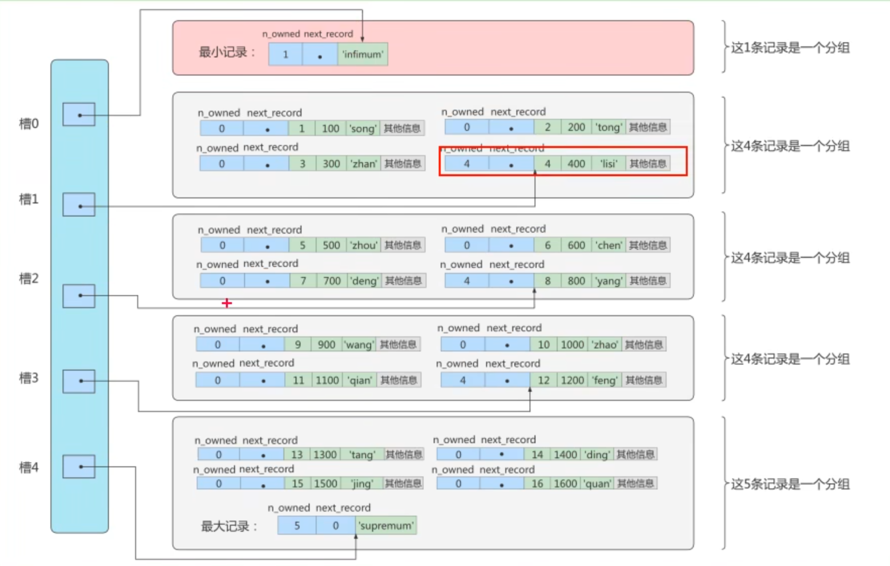
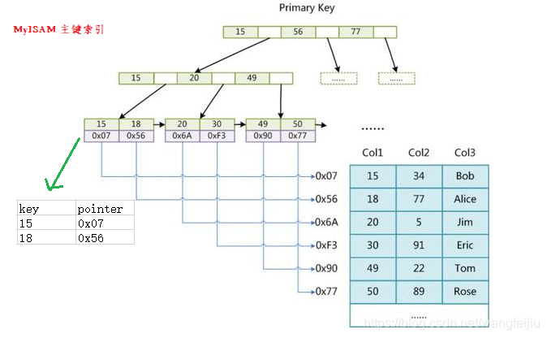

# 数据准备

## 大数据量环境：学生表和课程表

第一步：创建数据库、数据表

```sql
CREATE DATABASE atguigudb1;

USE atguigudb1;

-- 创建学生表和课程表
CREATE TABLE student_info (
    id INT(11) NOT NULL AUTO_INCREMENT,
    student_id INT NOT NULL,
    name VARCHAR(20) DEFAULT NULL,
    course_id INT NOT NULL,
    class_id INT(11) DEFAULT NULL,
    create_time DATETIME DEFAULT CURRENT_TIMESTAMP ON UPDATE CURRENT_TIMESTAMP,
    PRIMARY KEY(id)
) ENGINE=INNODB AUTO_INCREMENT=1 DEFAULT CHARSET=utf8;

CREATE TABLE course (
    id INT(11) NOT NULL AUTO_INCREMENT,
    course_id INT NOT NULL,
    course_name VARCHAR(40) DEFAULT NULL,
    PRIMARY KEY(id)
) ENGINE=INNODB AUTO_INCREMENT=1 DEFAULT CHARSET=utf8;
```

第二步：创建模拟数据必备的存储函数

```sql
-- 是自定义函数可以被创建
SET GLOBAL log_bin_trust_function_creators = 1;

-- 函数1：创建随机产生字符串函数
DELIMITER //
CREATE FUNCTION rand_string(n INT)
    RETURNS VARCHAR(255) -- 该函数会返回一个字符串
BEGIN
    DECLARE chars_str VARCHAR(100) DEFAULT
    'abcdefghijklmnopqrstuvwxyzABCDEFGHIJKLMNOPQRSTUVWXYZ';
    DECLARE return_str VARCHAR(255) DEFAULT '';
    DECLARE i INT DEFAULT 0;
    WHILE i < n DO
    SET return_str = CONCAT(return_str,SUBSTRING(chars_str,FLOOR(1+RAND() * 52), 1));
    SET i = i + 1;
    END WHILE;
    RETURN return_str;
END //
DELIMITER ;

-- 函数2： 创建随机函数
DELIMITER //
CREATE FUNCTION rand_num (from_num INT, to_num INT) RETURNS INT(11)
BEGIN
DECLARE i INT DEFAULT 0;
SET i = FLOOR(from_num + RAND() * (to_num - from_num + 1));
RETURN i;
END //
DELIMITER ;
```

第三步：创建插入模拟数据的存储过程

```sql
-- 存储过程1：创建插入课程表存储过程
DELIMITER //
CREATE PROCEDURE insert_course(max_num INT)
BEGIN
DECLARE i INT DEFAULT 0;
SET autocommit = 0; -- 设置手动提交事务
REPEAT -- 循环
SET i = i + 1; -- 赋值
INSERT INTO course (course_id, course_name) vALUES (rand_num(10000,10100), rand_string(6));
UNTIL i = max_num
END REPEAT;
COMMIT; -- 提交事务
END //
DELIMITER ;

-- 存储过程2：创建插入学生信息表存储过程
DELIMITER //
CREATE PROCEDURE insert_stu(max_num INT)
BEGIN
DECLARE i INT DEFAULT 0;
SET autocommit = 0; -- 设置手动提交事务
REPEAT -- 循环
SET i = i + 1;
INSERT INTO student_info (course_id, class_id, student_id, NAME) vALUES (rand_num(10000,10100), rand_num(10000,10200), rand_num(1,200000), rand_string(6));
UNTIL i = max_num
END REPEAT;
COMMIT; -- 提交事务
END //
DELIMITER ;
```

第四部：调用存储过程

```sql
CALL insert_course(100);

CALL insert_stu(1000000);
```

## 大数据量环境

```sql
CREATE TABLE s1 (
    id INT AUTO_INCREMENT,
    key1 VARCHAR(100),
    key2 INT,
    key3 VARCHAR(100),
    key_part1 VARCHAR(100),
    key_part2 VARCHAR(100),
    key_part3 VARCHAR(100),
    common_field VARCHAR(100),
    PRIMARY KEY(id),
    INDEX idx_key1 (key1),
    UNIQUE INDEX idx_key2 (key2),
    INDEX idx_key3 (key3),
    INDEX idx_key_part(key_part1, key_part2, key_part3)
) ENGINE=INNODB CHARSET=utf8;
```

```sql
CREATE TABLE s2 (
    id INT AUTO_INCREMENT,
    key1 VARCHAR(100),
    key2 INT,
    key3 VARCHAR(100),
    key_part1 VARCHAR(100),
    key_part2 VARCHAR(100),
    key_part3 VARCHAR(100),
    common_field VARCHAR(100),
    PRIMARY KEY (id),
    INDEX idx_key1 (key1),
    UNIQUE INDEX idx_key2 (key2),
    INDEX idx_key3 (key3),
    INDEX idx_key_part(key_part1, key_part2, key_part3)
) ENGINE=INNODB CHARSET=utf8;
```

设置参数log_bin_trust_function_creators

```sql
SET GLOBAL log_bin_trust_function_creators=1
```


创建函数

```sql
DELIMITER //
CREATE FUNCTION rand_string1(n INT)
    RETURNS VARCHAR(255) -- 该函数返回一个字符串
BEGIN
    DECLARE chars_str VARCHAR(100) DEFAULT
    'abcdefghijklmnopqrstuvwxyzABCDEFGHIGKLMNOPQRSTUVWXYZ';
    DECLARE return_str VARCHAR(255) DEFAULT '';
    DECLARE i INT DEFAULT 0;
    WHILE i < n DO
        SET return_str=CONCAT(return_str, SUBSTRING(chars_str, FLOOR(1+RAND()*52),1));
        SET i = i + 1;
    END WHILE;
    RETURN return_str;
END //
DELIMITER ;
```

创建存储过程

```sql
DELIMITER //
CREATE PROCEDURE insert_s1 (IN min_num INT (10), IN max_num INT (10))
BEGIN
    DECLARE i INT DEFAULT 0;
    SET autocommit=0;
    REPEAT
    SET i = i + 1;
    INSERT INTO s1 VALUES(
        (min_num + i),
        rand_string1(6),
        (min_num + 30 * i + 5),
        rand_string1(6),
        rand_string1(10),
        rand_string1(5),
        rand_string1(10),
        rand_string1(10));
    UNTIL i = max_num
    END REPEAT;
    COMMIT;
END //
DELIMITER ;
```

```sql
DELIMITER //
CREATE PROCEDURE insert_s2 (IN min_num INT (10), IN max_num INT (10))
BEGIN
    DECLARE i INT DEFAULT 0;
    SET autocommit=0;
    REPEAT
    SET i = i + 1;
    INSERT INTO s2 VALUES(
        (min_num + i),
        rand_string1(6),
        (min_num + 30 * i + 5),
        rand_string1(6),
        rand_string1(10),
        rand_string1(5),
        rand_string1(10),
        rand_string1(10));
    UNTIL i = max_num
    END REPEAT;
    COMMIT;
END //
DELIMITER ;
```

调用存储过程

```sql
-- s1表数据的添加：加入1万条记录
CALL insert_s1(10001,10000);

-- s2表数据的添加：加入1万条记录
CALL insert_s2(10001,10000);
```

# Mysql架构


## 第一层：连接层

系统(客户端)访问MySQL服务器前，做的第一件事就是建立TCP连接

经过三次握手建立连接成功后，MySQL服务器对TCP传输过来的账号密码做身份认证，权限获取

多个系统都可以和MySQL服务器建立连接，每个系统建立的连接不止一个。所以为了解决TCP无线创建与TCP频繁创建销毁带来的资源耗尽，性能下降等问题。MySQL服务器里会有专门的TCP**连接池**限制连接数，采用长连接模式复用TCP连接

TCP连接收到请求后，必须要分配给一个线程专门与这个客户端的交互。所以还会有一个**线程池**，去走后面的流程

每一个连接从线程池中获取线程，省去了创建和销毁线程的开销

所以连接管理的职责是负责认证，管理连接，获取权限信息。


### Connectors 连接器

连接器对  Native，JDBC，ODBC，NET，PHP，Perl，Python，Ruby，Cobol 等客户端工具或编程 语言的 API 对MySQL 的连接功能进行管理。连接器是 Server 端的第一个模块。

JDBC：Java 数据库连接（ Java DataBase Connectivity ）

ODBC：开放数据库互连（Open Database Connectivity）

### 线程池，连接池

MySQL的线程池是一种重要的技术，旨在提高数据库的性能和资源利用效率。

MySQL 是单进程多线程模型，因此，每个用户连接，都会创建一个连接线程，客户端和服务端通过这个 线程进行数据交互。MySQL 通过线程池来管理这些线程，线程池组件的功能包括登录验证 (authentication)，线程重用(Connection Pool) 等，connection limit 值决定了线程池中线程数 量，也就决定了MySQL服务的最大并发连接数，check memory 用来检测内存，caches 实现线程缓存。

**最大并发连接数，在实际的生产环境中，可以将此参数调大**

```sql
show variables like 'max_connections';
```

MySQL的线程池在提高资源利用效率、减少线程创建和销毁的开销、实现负载均衡以及提高并发处理能力 等方面发挥着重要作用。它是数据库性能优化的重要手段之一，特别适用于高并发环境下的数据库访问。同 时，**线程池还可以与连接池结合使用**，以进一步提高数据库性能。


**线程池**是一种用于管理和复用线程的技术。

线程池可以预先创建并维护 一定数量的线程，这些线程可以被用来处理客户端的请求。

当客户端发送请求时，数据库服务器可以从线程池 中分配一个空闲的线程来处理该请求，而不是为每个请求创建一个新的线程。这样可以减少线程的创建和销毁 开销，提高系统的响应速度和吞吐量。


**连接池**是一种用于管理和复用数据库连接的技术。

连接池可以预先创建并维护一定数量的 数据库连接，这些连接可以被用来执行SQL语句。

当应用程序需要访问数据库时，它可以从连接池中获取一个 空闲的连接，而不是每次都创建一个新的连接。这可以减少连接的创建和销毁开销，提高应用程序的性能和稳 定性。


**特点**

*   资源复用
    *   线程池复用线程，减少了线程的创建和销毁开销。 
    *   连接池复用连接，减少了连接的创建和销毁开销。
*   提高并发处理能力：
    *   线程池可以处理多个并发请求，而不需要为每个请求创建新的线程。 
    *   连接池可以管理多个数据库连接，确保在高并发情况下，应用程序能够迅速获取到数据库连接。
*   优化资源分配
    *   通过线程池和连接池的结合使用，可以更合理地分配系统资源。
*   简化管理
    *   线程池和连接池都提供了对资源和连接的管理功能，使得开发人员可以更加专注于业务逻辑的实现，而不 需要过多关注底层资源的管理。

## 第二层：服务层

第二层架构主要完成大多数的核心服务功能，如SQL接口，并完成`缓存的查询`,SQL的分析和优化及部分内置函数的执行，所有跨存储引擎的功能也在这一层实现。如：过程，函数等。

### SQL Interface：SQL 语句接口

- 接受用户的SQL命令，并且返回用户需要查询的结果
- MySQL支持DML，DDL，存储过程，视图，触发器，自定义函数等多种SQL语言接口


### Parser：解析器

- 在解析器中对SQL语句进行语法分析，语义分析。将SQL语句分解成数据结构，并将这个结构传递到后续步骤，以后SQL语句的传递和处理就是基于这个结构。如果在分解构成中遇到错误，就说明该SQL语句不合理
- 在SQL命令传递到解析器的时候，会被解析器验证和解析，并为其创建语法树，并根据数据字典丰富查询语法树，会验证`该客户端是否具有执行该查询的权限`。创建好语法树后，MySQL还会对SQL查询进行语法上的优化，进行查询重写


### Optimizer：查询优化器

- SQL语句在语法解析之后，查询之前会使用查询优化器确定SQL语句的执行路径，生成一个`执行计划`
- 这个执行计划表明应该使用哪些索引进行查询(全表检索还是索引检索)，表之前的连接顺序如何，最后按照执行计划中的步骤调用存储引擎提供的方法来真正的执行查询，并将结果返回
- 它使用“选取-投影-连接”策略进行查询

```sql
mysql> show status like 'Last_query_cost';
 +-----------------+-----------+
 | Variable_name   | Value     |
 +-----------------+-----------+
 | Last_query_cost | 78.473000 |
 +-----------------+-----------+
 1 row in set (0.00 sec)
```

###  Cache & Buffer：查询缓存

- MySQL内部维持着一些Cache和Buffer，比如Query Cache用来缓存一条SELECT语句的执行结果，如果能够在其中找到对应的查询结果，那么就不必在进行查询解析，优化和执行的整个过程，直接将结果反馈给客户端
- 从MySQL5.7.20开始，不推荐使用查询缓存，并`在MySQL8.0中删除`

## 第三层：引擎层

和其他数据库相比，MySQL的架构可以在多种不同场景中应用并发挥良好作用，主要体现在存储引擎的架构上，`插件式的存储引擎`架构将查询处理和其他的系统任务以及数据的存储提取相分离。这种架构可以根据业务的需求和实际需要选择合适的存储引擎。同时开源的MySQL还允许开发人员设置自己的存储引擎

插件式存储引擎，真正的负责了MySQL中数据的存储和提取，物理服务器级别维护的底层数据执行操作，服务器通过API与存储引擎进行通信，不同的存储引擎具有的功能不同，这样我们可以根据自己的实际需要进行选取。

## MySQL执行查询语句执行流程


1.   接收查询语句
     *   用户通过客户端或编程语言框架里面的驱动模块，经由专门的通信协议，向MySQL服务器发送SQL查询语 句。
     *   数据库服务端内部的连接器接收查询请求后，首先到本地的缓存记录中检索信息；由于查询缓存命中率不高，所以在MySQL8.0之后就抛弃了这个功能
         *   如果有信息，则直接返回查询结果
         *   如果没有信息，则将信息直接传递给后端的数据库解析器来进行处理
2.   词法分析和语法分析
     *   MySQL服务器首先会对接收到的查询语句进行词法分析，将其分解成一系列的词法单元。
     *   接着，进行语法分析，检查这些词法单元是否符合SQL语法规则。如果语法错误，MySQL会立即返回错误 信息。
     *   如果SQL语句正确，则会生成一个语法树
3.   语义分析
     *   在语法分析之后，MySQL会进行语义分析，检查查询语句中的表、列、函数等是否存在，以及用户是否有 足够的权限执行该查询。
     *   语义分析还会检查查询语句中的数据类型是否匹配，以及是否存在违反数据库完整性的约束。
4.   查询优化
     *   MySQL的查询优化器会对查询语句进行优化，决定最优的执行查询计划 -- 也就是怎么走会效率更快。
     *   优化过程包括选择最佳的访问路径、索引、连接顺序等，以最小化查询的执行时间和资源消耗。
     *   优化器还会考虑统计信息，如表的行数、索引的分布等，以做出更明智的决策。
5.   查询执行
     *   优化后的查询计划被传递给执行器进行执行。执行器根据查询计划访问存储引擎，获取数据。
         *   存储引擎将文件系统里面的数据库文件数据，加载到内存，然后在内存中做一次聚合
         *   然后，临时放到查询缓存中，便于下次遇到相同的查询语句重复过来。
     *   在执行过程中，MySQL可能会使用缓存来加速查询的执行。从MySQL 8.0开始，查询缓存已被移除。
         *   查询缓存对动态变化的表效果较差，因为只要表中有任何更新操作（`INSERT`、`UPDATE`、`DELETE`），查询缓存就会失效，导致缓存频繁刷新。
         *   在高并发场景下，查询缓存可能会导致锁争用（Query Cache Mutex Contention），降低整体性能。
         *   维护查询缓存需要额外的内存和 CPU 开销。
         *   MySQL 提供了更高效的查询加速机制，如 InnoDB Buffer Pool、优化的索引使用、应用层缓存等，更适合现代数据库的需求。
6.   结果集返回
     *   执行器将查询结果集返回给客户端。结果集可以包含零行或多行数据，具体取决于查询的内容。
7.   错误处理和日志记录
     *   如果在执行过程中遇到任何错误（如权限不足、表不存在等），MySQL会返回相应的错误信息给客户端。 
     *   同时，MySQL还会记录查询的执行日志，以便进行性能分析和故障排查。

# 存储引擎

MySQL中的数据用各种不同的技术存储在文件（或者内存）中。这些技术中的每一种技术都使用不同的存 储机制、索引技巧、锁定水平并且最终提供广泛的不同的功能和能力，此种技术称为存储引擎，MySQL 支持多 种存储引擎，其中目前应用最广泛的是 InnoDB 和 MyISAM 两种。

```sql
SHOW ENGINES;

SHOW VARIABLES LIKE '%storage_engine%';

select @@default_storage_engine;

# 修改存储引擎
SET DEFAULT_STORAGE_ENGIN=MyISAM;

-- 或者修改配置文件
default-storage-engine=MyISAM
```

**引擎功能支持**

| Feature (功能)                                           | MyISAM       | Memory           | InnoDB       | Archive      | NDB          |
| -------------------------------------------------------- | ------------ | ---------------- | ------------ | ------------ | ------------ |
| B-tree indexes (B树索引)                                 | Yes          | Yes              | Yes          | No           | No           |
| Backup/point-in-time recovery (note 1)                   | Yes          | Yes              | Yes          | Yes          | Yes          |
| Cluster database support (集群数据库支持)                | No           | No               | No           | No           | Yes          |
| Clustered indexes (聚集索引)                             | No           | No               | Yes          | No           | No           |
| Compressed data (压缩数据)                               | Yes (note 2) | No               | Yes          | Yes          | No           |
| Data caches (数据缓存)                                   | No           | N/A              | Yes          | No           | Yes          |
| Encrypted data (加密数据)                                | Yes (note 3) | Yes (note 3)     | Yes (note 4) | Yes (note 3) | Yes (note 5) |
| Foreign key support (外键支持)                           | No           | No               | Yes          | No           | Yes          |
| Full-text search indexes (全文索引)                      | Yes          | No               | Yes (note 6) | No           | No           |
| Geospatial data type support (地理空间数据类型支持)      | Yes          | No               | Yes          | Yes          | Yes          |
| Geospatial indexing support (地理空间索引支持)           | Yes          | No               | Yes (note 7) | No           | No           |
| Hash indexes (哈希索引)                                  | No           | Yes              | No (note 8)  | No           | Yes          |
| Index caches (索引缓存)                                  | Yes          | N/A              | Yes          | No           | Yes          |
| Locking granularity (锁粒度)                             | Table        | Table            | Row          | Row          | Row          |
| MVCC (多版本并发控制)                                    | No           | No               | Yes          | No           | No           |
| Replication support (note 1) (复制支持)                  | Yes          | Limited (note 9) | Yes          | Yes          | Yes          |
| Storage limits (存储限制)                                | 256TB        | RAM              | 64TB         | None         | 384EB        |
| T-tree indexes (T树索引)                                 | No           | No               | No           | No           | Yes          |
| Transactions (事务)                                      | No           | No               | Yes          | No           | Yes          |
| Update statistics for data dictionary (数据字典统计更新) | Yes          | Yes              | Yes          | Yes          | Yes          |

笔记：

1.   在服务器中实现，而不是在存储引擎中实现。
2.   仅当使用压缩行格式时才支持压缩的MyISAM 表。使用 MyISAM 压缩行格式的表是只读的。
3.   通过加密功能在服务器中实现。
4.   通过加密功能在服务器中实现；在 MySQL 5.7 及更高版本中，支持静态数据加密。
5.   通过加密功能在服务器中实现；自 NDB 8.0.22 起加密的 NDB 备份； NDB 8.0.29 及更高版本支持透明 NDB 文件系统加密
6.   MySQL 5.6 及更高版本支持 FULLTEXT 索引。
7.   MySQL 5.7 及更高版本中提供了对地理空间索引的支持。
8.   InnoDB 在内部利用哈希索引来实现其自适应哈希索引功能。


*   **MyISAM**：一种非常常见的 MySQL 存储引擎，适用于读密集型应用。

*   **Memory**：数据存储在内存中，速度非常快，但断电时数据丢失。

*   **InnoDB**：MySQL 默认的事务性存储引擎，支持行级锁和外键约束。

*   **Archive**：主要用于存储归档数据，支持压缩。

*   **NDB**：MySQL Cluster 存储引擎，支持高可用、高并发的分布式数据库架构。

## MyISAM 存储引擎

### 引擎特点

*   不支持事务- 表级锁定
*   读写相互阻塞，写入不能读，读时不能写
*   只缓存索引
*   不支持外键约束
*   不支持聚簇索引
*   支持全文索引
*   读取数据较快，占用资源较少
*   不支持MVCC（多版本并发控制机制）高并发
*   崩溃恢复性较差
*   MySQL5.5.5 前默认的数据库引擎

MyISAM提供了大量的特性，包括全文索引，压缩，空间函数(GIS)等，但MyISAM`不支持事务、行级锁，外键`，有一个毫无疑问的缺陷就是`崩溃后无法安全恢复`

优势是访问速度快，对事务完整性没有要求或者以SELECT、INSERT为主的应用

针对数据统计有额外的常数存储。故而count(*)的查询效率很高

### MyISAM 存储引擎相关文件

*   tbl_name.frm 表格式定义
*   tbl_name.sdi 表格式定义（mysql8.0开始，但是MariaDB目前依然在使用frm）
*   tbl_name.MYD 数据文件
*   tbl_name.MYI 索引文件

### MyISAM 存储引擎适用场景

*   读多写少的业务（或者只读的业务）
*   不需要事务支持的业务（比如转账，充值这种业务就不行）
*   并发访问低的业务
*   对数据一致性要求不高的业务
*   表较小（可以接受长时间进行修复操作）

## InnoDB 存储引擎

### InnoDB 存储引擎特点

*   支持事务，适合处理大量短期事务
*   行级锁定
*   读写阻塞与事务隔离级别相关
*   可缓存数据和索引
*   支持聚簇索引
*   崩溃恢复性更好
*   支持MVCC高并发
*   支持表分区，支持表空间
*   从MySQL5.5 后支持全文索引
*   从MySQL5.5.5 开始为默认的数据库引擎

InnoDB是MySQL的`默认事务型引擎`，它被设计用来处理大量的短期(short-livedd)事务。可以确保事务的完整提交(Commit)和回滚(Rollback).

除了增加和查询外，还需要更新，删除操作，那么应优先选择InnoDB存储引擎

除非有非常特别的原因需要使用其他的存储引擎，否则应该优先考虑InnoDB引擎

InnoDB是`为处理巨大数据量的最大性能设计`

对比MyISAM的存储引擎，InnoDB写的处理效率差一些，并且会占用更多的磁盘空间以保存数据和索引

MyISAM只缓存索引，不缓存真实数据；InnoDB不仅缓存索引还要缓存真实数据，对内存要求较高，而且内存大小对性能有决定性影响

InnoDB用的行锁，并发效率更高

### InnoDB 存储引擎相关文件

*   tbl_name.frm 表格式定义
*   tbl_name.ibd 数据和索引文件

### InnoDB 存储引擎适用场景

*   数据读写都较为频繁的业务
*   需要事务支持的业务
*   对并发要求较高的业务
*   对数据一致性要求较高的业务

### Archive引擎：用于数据存档

- `archive`是`归档`的意思，仅仅支持`插入`和`查询`两种功能（行被插入后不能再修改）
- 在MySQL5.5后`支持索引`功能
- 拥有很好的压缩机制，使用`zlib压缩库`，在记录请求的时候实时进行压缩，经常被用来作为仓库使用
- 创建Archive表时，存储引擎会创建名称以表名开头的文件。数据文件的扩展名是.ARZ
- 根据英文的测试结论来看，同样数据下，`Archive比MyISAM表要小75%，比支持事务处理的InnoDB表小大约83%`。
- ARCHIVE存储引擎采用了行级锁。
- ARCHIVE表`适合日志和数据采集(归档)类应用`适合存储大量的独立的作为历史记录的数据，拥有很高的插入速度，但是对查询的支持较差  

### CSV引擎：存储数据时，以逗号分隔各个数据项

- CSV引擎可以将`普通的CSV文件作为MySQL的表来处理`，但不支持索引
- CSV引擎可以作为一种数据交换的机制，非常有用
- CSV存储的数据直接可以在操作系统里，用文件编辑器，或者excel读取
- 对数据的快速导入，导出有明显优势。

### Memory引擎：置于内存的表

- 概述：
    - Memory采用的逻辑介质是`内存`，`响应速度快`，但是当mysqld守护进程崩溃的时候，数据会丢失。另外，要求存储的数据是数据长度不变的格式

- 主要特征
    - Memory同时支持HASH索引和B+树索引
        - Hash索引相等的比较快，但是对于范围的比较慢很多
        - 默认使用Hash索引，其速度要比B型树索引快
        - 如果希望使用B树索引，可以在创建索引时选择使用
    - Memory表至少比MyISAM表要快一个数量级
    - Memory表的大小是收到限制的。表的大小主要取决于两个参数，分贝是`max_rows`和`max_heap_table_size`。其中，max_rows可以在创建表时指定；max_heap_table_size的大小默认为16MB，可以按需要进行扩大。
    - 数据文件于索引文件分开存储
        - 每个基于Memory存储引擎的表实际对应一个磁盘文件，该文件的文件名与表名相同，类型为`frm类型`，该文件中只存储表的结构，而且`数据文件都是存储在内存中`
        - 这样有利于数据的快速处理，提供整个表的处理效率
    - 缺点:其数据易丢失，生命周期短。基于这个缺陷，选择Memory存储引擎时要特别小心。

- 使用Memory存储引擎的场景
    - 目标数据比较小，而且非常频繁的进行访问，在内存中存放数据，如果太大的数据会造成内存溢出。可以通过参数`max_heap_table_size`控制Memory表的大小，限制Memory表的最大的大小。
    - 如果数据是临时的，而且必须立即可用得到，那么就可以放在内存中
    - 存储在Memory表中的数据如果突然间`丢失的话也没有太大的关系`

## InnoDB数据存储结构

### 数据库的存储结构：页

InnoDB将数据划分为若干个页，InnoDB中页的大小默认为16KB。

页a、页b、页c...页n这些页可以`不在物理结构上相连`，只要通过`双向链表`相关联即可。每个数据页中的记录会按照主键值从小到大的顺序组成一个`单项链表`，每个数据页都会存储在它里面的记录生成一个`页目录`，在通过主键查找某条记录的时候可以在页目录中`使用二分查找`快速定位对应的槽，然后再遍历该槽对应分组中的记录即可，快速找到指定记录

```sql
show variables like `innodb_page_size%`;
```


- 区(Extent)
    - 是比页大一级的存储结构，在InnoDB存储引擎中，一个区会分配64个连续的页。因为InnoDB中的页大小默认是16KB，所以一个区的大小是64*16KB=1MB

- 段(Segment)
    - 由一个或多个区组成，区在文件系统是一个连续分配的空间（在InnoDB中是连续的64个页），不过在段中不要求区与区之间是相邻的。`段是数据库中的分配单位，不同类型的数据库对象以不同的段形式存在`。当我们创建数据表、索引的时候，就会相应创建对应的段，比如创建一张表时会创建一个表段，创建一个索引时会创建一个索引段

- 表空间(Tablespace)是一个逻辑容器，表空间存储的对象是段，在一个表空间中可以有一个或多个段



### 页的内部结构

页如果按类型划分的话，常见的有`数据页(保存B+树节点)、系统页、Undo页和事务数据页`等。数据页是我们最常使用的页。

数据页的16KB大小的存储空间被划分为七个部分，分别是

- 文件头(File Header)【38字节】
    - 文件头，描述页的信息
- 页头(Page Header)【56字节】
    - 页头，页的状态信息
- 最大最小记录(Infimum + supermum)【26字节】
    - 最大和最小的记录，这是两个虚拟的行记录
- 用户记录(User Records)、
    - 用户记录、存储记录内容
- 空闲空间(Free Space)
    - 页中还没有被使用的空间
- 页目录(Page Directory)
    - 存储用户记录的相对位置
- 文件尾(File Tailer)
    - 文件尾，校验页是否完整

### 区、段、碎片区与表空间

#### 区的分类

区大体可以分为4种类型

- `空闲的区(FREE)`：现在还没有用到这个区中的任何页面
- `有剩余空间的碎片去(FREE_FRAG)`：表示碎片区中还有可以空间
- `没有剩余空间的碎片去(FULL_FRAG)`：表示碎片区中的所有页面都被使用，没有空闲页面
- `附属于某个段的区(FSEG)`：每个索引都可以分为叶子节点段和非叶子节点段

处于`FREE`,`FREE_FRAG`,`FULL_FRAG`这三种状态的区都是独立的，直属于表空间。而处于`FSEG`状态的区是附属于某个段的

#### 为什么要有区？

为了防止链表中相邻的两个页物理位置离的很远，产生随机I/O。应尽量`让链表中相邻的页的物理位置也相邻`，这样进行范围查询的时候才可以使用所谓的`顺序I/O`（减少巡道，半圈旋转等时间）

因此引入`区`的概念，一个区就是在`物理位置上连续的64个页`。因为InnoDB中的页大小默认是16KB，所以一个区的大小是64*16KB=`1MB`。

在表中数据量大的时候，为某个索引分配空间的时候就不再按照页为单位分配了，而是按照`区为单位分配`，甚至在表中的数据特别多的时候，可以一次性分配多个连续的区。虽然可能造成一点点空间的浪费（数据不足以填充满整个区），但是从性能的角度看，可以消除很多的随机I/O，`功大于过`。


#### 为什么要有段？

对于范围查询，其实是对B+树叶子节点中的记录进行顺序扫描，而如果不区分叶子节点和非叶子节点，统统把节点代表的页面放到申请到的区中的话，进行范围查找的效果就会大打折扣。所以InnoDB对B+树的`叶子节点`和`非叶子节点`进行了区别对待，也就是说叶子节点有自己独有的区，非叶子节点也有自己独有的区。存放一个叶子阶段的区的集合就算是一个段(segment)，存放非叶子节点的集合也算一个段。也就是说，`一个索引会生成2个段`。一个`叶子节点段`,一个`非叶子节点段`。

除了索引的叶子节点段和非叶子节点段之外，InnoDB还有为存储一些特殊的数据而定义的段，比如回滚段。所以，常见的段有`数据段`、`索引段`、`回滚段`。数据段即为B+树的叶子结点了，索引段即为B+树的非叶子阶段  

段其实不对应表空间中某一个连续的物理区域，而是一个逻辑上的概，由若干个`零散的页面`以及一个一些`完整的区`组成


#### 为什么要有碎片区

默认情况下，一个使用InnoDB存储引擎的表只有一个聚簇索引，一个索引生成2个段，而段是以区为单位申请的存储空间，一个区默认占用1M存储空间，所以`默认情况下一个只存了几条记录的小表也需要2M的存储空间吗？`

考虑到这种存储空间浪费的情况，InnoDB提出来一个`碎片区`的概念。在一个碎片区，并不是所有的页都是为了存储同一个段的数据而存在的，而是碎片区中的页可以用于不同的目的，比如有些页用于段A，有些页用于段B，有些页不属于任何段。碎片区直属表空间

所以为某个段分配存储空间的策略是这样的：

- 在刚开始向表中插入数据的时候，段是从某个碎片区以单个页面为单位来分配空间的
- 当某个段已经占用了32个碎片区页面之后，就会申请以完整的区为单位来分配存储空间

所以现在段不能仅定义是某些区的集合，更精确的应该是`某些零散的页面`以及`一些完整的区`的集合

#### 表空间

**独立表空间**（**Independent Tablespace**）和 **共享表空间**（**Shared Tablespace**）是数据库表空间管理中的两种不同方式，它们通常在不同的使用场景下有着不同的管理和存储策略。

##### 独立表空间（Independent Tablespace）

**独立表空间**是指每个数据库对象（如表、索引等）都分配在一个独立的表空间中。也就是说，每个表空间只存储某一个或一组特定的数据库对象，不与其他数据库对象共享存储空间。

在 **MySQL InnoDB** 中，多个表通常存储在同一个独立表空间中。

```sql
show variables like 'innodb_file_per_table';
```

##### 共享表空间（Shared Tablespace）

**共享表空间**是指多个数据库对象（如表、索引等）共享同一个表空间进行存储。也就是说，在同一个表空间内，可以存储多个不同类型的数据库对象。这种方式更适用于一些资源共享的场景，例如，在一些数据库中可能会有多个表、索引或临时数据对象存储在同一个表空间中。

## 其它存储引擎

*   Performance_Schema：Performance_Schema 数据库使用。

*   MRG_MyISAM：使MySQL DBA或开发人员能够对一系列相同的MyISAM表进行逻辑分组，并将它 们作为一个对象引用。适用于VLDB(Very Large Data Base)环境，如数据仓库。
*   Federated联合：用于访问其它远程MySQL服务器一个代理，它通过创建一个到远程MySQL服务器 的客户端连接，并将查询传输到远程服务器执行，而后完成数据存取，提供链接单独MySQL服务器 的能力，以便从多个物理服务器创建一个逻辑数据库。非常适合分布式或数据集市环境。
*   BDB：可替代InnoDB的事务引擎，支持COMMIT、ROLLBACK和其他事务特性。
*   Cluster/NDB：MySQL的簇式数据库引擎，尤其适合于具有高性能查找要求的应用程序，这类查找 需求还要求具有最高的正常工作时间和可用性。
*   BLACKHOLE：黑洞存储引擎接受但不存储数据，检索总是返回一个空集。该功能可用于分布式数 据库设计，数据自动复制，但不是本地存储。

# 索引与性能优化

索引是存储引擎用于快速找到数据记录的一种数据结构

进行数据查找时，首先查看查询条件是否命中某条索引，符合则`通过索引查找`相关数据，如果不符合则需要`全表扫描`，即需要一条一条地查找记录，直到找到与条件符合的记录。

建索引的目的就是`减少磁盘I/O的次数`，加快查询速率

`索引是在存储引擎中实现的`，因此每种存储引擎的索引不一定完全相同，并且每种存储引擎不一定支持所有索引类型。`不同存储引擎，索引的表现形式不同`


**在频繁插入数据的场景下：**

**索引可以提高查询的速度，但是会影响插入记录的速度。这种情况下，最好的办法是先删除表中的索引，然后插入数据，插入完成后再创建索引**


*   **优点**

    *   **提高查询效率**：索引能够加速 SELECT 查询的执行速度，尤其是在大数据量的表中。

    *   **支持排序与分组**：索引可提高 `ORDER BY` 和 `GROUP BY` 操作的性能。

    *   **支持唯一性约束**：如主键和唯一索引，能够保证数据的唯一性

*   **缺点**

    *   **占用存储空间**：每个索引都会占用磁盘空间，尤其是复合索引可能会占用较多存储。

    *   **影响写操作**：索引会增加 `INSERT`, `UPDATE`, `DELETE` 等操作的开销，因为需要维护索引数据。

    *   **选择不当可能导致性能下降**：不恰当的索引选择可能会导致查询性能下降，尤其是对于低选择性的列。

## 索引结构

### B树


###  B+树


B+树是 B 树的一个变种，二者的主要区别如下：

| 特性         | B 树                                         | B+ 树                                                        |
| ------------ | -------------------------------------------- | ------------------------------------------------------------ |
| **数据存储** | 数据存储在所有节点中，包括叶子和非叶子节点   | 只有叶子节点存储实际数据或指针，非叶子节点只存储索引         |
| **叶子节点** | 叶子节点和非叶子节点的数据分布不一定平衡     | 所有的叶子节点都在同一层，且通过链表连接                     |
| **查询效率** | 查找时需要访问更多的节点，效率较低           | 查找时需要访问较少的节点，效率较高                           |
| **范围查询** | 范围查询较为复杂，需要多次查找               | 范围查询效率高，可以通过链表快速访问连续的记录               |
| **索引结构** | 每个节点存储索引和数据，索引和数据分布较分散 | 只有叶子节点存储数据，非叶子节点只存储索引，提高了索引结构的纯净性 |


### InnoDB 引擎中一颗的 B+ 树可以存放多少行数据？

假设定义一颗B+树高度为2，即一个根节点和若干叶子节点。

​		那么这棵B+树的存放 总行记录数=根节点指针数*单个叶子记录的行数。

​		B+树中的单个叶子节点的大小为16K，假设每一条目为1K，那么记录数即为16(16k/1K=16)

​		计算非叶子节点能够存放多少个指针，

​			假设主键ID为bigint类型，那么长度为8字节， 

​			而指针大小在InnoDB中是设置为6个字节，这样加起来一共是14个字节。 

​			那么通过页大小/(主键ID大小+指针大小），即16384/14=1170个指针，

所以一颗高度为2的B+树能存放16*1170=18720条这样的记录。

根据这个原理就可以算出一颗高度为3的B+树可以存放16*1170*1170=21902400条记录。

### hash

哈希索引就是采用一定的哈希算法，把键值换算成新的哈希值，检索时不需要类似B+树那样从根节点到叶子节点逐级查找，只需一次哈希算法即可立刻定位到相应的位置，速度非常快。


Hash索引仅仅能满足`"=",“IN"和”<=>"`查询，不能使用范围查询。也不支持任何范围查询，例如`WHERE price > 100`。

## 索引类型

**索引类型** 决定了数据库使用的具体数据结构和存储方式。

MySQL 的索引有两种分类方式：逻辑分类和物理分类。

MySQL的索引包括普通索引、唯一性索引、全文索引、单列索引、多列索引、空间索引等

- 从功能的逻辑上说，索引主要有4种
    - 普通索引
    - 唯一索引
    - 主键索引
    - 全文索引
- 按照物理实现方式，索引可以分2种
    - 聚簇索引
    - 非聚簇索引
- 按照作用字段个数进行划分
    - 单列索引
    - 联合索引

### 逻辑分类

#### 主键索引（Primary Key Index）

**定义**：主键索引是一个特殊的唯一索引，用于唯一标识表中的每一行数据。每个表只能有一个主键，且主键列的值不能为空。

**特点**：主键索引通常使用 **聚簇索引**（Clustered Index）来实现。在 InnoDB 存储引擎中，主键索引决定了数据的物理存储顺序。

**用途**：适用于需要确保唯一性和快速查询的场景

#### 唯一索引（Unique Index）

**定义**：唯一索引用于确保某一列或某几列的值在表中是唯一的。唯一索引允许索引列的值为 **NULL**（但一列可以有多个 NULL 值）。

**特点**：唯一索引通常是 **非聚簇索引**。它和主键索引类似，但是可以在有 NULL 值的情况下使用。

**用途**：适用于需要确保唯一性但不一定作为主键的列。

#### 普通索引（Non-Unique Index）

-   **定义**：普通索引是一种没有唯一性要求的索引，可以包含重复值。它用于加速对某个列或多个列的查找操作。
-   **特点**：普通索引通常是 **非聚簇索引**。它并不保证索引列的值唯一，仅仅是为了提高查询效率。
-   **用途**：适用于任何需要加速查询但不要求唯一性的场景。

#### 全文索引（Full-Text Index）

**定义**：全文索引用于加速基于文本的搜索，特别是用于处理长文本数据（如文章内容、评论等）。全文索引适用于对文本字段进行 **全文搜索**（如 `MATCH` 和 `AGAINST`）。

**特点**：全文索引支持快速搜索文本数据，特别是在多词匹配时的效率较高。

**用途**：适用于需要执行关键字搜索、模糊查询或多词匹配的场景。

- 目前`搜索引擎`使用的关键技术
- 查询数据量较大的字符串类型的字段时，使用全文索引可以提高查询速度
- 随着大数据时代的到来，关系型数据库应对全文索引的需求已力不从心，逐渐被`solr`、`ElasticSearch`等专门的搜索引擎所替代


#### 复合索引（Composite Index）

**定义**：复合索引是由多个列组成的索引，用于加速同时包含多个列的查询。复合索引不仅考虑索引列的顺序，而且优化了多列组合条件的查询性能。

**特点**：复合索引是 **非聚簇索引**，它会根据多个列的值来构建索引。查询时，如果查询条件涉及复合索引的前缀列，复合索引将大幅提高查询效率。

**用途**：适用于需要同时根据多个字段过滤数据的查询场景。

### 物理分类

#### 聚簇索引（clustered index）

聚簇索引（clustered index）不是单独的一种索引类型，而是一种数据存储方式。这种存储方式是依靠B+树来实现的，根据表的主键构造一棵B+树且B+树叶子节点存放的都是表的行记录数据时，方可称该主键索引为聚簇索引。聚簇索引也可理解为将数据存储与索引放到了一块，找到索引也就找到了数据。


B+树的索引构建方式就是聚簇索引，所有的用户数据都存储在叶子节点上，也就是`索引即数据，数据即索引`

特点：

- 使用记录主键值的大小进行记录和页的排序，这包括三个方面的含义：
    - 页内的记录是按照主键的大小顺序排成一个单向链表
    - 各个存放用户记录的页也是根据页中用户记录的主键大小顺序排成一个双向链表
    - 存放`目录项记录的页`分为不同的层次，在同一层次中的页，也就是根据页中目录项记录的主键大小顺序排成一个双向链表

优点

- `数据访问更快`，因为聚簇索引将索引和数据保存在一个B+树中，因此从聚簇索引中获取数据比非聚簇索引更快

- 聚簇索引对于主键的`排序查找`和`范围查找`速度非常快

- 按照聚簇索引排列顺序，查询显示一定范围数据的时候，由于数据都是紧密相连的，数据库不用从多个数据块中个提取数据，所以节省了大量的IO操作


缺点

- `插入速度严重依赖插入操作`，按照主键的顺序插入是最快的方式，否则将会出现页分裂，严重会影响性能。因此，对于InnoDB表，我们一般对定义一个自增的ID列为主键

- `更新主键的代价很高`，因为将导致被更新的行移动。因此，对于InnoDB表，我们一般定义为主键不可更新

- `二级索引访问需要两次索引查找`,第一次找主键值，第二次根据主键值找到行数据

限制

- 对于MySQL数据库目前只有InnoDB数据引擎支持聚簇索引，而MyISAM并不支持聚簇索引

- 由于数据物理存储方式只能有一种，所以每个MySQL的表只能有一个聚簇索引。一般情况下就是该表的主键

- 如果没有定义主键，InnoDB会选择`非空唯一索引`代替。如果没有这样的索引，InnoDB会隐式的定义一个主键来作为聚簇索引

- 为了充分利用聚簇索引的聚簇的特性，所以InnoDB表的主键尽量选用有序的顺序id，而不建议用无序的id

#### 非聚簇索引

非聚集索引也称为二级索引或辅助索引

非聚簇索引：数据和索引是分开的，B+树叶子节点存放的不是数据表的行记录。

虽然InnoDB和MyISAM存储引擎都默认使用B+树结构存储索引，但是只有InnoDB的主键索引才是聚簇索引，InnoDB中的辅助索引以及MyISAM使用的都是非聚簇索引。每张表最多只能拥有一个聚簇索引。



innodb中的二级索引会`回表`

- 二级索引中，通过C2找到对应的C1主键的数据，然后在回到之前的聚簇索引，根据C1主键找到对应的C3的数据，这个过程就叫`回表`

- 因为这种按照`非主键列`建立的B+树需要一次回表操作才可以定位到完整的用户记录，所以这种B+树也称为二级索引，或者辅助索引。由于我们使用的是C2列的大小作为B+树的排序规则，所以我们也称这个B+树是为C2列建立的索引

- 非聚簇索引的存在不影响聚簇索引中的组织，因此一张表可以有多个非聚簇索引

## 索引管理

### 创建索引

使用CREATE TABLE创建表时，除了可以定义列的数据类型外，还可以定义主键约束、外键约束或者唯一约束，而不论创建哪种约束，在定义约束的同时相当于在指定列上创建一个索引

隐式的方式创建索引

```sql
-- 隐式的方式创建索引
-- 在声明有主键、外键、唯一性约束的字段上会自动添加相关的索引
CREATE TABLE dept (
    dept_id INT PRIMARY KEY AUTO_INCREMENT, -- 索引
    dept_name VARCHAR(20)
);

CREATE TABlE emp(
    emp_id INT PRIMARY KEY AUTO_INCREMENT,-- 索引
    emp_name VARCHAR(20) UNIQUE,-- 索引
    dept_id INT,
    CONSTRAINT emp_dept_id_fk FOREIGN KEY(dept_id) REFERENCES dept(dept_id)-- 索引
);
```

显示的方式创建索引

```sql
-- 显示的方式创建索引
CREATE TABLE table_name [col_name data_type]
[UNIQUE | FULLTEXT | SPATIAL] [INDEX | KEY] [index_name] (col_name [length]) [ASC|DESC]

-- UNIQUE、FULLTEXT和SPATIAL为可选参数，分别表示唯一索引、全文索引和空间索引
-- INDEX和KEY为同义词，两者作用相同，用来指定创建索引
-- index_name指定索引的名称，为可选参数，如果不指定，那么默认col_name为索引名
-- col_name为需要创建索引的字段列，该列必须从数据表中定义的多个列中选择
-- length可选参数，表示索引长度，只有字符类型的字段才能指定索引长度
-- ACS或DESC指定升序或降序的索引值存储

# 显示的方式创建普通索引
CREATE TABLE book(
    book_id INT,
    book_name VARCHAR(100),
    AUTHORS VARCHAR(100),
    info VARCHAR(100),
    COMMENT VARCHAR(100),
    year_publication YEAR,
    -- 声明索引
    INDEX idx_bname(book_name)
)

# 显示创建唯一索引
CREATE TABLE book1(
    book_id INT,
    book_name VARCHAR(100),
    AUTHORS VARCHAR(100),
    info VARCHAR(100),
    COMMENT VARCHAR(100),
    year_publication YEAR,
    -- 声明索引
    UNIQUE INDEX idx_cmt(COMMENT)
    -- 唯一性索引，间接的相当于COMMENT字段有唯一性，不能创建相同的值
)

# 主键索引
-- 通过定义主键约束的方式定义主键索引
-- 通过删除主键约束的方式删除主键索引

# 创建联合索引
CREATE TABLE book4(
    book_id INT,
    book_name VARCHAR(100),
    AUTHORS VARCHAR(100),
    info VARCHAR(100),
    COMMENT VARCHAR(100),
    year_publication YEAR,
    -- 声明索引
    -- 最左前缀原则
    UNIQUE INDEX mul_bid_bname_info(book_id,book_name,info) 
)
-- 最左前缀原则 是指数据库在使用复合索引（由多个列组成的索引）时，会按照索引中列的定义顺序，从左到右依次匹配查询条件。
```

### 添加索引

使用ALTER TABLE语句创建索引

```sql
ALTER TABLE table_name ADD [UNIQUE|FULLTEXT|SPATIAL] [INDEX|KEY] [index_name] (col_name[length],...) [ASC|DESC]
```

示例

```sql
-- ALTER TABLE... ADD...
ALTER TABLE book5 ADD INDEX idx_cmt(COMMENT);

ALTER TABLE book5 ADD UNIQUE uk_idx_bname(book_name);

-- 创建联合索引的时候，建议将常用字段放在前面
ALTER TABLE book5 ADD INDEX mul_bid_bname_info(book_id,book_name,info);
```

使用CREATE INDEX ... ON ...

```sql
CREATE TABLE book6(
    book_id INT,
    book_name VARCHAR(100),
    AUTHORS_VARCHAR(100),
    info VARCHAR(100),
    COMMENT VARCHAR(100),
    year_publication YEAR
);

CREATE INDEX idx_cmt ON book6(COMMENT);

CREATE UNIQUE INDEX uk_idx_bname ON book6(book_name);

CREATE INDEX mul_bid_bname_info ON book6(book_id, book_name, info);
```

### 查看索引

```sql
SHOW INDEX FROM [db_name.]tbl_name;
```

### 删除索引

使用ALTER TABLE删除索引

```sql
ALTER TABLE table_name DROP INDEX index_name;
```

- 范例

```sql
ALTER TABLE book DROP INDEX idx_bk_id;
-- 提示
-- 添加AUTO_INDREMENT约束字段的唯一索引不能被删除
```

使用DROP INDEX语句删除索引

```sql
DROP INDEX index_name ON table_name; 
```

### MySQL8.0索引特性

#### 支持降序索引

示例

```sql
CREATE TABLE ts1(
    a INT, 
    b INT,
    INDEX idx_a_b(a ASC, b DESC) 
);
```

#### 隐藏索引

在MySQL5.7版本及以前，只能通过显式的方式删除索引。此时，如果删除索引后出现错误，又只能通过显式创建索引的方式将删除的索引创建回来。如果数据表中的数据量非常大，或者数据表本身比较大，这种操作就会消耗系统过多的资源，操作成本非常高

从MySQL8.0开始支持`隐藏索引(invisible Indexes)`，只需要将待删除的索引设置为隐藏索引，使查询优化器不再使用这个索引(即使使用force index(强制使用索引)，优化器也不会使用该索引)，确认将索引设置为隐藏索引后系统不受任何响应，就可以删除索引。`这种通过先将索引设置为隐藏索引，再删除索引的方式就是软删除`

同时，如果你想验证这个索引删除之后的`查询性能影响`，就可以暂时先隐藏该索引

```
注意:
主键不能被设置为隐藏索引。当表中没有显示主键时，表中第一个唯一非空索引会成为隐式主键，也不能设置隐藏索引
```

索引默认是可见的，在使用CREATE TABLE，CREATE INDEX或者ALTER TABLE等语句时可以通过`VISIBLE`或者`INVISIBLE`关键词设置索引的可见性

**注意：**

当索引被隐藏时，它的内容仍然是和正常索引一样实时更新的。如果一个索引需要长期被隐藏，那么可以将其删除，因为索引的存在会影响插入，更新和删除的性能。

**创建表时之间创建**

```sql
CREATE TABLE tablename(
    propname1 type1[CONSTRAINT1],
    propname2 type2[CONSTRAINT2],
    ...
    propnamen typen[CONSTRAINTn],
    INDEX [indexname] (propname1 [length]) INVISIBLE
);
```

示例

```sql
CREATE TABLE book7 (
    book_id INT,
    book_name VARCHAR(100),
    AUTHORS VARCHAR(100),
    info VARCHAR(100),
    COMMENT VARCHAR(100),
    year_publication YEAR,
    -- 创建不可见的索引
    INDEX idx_cmt(COMMENT) invisible
);

SHOW INDEX FROM book7;
```

**创建表以后**

```sql
ALTER TABLE book7
ADD UNIQUE INDEX uk_idx_bname(book_name) invisible;

CREATE INDEX idx_year_pub ON book7(year_publicationi) invisible;
```

**修改索引的可见性**

```sql
ALTER TABLE book7 ALTER INDEX idx_year_pub invisible;

EXPLAIN SELECT * FROM book7 WHERE year_publication = '2002';
```


## 索引优化

*   独立地使用列：尽量避免其参与运算，独立的列指索引列不能是表达式的一部分，也不能是函数的 
*   参数，在where条件中，始终将索引列单独放在比较符号的一侧，尽量不要在列上进行运算（函数 操作和表达式操作） 
*   左前缀索引：构建指定索引字段的左侧的字符数，要通过索引选择性（不重复的索引值和数据表的 记录总数的比值）来评估，尽量使用短索引，如果可以，应该制定一个前缀长度 
*   多列索引：AND操作时更适合使用多列索引，而非为每个列创建单独的索引 
*   选择合适的索引列顺序：无排序和分组时，将选择性最高放左侧 
*   只要列中含有NULL值，就最好不要在此列设置索引，复合索引如果有NULL值，此列在使用时也不 会使用索引 
*   对于经常在where子句使用的列，最好设置索引 
*   对于有多个列where或者order by子句，应该建立复合索引 
*   对于like语句，以 % 或者 _ 开头的不会使用索引，以 % 结尾会使用索引 
*   尽量不要使用not in和<>操作，虽然可能使用索引，但性能不高 
*   不要使用RLIKE正则表达式会导致索引失效 查询时，
*   能不要\*就不用\*，尽量写全字段名，比如：select id,name,age from students; 
*   大部分情况连接效率远大于子查询 
*   在有大量记录的表分页时使用limit 
*   对于经常使用的查询，可以开启查询缓存 
*   多使用explain和profile分析查询语句 
*   查看慢查询日志，找出执行时间长的sql语句优化

### 哪些情况适合创建索引

#### 字段的数值有唯一性的限制

索引本身可以起到约束的作用，比如唯一索引，主键索引都可以起到唯一性约束的，因此在我们的数据表中，如果`某个字段是唯一的`，就可以直接`创建唯一性索引`， 或者`主键索引`。这样可以更快地通过该索引来确定某条记录、

例如：学生表中`学号`是具有唯一性的字段，为该字段建立唯一性索引可以很快确定某个学生的信息，如果使用`姓名的话`，可能存在同名现象，从而降低查询速度

```
业务上具有唯一特性的字段，即使是组合字段，也必须建成唯一索引（来源：Ali）
说明：
不要以为唯一索引影响了insert速度，这个速度损耗可以忽略，但提高查找速度是明显的。
```

#### 频繁作为WHERE查询条件的字段

某个字段在SELECT语句的WHERE条件中经常被使用到，那么就需要给这个字段创建索引了。尤其是在数据量大的情况下，创建普通索引就可以大幅度提升数据查询的效率

比如：student_info数据表(含100万条数据)，假设我们想要查询student_id=123110的用户信息。
如果我们没有对student_id字段创建索引，进行如下查询

```sql
SELECT course_id, class_id, name, create_time, student_id
FROM student_info
WHERE student_id = 123110; -- 花费0.911 sec

-- 给student_id添加索引
ALTER TABLE student_info
ADD INDEX idx_sid(student_id);

-- 查看索引是否添加成功
show index from student_info;

-- 成功后，再次查询
SELECT course_id, class_id, name, create_time, student_id
FROM student_info
WHERE student_id = 123110; -- 花费0.002 sec
```

#### 经常GROUP BY和ORDER BY的列

索引就是让数据按照某种顺序进行存储或检索，因此当我们使用GROUP BY对数据进行分组查询，或者使用ORDER BY对数据进行排序的时候，就需要对`分组或者排序字段进行索引`。如果待排序的列有多个，那么可以在这些列上建立组合索引

比如：按照student_id对学生修选课的课程进行分组，显示不同的student_id和课程数量，显示100个即可。

如果我们不对student_id创建索引，执行下面的SQL语句

```sql
-- 删除之前添加的索引，查看无索引时的查询速度
drop index idx_sid ON student_info;
-- 查询
SELECT student_id, count(*) as num FROM student_info GROUP BY student_id LIMIT 100; -- 8.797 sec

-- 给student_id添加索引
ALTER TABLE student_info
ADD INDEX idx_sid(student_id);

-- 查询
SELECT student_id, count(*) as num FROM student_info GROUP BY student_id LIMIT 100; -- 0.002 sec

-- 再次测试，同时检索GROUP BY和ORDER BY
-- 并添加单列索引，查看效果
ALTER TABLE student_info
ADD INDEX idx_sid(student_id);

ALTER TABLE student_info
ADD INDEX idx_cre_time(create_time);

-- 修改sql_mode值

SELECT @@sql_mode;

SET sql_mode = 'STRICT_TRANS_TABLES,NO_ZERO_IN_DATE,NO_ZERO_DATE,ERROR_FOR_DIVISION_BY_ZERO,NO_ENGINE_SUBSTITUTION';

SELECT student_id, COUNT(*) AS num FROM student_info
GROUP BY student_id
OLDER BY create_time DESC
LIMIT 100; -- 8.719，效果很差

-- 创建联合主键，并使用8.0d的新特性
ALTER TABLE student_info
ADD INDEX indx_sid_cre_time(student_id, create_time DESC);

-- 再次测试
SELECT student_id, COUNT(*) AS num FROM student_info
GROUP BY student_id
ORDER BY create_time DESC
LIMIT 100; -- 0.976s 提升很多

-- 复合索引能够同时优化 GROUP BY 和 ORDER BY。
-- 最左前缀原则确保了索引可以完全匹配查询中的列。
-- 联合索引减少了 MySQL 对多个单列索引的依赖，避免了额外的排序和回表操作。
```

#### UPDATE、DELETE的WHERE条件列

当我们对某条数据进行UPDATE或者DELETE操作的时候，是否也需要对WHERE的条件创建索引？

测试一下

```sql
-- 未创建索引
UPDATE student_info SET student_id = 10002
WHERE name = '462eed7ac6e791292a79'
-- 运行结果：Affected rows: 0 运行时间：2.562s
```

效率不高，但是如果对name字段创建了索引，然后执行

```sql
-- 创建索引
ALTER TABLE student_info
ADD INDEX idx_name(name);

UPDATE student_info SET student_id = 10002
WHERE name = '462eed7ac6e791292a79'
-- 运行结果：Affected rows: 0 运行时间：0.001 sec
```

效率有了大幅的提升

#### DISTINCT 字段需要创建索引

有时候我们需要对某个字段去重，使用DISTINCT，那么对这个字段创建索引，也会提高查询效率

比如，我们想要查询课程表中不同的student_id都有哪些，如果我们没有对student_id创建索引，执行SQL语句

```sql
SELECT DISTINCT(student_id) FROM student_info;
-- 0.785sec
```

如果我们对student_id创建索引，再执行SQL语句

```sql
SELECT DISTINCT(student_id) FROM student_info;
-- 0.005sec
```

#### 多表JOIN连接操作时，创建索引注意事项

首先，`连接表的数量尽量不要超过3张`，因为每增加一张表就相当于增加了一次嵌套的循环，数量级增长会非常快，严重影响查询效率。

其次，`对WHERE条件创建索引`，因为WHERE才是对数据条件的过滤。如果在数据量非常大的情况下，没有WHERE条件过滤是非常可怕的

最后，`对用于连接的字段创建索引`，并且该字段在多张表中的类型必须一致。比如course_id在student_info表和course表中都为int(11)类型，而不能一个为int,另一个为VARCHAR类型。

```sql
SELECT student_info.course_id, `name`, student_info.student_id, course_name
FROM student_info JOIN course
ON student_info.course_id = course.course_id
WHERE `name` = '462eed7ac6e791292a79';
-- 0.213sec
```

```sql
-- 为name字段创建索引
ALTER TABLE student_info
ADD INDEX idx_name(`name`);

SELECT student_info.course_id, `name`, student_info.student_id, course_name
FROM student_info JOIN course
ON student_info.course_id = course.course_id
WHERE `name` = '462eed7ac6e791292a79';
-- 0.001sec
```

#### 使用数据类型范围小的列创建索引

我们这里说的`类型大小`指的就是该类型表示的数据范围的大小

- 数据类型越小，在查询时进行的比较操作越快
- 数据类型越小，索引占用的存储空间越少，在一个数据页内就可以`放下更多的记录`,从而减少磁盘I/O带来的性能损耗，也就意味着可以把更多的数据页缓存在内存中，从而加快读写效率

这个建议对于表的`主键来说更加适用`，因为不仅是聚簇索引中会存储主键值，其他所有的二级索引的节点处都会存储一份记录的主键值，如果主键使用更小的数据类型，也就以意味着节省更多的存储空间和更高效的IO

#### 使用字符串前缀创建索引

假设我们的字符串很长，那存储一个字符串就需要占用很大的存储空间。在我们需要为这个字符串列建立索引时，那就意味着在对应的B+树中有那么两个问题

- B+树索引中的记录需要把该列的完整字符串存储起来，更费时。而且字符串越长，在索引中占用的存储空间越大

- 如果B+树索引中索引列存储的字符串很长，那么在做字符串`比较时会占用更多的时间`


使用前缀(字符)创建索引的示例

```sql
CREATE TABLE shop(address VARCHAR(120) not null);

ALTER TABLE shop ADD INDEX(address(12));
```

问题：截取多少？截取的多了，达不到节省索引存储空间的目的；截取的少了，重复内容太多，字段的散列度会很低。`怎么计算不同的长度的选择性呢？`

先看一下字段在全部数据中的选择度

```sql
select count(distinct address) / count(*) from shop;
```

通过不同长度去计算，与全表的选择性对比
公式：

```sql
count(distinct left(列名, 索引长度)) / count(*)
```

例如：

```sql
select count(distinct left(address, 10)) / count(*) as sub 10, -- 截取前10个字符的选择度
count(distinct left(address, 15)) / count(*) as sub 11, -- 截取前15个字符的选择度
count(distinct left(address, 20)) / count(*) as sub 12, -- 截取前20个字符的选择度
count(distinct left(address, 25)) / count(*) as sub 13, -- 截取前25个字符的选择度
from shop

-- 越接近1或者越接近字段在全部数据中的选择度越好
```

【扩展】Alibaba《Java开发手册》
【强制】在VARCHAR字段上建立索引时，必须指定索引长度，没必要对全字段建立索引，根据实际文本区分度决定索引长度

说明：索引的长度与区分度是一对矛盾体，一般对字符串类型数据，长度为20的索引，区分度会“高达90%以上”，可以使用count(distinct left(列名, 索引长度)) / count(*)的区分度来确定

注意：使用前缀构建所以得方式，无法支持`索引排序`

#### 区分度高(散列性高)的列适合作为索引

`列的基数`指的是某一列中不重复数据的个数，比方说某个列包含值`2,5,8,2,5,8,2,5,8`，虽然有9条记录，但该列的基数却是3，也就是说，`在记录行数一定的情况下，列的基数越大，该列中的值越分散，列的基数越小，该列的值越集中`。这个列的基数指标非常重要，直接影响我们是否能够有效的利用索引。最好为列的基数大的列建立索引，为基数太小列的建立索引，效果可能不好

使用公式`select count(distinct a) / count(*) from t1`计算区分度，越接近1越好，一般超过33%就算是比较高效的索引了

【扩展】：联合索引把区分度高（散列性高）的列放在前面

#### 使用最频繁的列放在联合索引的左侧

- 最左前缀原则

#### 在多个字段都要创建索引的情况下，联合索引优于单值索引

### 限制索引数目

在实际工作中，要注意平衡，索引的数目不是越多越好。我们需要限制每张表上索引数量，建议单表索引数量`不超过6个`，原因：

- 每个索引都需要占用`磁盘空间`，索引越多，需要的磁盘空间越大
- 索引会影响`INSERT, UPDATE, DELETE等语句的性能`，因为表中的数据更改的同时，索引也会进行调整和更新，会造成负担
- 优化器会选择如何优化查询时，会根据统一信息，对每一个可以用到的`索引进行评估`，已生成一个最好的执行计划，如果同时有多个索引都可以用于查询，会增加MySQL优化器生成执行计划的时间，降低查询性能

### 哪种情况不适合创建索引

1. 在where中使用不到的字段，不要设置索引

2. 数据量小的表最好不要使用索引
    - 比如数据量低于1000


3. 有大量重复数据的列上不要创建索引
    - 总结：当数据重复度大，比如高于10%的时候，就不需要对这个字段使用索引


4. 避免对经常更新的表创建过多索引

5. 删除不再使用或者很少使用的索引

6. 不建议用无序的值作为索引
    - 如果使用无序的值创建索引，插入数据是会频繁触发页分裂和平衡调整

7. 不要定义冗余或重复的索引

## 数据库服务器优化步骤

在数据库调优中，我们的目标是`响应速度快，吞吐量大`。利用宏观的监控工具和微观的日志分析可以帮我们快速找到调优的思路和方式


整个流程划分为`观察(Show status)`和`行动Action`。

- 首先观察服务器状态
    - 是否存在周期性波动

- 如果存在周期性波动
    - 尝试加缓存更改缓存失效策略
    - 看是否解决

- 如果仍有不规则延迟或卡顿
    - 开启慢查询
    - 使用`EXPLAIN`或`SHOW PROFILING`
        - 观察是SQL等待时间过长
        - 还是SQL执行时间过长

- 如果是MYSQL等待时间过长
    - 调优服务器参数


- 如果是MySQL执行时间过长
    - 索引设计优化
    - JOIN表过多，需要优化
    - 数据表设计优化


- 如果经过上述调优都没有解决问题
    - 考虑是否是SQL查询到达瓶颈

- 如果是SQL查询到达瓶颈
    - 读写分离(主从架构)
    - 分库分表(垂直分库，垂直分表，水平分表)

### 查看系统性能参数

在MySQL中，可以使用`SHOW STATUS`语句查询一些MySQL数据库服务器的`性能参数`、`执行频率`。

SHOW STATUS语句语法如下

```sql
SHOW [GLOBAL|SESSION] STATUS LIKE '参数';
```

一些常用性能参数如下

- Connections：连接MySQL服务器的次数
- Uptime：MySQL服务器的上线时间
- Slow_queries：慢查询的次数
- Innodb_rows_read：Select查询返回的行数
- Innodb_rows_inserted：执行INSERT操作插入的行数
- Innodb_rows_updated：执行UPDATE操作更新的行数
- Innodb_rows_deleted：执行DELETE操作删除的行数
- Com_select：查询操作的次数
- Com_insert：插入操作的次数（对于批量插入的INSERT操作，只累加一次）
- Com_update：更新操作次数
- Com_delete：删除操作的次数

### 统计SQL的查询成本：Last_query_cost

```sql
show status like 'last_query_cost';
```


- Last_query_cost：指的是最近查询中，加载的页数

使用场景：它对于比较开销是非常有用的，特别是我们有好几种查询方式可选的时候

SQL查询是一个动态的过程，从页加载的角度来看，我们可以得到以下两点结论：

- 位置决定效率
    - 如果页就在数据库缓冲池中，那么效率是最高的，否则还需要从`内存`或者`磁盘`中进行读取

- 批量决定效率
    - 如果我们从磁盘中对单一页进行随机读，效率很低（差不多10ms），而采用顺序读取的方式，批量对页进行读取，平均一页的读取效率就会提升很多，甚至要快于单个页面的内存中的随机读取

所以我们首先要考虑数据存放的位置，如果是经常使用的数据，就要尽量放到`缓冲池`中，其次我们可以充分利用磁盘的吞吐能力，一次性批量读取数据，这样单个页的读取效率也会得到提升


### 定位执行慢的SQL：慢查询日志

MySQL的慢查询日志，用来记录在MySQL中`响应时间超过阈值`的语句，具体指运行时间超过`long_query_time`值的SQL，会被记录到慢查询日志中。`long_query_time`的默认值为10，意思是运行10秒以上（不含10秒）的语句，认为是超出了我们的最大忍耐时间值

慢日志的具体用法：比如一条sql执行超过5秒，我们就算慢sql，希望能收集超过5秒的sql，结合`explain`进行全分析

默认情况下，MySQL数据库`没有开启慢查询日志`，需要我们手动来设置这个参数。`如果不是调优需要的话，一般不建议开启该日志`，因为开启慢查询会或多或少来带一定的性能影响

#### 开启慢查询日志参数

查看慢查询日志是否已经开启

```sql
SHOW VARIABLES LIKE '%slow_query_log';
```

我们能看到`slow_query_log=OFF`，我们可以把慢查询日志打开，注意设置变量值的时候需要使用global，否则会报错

```sql
mysql> SET GLOBAL slow_query_log = 'ON';

mysql> SHOW VARIABLES LIKE '%slow_query_log%';
+---------------------+--------------------------------+
| Variable_name       | Value                          |
+---------------------+--------------------------------+
| slow_query_log      | ON                             |
| slow_query_log_file | /data/mysql/localhost-slow.log |
+---------------------+--------------------------------+
2 rows in set (0.00 sec)
```

#### 修改log_query_time阈值

```sql
mysql> SHOW VARIABLES LIKE '%long_query_time%';
+-----------------+-----------+
| Variable_name   | Value     |
+-----------------+-----------+
| long_query_time | 10.000000 |
+-----------------+-----------+
1 row in set (0.00 sec)
```

如果想把时间缩短，比如设置1秒，可以这样设置

```sql
-- 测试发现，设置global的方式对当前session的long_query_time失效。对新连接的客户端有效。所以可以一并执行下述语句
SET GLOBAL long_query_time = 1;

SET long_query_time = 1;
```

永久设置（写到配置文件）

```sql
-- 修改my.cnf文件
[mysqld]
slow_query_log=ON   -- 开启慢查询日志的开关
slow_query_log_file=/var/lib/mysql/atguigu-slow.log
-- 慢查询日志的目录和文件名信息
long_query_time=3 -- 设置慢查询阈值为3秒
log_output=FILE
```

如果不指定存储路径，慢查询日志将默认存储到MySQL数据库的数据文件夹下。如果不指定文件名，默认文件名为hostname.show.log


#### 查看慢查询数目

查看当前系统中有多少慢查询记录

```sql
SHOW GLOBAL STATUS LIKE '%Slow_queries%';
```

#### 慢查询日志分析工具：mysqldumpslow

```shell
mysqldumpslow -s t -t 5 /data/mysql/localhost-slow.log
# 这里where后面的值做了抽象用S和N表示
# 使用-a可以把具体字符串而后数值显示出来
# -t num 表示展示前面的num条
# -s t 表示按查询时间排序
Reading mysql slow query log from /data/mysql/localhost-slow.log
Count: 1  Time=244.97s (244s)  Lock=0.00s (0s)  Rows=0.0 (0), root[root]@[10.0.0.1]
  CALL insert_stu1(N,N)

Count: 1  Time=1.80s (1s)  Lock=0.00s (0s)  Rows=23.0 (23), root[root]@[10.0.0.1]
  select * from student where `name` = 'S' LIMIT N, N

Count: 1  Time=1.78s (1s)  Lock=0.00s (0s)  Rows=1.0 (1), root[root]@[10.0.0.1]
  select * from student where stuno = N LIMIT N, N
```

#### 关闭慢查询日志

MySQL服务器停止慢查询日志功能的两种方法

- 方法1：永久性方式

    - 修改`my.cnf`或者`my.ini`文件，把[mysqld]组下的slow_query_log值设置为OFF，修改保存后，再重启MySQL服务器，即可生效

    ```shell
    [mysqld]
    slow_query_log=OFF   # 也可以注释掉，或删除
    
    # 重启服务器
    ```


- 方法2：临时方式：

    - 修改变量

    ```sql
    SET GLOBAL slow_query_log=off
    ```

#### 删除慢查询日志

```shell
# 手动删除文件即可
rm -f /data/mysql/localhost-slow.log

# 重建初始化的慢查询日志
# 指定slow，会只重置慢查询日志
# 不加slow，会重置所有日志，如果需要旧的日志，就必须备份后再执行这条命令
# 如果慢查询是关闭状态，则不会生成新的文件
mysqladmin -uroot -p flush-logs slow
```

### 查看SQL执行成本：SHOW PRIFILE

Show Profile是MySQL提供的可以用来分析当前回话中SQL做了什么，执行的资源消耗情况的工具，可用于sql调优的测量，`默认情况下是关闭状态`，并保存最近15次的运行结果

我们可以在会话级别开启这个功能

```sql
SHOW VARIABLES LIKE 'profiling';
select @@profiling;
```

启动该功能

```sql
set profiling='ON';
```

测试

```sql
SELECT * FROM student WHERE stuno = 3125586;

SELECT * FROM student WHERE `name` = 'heaOTc';

# 上条语句消耗
SHOW PROFILE;

# 前15条语句
SHOW PROFILES; -- 可以查看查询语句的序号，然后后面根据需要可以查询具体的参数
-- show profile cpu, block io for query <num>;
```

也可以查看指定的QUERY ID开销，比如`show profile for query 2`查询结果是一样的。在SHOW PROFILE中我们可以查看不同部分的开销，比如`cpu、block.io`等

```sql
show profile cpu, block io for query 2;
```

日常开发需注意的结论：

- `converting HEAP to MyISAM`: 查询结果太大内存不够，数据往磁盘上搬了
- `Creating tmp table`: 创建临时表，先拷贝数据到临时表，用完后再删除临时表
- `Copying to tmp table on disk`：把内存中临时表复制到磁盘上，警惕！
- `locked`

如果在`show profile`诊断结果中出现了以上4条结果中的任何一条，则sql语句需要优化

注意

```sql
# SHOW PROFILE命令将被弃用，我们可以从information_schema中的profiling数据表进行查看。
select * from information_schema.profiling;
```

### 分析查询语句 EXPLAIN

EXPLAIN语句形式如下

```sql
EXPLAIN SELECT select_options

-- 示例
-- 字段前面标*的表示重要
mysql> explain select 1\G
*************************** 1. row ***************************
           id: 1           -- 在一个大的查询语句中每个SELECT关键字都对应一个“唯一id
  select_type: SIMPLE      -- SELECT关键字对应的查询类型
        table: NULL        -- 表名
   partitions: NULL        -- 匹配的分区信息
        *type: NULL        -- 针对单表的访问方法
possible_keys: NULL        -- 可能用到的索引
          key: NULL        -- 实际用到的索引
     *key_len: NULL        -- 实际使用到的索引长度（联合索引）
          ref: NULL        -- 当使用索引列等值查询时，与索引列进行等值匹配的对象信息
        *rows: NULL        -- 预估的需要读取的记录数
     filtered: NULL        -- 某个表经过搜索条件过滤后剩余记录数的百分比
       *Extra: No tables used -- 一些额外信息
1 row in set, 1 warning (0.00 sec)
```

1.   id

     - id如果相同，可以认为是一组，自上往下顺序执行

     - 在所有组中，id值越大，优先级越高，越先执行

     - 关注点：id号每个号码，表示一趟独立的查询，一个sql的查询趟数越少越好

2.   select_type

     *   SIMPLE

         - 查询语句中不包含`UNION`或者子查询的查询都算作是SIMPLE类型

     * PRIMARY

         - 对于包含`UNION`或者`UNION ALL`的大查询，它是由几个小查询组成，其中最左边的叫`PRIMARY`

     * UNION

         - 其余的小查询的`select_type`值就是`UNION`

     * UNION RESULT

         - MySQL选择使用临时表来完成`UNION`查询的去重工作，针对该临时表的查询的`select_type`就是`UNION RESULT`

     * SUBQUERY

         - 如果包含子查询的查询语句不能转为对应的`semi-join`的形式，并且该子查询是`不相关子查询`
         - 该子查询的第一个`SELECT`关键字代表的那个查询的`select type`就是`SUBQUERY`

         ```sql
         EXPLAIN SELECT * FROM s1 WHERE key1 IN (SELECT key1 FROM s2) OR key3 = 'a';
         ```

     * DEPENDENT SUBQUERY

         - 如果包含子查询的查询语句不能转为对应的`semi-join`的形式，并且该子查询是`相关子查询`
         - 该子查询的第一个`SELECT`关键字代表的那个查询的`select type`就是`DEPENDENT SUBQUERY`

         ```sql
         EXPLAIN SELECT * FROM s1
         WHERE key1 IN (SELECT key1 FROM s2 WHERE s1.key2 = s2.key2) OR key3 = 'a';
         -- select_type为DEPENDENT SUBQUERY的查询可能会被执行多次
         ```

     * DEPENDENT UNION

         - 在包含`UNION`或者`UNION ALL`的大查询中，如果每个小查询都依赖于外层查询的话，那除了最左边的那个小查询之外，其余的小查询的`select_type`的值就是`DEPENDENT UNION`

         ```sql
         EXPLAIN SELECT * FROM s1
         WHERE key1 IN (SELECT key1 FROM s2 WHERE key1 = 'a' UNION SELECT key1 FROM s1 WHERE key1 = 'b');
         -- 这里之所以有DEPENDENT SUBQUERY
         -- 根本原因是优化器进行重构，将IN替换为EXISTS，引用了外部查询，因此是DEPENDENT SUBQUERY和DEPENDENT UNION
         ```

     * DERIVED

         - 对于包含`派生表`的查询，该派生表对应的子查询的`select_type`就是`DERIVED`

         ```sql
         EXPLAIN SELECT * 
         FROM (SELECT key1, COUNT(*) AS c FROM s1 GROUP BY key1)
         AS derived_s1 WHERE c > 1;
         -- 将一个查询结果作为一个表，再次进行查询，即为派生表
         ```

     * MATERIALIZED

         - 当查询优化器在执行包含子查询的语句时，选择将子查询物化之后与外层查询进行连接查询时
         - 该子查询对应的`select_type`属性就是`MATERIALIZED`

         ```sql
         EXPLAIN SELECT * FROM s1 WHERE key1 IN (SELECT key1 FROM s2); -- 子查询被转为了物化表
         ```

3.   type

     执行计划的一条记录就代表着MySQL对某个表的`执行查询时的访问方法`，又称“访问类型”，其中的`type`列就表明了这个访问方法是啥，是较为重要的一个指标。比如，看到`type`列的值是ref,表名MYSQL即将使用ref访问方法来执行对s1表的查询

     完整的访问方法如下（越靠前越好）

     ```sql
     system, const, eq_ref, ref, fulltext, ref_or_null, index_merge, unique_subquery, index_subquery, range, index, ALL(全表遍历)
     ```
