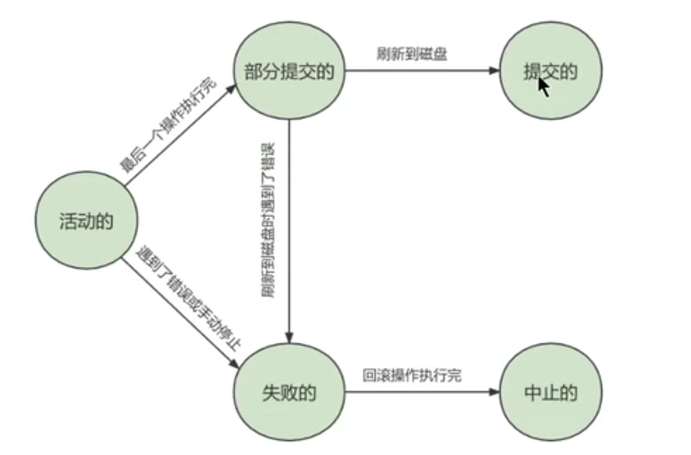
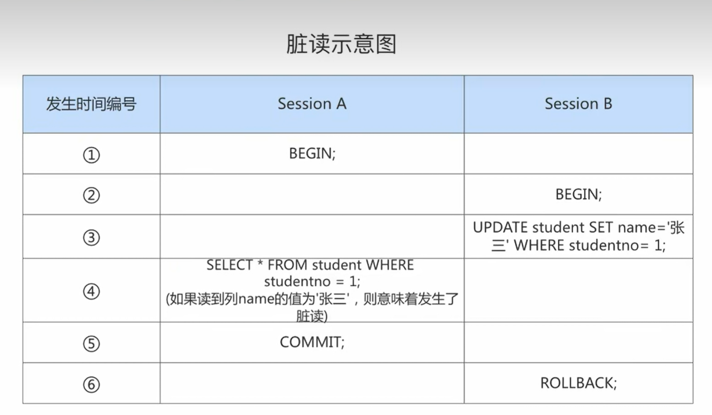
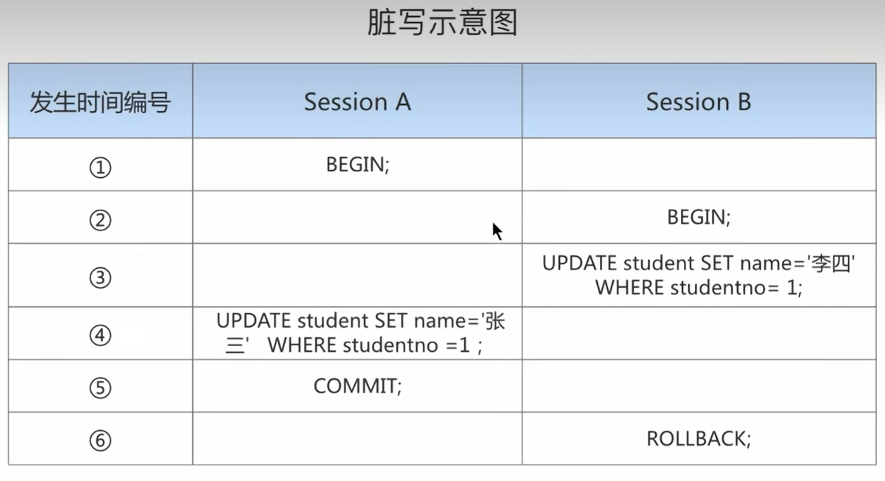
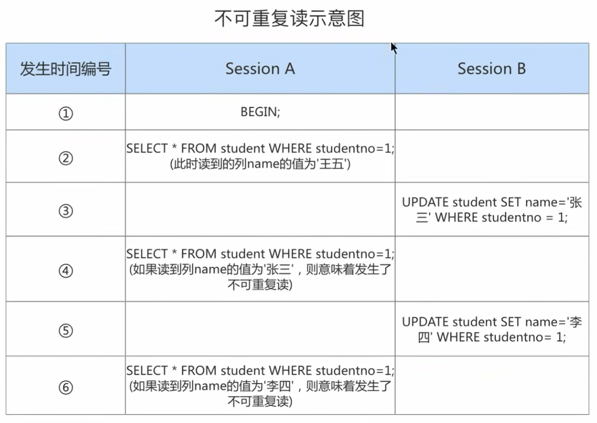
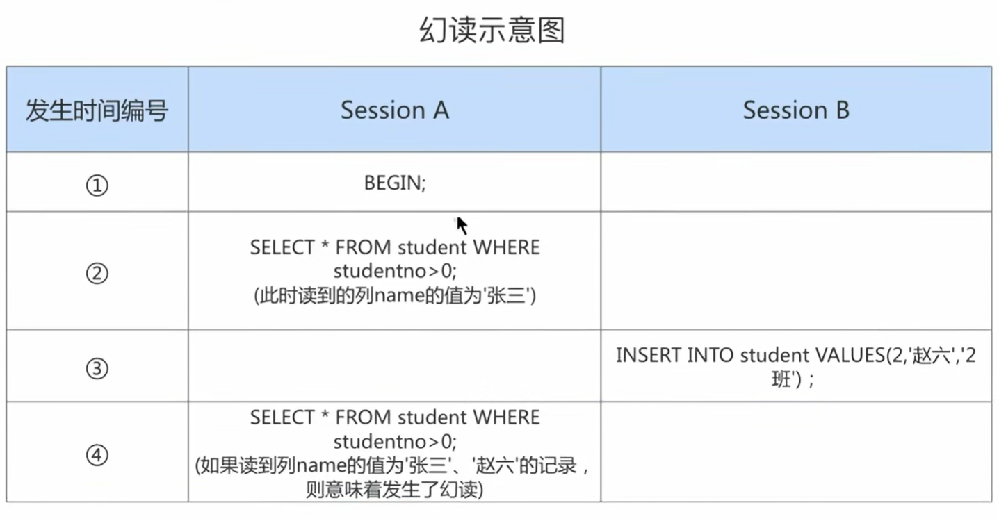
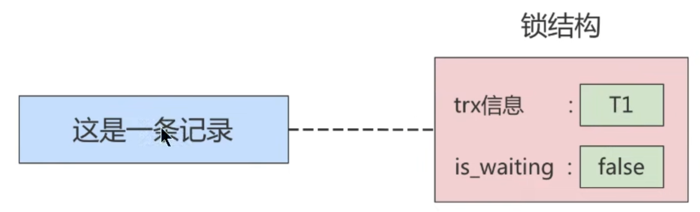
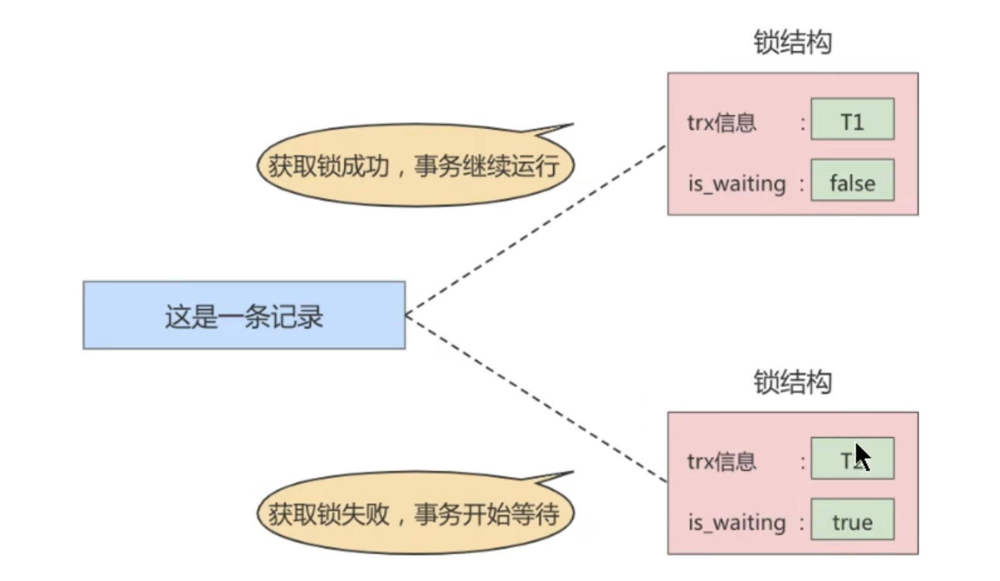
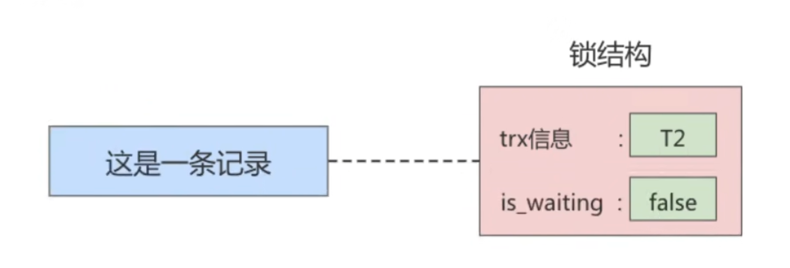

# 锁

事务的隔离性由锁实现

`锁`是计算机协调多个进程或线程`并发访问某一资源`的机制

在数据库中，除了传统的计算资源（CPU，RAM，I/O等）的争用以外，数据也是一种供许多用户共享的资源。为保证数据的一致性，需要对`并发操作进行控制`，因此产生了`锁`。同时`锁机制`也是实现MySQL的各个隔离级别提供了保证。`锁冲突`也是影响数据库`并发访问性能的`一个重要因素。

```sql
# 查看锁
SELECT * FROM information_schema.INNODB_LOCKS;
SELECT * FROM performance_schema.data_locks;

# 查看锁等待
SELECT * FROM information_schema.INNODB_LOCK_WAITS;
SELECT * FROM performance_schema.data_lock_waits;

# 锁超时时间
show global variables like 'innodb_lock_wait_timeout';
```


## 锁的分类

### 从数据操作的类型划分：读锁/写锁

有读锁时，其他也可以上读锁

有读锁，其他不可上写锁

有写锁，其他不可上读锁

有写锁，其他不可上写锁

#### 读锁

读锁：也称为`共享锁(Shared Lock)`，英文用`S`表示。针对同一份数据，多个事务的读操作可以同时进行而不会相互影响，相互不阻塞

```sql
SELECT ... LOCK IN SHARE MODE;
# 或
SELECT ... FOR SHARE

# 事务中
begin;
select * from student for share;

# 不提交，锁不释放
commit;
```


#### 写锁

写锁：也称为`排它锁(Exclusive Lock)`,英文用`X`表示。当前写操作没有完成前，它会阻断其他写锁和读锁。这样就能确保在给定的时间里，只有一个事务能执行写入，并防止其他用户读取正在写入的同一资源

```sql
SELECT ... FOR UPDATE;

# 事务中
begin;
select * from student for update;

# 不提交，锁不释放
commit;
```

#### MySQL8.0新特性

在5.7及之前的版本，SELECT...FOR UPDATE,如果获取不到锁，会一直等待，直到innodb_lock_wait_timeout超时。

在8.0版本中，`SHARE...FOR UPDATE`，`SHARE...FOR SHARE`添加`NOWAIT`、`SKIP LOCKED`语法，跳过锁等待，或者跳过锁定

- 通过添加`NOWAIT`、`SKIP LOCKED`语法，能够立即返回。如果查询的行已经加锁
    - 那么NOWAIT会立即报错返回
    - 而SKIP LOCKED也会立即返回，只是返回的结果中不包含被锁定的行

示例：

```sql
-- 终端1：给表student加X锁
mysql> select * from student for update;

-- 终端2：
-- nowait立即报错返回
mysql> select * from student for share nowait;
ERROR 3572 (HY000): Statement aborted because lock(s) could not be acquired immediately and NOWAIT is set.

-- 返回没有锁的行，
mysql> select * from student for share skip locked;
Empty set (0.00 sec)
```

#### 写操作

平常所用到的`写操作`无非是`DELETE`、`UPDATE`、`INSERT`这三种

- DELETE 
    - 对一条记录做DELETE操作的过程其实是先在B+树中定位这条记录的位置，然后获取这条记录的X锁，再执行`delete mark`操作。

- UPDATE
    - 键值在数据库中的主要作用是 **唯一标识记录**，无论是主键、外键、唯一键还是复合键，都有其独特的标识作用。
    - 情况1：未修改该记录的键值，并且被更新的列占用的存储空间在修改前后未发生变化。则先在B+树中定位到这条记录的位置，然后再获取一下记录的`X锁`，最后在原纪录的位置进行修改操作。
    - 情况2：未修改该记录的键值，并且至少有一个被更新的列占用个存储空间在修改前后发生变化。则先在B+树中定位到这条记录的位置，然后获取一下记录的`X锁`，将该记录彻底删除掉（就是把记录彻底移入垃圾链表），最后再插入一条新纪录。这个定位待修改记录在B+树中位置的过程看成是一个获取`X锁`，新插入的记录由`INSERT`操作提供的`隐式锁`进行保护
    - 情况3：修改了该记录的键值，则相当于在原纪录上做`DELETE`操作之后再来一次`INSERT`操作，加锁操作就需要按照`DELETE`和`INSERT`的规则进行了。

- INSERT
    - 一般情况下，新插入一条记录的操作并不加锁，通过一种称之为`隐式锁`的结构来保护这条新插入的记录在本事务提交前不被别的事务访问

### 从数据操作的颗粒度划分：表级锁、页级锁，行级锁

每个层级的锁数量是有限制的，因为锁会占用内存空间，`锁空间大小是有限的`。当某个层级的锁数量超过了这个层级的阈值时，就会进行锁升级。锁升级就是用更大粒度的锁替代多个更小粒度的锁，比如InnoDB中行锁升级为表锁，这样做的好处是占用的锁空间降低了，但同时数据的并发度也下降了。

#### 表锁（Table Lock）

##### 锁定读

查看是否表中是否使用锁

```sql
show open tables;
-- 观察In_user字段
```

给表加读锁

```sql
lock table mylock read;
-- 自己可读
-- 自己不可写
-- 自己不可操作其他表
-- 他人可读
-- 他人不可写
```

给表加写锁

```sql
lock table mylock write;
-- 自己可读
-- 自己可写
-- 自己不可操作其他表
-- 他人不可读
-- 他人不可写
```

##### 意向锁（intention lock）

InnoDB支持`多颗粒度(multiple granularity locking)`，它允许`行级锁`与`表级锁`共存，而意向锁就是其中的一种表锁

1. 意向锁的存在是为了协调行锁和表锁的关系，支持多颗粒度锁的共存
2. 意向锁是一种`不与行级锁冲突表级锁`这一点非常重要
3. 表明"某个事务正在某些行持有了锁或该事务准备去持有锁"

意向锁要解决的问题

现在有两个事务，分别是T1和T2，其中T2试图在该表级别上应用共享锁或排它锁，如果没有意向锁存在，那么T2就需要去检查各个页或行是否存在锁；如果存在意向锁，那么此时就会受到由T1控制的`表级别意向锁的阻塞`。T2在锁定该表前不必检查各个页或行锁，而只需检查表上的意向锁。`简单来说，就是给更大一级别的空间示意里面是否已经上过锁

在数据表的场景中，如果我们给某一行数据加上了排它锁，数据库会自动给更大一级的空间，比如数据页或数据表加上意向锁，告诉其他人这个数据页或者数据表已经有人上过排他锁了

- 如果事务想要获得数据表中某些记录的共享锁，就需要在数据表上`添加意向共享锁`
- 如果事务想要获得数据表中某些记录的排它锁，就需要在数据表上`添加意向排它锁`


意向锁是由存储引擎`自己维护的`，用户无法手动操作意向锁，在为数据行加共享/排他锁之前，InnoDB会先获取该数据行所在数据表的对应意向锁。

##### 元数据锁（MDL锁）

- 当对一个表做增删改查的时候，加MDL读锁
- 当对一个表做结构变更操作的时候，加MDL写锁

读锁之间不互斥，因此可以有多个线程同时对一张表增删改查。读写锁之间，写锁之间是互斥的，用来保证变更表结构操作的安全性，解决DML和DDL操作的一致性问题。`不需要显式使用`，在访问一个表的时候会被自动加上

#### 行锁

行锁也称为记录锁，MySQL服务器层并没有实现行锁机制，行锁只在存储引擎层实现

- 优点：锁定力度小，发生`锁冲突概率低`，可以实现的`并发度高`
- 缺点：对`锁的开销比较大`，加锁会比较慢，容易出现`死锁`

记录锁是有S锁和X锁之分

- 当一个事务获取了一条记录的S型记录锁后，其他事务也可以继续获取该记录的S型记录锁，但不可以继续获取X型记录锁
- 当一个事务获取了一条记录的X型记录锁后，其他事务既不可以获取该记录的S型记录锁，也不可以继续获取X型记录锁

##### 间隙锁（Gap Locks）

为了防止幻读，InnoDB 会在 `REPEATABLE READ` 隔离级别下为 **间隙**（即符合查询条件的记录范围内，但尚未被插入的记录）加上锁。这意味着，如果一个事务读取某个范围内的数据，另一个事务将无法向该范围内插入新的数据。

##### 临键锁(Next-Key Lock)

**行锁**（Record Lock）和 **间隙锁**（Gap Lock）的组合。临键锁的目的是为了防止 **幻读**（Phantom Reads）问题，并确保数据在事务执行期间的一致性。

Next-Key-Lock是在存储Innodb，事务级别在`可重复读`的情况下使用的数据库锁，innodb默认的锁就是Next-key Lock。

#### 页锁

页锁就是在`页的粒度`上进行锁定，锁定的数据资源比行锁要多，因为一个页中可以有多个行记录。当我们使用页锁的时候，会出现数据浪费的现象，但这样的浪费最多也就是一个页上的数据行。页锁的开销介于表锁和行锁之间，会出现死锁。锁定粒度介于表锁和行锁之间，并发度一般。

### 对待锁的态度划分：乐观锁，悲观锁

从对待锁的态度来看锁的话，可以将锁分成乐观锁和悲观锁，从名字中也可以看出这两种锁看待`数据并发的思维方式`。需要注意的是，`乐观锁`和`悲观锁`并不是锁，而是锁的`设计思想`

#### 悲观锁（Pessimistic Locking）


悲观锁总是假设最坏的情况，每次去拿数据的时候都认为别人会修改，所以每次在拿数据的时候都会上锁，这样别人想拿这个数据就会`阻塞`直到它拿到锁(共享资源每次只给一个线程使用，其他线程阻塞，用完后再把资源转让给其他线程)。比如行锁，表锁等，读锁，写锁等，都是在操作之前先上锁，当其他线程想要访问数据的时候，都需要阻塞挂起。


悲观锁的缺陷

悲观锁不适用的场景较多，它存在一些不足，因为悲观锁大多数情况下依靠数据库的锁机制实现，以保证程序的并发访问性，同时这样对数据库性能开销影响也很大，特别是`长事务`而言，这样的`开销往往无法接受`，这时就需要乐观锁。


#### 乐观锁(Optimistic Locking)

乐观锁认为对同一数据的并发操作不会总发生，属于小概率事件，不用每次都对数据上锁，但是在更新的时候会判断一下再次期间别人有没有去更新这个数据，也就是不采用数据库自身的锁机制，而是通过程序来实现。在程序上，我们采用`版本号机制`或者`CAS机制`实现。

### 其他锁：全局锁

全局锁就是对`整个数据实例`加锁。当你需要让整个数据库处于只读状态的时候，可以使用这个命令，之后其他线程的一下语句会被阻塞：

- 数据更新语句（数据的增删改）
- 数据定义语句（包括建表，修改表结构等）
- 更新类事务的提交语句

全局锁的典型场景：做全库逻辑备份

全局锁的命令

```sql
Flush tables with read lock
```

### 释放锁

```sql
unlock tables;
```

# 事务

事务是数据库区别于文件系统的重要特性之一，当我们有了事务就会让数据库始终保持`一致性`，同时我们还能通过事务的机制`恢复到某个时间点`，这样可以保证已提交到数据库的修改不会因为系统崩溃而丢失

事务仅限于 InnoDB 引擎下，在 MySQL 中，MyISAM 引擎是不支持事务的。

##  事务ACID特性

- <span style="color:red;font-weight:700">原子性(atomicity)</span>

原子性是指事务是一个不可分割的工作单位，要么全部提交，要么全部回滚

- <span style="color:red;font-weight:700">一致性(consistency)</span>

一致性是指事务执行前后，数据从一个`合法性状态`变换到另外一个`合法性状态`.这种状态是`语义上`的，而不是语法上的，跟具体业务有关。

什么是合法性：即满足`预定的约束`的状态就叫合法的状态。通俗一点，自定义约束，在数据执行前后，都满足这个约束，如果不满足就回滚到满足的状态，就加一致性

- <span style="color:red;font-weight:700">隔离性(isloation)重要</span>

事务的隔离性是指一个事务的执行`不能被其他事务干扰`，即一个事务内部的操作及使用的数据对并发的其他事务是隔离的，并发执行的各个示例之间不能相互干扰

- <span style="color:red;font-weight:700">持久性(durability)</span>

持久性是指一个事务一旦被提交，它对数据库中数据的改变就是`永久性的`，接下来的其他操作和数据库故障不应对其有任何影响

持久性是通过`事务日志`来保证的。日志包括了`重做日志`和`回滚日志`。

当我们通过事务对数据进行修改的时候，首先会将数据库的变化信息记录到重做日志中，然后再对数据库中对应的行进行修改。这样做的好处是，即使数据库系统崩溃，数据库重启后也能找到没有更新到数据库系统中的重做日志，重新执行，从而使事务具有持久性。

总结

```
ACID是事务的四大特性，在这四个特性中，原子性是基础，隔离性是手段，一致性是约束条件，而持续性是目的
```

## 事务的状态

- <span style="color:red;font-weight:700">活动的(active)</span>
    - 事务对应的数据库操作正在执行过程中时，我们就说事务处在活动的状态

- <span style="color:red;font-weight:700">部分提交的(partially Committed)</span>
    - 当事务中的最后一个操作执行完，但由于操作都在内存中执行，所造成的影响并没有刷新到磁盘时，我们就说该事务处在部分提交的状态

- <span style="color:red;font-weight:700">失败的(failed)</span>
    - 当事务处在`活动的`或者`部分提交的`状态时，可能遇到了某些错误（比如断电）,而无法继续执行，或人为停止当前事务的执行，我们就说该事务处于`失败的`状态

- <span style="color:red;font-weight:700">中止的(aborted)</span>
    - 如果事务执行了一部分而变为失败的状态，那么就需要把已经修改的事务中的操作还原到事务执行前的状态。即`回滚`。当`回滚`执行完毕时，也就是数据库恢复到了执行事务之前的状态，我们就说该事务处在了`中止的`状态。


- <span style="color:red;font-weight:700">提交的(committed)</span>
    - 当一个处在`部分提交的`状态的事务将修改的数据都`同步到磁盘`上之后，我们就可以说该事务处在了`提交的`状态。



图中可见，只有当事务处于`提交的`或者`中止的`状态时，一个事务的生命周期才算是结束了。对于已经提交的事务来说，该事物对数据库所做的修改将永久生效，对于处于中止状态的事务，该事务对数据库所做的所有修改都会被回滚到没有执行该事务之前的状态


## 使用事务

- 步骤1：开启事务
- 步骤2：一系列DML操作
- 步骤3：事务结束状态：提交状态(COMMIT)或中止状态(ROLLBACK)

只有事务型存储引擎中的 DML 语句才能支持事务操作

truncate 和 drop都属于 DDL 语句

```sql
# 查看正在进行的事务
SELECT * FROM INFORMATION_SCHEMA.INNODB_TRX\G
```


### 显式事务

#### 开启事务

```sql
START TRANSACTION [read only|read write|with consistent snapshot]
# 或
BEGIN;
```

- READ ONLY：标识当前事务是一个`只读事务`，也就是属于该事务的数据库操作只能读取数据，而不能修改数据
    - 只读事务可以对`临时表`进行增、删、改操作
- READ WRITE(默认)：标识当前事务是一个`读写事务`也就是属于该事务的数据库操作既可以读取数据，也可以修改数据
- WITH CONSISTENT SNAPSHOT:该选项确保事务的所有查询都在一致的快照上执行。具体来说，它会确保事务所读取的数据是事务开始时的数据快照，而不是随着事务执行过程中其他并发事务的修改而变化。这意味着读取操作不会受到其他事务正在进行的更新的影响。
    - MySQL 使用 **MVCC** 来实现 **一致性快照**。


示例

```sql
-- 开启一个只读事务
START TRANSACTION READ ONLY;
-- 开启只读事务和一致性读
START TRANSACTION READ ONLY, WITH CONSISTENT SNAPSHOT;
```

#### 保存点(savepoint)

```sql
-- 在事务中创建保存点，方便后续针对保存点进行回滚，一个事务可以有多个保持点
SAVEPOINT 保存点名称;

-- 删除某个保存点
RELEASE SAVEPOINT 保存点名称;
```

#### 提交事务或中止事务（即回滚事务）

```sql
-- 提交事务，当提交事务后，对数据库的修改是永久性的
COMMIT;
-- 回滚事务，即撤销正在进行的所有没有提交的修改
ROLLBACK;
-- 将事务回滚到某个保存点
ROLLBACK TO [SAVEPOINT]
```

###  隐式事务

mysql命令行中的DDL语句都是隐式事务，会自动自动提交

```sql
select @@autocommit;
# 默认是ON
```

隐式提交数据的情况

- 数据定义语言DDL

    - 当我们使用CREATE、ALTER、DROP等语句去修改数据库对象时，就会隐式的提交前边语句所属于的事务

    ```sql
    BEGIN;
    SELECT ...  -- 事务中的一条语句
    UPDATE ... -- 事务中的一条语句
    
    CREATE TABLE ...  -- 此语句会隐式的提交前边语句所属于的事务
    ```

- 隐式使用或修改mysql数据库中的表

    - 当我们使用`ALTER USER`、`CREATE USER`、`DROP USER`、`GRANT`、`RENAME USER`、`REVOKE`、`SET PASSWORD`等语句时也会隐式的提交前边语句所属于的事务

- 事务控制或关于锁定的语句

    - 当我们在一个事务还没提交或者回滚时，就又使用`BEGIN`开启另一个事务，会`隐式提交`上一个事务   
    - 当前的autocommit变量为OFF，手动改为ON时，也会隐式提交所属事务
    - 使用`LOCK TABLES`、`UNLOCK TABLES`等关于锁定的语句也会`隐式的提交`前边语句所属事务

- 加载数据的语句

    - 使用`LOAD DATA`语句批量往数据库导入数据时，也会`隐式提交`前边的事务

- 关于MySQL复制的一些语句

- 其他的一些语句

    - `ANALYZE TABLE`、`CACHE INDEX`、`CHECK TABLE`、`FLUSH`、`LOAD INDEX INTO CACHE`、`OPTIMIZE TABLE`、`REPAIR TABLE`、`RESET`等语句也会隐式提交前边语句所属事务

### 合并提交

MySQL中，每次写操作都是一个事务操作，批量写时，可以将多次提交合并成一次提交，以加快执行速 度

将批量操作合并到一个事务中，而不是每次写都是一个事务


## 数据并发问题

MySQL是一个`客户端/服务器`架构的软件，对于同一个服务器来说，可以有若干个客户端与之连接，每个客户端与服务器连接上之后，就可以称为一个会话(session)。每个客户端都可以在自己的会话中向服务器发出请求语句，一个请求可能是某个事务的一部分，也就是对于服务器来说可能同时处理多个事务。事务有`隔离性`的特性，理论上在某个事务`对某个数据进行访问`时，其他事务应该进行`排队`，当该事务提交之后，其他事务才可以继续访问这个数据。但是这样对`性能影响太大`，我们既想保持事务的隔离性，又想让服务器在处理访问同一数据的多个事务时`性能尽可能高些`，那就看二者如何权衡取舍了

### 脏读（Dirty Read）

对于两个事务SessionA、SessionB，SessionA`读取`了已经被SessionB更新但还`没有被提交`的字段。之后若Session`回滚`，SessionA`读取`的内容就是`临时且无效`的。



### 脏写（Dirty Write）

对于两个事务SessionA、SessionB，如果事务SessionA`修改了`另一个`未提交`事务SessionB`修改过`的数据，那就意味着发生了脏写



SessionA和SessionB各开启了一个事务，SessionB中的事务先将studentno列为1的记录的name列更新为李四

然后SessionA中的事务接着又把这条studentno列为1的记录的name列更新为“张三，如果之后SessionB中的事务进行了回滚，那么SessionA中的更新也将不复存在，这种现象就称之为脏写。

这时SessionA的事务就没有效果了，明明把数据更新了，最后也提交了事务，但是最后看到的数据什么变化也没有。

这里大家对事务的隔离级别比较了解的话，会发现默认隔离级别下，上面SessionA中的更新语句会处于等待状态，这里只是说明脏写的现象

### 不可重复读(Non-Repeatable Read)

对于两个事务SessionA、SessionB，SessionA`读取`了一个字段，然后SessionB`更新`了该字段，之后SessionA再次读取同一个字段，值就不同了。那就意味着发生了不可重复读。



### 幻读(Phantom)

对于两个事务SessionA、SessionB，SessionA从一个表中`读取`了一个字段，然后SessionB在该表中`插入`了一些新的行，之后，如果SessionA再次读取同一个表，就会多出几行，这就意味着发生了幻读。



SessionA中事务先根据条件studentno > 0这个条件查询表student，得到name列值为'张三'的记录，之后SessionB中提交了一个`隐式事务`，该事务向表student中插入一条记录，之后SessionA中的事务在根据相同的条件studentno > 0 查询表student，得到的结果集中包含SessionB中的事务新插入的那条记录，这种现象也被称之为`幻读`。我们把新插入的那些记录称之为`幻影记录`。

注意：幻读强调的是一个事务按照某个相同条件多次读取记录时，后读取时读到了之前`没有读到的记录`。

## 事务的隔离级别

MySQL 的事务隔离级别一共有四个，分别是读未提交、读已提交、可重复读以及可串行化。MySQL 的 隔离级别的作用就是让事务之间互相隔离，互不影响，这样可以保证事务的一致性

上述几种并发事务执行过程中可能遇到的一些问题，这些问题有轻重缓急之分，我们给这些问题按照严重性来排序

```sql
脏写 > 脏读 > 不可重复读 > 幻读
```

我们愿意舍弃一部分隔离性来换取一部分性能在这里就体现在：设立一些隔离级别，隔离级别越低，并发问题发生的越多。`SQL标准`中设立了4个隔离级别

*   读未提交（READ UNCOMMITTED）
    *   读未提交，在该隔离级别，所有事务都可以看到其他未提交事务的执行结果。不能避免脏读，不可重复读，幻读。

*   **读已提交（READ COMMITTED）**
    *   读已提交，它满足了隔离的简单定义：一个事务只能看见已经提交事务所做的改变。这是大多数数据库默认的隔离级别（但不是MySQL默认的）。可以避免脏读，但不可重复读，幻读问题仍然存在

*   **可重复读（REPEATABLE READ）**
    *   可重复读，事务A在读到一条数据之后，此时事务B对该数据进行了修改并提交，那么事务A再读该数据，读到的还是原来的内容。可以避免脏读，不可重复读，但幻读问题仍然存在，这是MySQL默认级别
    *   **MySQL InnoDB 存储引擎** 中，它通过引入 **多版本并发控制（MVCC）** 和 **间隙锁（Gap Locks）** 来解决幻读问题。

*   可串行化（SERIALIZABLE）
    *   可串行化，确保事务可以从一个表中读取相同的行。在这个事务持续期间，禁止其他事务对该表进行插入、更改和删除操作。所有的并发问题都可以避免，但性能十分低下。能避免脏读，不可重复读和幻读。

以上四种隔离级别，从上往下，隔离强度逐渐增强，性能逐渐变差，需要消耗的 MySQL 的资源越多， 所以并不是隔离强度越高越好，采用哪种隔离级别要根据系统需求权衡决定，MySQL 中**默认的隔离级 别是可重复读**。

```sql
SHOW VARIABLES LIKE 'transaction_isolation';

SET [GLOBAL|SESSION] TANSACTION ISOLATION LEVEL 隔离级别；
-- 或者
SET [GLOBAL|SESSION] | TRANSACTION_ISOLATION = `隔离级别`；

/etc/mysql/mysql.conf.d/mysqld.cnf
[mysqld]
transaction-isolation=SERIALIZABLE
```

## MVCC和事务的隔离级别

 MVCC（多版本并发控制机制）只在 READ COMMITTED 和 REPEATABLE READ 两个隔离级别下工作。

其他两个隔离级别都和 MVCC 不兼容，因为 READ UNCOMMITTED总是读取最新的数据行，而不是符合 当前事务版本的数据行。而SERIALIZABLE则会对所有读取的行都加锁。

**MVCC**（多版本并发控制）是一种避免读操作阻塞写操作的机制，它通过为每个数据项维护多个版本来实现事务的并发性。在这种方案下：

*   **读操作**：采用 **MVCC** 来保证读取的数据版本与事务启动时一致，而不是当前的实时数据。即每个事务会有自己的 **快照**，这就意味着每个事务的读取是基于自己启动时数据库的状态，而不是被其他事务更改后的数据。这避免了 **脏读** 和 **不可重复读** 问题。

*   **写操作**：写操作使用 **锁** 来保证数据的安全性和一致性。当事务进行写操作时，它需要获得一个 **排他锁**（`X锁`）以防止其他事务同时修改同一数据，从而避免 **丢失更新** 和 **写偏差** 问题。

## 并发事务访问相同记录

### 同读

`读-读`情况，即并发事务相继`读取相同的记录`。读取操作本身不会对记录有任何影响，所以允许这种情况发生

### 同写

`写-写`情况，即并发事务相继对相同的记录做出改动

这种情况下会发生`脏写`的问题，任意一种隔离级别都不允许这种问题的发生所以在多个未提交事务相继对一条记录做改动时，需要让它们`排队执行`，这个排队的过程其实是通过`锁`来实现的。这个所谓的锁其实是一个内存中的结构，在事务执行前本来时没有锁的，也就是一开始是没有锁结构和记录进行关联的

当事务想对这条记录做改动时，首先会看看内存中有没有与这条记录关联的`锁结构`，当没有的时候就会在内存中生成一个`锁结构`与之关联。



在`锁结构里`有很多信息，为了简化理解，只有两个比较重要的属性拿出来：

- `trx信息`：代表这个锁结构是哪个事务生成的
- `is_waiting`：代表当前事务是否在等待

当事务T1改动了这条记录后，就生成了一个`锁结构`与该记录关联，因为之前没有别的事务为这条记录加锁，所以is_waiting属性就是false，我们把这个场景就称之为`获取锁成功`，或者`加锁成功`，然后就可以继续执行操作

锁结构与事务相关联，与记录数量无关，有几个事务，就有几个锁结构

在事务T1提交之前，另一个事务T2也想对该记录做改动，那么先看看有没有`锁结构`与这条记录关联，发现有一个`锁结构`与之关联，然后也生成了一个锁结构与这条记录关联，不过锁结构的`is_waiting`属性值为`true`，表示当前事务需要等待，我们把这个场景称之为`获取锁失败`，或者加锁失败



 在事务T1提交后，就会把该事物生成的`锁结构释放`掉,然后看看还有没有别的事务在等待获取锁，发现了事务T2还在等待获取锁，所以把事务T2对用的锁结构的`is_waiting`属性设置为`false`，然后把该事物对用的线程唤醒，让它继续执行，此时事务T2就算获取到锁了



如果有俩个事务在锁等待，就会进行锁调度

MySQL（InnoDB）使用 **"First Come, First Served"**（先来先服务）的调度策略来决定哪一个事务会先获得锁。这意味着，事务2和事务3会按照它们请求锁的顺序进行处理。

### 一读一写

`读-写或写-读`，即一个事务进行读取操作，另一个进行改动操作。这种情况下可能发生`脏读`、`不可重复读`、`幻读`的问题

各个数据库厂商对`SQL标准`的支持都可能不一样。比如MySQL在`REPEATABLE READ`隔离级别上就已经解决了`幻读`的问题

**MySQL InnoDB 存储引擎** 中，它通过引入 **多版本并发控制（MVCC）** 和 **间隙锁（Gap Locks）** 来解决幻读问题。

### 并发问题的解决方案

- 方案1：读使用MVCC，写加锁

- 方案2：读写都加锁

# MVCC 

[全网最详细MVCC讲解，一篇看懂 - 知乎](https://zhuanlan.zhihu.com/p/676793594)

## **MVCC的基本概念**

MVCC 的核心思想是：每个事务在执行过程中，能够读取到该事务开始时的数据快照，而不会受到其他事务的影响。每次数据更新（如插入、更新、删除）都会产生一个新版本的数据，旧版本的数据会保留一段时间，直到没有任何事务再需要访问它为止。

数据版本管理

-   每个数据行有多个版本，每个版本记录了一个 **事务ID** 和一个 **时间戳**，表示该版本数据的创建时间。数据库通过 **版本号** 来确定哪一版本数据是有效的。
-   事务执行时，数据库会根据事务开始时的快照来提供读取数据的版本，确保该事务始终读取到一致的数据，而不会受到其他事务的影响。

## **MVCC的实现方式**

MVCC 的核心是通过为每个数据行维护 **多个版本** 来保证不同事务对同一数据的并发访问。具体来说，MVCC 在数据库表的数据行上会维护以下信息：

-   **事务ID**：每个事务在开始时都会被分配一个唯一的事务ID，数据库会根据这个事务ID来区分不同事务的操作。
-   **版本链**：每次数据被修改时，数据库会创建一份新版本，并将其连接到旧版本的版本链上。这样，在事务执行时，数据库会返回该事务启动时的数据快照。
-   **回滚日志**：数据库会将所有修改操作记录到日志中，以便事务在回滚时能恢复到修改之前的状态。

在 InnoDB 中，MVCC 是通过以下机制实现的：

-   隐藏列：InnoDB 会在每个数据表中增加两个隐藏列 `DB_TRX_ID` 和 `DB_ROLL_PTR`，用于管理每行数据的版本信息。
    -   `DB_TRX_ID` 存储最近更新该行数据的事务ID。
    -   `DB_ROLL_PTR` 存储指向该行数据的回滚链指针，用于回滚操作时恢复历史版本。
-   **历史版本**：InnoDB 会在数据更新时不会覆盖旧数据，而是将新数据写入一个新的版本。通过这个历史版本的机制，事务可以访问自己启动时的快照数据。


## mvcc的实现，基于**undolog**、**版本链**、**readview**。


什么是readview呢？

当我们用select读取数据时，这一时刻的数据会有很多个版本（例如上图有四个版本），但我们并不知道读取哪个版本，这时就靠readview来对我们进行读取版本的限制，通过readview我们才知道自己能够读取哪个版本。

-   **RC**：每次 SELECT 数据前都生成一个ReadView。
-   **RR**：只在第一次读取数据时生成一个ReadView，后面会复用第一次生成的。

在一个readview快照中主要包括以下这些字段：


对readview中的参数做一些解释

m_ids：活跃的事务就是指还没有commit的事务。

max_trx_id：例如m_ids中的事务id为（1，2，3），那么下一个应该分配的事务id就是4，max_trx_id就是4。

creator_trx_id：执行select读这个操作的事务的id。

**readview如何判断版本链中的哪个版本可用呢？（重点！）**

用readview与记录的版本相对照


从上到下分别为（1）（2）（3）（4），依次进行解释

trx_id表示要读取的事务id

（1）如果要读取的事务id等于进行读操作的事务id，说明是我读取我自己创建的记录，那么为什么不可以呢。

（2）如果要读取的事务id小于最小的活跃事务id，说明要读取的事务已经提交，那么可以读取。

（3）max_trx_id表示生成readview时，分配给下一个事务的id，如果要读取的事务id大于max_trx_id，说明该id已经不在该readview版本链中了，故无法访问。

（4）m_ids中存储的是活跃事务的id，如果要读取的事务id不在活跃列表，那么就可以读取，反之不行。

