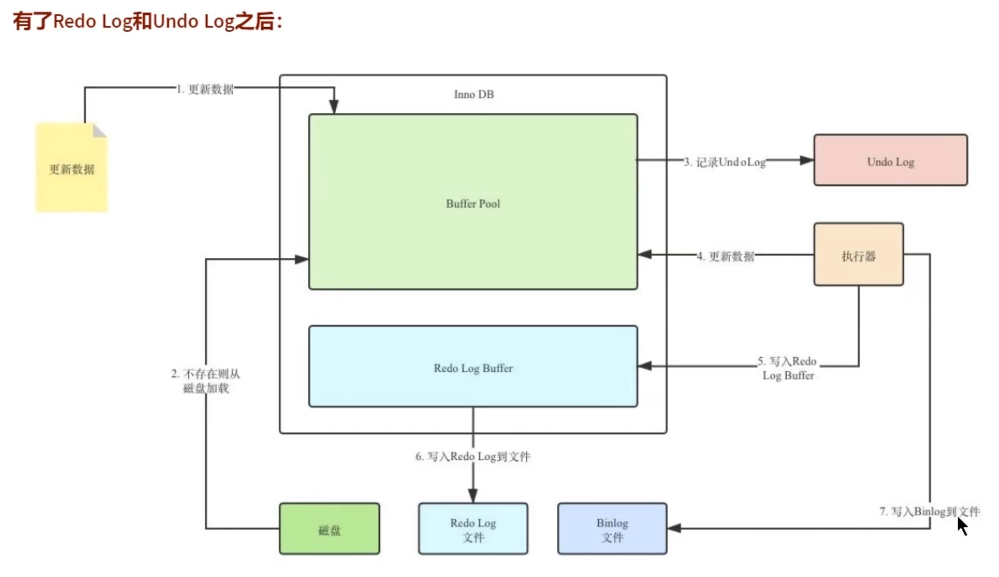
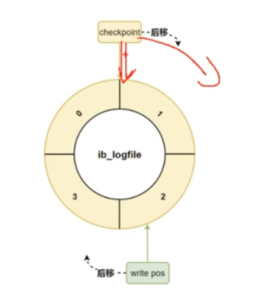

# 日志

## 日志分类

MySQL 日志详解

| **日志类型**   | **用途**                                          | **默认位置/配置**                                            | **常用参数**                                                 | **注意事项**                       |
| -------------- | ------------------------------------------------- | ------------------------------------------------------------ | ------------------------------------------------------------ | ---------------------------------- |
| **错误日志**   | 记录MySQL启动、停止和运行中的错误信息。           | `log_error`参数指定路径，默认在数据目录下，如`/var/log/mysql/error.log`。 | `log_error` - 指定日志文件路径。                             | 重要的系统和运行错误会记录在此。   |
| **查询日志**   | 记录所有查询语句和客户端操作，便于调试。          | `general_log_file`参数指定路径，如`/var/log/mysql/general.log`。 | `general_log` - 是否启用；`general_log_file` - 指定日志文件路径。 | 性能影响较大，生产环境慎用。       |
| **慢查询日志** | 记录执行时间超过指定阈值的SQL语句，用于性能优化。 | `slow_query_log_file`参数指定路径，如`/var/log/mysql/slow.log`。 | `long_query_time` - 慢查询时间；`log_queries_not_using_indexes` - 是否记录未用索引的查询。 | 配置合理的时间阈值，避免日志过大。 |
| **二进制日志** | 记录所有数据修改的SQL，用于恢复和主从复制。       | `log_bin`参数指定路径，如`/var/log/mysql/mysql-bin`。        | `binlog_format` - 日志格式（STATEMENT、ROW、MIXED）。        | 使用`mysqlbinlog`工具查看内容。    |
| **事务日志**   | 记录InnoDB事务操作和崩溃恢复信息。                | 默认文件名为`ib_logfile0`和`ib_logfile1`，位于数据目录中。   | `innodb_log_file_size` - 日志文件大小；`innodb_log_files_in_group` - 日志文件数量。 | 日志大小影响性能，需合理配置。     |
| **中继日志**   | 用于主从复制，存储从主服务器接收的事件。          | `relay_log`参数指定路径，默认在数据目录中。                  | `relay_log_purge` - 是否清理已处理的日志；`relay_log` - 指定中继日志路径。 | 定期清理避免磁盘占用过多。         |
| **审计日志**   | 记录用户活动和SQL语句，主要用于安全审计。         | 需安装审计插件，路径由插件配置，如`audit_log_file`参数。     | `audit_log_policy` - 配置审计策略；                          | 安全需求高的环境使用，需插件支持。 |

日志管理最佳实践

1. **限制日志大小**：配置合理的日志文件大小和轮转。
2. **选择性启用**：根据需求启用相关日志类型，避免性能下降。
3. **定期清理或归档**：使用 `logrotate` 等工具。
4. **监控和分析**：结合工具如 pt-query-digest、mysqlbinlog 进行分析。
*   **pt-query-digest**：分析慢查询日志。
    
*   **mysqlbinlog**：解析二进制日志。



## 事务日志

事务有4种特性：原子性、一致性、隔离性和持久性，那么事务的四种特性到底是基于什么机制实现的

- 事务的隔离性由`锁机制`实现
- 而事务的原子性、一致性和持久性由事务的redo日志和undo日志来保证
    - REDO LOG 称为`重做日志`，提供再写入操作，恢复提交事务修改的页操作，用来保证事务的持久性
    - UNDO LOG 称为`回滚日志`，回滚行记录到某个特定版本，用来保证事务的原子性、一致性。


有的DBA或许会认为UNDO是REDO的逆过程，其实不然，REDO和UNDO都可以视为一种`恢复操作`，但是：

- redo log：是存储引擎层（innodb）生成的日志，记录的是`物理级别`上的页修改操作，比如页号XXX，偏移量YYY写入了ZZZ数据，主要为了保证数据的可靠性

- undo log：是存储引擎(innodb)生成的日志，记录的是`逻辑操作日志`，比如某一行数据进行了INSESRT语句操作，那么undo log就记录一条与之相反的DELETE操作。主要用于`事务回滚`（undo log记录的是每个修改操作的`逆操作`）和`一致性非锁定读`（undo log回滚行记录到某种特定的版本...MVCC,即多版本并发控制）。

**事务过程**

1.   **事务开始**
2.   **读取数据**
     *   先将原始数据从磁盘中读入内存（Buffer-Pool）中
3.   **生成 Undo 日志**
     *   在修改数据前，InnoDB 会将目标行的当前数据保存到 Undo 日志中，记录修改前的状态。
4.   **修改数据并写入缓冲区**
     *   同时，生成对应的 **Redo 日志**，记录如何恢复这些修改。
     *   修改操作并不会立即写回磁盘，而是更新缓冲池中的数据页（Dirty Page）。
5.   **提交或回滚**
     *   如果事务执行 `COMMIT`：
         -   Redo 日志的内容被刷到磁盘，确保数据修改的持久性。
         -   修改的数据被从缓冲池写回磁盘（可能延迟完成，由后台线程处理）。
     *   如果事务执行 `ROLLBACK`：
         -   Undo 日志被用来回滚数据，将行恢复到修改前的状态。

### redo log 重做日志

Redo Log 主要记录 **数据修改操作**，即 **每个修改操作的日志**，它包括了对 InnoDB 存储的 **表数据** 或 **索引数据** 的修改。具体而言，Redo Log 记录以下信息：

1.  **物理数据修改**：
    -   **Undo Log** 记录了事务的反向操作（用于事务回滚），而 **Redo Log** 记录了数据的实际修改操作。
    -   这包括了 **插入**、**更新**、**删除** 操作。
2.  **页级操作**：
    -   Redo Log 是页级的，意味着它记录了数据页的修改，而不是单独的行级修改。
    -   每次更新时，InnoDB 会对涉及的页进行修改并记录这些修改的 **物理日志**，即这些页从旧值变更到新值的详细信息。
3.  **写入到磁盘的操作**：
    -   对 **数据页** 或 **索引页** 的所有写操作都会被记录在 Redo Log 中。包括 **数据表的插入行**、**更新已有的行**、**删除行**，这些都需要记录下操作的页和修改的数据。

**Redo Log 的作用**

**事务的持久性**：

-   当事务提交时，数据可能尚未写入到磁盘的表文件中。Redo Log 确保事务的修改记录在磁盘中，即使数据库崩溃也能恢复。

**崩溃恢复**：

-   在系统崩溃后，InnoDB 使用 Redo Log 重新执行已提交但未写入表文件的事务，恢复数据库到一致的状态。

**优化磁盘 I/O**：

-   数据页的更新操作通常是随机 I/O，而日志的写入是顺序 I/O。InnoDB 优先将修改记录写入日志，再以异步方式刷新数据页到磁盘，从而提高性能。


redo log跟bin log的区别，redo log是`存储引擎层`产生的，而bin log是`数据库层`产生的。

假设一个事务，对表做10万行的记录插入，在这个过程中，一直不断的往redo log顺序记录，而bin log不会记录，直到这个事务提交，才会一次写入到bin log文件中


#### redo的组成

Redo log可以简单的分为以下两个部分

- 重做日志的缓冲(redo log buffer)，保存在内存中，是易失的。
    - 在服务器启动时就向系统申请了一大片称之为redo log buffer的`连续内存`空间，翻译成中文就是redo日志缓冲区。这片内存空间被划分为若干个连续的`redo log block`。一个redo log block占用`512字节`大小
- 重做日志文件(redo log file)，保存在硬盘中，是持久的
    - REDO日志文件，其中的`ib_logfile0`和`ib_logfile1`即为REDO日志

#### Redo Log 的工作机制

**Write-Ahead Log（预先日志持久化）：在持久化一个数据页之前，先将内存中相应的日志页持久化**

- 第一步：先将原始数据从磁盘中读入内存（Buffer-Pool）中来，事务是修改内存中的数据
- 第二步：生成一条redo log并写入redo log buffer，记录的是数据被修改后的值
- 第三步（日志页持久化）：当事务commit时，将redo log buffer中的内容刷新到redo log file。对redo log file采用追加写的方式
- 第四步（数据页持久化）：定义将内存中修改的数据刷新到磁盘


#### redo log buffer到redo log file的刷盘策略

redo log的写入并不是直接写入磁盘的，InnoDB引擎会在写redo log的时候，先写`redo log buffer`，之后以`一定的频率`刷入到真正的`redo log file`中

问题：什么时候经redo_Log_Buffer中的数据刷到文件（即硬盘中）

注意：redo log buffer刷盘到redo log file的过程并不是真正的刷到磁盘中去，**只是刷入到`文件系统缓存`(page cache)中去**（这是现代操作系统为了提高文件写入效率做的一个优化），**真正的写入会交个系统自己去决定**，那么对于InnoDB来说存在一个问题，如果交给系统来同步，如果系统宕机，那么数据也就丢失了（系统宕机的概率比起数据库宕机的概率要低）

针对这种情况，InnoDB给出`innodb_flush_at_trx_commit`参数，该参数控制commit提交事务时，如何将redo_log_buffer中的日志刷新到redo_log_file中。它支持三种策略

*   模式0：延迟写，表示每次事务提交时在redo log buffer延迟1秒后，写入page cache，由OS自己决定什么时候写入磁盘
    *   崩溃后丢失 1 秒数据，实际丢失可能超过 1 秒
*   **模式1**：实时写，表示每次事务提交时把redo log buffer内容写入page cache，MySQL 会调用 `fsync()` 或 `fdatasync()` 操作，**强制将 Page Cache 中的日志数据写入到磁盘**。
    *   这种方式几乎不会丢失数据，但性能较差。
*   模式2：半实时写，表示每次事务提交时把redo log buffer内容写入page cache，由OS自己决定什么时候写入磁盘
    *   由于是OS自己决定什么时候写入磁盘，也存在丢失数据风险
    *   相对折中方案。

```sql
# redo日志刷盘相关
mysql> SHOW VARIABLES LIKE '%innodb_flush%';
+--------------------------------+-------+
| Variable_name                  | Value |
+--------------------------------+-------+
| innodb_flush_log_at_timeout    | 1     | # 最大超时时间，日志文件的写入时间超过该超时时间，InnoDB 会强制刷新日志。
| innodb_flush_log_at_trx_commit | 1     | # 刷新策略，默认是1
| innodb_flush_method            | fsync | # 如何刷新日志到磁盘
| innodb_flush_neighbors         | 0     | # 控制是否优化相邻数据页的刷新。
| innodb_flush_sync              | ON    | # 是否同步 InnoDB 的 I/O 操作。
| innodb_flushing_avg_loops      | 30    | # 
+--------------------------------+-------+
6 rows in set (0.00 sec)
```

#### 配置信息

要更改的话，需要在配置文件中更改。

```sql
SHOW VARIABLES LIKE '%innodb_log%';
+------------------------------------+----------+
| Variable_name                      | Value    |
+------------------------------------+----------+
| innodb_log_buffer_size             | 16777216 | # 缓冲大小
| innodb_log_checksums               | ON       |
| innodb_log_compressed_pages        | ON       |
| innodb_log_file_size               | 50331648 | # 每个事务日志文件大小
| innodb_log_files_in_group          | 2        | # 事务日志文件个数
| innodb_log_group_home_dir          | ./       | # 日志所在位置
| innodb_log_spin_cpu_abs_lwm        | 80       |
| innodb_log_spin_cpu_pct_hwm        | 50       |
| innodb_log_wait_for_flush_spin_hwm | 400      |
| innodb_log_write_ahead_size        | 8192     |
| innodb_log_writer_threads          | ON       |
+------------------------------------+----------+
11 rows in set (0.00 sec)

# mysql8.0独有
# 设置 InnoDB 重做日志的总容量。
# 当定义了innodb_redo_log_capacity设置时，
# 将忽略innodb_log_files_in_group, innodb_log_file_size设置
show variables like '%innodb_redo_log_capacity%';
+--------------------------+-----------+
| Variable_name            | Value     |
+--------------------------+-----------+
| innodb_redo_log_capacity | 104857600 |
+--------------------------+-----------+
1 row in set (0.01 sec)
-- 此设置的redo log放置在工作目录的'#innodb_redo'目录下
-- 共32个redo文件

# 工作目录
show variables like '%datadir%';
+---------------+-----------------+
| Variable_name | Value           |
+---------------+-----------------+
| datadir       | /var/lib/mysql/ |
+---------------+-----------------+
1 row in set (0.00 sec)
```

#### 日志文件组

redo log有文件个数限制

从ib_logfile0开始写，如果ib_logfile0写满了，就接着写1，直到最后一个ib_logfilen写满，就重新转到ib_logfile0覆盖写


#### checkpoint机制

在整个日志组中还有两个重要的属性：分别是write pos，checkpoint

- write pos：是redo log记录的位置，日志一边写一边后移
- checkpoint：是数据已经落盘的位置，数据一边写一边后移



整体过程就是

- redo_log写入文件，write_pos向后推移相应的位置，此时checkpoint不动
- 当这些数据被从缓冲池加载到磁盘中，checkpoint会往后移动，
    - 表明这些数据已经落盘，无需再维护日志
- 因此checkpoint到write_pos之间的数据就是已经产生redo_log日志，但这些事务操作并没有落盘的数据
- 如果write_pos和checkpoint重合，则证明此时数据完全落盘。

### undo log 回滚日志

redo log是事务持久性的保证，undo log是事务原子性的保证。在事务中`更新数据`的`前置操作`其实是要先写入一个`undo log`

每当我们要对一条记录做改动时，（这里的改动可以指INSERT、DELETE、UPDATE），都需要“留一手” ——把回滚所需的东西记录下来

- 插入一条记录：
    - 至少要把这条记录的主键值记录下来，之后回滚的时候只需要把这个主键值对应的`记录删掉`就好了（对于每个INSERT，Innodb存储引起会完成一个DELETE）

- 删除一条记录
    - 至少要把这条记录的内容记录下来，这样之后回滚时再把由这些内容组成的记录`插入`到表中就好了（对于每个DELETE，Innodb存储引擎会执行一个INSERT）

- 修改了一条记录
    - 至少要把这条记录前的旧值记录下来，这样之后回滚时再把这条记录`更新为旧值`就好了（对于每个UPDATE，Innodb存储引擎会执行一个相反的UPDATE，将修改前的行放回去）

**Undo日志的作用**

*   作用1：回滚数据

    *   Undo是`逻辑日志`，因此只是将数据库逻辑地恢复到原来的样子。所有修改都被逻辑地取消了，但数据结构和页本身在回滚之后可能大不相同

        这是因为多用户并发系统中，可能会有数十、数百甚至数千个并发事务。数据库的主要任务就是协调对数据记录的并发访问。比如一个事务在修改当前一个页中的几条记录，同时还有别的事务在对同一个页中另外几条记录进行修改。因此，不能将一个页回滚到事务开始的样子，`解决方案就是：仅回滚当前事务对应的操作`。

*   作用2：MVCC（多版本并发控制）

    *   nnoDB存储引擎中MVCC的实现是通过Undo来完成的，当用户读取一行记录时，若该记录已经被其他事务占用，当前事务可以通过undo读取之前的行版本信息，以此实现非锁定读取

## 二进制日志

用于记录数据库的变化情况，即 SQL 语句的 DDL 和 DML 语句，但不包含查询操作语句，因为查询语句并 不会改变数据库中的数据。

事务只支持DML语句。

### 配置

```ini
# 大多数时候，配置第一条log-bin进行
[mysqld]
log-bin=/var/lib/mysql/mysql-bin        	# 启用二进制日志，同时指定二进制日志文件的存储路径及文件名前缀。
sql_log_bin=1|0								# 控制是否开启二进制日志记录
binlog_format=ROW|Statement|Mixed       	# 二进制日志格式，推荐使用 ROW 格式
log_bin_index=/var/log/mysql/mysql-bin.index # 指定二进制日志索引文件的路径及文件名。
max_binlog_size=1073741824					# 单文件大小，默认1G，超过大小会自动生成新的文件,重启服务也会生成新文件
binlog_cache_size=4m						#二进制日志缓冲区大小，每个连接独占大小
max_binlog_cache_size=512m					#二进制日志缓冲区总大小，多个连接共享
sync_binlog=1|0								#二进制日志落盘规则，1表示实时写，0 表示先缓存，再批量写磁盘文件
expire_logs_days=N							#二进制文件自动保存的天数，超出会被删除，默认0，表示不删除
```

**`STATEMENT`**：记录 SQL 语句本身（空间占用较小，但可能因语句不确定性导致问题）。

**`ROW`**：记录每行数据的变化（推荐，尤其是主从复制场景）。

**`MIXED`**：自动在 `STATEMENT` 和 `ROW` 之间切换。

```sql
-- 原始SQL语句
insert into t1(age,add_time)values(10,now());
-- 2023-12-01 17:57:10

-- statement日志
insert into t1 (age, add_time) values(10, now());

-- Row日志，now()函数被解析
insert into t1 (age, add_time) values(10, '2023-12-01 17:57:10')

-- Statement 比较节约磁盘空间，但无法百分百还原场景
-- Row相当于Statement占用空间较大
```

查看相关配置

```sql
mysql> show variables like "%log_bin%";
+---------------------------------+-----------------------------+
| Variable_name                   | Value                       |
+---------------------------------+-----------------------------+
| log_bin                         | ON                          | # 二进制是否开启，只能配置中启动
| log_bin_basename                | /var/lib/mysql/binlog       |
| log_bin_index                   | /var/lib/mysql/binlog.index |
| log_bin_trust_function_creators | OFF                         |
| log_bin_use_v1_row_events       | OFF                         |
| sql_log_bin                     | ON                          | # 是否记录进二进制日志
+---------------------------------+-----------------------------+
6 rows in set (0.00 sec)

show variables like "%binlog%";
```

### mysqlbinlog工具 查看二进制日志内容

```shell
--start-position=N   # 开始位置
--stop-position=N    # 结束位置
# 通过at, end_log_pos 可以判断开始和结束

mysqlbinlog binlog.000016 -v

# The proper term is pseudo_replica_mode, but we use this compatibility alias
# to make the statement usable on server versions 8.0.24 and older.
/*!50530 SET @@SESSION.PSEUDO_SLAVE_MODE=1*/;
/*!50003 SET @OLD_COMPLETION_TYPE=@@COMPLETION_TYPE,COMPLETION_TYPE=0*/;
DELIMITER /*!*/;
# at 4
#250107 14:40:43 server id 1  end_log_pos 126 CRC32 0x40d6f9c3  Start: binlog v 4, server v 8.0.40-0ubuntu0.24.04.1 created 250107 14:40:43 at startup
# Warning: this binlog is either in use or was not closed properly.
ROLLBACK/*!*/;
BINLOG '
a8x8Zw8BAAAAegAAAH4AAAABAAQAOC4wLjQwLTB1YnVudHUwLjI0LjA0LjEAAAAAAAAAAAAAAAAA
AAAAAAAAAAAAAAAAAABrzHxnEwANAAgAAAAABAAEAAAAYgAEGggAAAAICAgCAAAACgoKKioAEjQA
CigAAcP51kA=
'/*!*/;
# at 126
#250107 14:40:43 server id 1  end_log_pos 157 CRC32 0xfefe5b7d  Previous-GTIDs
# [empty]
# at 157
#250107 14:41:36 server id 1  end_log_pos 236 CRC32 0x6486386f  Anonymous_GTID  last_committed=0        sequence_number=1       rbr_only=yes    original_committed_timestamp=1736232096119320  immediate_commit_timestamp=1736232096119320      transaction_length=272
/*!50718 SET TRANSACTION ISOLATION LEVEL READ COMMITTED*//*!*/;
# original_commit_timestamp=1736232096119320 (2025-01-07 14:41:36.119320 CST)
# immediate_commit_timestamp=1736232096119320 (2025-01-07 14:41:36.119320 CST)
/*!80001 SET @@session.original_commit_timestamp=1736232096119320*//*!*/;
/*!80014 SET @@session.original_server_version=80040*//*!*/;
/*!80014 SET @@session.immediate_server_version=80040*//*!*/;
SET @@SESSION.GTID_NEXT= 'ANONYMOUS'/*!*/;
# at 236
#250107 14:41:36 server id 1  end_log_pos 310 CRC32 0xe9cc1052  Query   thread_id=8     exec_time=0     error_code=0
SET TIMESTAMP=1736232096/*!*/;
SET @@session.pseudo_thread_id=8/*!*/;
SET @@session.foreign_key_checks=1, @@session.sql_auto_is_null=0, @@session.unique_checks=1, @@session.autocommit=1/*!*/;
SET @@session.sql_mode=1168113696/*!*/;
SET @@session.auto_increment_increment=1, @@session.auto_increment_offset=1/*!*/;
/*!\C utf8mb4 *//*!*/;
SET @@session.character_set_client=255,@@session.collation_connection=255,@@session.collation_server=255/*!*/;
SET @@session.lc_time_names=0/*!*/;
SET @@session.collation_database=DEFAULT/*!*/;
/*!80011 SET @@session.default_collation_for_utf8mb4=255*//*!*/;
BEGIN
/*!*/;
# at 310
#250107 14:41:36 server id 1  end_log_pos 358 CRC32 0x3e372811  Table_map: `db1`.`stu` mapped to number 89
# has_generated_invisible_primary_key=0
# at 358
#250107 14:41:36 server id 1  end_log_pos 398 CRC32 0xc133e200  Write_rows: table id 89 flags: STMT_END_F

BINLOG '
oMx8ZxMBAAAAMAAAAGYBAAAAAFkAAAAAAAEAA2RiMQADc3R1AAEDAAEBAQARKDc+
oMx8Zx4BAAAAKAAAAI4BAAAAAFkAAAAAAAEAAgAB/wAJAAAAAOIzwQ==
'/*!*/;
### INSERT INTO `db1`.`stu`
### SET
###   @1=9
# at 398
#250107 14:41:36 server id 1  end_log_pos 429 CRC32 0x0b2060c5  Xid = 11
COMMIT/*!*/;
SET @@SESSION.GTID_NEXT= 'AUTOMATIC' /* added by mysqlbinlog */ /*!*/;
DELIMITER ;
# End of log file
/*!50003 SET COMPLETION_TYPE=@OLD_COMPLETION_TYPE*/;
/*!50530 SET @@SESSION.PSEUDO_SLAVE_MODE=0*/;
```

### 二进制日志管理

#### 查看当前服务的二进制文件列表

```sql
show {BINARY | MASTER} LOGS;
show master logs;
+---------------+-----------+-----------+
| Log_name      | File_size | Encrypted |
+---------------+-----------+-----------+
| binlog.000001 |       180 | No        |
| binlog.000002 |       404 | No        |
| binlog.000003 |       201 | No        |
| binlog.000004 |       180 | No        |
| binlog.000005 |       201 | No        |
| binlog.000006 |       180 | No        |
| binlog.000007 |       180 | No        |
| binlog.000008 |       949 | No        |
| binlog.000009 |       201 | No        |
| binlog.000010 |      1636 | No        |
| binlog.000011 |       201 | No        |
| binlog.000012 |      1489 | No        |
| binlog.000013 |       201 | No        |
| binlog.000014 |       180 | No        |
| binlog.000015 |       180 | No        |
| binlog.000016 |       429 | No        |
+---------------+-----------+-----------+
16 rows in set (0.00 sec)
```

#### 查看当前在使用的二进制文件

```sql
show master status;
+---------------+----------+--------------+------------------+-------------------+
| File          | Position | Binlog_Do_DB | Binlog_Ignore_DB | Executed_Gtid_Set |
+---------------+----------+--------------+------------------+-------------------+
| binlog.000016 |      429 |              |                  |                   |
+---------------+----------+--------------+------------------+-------------------+
1 row in set (0.00 sec)
```

#### 查看二进制文件中的事件

```sql
# 1中的
show binlog events;

# 指定日志文件
show binlog events in 'binlog.000016';
+---------------+-----+----------------+-----------+-------------+----------------------------------------------------+
| Log_name      | Pos | Event_type     | Server_id | End_log_pos | Info                                               |
+---------------+-----+----------------+-----------+-------------+----------------------------------------------------+
| binlog.000016 |   4 | Format_desc    |         1 |         126 | Server ver: 8.0.40-0ubuntu0.24.04.1, Binlog ver: 4 |
| binlog.000016 | 126 | Previous_gtids |         1 |         157 |                                                    |
| binlog.000016 | 157 | Anonymous_Gtid |         1 |         236 | SET @@SESSION.GTID_NEXT= 'ANONYMOUS'               |
| binlog.000016 | 236 | Query          |         1 |         310 | BEGIN                                              |
| binlog.000016 | 310 | Table_map      |         1 |         358 | table_id: 89 (db1.stu)                             |
| binlog.000016 | 358 | Write_rows     |         1 |         398 | table_id: 89 flags: STMT_END_F                     |
| binlog.000016 | 398 | Xid            |         1 |         429 | COMMIT /* xid=11 */                                |
+---------------+-----+----------------+-----------+-------------+----------------------------------------------------+
7 rows in set (0.00 sec)
```

#### 刷新二进制日志文件

生成新二进制文件

手动刷新二进制日志

```sql
flush logs;
```

 使用客户端工具刷新

```shell
mysqladmin flush-logs
```

#### 清理二进制日志文件

清理二进制日志会删除日志文件，并更新索引文件

```sql
# 清理02之前的日志
PURGE BINARY LOGS TO 'binlog.000002';

# 全部清理，并重新生成日志文件，默认从1开始，一般在master主机第一次启动时执行此操作
reset master;

# MySQL8.0和MariaDB 10.1.6开始支持to N，从指定文件开始
RESET MASTER [TO N];
```

#### 二进制文件的远程同步（用的不多）

二进制日志远程同步存在一定延迟，要取决于网络状况，数据量等

```shell
# 只要进程不关闭，可以一致保持同步，但是用的不多
# 远端mysql服务器要有账户与权限

# 从16的02日志开始同步到本地
mysqlbinlog -R --host=10.0.0.16 --usr=root --password=123456 --raw --stop-never binlog.000002
# 命令执行后，处于阻塞状态

# --stop-never 持续跟踪二进制日志文件的变化。
# binlog.000002 指定读取的二进制日志文件名。
# -R 从远程 MySQL 服务器读取二进制日志内容。

# 服务端如果重置reset,则需要重新同步

# 远程主机服务重启，需要重新同步
```


## 慢查询日志

### 慢查询配置

慢查询日志用来记录在 MySQL 中执行时间超过指定时间的查询语句。通过慢查询日志，可以查找出哪些 查询语句的执行效率低，以便进行优化。

**慢查询日志默认不开启。**


配置文件中配置，启用慢查询日志

```ini
[mysqld]
slow_query_log=0|1                     # 是否开启记录慢查询日志              
slow_query_log_file=/var/lib/mysql/loong-slow.log     # 日志文件路径
long_query_time=N                      # 对慢查询的定义，默认10S，也就是说一条SQL查询语句，执行时长超过10S，将会被记录
log_queries_not_using_indexes=0|1      # 只要查询语句中没有用到索引，或是全表扫描，都会记录，不管查询时长是否达到阀值
log_slow_rate_limit=N                  # 查询多少次才记录，MariaDB 特有配置项，默认值为1
```

查看相关配置

```sql
mysql> select @@slow_query_log,@@slow_query_log_file,@@long_query_time;
+------------------+-------------------------------+-------------------+
| @@slow_query_log | @@slow_query_log_file         | @@long_query_time |
+------------------+-------------------------------+-------------------+
|                0 | /var/lib/mysql/loong-slow.log |         10.000000 |
+------------------+-------------------------------+-------------------+
1 row in set (0.01 sec)
```

临时开启

会话级别的慢查询日志可能不会完全与全局日志记录机制一致。

```sql
set global slow_query_log=1;
```

### 慢查询分析工具 mysqldumpslow

```shell
mysqldumpslow

-s ORDER       # 排序
    al         # 根据平均加锁时长排序     
    at         # 根据平均查询记录行数排序     
    ar         # 根据平均查询时间排序     
    c          # 根据查询结果行数排序     
    l          # 根据加锁时长排序     
    r          # 根据查询行数排序     
    t 			         # 根据查询时长排序
-r			   # 排序反转    
-t N 		   # 只看前N行记录
-g PATTERN     # grep过滤
-a             # 显示具体内容，不以抽象形式显示


mysqldumpslow -s c -t 1 /var/lib/mysql/ubuntu24-13-slow.log
mysqldumpslow -g "host" /var/lib/mysql/ubuntu24-13-slow.log
mysqldumpslow -a -t 1 /var/lib/mysql/ubuntu24-13-slow.log
```


## 错误日志

 MySQL中错误日志中记录的主要内容

- mysqld启动和关闭过程中输出的事件信息
- mysqld运行中产生的错误信息
- event scheduler运行一个event产生的日志信息
- 在主从复制架构中的从服务器上启动从服务器线程时产生的信息

```sql
# 配置文件中配置，启用错误日志
[mysqld]
log_error = /var/log/mysql/error.log

select @@log_error;
+--------------------------+
| @@log_error              |
+--------------------------+
| /var/log/mysql/error.log |
+--------------------------+
1 row in set (0.00 sec)

select @@log_error_verbosity;
+-----------------------+
| @@log_error_verbosity |
+-----------------------+
|                     2 |
+-----------------------+
1 row in set (0.00 sec)

-- 1: ERROR
-- 2: ERROR, WARNING
-- 3: ERROR, WARNING, INFORMATION
```

## 通用日志

通用查询日志

记录对数据库的所有操作，包括启动和关 闭 MySQL 服务、更新语句和查询语句等。默认情况下，通用查询日志功能是关闭的。

数据库中具体的表 `mysql.general_log`


配置中启用通用日志

```ini
[mysqld]
general_log=0|1                  	# 是否开启通用日志      
general_log_file=/path/general.log  # 日志文件      
log_output=FILE|TABLE|NONE       	# 记录到文件中还是记录到表中     
```

查看相关配置

```sql
mysql> select @@general_log,@@general_log_file,@@log_output;
+---------------+--------------------------+--------------+
| @@general_log | @@general_log_file       | @@log_output |
+---------------+--------------------------+--------------+
|             0 | /var/lib/mysql/loong.log | FILE         |
+---------------+--------------------------+--------------+
1 row in set (0.00 sec)
```

临时开启

```sql
set global general_log=1;
set global log_output="TABLE";
```


# MySQL备份和恢复


## 分类

MySQL 备份分类

| 分类             | 类型       | 说明                                                    | 优点                                     | 缺点                                       | 适用场景                             |
| ---------------- | ---------- | ------------------------------------------------------- | ---------------------------------------- | ------------------------------------------ | ------------------------------------ |
| **按备份方式**   | 物理备份   | 直接复制数据库文件（表空间、日志文件等）。              | 备份和恢复速度快，适合大数据量场景。     | 文件依赖存储引擎和操作系统，无法跨平台。   | 大型数据库，需快速恢复的场景         |
|                  | 逻辑备份   | 通过 SQL 导出数据和表结构。                             | 跨平台兼容性好，数据可移植。             | 备份和恢复速度较慢，适合小型数据库。       | 小型数据库，需跨平台迁移的场景       |
| **按数据一致性** | 冷备份     | 数据库关闭时备份。                                      | 数据一致性高。                           | 数据库停机，影响业务运行。                 | 小型业务或允许短期停机场景           |
|                  | 热备份     | 数据库运行时备份，支持读写操作。                        | 不影响业务运行，对用户透明。             | 备份复杂度高，可能需要额外工具支持。       | 不允许停机的大型业务场景             |
|                  | 温备份     | 数据库只读模式下备份。                                  | 数据一致性高，比冷备更快。               | 暂停写操作，可能影响部分业务。             | 高一致性要求且可暂停写入的场景       |
| **按备份内容**   | 完全备份   | 备份整个数据库实例的所有数据和表结构。                  | 数据全面，恢复简单。                     | 数据量大，备份和恢复时间较长。             | 初次备份或周期性完全备份（如每周）。 |
|                  | 增量备份   | 备份自上次备份后发生变化的数据。                        | 数据量小，备份速度快，节省存储空间。     | 恢复复杂，需要逐步恢复完全备份和增量备份。 | 数据频繁变化的大型数据库。           |
|                  | 差异备份   | 备份自上次完全备份后发生变化的数据。                    | 恢复简单，只需完全备份和最近的差异备份。 | 随时间推移备份文件会越来越大。             | 数据更新频繁的中型数据库。           |
| **按存储方式**   | 本地备份   | 将备份文件存储在本地服务器上。                          | 操作简单，无需网络支持。                 | 存储空间有限，灾难恢复能力弱。             | 小型数据库或测试环境。               |
|                  | 远程备份   | 将备份文件存储到远程服务器上。                          | 数据安全性更高，可用于灾难恢复。         | 网络带宽可能成为瓶颈。                     | 需要灾难恢复的场景。                 |
|                  | 云备份     | 将备份文件存储到云存储服务（如 AWS S3）。               | 高可用性，支持全球访问，存储弹性。       | 依赖云服务，可能产生存储和带宽费用。       | 企业和分布式数据库场景。             |
| **按工具分类**   | 官方工具   | 使用 `mysqldump` 或 `mysqlpump` 进行逻辑备份。          | 操作简单，适合小型数据库。               | 备份和恢复速度较慢。                       | 小型数据库备份。                     |
|                  | 第三方工具 | 使用 `Xtrabackup`、文件系统快照或其他工具进行物理备份。 | 支持热备份、增量备份，性能优秀。         | 配置和使用复杂。                           | 大型数据库的高效备份和恢复。         |

## 备份内容

数据库备份内容主要包括以下几个方面

- 数据库中的数据
- 二进制日志、InnoDB事务日志
- 用户账号，权限配置，程序代码（视图，存储过程，触发器，事件调度器）
- 相关配置文件

## 还原要点

- 备份文件要异地（不同服务器）存放，不要把备份文件放在MySQL服务器上
- 做还原测试：备份完成后，需要进行还原测试，需要保证备份出来的数据能成功的还原
- 定制备份标准：将备份与还原流程进行规范化与制度化，形成技术文档

## 常见的备份工具

- cp、tar等复制归档工具，物理备份工具，适用于所有存储引擎，只支持冷备，完全和部分备份
- LVM的快照：先加读锁，做完快照后解锁，几乎热备；借助文件系统工具进行备份
- mysqldump：逻辑备份工具，适用于所有存储引擎，对MyISAM存储引擎进行温备；支持完全或部分备份；对InnoDB支持热备，结合binlog增量备份
- xtrabackup：由Percona提供支持对InnoDB做热备的工具，支持完全备份，增量备份
- mysqlbackup：热备份，MySQL Enterprise Edition组件

## 冷备份和还原

备份

```shell
# 停止服务
systemctl stop mysql.service

# 可以先压缩。z压缩，c创建新的归档文件
# tar zcf base_data.tar.gz /var/lib/mysql
# -a 归档模式
rsync -a /var/lib/mysql root@10.0.0.204:/root/data/
```

还原

```shell
# 将原来的/var/lib/mysql/*全部清空
rm -rf /var/lib/mysql/*

# 将之前备份的复制过去
cp -r /root/data/mysql/* /var/lib/mysql

# 更改权限
chown -R mysql:mysql /var/lib/mysql/

# 重启服务
systemctl start mysql
```

## mysqldump 备份

常用的逻辑备份工具包括`mysqldump`、`mysqldumper`、`phpMyAdmin`等

mysqldump是MySQL官方提供的客户端备份工具，通过mysql协议连接至mysql服务器进行备份，mysqldump命令是将数据库中的数据备份成一个文本文件，数据表的结构和数据都存储在文本文件中

*   InnoDB建议备份策略

    ```shell
    mysqldump -uroot -p123456 -A -F -E -R --triggers --single-transaction --master-data=2 --flush-privileges --default-character-set=utf8 --hex-blob > ${BACKUP}/fullbak_{BACK_TIME}.sql
    
    # 新版8.0.26以上
    mysqldump -uroot -p123456 -A -F -E -R --triggers --single-transaction --source-data=2 --flush-privileges --default-character-set=utf8 --hex-blob > ${BACKUP}/fullbak_{BACK_TIME}.sql
    
    # 选项说明
    -uroot               # MySQL用户名
    -p123456             # MySQL密码
    -A                   # 备份所有数据库
    -F                   # 备份前先刷新日志
    -E                   # 导出事件
    -R                   # 导出存储过程和自定义函数
    --triggers           # 导出触发器
    --single-transaction # 以开启事务的方式备份数据
    # 此选项和--lock-tables(此选项隐含提交挂起的事务)选项是相互排斥,
    # 备份大型表时，建议将 --single-transaction 选项和 --quick 结合一起使用
    --source-data=2      # 备份日志
    --flush-privileges   # 导出后刷新权限
    --default-character-set=utf8  # 设置字符集
    --hex-blob           # 使用十六进制转储二进制
    ```

*   MyISAM建议备份策略

    ```shell
    mysqldump -uroot -p123456 -A -E -F -R -x --source-data=1 --flush-privileges --triggers --default-character-set=utf8 --hex-blob > ${BACKUP}/fullbak_{BACK_TIME}.sql
    
    -x  # 加全局读锁，备份完会自动解锁
    # 数据量大时，可能会导致长时间无法并发访问数据库
    # --single-transactio|--lock-tables 选项会关闭此选项功能
    ```

### 备份数据库中的数据；仅备份数据库的内容

备份

```shell
# 备份
mysqldump -u root  -p12345678 db2 > ./db2-bak.sql

scp ./db2-bak.sql 10.0.0.204:
```

还原

```sql
# 在备份服务器还原，先创建数据库，然后将sql文件导入即可
create database db2;
use db2;
source /root/db2-bak.sql

# 或在shell中
# mysql < /root/db2-bak.sql
```

### 备份数据库结构与数据；完整备份整个数据库

备份

```shell
# 备份
mysqldump -u root  -p12345678 -B db2 > ./db2-bak.sql
# -B：表示备份整个数据库。

scp ./db2-bak.sql 10.0.0.204:
```

还原

```sql
source /root/db2-bak.sql
# 或在shell中
# mysql < /root/db2-bak.sql
```

### 备份所有数据库

备份

```shell
mysqldump -uroot -p12345678 -A > ./all-bak.sql
scp ./all-bak.sql 10.0.0.204:
```

还原

```sql
source /root/all-bak.sql

# 或在shell中
# mysql < /root/all-bak.sql
```

###  实现数据库备份脚本

```shell
UNAME=root
PWD=123456
HOST=10.0.0.151
IGNORE='Database|information_schema|preformance_schem|sys'
YMD=`date +%F`

if [ ! -d /backup/${YMD} ]; then
    mkdir -pv /backup/${YMD}
fi

DBLIST=`mysql -u${UNAME} -p${PWD} -h${HOST} -e "show databases;" 2 > /dev/null | grep -Ewv "$IGNORE"`

# 截止到这里
# echo $DBLIST --->
# NBA mysql performance_schema

for db in ${DBLIST}; do
    mysqldump -u${UNAME} -p${PWD} -h${HOST} -B $db 2>/dev/null 1>/backup/${YMD}/${db}_${YMD}.sql

    if [ $? -eq 0 ]; then
        echo "${db}_${YMD} backup success"
    else
        echo "${db}_${YMD} backup fail"
done

# ******************************************************* # 
# 加定时任务
crontab -e

PATH=/usr/local/sbin:/usr/local/bin:/usr/bin:/root/bin

15 0 * * * /root/0104/backupv2.sh
```

### 在备份日志中记录备份时的二进制日志信息


--master-data 选项用于在备份文件中包含二进制日志文件名和位置信息。这对于将来进行时间点恢复至关 重要，因为它允许你指定恢复到特定的时间点。新的使用--source-data

*   --master-data=1：在备份文件中包含 CHANGE MASTER TO 语句，用于指定二进制日志的位置。
*   --master-data=2：与 --master-data=1 类似，但 CHANGE MASTER TO 语句会被注释掉。这通常用 于安全性更高的场景，因为注释掉的语句不会被直接执行。

利用备份中记录的二进制 POS 信息选择性恢复

场景：

- 上午9点执行了完全备份
- 上午10点误操作删除了数据库中的某张表
- 上午11点发现该表被误删除，现要求恢复数据


1.   对数据库进行全备，到备份数据库

```shell
mysqldump -B db2 --single-transaction --master-data=1 > ./db2-bak.sql
```

2.   删除db2中表，发现不该删除要还原

```sql
drop tables db2.stu;
```

3.   查看完全备份中的CHANGE信息,找到备份最后的二进制日志位置,假设是426

```shell
cat ./db2.sql | grep 'CHANGE'
```

4.   导出之后的binlog中的数据

```shell
mysqlbinlog --start-position=426 /var/lib/mysql/binlog.000017 > /backup/logbin.sql
```

5.   删除DROP语句

```shell
grep -i "DROP" /backup/logbin.sql
```

6.   拷贝到远程主机还原

```shell
scp ./db2-bak.sql /backup/logbin.sql root@10.0.0.204:/root/backup/
```

7.   远程主机临时禁用远程主机上的二进制日志，非必须

```sql
set sql_log_bin=0;
```

8.   远程主机导入数据

```sql
source /root/backup/db2-bak.sql;
source /root/backup/logbin.sql;
```

9.    在备份数据库导出被删除的表

```shell
mysqldump db2 stu > db2-stu.sql
scp db2-stu.sql root@10.0.0.12:
```

10.   原数据库修复数据

```shell
set sql_log_bin=0;
source /root/db2-stu.sql;
set sql_log_bin=1;
```

## xtrabackup 热备

Xtrabackup 是 percona 公司开发的一款 MySQL 数据库备份工具，支持对 InnoDB 引擎和  XtraDB 引擎进行热备。

XtraDB存储引擎是由percona公司开发的一款MySQL数据库的高性能存储引擎，其目的是用来替代InnoDB存储引擎，可用于需要更高性能的环境 

要根据 MySQL的版本不同选择不同版本的 XtraBackup 来进行备份。

*   XtraBackup8.0 适配 MySQL8.0 及以后的版本 
    *   文档地址: https://docs.percona.com/percona-xtrabackup/8.0/index.html
*    XtraBackup2.4 适配 MySQL5.7 及以前的版本
    *   文档地址: https://docs.percona.com/percona-xtrabackup/2.4/index.html

安装文档地址：https://docs.percona.com/percona-xtrabackup/8.0/yum-download-rpm.html

### 功能特点

- 备份还原过程快速，可靠
- 备份过程不会打断正在执行的事务
- 能够基于压缩等功能节约磁盘空间和流量
- 自动实现备份检验
- 开源，免费

1.   **在线热备份**：Xtrabackup支持在线热备份，即在备份过程中不会影响数据库的读写操作，这对于生 产环境中的数据库尤为重要。
2.   **备份速度快**：通过直接复制物理文件的方式来备份和恢复数据，这种方式速度非常快。 
3.   **对数据库性能影响小**：在备份过程中，对数据库的性能影响较小，不会增加太多的性能压力。 
4.   **支持自动校验**：Xtrabackup支持对备份的数据进行自动校验，确保备份数据的完整性。
5.   **支持多种存储引擎**：可以备份InnoDB、XtraDB、MyISAM等多种存储引擎的表。但需要注意的 是，对于MyISAM存储引擎的表，在备份时需要加读锁。 
6.   **支持增量和差异备份**：Xtrabackup支持增量备份和差异备份，只备份自上次备份以来发生变化的数 据，这大大减少了备份时间和备份文件的大小。 
7.   **版本兼容性强**：Xtrabackup与不同版本的MySQL数据库具有良好的兼容性，可以在不同版本的 MySQL数据库之间进行数据迁移。 
8.   **基于InnoDB crash recovery机制**：在备份还原时利用redo log得到完整的数据文件，并通过全局 读锁保证InnoDB数据与非InnoDB数据的一致性。

### 安装

Ubuntu安装

```shell
wget https://downloads.percona.com/downloads/Percona-XtraBackup-8.0/Percona-XtraBackup-8.0.35-31/binary/debian/noble/x86_64/percona-xtrabackup-80_8.0.35-31-1.noble_amd64.deb

apt install ./percona-xtrabackup-80_8.0.35-31-1.noble_amd64.deb

# 查看安装的命令
dpkg -L percona-xtrabackup-80  | grep bin
/usr/bin
/usr/bin/xbcloud
/usr/bin/xbcloud_osenv
/usr/bin/xbcrypt
/usr/bin/xbstream
/usr/bin/xtrabackup    # 主程序
/usr/bin/xtrabackup-debug
```

 Rocky安装

```shell
yum install https://repo.percona.com/yum/percona-release-latest.noarch.rpm

# 启用源
percona-release enable pxb-80

yum install percona-xtrabackup-80
```

### xtrabackup备份和还原

备份

```shell
# 创建目录
mkdir -p /backup

# 开始备份(完全备份)
xtrabackup --user root -p12345678  --backup --target-dir=/backup/base

# cp到远端
scp -r /backup root@10.0.0.204:
```

还原

```shell
# 执行还原前的整理，将备份时没提交的事务进行回滚
xtrabackup --prepare --target-dir=/root/backup/base

# 关闭mysql服务
systemctl stop mysql.service
# 清理数据目录
rm -rf /var/lib/mysql/*

# 还原
xtrabackup --copy-back --target-dir=/root/backup/base --datadir=/var/lib/mysql

# 修改权限
chown -R mysql:mysql /var/lib/mysql/*

systemctl start mysql.service
```

### 进行多次增量备份

第一次增量，基于/backup/base做增量备份（前面一定有一次全量备份）

```shell
xtrabackup --user root  -p12345678 --backup --target-dir=/backup/inc1 --incremental-basedir=/backup/base
```

第二次增量备份，基于/backup/inc1做增量

```shell
xtrabackup --user root -p12345678 --backup --target-dir=/backup/inc2 --incremental-basedir=/backup/inc1
```

远程同步到其他机器

```shell
scp -r /backup 10.0.0.204:
```

还原

```shell
# 还原前整理
# 整理全量备份，不回滚
xtrabackup --prepare --apply-log-only --target-dir=/root/backup/base

# 整理第一次增量备份数据，不回滚
xtrabackup --prepare --apply-log-only --target-dir=/root/backup/base --incremental-dir=/root/backup/inc1

# 整理第二次赠量备份数据，需要回滚（最后一次回滚）
xtrabackup --prepare --target-dir=/root/backup/base --incremental-dir=/root/backup/inc2

# 停掉mysqld服务
systemctl stop mysql

# 清空数据目录
rm -rf /var/lib/mysql/*

# 还原数据
xtrabackup --copy-back --target-dir=/root/backup/base --datadir=/var/lib/mysql/

# 修改文件权限
chown -R mysql:mysql /var/lib/mysql/*

# 启动服务
systemctl start mysql
```

### xtrabackup实现单表备份和还原

```shell
xtrabackup --user root --host 10.0.0.151 -p123456 --backup --target-dir=/backup/db1_stu --databases='db1' --tables='stu'
```

