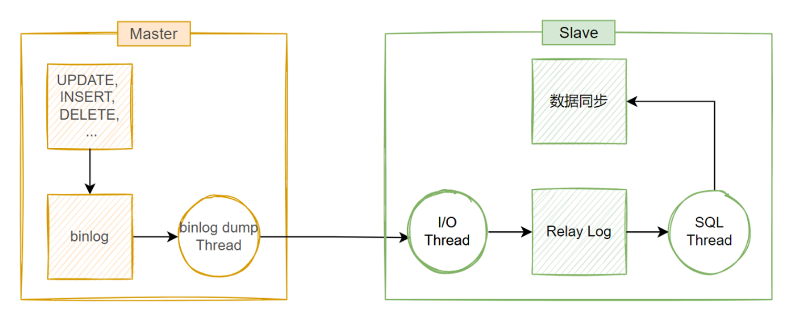

# MySQL 集群

## 集群介绍

当一个系统，或一个服务的请求量达到一定的数量级的时候，后端的数据库服务，很容易成为其性能瓶 颈。除了性能问题之外，如果只部署单个数据库服务，在此数据库服务当机，不能提供服务的情况下，整个系 统都会不可用。

服务性能扩展的两个方向: 横向 和 纵向

*   横向扩展：
    *   一 般采用新增节点的方式，增加服务节点的规模来解决性能问题，比如，当一台机器不够用时，可以再增加一台 机器或几台机器来分担流量和业务
*   纵向扩展：
    *   一般采 用升级服务器硬件，增加资源供给，修改服务配置项等方式来解决性能问题，比如，将服务器由32G内存升级 成128G内存，将服务最大并发数由128调整到256等。

## MySQL 主从复制

在实际生产环境中，为了解决 MySQL 服务的单点和性能问题，使用 MySQL 主从复制架构是非常常见的一种 方案。

在主从复制架构中，将 MySQL 服务器分为主服务器(Master)和从服务器(Slave)两种角色，主**服务器 负责数据写入(insert，update，delete，create 等)，从服务器负责提供查询服务(select 等)。**

MySQL 主从架构属于向外扩展方案，主从节点都有相同的数据集，其基于二进制日志的单向复制来实 现，复制过程是一个异步的过程。

**主从复制的优点**

*   负载均衡读操作：将读操作进行分流，由另外一台或多台服务器提供查询服务，降低 MySQL 负载，提升响 应速度
*   数据库备份：主从节点上都有相同的数据集，从而也实现了数据库的备份
*   高可用和故障切换：主从架构由两个或多个服务节点构成，在某个节点不可用的情况下，可以进行转移和切 换，保证服务可用
*    MySQL升级：当 MySQL 服务需要升级时，由于主从架构中有多个节点，可以逐一升级，而不停止服务

**主从复制的缺点**

*   数据延时：主节点上的数据需要经过复制之后才能同步到从节点上，这个过程需要时间，从而会造成主从节 点之间的数据不一致
*   性能消耗：主从复制需要开启单独线程，会消耗一定资源
*   数据不对齐：如果主从复制服务终止，而且又没有第一时间恢复，则从节点的数据一直无法更新


依赖于 MySQL 服务的应用程序连接代理，代理将应用程序的写操作分发到 Master 节点，将读操作分 发到从节点，如果有多个从节点，还可以根据不同的调度算法来进行分发。


## 主从复制原理

主从同步之前，两者的数据库软件版本、基准数据都是一样的。

在从库上启动复制时，首先创建I/O线程去连接主库，主库随后创建Binlog Dump线程读取数据库特定 事件并发送给I/O线程，I/O线程获取到事件数据后更新到从库的中继日志Relay Log中去，之后从库上的 SQL线程读取中继日志Relay Log中更新的数据库事件并应用

三个线程

| **线程**               | **节点** | **作用**                                                     |
| ---------------------- | -------- | ------------------------------------------------------------ |
| **Binlog Dump Thread** | Master   | 为 Slave 节点的 I/O Thread 提供本机的 binlog（二进制日志）数据，传输到从节点。 |
| **I/O Thread**         | Slave    | 从 Master 节点获取 binlog 数据，并存放到本地的 relay log（中继日志）中。 |
| **SQL Thread**         | Slave    | 从 relay log 中读取日志内容，将数据重放到本地数据库中，完成同步操作。 |

两个日志

| **日志类型**  | **节点** | **作用**                                                     |
| ------------- | -------- | ------------------------------------------------------------ |
| **Binlog**    | Master   | 主节点的二进制日志，记录所有更改数据的事务或事件，为从节点提供同步数据的源。 |
| **Relay Log** | Slave    | 从主节点同步过来的中继日志，暂存于从节点，用于 SQL Thread 解析并重放到从节点的数据文件中。 |

相关文件

```shell
master.info  # 用于保存slave连接至master时的相关信息，例如账号、密码、服务器地址              

relay-log.info  # 保存在当前slave节点上已经复制的当前二进制日志和本地relay log日志的对应关系         

mysql-relay-bin.00000N # 中继日志,保存从主节点复制过来的二进制日志,本质就是二进制日志     

# MySQL8.0 取消 master.info 和 relay-log.info文件
# 在MySQL 8.0中，复制配置和状态信息不再直接存储在磁盘上的master.info和relay-log.info文件中。
# 相反，这些信息被存储在数据字典表（如mysql.slave_master_info和mysql.slave_relay_log_info）中。
# 这些表提供了与旧文件相同的信息，但具有更好的性能和可靠性，因为它们是由MySQL服务器直接管理的。
```



*   Master 节点
    *   为每一个 Slave 节点上的 I/O thread 启动一个 dump thread，用来向其提供本机 的二进制事件
*   Slave 节点
    *   I/O thread 线程向 Master 节点请求该节点上的二进制事件，并将得到的内容写到当前 节点上的 replay log 中
    *   SQL thread 实时监测 replay log 内容是否有更新，如果更新，则将该文件中的内容 解析成SQL语句，还原到 Slave 节点上的数据库中去，这样来保证主从节点之间的数据同步。

## 主从复制配置

### 主库配置


### 从库配置

