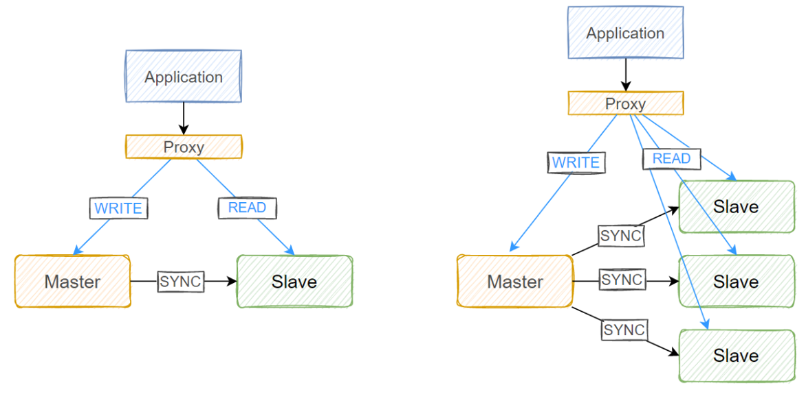

# MySQL 集群

## 集群介绍

当一个系统，或一个服务的请求量达到一定的数量级的时候，后端的数据库服务，很容易成为其性能瓶 颈。除了性能问题之外，如果只部署单个数据库服务，在此数据库服务当机，不能提供服务的情况下，整个系 统都会不可用。

服务性能扩展的两个方向: 横向 和 纵向

*   横向扩展：
    *   一 般采用新增节点的方式，增加服务节点的规模来解决性能问题，比如，当一台机器不够用时，可以再增加一台 机器或几台机器来分担流量和业务
*   纵向扩展：
    *   一般采 用升级服务器硬件，增加资源供给，修改服务配置项等方式来解决性能问题，比如，将服务器由32G内存升级 成128G内存，将服务最大并发数由128调整到256等。

## MySQL 主从复制

在实际生产环境中，为了解决 MySQL 服务的单点和性能问题，使用 MySQL 主从复制架构是非常常见的一种 方案。

在主从复制架构中，将 MySQL 服务器分为主服务器(Master)和从服务器(Slave)两种角色，主**服务器 负责数据写入(insert，update，delete，create 等)，从服务器负责提供查询服务(select 等)。**

MySQL 主从架构属于向外扩展方案，主从节点都有相同的数据集，其基于二进制日志的单向复制来实 现，复制过程是一个异步的过程。

**主从复制的优点**

*   负载均衡读操作：将读操作进行分流，由另外一台或多台服务器提供查询服务，降低 MySQL 负载，提升响 应速度
*   数据库备份：主从节点上都有相同的数据集，从而也实现了数据库的备份
*   高可用和故障切换：主从架构由两个或多个服务节点构成，在某个节点不可用的情况下，可以进行转移和切 换，保证服务可用
*    MySQL升级：当 MySQL 服务需要升级时，由于主从架构中有多个节点，可以逐一升级，而不停止服务

**主从复制的缺点**

*   数据延时：主节点上的数据需要经过复制之后才能同步到从节点上，这个过程需要时间，从而会造成主从节 点之间的数据不一致
*   性能消耗：主从复制需要开启单独线程，会消耗一定资源
*   数据不对齐：如果主从复制服务终止，而且又没有第一时间恢复，则从节点的数据一直无法更新


依赖于 MySQL 服务的应用程序连接代理，代理将应用程序的写操作分发到 Master 节点，将读操作分 发到从节点，如果有多个从节点，还可以根据不同的调度算法来进行分发。



## 主从复制原理

主从同步之前，两者的数据库软件版本、基准数据都是一样的。

在从库上启动复制时，首先创建I/O线程去连接主库，主库随后创建Binlog Dump线程读取数据库特定 事件并发送给I/O线程，I/O线程获取到事件数据后更新到从库的中继日志Relay Log中去，之后从库上的 SQL线程读取中继日志Relay Log中更新的数据库事件并应用

三个线程

| **线程**               | **节点** | **作用**                                                     |
| ---------------------- | -------- | ------------------------------------------------------------ |
| **Binlog Dump Thread** | Master   | 为 Slave 节点的 I/O Thread 提供本机的 binlog（二进制日志）数据，传输到从节点。 |
| **I/O Thread**         | Slave    | 从 Master 节点获取 binlog 数据，并存放到本地的 relay log（中继日志）中。 |
| **SQL Thread**         | Slave    | 从 relay log 中读取日志内容，将数据重放到本地数据库中，完成同步操作。 |

两个日志

| **日志类型**  | **节点** | **作用**                                                     |
| ------------- | -------- | ------------------------------------------------------------ |
| **Binlog**    | Master   | 主节点的二进制日志，记录所有更改数据的事务或事件，为从节点提供同步数据的源。 |
| **Relay Log** | Slave    | 从主节点同步过来的中继日志，暂存于从节点，用于 SQL Thread 解析并重放到从节点的数据文件中。 |

相关文件

```shell
master.info  # 用于保存slave连接至master时的相关信息，例如账号、密码、服务器地址              

relay-log.info  # 保存在当前slave节点上已经复制的当前二进制日志和本地relay log日志的对应关系         

mysql-relay-bin.00000N # 中继日志,保存从主节点复制过来的二进制日志,本质就是二进制日志     

# MySQL8.0 取消 master.info 和 relay-log.info文件
# 在MySQL 8.0中，复制配置和状态信息不再直接存储在磁盘上的master.info和relay-log.info文件中。
# 相反，这些信息被存储在数据字典表（如mysql.slave_master_info和mysql.slave_relay_log_info）中。
# 这些表提供了与旧文件相同的信息，但具有更好的性能和可靠性，因为它们是由MySQL服务器直接管理的。
```


*   Master 节点
    *   为每一个 Slave 节点上的 I/O thread 启动一个 dump thread，用来向其提供本机 的二进制事件
*   Slave 节点
    *   I/O thread 线程向 Master 节点请求该节点上的二进制事件，并将得到的内容写到当前 节点上的 replay log 中
    *   SQL thread 实时监测 replay log 内容是否有更新，如果更新，则将该文件中的内容 解析成SQL语句，还原到 Slave 节点上的数据库中去，这样来保证主从节点之间的数据同步。

## 主从复制配置

### 主库配置

参考文档

*   mysql8.0 
    *   https://dev.mysql.com/doc/refman/8.0/en/replication-configuration.html       

*   #mysql5.7 
    *   https://dev.mysql.com/doc/refman/5.7/en/replication-configuration.html       

*   mariadb
    *   https://mariadb.com/kb/en/setting-up-replication/  


**配置文件**

```ini
[mysqld]
# 启用二进制日志，指定路径与文件前缀
log_bin=/data/logbin/mysql-bin  
# 1 to 4294967295，默认值为1，主节点为0，则拒绝所有从节点的连接。
# 通常唯一id写主机ip的最后一位
server-id=N						

```

**创建有复制权限的用户账号**

```sql
create user repluser@'10.0.0.%' identified by '123456';
grant replication slave on *.* to repluser@'10.0.0.%';
```


### 从库配置

参考文档

https://dev.mysql.com/doc/refman/8.0/en/change-master-to.html  

**配置文件**

```ini
[mysqld]
# 开启从节点二进制日志
log-bin
# 为当前节点设置一个全局唯一的ID号,从节点为0，所有master都将拒绝此slave的连接
server_id=N 
# 设置数据库只读，针对supper user无效
read_only=ON
# relay log的文件前缀，默认值hostname-relay-bin
relay_log=relay-log
# 默认值hostname-relay-bin.index
relay_log_index=relay-log.index
```

**使用有复制权限的用户账号连接至主服务器，并启动复制线程**

```sql
-- 在从节点上执行下列SQL语句，提供主节点地址和连接账号，用户名，密码，开始同步的二进制文件和位置等

CHANGE MASTER TO MASTER_HOST='10.0.0.152',  -- 指定master节点
MASTER_USER='repluser',                     -- 连接用户
MASTER_PASSWORD='123456',                 -- 连接密码
MASTER_LOG_FILE='mysql-bin.000001',         -- 从哪个二进制文件开始复制
MASTER_LOG_POS=157,                         -- 指定同步开始的位置
MASTER_DELAY=interval                       -- 可指定延迟复制实现防误操作，单位秒，这里可以用作延时同步，一般用于备份

START SLAVE [IO_THREAD | SQL_THREAD];       -- 启动同步线程
STOP SLAVE                                  -- 停止同步
RESET SALVE ALL                             -- 清除同步信息

SHOW SLAVE STATUS;                          -- 查看从节点状态
SHOW RELAYLOG EVENTS in 'relay-bin.0000x'   -- 查看relaylog事件

-- 可以利用MASTER_DELAY参数设置从节点延迟同步，作用主从备份，比如设置1小时延时，则主节点上的误操作，要一个小时后才会同步到从服务器，可以利用时间差保存从节点数据
```

## 一主一从

主掉线，从会每隔60s进行重新连接


### 主

创建二进制日志目录

```shell
mkdir -pv /data/mysql/logbin
chown -R mysql:mysql /data/mysql/
```

更改apparmor使其mysql能够有读取指定路径的权限（ubuntu中）

```shell
vim /etc/apparmor.d/usr.sbin.mysqld
# 加入
/data/mysql/** rw,
/data/mysql rw,

# 重新加载apparmor
apparmor_parser -r /etc/apparmor.d/usr.sbin.mysqld
```

主节点mysql配置

```ini
vim /etc/mysql/mysql.conf.d/mysqld.cnf 
[mysqld]
server-id=12
log_bin=/data/mysql/logbin/mysql-bin
# 避免出现认证问题，问题见从配置最后
default_authentication_plugin=mysql_native_password 
# bind-address记得修改
```

重启服务

```shell
systemctl restart mysql
```

同步账号授权

```shell
create user repluser@'10.0.0.%' identified by '123456';
# 指定插件
CREATE USER 'repluser'@'10.0.0.%' IDENTIFIED WITH mysql_native_password BY '123456';

grant replication slave on *.* to repluser@'10.0.0.%';

flush privileges;
```

查看二进制日志与起始位置

```sql
mysql> show master status;
+------------------+----------+--------------+------------------+-------------------+
| File             | Position | Binlog_Do_DB | Binlog_Ignore_DB | Executed_Gtid_Set |
+------------------+----------+--------------+------------------+-------------------+
| mysql-bin.000001 |      879 |              |                  |                   |
+------------------+----------+--------------+------------------+-------------------+
1 row in set (0.00 sec)

# mysql-bin.000001 与 879
```


### 从

创建二进制日志（中继日志）目录

```shell
mkdir -pv /data/mysql/logbin
chown -R mysql:mysql /data/mysql/
```

更改apparmor使其mysql能够有读取指定路径的权限（ubuntu中）

```shell
vim /etc/apparmor.d/usr.sbin.mysqld
# 加入
/data/mysql/** rw,
/data/mysql rw,

# 重新加载apparmor
apparmor_parser -r /etc/apparmor.d/usr.sbin.mysqld
```

从节点mysql配置

```ini
vim /etc/mysql/mysql.conf.d/mysqld.cnf 
[mysqld]
server-id=204
read-only
log-bin=/data/mysql/logbin/mysql-bin
default_authentication_plugin=mysql_native_password
```

重启服务后

```shell
systemctl restart mysql.service
```

配置主从同步（mysql中）

```sql
CHANGE MASTER TO MASTER_HOST='10.0.0.12', MASTER_USER='repluser', MASTER_PASSWORD='123456', MASTER_PORT=3306, MASTER_LOG_FILE='mysql-bin.000001',MASTER_LOG_POS=849;

# 查看信息
show slave status\G
```

启动同步

```sql
START SLAVE;
```

查看线程

```sql
show processlist;
```

### 报错处理

```sql
# Error connecting to source 'repluser@10.0.0.12:3306'. This was attempt 1/86400, with a delay of 60 seconds between attempts. Message: Authentication plugin 'caching_sha2_password' reported error: Authentication requires secure connection.

-- 解决方案1：主节点改密码插件
ALTER USER 'repluser'@'10.0.0.%' IDENTIFIED WITH 'mysql_native_password' BY '123456';

-- 解决方案2：(生产中推荐，测试环境不推荐)
# 在服务器端，确保已启用 TLS/SSL。检查 MySQL 配置文件（my.cnf 或 my.ini）中的以下参数是否配置正确
[mysqld]
ssl-ca=/path/to/ca.pem
ssl-cert=/path/to/server-cert.pem
ssl-key=/path/to/server-key.pem
# 在客户端，使用 --ssl-mode=REQUIRED 强制客户端使用 TLS/SSL 连接
mysqlbinlog -R --host=10.0.0.121 --ssl-mode=REQUIRED --raw --stop-never --user=root --password=123456 ubuntu.000011
```

### 一主一从（主存在过往数据）

#### 主

配置好之前的主配置后

```sql
-- 重置二进制日志，如果从当前使用位置开始同步，则过往数据无法同步
reset master;

show master logs;
+------------------+-----------+-----------+
| Log_name         | File_size | Encrypted |
+------------------+-----------+-----------+
| mysql-bin.000001 |       157 | No        |
+------------------+-----------+-----------+
1 row in set (0.00 sec)

```

全量导出过往的数据

```shell
mysqldump -A -F --source-data=1 --single-transaction > all.sql
# 传输给从
```

#### 从

```shell
# 将all.sql文件中的下面的语句补齐
# CHANGE MASTER TO MASTER_LOG_FILE='mysql-bin.000002', MASTER_LOG_POS=157;
vim all.sql
CHANGE MASTER TO MASTER_LOG_FILE='mysql-bin.000002', MASTER_LOG_POS=157,MASTER_HOST='10.0.0.12',MASTER_USER='repluser', MASTER_PASSWORD='123456',MASTER_PORT=3306;

# 将数据导入
mysql < all.sql
```

## 一主多从

与一主一从实践一样，

注意有没有过往数据要导入

多从就是从多配置一遍，注意server-id要不同


## 级联复制


主从复制架构中，从节点从中继日志中读取到数据写入数据库后，该数据并不会写入到从节点的二进制日 志中

在级联同步架构中，有一个中间节点的角色，该节点从主节点中同步数据，并充当其它节点的数据 源，所以在此情况下，我们需要保证中间节点从主节点中同步过来的数据，同样也要写二进制日志，否则后续 节点无法获取数据。

在此架构中，中间节点要开启log_slave_updates选项，保证中间节点复制过来的数据也能写入二进制日志，为其它节点提供数据源

### 主节点

同一主一从

导出过往数据给中间节点

```shell
mysqldump -A -F --source-data=1 --single-transaction > all.sql
# 传输给中间
```

### 中间节点配置

配置中添加

```ini
vim /etc/mysql/mysql.conf.d/mysqld.cnf 
[mysqld]
server-id=204
read-only
log-bin=/data/mysql/logbin/mysql-bin
default_authentication_plugin=mysql_native_password
# 添加的
log_slave_updates 
```

导入主库数据

```shell
# 修改sql文件中的 CHANGE MASTER
vim 
CHANGE MASTER TO MASTER_LOG_FILE='mysql-bin.000002', MASTER_LOG_POS=157,MASTER_HOST='10.0.0.12',MASTER_USER='repluser', MASTER_PASSWORD='123456',MASTER_PORT=3306;

mysql < all.sql
```

启动同步

```sql
# 刷新内存中权限表
flush privileges;
start slave;
```

导出中间库数据给从节点

```shell
mysqldump -A -F --source-data=1 --single-transaction > all.sql
```

### 从节点

导入中间库数据

```shell
# 修改sql文件中的 CHANGE MASTER
vim 
CHANGE MASTER TO MASTER_LOG_FILE='mysql-bin.000003', MASTER_LOG_POS=157,MASTER_HOST='10.0.0.204',MASTER_USER='repluser', MASTER_PASSWORD='123456',MASTER_PORT=3306;

mysql < all.sql
```

启动同步

```sql
start slave;
```

## 主主复制

在双主模型中，两个节点互为主备，两个节点都要开启二进制日志，都要有写权限。


Master <> Master 双主架构互为主从，要保证不同的库或表在不同的节点上，即两个节点不要同时写 一个库，双主架构一般配置为只写一个节点，这种架构的好处是可以随时将另一个节点设为主节点

### master1

配置

```ini
[mysqld]
server-id=12
log_bin=/data/mysql/logbin/mysql-bin
default_authentication_plugin=mysql_native_password
# 没有read-only，因为要写
```

同步账号授权

```shell
create user repluser@'10.0.0.%' identified by '123456';
# 指定插件
CREATE USER 'repluser'@'10.0.0.%' IDENTIFIED WITH mysql_native_password BY '123456';

grant replication slave on *.* to repluser@'10.0.0.%';

flush privileges;
```

查看二进制日志与起始位置

```sql
mysql> show master status;

# mysql-bin.000001 与 849
```

配置同步

```sql
# 特别注意：使用另一端的MASTER_LOG_FILE与MASTER_LOG_POS
CHANGE MASTER TO MASTER_HOST='10.0.0.204', MASTER_USER='repluser', MASTER_PASSWORD='123456', MASTER_PORT=3306, MASTER_LOG_FILE='mysql-bin.000002',MASTER_LOG_POS=849;
```

启动同步

```sql
start slave;
```


### master2

配置

```ini
[mysqld]
server-id=204
log_bin=/data/mysql/logbin/mysql-bin
default_authentication_plugin=mysql_native_password
# 没有read-only，因为要写
```

同步账号授权

```shell
create user repluser@'10.0.0.%' identified by '123456';
# 指定插件
CREATE USER 'repluser'@'10.0.0.%' IDENTIFIED WITH mysql_native_password BY '123456';

grant replication slave on *.* to repluser@'10.0.0.%';

flush privileges;
```

查看二进制日志与起始位置

```sql
mysql> show master status;

# mysql-bin.000002 与 849
```

配置同步

```sql
# 特别注意：使用另一端的MASTER_LOG_FILE与MASTER_LOG_POS
CHANGE MASTER TO MASTER_HOST='10.0.0.12', MASTER_USER='repluser', MASTER_PASSWORD='123456', MASTER_PORT=3306, MASTER_LOG_FILE='mysql-bin.000001',MASTER_LOG_POS=849;
```

启动同步

```sql
start slave;
```

###  双主架构的注意事项

**双主架构在实际生产环境中，并不会配置为两个节点都去写数据**

双主架构在实际生产环境中，并不会配置为两个节点都去写数据，前端应用只会写一个节点，另一个节点 作为备份节点，如果当前使用的节点出问题，则IP地址会立即转移到另一个节点上，起到一个高可用的作用， 此时，如果有slave节点，在 slave 上要重新执行同步操作。


注意：两台数据库虽然数据是一样的，但是二进制日志有可能是不一样的

发生冲突，重新同步

```sql
stop slave;

# 跳过1个错误事件
set global sql_slave_skip_counter=1;

start slave;

set global sql_slave_skip_counter=0;

show slave status\G
```

```sql
# 除了使用 set global sql_slave_skip_counter=N 忽略错误个数之外，
# 也可以用忽略指定错误编号的方式来处理错误。
show slave status\G
# 中的Last_Errno与 Last_SQL_Errno

# 在配置中
[mysqld]
slave_skip_errors=N|ALL
```

##  半同步复制

应用程序或客户端向主节点写入数据，主节点给客户端返回写入成功或失败状态，从节点同步数据，这几个事情的步骤和执行顺序不一样，意味着不同的同步策略，从而对MySQL的性能和数据安全性有着不同的影响

*   异步复制
    *   当客户端程序向主节点中写入数据后，主节点中数据落盘， 写入binlog日志，然后将binlog日志中的新事件发送给从节点 ，便向客户端返回写入成功，而并不验证 从节点是否接收完毕，也不等待从节点返回同步状态
    *   客户端只能确认向主节点的写入是成功 的，并不能保证刚写入的数据成功同步到了从节点。
    *   异步复制不要求数据能成功同步到从节点，只要主节点完成写操作，便立即向客户端返回结果。
    *   如果主从同步出现故障，则有可能出现主从节点之间数据不一致的问题
    *   如果 在主节点写入数据后没有完成同步，主节点服务当机，则会造成数据丢失。
*   同步复制
    *   当客户端程序向主节点中写入数据后，主节点中数据落盘，写入binlog日志，然后将binlog日志中的新 事件发送给从节点 ，等待所有从节点向主节点返回同步成功之后，主节点才会向客户端返回写入成功。
    *   最大限度的保证数据安全和主从节点之间的数据一致性
    *   性能不高
*   半同步复制
    *   当客户端程序向主节点中写入数据后，主节点中数据落盘，写入binlog日志，然后将binlog日志中的新 事件发送给从节点 ，等待所有从节点中有一个从节点返回同步成功之后，主节点就向客户端返回写入成 功。
    *   至少有一个从节点中有同步到数据，也能尽早的向客户端返回写入状态。
    *   但此复制策略并不能百分百保证数据有成功的同步至从节点，可以在此策略下设至同步超时时间， 如果超过等待时间，即使没有任何一个从节点返回同步成功的状态，主节点也会向客户端返回写入成 功。
    *   如果生产业务比较关 注主从最终一致(比如:金融等)。推荐可以使用MGR的架构，或者PXC等一致性架构。

### 半同步策略

#### mysql5.7

```ini
rpl_semi_sync_master_wait_point=after_commit
```


在此半同步策略配置中，可能会出现下列问题：

*   幻读：当客户端提交一个事务，该事务己经写入 redo log 和 binlog，但该事务还没有写入从节 点，此时处在 Waiting Slave dump 处，此时另一个用户可以读取到这条数据，而他自己却不能。
*   数据丢失：一个提交的事务在 Waiting Slave dump 处 crash后，主库将比从库多一条数据

#### mysql8.0

```ini
rpl_semi_sync_master_wait_point=after_sync
```


在mysql8.0之后的半同步策略配置中，客户端的写操作先不提交事务，而是先写二进制日志，然后向从库同步数据，由于在主节点上的事务还没提交，所以此时其他进程查不到当前的写操作，不会出现幻读的问题，而且主节点要确认至少一个从节点的数据同步成功了，再会提交事务，这样也保证了主从之间的数据一致性，不会存在丢失的情况 

总结就是：先写二进制日志，确定从节点同步后，再提交事务落盘，从而确保主库落盘的数据是从库同步成功的。防止主从不一致

### 配置

#### 主

安装插件

```sql
INSTALL PLUGIN rpl_semi_sync_master SONAME 'semisync_master.so';

# 未启用状态
select @@rpl_semi_sync_master_enabled;

# 相关内容
show global variables like '%semi%';

show global status like '%semi%';
```

启用插件

```ini
[mysqld]
rpl_semi_sync_master_enabled
# rpl_semi_sync_master_timeout=3000                   设定同步超时时间为3秒
```

之后正常配置主从同步


#### 从

安装插件

```sql
INSTALL PLUGIN rpl_semi_sync_slave SONAME 'semisync_slave.so';

# 未启用
select @@rpl_semi_sync_slave_enabled;
```

启用插件

```ini
[mysqld]
rpl_semi_sync_slave_enabled
```

## 复制过滤器

复制过滤器是指让从节点仅复制指定的数据库，或指定数据库的指定表。

复制过滤器的实现有两种方式：

*   在 master 节点上使用服务器选项配置来实现：在 master 节点上配置仅向二进制日志中写入与特定数据库相关的事件。
    *   优点：只需要在 master 节点上配置一次即可，不需要在 salve 节点上操作；减小了二进制日志中的数 据量，能减少磁盘IO和网络IO。
    *   缺点：二进制日志中记录的数据不完整，如果当前节点出现故障，将无法使用二进制还原。
*   在 slave 节点上使用服务器选项或者是全局变量配置来实现：在 slave 节点上配置在读取 relay log  时仅处理指定的数据库或表。


### 方案1：主节点配置

相关配置项

```ini
[mysqld]
binlog-do-db=db1              # 数据库白名单列表，不支持同时指定多个，如果想实现多个数据库需多行实现
binlog-do-db=db2

binlog-ignore-db=db3          # 数据库黑名单列表，不支持同时指定多个，如果想实现多个数据库需多行实现
binlog-ignore-db=db3
```


```ini
[mysqld]
server-id=8
rpl_semi_sync_master_enabled
log_bin=/data/mysql/logbin/mysql-bin
binlog-ignore-db=db1
binlog-ignore-db=db2
#配置白名单的方式表示仅往二进制日志中写指定的库
#配置黑名单的方式表示除了黑名单中的库或表，都写二进志日志
```

查看

```sql
# 可查看黑白名单配置情况
show master status;
```

**复制过滤规则的配置需要非常谨慎，特别是在涉及跨库或连表操作时，可能会出现同步失败的问题。**

当复制过滤规则排除了某些库或表，但事务涉及多个库时，可能会导致事务在从服务器上执行失败。例如：

-   在主服务器上执行 `INSERT INTO db1.table1 SELECT * FROM db2.table2`。
-   如果复制过滤规则只允许同步 `db1`，而 `db2` 被排除，则复制的 SQL 语句在从服务器上会因为缺少 `db2.table2` 数据而失败。

如果复制过滤规则仅允许某些表被复制，而 SQL 查询涉及多个被排除的表，则复制的 SQL 语句在从库上无法正确执行。

### 方案1：从节点配置

```ini
[mysqld]
replicate-do-db=db1        # 指定复制库的白名单，每行指定一个库，多个库写多行
replicate-do-table=tab1    # 指定复制表的白名单，每行指定一个表，多个表写多行

replicate-ignore-db=db1          # 指定复制库的黑名单，每行指定一个库，多个库写多行
replicate-ignore-table=tab1      # 指定复制表的黑名单，每行指定一个表，多个表写多行 

replicate-wild-do-table=db%.stu%      # 指定复制表的白名单，支持通配符，每行指定一个规则，多个规则写多行
replicate-wild-ignore-table=foo%.bar% # 指定复制表的黑名单，支持通配符，每行指定一个规则，多个规则写多行 
```

查看

```sql
# 可查看黑白名单配置情况
show master status;
```

## GTID复制（高并发场景）

GTID（global transaction ID）：全局事务ID

二进制日志中默认GTID是匿名

```shell
# 所有事务的操作都是都是ANONYMOUS，没有标识。这就意味着，当事务量多的时候，只能按照顺序进行处理
SET @@SESSION.GTID_NEXT= 'ANONYMOUS'/*!*/; 
```

GTID 是一个己提交的事务的编号，由当前 MySQL 节点的 server-uuid 和每个事务的  transacton-id 联合组成，每个事务的 transacton-id 唯一，但仅只在当前节点唯一，server-uuid  是在每个节点自动随机生成，能保证每个节点唯一。基于此，用 server-uuid 和 transacton-id 联合 的 GTID 也能保证全局唯一。

开启 GTID 功能可以支持多 DUMP 线程的并发复制，而且 MySQL5.6 实现了基于库级别多 SQL 线程并 发。在 MySQL5.7 利用 GTID 的 Logic clock 逻辑时钟。保证了同库级别下的事务顺序问题。即可以实 现基于事务级别的并发回放。从而大大减少了同步的延迟。

**同时 GTID 具有幂等性特性，即多次执行结果是一样的。**

利用 GTID 复制不像传统的复制方式（异步复制、半同步复制）需要找到 binlog 文件名和 POS  点，只需知道 master 节点的 IP、端口、账号、密码即可。开启 GTID 后，执行 change master to  master_auto_postion=1 即可，它会自动寻找到相应的位置开始同步。


在传统的基于 **二进制日志位置** 的复制中，从服务器需要依赖主服务器的 binlog 文件位置来跟踪复制的进度，这可能会导致同步问题或者在复制中断时难以恢复。而使用 GTID，主从服务器不再依赖 binlog 的文件位置，而是使用事务的唯一标识符来定位事务的位置。

-   **无缝切换**：在使用 GTID 的情况下，主服务器和从服务器之间的切换更加方便，尤其是在故障转移时。从服务器能明确知道已经执行了哪些事务，因此能够准确地接收新的事务，而不需要手动记录和重置文件位置。
-   **自动追踪**：GTID 可以自动记录复制的进度，避免了手动管理日志文件位置的问题。


GTID优点

- GTID使用了master_auto_position=1替代了基于binlog和position号的主从复制方式，更便于主从复制的搭建
- GTID可以知道事务在最开始是在哪个实例上提交的，保证事务全局统一
- 截取日志更方便，跨多文件，判断起点终点更方便
- 传输日志，可以并发传送，SQL回放可以跟高并发
- 判断主从工作状态更加方便


**总结：GTID的作用：在高并发条件下，保证事务的顺序**

### 查看当前节点的server-uuid

```shell
mysql> show global variables like '%server_uuid%';
+---------------+--------------------------------------+
| Variable_name | Value                                |
+---------------+--------------------------------------+
| server_uuid   | d5cdb5a0-26df-11ef-badc-000c29bb0db4 |
+---------------+--------------------------------------+
1 row in set (0.00 sec)

# 此文件在MySQL5.7开始才有
cat /var/lib/mysql/auto.cnf
[root@ubuntu2204 ~]#cat /var/lib/mysql/auto.cnf 
[auto]
server-uuid=d5cdb5a0-26df-11ef-badc-000c29bb0db4
```

在主从架构中，主从节点可以互相获取对方节点的server-id

```sql
mysql> show slave hosts;
+-----------+------+------+-----------+--------------------------------------+
| Server_id | Host | Port | Master_id | Slave_UUID                           |
+-----------+------+------+-----------+--------------------------------------+
|       202 |      | 3306 |       200 | ca6ae13a-2586-11ef-8306-0050563b6427 |
|       201 |      | 3306 |       200 | bfde3e44-26df-11ef-acae-00505634fd39 |
+-----------+------+------+-----------+--------------------------------------+
2 rows in set, 1 warning (0.00 sec) 

# 在从slave节点上看主节点的server_id
show slave status\G
...
Master_Server_Id: 200
Master_UUID: d5cdb5a0-26df-11ef-badc-000c29bb0db4
Master_Info_File: mysql.slave_master_info.
...
```

### 配置

在master与slave都添加GTID选项

```ini
[mysqld]
gtid_mode=ON    
enforce_gtid_consistency=ON
```

之后正常配置主

**从节点配置有差别：`MASTER_AUTO_POSITION=1`**

```sql
CHANGE MASTER TO MASTER_HOST='10.0.0.12', MASTER_USER='repluser', MASTER_PASSWORD='123456', MASTER_PORT=3306, MASTER_AUTO_POSITION=1;
```

# 主从复制的监控和维护

## percona-toolkit

```
sudo apt-get install percona-toolkit
```

## 监控和维护

### 清理日志

```sql
RESET MASTER; # master环境清理binlog日志
RESET SLAVE;  # 重置mysql的主从同步
```

### 查看同步状态

```sql
SHOW MASTER STATUS;
SHOW BINARY LOGS\G
SHOW BINLOG EVENTS\G
SHOW SLAVE STATUS\G
SHOW PROCESSLIST\G
SHOW SLAVE HOSTS;         # 在主节点上查看所有的从节点列表
```

### 从服务器是否落后于主服务

```sql
show slave status\G

Seconds_Behind_Master：0  # 表示未落后
```

### 如何确定主从节点的数据是否一致

使用第三方工具percona-toolkit

```shell
 https://www.percona.com/software/database-tools/percona-toolkit
```

### 数据不一致，如何修复

重置主从关系，重新复制

**常见原因**

*   主库 binlog 格式为 Statement，同步到从库执行后可能造成主从不一致。
    *   binlog 格式：raw
*   部分操作未记入二进制日志
    *   主库执行更改前有执行set sql_log_bin=0，会使主库不记录 binlog，从库也无法变更这部分数据。
*   从节点未设置只读，误操作写入数据
*   主库或从库意外宕机，宕机可能会造成 binlog 或者 relaylog 文件出现损坏，导致主从不一致
*   主从数据库的版本不一致，特别是高版本是主，低版本为从的情况下，主数据库上面支持的功能，从数据库上面 可能不支持该功能
*   主从 sql_mode 不一致,也就是说，两方对于数据库执行的检查标准不一样
*   MySQL 自身 bug 导致


**解决方案**

*   将从库重新实现
    *   虽然这是一种解决方法，但此方案恢复时间较慢，而且有时候从库也是承担一部分的查询 操作的，不能贸然重建。
*   使用 percona-toolkit 工具辅助：PT 工具包中包含 pt-table-checksum 和 pt-table-sync 两 个工具，主要用于检测主从是否一致以及修复数据不一致情况。这种方案优点是修复速度快，不需要停止主从 辅助，缺点是需要会使用该工具，关于使用方法，可以参考下面链接： https://www.cnblogs.com/feiren/p/7777218.html
*   手动重建不一致的表：在从库发现某几张表与主库数据不一致，而这几张表数据量也比较大，手工比对数据 不现实，并且重做整个库也比较慢，这个时候可以只重做这几张表来修复主从不一致。这种方案缺点是在执行 导入期间需要暂时停止从库复制，不过也是可以接受的。


## 常见问题和解决方案

### 数据损坏或丢失

*   如果是 slave 节点的数据损坏或丢失，重置数据库，重新同步复制即可
*   如果要防止 master 节点的数据损坏或丢失，则整个主从复制架构可以用 MHA+半同步来实现，在  master 节点不可用时，提升一个 salve 节点为新的 master 节点


### 在环境中出现了不唯一的 server-id

可手动修改 server-id 至唯一，再次重新复制

```shell
/var/lib/mysql/auto.cnf 
```

### 主从复制出现延迟

*   升级到 MySQL5.7 以上版本,利用 GTID支持并发传输 binlog 及并 行多个 SQL 线程
*   减少大事务，将大事务拆分成小事务
*   减少锁
*   sync_binlog=1 (实时写入磁盘)加快 binlog 更新时间，从而加快日志复制
*   需要额外的监控工具的辅助
*   多线程复制：对多个数据库复制
*   一从多主：Mariadb10 版后支持


### 数据不一致处理

在当前主从同步中，有 A，B，C 三张表的数据在 master 节点与 slave 节点中不一致

**salve 节点停止同步**

```sql
stop slave;
```

**master 节点导出 A,B,C的备份**

```shell
mysqldump -uroot -pmagedu -q --single-transaction --master-data=2 testdb A B C >/backup/A_B_C.sql
```

**从备份文件中找到 master 节点截至到备份时的 master log 和 pos**

```shell
-- MASTERLOGFILE='mysql-bin.888888', MASTERLOGPOS=666666;   # 该条属性是注释的
```

将 A_B_C.sql 文件 scp 到 slave 节点，并在 **savle 节点上开启同步到指定位置再停下来**

作用是同步到主从还是同步的位置，为导入主库备份数据提供准备。

从库会同步到指定的位置并自动停止，此时主从数据是一致的。

```sql
mysql>start slave until MASTERLOGFILE='mysql-bin.888888',MASTERLOGPOS=666666;
```

**在 slave 节点上导入备份数据**

```sql
#在 slave 节点上导入备份数据
mysql -uroot -p123456 testdb
mysql>set sql_log_bin=0;
mysql>source /backup/A_B_C.sql
mysql>set sql_log_bin=1;
```

**恢复从库的复制**

```sql
START SLAVE;
```

明确同步起点：

-   通过记录和指定 `MASTER_LOG_FILE` 和 `MASTER_LOG_POS`，从库知道从哪里开始同步主库的后续事务。

避免事务冲突：

-   通过在指定位置停止复制再导入数据，可以确保导入的数据和主库的后续 binlog 不冲突。

保持数据一致性：

-   从库的数据会在导入后与主库保持一致，避免丢失或重复数据。


###  如何避免主从不一致

*   主库 binlog 采用 ROW 格式 
*   主从实例数据库版本保持一致 
*   主库做好账号权限把控，不可以执行 set sql_log_bin=0 
*   从库开启只读，不允许人为写入 
*   定期进行主从一致性检验


# MySQL中间件代理服务器

## 关系型数据库和 NoSQL 数据库

关系型数据库，是建立在关系模型基础上的数据库，其借助于集合代数等数学概念和方法来处理数据库中 的数据。主流的 MySQL，Oracle，MS SQL Server 和 DB2 都属于这类传统数据库。

NoSQL 数据库，全称为 Not Only SQL，意思就是适用关系型数据库的时候就使用关系型数据库，不 适用的时候也没有必要非使用关系型数据库不可，可以考虑使用更加合适的数据存储。主要分为临时性键值存 储（Redis，memcached），永久性键值存储（ROMA，Redis），面向文档的数据库（MongoDB， CouchDB），面向列的数据库（Cassandra，HBase），每种 NoSQL 都有其特有的使用场景及优点。


主要是由于随着互联网发展，数据量越来越大，对性能要求越来越高，传统数据库存在着先天性的缺陷， 即单机（单库）性能瓶颈，并且扩展困难。

*   关系型数据库

    *   特点
        *    数据关系模型基于关系模型，结构化存储，完整性约束
        *   基于二维表及其之间的联系，需要连接，并，交，差，除等数据操作
        *   采用结构化的查询语言 (SQL) 做数据读写
        *   操作需要数据的一致性，需要事务甚至是强一致性 
    *   优点
        *   保持数据的一致性(事务处理)
        *   可以进行 join 等复杂查询
        *   通用化，技术成熟
    *   缺点
        *   数据读写必须经过 sql 解析，大量数据，高并发下读写性能不足
        *   对数据做读写，或修改数据结构时需要加锁，影响并发操作
        *   无法适应非结构化存储
        *   扩展困难
        *   昂贵、复杂
*   NoSQL
    
    *   特点
        *   非结构化的存储
        *    基于多维关系模型
        *   具有特有的使用场景
    
    *   优点
        *   高并发，大数据下读写能力较强
        *   基本支持分布式，易于扩展，可伸缩
        *   简单，弱结构化存储
    
    *   缺点
        *   join 等复杂操作能力较弱
        *   事务支持较弱
        *   通用性差
        *   无完整约束复杂业务场景支持较差

## 数据库切片

数据库切（分）片简单来说，就是指通过某种特定的条件，将我们存放在同一个数据库中的数据分散存放 到多个数据库（主机）中，以达到分散单台设备负载的效果。

数据的切分（Sharding）根据其切分规则的类型，可以分为两种切分模式 -- **垂直|水平**。

*   垂直切分
    *   最大特点就是规则简单，实施也更为方便，尤其适合各业务之间的耦合度非常低，相互影响 小， 业务逻辑非常清晰的系统，在这种系统中，可以很容易做到将不同业务模块所使用的表分拆到不同的数据 库中。 根据不同的表来进行拆分，对应用程序的影响也更小，拆分规则也会比较简单清晰。
*   水平切分
    *   相对来说稍微复杂一些。因为要将同一个表中的不同数据拆分到不同的数据库 中， 对于应用程序来说，拆分规则本身就较根据表名来拆分更为复杂，后期的数据维护也会更为复杂一些。

### 垂直切分

一个数据库由很多表的构成，每个表对应着不同的业务，垂直切分是指按照业务将表进行分类，分布到不 同的数据库上面，这样也就将数据或者说压力分担到不同的库上面。


系统中有些表难以做到完全独立，存在着跨库 join 的情况，对于这类表，就需要去做平衡， 是数据库让步业务，共用一个数据源，还是分成多个库，业务之间通过接口来做调用。在系统初期，数据量比 较少，或者资源有限的情况下，会选择共用数据源，但是当数据发展到了一定的规模，负载很大的情况，就需 要必须去做分割。

一般来讲业务存在着复杂 join 的场景是难以切分的，往往业务独立的易于切分。如何切分，切分到何 种程度是考验技术架构的一个难题。

*   优点
    *   拆分后业务清晰，拆分规则明确
    *   系统之间整合或扩展容易
    *   数据维护简单
*   缺点
    *   部分业务表无法 join，只能通过接口方式解决，提高了系统复杂度
    *   受每种业务不同的限制存在单库性能瓶颈，不易数据扩展跟性能提高
    *   事务处理复杂


### 水平切分

水平拆分不是将表做分类，而是按照某个字段的某种规则来分散到多个库之中，每个表 中包含一部分数据。简单来说，我们可以将数据的水平切分理解为是按照数据行的切分，就是将表中的某些行 切分到一个数据库，而另外的某些行又切分到其他的数据库中。


拆分数据就需要定义分片规则。关系型数据库是行列的二维模型，拆分的第一原则是找到拆分维度。比 如：

*   从会员的角度来分析，商户订单交易类系统中查询会员某天某月某个订单，那么就需要按照会员结合日期 来拆分， 不同的数据按照会员 ID 做分组，这样所有的数据查询 join 都会在单库内解决；

*   如果从商户的角度来讲，要查询某个商家某天所有的订单数，就需要按照商户 ID 做拆分；

但是如果系统既想按会员拆分，又想按商家数据，则会有 一定的困难。 如何找到合适的分片规则需要综合考虑衡量。


几种典型的分片规则包括：

*   按照用户 ID 求模，将数据分散到不同的数据库，具有相同数据用户的数据都被分散到一个库中
*   按照日期，将不同月甚至日的数据分散到不同的库中
*   按照某个特定的字段求摸，或者根据特定范围段分散到不同的库中


*   优点

    *    拆分规则抽象良好，join 操作基本都可以数据库完成

    *   不存在单库大数据，高并发的性能瓶颈

    *   应用端改造较少

    *   提高了系统的稳定性跟负载能力

*   缺点

    *   拆分规则难以抽象
    *   分片事务一致性难以解决
    *   数据多次扩展难度跟维护量极大
    *   跨库 join 性能较差

### 数据切分的经验

*   能不切分尽量不要切分
*   如果要切分一定要选择合适的切分规则，提前规划好。
*   数据切分尽量通过数据冗余或表分组（Table Group）来降低跨库 join 的可能
*   由于数据库中间件对数据 Join 实现的优劣难以把握，而且实现高性能难度极大，业务读取尽量少 使用多表 join。


## MySQL 中间件应用

垂直切分跟水平切分的不同跟优缺点，会发现每种切分方式都有缺点，但共同特点缺点有：

*   引入分布式事务的问题
*   跨节点 Join 的问题
*   跨节点合并排序分页问题
*   多数据源管理问题

应对思路

1.   客户端模式，在每个应用程序模块中配置管理自己需要的一个（或者多个）数据源，直接访问各个数据 库， 在模块内完成数据的整合
2.    通过中间代理层来统一管理所有的数据源，后端数据库集群对前端应用程序透明； 

可能 90%以上的人在面对上面这两种解决思路的时候都会倾向于选择第二种，尤其是系统不断变得庞大 复杂 的时候。确实，这是一个非常正确的选择，虽然短期内需要付出的成本可能会相对更大一些，但是对整个 系统的 扩展性来说，是非常有帮助的。

MySQL中间件服务器可以通过将数据切分解决传统数据库的缺陷，又有了 NoSQL 易于扩展的优点。通过 中间代理层规避了多数据源的处理问题，对应用完全透明，同时对数据切分后存在的问题，也做了解决方案。


常见 MySQL 中间件

| 项目        | 开发者   | 官方网站                                                     |
| ----------- | -------- | ------------------------------------------------------------ |
| mysql-proxy | Oracle   | [https://downloads.mysql.com/archives/proxy/](https://downloads.mysql.com/archives/proxy/) |
| Atlas       | Qihoo    | [https://github.com/Qihoo360/Atlas/blob/master/README_ZH.md](https://github.com/Qihoo360/Atlas/blob/master/README_ZH.md) |
| dbproxy     | 美团     | [https://github.com/Meituan-Dianping/DBProxy](https://github.com/Meituan-Dianping/DBProxy) |
| Cetus       | 网易乐得 | [https://github.com/Lede-Inc/cetus](https://github.com/Lede-Inc/cetus) |
| Amoeba      |          | [https://sourceforge.net/projects/amoeba/](https://sourceforge.net/projects/amoeba/) |
| Cobar       | 阿里     | [https://github.com/alibaba/cobar](https://github.com/alibaba/cobar) |
| Mycat       |          | [http://www.mycat.org.cn/](http://www.mycat.org.cn/)         |
| ProxySQL    |          | [https://proxysql.com/](https://proxysql.com/)               |
| MaxScale    | MariaDB  | [https://mariadb.com/kb/en/maxscale/](https://mariadb.com/kb/en/maxscale/) |


## MyCat实现 MySQL 读写分离

### 简介

[| MYCAT官方网站—中国第一开源分布式数据库中间件](http://www.mycat.org.cn/)

 Mycat 是一个开源的分布式数据库系统，是一个实现了 MySQL 协议的服务器，前端用户可以把它看作 是一个数据库代理（类似于Mysql Proxy），用 MySQL 客户端工具和命令行访问，而其后端可以用 MySQL  原生协议与多个 MySQL 服务器通信，也可以用 JDBC 协议与大多数主流数据库服务器通信，其核心功能是 **分表分库**，即将一个大表水平分割为 N 个小表，存储在后端 MySQL 服务器里或者其他数据库里。


MyCat 的高可用,可以使用的高可用集群方式有:

-   Keepalived+Mycat+Mysql
-   Keepalived+LVS+Mycat+Mysql
-   Keepalived+Haproxy+Mycat+Mysql

需要注意: 在生产环境中, Mycat 节点最好使用双节点, 即双机热备环境, 防止Mycat这一层出现单点故 障

### 安装mycat

#### 安装-启动

不要安装过高版本的java版本，openjdk17启动失败，11可以

[MyCATApache/Mycat-Server](https://github.com/MyCATApache/Mycat-Server)

```shell
wget https://github.com/MyCATApache/Mycat-download/blob/master/1.6-RELEASE/Mycat-server-1.6-RELEASE-20161028204710-linux.tar.gz
# 自行寻找软件包

tar xf Mycat-server-1.6.7.6-release-20220524173810-linux.tar.gz -C ./
```

目录结构

```shell
bin           # mycat命令，启动，重启，停止等
catlet        # 扩展功能目录，默认为空
conf          # 配置文件目录
lib           # 引用的jar包
logs          # 日志目录，默认为空
version.txt   # 版本说明文件

# 日志
logs/wrapper.log   # Mycat启动日志
logs/mycat.log     # Mycat详细工作日志

# 常用配置文件
conf/server.xml    # Mycat软件本身相关的配置文件，设置账号，参数等
conf/schema.xml    # 对应的物理数据库和数据库表的配置，读写分离，高可用，分布式策略定制，节点控制
conf/rule.xml      # Mycat分片（分库分表）规则配置文件，记录分片规则列表，使用方法等。
```

写PATH

```shell
# 写PATH
vim /etc/profile.d/mycat.sh
PATH=/root/mycat/bin:$PATH

source /etc/profile.d/mycat.sh
```

查看mycat的默认配置,其中有登录的账户与密码

```shell
vim ./mycat/conf/server.xml
```

启动

```shell
# 启动
mycat start

# 需要提前安装mysql的客户端工具
apt install mysql -y

# 连接mycat
mysql -uroot -p123456 -h 127.0.0.1 -P8066
```

#### server.xml配置

配置文件说明

```shell
server.xml  # 存放mycat软件本身相关配置的文件，比如，链接mycat的用户，密码，数据库名等

# 相关配置
user        # 用户配置节点
name        # 客户端登录mycat的用户名
password    # 客户端登录mycat的密码
schema      # 数据库名，这里会和schema.xml中的相关配置关联，多个用逗号分开
privileges  # 配置用户针对表的增删改查的权限
readOnly    # mycat逻辑库所具有的权限，true为只读，false为读写都有，默认false
```

- server.xml文件里登录mycat的用户名和密码可以任意定义，这个账号和密码是为客户机登录mycat时使用的账号信息
- 逻辑库名(如上面的TESTDB，也就是登录mycat后显示的库名，切换这个库后，显示的就是代理的真实mysql数据库的表)要在`schema.xml`里面也定义，否则会导致mycat服务启动失败
- 这里只定义了一个标签，所以把多余的注释了，如果定义多个标签，即设置多个连接mycat的用户和密码，那么就需要在schema.xml文件中定义多个对应的库

#### schema.xml配置

schema.xml是最主要的配置项，此文件关联mysql读写分离策略，读写分离、分库分表策略、分片节 点都是在此文件中配置的。

MyCat作为中间件，它只是一个代理，本身并不进行数据存储，需要连接后 端的MySQL物理服务器，此文件就是用来连接 MySQL 服务器的

```shell
schema           # 数据库设置，此数据库为逻辑数据库，name与server.xml中schema对应
dataNode         # 分片信息，也就是分库相关配置
dataHost         # 物理数据库，真正存储数据的数据库

# 每个节点的属性逐一说明
schema
    name            # 逻辑数据库名，与server.xml中的schema对应
    checkSQL_schema # 数据库前缀相关的设置，这里为false
    sqlMax.limit    # select时默认的limit，避免查询全表

table
    name            # 表名，物理数据库中表名
    dataNode        # 表存储到哪些节点，多个节点用逗号分隔，节点为下文dataNode设置的name
    primaryKey      # 主键字段名，自动生成主键时需要设置
    autoIncrement   # 是否自增
    rule            # 分片规则名，具体规则下文rule详细介绍
  
dataNode
    name            # 节点名，与table中dataNode对应
    datahost        # 物理数据库名，与datahost中name对应
    database        # 物理数据库中的数据库名

dataHost
    name            # 物理数据库名，与dataNode中dataHost对应
    balance         # 均衡负载的方式
    writeType       # 写入方式
    dbType          # 数据库类型
    heartbeat       # 心跳检测语句，注意语句结束结尾的分号要加  
```


### 读写分离的实现

正常配置主从

主库中添加mycat用户

```sql
create user 'mycater'@'10.0.0.%' identified by '123456';

grant all on *.* to 'mycater'@'10.0.0.%';

flush privileges;
```

Mycat服务器配置

server.xml

```xml
<?xml version="1.0" encoding="UTF-8"?>
<!DOCTYPE mycat:server SYSTEM "server.dtd">
<mycat:server xmlns:mycat="http://io.mycat/">
  <system>
    <property name="useHandshakeV10">1</property>
    <property name="serverPort">3306</property>         # mycat 监听的端口从8066改成3306
    <property name="dataNodeHeartbeatPeriod">10000</property> # 心跳检查 1s
  </system>
      
  <user name="root">       # 客户端连接mycat的配置        
    <property name="password">123456</property>         
    <property name="schemas">db1</property>
    <property name="defaultSchema">db1</property>
  </user>
</mycat:server>
```

schema.xml

```xml
<?xml version="1.0"?>
<!DOCTYPE mycat:schema SYSTEM "schema.dtd">
<mycat:schema xmlns:mycat="http://io.mycat/">
    <schema name="db1" checkSQLschema="false" sqlMaxLimit="100" dataNode="dn1">
    </schema>
    
    <dataNode name="dn1" dataHost="localhost1" database="db1" />
    
    <dataHost name="localhost1" maxCon="1000" minCon="10" balance="1" writeType="0" dbType="mysql" dbDriver="native" switchType="1" slaveThreshold="100">
        
        <heartbeat>select user();</heartbeat>
        
        <writeHost host="host1" url="10.0.0.118:3306" user="mycater" password="123456"> 
            <readHost host="host2" url="10.0.0.128:3306" user="mycater" password="123456" />
        </writeHost>
        
    </dataHost>
</mycat:schema>
```

## ProxySQL实现MySQL读写分离

### 介绍

两个版本：官方版和 percona版，percona 版是基于官方版基础上修改 

C++语言开发，轻量级但性能优异，支持处理千亿级数据


*   多种方式的读/写分离
*   定制基于用户、基于schema、基于语句的规则对SQL语句进行路由
*   缓存查询结果
*   后端节点监控

https://proxysql.com/ 

https://github.com/sysown/proxysql/wiki

### 安装启动

见链接中文档

http://repo.proxysql.com/

ubuntu

```shell
apt-get update && apt-get install -y --no-install-recommends lsb-release wget apt-transport-https ca-certificates gnupg
wget -O - 'https://repo.proxysql.com/ProxySQL/proxysql-2.7.x/repo_pub_key' | apt-key add -
echo "deb https://repo.proxysql.com/ProxySQL/proxysql-2.7.x/$(lsb_release -sc)/ ./" | tee /etc/apt/sources.list.d/proxysql.list

apt update -y
apt install -y proxysql
```

centos

```
cat > /etc/yum.repos.d/proxysql.repo << EOF
[proxysql]
name=ProxySQL YUM repository
baseurl=https://repo.proxysql.com/ProxySQL/proxysql-2.7.x/centos/\$releasever
gpgcheck=1
gpgkey=https://repo.proxysql.com/ProxySQL/proxysql-2.7.x/repo_pub_key
EOF

yum install proxysql
```

启动

```sql
systemctl start proxysql
# 默认监听 6032，6033，6032是ProxySQL的管理端口，6033是ProxySQL对外提供服务的端口

# 使用mysql客户端连接到ProxySQL的管理接口6032，默认管理员用户和密码都是admin
mysql -uadmin -padmin -P6032 -h127.0.0.1

/etc/init.d/proxysql     # 服务脚本
/etc/proxysql.cnf        # 配置文件
/usr/bin/proxysql        # 主程序
/var/lib/proxysql/       # 基于SQLITE的数据库文件，存放配置
```

### proxySQL配置文件

```shell
# rpm -ql proxysql
/etc/proxsql.cnf

 数据库目录
datadir="/var/lib/proxysql"
# 日志（用于平时定位问题）
errorlog="/var/lib/proxysql/proxysql.log"
# 和管理相关的
admin_variables=
{
        admin_credentials="admin:admin"
#       mysql_ifaces="127.0.0.1:6032;/tmp/proxysql_admin.sock"
        mysql_ifaces="0.0.0.0:6032"
#       refresh_interval=2000
#       debug=true
}
# 和mysql相关的
mysql_variables=
{
        threads=4
        max_connections=2048
        default_query_delay=0
        default_query_timeout=36000000
        have_compress=true
        poll_timeout=2000
#       interfaces="0.0.0.0:6033;/tmp/proxysql.sock"
        interfaces="0.0.0.0:6033"
        default_schema="information_schema"
        stacksize=1048576
        server_version="5.5.30"
        connect_timeout_server=3000
# make sure to configure monitor username and password
# https://github.com/sysown/proxysql/wiki/Global-variables#mysql-monitor_username-mysql-monitor_password
        monitor_username="monitor"
        monitor_password="monitor"
        monitor_history=600000
        monitor_connect_interval=60000
        monitor_ping_interval=10000
        monitor_read_only_interval=1500
        monitor_read_only_timeout=500
        ping_interval_server_msec=120000
        ping_timeout_server=500
        commands_stats=true
        sessions_sort=true
        connect_retries_on_failure=10
}

# 和数据库服务相关的
# defines all the MySQL servers
mysql_servers =
(
#       {
#               address = "127.0.0.1" # no default, required . If port is 0 , address is interpred as a Unix Socket Domain
#               port = 3306           # no default, required . If port is 0 , address is interpred as a Unix Socket Domain
#               hostgroup = 0           # no default, required
#               status = "ONLINE"     # default: ONLINE
#               weight = 1            # default: 1
#               compression = 0       # default: 0
#   max_replication_lag = 10  # default 0 . If greater than 0 and replication lag passes such threshold, the server is shunned
#       },
#       {
#               address = "/var/lib/mysql/mysql.sock"
#               port = 0
#               hostgroup = 0
#       },
#       {
#               address="127.0.0.1"
#               port=21891
#               hostgroup=0
#               max_connections=200
#       },
#       { address="127.0.0.2" , port=3306 , hostgroup=0, max_connections=5 },
#       { address="127.0.0.1" , port=21892 , hostgroup=1 },
#       { address="127.0.0.1" , port=21893 , hostgroup=1 }
#       { address="127.0.0.2" , port=3306 , hostgroup=1 },
#       { address="127.0.0.3" , port=3306 , hostgroup=1 },
#       { address="127.0.0.4" , port=3306 , hostgroup=1 },
#       { address="/var/lib/mysql/mysql.sock" , port=0 , hostgroup=1 }
)

# 和数据库用户相关的
# defines all the MySQL users
mysql_users:
(
#       {
#               username = "username" # no default , required
#               password = "password" # default: ''
#               default_hostgroup = 0 # default: 0
#               active = 1            # default: 1
#       },
#       {
#               username = "root"
#               password = ""
#               default_hostgroup = 0
#               max_connections=1000
#               default_schema="test"
#               active = 1
#       },
#       { username = "user1" , password = "password" , default_hostgroup = 0 , active = 0 }
)

# 和MySQL查询规则相关的
#defines MySQL Query Rules
mysql_query_rules:
(
#       {
#               rule_id=1
#               active=1
#               match_pattern="^SELECT .* FOR UPDATE$"
#               destination_hostgroup=0
#               apply=1
#       },
#       {
#               rule_id=2
#               active=1
#               match_pattern="^SELECT"
#               destination_hostgroup=1
#               apply=1
#       }
)
# 调度相关的
scheduler=
(
#  {
#    id=1
#    active=0
#    interval_ms=10000
#    filename="/var/lib/proxysql/proxysql_galera_checker.sh"
#    arg1="0"
#    arg2="0"
#    arg3="0"
#    arg4="1"
#    arg5="/var/lib/proxysql/proxysql_galera_checker.log"
#  }
)

# 调度组相关的
mysql_replication_hostgroups=
(
#        {
#                writer_hostgroup=30
#                reader_hostgroup=40
#                comment="test repl 1"
#       },
#       {
#                writer_hostgroup=50
#                reader_hostgroup=60
#                comment="test repl 2"
#        }
)
```

### proxySQL体系结构

库介绍

- main: ProxySQL最主要的库，修改配置时使用的库，它是一个`内存数据库系统`。所以，修改main库中的配置后，必须将其持久化到disk上才能永久保存。
    - main是默认的"数据库"名 表里存放后端db实例、用户验证、路由规则等信息。表名以runtime开头的表示proxysql当前运行的配
        置内容，不能通过dml语句修改，只能修改对应的不以runtime_ 开头的（在内存）里的表，然后LOAD使其生
        效，SAVE 使其存到硬盘以供下次重启加载。
- disk: 磁盘数据库，该数据库结构和内存数据库完全一致。当持久化内存数据库中的配置时，其实就是写入disk库中。磁盘数据库的默认路径为$DATADIR/proxysql.db
- stats: 统计信息库。这个库包含了ProxySQL收集的关于内部功能的指标。通过这个数据库，可以知道触发某个计数器的频率，通过ProxySQL的SQL执行次数等
- monitor: 监控后端MySQL节点的相关的库，该库中只有几个log类的库，监控模式收集的监控信息全部存放到对应的log表中（心跳监控，主从复制监控，主从延时监控，读写监控）
- stats_history: 用于存放历史统计数据。

```sql
MySQL [(none)]> show databases;
+-----+---------------+-------------------------------------+
| seq | name          | file                                |
+-----+---------------+-------------------------------------+
| 0   | main          |                                     |
| 2   | disk          | /var/lib/proxysql/proxysql.db       |
| 3   | stats         |                                     |
| 4   | monitor       |                                     |
| 5   | stats_history | /var/lib/proxysql/proxysql_stats.db |
+-----+---------------+-------------------------------------+
5 rows in set (0.001 sec)

use main;

show tables from main;
```

### 多层配置系统

多层配置的目的是为了方便在线配置，在线生效，确保在零停机的状态下做配置变更。主要分三层：

- Runtime: 内容无法直接修改
- Memory：mysql_servers; mysql_users; mysql_query_rules; global_variables; mysql_collations
- Disk&Configuration File;

tip: 因为有runtime层，因此可以实现配置变更的在线生效，不需要做停机处理

这里我们唯一手动修改的是memory层，然后通过LOAD去更改runtime层

ProxySQL接收到LOAD...FROM CONFIG命令时，预期行为如下：

- 如果配置文件和内存表中都存在已加载的条目，则LOAD...FROM CONFIG将会覆盖内存表中已配置的条目
- 如果配置文件中存在但内存表中不存在已加载的条目，则LOAD...FROM CONFIG将会将该条目添加到内存表中
- 如果内存表中存在但配置文件中不存在的条目，则LOAD...FROM CONFIG不会从内存表中删除该条目

```shell
# 将Memory修改的命令加载到Runtime, 下面两条命令等价
Load ... FROM MEMORY
LOAD ... TO RUNTIME

# 将Runtime层的命令同步到MEMORY层, 下面两条命令等价
SAVE ... TO MEMORY
SAVE ... FROM RUNTIME

# 将Disk的内容同步到Memory
Load ... TO MEMORY
LOAD ... FROM DISK

# 将MEMROY的内容落盘的DISK
SAVE ... FROM MEMROY
SAVE ... TO DISK

# 将配置文件的内容加载到内存MEMORY
LOAD ... FROM CONFIG
```

上述的...表示五类条目，分别是

- Active/Persist Mysql Users

```shell
# Active current in-memory MySQL User configuration
LOAD MYSQL USERS TO RUNTIME;

# Save the current in-memory MySQL User Configuration to disk
SAVE MYSQL USERS TO DISK;
```

- Active/Persist MySQL Servers and MySQL Repllication Hostgroup

```shell
# Active current in-memory MySQL Server and Replication Hostgroup configuration
LOAD MYSQL SERVERS TO RUNTIME;

# Save the current in-memory MySQL Server and Replication Hostgroup configuration to disk
SAVE MYSQL SERVERS TO DISK;
```

- Activate/Persist MySQL Query Rules

```shell
# Active current in-memory MySQL Query Rule configuration
LOAD MySQL QUERY RULES TO RUNTIME;

# Save the current in-memory MySQL query Rule configuration to disk
SAVE MYSQL QUERY RULES TO DISK;
```

- Activate/Persist MySQL Variables

```shell
# Active current in-memory MySQL Variable configuration
LOAD MYSQL VARIABLES TO RUNTIME;
# Save the current in-memory MySQL variable configuration to disk
SAVE MYSQL VARIABLES TO DISK;
```

- Activate/Persist ProxySQL Admin Varables

```shell
# Active current in-memory ProxySQL Admin Variable configuration
LOAD ADMIN VARIABLES TO RUNTIME;
# SAVE the current in-memory ProxySQL Admin Variable configuration to disk

```

### 实践

#### 主从

前置工作，后端mysql已配置好主从，slave节点设置read_only=1

主节点上配置监控账号用于心跳检查（主配置了，从也跟着同步了）

```sql
create user proxyer@'10.0.0.%' identified by '123456';
grant REPLICATION CLIENT on *.* to proxyer@'10.0.0.%';
```

在后端MySQL配置用户（业务账号）用于读写（主配置了，从也跟着同步了）

```sql
# master节点创建用户并授权
create user sqluser@'10.0.0.%' identified by '123456';
grant all on *.* to sqluser@'10.0.0.%';
```


#### proxysql节点

配置后端节点

```sql
# proxySQL 上配置后端节点
use main

# 查看配置
select * from proxysql_servers;

# 配置后端节点
# 一个hostgroup_id可以锚定多台服务器
# 530是写
# 531是读
insert into mysql_servers(hostgroup_id,hostname,port)values(530,'10.0.0.12',3306);

insert into mysql_servers(hostgroup_id,hostname,port)values(531,'10.0.0.204',3306);
# 如果想要添加多个slave，只需要将节点加入到 531小组即可。

# 加载到RUNTIME
load mysql servers to runtime;

# 保存到硬盘
save mysql servers to disk;
```

配置监控后端节点的用户

```shell
# 通过全局变量表，查看监控后端用户名和密码的变量
mysql-monitor_username
mysql-monitor_password
# 将这两个变量修改为后端服务器上创建的用来监控的账号的用户，密码
select * from global_variables where variable_name like 'mysql-monitor_%';

# ProxySQL上配置连接mysql的用户名和密码
set mysql-monitor_username='proxyer';
set mysql-monitor_password='123456';

# 加载到内存
load mysql variables to runtime;
# 落盘
save mysql variables to disk;

# 查看连接日志
select * from mysql_server_connect_log;

# 查询ping日志
select * from mysql_server_ping_log;
```

将后端的服务器集群抽象成一个集群

```sql
# 查看当前主机组状态
select * from mysql_replication_hostgroups;

# 配置读写主机组
insert into mysql_replication_hostgroups(writer_hostgroup,reader_hostgroup,comment) values(530,531,"test");

LOAD MYSQL SERVERS TO RUNTIME;
SAVE MYSQL SERVERS TO DISK;

select * from mysql_replication_hostgroups;
+------------------+------------------+------------+---------+
| writer_hostgroup | reader_hostgroup | check_type | comment |
+------------------+------------------+------------+---------+
| 530              | 531              | read_only  | test    |
+------------------+------------------+------------+---------+
1 row in set (0.001 sec)

select hostgroup_id,hostname,port,status,weight from mysql_servers;
+--------------+------------+------+--------+--------+
| hostgroup_id | hostname   | port | status | weight |
+--------------+------------+------+--------+--------+
| 530          | 10.0.0.12  | 3306 | ONLINE | 1      |
| 531          | 10.0.0.204 | 3306 | ONLINE | 1      |
+--------------+------------+------+--------+--------+
2 rows in set (0.000 sec)
```

在proxySQL配置，将用户sqluser添加到mysql_users表中，default_hostgroup默认组设置为写组530，当读写分离的路由规则不符合时，会访问默认组的数据库

```sql
insert into mysql_users(username, password,default_hostgroup) values('sqluser','123456','530');

# 保存配置
load mysql users to runtime;

save mysql users to disk;
```

读写分离路由配置

与规则有关的表：mysql_query_rules和mysql_query_rules_fast_routing，后者是前者的扩展表，1.4.7之后支持
插入路由规则，将select语句分离到531的读组，select中有一个特殊的语句`SELECT...FOR UPDATE`它会申请写锁，应该路由到530的写组

```sql
insert into mysql_query_rules(rule_id,active,match_digest,destination_hostgroup,apply) VALUES (1,1,'^SELECT.*FOR UPDATE$',530,1), (2,1,'^SELECT',531,1);

load mysql query rules to runtime;

save mysql query rules to disk;
```


#### 测试

```shell
# 6033是业务端口
# select 语句被路由到 slave 节点了
mysql -usqluser -p'123456' -P6033 -h127.0.0.1 -e 'select @@server_id,@@read_only';
+-------------+-------------+
| @@server_id | @@read_only |
+-------------+-------------+
|         204 |           1 |
+-------------+-------------+

# 写操作，事务提交给 master 节点了
mysql -usqluser -p'123456' -P6033 -h127.0.0.1 -e 'start transaction;select @@server_id,@@read_only;commit;'
+-------------+-------------+
| @@server_id | @@read_only |
+-------------+-------------+
|          12 |           0 |
+-------------+-------------+
```


# MySQL高可用

MySQL 官方和社区里推出了很多高可用的解决方案，不同方案的高可用率大体如下，仅供参考（数据引 用自 Percona）


*   MMM：Multi-Master Replication Manager for MySQL，Mysql 主主复制管理器是一套灵活的脚本程 序，基于perl实现，用来对mysql replication 进行监控和故障迁移，并能管理 mysql Master-Master 复 制的配置(同一时间只有一个节点是可写的)。

    *   http://www.mysql-mmm.org 

    *   https://code.google.com/archive/p/mysql-master-master/downloads

*   MHA：Master High Availability，对主节点进行监控，可实现自动故障转移至其它从节点；通过提升某 一从节点为新的主节点，基于主从复制实现，还需要客户端配合实现，目前MHA主要支持一主多从的架 构，要搭建MHA，要求一个复制集群中必须最少有三台数据库服务器，一主二从，即一台充当master， 一台充当备用master，另外一台充当从库，出于机器成本的考虑，淘宝进行了改造，目前淘宝TMHA已 经支持一主一从。

    *   https://code.google.com/archive/p/mysql-master-ha/

    *   https://github.com/yoshinorim/mha4mysql-manager/wiki/Downloads

    *   https://github.com/yoshinorim/mha4mysql-manager/releases

    *   https://github.com/yoshinorim/mha4mysql-node/releases/tag/v0.5

以下技术可以达到金融级的高可用性要求：

*   Galera Cluster：
    *   wsrep(MySQL extended with the Write Set Replication) 通过 wsrep 协议在全局实现复 制；任何一节点都可读写，不需要主从复制，实现多主读写。
*   GR（Group Replication）：
    *   MySQL官方提供的组复制技术(MySQL 5.7.17引入的技术)，基于原生复制技术 Paxos 算法，实现了 多主更新，复制组由多个 server 成员构成，组中的每个 server 可独立地执行事务，但所有读写事务只在 冲突检测成功后才会提交。
    *   GR 没有 master-slave 的概念
        *   3个节点互相通信，当有事件发生，都会向其他节点传播该事件，然后协商，如果大多数节点都同意这次的事 件，那么该事件将通过，否则该事件将失败或回滚。这些节点可以是单主模型的 (single-primary)，也可 以是多主模型的(multi-primary)。单主模型只有一个主节点可以接受写操作，主节点故障时可以自动选举 主节点。多主模型下，所有节点都可以接受写操作。


*   TIDB 
    *   TiDB 是 PingCAP 公司受 Google Spanner / F1 论文启发而设计的开源分布式 HTAP  (HybridTransactional and Analytical Processing) 数据库，结合了传统的 RDBMS 和 NoSQL  的最佳特性。TiDB 和 MySQL 几乎完全兼容。
    *    TiDB 是一个分布式 NewSQL 数据库。它支持水平弹性扩展，ACID 事务，标准 SQL，MySQL 语法和  MySQL 协议，具有数据强一致的高可用特性，是一个不仅适合 OLTP 场景还适合 OLAP 场景的混合数据 库。TiDB 年可用性达到 99.95%。
    *    TiDB 的目标是为 OLTP(Online Transactional Processing) 和 OLAP (Online  Analytical Processing) 场景提供一站式的解决方案。


*   TiDB Server
    *    TiDB Server 负责接收 SQL 请求，处理 SQL 相关的逻辑，并通过 PD 找到存储计算所需数据的  TiKV 地址，与 TiKV 交互获取数据，最终返回结果。TiDB Server 是无状态的，其本身并不存储数据， 只负责计算，可以无限水平扩展，可以通过负载均衡组件（LVS、HAProxy或F5）对外提供统一的接入地址。
*    PD Server
    *   Placement Driver（简称PD）是整个集群的管理模块，其主要工作有三个：
        *   一是存储集群的元信息 （某个Key存储在那个TiKV节点）
        *   二是对TiKV集群进行调度和负载均衡（如数据的迁移、Raft group  leader的迁移等）
        *   三是分配全局唯一且递增的事务 ID。
    *    PD 是一个集群，需要部署奇数个节点，一般线上推荐至少部署 3 个节点。PD在选举的过程中无法对外 提供服务，这个时间大约是 3 秒。
*   TiKV Server
    *    TiKV Server 负责存储数据，从外部看 TiKV 是一个分布式的提供事务的 Key-Value 存储引擎。 存储数据的基本单位是 Region，每个Region负责存储一个 Key Range（从StartKe数据，每个TiKV节点 会负责多个Region。TiKV 使用 Raft 协议做复制，保持数据的一致性和容灾。副本以 Region 为单位进 行管理，不同节点上的多个 Region 构成一个 Raft Group，互为副本。数据在多个 TiKV 之间的负载均 衡由 PD 调度，这里也就是以 Region 为单位进行调度。


## MHA方案

官方文档

https://github.com/yoshinorim/mha4mysql-manager/wiki 

### MHA 集群架构与原理

一个 MHA-manager 节点可以管理多个 MySQL 集群。但MHA 也是 "一次性" 的高可用性解决方案， 一旦被监管的Mysql集群发生故障转移，Manager 会自动退出管理。如果你想要Mysql集群被MHA管理 的话，需要手工开启监管。


MHA工作原理


*   MHA利用 SELECT 1 As Value 指令判断 master 服务器的健康性，一旦 master 宕机，MHA 从宕机 崩溃的 master 保存二进制日志事件（binlog events）
*   识别含有最新更新的 slave
*   应用差异的中继日志（relay log）到其他的 slave
*   应用从 master 保存的二进制日志事件（binlog events）到所有 slave 节点
*   提升一个 slave 为新的 master
*   使其他的 slave 连接新的 master 进行复制
*   故障服务器自动被剔除集群(masterha_conf_host)，将配置信息去掉
*   旧的 Master的 VIP 漂移到新的 master上，用户应用就可以访问新的 Master

如何选主

*   如果设定权重(candidate_master=1)，按照权重强制指定新主，但是默认情况下如果一个 slave 落 后 master 二进制日志超过 100M 的relay logs，即使有权重，也会失效，如果设置  check_repl_delay=0，即使落后很多日志，也强制选择其为新主
*   如果从库数据之间有差异，最接近于 Master 的 slave 成为新主
*   如果所有从库数据都一致，按照配置文件顺序最前面的当新主

数据是如何恢复

*   当主服务器的 SSH 还能连接，从库对比主库 position 或者 GTID 号，将二进制日志保存至各个从 节点并且应用(执行save_binary_logs 实现)
*   当主服务器的 SSH 不能连接，对比从库之间的 relaylog 的差异(执行apply_diff_relay_logs[实现])

注意：为了尽可能的减少主库硬件损坏宕机造成的数据丢失，因此在配置 MHA 的同时建议配置成  **MySQL 的半同步复制**


### 软件简介

MHA 软件由两部分组成

*   Manager工具包

    *   [Release mha4mysql-manager-0.58 · yoshinorim/mha4mysql-manager](https://github.com/yoshinorim/mha4mysql-manager/releases/tag/v0.58)

    *   ```shell
        masterha_check_ssh                  #检查MHA的SSH配置状况
        masterha_check_repl                 #检查MySQL复制状况
        masterha_manger                     #启动MHA
        masterha_check_status               #检测当前MHA运行状态
        masterha_master_monitor             #检测master是否宕机
        masterha_master_switch              #故障转移（自动或手动）
        masterha_conf_host                  #添加或删除配置的server信息
        masterha_stop --conf=app1.cnf       #停止MHA
        masterha_secondary_check            #两个或多个网络线路检查MySQL主服务器的可用
        ```

*   Node 工具包

    *   [Release mha4mysql-node-0.58 · yoshinorim/mha4mysql-node](https://github.com/yoshinorim/mha4mysql-node/releases/tag/v0.58)

    *   ```shell
        save_binary_logs                    #保存和复制master的二进制日志
        apply_diff_relay_logs               #识别差异的中继日志事件并将其差异的事件应用于其他的slave
        filter_mysqlbinlog                  #去除不必要的ROLLBACK事件（MHA已不再使用此工具）
        purge_relay_logs                    #清除中继日志（不会阻塞SQL线程）
        ```

MHA自定义扩展

```shell
secondary_check_script              #通过多条网络路由检测master的可用性
master_ip_ailover_script            #更新Application使用的masterip
shutdown_script                     #强制关闭master节点
report_script                       #发送报告
init_conf_load_script               #加载初始配置参数
master_ip_online_change_script      #更新master节点ip地址
```

MHA配置文件：

*   global配置，为各application提供默认配置，默认文件路径 /etc/masterha_default.cnf
*   application配置：为每个主从复制集群

### 实践

#### 跨主机免密码

manager节点上

```shell
# 生成密钥对，并在当前主机完成C/S校验
ssh-keygen
ssh-copy-id 127.1

# 分发
rsync -av .ssh 10.0.0.221:/root/
rsync -av .ssh 10.0.0.222:/root/
rsync -av .ssh 10.0.0.223:/root/
rsync -av .ssh 10.0.0.224:/root/
# 或者
scp -r .ssh 10.0.0.8:/root/
scp -r .ssh 10.0.0.18:/root/
scp -r .ssh 10.0.0.28:/root/
```


#### 主节点

创建二进制日志目录

```shell
mkdir -pv /data/mysql/logbin
chown -R mysql:mysql /data/mysql/
```

更改apparmor使其mysql能够有读取指定路径的权限（ubuntu中）

```shell
vim /etc/apparmor.d/usr.sbin.mysqld
# 加入
/data/mysql/** rw,
/data/mysql rw,

# 重新加载apparmor
apparmor_parser -r /etc/apparmor.d/usr.sbin.mysqld
```

装半同步复制插件

```shell
# 半同步复制
INSTALL PLUGIN rpl_semi_sync_master SONAME 'semisync_master.so';
INSTALL PLUGIN rpl_semi_sync_slave SONAME 'semisync_slave.so'; 
```

主节点mysql配置

```ini
vim /etc/mysql/mysql.conf.d/mysqld.cnf 
[mysqld]
server-id=221
log_bin=/data/mysql/logbin/mysql-bin
default_authentication_plugin=mysql_native_password 
gtid_mode=ON    
enforce_gtid_consistency=ON
rpl_semi_sync_master_enabled
rpl_semi_sync_slave_enabled
```

重启服务

```shell
systemctl restart mysql
```

同步账号授权

```shell
create user repluser@'10.0.0.%' identified by '123456';
# 或指定插件
CREATE USER 'repluser'@'10.0.0.%' IDENTIFIED WITH mysql_native_password BY '123456';

grant replication slave on *.* to repluser@'10.0.0.%';

flush privileges;
```

下载节点包，之前git链接中，找对应系统的包

```shell
wget https://github.com/yoshinorim/mha4mysql-node/releases/download/v0.58/mha4mysql-node_0.58-0_all.deb

apt install ./mha4mysql* -y
```


**配置VIP，此IP会在不同的Mysql节点上漂移**

```shell
ifconfig eth0:1 10.0.0.100/24

# 查看
ifconfig eth0:1
```

对mha获取数据的授权操作

```sql
create user mhauser@'10.0.0.%' identified by '123456';

grant all on *.* to mhauser@'10.0.0.%';

flush privileges;
```


#### 从节点

创建二进制日志（中继日志）目录

```shell
mkdir -pv /data/mysql/logbin
chown -R mysql:mysql /data/mysql/
```

更改apparmor使其mysql能够有读取指定路径的权限（ubuntu中）

```shell
vim /etc/apparmor.d/usr.sbin.mysqld
# 加入
/data/mysql/** rw,
/data/mysql rw,

# 重新加载apparmor
apparmor_parser -r /etc/apparmor.d/usr.sbin.mysqld
```

装半同步复制插件

```shell
# 半同步复制
INSTALL PLUGIN rpl_semi_sync_slave SONAME 'semisync_slave.so'; 
INSTALL PLUGIN rpl_semi_sync_master SONAME 'semisync_master.so';
```

从节点mysql配置

```ini
vim /etc/mysql/mysql.conf.d/mysqld.cnf 
[mysqld]
server-id=222
read-only
log-bin=/data/mysql/logbin/mysql-bin
default_authentication_plugin=mysql_native_password
gtid_mode=ON    
enforce_gtid_consistency=ON
rpl_semi_sync_slave_enabled
rpl_semi_sync_master_enabled
```

重启服务后

```shell
systemctl restart mysql.service
```

配置主从同步（mysql中）

```sql
CHANGE MASTER TO MASTER_HOST='10.0.0.221', MASTER_USER='repluser', MASTER_PASSWORD='123456', MASTER_PORT=3306, MASTER_AUTO_POSITION=1;

# 查看信息
show slave status\G
```

启动同步

```sql
START SLAVE;

show slave status\G
```


下载节点包，之前git链接中，找对应系统的包

```shell
wget https://github.com/yoshinorim/mha4mysql-node/releases/download/v0.58/mha4mysql-node_0.58-0_all.deb

apt install ./mha4mysql* -y
```


#### manager 管理节点

下载管理包，之前git链接中，找对应系统的包

```
wget https://github.com/yoshinorim/mha4mysql-manager/releases/download/v0.58/mha4mysql-manager_0.58-0_all.deb

apt install ./mha4mysql* -y
```

**定制邮箱功能**

```shell
yum install mailx postfix
apt install bsd-mailx postfix

vim /etc/mail.rc
set from=xxx@163.com
set smtp=smtp.163.com
set smtp-auth-user=xxx@163.com
set smtp-auth-password=BDq6uUPxVJx8GADm
set smtp-auth=login
set ssl-verify=ignore 

systemctl restart postfix.service

# 告警脚本
vim /usr/local/bin/sendmail.sh
#!/bin/bash
echo 'MHA is failover!' | mail -s 'MHA Warning' xxxx@gmail.com

chmod a+x /usr/local/bin/sendmail.sh

# 测试
sendmail.sh
```

**切换VIP的perl脚本**

```perl
vim /usr/local/bin/master_ip_failover

#!/usr/bin/env perl

use strict;
use warnings FATAL => 'all';

use Getopt::Long;
use MHA::DBHelper;

my (
  $command,        $ssh_user,         $orig_master_host,
  $orig_master_ip, $orig_master_port, $new_master_host,
  $new_master_ip,  $new_master_port,  $new_master_user,
  $new_master_password
);

my $vip = '10.0.0.100/24';
my $key = "1";
my $ssh_start_vip = "/sbin/ifconfig eth0:$key $vip";
my $ssh_stop_vip = "/sbin/ifconfig eth0:$key down";

GetOptions(
  'command=s'              => \$command,
  'ssh_user=s'             => \$ssh_user,
  'orig_master_host=s'     => \$orig_master_host,
  'orig_master_ip=s'       => \$orig_master_ip,
  'orig_master_port=i'     => \$orig_master_port,
  'new_master_host=s'      => \$new_master_host, 
  'new_master_ip=s'        => \$new_master_ip,
  'new_master_port=i'      => \$new_master_port,
  'new_master_user=s'      => \$new_master_user,
  'new_master_password=s'  => \$new_master_password,
);

exit &main();

sub main {
  my $exit_code = 1;  # Default to failure

  if ( $command eq "stop" || $command eq "stopssh" ) {
    eval {
      # updating global catalog, etc
      $exit_code = 0;
    };
    if ($@) {
      warn "Got Error: $@\n";
    }
  }
  elsif ( $command eq "start" ) {
    eval {
      print "Enabling the VIP - $vip on the new master - $new_master_host \n";
      &start_vip();
      &stop_vip();
      $exit_code = 0;
    };
    if ($@) {
      warn $@;
    }
  }
  elsif ( $command eq "status" ) {
    print "Checking the Status of the script.. OK \n";
    `ssh $ssh_user\@$orig_master_host \"$ssh_start_vip\"`;
    $exit_code = 0;
  }
  else {
    &usage();
  }
  
  exit $exit_code;
}

sub start_vip {
 `ssh $ssh_user\@$new_master_host \"$ssh_start_vip\"`;
}

# A simple system call that disables the VIP on the old master 
sub stop_vip {
 `ssh $ssh_user\@$orig_master_host \"$ssh_stop_vip\"`;
}

sub usage {
  print
  "Usage: master_ip_failover --command=start|stop|stopssh|status --orig_master_host=host --orig_master_ip=ip --orig_master_port=port --new_master_host=host --new_master_ip=ip --new_master_port=port\n";
}

# 添加执行权限
chmod a+x /usr/local/bin/master_ip_failover
```

**创建相关配置文件**

```ini
mkdir /etc/mastermha
vim /etc/mastermha/app1.cnf

[server default]
user=mhauser                                         # mba-manager节点连接远程mysql使用的账户，需要有管理员的权限
password=123456                                               # mha-manager节点连接远程mysql使用的账户密码
manager_workdir=/data/mastermha/app1/                         # mha-manager对于当前集群的工作目录
manager_log=/data/mastermha/app1/manager.log                  # mha-manager对于当前集群的日志
remote_workdir=/data/mastermha/app1/                          # mysql节点mha工作目录，会自动创建
ssh_user=root                                     # 各节点间的SSH连接账号，提前做好基于key的登录验证，用于访问二进制
repl_user=repluser                                            # mysql节点主从复制用户名
repl_password=123456                                          # mysql节点主从复制密码
ping_interval=1                                               # mha-manager节点对于master节点的心跳检测时间间隔
master_ip_failover_script=/usr/local/bin/master_ip_failover   
# 切换VIP的perl脚本，不支持跨网络，也可用keepalived实现
report_script=/usr/local/bin/sendmail.sh                      # 发送告警信息脚本
check_repl_delay=0      # 默认值为1，表示如果slave中从库落后主库relaylog超过100M，主库不会选择这个从库作为新的master
master_binlog_dir=/data/mysql/logbin/ # 指定二进制日志存放的目录，mha4mysql-manager-0.58必须指定，之前版本不需要指定

[server1]
hostname=10.0.0.221
candidate_master=1                       # 优先候选master，即使不是集群中事件最新的slave，也会优先当master

[server2]
hostname=10.0.0.222
candidate_master=1                       # 优先候选master，即使不是集群中事件最新的slave，也会优先当master

[server3]
hostname=10.0.0.223

[server4]
hostname=10.0.0.224 
```

检查主从复制环境, mysql节点会自动创建  remote_workdir=/data/mastermha/app1/

```shell
masterha_check_repl --conf=/etc/mastermha/app1.cnf
```

查看当前mysql 集群状态

```shell
masterha_check_status --conf=/etc/mastermha/app1.cnf
```

启动集群

```shell
masterha_manager --conf=/etc/mastermha/app1.cnf --remove_dead_master_conf --ignore_last_failover

#生产环境放在后台执行，并且与终端分离
nohup masterha_manager --conf=/etc/mastermha/app1.cnf --remove_dead_master_conf --ignore_last_failover &> /dev/null

#如果想停止后台的 manager, 使用此命令
masterha_stop --conf=/etc/mastermha/app1.cnf
```

查看生成的文件

```shell
tree /data/mastermha/app1/

# 查看日志
cat /data/mastermha/app1/manager.log
```

#### 测试

主节点停止 mysqld 服务

```shell
systemctl stop mysqld.service
```

查看VIP是否漂移到slave节点中


查看 mha-manager 日志,提示提升了新的 master 节点，发送告警日志

```shell
cat /data/mastermha/app1/manager.log
```

#### 主节点挂后，主节点重新加入集群

MHA 只能解决一次 master 节点故障，VIP 只能漂移一次， 再次启动之前需要删除相关文件，否 则无法工作

启动原主节点

```
systemctl start mysqld.service
```

重启为从节点

```sql
CHANGE MASTER TO MASTER_HOST='10.0.0.15', MASTER_USER='repluser', MASTER_PASSWORD='123456', MASTER_PORT=3306, MASTER_AUTO_POSITION=1;

start slave;

show slave status\G
```

#### 复原mha服务

清理旧有信息

```shell
rm -rf /data/mastermha/app1/*
```

将之前移除掉的master节点信息修复回来

```shell
vim /etc/mastermha/app1.cnf

# 加入挂掉的节点信息
```

检查，启动

```shell
masterha_check_repl --conf=/etc/mastermha/app1.cnf

masterha_manager --conf=/etc/mastermha/app1.cnf --remove_dead_master_conf --ignore_last_failover
```

