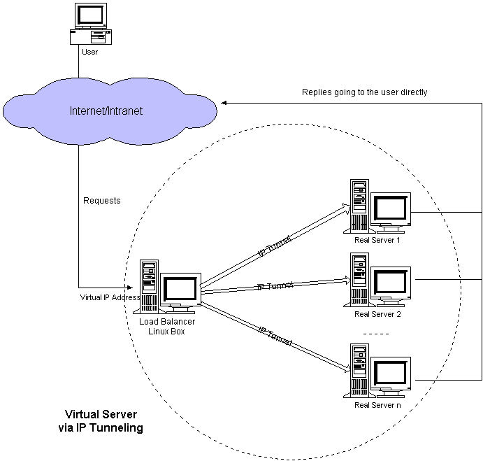

# 集群和分布式

系统性能扩展方式：

*   Scale UP：垂直扩展，向上扩展,增强，性能更强的计算机运行同样的服务 
*   Scale Out：水平扩展，向外扩展,增加设备，并行地运行多个服务调度分配问题，Cluster

随着计算机性能的增长，其价格会成倍增长 

单台计算机的性能是有上限的，不可能无限制地垂直扩展

## 集群 Cluster

Cluster：集群,为解决某个特定问题将多台计算机组合起来形成的单个系统

Cluster 分为三种类型：

*   LB: Load Balancing，负载均衡，多个主机组成，每个主机只承担一部分访问请求

*   HA: High Availiablity，高可用，避免SPOF（single Point Of failure）

    *   MTBF: Mean Time Between Failure 平均无故障时间，正常时间
    *   MTTR: Mean Time To Restoration（ repair）平均恢复前时间，故障时间
    *   A = MTBF /（MTBF+MTTR） (0,1)：99%,99.5%,99.9%,99.99%,99.999%
    *   **SLA**：服务等级协议（简称：SLA，全称：service level agreement）。是指在一定开销下为保障 服务的性能和可用性，服务提供商与用户间定义的一种双方认可的协定。通常这个开销是驱动提供 服务质量的主要因素。在常规的领域中，总是设定所谓的三个9，四个9,N个9 等来进行表示，当没 有达到这种水平的时候，就会有一些列的惩罚措施，而运维最主要的目标就是达成这种服务水平。
    *   停机时间又分为两种，一种是计划内停机时间，一种是计划外停机时间，而运维则主要关注计划外 停机时间。

    ```powershell
    1年 = 365天 = 8760小时
    90 = (1-90%)*365=36.5天
    99 = 8760 * 1% = 87.6小时
    99.9 = 8760 * 0.1% = 8760 * 0.001 = 8.76小时
    99.99 = 8760 * 0.0001 = 0.876小时 = 0.876 * 60 = 52.6分钟
    99.999 = 8760 * 0.00001 = 0.0876小时 = 0.0876 * 60 = 5.26分钟
    99.9999= (1-99.9999%)*365*24*60*60=31秒
    ```

*   HPC: High-performance computing，高性能 http://www.top500.org


## 分布式系统

分布式常见应用

*   分布式应用-服务按照功能拆分，使用微服务
*   分布式静态资源--静态资源放在不同的存储集群上
*   分布式数据和存储--使用key-value缓存系统
*   分布式计算--对特殊业务使用分布式计算，比如Hadoop集群

分布式存储： Ceph，GlusterFS，FastDFS，MogileFS 

分布式计算：hadoop，Spark

## 集群和分布式

*   集群：
    *   同一个业务系统部署在多台服务器上。集群中每一台服务器实现的功能没有差别，数据和代码都 是一样的
*   分布式：
    *   一个业务被拆成多个子业务，或者本身就是不同的业务，部署在多台服务器上。分布式中，每 一台服务器实现的功能是有差别的，数据和代码也是不一样的，分布式每台服务器功能加起来，才是完 整的业务

分布式是以缩短单个任务的执行时间来提升效率的，而集群则是通过提高单位时间内执行的任务数来提 升效率。

对于大型网站，访问用户很多，实现一个群集，在前面部署一个负载均衡服务器，后面几台服务器完成 同一业务。如果有用户进行相应业务访问时，负载均衡器根据后端哪台服务器的负载情况，决定由给哪 一台去完成响应，并且一台服务器垮了，其它的服务器可以顶上来。分布式的每一个节点，都完成不同 的业务，如果一个节点垮了，那这个业务可能就会失败

## LB Cluster 负载均衡集群

### 按实现方式划分

*   硬件
    *   F5 Big-IP  https://detail.zol.com.cn/load_leveling/f5/cheap_pic.html?qq-pf-to=pcqq.group
    *   Citrix Netscaler
    *   A10 
*   软件
    *   lvs：Linux Virtual Server，阿里云四层 SLB (Server Load Balance)使用
    *   nginx：支持七层调度，阿里云七层SLB使用  Tengine
    *   haproxy：支持七层调度
    *   ats：Apache Traffic Server，yahoo捐助给apache
    *   perlbal：Perl 编写
    *   pound

### 基于工作的协议层次划分

*   四层，传输层（通用）：DNAT 和 DPORT
    *   LVS
    *    nginx：stream
    *    haproxy：mode tcp
*   七层， 应用层（专用）：针对特定协议，常称为 proxy server
    *    http：nginx, httpd, haproxy(mode http), ...
    *   fastcgi：nginx, httpd, ...
    *   mysql：mysql-proxy, mycat...

### 负载均衡的会话保持

*   session sticky会话保持：同一用户调度固定服务器
    *   Source IP：LVS sh算法（对某一特定服务而言）
    *   Cookie
*   session replication会话复制：每台服务器拥有全部session
    *   session multicast cluster
*   session server会话共享：专门的session服务器
    *   Redis
    *   Memcached 

## HA 高可用集群实现

*   keepalived：
    *   vrrp协议
*   Ais：应用接口规范
    *   heartbeat
    *   cman+rgmanager(RHCS)
    *   coresync_pacemaker

# Linux Virtual Server

## LVS 介绍

LVS：Linux Virtual Server，负载调度器，内核集成，章文嵩（花名 正明）,  阿里的四层SLB(Server  Load Balance)是基于LVS+keepalived实现

LVS 是全球最流行的四层负载均衡开源软件，由章文嵩博士（当前阿里云产品技术负责人）在1998年5 月创立，可以实现LINUX平台下的负载均衡。

LVS 官网： http://www.linuxvirtualserver.org/

阿里SLB和LVS：

https://yq.aliyun.com/articles/1803 

https://github.com/alibaba/LVS


##  LVS 工作原理

LVS 集群类型中的术语

*   VS
    *   Virtual Server，Director Server(DS), Dispatcher(调度器)，Load Balancer
    *   负载均衡服务器
*   VIP
    *   Virtual server IP   VS外网的IP
    *   负载均衡服务器 对外网暴露IP
*   DIP
    *   Director IP  VS内网的IP
    *   负载均衡服务器 对内通讯IP
*   RS
    *   Real Server(lvs), upstream server(nginx), backend server(haproxy)
    *   后端服务器
*   RIP
    *   Real server IP
    *   后端服务器IP
*   Client:
    *   客户端
*   CIP
    *   Client IP

VS根据请求报文的目标IP和目标协议及端口将其调度转发至某RS，根据调度算法来挑选RS。

**LVS是内核 级功能，工作在INPUT链的位置，将发往INPUT的流量进行“处理”**

lvs的管理工具就是`ipvsadm`  

```shell
# 查看内核编译的配置文件
grep -i -C 10 ipvs /boot/config-6.8.0-51-generic
CONFIG_NETFILTER_XT_MATCH_IPVS=m
# m，表示以模块编译进内核
# 正常不加载进内存
# 需要使用时加载进内存

# 模块信息查看
modinfo ip_vs
```


## LVS 工作模式 四种

*   lvs-nat：
    *   修改请求报文的目标IP,多目标IP的DNAT 

*   lvs-dr：
    *   操纵封装新的MAC地址 

*   lvs-tun：
    *   在原请求IP报文之外新加一个IP首部 

*   lvs-fullnat：
    *   修改请求报文的源和目标IP,默认内核不支持,需要自行开发

### NAT 模式


lvs-nat：本质是多目标IP的**DNAT**，通过将请求报文中的目标地址和目标端口修改为调度算法挑出的RS的RIP和 PORT实现转发

注意点

*   RIP和DIP应在同一个IP网络，且应使用私网地址；
*   **RS的网关要指向DIP**
    *   每台内部的节点服务器的网关地址必须是调度器LB的内网地址。
*   请求报文和响应报文都必须经由负载均衡服务转发，复制均衡服务器压力会很大
    *   负载均衡服务易于成为系统瓶颈
    *   NAT技术将请求的报文和响应的报文都需要通过DS进行地址改写，因此网站访问量比较大的时候DS负载均衡调度器有比较大的瓶颈，一般要求最多之能10-20台节点。
*   支持端口映射，可修改请求报文的目标PORT
*   VS必须是Linux系统，RS可以是任意OS系统


DNAT与iptables链相关

IPVS修改请求报文目标地址与端口的位置是在`PREROUTING`与`INPUT`之间，然后直接转发到`POSTROUTING`发送给RS

数据包的传输过程

- 用户发请求 ---> 发送到LVS服务器
    - 数据包从网卡先经过PREROUTING
    - PREROUTING收到数据包后，查询路由表，看数据包中的地址是否是本机地址，如果是，就将数据包发给INPUT，由INPUT交由本地进程处理，如果不是就转到FORWARD链上
    - 但是INPUT后面并没有进程处理，所有的服务都是后端服务器提供了LVS本身不提供服务，所以不能让数据包进入INPUT链
    - 因此LVS必须做一件事，就是就截胡，在PREROUTING和INPUT中间加一个IPLVS，截住数据包
    - 然后将截取的数据包的目标地址，更改为后端的服务器地址和端口
    - 改完数据包地址后，从POSTROUNTING发出去，传递给后端服务器 
    - 后端服务器收到数据后，返回数据包，发给LVS的PREROUNTING，然后由于返回数据包的目标地址是CIP，并不是LVS的vip,因此，不会向上走，而是直接查路由表，走`FORWARD`到POSTROUTING（`因为数据包在返回的时候，走的是PREROUNTING->FORWARD->POSTROUNTING的路径，所以lvs上必须开启IP_forward的转发功能`）
    - 又因为进来的时候，LVS更改了数据包的目的地址，改为了RIP的地址，现在要改回去，改回LVS自己的VIP地址，然后又LVS的源IP身份将数据包发回目标地址CIP 


### DR 模式


LVS-DR：Direct Routing，直接路由，LVS默认模式,应用最广泛,通过为请求报文重新封装一个MAC首部 进行转发，

源MAC是DIP所在的接口的MAC，目标MAC是某挑选出的RS的RIP所在接口的MAC地址；源 IP/PORT，以及目标IP/PORT均保持不变


负载均衡服务器与后端服务器都拥有VIP

前置问题：为什么多个设备配置一个IP会产生地址冲突

原因：如果多个服务器地址都是一样的，在arp协议中，通过arp广播，尝试将IP转换为MAC地址，结果一发广播，所有机器都响应arp，返回自己的地址，都返回自己的地址，但是客户端只能接受一个，就会产生懵逼效应

解决方案：

- 在这个数据包的传输过程中，会发现，RS上的VIP仅仅用作返回数据包作为源地址，虽然请求包的目的地址保持一致，但不负责接收数据包，只有LVS上的VIP负责接收数据包
- 因此，只要让RS上的VIP只封装数据包作为响应包的源地址，而对请求数据包即不接收也不回应，所有的请求数据包都交由LVS上的VIP去处理即可
- <font style="color:red">通过更改两个和网卡相关的内核参数，来让该网卡既不接收数据包也不发送数据包</font>

扩展知识：

- 免费ARP
    - 当网卡要生效启动的时候，它会向外发免费ARP，主动向外发送我自己拥有的IP地址，并让周边机器更新我的IP地址和我MAC地址的对应关系（发很多次）
    - 通过免费ARP避免有人和它产生地址冲突


DR模型是基于数据链路层工作的

DR模式的特点：

*   Director和各RS都配置有VIP

*   **确保前端路由器将目标IP为VIP的请求报文发往Director**

    *   方案1：在RS上修改内核参数以限制arp通告及应答级别

    ```shell
    # 内核参数
    /proc/sys/net/ipv4/conf/all/arp_ignore
    /proc/sys/net/ipv4/conf/all/arp_announce
    
    # arp_ignore 控制内核如何响应 ARP 请求
    # 0：默认设置，系统会在收到 ARP 请求时检查目标地址是否是系统某个接口的 IP 地址。如果是，系统会进行响应。
    # 1：系统不会响应 ARP 请求，即使目标地址是本机的 IP 地址。
    # 2：系统仅响应对应当前接口的 ARP 请求。其他接口上的 IP 地址不做响应。
    # 3：系统只会响应指定接口上目标地址的 ARP 请求。
    
    # arp_announce 控制系统如何向网络上其他主机宣布自己的 IP 地址
    # 0：默认值，系统会根据 ARP 请求的目标接口自动选择合适的接口响应。
    # 1：系统只会在 ARP 响应中使用来自接口的 IP 地址，这样可以避免误用接口之间的 IP 地址。
    # 2：系统会选择 最匹配 的接口来发送 ARP 响应。
    # 3：系统将选择 最优接口，基于路由表的最佳匹配选择接口。
    ```

    *   方案2：在前端网关做静态绑定VIP和Director的MAC地址
    *   方案3：在RS上使用arptables工具
    
    ```shell
    arptables -A IN -d $VIP -j DROP
    arptables -A OUT -s $VIP -j mangle --mangle-ip-s $RIP
    ```
    
*   RS的RIP可以使用私网地址，也可以是公网地址；RIP与DIP在同一IP网络；**RIP的网关不能指向 DIP，以确保响应报文不会经由Director**

*   **RS和Director要在同一个物理网络**

    *   因为DR模型是基于数据链路层工作的
    *   中间必须是交换机连接而不能是路由器

*   **请求报文要经由Director，但响应报文不经由Director，而由RS直接发往Client**

*   不支持端口映射（端口不能修改）

*   无需开启 ip_forward

*   RS可使用大多数OS系统


### TUN模式



转发方式：不修改请求报文的IP首部（源IP为CIP，目标IP为VIP），而在原IP报文之外再封装一个IP首部 （源IP是DIP，目标IP是RIP），将报文发往挑选出的目标RS；RS直接响应给客户端（源IP是VIP，目标IP 是CIP）


TUN模式特点：

*   RIP和DIP可以不处于同一物理网络中，RS的网关一般不能指向DIP,且RIP可以和公网通信。也就是 说集群节点可以跨互联网实现。DIP, VIP, RIP可以是公网地址
*   RealServer的tun接口上需要配置VIP地址，以便接收director转发过来的数据包，以及作为响应的 报文源IP
*   Director转发给RealServer时需要借助隧道，隧道外层的IP头部的源IP是DIP，目标IP是RIP，而 RealServer响应给客户端的IP头部是根据隧道内层的IP头分析得到的，源IP是VIP，目标IP是CIP
*   请求报文要经由Director，但响应不经由Director,响应由RealServer自己完成
*    不支持端口映射
*   RS的OS须支持隧道功能

应用场景

一般来说，TUN模式常会用来负载调度缓存服务器组，这些缓存服务器一般放置在不同的网络环境，可以就近 折返给客户端。在请求对象不在Cache服务器本地命中的情况下，Cache服务器要向源服务器发送请求，将结 果取回，最后将结果返回给用户。

LAN环境一般多采用DR模式，WAN环境虽然可以用TUN模式，但是一般在WAN环境下，请求转发更多的被 haproxy/nginx/DNS等实现。因此，TUN模式实际应用的很少,跨机房的应用一般专线光纤连接或DNS调度

### FULLNAT 模式


通过同时修改请求报文的源IP地址和目标IP地址进行转发

模式特点：

*   VIP是公网地址，RIP和DIP是私网地址，且通常不在同一IP网络；因此，RIP的网关一般不会指向 DIP
*   RS收到的请求报文源地址是DIP，因此，只需响应给DIP；但Director还要将其发往Client
*   请求和响应报文都经由Director
*   **相对NAT模式，可以更好的实现LVS-RealServer间跨VLAN通讯**
*   支持端口映射

### 总结

| Category                | NAT           | TUN                          | DR                     |
| ----------------------- | ------------- | ---------------------------- | ---------------------- |
| **Real Server**         | any           | Tunneling                    | Non-arp device         |
| **Real server network** | private       | LAN/WAN                      | LAN                    |
| **Real server number**  | low (10~20)   | High (100)                   | High (100)             |
| **Real server gateway** | load balancer | own router                   | Own router             |
| **优点**                | 端口转换      | WAN                          | 性能最好               |
| **缺点**                | 性能瓶颈      | 要求支持隧道，不支持端口转换 | 不支持跨网段和端口转换 |

lvs-nat与lvs-fullnat：

*   请求和响应报文都经由Director
*   lvs-nat：RIP的网关要指向DIP
*   lvs-fullnat：RIP和DIP未必在同一IP网络，但要能通信

lvs-dr与lvs-tun：

*   请求报文要经由Director，但响应报文由RS直接发往Client
*    lvs-dr：通过封装新的MAC首部实现，通过MAC网络转发
*   lvs-tun：通过在原IP报文外封装新IP头实现转发，支持远距离通信

总结

*   NAT 多目标的DNAT，四层，支持端口修改，请求报文和响应报文都要经过LVS
*   DR  默认模式，二层，只修改MAC，不支持端口修改，性能好，LVS负载比小，LVS和RS并在同一 网段，请求报文经过LVS，响应报文不经过LVS
*   TUNNEL  三层，添加一个新的IP头，支持LVS和RS并在不在同一网段，不支持端口修改，请求报文 经过LVS，响应报文不经过LVS
*   FULLNAT 多目标的SNAT+DNAT，四层，支持端口修改，请求报文和响应报文都要经过LVS


##  LVS 调度算法

ipvs scheduler：根据其调度时是否考虑各RS当前的负载状态

分为两种：静态方法和动态方法

### 静态方法

仅根据算法本身进行调度

*   轮询算法RR：roundrobin，轮询,较常用
*   加权轮询算法WRR：Weighted RR，较常用
*   源地址哈希算法SH：Source Hashing，实现session sticky，源IP地址hash；将来自于同一个IP地址 的请求始终发往第一次挑中的RS，从而实现会话绑定
*   目标地址哈希算法DH：Destination Hashing；目标地址哈希，第一次轮询调度至RS，后续将发往 同一个目标地址的请求始终转发至第一次挑中的RS，典型使用场景是正向代理缓存场景中的负载均衡, 如: Web缓存

### 动态方法

主要根据每RS当前的负载状态及调度算法进行调度

Overhead=value **较小**的RS将被调度

*   最少连接算法LC：least connections 适用于长连接应用
    *   `Overhead=activeconns*256+inactiveconns`
*   加权最少连接算法WLC：Weighted LC，默认调度方法,较常用
    *   `Overhead=(activeconns*256+inactiveconns)/weight`
*   最短期望延迟算法SED：Shortest Expection Delay，初始连接高权重优先,只检查活动连接,而不考虑 非活动连接
    *   ` Overhead=(activeconns+1)*256/weight`
*   最少队列算法NQ：Never Queue，第一轮均匀分配，后续SED
*   基于局部的最少连接算法LBLC：Locality-Based LC，动态的DH算法，使用场景：根据负载状态实现 正向代理,实现Web Cache等
*   带复制的基于局部的最少连接算法LBLCR：LBLC with Replication，带复制功能的LBLC，解决LBLC 负载不均衡问题，从负载重的复制到负载轻的RS,,实现Web Cache等

### 内核版本 4.15 版本后新增调度算法：FO和OVF

*   FO（Weighted Fail Over）调度算法
    *   在此FO算法中，遍历虚拟服务所关联的真实服务器链表，找到还未 过载（未设置IP_VS_DEST_F_OVERLOAD标志）的且权重最高的真实服务器，进行调度,属于静态算法
*   OVF（Overflow-connection）调度算法
    *   基于真实服务器的活动连接数量和权重值实现。将新连接调度 到权重值最高的真实服务器，直到其活动连接数量超过权重值，之后调度到下一个权重值最高的真实服 务器,在此OVF算法中，遍历虚拟服务相关联的真实服务器链表，找到权重值最高的可用真实服务器。属 于动态算法

一个可用的真实服务器需要同时满足以下条件：

*   未过载（未设置IP_VS_DEST_F_OVERLOAD标志）
*   真实服务器当前的活动连接数量小于其权重值
*   其权重值不为零

## LVS 相关软件

### 程序包：ipvsadm

IPVS 是 LVS 的核心模块，它是一个内核级的负载均衡实现。

`ipvsadm` 是 IPVS 的用户空间工具，用于配置和管理 IPVS。


主程序：/usr/sbin/ipvsadm
规则保存工具：/usr/sbin/ipvsadm.save
规则重载工具：/usr/sbin/ipvsadm.restore
配置文件：/etc/sysconfig/ipvsadm.config
ipvs调度规则文件：/etc/sysconfig/ipvsadm

```shell
apt install ipvsadm
```

ipvs规则

```shell
/proc/net/ip_vs
```

ipvs连接

```shell
/proc/net/ip_vs_conn
```


### ipvsadm 命令

ipvsadm核心功能：

*   集群服务管理：增、删、改
*   集群服务的RS管理：增、删、改
*   查看当前的集群状态

```shell
# 查看
ipvsadm -L|l [options]
# --numeric, -n：以数字形式输出地址和端口号
# --exact：扩展信息，精确值
# --connection，-c：当前IPVS连接输出
# --stats：统计信息
# --rate ：输出速率信息
ipvsadm -ln

# 清空计数器
ipvsadm -Z [-t|u|f service-address]

# 删除所有集群
ipvsadm -C
```

#### 管理集群

增加集群

```shell
ipvsadm -A -t|u|f VIP[:port] [-s scheduler] [-p [timeout]]

# -t|u|f：
# -t: TCP协议的端口，VIP:TCP_PORT  如: -t 10.0.0.100:80
# -u: UDP协议的端口，VIP:UDP_PORT
# -f：firewall MARK，标记，一个数字

# [-s scheduler]：指定集群的调度算法，默认为wlc

# 修改
ipvsadm -E -t|u|f VIP [-s scheduler] [-p [timeout]]
```

删除集群

```shell
ipvsadm -D -t|u|f VIP
```

#### 管理集群上的RS

增加集群节点

```shell
ipvsadm -a -t|u|f VIP[:port] -r RIP[:port] [-g|i|m] [-w weight]
# 省略port，不作端口映射
# -g: gateway, dr类型，默认
# -i: ipip, tun类型
# -m: masquerade化妆, nat类型
# -w weight：权重

# 修改
ipvsadm -e -t|u|f VIP -r RIP [-g|i|m] [-w weight]
```

删除集群节点

```shell
ipvsadm -d -t|u|f service-address -r server-address
```

#### 规则保存

建议保存至 /etc/ipvsadm.rules或/etc/sysconfig/ipvsadm

```shell
ipvsadm-save > /PATH/TO/IPVSADM_FILE
ipvsadm -S > /PATH/TO/IPVSADM_FILE
systemctl stop ipvsadm.service  #会自动保存规则至/etc/sysconfig/ipvsadm
```

重载

```shell
ipvsadm-restore < /PATH/FROM/IPVSADM_FILE
systemctl start ipvsadm.service  #会自动加载/etc/sysconfig/ipvsadm中规则
```

Ubuntu系统保存规则和开机加载规则

```shell
#保存方法1
service ipvsadm save

#保存方法2
ipvsadm-save  -n > /etc/ipvsadm.rules

# 开机自启
vim /etc/default/ipvsadm
AUTO="true"
```

红帽系统保存规则和开机加载规则

```shell
ipvsadm-save  -n > /etc/sysconfig/ipvsadm
systemctl enable ipvsadm.service
```

#### 防火墙标记

FWM：FireWall Mark

借助于防火墙标记来分类报文，而后基于标记定义集群服务；可将多个不同的应用使用同一个集群服务 进行调度 

在负载均衡主机上配置iptables规则：

```shell
iptables -t mangle -A PREROUTING -d $vip -p $proto -m multiport --dports $port1,$port2,… -j MARK --set-mark NUMBER 
```

在负载均衡主机上配置ipvsadn规则：

```shell
ipvsadm -A -f NUMBER [options]
```

范例

```shell
iptables -t mangle -A PREROUTING -d 172.16.0.100 -p tcp -m multiport --dports 80,443 -j MARK --set-mark 10 

ipvsadm -C
ipvsadm -A -f 10 -s rr
ipvsadm -a -f 10 -r 10.0.0.7 -g
ipvsadm -a -f 10 -r 10.0.0.17 -g
ipvsadm -Ln

IP Virtual Server version 1.2.1 (size=4096)
Prot LocalAddress:Port Scheduler Flags
  -> RemoteAddress:Port           Forward Weight ActiveConn InActConn
FWM  10 rr
  -> 10.0.0.7:0                   Route   1      0          0         
  -> 10.0.0.17:0                  Route   1      0          0    
```

#### LVS 持久连接

持久连接（ lvs persistence ）模板：实现无论使用任何调度算法，在一段时间内（默认360s ），能够 实现将来自同一个地址的请求始终发往同一个RS

```shell
ipvsadm -A|E -t|u|f service-address [-s scheduler] [-p [timeout]]
# -p 用于开启会话保持（Persistence），可以选择性地指定会话保持的超时时间（单位为秒）。
# 如果未指定超时时间，系统会使用默认值（通常为 360 秒）。
```

持久连接实现方式：

*   每端口持久（PPC）：每个端口定义为一个集群服务，每集群服务单独调度 
*   每防火墙标记持久（PFWMC）：基于防火墙标记定义集群服务；可实现将多个端口上的应用统一 调度，即所谓的 port Affinity 
*   每客户端持久（PCC）：基于0端口（表示所有服务）定义集群服务，即将客户端对所有应用的请 求都调度至后端主机，必须定义为持久模式

# LVS实践

## NAT模式


环境

```powershell
共四台主机
一台： 外网主机：192.168.74.12/24   GW:无 仅主机

一台：lvs服务器
eth0 NAT   10.0.0.204/24(DIP)
eth1 仅主机 192.168.10.204/24(VIP)

两台RS：nginx
RS1: 10.0.0.205/24(RIP)    GW：10.0.0.204 NAT
RS2: 10.0.0.206/24(RIP)    GW：10.0.0.204 NAT
```

RS配置网关

```shell
vim /etc/netplan/50-cloud-init.yaml
routes:
            -   to: default
                via: 10.0.0.204

netplan apply

route -n
Destination     Gateway         Genmask         Flags Metric Ref    Use Iface
0.0.0.0         10.0.0.204      0.0.0.0         UG    0      0        0 eth0
10.0.0.0        0.0.0.0         255.255.255.0   U     0      0        0 eth0

# 安装nignx
```

LVS服务器配置

```shell
# 打开ip_forward功能
vim /etc/sysctl.conf
net.ipv4.ip_forward = 1

# 应用内核参数
sysctl -p

# 配置ipvsadm规则
ipvsadm -A -t 192.168.74.204:80 -s rr
ipvsadm -a -t 192.168.74.204:80 -r 10.0.0.205:80 -m
ipvsadm -a -t 192.168.74.204:80 -r 10.0.0.206:80 -m

ipvsadm -Ln

# 保存规则
ipvsadm-save  -n > /etc/ipvsadm.rules

# 开机自启
vim /etc/default/ipvsadm
AUTO="true"
```

外网主机测试

```shell
while :;do curl 192.168.74.204;sleep 0.5;done
```

LVS查看连接情况

```shell
ipvsadm -Ln --stats

ipvsadm -Lnc

cat /proc/net/ip_vs

cat /proc/net/ip_vs_conn
```

## DR模式

真实环境


### DR模式单网段案例


环境

```powershell
五台主机
一台： 外网主机：192.168.74.12/24   GW:192.168.74.207 仅主机

一台：ROUTER（软路由）
eth0: NAT   10.0.0.207/24
eth1: 仅主机 192.168.74.207/24
启用 IP_FORWARD

一台：lvs服务器
eth0: NAT   10.0.0.204/24(DIP) GW：10.0.0.207
lo:         10.0.0.200/32(VIP)
或者VIP配在eht0上
eth0: NAT   10.0.0.200/24(VIP)

两台RS：nginx
RS1: 
  eht0: NAT 10.0.0.205/24(RIP)    GW：10.0.0.207
  lo:       10.0.0.200/32(VIP)
RS2: 
  eht0: NAT 10.0.0.206/24(RIP)    GW：10.0.0.207
  lo:       10.0.0.200/32(VIP)
```

软路由主机配置

```shell
# 添加仅主机网卡，配192.168.74.207

# 打开ip_forward功能
vim /etc/sysctl.conf
net.ipv4.ip_forward = 1

# 应用内核参数
sysctl -p
```

外网主机配置网关，模拟外网主机找到公司路由器

```shell
# team0为仅主机网卡
ip route add default via 192.168.74.207 dev team0

route -n
Destination     Gateway         Genmask         Flags Metric Ref    Use Iface
0.0.0.0         192.168.74.207  0.0.0.0         UG    0      0        0 team0
192.168.74.0    0.0.0.0         255.255.255.0   U     350    0        0 team0
```

RS配置

```shell
# 配置网关指向软路由
vim /etc/netplan/50-cloud-init.yaml
routes:
            -   to: default
                via: 10.0.0.207
                
netplan apply

route -n
Destination     Gateway         Genmask         Flags Metric Ref    Use Iface
0.0.0.0         10.0.0.207      0.0.0.0         UG    0      0        0 eth0
10.0.0.0        0.0.0.0         255.255.255.0   U     0      0        0 eth0

# 安装nignx

# RS调整内核参数
# 将all设置完之后，再设置具体网卡，配置才能生效，仅更改具体网卡配置，无效
echo 1 > /proc/sys/net/ipv4/conf/all/arp_ignore
echo 2 > /proc/sys/net/ipv4/conf/all/arp_announce
echo 1 > /proc/sys/net/ipv4/conf/lo/arp_ignore
echo 2 > /proc/sys/net/ipv4/conf/lo/arp_announce

# 添加vip到回环网卡上
ifconfig lo:1 10.0.0.200/32
# 或
ip addr add 10.0.0.200/32 dev lo label lo:1

# RS的VIP要配在lo上
# 如果配置在eth0上，没配ARP 限制，会ARP冲突
# 如果配置在eth0上，配了ARP 限制，RS 将不会响应与 VIP 相关的 ARP 请求。
# 可以避免 ARP 冲突，但仍不符合 LVS DR 模式的最佳实践。也会带来其他一系列问题。
```

LVS服务器配置

```shell
# 配置网关指向软路由，作用是正常通讯
vim /etc/netplan/50-cloud-init.yaml
routes:
            -   to: default
                via: 10.0.0.207
                
netplan apply

route -n
Destination     Gateway         Genmask         Flags Metric Ref    Use Iface
0.0.0.0         10.0.0.207      0.0.0.0         UG    0      0        0 eth0
10.0.0.0        0.0.0.0         255.255.255.0   U     0      0        0 eth0

#如果LVS没有配置网关（网关随意，只有要即可），也可以通过修改内核关闭路径反向校验实现
echo "0" > /proc/sys/net/ipv4/conf/all/rp_filter
echo "0" > /proc/sys/net/ipv4/conf/eth0/rp_filter
# 具体件之后问题

# 添加vip到回环网卡上
ifconfig lo:1 10.0.0.200/32
# 或
ip addr add 10.0.0.200/32 dev lo label lo:1
# 或者配置在NAT网卡上
ip addr add 10.0.0.200/24 dev eth0 label eth0:1

# 添加LVS规则
ipvsadm -A -t 10.0.0.200:80 -s rr
ipvsadm -a -t 10.0.0.200:80 -r 10.0.0.205:80 -g
ipvsadm -a -t 10.0.0.200:80 -r 10.0.0.206:80 -g
```

外网主机测试

```shell
root@loong:~# curl 10.0.0.200
206
root@loong:~# curl 10.0.0.200
205
```

wireshake抓包：握手过程


黑色记录时LVS服务器的转发

RS直接给外网主机回复，没经过LVS服务器

#### LVS的eth0的网关可否不配置？如果随便配置，发现什么问题？如果不配 置，怎么解决？

不能

不配eth0网关，网卡会发现数据包的源IP是自己不可达的，会对其数据包

参数rp_filter用来控制系统是否开启对数据包源地址的校验。

*   0标示不开启地址校验
*   1表开启严格的反向路径校验。对每一个收到的数据包，校验其反向路径是否是最佳路径。如果反向路径不是 最佳路径，则直接丢弃该数据包；
*   2表示开启松散的反向路径校验，对每个收到的数据包，校验其源地址是否可以到达，即反向路径是否可以 ping通，如反向路径不通，则直接丢弃该数据包。

```shell
# 默认值
cat /proc/sys/net/ipv4/conf/all/rp_filter
# ubuntu 2
# centos 1

# ubuntu
echo "0" > /proc/sys/net/ipv4/conf/all/rp_filter
echo "0" > /proc/sys/net/ipv4/conf/eth0/rp_filter

# centos
echo "0" > /proc/sys/net/ipv4/conf/all/rp_filter
```

#### LVS的VIP可以配置到lo网卡,但必须使用32位的netmask,为什么?

如果掩码设为正常24位

因为VIP配置在lo上，这会导致整个网段都在lo网卡上，使发往网段其他地址的包都到环回网卡上

### DR模式多网段案例

单网段的DR模式容易暴露后端RS服务器地址信息,可以使用跨网面的DR模型,实现更高的安全性

VIP与DIP，RIP在同一网段，有被扫描网段的风险，

可直接与后端服务器通讯，绕过LVS服务器

有被DOS风险


环境

vmware添加新的虚拟网卡192.168.10.0/24

```powershell
五台主机
一台： 外网主机：192.168.74.12/24   GW:192.168.74.207 仅主机

一台：ROUTER（软路由）
eth0: NAT   10.0.0.207/24
eth1: 仅主机 192.168.74.207/24
eth2: 仅主机 192.168.10.207/24
启用 IP_FORWARD

一台：lvs服务器
eth0: NAT   10.0.0.204/24(DIP) GW：10.0.0.207
lo:         192.168.10.204/32(VIP)

两台RS：nginx
RS1: 
  eht0: NAT 10.0.0.205/24(RIP)    GW：10.0.0.207
  lo:       192.168.10.204/32(VIP)
RS2: 
  eht0: NAT 10.0.0.206/24(RIP)    GW：10.0.0.207
  lo:       192.168.10.204/32(VIP)
  
# VIP与DIP，RIP不在同一网段
```

软路由主机配置

```shell
# 添加仅主机网卡，配192.168.74.207/24
# 添加仅主机网卡2，配192.168.10.207/24

# 打开ip_forward功能
vim /etc/sysctl.conf
net.ipv4.ip_forward = 1

# 应用内核参数
sysctl -p
```

外网主机配置网关，模拟外网主机找到公司路由器

```shell
# team0为仅主机网卡
ip route add default via 192.168.74.207 dev team0

route -n
Destination     Gateway         Genmask         Flags Metric Ref    Use Iface
0.0.0.0         192.168.74.207  0.0.0.0         UG    0      0        0 team0
192.168.74.0    0.0.0.0         255.255.255.0   U     350    0        0 team0
```

RS配置

```shell
# 配置网关指向软路由
vim /etc/netplan/50-cloud-init.yaml
routes:
            -   to: default
                via: 10.0.0.207
                
netplan apply

route -n
Destination     Gateway         Genmask         Flags Metric Ref    Use Iface
0.0.0.0         10.0.0.207      0.0.0.0         UG    0      0        0 eth0
10.0.0.0        0.0.0.0         255.255.255.0   U     0      0        0 eth0

# 安装nignx

# RS调整内核参数
# 将all设置完之后，再设置具体网卡，配置才能生效，仅更改具体网卡配置，无效
echo 1 > /proc/sys/net/ipv4/conf/all/arp_ignore
echo 2 > /proc/sys/net/ipv4/conf/all/arp_announce
echo 1 > /proc/sys/net/ipv4/conf/lo/arp_ignore
echo 2 > /proc/sys/net/ipv4/conf/lo/arp_announce

# 添加vip到回环网卡上
ifconfig lo:1 192.168.10.24/32
# 或
ip addr add 192.168.10.204/32 dev lo label lo:1

# RS的VIP要配在lo上
# 如果配置在eth0上，没配ARP 限制，会ARP冲突
# 如果配置在eth0上，配了ARP 限制，RS 将不会响应与 VIP 相关的 ARP 请求。
# 可以避免 ARP 冲突，但仍不符合 LVS DR 模式的最佳实践。也会带来其他一系列问题。
```

LVS服务器配置

```shell
# 配置网关指向软路由，作用是正常通讯
vim /etc/netplan/50-cloud-init.yaml
routes:
            -   to: default
                via: 10.0.0.207
                
netplan apply

route -n
Destination     Gateway         Genmask         Flags Metric Ref    Use Iface
0.0.0.0         10.0.0.207      0.0.0.0         UG    0      0        0 eth0
10.0.0.0        0.0.0.0         255.255.255.0   U     0      0        0 eth0

#如果LVS没有配置网关（网关随意，只有要即可），也可以通过修改内核关闭路径反向校验实现
echo "0" > /proc/sys/net/ipv4/conf/all/rp_filter
echo "0" > /proc/sys/net/ipv4/conf/eth0/rp_filter
# 具体件之后问题

# 添加vip到回环网卡上
ifconfig lo:1 192.168.10.204/32
# 或
ip addr add 192.168.10.204/32 dev lo label lo:1
# 或者配置在NAT网卡上
ip addr add 192.168.10.204/24 dev eth0 label eth0:1

# 添加LVS规则
ipvsadm -A -t 192.168.10.204:80 -s rr
ipvsadm -a -t 192.168.10.204:80 -r 10.0.0.205:80 -g
ipvsadm -a -t 192.168.10.204:80 -r 10.0.0.206:80 -g
```

外网主机测试

```shell
root@loong:~# curl 192.168.10.204
206
root@loong:~# curl 192.168.10.204
205

# 即使被扫描网段192.168.10.0/24
# RS也不会被扫描出来
```

## TUNNEL隧道模式案例


环境

```powershell
五台主机
一台： 外网主机：192.168.74.12/24   GW:192.168.74.207 仅主机

一台：ROUTER（软路由）
eth0: NAT   10.0.0.207/24
eth1: 仅主机 192.168.74.207/24
启用 IP_FORWARD

一台：lvs服务器
eth0: NAT   10.0.0.204/24(DIP) GW：10.0.0.207
tunl0:      10.0.0.200/32(VIP)

两台RS：nginx
RS1: 
  eht0: NAT 10.0.0.205/24(RIP)    GW：10.0.0.207
  tunl0:    10.0.0.200/32(VIP)
RS2: 
  eht0: NAT 10.0.0.206/24(RIP)    GW：10.0.0.207
  tunl0:    10.0.0.200/32(VIP)
```

软路由主机配置

```shell
# 添加仅主机网卡，配192.168.74.207/24

# 打开ip_forward功能
vim /etc/sysctl.conf
net.ipv4.ip_forward = 1

# 应用内核参数
sysctl -p
```

外网主机配置网关，模拟外网主机找到公司路由器

```shell
# team0为仅主机网卡
ip route add default via 192.168.74.207 dev team0

route -n
Destination     Gateway         Genmask         Flags Metric Ref    Use Iface
0.0.0.0         192.168.74.207  0.0.0.0         UG    0      0        0 team0
192.168.74.0    0.0.0.0         255.255.255.0   U     350    0        0 team0
```

RS配置

```shell
# 配置网关指向软路由
vim /etc/netplan/50-cloud-init.yaml
routes:
            -   to: default
                via: 10.0.0.207
                
netplan apply

route -n
Destination     Gateway         Genmask         Flags Metric Ref    Use Iface
0.0.0.0         10.0.0.207      0.0.0.0         UG    0      0        0 eth0
10.0.0.0        0.0.0.0         255.255.255.0   U     0      0        0 eth0

# 安装nignx

# 开启tunnel网卡并配置VIP
ifconfig tunl0 10.0.0.200 netmask 255.255.255.255 up
# 或
ip addr add 10.0.0.200/32  dev tunl0
ip link set up tunl0

# RS调整内核参数
# 将all设置完之后，再设置具体网卡，配置才能生效，仅更改具体网卡配置，无效
echo 1 > /proc/sys/net/ipv4/conf/all/arp_ignore
echo 2 > /proc/sys/net/ipv4/conf/all/arp_announce
echo 1 > /proc/sys/net/ipv4/conf/tunl0/arp_ignore
echo 2 > /proc/sys/net/ipv4/conf/tunl0/arp_announce
```

LVS服务器配置

```shell
# 配置网关指向软路由，作用是正常通讯
vim /etc/netplan/50-cloud-init.yaml
routes:
            -   to: default
                via: 10.0.0.207
                
netplan apply

route -n
Destination     Gateway         Genmask         Flags Metric Ref    Use Iface
0.0.0.0         10.0.0.207      0.0.0.0         UG    0      0        0 eth0
10.0.0.0        0.0.0.0         255.255.255.0   U     0      0        0 eth0

#如果LVS没有配置网关（网关随意，只有要即可），也可以通过修改内核关闭路径反向校验实现
echo "0" > /proc/sys/net/ipv4/conf/all/rp_filter
echo "0" > /proc/sys/net/ipv4/conf/eth0/rp_filter

 #开启tunnel网卡并配置VIP
ifconfig tunl0 10.0.0.100 netmask 255.255.255.255 up
# 或
ip addr add 10.0.0.100/32  dev tunl0
ip link set up tunl0

# 添加LVS规则
ipvsadm -A -t 10.0.0.200:80 -s rr
ipvsadm -a -t 10.0.0.200:80 -r 10.0.0.205 -i
ipvsadm -a -t 10.0.0.200:80 -r 10.0.0.206 -i 

ipvsadm -Ln
```

外网主机测试

```shell
root@loong:~# curl 10.0.0.200
206
root@loong:~# curl 10.0.0.200
205

while :;do curl 10.0.0.100;sleep 0.3;done
```


握手过程，黑色报文为LVS发往RS的ipip协议报文


# LVS 高可用性实现

**LVS 不可用时**：

Director不可用，整个系统将不可用；SPoF Single Point of Failure

解决方案：高可用，keepalived、heartbeat/corosync

**RS 不可用时：**

某RS不可用时，Director依然会调度请求至此RS

解决方案： 由Director对各RS健康状态进行检查，失败时禁用，成功时启用

常用解决方案:

*   keepalived
*   heartbeat/corosync 
*   ldirectord

检测方式：

*   网络层检测，icmp
*   传输层检测，端口探测
*   应用层检测，请求某关键资源

RS全不用时：backup server, sorry server 

# 常见面试题

*   Linux 集群有哪些分类
*   正向代理和反向代理区别
*   四层代理和七层代理的区别
*   LVS的工作模式有哪些，有什么特点
*   LVS的调度算法
*   LVS和Nginx,Haproxy 的区别