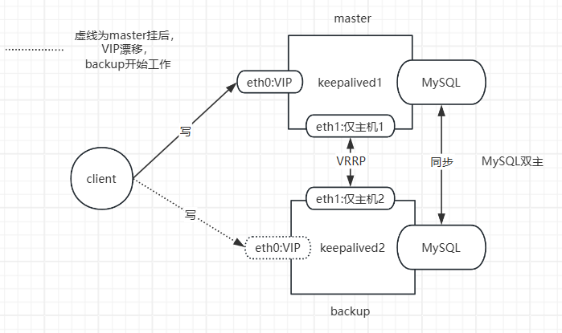

# 高可用集群

## 实现高可用

提升系统高用性的解决方案：降低MTTR- Mean Time To Repair(平均故障时间)

解决方案：建立多节点的冗余机制

*   active/passive 主/备
*   active/active 双主 
*   active --> HEARTBEAT --> passive
*   active <--> HEARTBEAT <--> active


## 高可用相关技术

### HA Service

资源：组成一个高可用服务的“组件”，比如：vip，service process，shared storage

*   passive node的数量
*   资源切换

### Shared Storage

*   NAS(Network Attached Storage)：网络附加存储，基于网络的共享文件系统。
*   SAN(Storage Area Network)：存储区域网络，基于网络的块级别的共享
*   分布式存储: Ceph、GlusterFS、HDFS、GFS、DFS、moosefs，MinIO ( OSS 对象存储)等

### HA Cluster 实现方案

#### AIS：Applicaiton Interface Specification 应用程序接口规范

*   RHCS：Red Hat Cluster Suite 红帽集群套件
    *   参考资料： https://access.redhat.com/documentation/zh-cn/red_hat_enterprise_linux/5/html/cluster_suite_overview/ch.gfscs.cluster-overview-cso
*   heartbeat：基于心跳监测实现服务高可用
*   pacemaker+corosync：资源管理与故障转移

#### VRRP：Virtual Router Redundancy Protocol

虚拟路由冗余协议,解决静态网关单点风险

*   物理层:路由器、三层交换机
*   软件层:keepalived

### VRRP

#### VRRP 网络层硬件实现

参考链接：

```html
https://app.huawei.com/weiknow#/weiknow?lang=zh&question=VRRP%E6%98%AF%E4%BB%80%E4%B9%88
https://support.huawei.com/enterprise/zh/doc/EDOC1000141382/19258d72/basic-concepts-of-vrrp
https://wenku.baidu.com/view/dc0afaa6f524ccbff1218416.html
https://wenku.baidu.com/view/281ae109ba1aa8114431d9d0.html
```


#### VRRP 相关术语

*   虚拟路由器：Virtual Router
*   虚拟路由器标识：VRID(0-255)，唯一标识虚拟路由器
*   VIP：Virtual IP
*   VMAC：Virutal MAC (00-00-5e-00-01-VRID)
*   物理路由器：
    *   master：主设备
    *   backup：备用设备
    *   priority：优先级

#### VRRP 相关技术

通告：心跳，优先级等；周期性

工作方式：抢占式，非抢占式

安全认证：

*   无认证
*   简单字符认证：预共享密钥
*   MD5

工作模式：

*   主/备：单个虚拟路由器
*   主/主：主/备（虚拟路由器1），备/主（虚拟路由器2）

# Keepalived 架构和安装

## Keepalived 介绍

vrrp 协议的软件实现，原生设计目的为了高可用 ipvs服务

keepalived 是高可用集群的通用无状态应用解决方案

官网： http://keepalived.org/

功能：

*   基于vrrp协议完成IP地址流动
*   为vip地址所在的节点生成ipvs规则(在配置文件中预先定义)
*   为ipvs集群的各RS做健康状态检测
*   基于脚本调用接口完成脚本中定义的功能，进而影响集群事务，以此支持实现nginx、haproxy等服务的高可用


## Keepalived 架构

https://keepalived.org/doc/ 

http://keepalived.org/documentation.html 


*   用户空间核心组件：
    *   vrrp stack：VIP消息通告
    *   checkers：监测 Real Server
    *    system call：实现 vrrp 协议状态转换时调用脚本的功能
    *   SMTP：邮件组件
    *   IPVS wrapper：生成 IPVS 规则
    *   Netlink Reflector：网络接口
    *   WatchDog：监控进程
*   控制组件：提供keepalived.conf 的解析器，完成Keepalived配置
*   IO复用器：针对网络目的而优化的自己的线程抽象
*   内存管理组件：为某些通用的内存管理功能（例如分配，重新分配，发布等）提供访问权限

Keepalived进程树

```powershell
Keepalived  <-- Parent process monitoring children
 \_ Keepalived   <-- VRRP child
 \_ Keepalived   <-- Healthchecking child
```

 VRRP 协议


## Keepalived 环境准备


*   各节点时间必须同步：ntp, chrony
*   关闭防火墙及SELinux
*   各节点之间可通过主机名互相通信：非必须
*   建议使用/etc/hosts文件实现：非必须
*   各节点之间的root用户可以基于密钥认证的ssh服务完成互相通信：非必须

## Keepalived 相关文件

*   软件包名：keepalived
*   主程序文件：/usr/sbin/keepalived
*   主配置文件：/etc/keepalived/keepalived.conf
*   配置文件示例：/usr/share/doc/keepalived/
*   服务文件：/lib/systemd/system/keepalived.service
*   Unit File的环境变量和配置参数文件：
    *   /etc/sysconfig/keepalived  CentOS
    *    /etc/default/keepalived   Ubuntu

**CentOS 7 上有 bug，可能有下面情况出现**

*   新配置可能无法`systemctl restart`生效
*   无法停止进程，需要 kill停止

## Keepalived 安装

### 包安装

```shell
#CentOS
yum -y install keepalived

#ubuntu
apt -y install keepalived
# 默认缺少配置，服务无法启动，提示/etc/keepalived/keepalived.conf 不存在
# 利用模板生成生配置文件
cp /usr/share/doc/keepalived/samples/keepalived.conf.sample /etc/keepalived/keepalived.conf

keepalived -v
dpkg -L keepalived
dpkg -s keepalived
hostname -I
```

### 编译安装

```shell
# Ubuntu24.04,20.04和22.04安装相关包
apt update  && apt -y install make gcc ipvsadm build-essential pkg-config automake autoconf libipset-dev libnl-3-dev libnl-genl-3-dev libssl-dev libxtables-dev libip4tc-dev libip6tc-dev libmagic-dev libsnmp-dev libglib2.0-dev libpcre2-dev libnftnl-dev libmnl-dev libsystemd-dev

# Ubuntu18.04安装相关包
apt -y install gcc curl openssl libssl-dev libpopt-dev daemon build-essential

# 红帽系统安装相关包
yum install  gcc curl openssl-devel libnl3-devel net-snmp-devel

# 下载解压源码包
wget https://keepalived.org/software/keepalived-2.0.20.tar.gz

tar xvf keepalived-2.0.20.tar.gz  -C /usr/local/src

cd /usr/local/src/keepalived-2.0.20/

# 选项--disable-fwmark 可用于禁用iptables规则,可防止VIP无法访问,无此选项默认会启用iptables规则，
# 注意：新版--disable-fwmark仍然会有iptables规则
./configure --prefix=/usr/local/keepalived    # --disable-fwmark仍然会有iptables规则
make && make install

# 默认源码目录会自动生成服务unit文件
# centos
cp ./keepalived/keepalived.service /lib/systemd/system/

# 创建配置文件
mkdir /etc/keepalived
cp /usr/local/keepalived/etc/keepalived/keepalived.conf.sample  /etc/keepalived/keepalived.conf
```

### 容器 Docker 安装

Docker的官方仓库上没有提供Keepalived的容器镜像，可以利用在源码目录中提供的Dockerfile自行制 作

### 源码安装问题

```shell
# 新版：nftables规则替代iptables规则
# 会使VIP无法访问
apt update &&& apt -y install nftables
# 查看规则
nft list ruleset


#清空nft规则
nft flush  ruleset 
nft list ruleset

# 旧版是生成iptables规则
# 在编译时加上--disable-fwmark禁用生成iptables规则
```

## KeepAlived 配置说明

配置文件：`/etc/keepalived/keepalived.conf`

三部分：

*   GLOBAL CONFIGURATION 全局配置
    *   Global definitions：定义邮件配置，route_id，vrrp配置，多播地址等
*   VRRP CONFIGURATION VRRP配置
    *   VRRP instance(s)：定义每个vrrp虚拟路由器
*   LVS CONFIGURATION LVS配置
    *   Virtual server group(s)
    *   Virtual server(s)：LVS集群的VS和RS

### 全局配置

#### 基础

```shell
global_defs {
   notification_email {
     acassen         # keepalived 发生故障切换时邮件发送的目标邮箱，可以按行区分写多个
     root@localhost  
   }
   notification_email_from Alexandre.Cassen@firewall.loc # 发邮件的地址
   smtp_server 192.168.200.1 # 邮件服务器地址
   smtp_connect_timeout 30   # 邮件服务器连接timeout
   
   # ----- 必备--------# 
   router_id LVS_DEVEL       # 每个keepalived主机唯一标识，建议使用当前主机名，如果多节点重名可能会影响切换脚本执行
   # -----------------# 
   
   # 默认会对所有通告报文都检查，会比较消耗性能
   # 启用此配置后，如果收到的通告报文和上一个报文是同一个路由器，则跳过检查
   vrrp_skip_check_adv_addr
   
   # 严格遵守VRRP协议,启用此项后以下状况将无法启动服务或工作异常:
   # 1.无VIP地址 
   # 2.配置了单播邻居 
   # 3.在VRRP版本2中有IPv6地址，开启动此项并且没有配置vrrp_iptables时
   #   会自动开启iptables(旧内核)或者nft(新内核)的防火墙规则，默认导致VIP无法访问
   # 建议不加此项配置
   vrrp_strict
   
   # 此项和vrrp_strict同时开启时，则不会添加防火墙规则
   # 如果无配置vrrp_strict项,则无需启用此项配置
   # 注意：新版加此项仍有iptables(旧内核)或者nft(新内核)规则
   vrrp_iptables
   
   # gratuitous 免费 ARP messages 报文发送延迟，0表示不延迟
   vrrp_garp_interval 0
   
   # unsolicited NA messages （不请自来）消息发送延迟
   vrrp_gna_interval 0
   
   # 指定组播IP地址范围：224.0.0.0到239.255.255.255
   # 默认值：224.0.0.18，如果配置了单播，此项失效
   vrrp_mcast_group4 224.0.0.18
}
```

#### Keepalived 通知脚本配置


### VRRP配置

#### 基础

```shell
vrrp_instance <STRING> { # <String>为vrrp的实例名,一般为业务名称
    # 当前节点在此虚拟路由器上的初始状态，状态为MASTER或者BACKUP
    # 当priority相同时，先启动的节点优先获取VIP
    state MASTER|BACKUP
    
    # 绑定为当前VRRP虚拟路由器使用的物理接口
    # 走VRRP协议网卡
    # 可以和VIP不在一个网卡，实现心跳功能
    interface eth0
    
    # 每个虚拟路由器唯一标识，范围：0-255，每个虚拟路由器此值必须唯一否则服务无法启动
    # 同属一个虚拟路由器的多个keepalived节点必须相同,务必要确认在同一网络中此值必须唯一
    # 集群ID
    virtual_router_id 50
    
    # 指定非抢占模式，默认为抢占模式 preempt
    # 启用此选项后，即使优先级较高的节点启动，也不会自动抢占当前的 MASTER。
    nopreempt
    
    # 当前物理节点在此虚拟路由器的优先级，范围：1-254
    priority 100
    
    # vrrp通告的时间间隔，默认1s，注意：集群内多节点此值必须相同
    advert_int 1
    
    # 认证机制
    authentication {
        auth_type AH|PASS    # AH为IPSEC认证(不推荐),PASS为简单密码(建议使用)
        auth_pass <PASSWORD> # 预共享密钥，仅前8位有效，同一个虚拟路由器的多个keepalived节点必
    }
    
    # 虚拟IP,生产环境可能指定几十上百个VIP地址
    virtual_ipaddress {
        192.168.200.11               # 指定VIP，不指定网卡，默认为eth0,注意：不指定/prefix,默认为/32
        192.168.200.12/24 dev eth1   # 指定VIP的网卡，建议和interface指令指定的网卡不在一个网卡
        192.168.200.13/24 dev eth2 label eth2:1   # 指定VIP的网卡label
    }
    
    # 监控一个或多个网络接口的状态
    # 当所监控的接口变为 down 状态时，Keepalived 会自动降低该节点的优先级，从而触发故障转移。
    track_interface{
        eth0
        eth1
    }
}
```

#### 抢占模式和非抢占模式

**非抢占模式 nopreempt**

默认为抢占模式 preempt，即当高优先级的主机恢复在线后，会抢占低先级的主机的master角色，造成 网络抖动，建议设置为非抢占模式 nopreempt ，即高优先级主机恢复后，并不会抢占低优先级主机的  master 角色

注意: 非抢占模式下,如果原主机down机, VIP迁移至的新主机, 后续新主机也发生down（（keepalived  服务down））时,VIP还会迁移回修复好的原主机

但如果新主机的服务down掉（keepalived服务正常），原主机也不会接管VIP，仍会由新主机拥有VIP

即非抢占式模式，只是适合当主节点宕机，切换到从节点的一次性的高可用性，后续即使当原主节点修 复好，仍无法再次起到高用功能

**还可以将集群中的节点的优先级设置为相同，也可以实现非抢占的效果**

**注意：要关闭 VIP抢占，必须将各 Keepalived 服务器 state 配置为 BACKUP**

```shell
# ka1
vrrp_instance VI_1 {
    state BACKUP
    interface eth1
    virtual_router_id 66
    priority 100
    advert_int 1
    nopreempt
    
# ka2    
vrrp_instance VI_1 {
    state BACKUP
    interface eth1
    virtual_router_id 66
    priority 80
    advert_int 1
    # 注意：如果ka2主机也是非抢占式，会导致ka1即使优先级降低于ka2，VIP也不会切换至ka2
```

**抢占延迟模式 preempt_delay**

抢占延迟模式，即优先级高的主机恢复后，不会立即抢回VIP，而是延迟一段时间（默认300s）再抢回  VIP

但是如果低优先级的主机down机，则立即抢占VIP地址，而不再延迟

**注意：需要各keepalived服务器state为BACKUP,并且不要启用 vrrp_strict**

```shell
# ka1
vrrp_instance VI_1 {
    state BACKUP
    interface eth1
    virtual_router_id 66
    priority 100
    advert_int 1
    preempt_delay 60  # 抢占延迟模式，默认延迟300s
    
# ka2    
vrrp_instance VI_1 {
    state BACKUP
    interface eth1
    virtual_router_id 66
    priority 80
    advert_int 1
```

#### VIP 单播配置

keepalived中默认是多播通讯，这样会将数据包发送到同一子网中所有设备上(交换机不能隔离多播和广播)，如果该设备上配置了多播IP，就会对收到的数据报文进行处理，这样会消耗更多的网络资源，我们可以将其配置以单播点对点通信，减少网络资源消耗，在有些公有云环境中，如果不支持多播网络，也可以用单播实现，

**此模式中不支持vrrp_strict**

```shell
# ka1
vrrp_instance VI_1 {
    state MASTER
    interface eth1
    virtual_router_id 66
    priority 100
    advert_int 1
    authentication {
        auth_type PASS
        auth_pass 12345678
    }

    virtual_ipaddress {
        10.0.0.200 dev eth0 label eth0:0
    }
    
    unicast_src_ip 192.168.74.204 # 本机IP  # 单播优先于多播，配置此项，全局配置中的多播无效
    unicast_peer {
        192.168.74.205   # 对方ip
        #如果有多个keepalived,再加其它节点的IP 
    }
} 

# ka2
vrrp_instance VI_1 {
    state BACKUP   # 不同
    interface eth1
    virtual_router_id 66
    priority 80    # 不同
    advert_int 1
    authentication {
        auth_type PASS
        auth_pass 12345678
    }

    virtual_ipaddress {
        10.0.0.200 dev eth0 label eth0:0
    }
    
    unicast_src_ip 192.168.74.205
    unicast_peer {
        192.168.74.204
    }
} 
```

```shell
07:45:52.024258 IP 192.168.74.204 > 192.168.74.205: VRRPv2, Advertisement, vrid 66, prio 100, authtype simple, intvl 1s, length 20
07:45:53.024670 IP 192.168.74.204 > 192.168.74.205: VRRPv2, Advertisement, vrid 66, prio 100, authtype simple, intvl 1s, length 20
07:45:53.884929 IP 192.168.74.204 > 192.168.74.205: VRRPv2, Advertisement, vrid 66, prio 0, authtype simple, intvl 1s, length 20
07:45:54.573318 IP 192.168.74.205 > 192.168.74.204: VRRPv2, Advertisement, vrid 66, prio 80, authtype simple, intvl 1s, length 20
```

## IPVS 相关配置

### 虚拟服务器配置结构

```shell
# virtual_server IP port       定义虚拟主机IP地址及其端口
# virtual_server fwmark int    ipvs的防火墙打标签，实现基于防火墙的负载均衡集群
# virtual_server group string  使用虚拟服务器组
# 见案例/usr/share/doc/keepalived/samples/keepalived.conf.virtual_server_group
virtual_server IP port  {
  ...
  real_server {
    ...
  }
  real_server {
    ...
  }
  ...
}
```

### 虚拟服务器配置

```shell
virtual_server IP port  {                    # VIP和PORT
    delay_loop <INT>                         # 检查后端服务器的时间间隔
    lb_algo rr|wrr|lc|wlc|lblc|sh|dh         # 定义调度方法
    lb_kind NAT|DR|TUN                       # 集群的类型,注意要大写
    persistence_timeout <INT>                # 持久连接时长
    protocol TCP|UDP|SCTP                    # 指定服务协议,一般为TCP
    sorry_server <IPADDR> <PORT>             # 所有RS故障时，备用服务器地址
    
    real_server <IPADDR> <PORT>  {           # RS的IP和PORT
        weight <INT>                         # RS权重
        notify_up <STRING>|<QUOTED-STRING>   # RS上线通知脚本
        notify_down <STRING>|<QUOTED-STRING> # RS下线通知脚本
        HTTP_GET|SSL_GET|TCP_CHECK|SMTP_CHECK|MISC_CHECK { ... } # 定义当前主机健康状态检测方法
    }
}
```

### 健康检测方法

#### 应用层监测

应用层检测：HTTP_GET|SSL_GET

```shell
HTTP_GET|SSL_GET {
    url {
        path <URL_PATH>        # 定义要监控的URL
        status_code <INT>      # 判断上述检测机制为健康状态的响应码，一般为 200
    }
    connect_timeout <INTEGER>  # 客户端请求的超时时长
    nb_get_retry <INT>         # 重试次数
    delay_before_retry <INT>   # 重试之前的延迟时长
    connect_ip <IP ADDRESS>    # 向当前RS哪个IP地址发起健康状态检测请求
    connect_port <PORT>        # 向当前RS的哪个PORT发起健康状态检测请求
    bindto <IP ADDRESS>        # 向当前RS发出健康状态检测请求时使用的源地址
    bind_port <PORT>           # 向当前RS发出健康状态检测请求时使用的源端口
}
```

范例

```shell
virtual_server 10.0.0.10 80 {
    delay_loop 3
    lb_algo wrr
    lb_kind DR
    protocol TCP
    sorry_server 127.0.0.1 80
    
    real_server 10.0.0.7 80 {
        weight 1
        HTTP_GET {
            url {
                path /monitor.html
                status_code 200
            }
            connect_timeout 1
            nb_get_retry 3
            delay_before_retry 1
        }
    }
    
    real_server 10.0.0.17 80 {
        weight 1
        HTTP_GET {
            url {
                path /
                status_code 200
            }
            connect_timeout 1
            nb_get_retry 3
            delay_before_retry 1
        }
    }
}
```

#### TCP监测

传输层检测：TCP_CHECK

```shell
TCP_CHECK {
    connect_ip <IP ADDRESS>   # 向当前RS的哪个IP地址发起健康状态检测请求
    connect_port <PORT>       # 向当前RS的哪个PORT发起健康状态检测请求
    bindto <IP ADDRESS>       # 发出健康状态检测请求时使用的源地址
    bind_port <PORT>          # 发出健康状态检测请求时使用的源端口
    connect_timeout <INTEGER> # 客户端请求的超时时长
}
```

范例：

```shell
virtual_server 10.0.0.10 80 {
    delay_loop 3
    lb_algo wrr
    lb_kind DR
    protocol TCP
    sorry_server 127.0.0.1 80
    
    real_server 10.0.0.7 80 {
        weight 1
        TCP_CHECK {
            connect_timeout 5
            nb_get_retry 3
		            delay_before_retry 3
            connect_port 80
        }
    }
    
    real_server 10.0.0.17 80 {
        weight 1
        TCP_CHECK {
            connect_timeout 5
            nb_get_retry 3
		            delay_before_retry 3
            connect_port 80
        }
    }
}
```


## 启用 Keepalived 日志功能

日志独立功能

```shell
# Unit File的环境变量和配置参数文件
# --log-detail         -D    Detailed log messages.
# --log-facility       -S    0-7 Set local syslog facility (default=LOG_DAEMON)
 
# ubuntu
vim /etc/default/keepalived
DAEMON_ARGS="-D -S 6"

# centos
vim /etc/sysconfig/keepalived
KEEPALIVED_OPTIONS="-D -S 6"

# 修改日志服务配置
vim /etc/rsyslog.conf
local6.*             /var/log/keepalived.log

# 重启服务
systemctl restart  rsyslog.service keepalived.service
```

## 实现 Keepalived 独立子配置文件

当生产环境复杂时， /etc/keepalived/keepalived.conf 文件中保存所有集群的配置会导致内容过 多，不易管理

可以将不同集群的配置，比如：不同集群的VIP配置放在独立的子配置文件中

```shell
vim /etc/keepalived/keepalived.conf
# 添加
include /etc/keepalived/conf.d/*.conf

# 独立子配置文件放在/etc/keepalived/conf.d/目录下
mkdir -pv /etc/keepalived/conf.d/
```

## Keepalived 通知脚本配置

当keepalived的状态变化时，可以自动触发脚本的执行，比如：发邮件通知用户

默认以用户keepalived_script身份执行脚本，如果此用户不存在，以root执行脚本

```shell
global_defs {
 ......
 script_user <USER>
 ......
}
```

### 通知脚本类型

*   当前节点成为主节点时触发的脚本

```shell
notify_master <STRING>|<QUOTED-STRING>
```

*   当前节点转为备节点时触发的脚本

```shell
notify_backup <STRING>|<QUOTED-STRING>
```

*   当前节点转为“失败”状态时触发的脚本

```shell
notify_fault <STRING>|<QUOTED-STRING>
```

*   通用格式的通知触发机制，一个脚本可完成以上三种状态的转换时的通知

```shell
notify <STRING>|<QUOTED-STRING>
```

*   当停止VRRP时触发的脚本

```shell
notify_stop <STRING>|<QUOTED-STRING>
```

### 脚本的调用方法

```shell
notify_master "/etc/keepalived/notify.sh master"
notify_backup "/etc/keepalived/notify.sh backup"
notify_fault "/etc/keepalived/notify.sh fault"
```

### 实现 Keepalived 状态切换的通知脚本

```shell
vim /etc/keepalived/notify.sh
#!/bin/bash
#
#********************************************************************
#Author:            loong
#Date:              2025-01-14
#********************************************************************

contact='xxx@xxx.com'
email_send='xxx@qq.com'
email_passwd='xxx'
email_smtp_server='smtp.qq.com'

. /etc/os-release

msg_error() {
  echo -e "\033[1;31m$1\033[0m"
}

msg_info() {
  echo -e "\033[1;32m$1\033[0m"
}

msg_warn() {
  echo -e "\033[1;33m$1\033[0m"
}

color () {
    RES_COL=60
    MOVE_TO_COL="echo -en \\033[${RES_COL}G"
    SETCOLOR_SUCCESS="echo -en \\033[1;32m"
    SETCOLOR_FAILURE="echo -en \\033[1;31m"
    SETCOLOR_WARNING="echo -en \\033[1;33m"
    SETCOLOR_NORMAL="echo -en \E[0m"
    echo -n "$1" && $MOVE_TO_COL
    echo -n "["
    if [ $2 = "success" -o $2 = "0" ] ;then
        ${SETCOLOR_SUCCESS}
        echo -n $"  OK  "    
    elif [ $2 = "failure" -o $2 = "1"  ] ;then 
        ${SETCOLOR_FAILURE}
        echo -n $"FAILED"
    else
        ${SETCOLOR_WARNING}
        echo -n $"WARNING"
    fi
    ${SETCOLOR_NORMAL}
    echo -n "]"
    echo 
}


install_sendemail () {
    if [[ $ID =~ rhel|centos|rocky ]];then
        rpm -q sendemail &> /dev/null ||  yum install -y sendemail
    elif [ $ID = 'ubuntu' ];then
        dpkg -l |grep -q sendemail  || { apt update; apt install -y libio-socket-ssl-perl libnet-ssleay-perl sendemail ; } 
    else
        color "不支持此操作系统，退出!" 1
        exit
    fi
}

send_email () {
    local email_receive="$1"
    local email_subject="$2"
    local email_message="$3"
    sendemail -f $email_send -t $email_receive -u $email_subject -m $email_message -s $email_smtp_server -o message-charset=utf-8 -o tls=yes -xu $email_send -xp $email_passwd
    [ $? -eq 0 ] && color "邮件发送成功!" 0 || color "邮件发送失败!" 1 
}

notify() {
    if [[ $1 =~ ^(master|backup|fault)$ ]];then
        mailsubject="$(hostname) to be $1, vip floating"
        mailbody="$(date +'%F %T'): vrrp transition, $(hostname) changed to be $1"
        send_email "$contact" "$mailsubject" "$mailbody"
   else
        echo "Usage: $(basename $0) {master|backup|fault}"
        exit 1
   fi
}

install_sendemail 
notify $1


chmod a+x /etc/keepalived/notify.sh
```

### keepalived配置

```
vrrp_instance VI_1 {
 ......
 virtual_ipaddress {
 10.0.0.10 dev eth0 label eth0:1
 }
 notify_master "/etc/keepalived/notify.sh master"
 notify_backup "/etc/keepalived/notify.sh backup"
 notify_fault "/etc/keepalived/notify.sh fault"
}
```

## 脑裂现象

主备节点同时拥有同一个VIP，此时为脑裂现象

**注意：脑裂现象原因**

*   心跳线故障： 注意:在虚拟机环境中测试可以通过修改网卡的工作模式实现模拟，断开网卡方式无 法模拟
*   防火墙错误配置：在从节点服务器执行iptables -A INPUT -s 主服务心跳网卡IP -j DROP 进行模拟
*   Keepalived 配置错误：多播或单播地址不同，interface错误，virtual_router_id不一致，密码不一 致

```shell
[root@centos7 ~]#arping  -I eth1 -c1 10.0.0.100
ARPING 10.0.0.100 from 192.168.10.130 eth1
Unicast reply from 10.0.0.100 [00:0C:29:7E:DA:E6]  0.801ms
Unicast reply from 10.0.0.100 [00:0C:29:97:AF:4F]  0.814ms
Sent 1 probes (1 broadcast(s))
Received 2 response(s)

# 发现俩网卡有VIP
```


# Keepalived 实现 VRRP

## 实现Master/Backup的 Keepalived 单主架构


环境

```powershell
keepalived1:
eth0: NAT   10.0.0.204
eth1: 仅主机 192.168.74.204

keepalived2:
eth0: NAT   10.0.0.205
eth1: 仅主机 192.168.74.205
```

keepalived1配置

```shell
vim /etc/keepalived/keepalived.conf
global_defs {
   router_id 10.0.0.204                                                                                                                                                                            
   vrrp_skip_check_adv_addr
   vrrp_garp_interval 0
   vrrp_gna_interval 0
   vrrp_mcast_group4 224.0.0.18
}

include /etc/keepalived/conf.d/*.conf

vim /etc/keepalived/conf.d/1M1B.conf
vrrp_instance VI_1 {
    state MASTER
    interface eth1
    virtual_router_id 66
    priority 100
    advert_int 1
    authentication {
        auth_type PASS
        auth_pass 12345678
    }

    virtual_ipaddress {
        10.0.0.200 dev eth0 label eth0:0
    }
} 
```

keepalived2配置

```shell
vim /etc/keepalived/keepalived.conf
global_defs {
   router_id 10.0.0.205            # 不同 
   vrrp_skip_check_adv_addr
   vrrp_garp_interval 0
   vrrp_gna_interval 0
   vrrp_mcast_group4 224.0.0.18
}

include /etc/keepalived/conf.d/*.conf

vim /etc/keepalived/conf.d/1M1B.conf
vrrp_instance VI_1 {
    state BACKUP   # 不同
    interface eth1
    virtual_router_id 66
    priority 80    # 不同
    advert_int 1
    authentication {
        auth_type PASS
        auth_pass 12345678
    }

    virtual_ipaddress {
        10.0.0.200 dev eth0 label eth0:0
    }
} 
```

测试

```shell
# 抓包观察VRRP协议
tcpdump -i eth0 -nn host 224.0.0.18
tcpdump: verbose output suppressed, use -v[v]... for full protocol decode
listening on eth1, link-type EN10MB (Ethernet), snapshot length 262144 bytes
# -------------------------------keepalived1组播VRRP协议开始，优先级100--------------------------------------#
07:25:41.252768 IP 192.168.74.204 > 224.0.0.18: VRRPv2, Advertisement, vrid 66, prio 100, authtype simple, intvl 1s, length 20
07:25:42.253285 IP 192.168.74.204 > 224.0.0.18: VRRPv2, Advertisement, vrid 66, prio 100, authtype simple, intvl 1s, length 20
07:26:48.300163 IP 192.168.74.204 > 224.0.0.18: VRRPv2, Advertisement, vrid 66, prio 100, authtype simple, intvl 1s, length 20
07:26:49.300921 IP 192.168.74.204 > 224.0.0.18: VRRPv2, Advertisement, vrid 66, prio 100, authtype simple, intvl 1s, length 20
07:26:50.301655 IP 192.168.74.204 > 224.0.0.18: VRRPv2, Advertisement, vrid 66, prio 100, authtype simple, intvl 1s, length 20
# -------------------------------keepalived1的keepalived服务停止------------------------------------------# 
07:26:50.965137 IP 192.168.74.204 > 224.0.0.18: VRRPv2, Advertisement, vrid 66, prio 0, authtype simple, intvl 1s, length 20
# -------------------------------keepalived2组播VRRP协议开始，优先级80---------------------------------------#
07:26:51.654300 IP 192.168.74.205 > 224.0.0.18: VRRPv2, Advertisement, vrid 66, prio 80, authtype simple, intvl 1s, length 20
07:26:52.656291 IP 192.168.74.205 > 224.0.0.18: VRRPv2, Advertisement, vrid 66, prio 80, authtype simple, intvl 1s, length 20

# 观察前后VIP位置
hostname -I
```

## 实现 Master/Master 的 Keepalived 双主架构

master/slave的单主架构，同一时间只有一个Keepalived对外提供服务，此主机繁忙，而另一台主机却 很空闲，利用率低下，可以使用master/master的双主架构，解决此问题。

**Master/Master 的双主架构：**

即将两个或以上VIP分别运行在不同的keepalived服务器，以实现服务器并行提供web访问的目的，提高 服务器资源利用率


环境

```powershell
keepalived1:
eth0: NAT   10.0.0.204
eth1: 仅主机 192.168.74.204

keepalived2:
eth0: NAT   10.0.0.205
eth1: 仅主机 192.168.74.205
```

keepalived1配置

```shell
vim /etc/keepalived/keepalived.conf
global_defs {
   router_id 10.0.0.204                                                                                                                                                                            
   vrrp_skip_check_adv_addr
   vrrp_garp_interval 0
   vrrp_gna_interval 0
}

include /etc/keepalived/conf.d/*.conf

vim /etc/keepalived/conf.d/server1.conf
vrrp_instance VI_1 {
    state MASTER
    interface eth1
    virtual_router_id 66
    priority 100
    advert_int 1
    authentication {
        auth_type PASS
        auth_pass 12345678
    }

    virtual_ipaddress {
        10.0.0.200 dev eth0 label eth0:0
    }
    
    unicast_src_ip 192.168.74.204
    unicast_peer {
        192.168.74.205
    }
} 

vim /etc/keepalived/conf.d/server2.conf
vrrp_instance VI_2 {
    state BACKUP     # 与server1不同
    interface eth1
    virtual_router_id 77  # 与server1不同
    priority 80      # 与server1不同
    advert_int 1
    authentication {
        auth_type PASS
        auth_pass 12345678
    }

    virtual_ipaddress {
        10.0.0.201 dev eth0 label eth0:1 # 与server1不同
    }
    
    unicast_src_ip 192.168.74.204
    unicast_peer {
        192.168.74.205
    }
} 
```

keepalived2配置

```shell
vim /etc/keepalived/keepalived.conf
global_defs {
   router_id 10.0.0.205            # 不同 
   vrrp_skip_check_adv_addr
   vrrp_garp_interval 0
   vrrp_gna_interval 0
}

include /etc/keepalived/conf.d/*.conf

vim /etc/keepalived/conf.d/server1.conf
vrrp_instance VI_1 {
    state BACKUP   # 不同
    interface eth1
    virtual_router_id 66
    priority 80    # 不同
    advert_int 1
    authentication {
        auth_type PASS
        auth_pass 12345678
    }

    virtual_ipaddress {
        10.0.0.200 dev eth0 label eth0:0
    }
    
    unicast_src_ip 192.168.74.205
    unicast_peer {
        192.168.74.204
    }
} 

vim /etc/keepalived/conf.d/server2.conf
vrrp_instance VI_2 {
    state MASTER    
    interface eth1
    virtual_router_id 77 
    priority 100      
    advert_int 1
    authentication {
        auth_type PASS
        auth_pass 12345678
    }

    virtual_ipaddress {
        10.0.0.201 dev eth0 label eth0:1
    }
    
    unicast_src_ip 192.168.74.205
    unicast_peer {
        192.168.74.204
    }
} 
```

测试

```shell
root@205:~# hostname -I
10.0.0.205 10.0.0.201 192.168.74.205 

root@204:~# hostname -I
10.0.0.204 10.0.0.200 192.168.74.204

# down 204的keepalived后
root@205:~# hostname -I
10.0.0.205 10.0.0.201 10.0.0.200 192.168.74.205 
```

# 实现 LVS 的高可用性

## 实现单主的 LVS-DR 模式


RS配置

```shell
# 注意网关

# RS调整内核参数
# 将all设置完之后，再设置具体网卡，配置才能生效，仅更改具体网卡配置，无效
echo 1 > /proc/sys/net/ipv4/conf/all/arp_ignore
echo 2 > /proc/sys/net/ipv4/conf/all/arp_announce
echo 1 > /proc/sys/net/ipv4/conf/lo/arp_ignore
echo 2 > /proc/sys/net/ipv4/conf/lo/arp_announce


# 添加vip到回环网卡上
ifconfig lo:1 10.0.0.200/32
# 或
ip addr add 10.0.0.200/32 dev lo label lo:1
```

keepalived1配置

```shell
vim /etc/keepalived/keepalived.conf
global_defs {
   router_id 10.0.0.204                                                                                                                                                                            
   vrrp_skip_check_adv_addr
   vrrp_garp_interval 0
   vrrp_gna_interval 0
}

include /etc/keepalived/conf.d/*.conf

vim /etc/keepalived/conf.d/server1.conf
vrrp_instance VI_1 {
    state MASTER
    interface eth1
    virtual_router_id 66
    priority 100
    advert_int 1
    authentication {
        auth_type PASS
        auth_pass 12345678
    }

    virtual_ipaddress {
        10.0.0.200 dev eth0 label eth0:0
    }
    
    unicast_src_ip 192.168.74.204
    unicast_peer {
        192.168.74.205
    }
}

virtual_server 10.0.0.200 80 {
    delay_loop 3
    lb_algo wrr
    lb_kind DR
    protocol TCP
    sorry_server 127.0.0.1 80
    real_server 10.0.0.206 80 {
        weight 1
        HTTP_GET{
            url {
                path /
                status_code 200
            }
            connect_timeout 1
            nb_get_retry 3
            delay_before_retry 1
        }
    }
    
    real_server 10.0.0.207 80 {
        weight 2
        TCP_CHECK {
            connect_timeout 5
            nb_get_retry 3
            delay_before_retry 3
            connect_port 80
        }
    }
}
```

keepalived2配置

```shell
vim /etc/keepalived/keepalived.conf
global_defs {
   router_id 10.0.0.204        # 不同                                                                                                                                                                    
   vrrp_skip_check_adv_addr
   vrrp_garp_interval 0
   vrrp_gna_interval 0
}

include /etc/keepalived/conf.d/*.conf

vim /etc/keepalived/conf.d/server1.conf
vrrp_instance VI_1 {
    state BACKUP         # 不同
    interface eth1
    virtual_router_id 66
    priority 800         # 不同
    advert_int 1
    authentication {
        auth_type PASS
        auth_pass 12345678
    }

    virtual_ipaddress {
        10.0.0.200 dev eth0 label eth0:0
    }
    
    unicast_src_ip 192.168.74.204
    unicast_peer {
        192.168.74.205
    }
}

virtual_server 10.0.0.200 80 {
    delay_loop 3
    lb_algo wrr
    lb_kind DR
    protocol TCP
    sorry_server 127.0.0.1 80
    real_server 10.0.0.206 80 {
        weight 1
        HTTP_GET{
            url {
                path /
                status_code 200
            }
            connect_timeout 1
            nb_get_retry 3
            delay_before_retry 1
        }
    }
    
    real_server 10.0.0.207 80 {
        weight 2
        TCP_CHECK {
            connect_timeout 5
            nb_get_retry 3
            delay_before_retry 3
            connect_port 80
        }
    }
}
```

测试

```shell
ipvsadm -Ln
IP Virtual Server version 1.2.1 (size=4096)
Prot LocalAddress:Port Scheduler Flags
  -> RemoteAddress:Port           Forward Weight ActiveConn InActConn
TCP  10.0.0.200:80 wrr
  -> 10.0.0.206:80                Route   1      0          0         
  -> 10.0.0.207:80                Route   2      0          0 

while :;do curl 10.0.0.200; sleep 1;done 
206
207
207
206
207
207
```

模拟故障

```shell
#第一台RS1故障，自动切换至RS2
# rs1
chmod 0 /var/www/html/index.html

while :;do curl 10.0.0.200; sleep 1;done 
207
207
207
207
207

# ka1故障，自动切换至ka2
systemctl stop keepalived.service
```

## 实现双主的 LVS-DR 模式


结合Keepalived 双主架构

分别配nginx与mysql的DR模式

ka1与ka2互为主备


## 同步组

LVS NAT 模型VIP和DIP需要同步，需要同步组 vip与dip同时漂移

vip与dip都是虚拟IP

```shell
vrrp_sync_group VG1 {
  VI_1
  VI_3
}

vrrp_instance VI_1 {
    state MASTER
    interface eth0
    virtual_router_id 51
    priority 150
    advert_int 1
    authentication {
        auth_type PASS
        auth_pass grr02
    }
    virtual_ipaddress {
        192.168.200.16
    }
}

vrrp_instance VI_2 {
    interface eth0
    virtual_router_id 52
    priority 100
    advert_int 1
    virtual_ipaddress {
        192.168.200.19
    }
}
```


# 基于 VRRP Script 实现其它应用的高可用性

keepalived利用 VRRP Script 技术，可以调用外部的辅助脚本进行资源监控，并根据监控的结果实现优 先动态调整，从而实现其它应用的高可用性功能

参考文件

```shell
/usr/share/doc/keepalived/samples/keepalived.conf.vrrp.localcheck
```

##  VRRP Script 配置

*   定义脚本

当 `keepalived_script`  用户存在时,会以此用户身份运行脚本,否则默认以root运行脚本

注意: 此定义脚本的语句块一定要放在下面调用此语句vrrp_instance语句块的前面

```shell
vrrp_script <SCRIPT_NAME> {               # 与vrrp_instance同级块，不被任何块包含
    script <STRING>|<QUOTED-STRING>       # shell命令或脚本路径
    interval <INTEGER>                    # 间隔时间，单位为秒，默认1秒
    timeout <INTEGER>                     # 超时时间
    weight <INTEGER:-254..254>            # 默认为0,如果设置此值为负数，当上面脚本返回值为非0时，降低优先级
                                          # 如果是正数，当脚本返回值为0, 提升优先级
                                          # 通常使用负值
    fall <INTEGER>                        # 执行脚本连续几次都失败,则转换为失败，建议设为2以上
    rise <INTEGER>                        # 执行脚本连续几次都成功，把服务器从失败标记为成功
    user USERNAME [GROUPNAME]             # 执行监测脚本的用户或组
    init_fail                             # 设置默认标记为失败状态，监测成功之后再转换为成功状态
}
```

*   调用脚本

track_script：调用vrrp_script定义的脚本去监控资源，定义在VRRP实例之内，调用事先定义的 vrrp_script

```shell
vrrp_instance VI_1 {
    ....
    		track_script {
    		    <SCRIPT_NAME>
    		}
}
```

## 实践：利用脚本实现主从角色切换

```shell
vrrp_script check_down {
    script "[ ! -f /etc/keepalived/down ]"          #/etc/keepalived/down存在时返回非0，触发优先级-30
    interval 1
    weight -30
    fall 3
    rise 2
    timeout 2
}

vrrp_instance VI_1 {
    state MASTER                
    interface eth0
    virtual_router_id 66
    priority 100
    advert_int 1
    authentication {
        auth_type PASS
        auth_pass 123456
    }
    virtual_ipaddress {
        10.0.0.10/24 dev eth0 label eth0:1
    }
    track_interface {
        eth0
    }
    track_script {
        check_down           #调用前面定义的脚本
    }
}
```

测试

```shell
# 查看优先级变化
tcpdump -i eth1 -nn 

touch /etc/keepalived/down
```

## 实践：实现单主模式的 Nginx 反向代理的高可用


```shell
vrrp_script check_nginx {
    script "/etc/keepalived/check_nginx.sh"
    # script "</dev/tcp/127.0.0.1/80"   检测端口是否可用
    # script "/usr/bin/killall -0 nginx"   此写法支持
    # script "/usr/bin/killall -0 nginx &>/dev/null" 不支持&>此写法
    interval 1
    weight -30
    fall 3
    rise 5
    timeout 2
}

vrrp_instance VI_1 {
    state MASTER          #在另一个节点为BACKUP      
    interface eth0
    virtual_router_id 66
    priority 100          #在另一个节点为80
    advert_int 1
 
    authentication {
        auth_type PASS
        auth_pass 123456
        }
        
    virtual_ipaddress {
        10.0.0.10/24 dev eth0 label eth0:1
    }
    
    track_interface {
        eth0
        }
        
    track_script {
        check_nginx
    }
}
```

检测重启脚本

```shell
vim /etc/keepalived/check_nginx.sh
#!/bin/bash
# 服务挂后尝试重启
/usr/bin/killall -0 nginx || systemctl restart nginx

chmod a+x /etc/keepalived/check_nginx.sh 
```

双主


## 实践：实现 HAProxy 高可用

```shell
apt install haproxy

vim /etc/haproxy/haproxy.cfg
listen  web_http
    bind 10.0.0.10:80
    server web1 10.0.0.7:80 check
    server web2 10.0.0.17:80 check

# haproxy状态页
listen stats
    mode http
    bind 10.0.0.8:9999
    stats enable
    log global
    stats uri     /haproxy-status
    stats auth    haadmin:123456
```

HAProxy 高可用时Backup机器没有VIP

但HAProxy启动需要VIP，

并且Backup的HAProxy必须为启动状态作为备用

调整内核参数解决

```shell
vim /etc/sysctl.conf
# 允许进程将 非本地（non-local） IP 地址绑定到本地网络接口上。
net.ipv4.ip_nonlocal_bind = 1  
sysctl -p
```


## 实践：实现 MySQL 双主模式的高可用



检查健康性命令

```shell
mysqladmin ping
mysql status

#实现MySQL的健康性检测脚本1
[root@ka1 ~]#vi /etc/keepalived/check_mysql.sh
#!/bin/bash
slave_is=( $(mysql -uroot -p123456 -h10.0.0.18 -e "show slave status\G" | grep "Slave_.*_Running:" | awk '{print $2}') )
if [ "${slave_is[0]}" = "Yes" -a "${slave_is[1]}" = "Yes" ];then
  exit 0
else
  exit 1
fi

# 实现MySQL的健康性检测脚本2
mysqladmin -uroot -p123456  ping &> /dev/null

# 实现MySQL的健康性检测脚本3
mysql  -uroot -p123456 -e 'status' &> /dev/null

# 实现MySQL的健康性检测脚本4
systemctl is-active mariadb &> /dev/null
```

