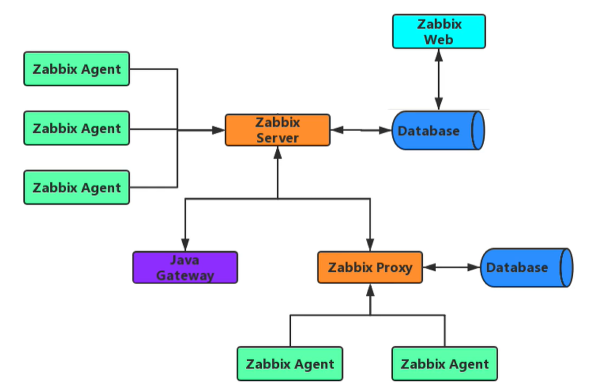

**zabbix具体详细实践步骤见课件与视频**


# 监控系统

今监控天下三分。被划分为基于Metrics（指标）监控、基于Logging（日志）、  基于Tracing（调用 链）监控的监控。


**监控功能**

*   在需要的时刻，提前预警即将出问题,避免故障发生
*   实时监控系统和业务,当出问题之后，通过发出告警,提醒相关人员,快速可以找到问题的根源,从而及 时处理问题
*   可以实现网站,应用或者服务器的故障自愈, 保证高可用性
*   以图形或易观察的方式呈现当前以及过往的状态,便于分析和预测系统发展趋势

## 监控内容

| 分类     | 实例内容                                                     |
| -------- | ------------------------------------------------------------ |
| 硬件监控 | 通过远程控制卡：DeLL的iDRAC、HP的iLO和IBM的IMM等；使用IPMI来完成物理设备的监控工作。通常必须要监控包括温度、硬盘故障等路由器、交换机(端口、光束、日志)、打印机等 |
| 系统监控 | cpu、内存、硬盘使用率、硬盘IO、系统负载、进程数              |
| 服务监控 | nginx、apache、php-fpm、mysql、memcache、redis、tomcat、JVM、TCP连接数 |
| 性能监控 | 网站性能、服务器性能、数据库性能、存储性能                   |
| 日志监控 | 系统会产生系统日志，应用程序会有应用的访问日志、错误日志、服务有运行日志等，可以使用ELK来进行日志监控 |
| 安全监控 | 用户登录记录、passwd文件变化、本地所有文件改动，Nginx+Lua编码与一个私有化的Kibana可以通过图形化的展示不同的攻击类型的统计 |
| 网络监控 | IP端口、URL、DB、ping包、IDC带宽网络流量、网络流量出口率、网络入、流量、网络出口流量、SMTP、POP3 |

**监控体系**

*   系统层监控
    *   系统监控:CPU、Load、Memory、Swap、Disk IO、Processes、Kernel Parameters、…
    *   网络监控:网络设备、工作负载、网络延迟、丢包率、…..
*   中间件及基础设施类系统监控
    *   Web服务容器:Tomcat和Jetty等;
    *   消息中间件:Kafka、RocketMQ和RabbitMQ等
    *   数据库及缓存系统: MySQL、PostgreSQL、MongoDB、ElasticSearch和Redis等
    *   数据库连接池: Mycat、ShardingSphere等
    *   存储系统:NFS和Ceph等
*   应用层监控
    *   用于衡量应用程序代码的状态和性能
    *   通过 APM（Application Performance Monitor应用性能监控）能够提供代码级性能监控并对故障 快速定位
*   业务层监控
    *   用于衡量应用程序的价值，例如电子商务网站上的销售量
    *   QPs、DAU日活、转化率
    *   业务接口:登录数、注册数、订单量、搜索量和支付量等


## 监控方法

Google的四个黄金指标

常用于在服务级别帮助衡量终端用户体验、服务中断、业务影响等层面的问题，适用于应用及服务监控

*   延迟(Latency)
    *   服务请求所需要的时长，例如HTTP请求平均延迟 
    *   应用程序响应时间会受到所有核心系统资源（包括网络、存储、CPU和内存）延迟的影响 
    *   需要区分失败请求和成功请求
*   流量(Traffic)，也称为吞吐量
    *   衡量服务的容量需求，例如每秒处理的HTTP请求数QPS或者数据库系统的事务数量TPS 
    *   吞吐量指标包括每秒Web请求、API调用等示例，并且被描述为通常表示为每秒请求数的需求
*   错误(Errors)
    *   失败的请求（流量)的数量，通常以绝对数量或错误请求占请求总数的百分比表示，请求失败的速 率，用于衡量错误发生的情况
    *   例如：HTTP 500错误数等显式失败，返回错误内容或无效内容等隐式失败，以及由策略原因导致 的失败(例如强制要求响应时间超过30毫秒的请求视为错误)
*   饱和度(Saturation)
    *   衡量资源的使用情况,用于表达应用程序有多"满"
    *   资源的整体利用率，包括CPU（容量、配额、节流)、内存(容量、分配)、存储（容量、分配和 I/O 吞吐量)和网络
    *   例如：内存、CPU、I/O、磁盘等资源的使用量

## 监控工具


### Cacti

Cacti是基于LAMP平台展现的网络流量监测及分析工具

通过SNMP技术或自定义脚本从目标设备/主机获取监控指标信息

其次还可以进行数据存储，调用模板将数据存到数据库，使用rrdtool存储和更新数据，通过rrdtoo1绘 制结果图形

最后进行数据展现，通过web方式将监控结果呈现出来，常用于在数据中心监控网络设备,比如交换机和 路由器

cacti是很老的一款监控工具，其实说它是一款流量监控工具更合适，对流量监控比较精准，但缺点很 多，出图不好看，不支持分布式，也没有告警功能，所以当前使用的用户越来越少。

**缺点:告警不及时**

官网:  https://www.cacti.net 

github:  https://github.com/Cacti/cacti 

二次开发版:  https://cactifans.org/

### Nagios

Nagios是一款开源的免费监控工具，可以有效地监控Windows、Linux和Unix的主机状态，交换机路由 器等网络设置，打印机等。在系统或服务状态异常时发出邮件或短信报警第一时间通知网站运维人员， 在状态恢复后发出正常的邮件或短信通知。

主要的特征是监控告警，最强大的就是告警功能，可支持多种告警方式，但缺点是没有强大的数 据收集机制，并且数据出图也很简陋，当监控的主机越来越多时，添加主机也非常麻烦，配置文件都是 基于文本配置的，不支持web方式管理和配置，这样很容易出错，不易维护。

分层告警机制及自定义监控相对薄弱。

监控主机数量有限，承载能力较低 

官网:  https://www.nagios.org/

### 猎鹰 Open-falcon

open-falcon(猎鹰)是一款用golang和python写的监控系统，由小米公司启动了这个项目 

相对zabbix在性能、扩展性、和用户的使用效率方面，都有较大优势

发布时间较短 

不支持很多基础的服务监控插件,如Tomcat、 apache等 

功能不完善,更新较缓慢 

无专门运维支撑，社区运营有欠缺。

官网:  http://www.open-falcon.org/ 

github:  https://github.com/open-falcon

### 夜莺 Nightingale

夜莺（Nightingale）是滴滴基础平台联合滴滴云研发和开源的企业级监控解决方案。旨在满足云原生时 代企业级的监控需求

Nightingale 在Open-Falcon 的基础上，结合滴滴的最佳实践，在性能、可维护性、易用性方面做了大 量的改进

Nightingale 在产品完成度、系统高可用、以及用户体验方面，达到了企业级的要求，可满足不同规模用 户的场景，小到几台机器，大到数十万都可以完美支撑。兼顾云原生和裸金属，支持应用监控和系统监 控，插件机制灵活，插件丰富完善，具有高度的灵活性和可扩展性

Nightingale 作为集团统一的监控解决方案，支撑了滴滴内部数十亿监控指标，覆盖了从系统、容器、到 应用等各层面的监控需求，周活跃用户数千。五年磨一剑，取之开源，回馈开源

夜莺监控的核心开发团队，也是Open-Falcon项目原核心研发人员

当前社区比较活跃,升级较频繁

https://n9e.github.io/ 

http://n9e.didiyun.com/ 

https://github.com/n9e/n9e.github.io

### Zabbix

Zabbix 是一个基于WEB界面的提供分布式系统监视以及网络监视功能的企业级的开源解决方案。功能强 大,成熟可靠,使用者众多

官网:  https://www.zabbix.com/

### Prometheus

Prometheus 是一个开源的服务监控系统和时间序列数据库,主要在监控容器领域使用,可以实现容器的动 态发现和监控

官网:  https://prometheus.io/

### 商业监控方案

商业监控的方案,可以实现从外部网络,如全国的不同运营商的网络访问指定服务,贴近实际用户的访问感 受,了解实现的访问情况

```
http://ping.chinaz.com/        站长之家
https://www.jiankongbao.com/   监控宝
https://www.toushibao.com/     透视宝
https://www.tingyun.com/       听云
```

### 云监控

https://help.aliyun.com/document_detail/35170.html 

https://cloud.tencent.com/document/product/248/13466


# Zabbix概述和架构

Zabbix 是一个企业级分布式开源监控解决方案，支持实时监控数干台服务器，虚拟机和网络设备，采集 百万级监控指标，适用于任何IT基础架构、服务、应用程序和资源的解决方案

Zabbix SIA  公司成立于2005年， 由CEO兼所有者Alexei Vladishev 创建，Zabbix 目前由此公司积极的 持续开发更新维护， 并为用户提供技术支持服务。

Zabbix 软件能够监控众多网络参数和服务器的健康度、完整性。Zabbix 使用灵活的告警机制，允许用 户为几乎任何事件配置基于邮件的告警。这样用户可以快速响应服务器问题。Zabbix 基于存储的数据提 供出色的报表和数据可视化功能。这些功能使得 Zabbix 成为容量规划的理想选择。

Zabbix 支持主动轮询（polling）和被动捕获（trapping）。Zabbix所有的报表、统计数据和配置参数都 可以通过基于 Web 的前端页面进行访问。基于 Web 的前端页面确保您可以在任何地方访问您监控的网 络状态和服务器健康状况。适当的配置后，Zabbix 可以在监控 IT 基础设施方面发挥重要作用。无论是 对于有少量服务器的小型组织，还是拥有大量服务器的大企业而言，同样适用。

## Zabbix 架构



*   SERVER
    *   Zabbix server 是 Zabbix 软件的核心组件
    *   Zabbix Agent 向其报告可用性、系统完整性信息和统计信息。
    *   Zabbix server也是存储所有配置信息、统计信息和操作信息的核心存储库。
    *   Zabbix server也是Zabbix监控系统的告警中心。在监控的系统中出现任何异常，将发出通知给管 理员。
    *   基本的 Zabbix Server 的功能分解成为三个不同的组件。他们是：Zabbix server、Web前端和数据 库。
    *   Zabbix 的所有配置信息都存储在 Server和Web前端进行交互的数据库中。例如，当你通过Web前 端（或者API）新增一个监控项时，它会被添加到数据库的监控项表里。然后，Zabbix server 以每 分钟一次的频率查询监控项表中的有效项，接着将它存储在 Zabbix server 中的缓存里。这就是为 什么 Zabbix前端所做的任何更改需要花费两分钟左右才能显示在最新的数据段的原因。
*   数据库
    *   所有配置信息以及 Zabbix 采集到的数据都被持久存储在数据库中
    *   可以支持MySQL,PostgreSQL,Oracle 等多种数据库
*   WEB 界面
    *   WEB 界面是 Zabbix server 的一部分，用于实现展示和配置的界面
    *   通常（但不一定）和 Zabbix server 运行在同一台物理机器上
    *   基于 Apache(Nginx)+PHP 实现,早期只支持LAMP架构,从Zabbix5.0开始支持LNMP
*   AGENT
    *    Zabbix agents 部署在被监控目标上，用于主动监控本地资源和应用程序，并将收集的数据发送给  Zabbix server。从Zabbix5.0开始支技Zabbix Agent2
*   PROXY
    *   Zabbix Proxy 可以代替 Zabbix Server 采集性能和可用性数据
    *   Zabbix Proxy 在 Zabbix 的部署是可选部分
    *   Zabbix Proxy 的部署可以很好的分担单个Zabbix server的负载
*   Java 网关
    *   Zabbix 要监控 tomcat 服务器和其它JAVA程序，需要使用 Java gateway 做为代理,才能从JAVA程序 中获取数据
*   内部配置的数据流程
    *   Zabbix 内部的数据流对Zabbix的使用也很重要。首先，为了创建一个采集数据的监控项，就必须 先创建主机。其次，在任务的另外一端，必须要有监控项才能创建触发器（trigger），必须要有触 发器来创建动作（action）。因此，如果您想要收到类似“X个server上CPU负载过高”这样的告警， 您必须首先为 Server X 创建一个主机条目，其次创建一个用于监控其 CPU的监控项，最后创建一 个触发器，用来触发 CPU负载过高这个动作，并将其发送到您的邮箱里。虽然这些步骤看起来很繁 琐，但是使用模板的话，实际操作非常简单。也正是由于这种设计，使得 Zabbix 的配置变得更加 灵活易用。

##  Zabbix Server 启动进程


**zabbix server 进程说明**

**Zabbix服务器端进程有多达二十多种**

**当在操作系统下用ps aux命令来查看时，往往看到很多zabbix系统进程，而这些系统进程在zabbix内部称 为实例。这些实例各处负责不同的工作，就形成了不同种类型的进程)，各种类型进程的说明如下:**

*   报警器(alerter)
    *   该类型的进程是用来发送报警通知的
*   配置同步器(configuration syncer)
    *   用于将配置文件中的配置信息同步到内存中缓存
*   数据发送器(data sender)
    *   服务器代理节点用于发送数据的进程（服务器端没有这类进程）
*   数据库看门狗(db watchdog)
    *   该进程用于监视zabbix系统的数据库状态，当数据库状态变为不可用时，发 送警告信息（服务器代理端不支持这类型进程）。
*   自动发现器(discoverer)
    *   用于自动发现设备的进程
*   步骤(escalator)
    *   用于处理动作中的步骤的进程
*   心跳发送器(heartbeat sender)
    *   服务器代理端用于发送心跳信息（服务器端没有这类型的进程）
*   历史数据同步器(history syncer)
    *   用于写历史数据表
*   管家(housekeeper)
    *   用于清理过期的历史数据的进程
*   HTTP 轮询器(http poller)
    *   用于轮询web类的监控项目
*   Ping检查器(icmp pinger)
    *   用于定期的进行ICMP PING检查
*   ipmi 轮询器（ipmi poller）
    *   用于定期进行ipmi监控项目的检查
*   java 轮询器(java poller)
    *   用于轮询java 监控项目
*   分布式节点看守器(node watcher)
    *   用于在不同的分布式节点发送历史数据和配置信息更新的进程
*   轮询器(poller)
    *   用于普通的被动监控项目的轮询
*   服务器代理轮询(proxy poller)
    *   用于服务器代理的被动轮询
*   自我监控(self-monitoring)
    *   用于收集Zabbix系统内部的监控信息
*   定时器(timer)
    *   用于处理触发器中也时间相关的函数和维护模式的进程
*   陷入器(trapper)
    *   用于处理主动采集、陷入以及分布式节点间或服务器代理的通信
*   不可到达轮询器(unreachable poller)
    *   用于轮询不可到达到的设备
*   vmware 收集器(vmware collector)
    *   负责从vmware服务进程中收集数据（服务器代理端不支持这种类 型的进程）

## Zabbix 术语


 被监控： 即 Zabbix 监控的主机或设备

监控项item：即 Zabbix 监控的相关指标，比如：CPU利用率，内存使用率，TCP连接数等

应用集Application：为方便管理众多的监控项，可将多个同类型的监控项进行归类，纳入一个集合中， 即应用集

触发器Trigger：是一个表达式，或者说一个条件，如磁盘利用率超过80%等，当触发条件后，会导致一 个触发事件，这个事件会执行一个或多个动作

动作Action：动作是触发器的条件被触发后的行为，可以是发送一条短信，微信或邮件，或是重启某个 服务

告警：当触发器和动作二者结合起来时，就构成了的告警机制，比如cpu的使用率达到80%以上，触发 了报警动作，系统将自动发送一封邮件到指定的邮箱。然后运维可以及时的去处理此错误。

Web 监测：对WEB服务进行检测，比如：访问指定网站是否可正常访问

模板 Template: 可以方便地应用于多个主机的一组实体的集合。而这些实体包括：

*   items（监控项）
*   applications（应用集）
*   triggers（触发器）
*   graphs（图形）
*   screens (聚合图形,自Zabbix 2.0起)
*   low-level discovery rules (自动发现规则 ,自Zabbix 2.0起）
*   web scenarios (web场景, 自Zabbix 2.0起)

由于现实中的许多主机是相同或类似的，所以，为一个主机创建的一组实体（项目，触发器，图形， …）可能对许多人有用。虽然可以将它们复制到每个新的主机上，但过程很繁琐。可以将需要的实体都 复制到一个模板，然后根据需要将模板应用于尽可能多的主机。

当模板链接到主机时，模板的所有实体（项目，触发器，图形，…）都将添加到主机。

模板通常用于为特定服务或应用程序（如Apache，MySQL，PostgreSQL，Postfix …）分组实体，然后 应用于运行这些服务的主机。

使用模板的另一个好处是当所有主机都需要更改时。只需要在模板上更改某些内容将会将更改应用到所 有链接的主机。

创建新模板时，链接的模板选项卡允许将一个或多个“嵌套”模板链接到此模板。所有实体（项目，触发 器，图表等）将从链接的模板继承。

因此，使用模板是减少工作量并简化Zabbix配置的好方法。

模板分为内置模板和自定义模板

内置模板参看:  https://git.zabbix.com/projects/ZBX/repos/zabbix/browse/templates


## Zabbix 部署架构


# 安装 Zabbix Server

