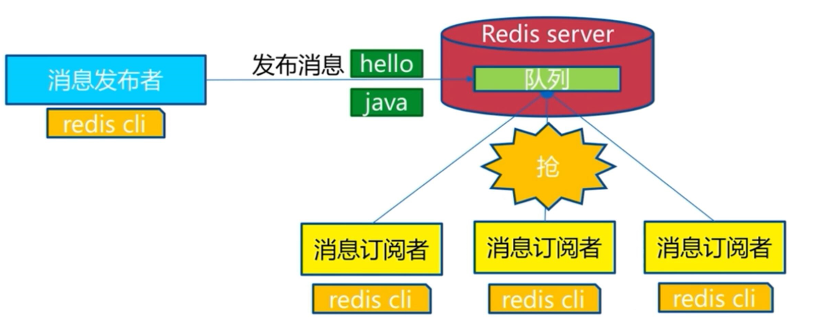
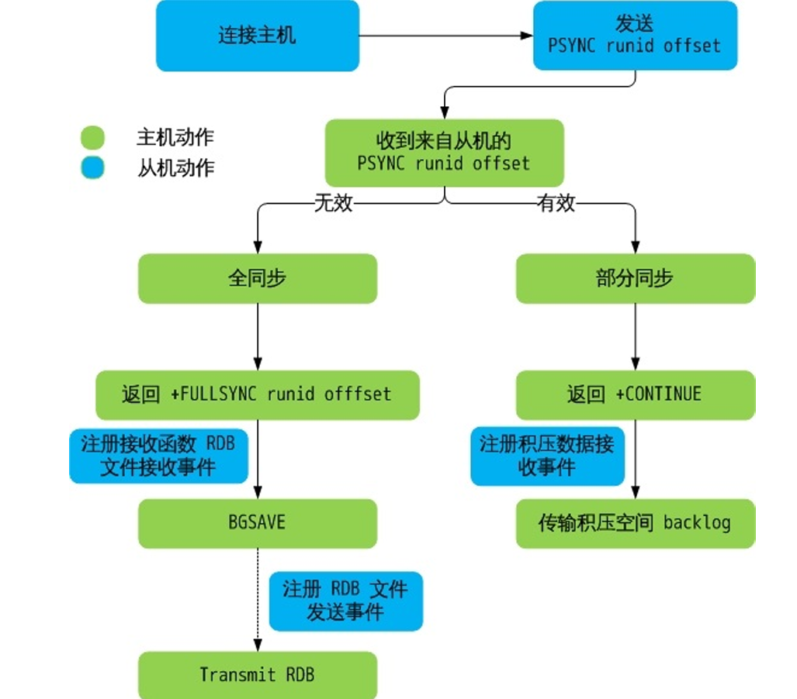
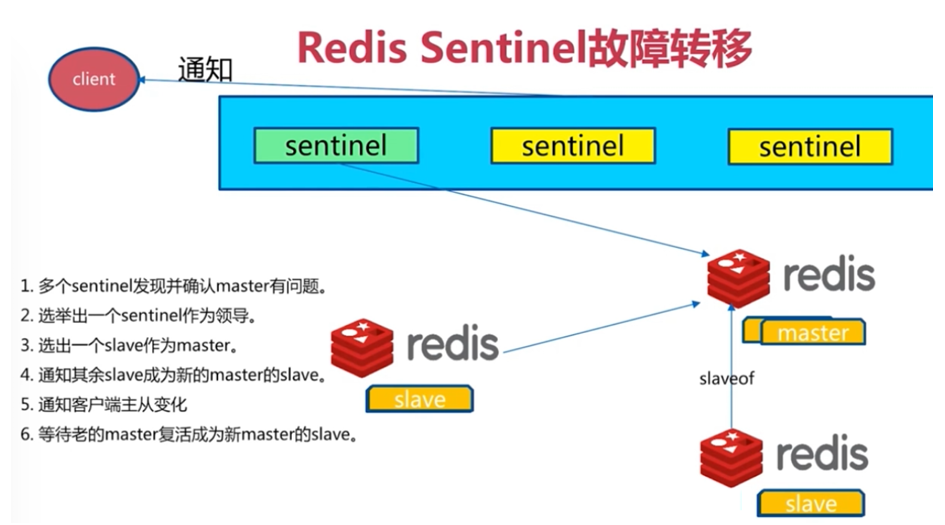
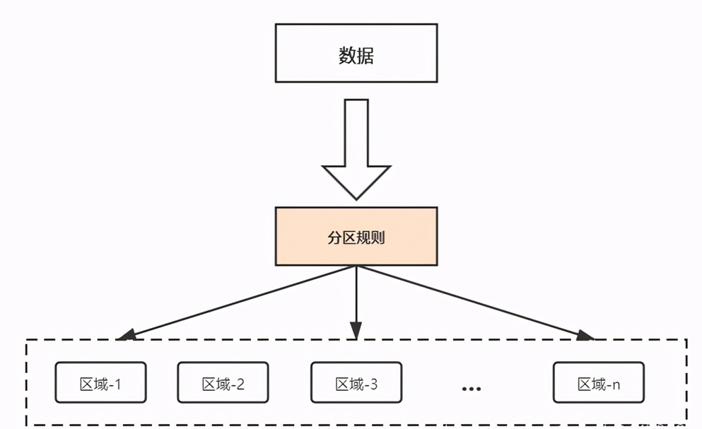

# Redis 基础

## NoSQL 数据库

数据库主要分为两大类：关系型数据库与 NoSQL 数据库。

NoSQL 数据库，全称为 Not Only SQL，意思就是适用关系型数据库的时候就使用关系型数据库，不适 用的时候可以考虑使用更加合适的数据存储。NoSQL 是对不同于传统的关系型数据库的数据库管理系统 的统称。

NoSQL 用于超大规模数据的存储。（例如谷歌或 Facebook 每天为他们的用户收集万亿比特的数据）。 这些类型的数据存储不需要固定的模式，无需多余操作就可以横向扩展。

## NoSQL 起源

NoSQL 一词最早出现于 1998 年，是 Carlo Strozzi 开发的一个轻量、开源、不提供 SQL 功能的关系数据 库。

2009 年，Last.fm 的 Johan Oskarsson 发起了一次关于分布式开源数据库的讨论，来自 Rackspace 的 Eric  Evans 再次提出了 NoSQL 的概念，这时的 NoSQL 主要指非关系型、分布式、不提供 ACID 的数据库设计模 式。

2009 年在亚特兰大举行的 "no: sql(east)" 讨论会是一个里程碑，其口号是 "select fun, profit from  real_world where relational = false;"。因此，对 NoSQL 最普遍的解释是 "非关联型的"，强调 Key-Value  Stores 和文档数据库的优点，而不是单纯的反对 RDBMS。

## 为什么使用 NoSQL

主要是由于随着互联网发展，数据量越来越大，对性能要求越来越高，传统数据库存在着先天性的缺 陷，即单机（单库）性能瓶颈，并且扩展困难。这样既有单机单库瓶颈，却又扩展困难，自然无法满足 日益增长的海量数据存储及其性能要求，所以才会出现了各种不同的 NoSQL 产品，NoSQL 根本性的优 势在于在云计算时代，简单、易于大规模分布式扩展，并且读写性能非常高

通过第三方平台（如：Google, Facebook 等）可以很容易的访问和抓取数据。用户的个人信息，社交网 络，地理位置，用户生成的数据和用户操作日志已经成倍的增加。如果要对这些用户数据进行挖掘，那 SQL 数据库已经不适合这些应用了, NoSQL 数据库的发展却能很好的处理这些大的数据。

## RDBMS 和 NOSQL 对比

RDBMS

*   高度组织化结构化数据 
*   结构化查询语言（SQL） 
*   数据和关系都存储在单独的表中。
*    数据操纵语言，数据定义语言 
*   严格的一致性 
*   基础事务

NoSQL

*   代表着不仅仅是 SQL, 没有声明性查询语言 
*   没有预定义的模式 
*   最终一致性，而非 ACID 属性 
*   非结构化和不可预知的数据 
*   CAP 定理 
*   高性能，高可用性和可伸缩性


## CAP theorem


它指出对于一个分布式计算系统，不可能同时满足以下三点:

*   C：Consistency 

    *   即一致性， 所有节点在同一时间具有相同的数据视图 换句话说，如果一个节点在写入操作完成后，所有其他节点都能立即读取到最新的数据。 

        注意，这里的一致性指的是强一致性，也就是数据更新完，访问任何节点看到的数据完全一致，要 和弱一致性，最终一致性区分开来。 

        每次读取的数据都应该是最近写入的数据或者返回一个错误, 而不是过期数据，也就是说，所有节 点的数据是一致的。

*   A：Availability

    *   即可用性，所有的节点都保持高可用性, 要求服务在接收到客户端请求后，都能够给出响应 

        每个非故障节点都能够在有限的时间内返回有效的响应，即系统一直可用。可用性强调系统对用户 请求的及时响应

        注意，这里的高可用还包括不能出现延迟，比如如果某个节点由于等待数据同步而阻塞请求，那么 该节点就不满足高可用性。 

        也就是说，任何没有发生故障的服务必须在有限的时间内返回合理的结果集。 

        每次请求都应该得到一个有效的响应，而不是返回一个错误或者失去响应，不过这个响应不需要保 证数据是最近写入的, 也就是说系统需要一直都是可用正常使用的，不会引起调用者的异常，但是并 不保证响应的数据是最新的。

*   P：Partiton tolerance

    *   分区是指系统中的节点由于网络故障无法相互通信，导致系统被分成多个孤立的子系统 在分布式系统中，不同节点之间通过网络进行通信 

        分区容忍性是指当分布式系统中出现网络分区（即系统中的一部分节点无法和其他节点进行通信） 时，系统能够容忍这种情况，并且分离的系统也能够正常运行。这意味着，即使系统中某些节点或 网络分区出现故障或延迟，整个系统仍然能够继续运作，不会受到单点故障的影响。 

        由于网络是不可靠的，所有节点之间很可能出现无法通讯的情况，在节点不能通信时，要保证系统 可以继续正常服务。 

        在分布式系统中，机器分布在各个不同的地方，由网络进行连接。由于各地的网络情况不同，网络 的延迟甚至是中断是不可避免的。 

        因此分区容错性通常是分布式系统的必要条件，即如果不能容忍分区，就只能是一个单一系统，而 非一个真正可用的分布式系统

遵循 CAP 原理，一个数据分布式系统不可能同时满足 C 和 A 和 P 这 3 个条件。所以系统架构师在设计系统 时，不要将精力浪费在如何设计能满足三者的完美分布式系统，而是应该进行取舍。由于网络的不可靠 的性质，大多数开源的分布式系统都会实现 P，也就是分区容忍性，之后在 C 和 A 中做抉择。

比如: MySQL 的主从服务器之间网络没有问题，主从复制正常，那么数据一致性，可用性是有保障的。 但是如果网络出现了问题，主从复制异常，那么就会有数据不同步的情况。这种情况下有两个选择，第 一个方法是保证可用性，允许出现数据不一致的情况，依然在主数据库写，从数据库读。第二个方法是 保证一致性，关闭主数据库，禁止写操作，确保主从数据一致，等服务器之间网络恢复了，再开放写操 作。

也就是说，在服务器之间的网络出现异常的情况下，一致性和可用性是不可能同时满足的，必须要放弃 一个，来保证另一个。这也正是 CAP 定理所说的，在分布式系统中，P 总是存在的。在 P 发生的前提下， C(一致性)和 A（可用性）不能同时满足。这种情况在做架构设计的时候就要考虑到，要评估对业务的影 响，进行权衡决定放弃哪一个。在通常的业务场景下，系统不可用是不能接受的，所以要优先保证可用 性，暂时放弃一致性。

因此，根据 CAP 原理将 NoSQL 数据库分成了满足 CA 原则、满足 CP 原则和满足 AP 原则三大类：

*   CA - 单点集群，满足一致性，可用性的系统，通常在可扩展性上不太强大。 
    *   放弃分区容忍性，即不进行分区，不考虑由于网络不通或结点挂掉的问题，则可以实现一致性和可 用性。那么系统将不是一个标准的分布式系统
    *   比如: 单一数据中心数据库, 所有节点都位于同一个数据中心，并且节点之间的通信是高可靠的
*   CP - 满足一致性，分区容忍性的系统，通常性能不是特别高。 放弃可用性，追求强一致性和分区 容错性
    *   例如: Zookeeper, ETCD, Consul, MySQL 的 PXC 等集群就是追求的强一致，再比如跨行转账，一次转 账请求要等待双方银行系统都完成整个事务才算完成。
*   AP - 满足可用性，分区容忍性的系统，通常可能对一致性要求低一些。
    *   放弃一致性，追求分区容忍性和可用性。这是很多分布式系统设计时的选择。
    *   例如：MySQL 主从复制，默认是异步机制就可以实现 AP，但是用户接受所查询的到数据在一定时 间内不是最新的.
    *   通常实现 AP 都会保证最终一致性，而 BASE 理论就是根据 AP 来扩展的，一些业务场景 比如：订单退 款，今日退款成功，明日账户到账，只要用户可以接受在一定时间内到账即可。

## Base 理论

Base 理论是三要素的缩写：基本可用（Basically Available）、软状态（Soft-state）、最终一致性 （Eventually Consistency）。


*   基本可用  （Basically Available）

    *   相对于 CAP 理论中可用性的要求：【任何时候，读写都是成功的】，“基本可用”要求系统能够基本 运行，一直提供服务，强调的是分布式系统在出现不可预知故障的时候，允许损失部分可用性。比 如系统通过断路保护而引发快速失败，在快速失败模式下，支持加载默认显示的内容（静态化的或 者被缓存的数据），从而保证服务依然可用。

        相比于正常的系统，可能是响应时间延长，或者是服务被降级。

        比如在在秒杀活动中，如果抢购人数太多，超过了系统的 QPS 峰值，可能会排队或者提示限流。

*   软状态 （Soft state）

    *   相对于 ACID 事务中原子性要求的要么全做，要么全不做，强调的是强制一致性，要求多个节点的数 据副本是一致的，强调数据的一致性。这种原子性可以理解为”硬状态“。

        而软状态则允许系统中的数据存在中间状态，并认为该状态不影响系统的整体可用性，即允许系统 在不同节点的数据副本上存在数据延时。

        比如粉丝数，关注后需要过一段时间才会显示正确的数据。

*   最终一致性（Eventuallyconsistent）

    *   数据不可能一直处于软状态，必须在一个时间期限后达到各个节点的一致性。在期限过后，应当保 证所有副本中的数据保持一致性，也就是达到了数据的最终一致性。

        在系统设计中，最终一致性实现的时间取决于网络延时、系统负载、不同的存储选型，不同数据复 制方案设计等因素。也就是说，不保证用户什么时候能看到更新完成后的数据，但是终究会看到 的。

## NoSQL 数据库分类


## Redis 特性

*   速度快: 10W QPS, 基于内存, C 语言实现 
*   单线程：引号的”单线程“ 
*   持久化：RDB，AOF 
*   支持多种数据类型 
*   支持多种编程语言 
*   功能丰富: 支持 Lua 脚本, 发布订阅, 事务, pipeline 等功能 
*   简单: 代码短小精悍(单机核心代码只有 23000 行左右), 单线程开发容易, 不依赖外部库, 使用简单 
*   主从复制 
*   支持高可用和分布式

## “单线程”

Redis 6.0 版本前一直是单线程方式处理用户的请求 


单线程为何如此快? 

*   纯内存 
*   非阻塞 
*   避免线程切换和竞态消耗 
*   基于 Epoll 实现 IO 多路复用


注意事项:

*   一次只运行一条命令 
*   避免执行长(慢)命令: keys *, flushall, flushdb, slow lua script, mutil/exec, operate big  value(collection)
*   其实不是单线程: 早期版本是单进程单线程,3.0 版本后实际还有其它的线程, 实现特定功能, 如: fysnc  file descriptor, close file descriptor


## Redis 对比 Memcached

| 比较类别       | Redis                                                        | Memcached                                                    |
| -------------- | ------------------------------------------------------------ | ------------------------------------------------------------ |
| 支持的数据结构 | 哈希、列表、集合、有序集合                                   | 纯粹 key-value                                                |
| 持久化支持     | 有                                                           | 无                                                           |
| 高可用支持     | redis 支持集群功能，可以实现主从复制、读写分离。官方也提供了 sentinel 集群管理工具，能够实现从服务器监控、故障自动转移，这一切，对于客户端都是透明的，无需程序改动，也无需人工介入 | 需要二次开发                                                 |
| 存储 value 容量  | 最大 512M                                                     | 最大 1M                                                       |
| 内存分配       | 临时申请空闲内存，可能导致碎片                               | 预分配内存池的方式管理内存，能够减少内存分配时间             |
| 虚拟内存使用   | 有自己的 VM 机器，理论上能够存储比物理内存更多的数据，当数据超量时，会引发 swap，把冷数据刷到磁盘 | 所有的数据存储在物理内存中                                   |
| 网络模型       | 非阻塞 I/O 复用模型提供一些 KV 存储之外的排序、聚合功能，在执行这些功能时，复读的 CPU 计算，会阻塞整个 I/O 调度 | 非阻塞 I/O 复用模型                                            |
| 水平扩展的支持 | redis cluster 可以横向扩展                                    | 暂无                                                         |
| 多线程         | Redis6.0 之前只支持单线程                                     | Memcached 支持多线程，CPU 利用方面 Memcache 优于 Redis            |
| 过期策略       | 有专门线程清除缓存数据                                       | 慢漏洞机制：每次在缓存放入数据的时候，都缓存一个时间，在读取的时候根据时间和设置的时间做 TTL 比较来判断是否过期 |
| 单机 QPS        | 约 10W                                                        | 约 60W                                                        |
| 源代码可读性   | 代码清晰简洁                                                 | 代码不清晰                                                   |
| 适用场景       | 复杂数据结构、支持持久化、高可用需求、value 存储容量较大      | 纯粹 KV，数据量非常大，并开发是非常大的业务                   |

## Redis 常见应用场景


*   缓存：缓存 RDBMS 中数据, 比如网站的查询结果、商品信息、微博、新闻、消息
*   Session 共享：实现 Web 集群中的多服务器间的 session 共享
*   计数器：商品访问排行榜、浏览数、粉丝数、关注、点赞、评论等和次数相关的数值统计场景
*   社交：朋友圈、共同好友、可能认识他们等
*   地理位置: 基于地理信息系统 GIS（Geographic Information System)实现摇一摇、附近的人、外卖 等功能
*   消息队列：ELK 等日志系统缓存、业务的订阅/发布系统

## 缓存的实现流程

数据更新操作流程：


数据读操作流程：


## 缓存穿透, 缓存击穿和缓存雪崩


### 缓存穿透 Cache Penetration

缓存穿透是指缓存和数据库中都没有的数据，而用户不断发起请求，比如： 发起为 id 为 “-1” 的数据或 id 为特别大不存在的数据。

这时的用户很可能是攻击者，攻击会导致数据库压力过大。

解决方法：

*   接口层增加校验，如用户鉴权校验，id 做基础校验，id <= 0 的直接拦截 
*   从缓存取不到的数据，在数据库中也没有取到，这时也可以将 key-value 对写为 key-null，缓存有效 时间可以设置短点，如 30 秒（设置太长会导致正常情况也没法使用）。这样可以防止攻击用户反复 用同一个 id 暴力攻击

###  缓存击穿 Cache breakdown

缓存击穿是指缓存中没有但数据库中有的数据，比如：热点数据的缓存时间到期后，这时由于并发用户 特别多，同时读缓存没读到数据，又同时去数据库去取数据，引起数据库压力瞬间增大，造成过大压力

解决方法：

*   设置热点数据永远不过期。


### 缓存雪崩 Thunder Hurd Problem

缓存雪崩是指缓存中数据大批量到过期时间，而查询数据量巨大，引起数据库压力过大甚至 down 机。和 缓存击穿不同的是，缓存击穿指并发查同一条数据，缓存雪崩是不同数据都过期了，很多数据都查不到 从而查数据库。

解决方法：

*   缓存数据的过期时间设置随机，防止同一时间大量数据过期现象发生
*   如果缓存数据库是分布式部署，将热点数据均匀分布在不同搞得缓存数据库中
*   设置热点数据永远不过期

### 缓存 crash

Redis 缓存服务宕机，造成 缓存服务失效

## Pipeline 流水线

Redis 客户端执行一条命令分 6 个过程：

发送命令 --> 网络传输 --> 命令排队 --> 命令执行 --> 网络传输 --> 返回结果

这个过程称为 Round trip time(简称 RTT, 往返时间)，mget, mset 指令可以一次性的批量对多个数据的执 行操作, 所以有效节约了 RTT

但大部分命令（如 hgetall）不支持批量操作，需要消耗 N 次 RTT ，利用 Pipeline 技术可以解决这一问题

未使用 pipeline 执行 N 条命令如下图


使用了 pipeline 执行 N 条命令如下图


两者性能对比


# Redis 安装

https://redis.io/docs/getting-started/installation/

## 包安装 Redis

```shell
apt-get install lsb-release curl gpg
curl -fsSL https://packages.redis.io/gpg | sudo gpg --dearmor -o /usr/share/keyrings/redis-archive-keyring.gpg
chmod 644 /usr/share/keyrings/redis-archive-keyring.gpg
echo "deb [signed-by=/usr/share/keyrings/redis-archive-keyring.gpg] https://packages.redis.io/deb $(lsb_release -cs) main" | sudo tee /etc/apt/sources.list.d/redis.list
apt update
apt install redis
```

## 编译安装 Redis

[Index of /releases/](https://download.redis.io/releases/)

官方的安装方法：

[Install Redis from Source | Docs](https://redis.io/docs/latest/operate/oss_and_stack/install/install-redis/install-redis-from-source/)

```shell
apt -y install make gcc libjemalloc-dev libsystemd-dev
mkdir -p /redis/{etc,log,data,run}
echo 'PATH=/apps/redis/bin:$PATH' >> /etc/profile
. /etc/profile

wget https://download.redis.io/releases/redis-7.4.2.tar.gz
tar -xzvf redis-7.4.2.tar.gz 
cd redis-7.4.2/
make -j 2  USE_SYSTEMD=yes  PREFIX=/redis install
cp redis.conf /redis/etc/
```

前台启动 redis

```shell
redis-server /redis/etc/redis.conf
```

创建 Redis 用户和设置数据目录权限及修改默认配置文件

```shell
useradd -r -s /sbin/nologin redis
chown -R redis:redis /redis/

vim /redis/etc/redis.conf
dir /redis/data
pidfile /redis/run/redis_6379.pid
```

创建 Redis 服务 Service 文件

```shell
cp /root/redis-7.4.2/utils/systemd-redis_server.service  /lib/systemd/system/redis.service

[Service]
ExecStart=/usr/local/bin/redis-server /redis/etc/redis.conf --supervised systemd --daemonize no

systemctl daemon-reload
```

验证

```shell
redis-cli
127.0.0.1:6379> ping
PONG
```

## 多实例

以编译安装为例实现 redis 多实例

多配置文件

```shell
/redis/etc# cp redis.conf redis-6380.conf
/redis/etc# cp redis.conf redis-6381.conf

# 三处改动
port 6380
pidfile /redis/run/redis_6380.pid
dbfilename dump_6380.rdb 

# 或者
sed  's/6379/6380/' /redis/etc/redis.conf > /redis/etc/redis-6380.conf
sed  's/6379/6381/' /redis/etc/redis.conf > /redis/etc/redis-6381.conf
# 但 dbfilename 要手动改
dbfilename dump_6380.rdb 
```

多服务文件

```shell
cp /lib/systemd/system/redis.service /lib/systemd/system/redis6380.service
ExecStart=/redis/bin/redis-server /redis/etc/redis-6381.conf --supervised systemd  

cp /lib/systemd/system/redis.service /lib/systemd/system/redis6381.service
ExecStart=/redis/bin/redis-server /redis/etc/redis-6381.conf --supervised systemd  
```


## 优化

消除启动时的三个 Warning 提示信息(可选)

### Tcp backlog

`WARNING: The TCP backlog setting of 511 cannot be enforced because  /proc/sys/net/core/somaxconn is set to the lower value of 128.****`

Tcp backlog 是指 TCP 的第三次握手服务器端收到客户端 ack 确认号之后到服务器用 Accept 函数处理请求 前的队列长度，即全连接队列

Ubuntu22.04 后默认值满足要求，不再有此告警

```shell
半连接队列
cat /proc/sys/net/ipv4/tcp_max_syn_backlog
128

#全连接队列默认值
cat  /proc/sys/net/core/somaxconn
4096

# 修改配置
vim /etc/sysctl.conf
net.core.somaxconn = 4096
sysctl -p
```

### overcommit_memory

`WARNING overcommit_memory is set to 0! Background save may fail under low memory  condition. To fix this issue add 'vm.overcommit_memory = 1' to /etc/sysctl.conf  and then reboot or run the command 'sysctl vm.overcommit_memory=1' for this to  take effect.`

内核参数 overcommit_memory 实现内存分配策略, 可选值有三个：0、1、2

*   0 

    表示内核将检查是否有足够的可用内存供应用进程使用；如果有足够的可用内存，内存申请允许；否则内存 申请失败，并把错误返回给应用进程

*   1 

    表示内核允许分配所有的物理内存，而不管当前的内存状态如何

    大小不超过物理内存大小

*   2 

    表示内核允许分配超过所有物理内存和交换空间总和的内存

    大小不超过物理内存和交换空间总和

```shell
sysctl vm.overcommit_memory

vim /etc/sysctl.conf
vm.overcommit_memory = 1
sysctl -p
```

### transparent hugepage

透明大页

`WARNING you have Transparent Huge Pages (THP) support enabled in your kernel.  This will create latency and memory usage issues with Redis. To fix this issue  run the command 'echo never > /sys/kernel/mm/transparent_hugepage/enabled' as  root, and add it to your /etc/rc.local in order to retain the setting after a  reboot. Redis must be restarted after THP is disabled.`

警告：您在内核中启用了透明大页面（THP, 不同于一般 4k 内存页, 而为 2M）支持。 这将在 Redis 中造成延迟 和内存使用问题。 要解决此问题，请以 root 用户身份运行命令“echo never >  /sys/kernel/mm/transparent_hugepage/enabled”，并将其添加到您的/etc/rc.local 中，以便在 重启后保留设置。禁用 THP 后，必须重新启动 Redis。

注意：Ubuntu24.04 .22.04 默认值满足要求，不再有此告警

```shell
cat /sys/kernel/mm/transparent_hugepage/enabled
always [madvise] never

vim /etc/rc.local
echo never > /sys/kernel/mm/transparent_hugepage/enabled

chmod +x /etc/rc.local
```

# Redis 工具和客户端连接

```shell
ll /redis/bin/
redis-benchmark*  # 性能测试
redis-check-aof -> redis-server* # AOF 文件检查程序
redis-check-rdb -> redis-server* # RDB 文件检查程序
redis-cli* # 客户端程序
redis-sentinel -> redis-server* # 哨兵程序
redis-server* # 服务端主程序
```

##  客户端程序 redis-cli

```shell
redis-cli -h <Redis服务器IP> -p <PORT> -a <PASSWORD> --no-auth-warning
```

## 程序连接 Redis

### Shell 脚本访问 Redis

```shell
NUM=100
PASS=123456
HOST=127.0.0.1
PORT=6379
DATABASE=0

for i in `seq $NUM`;do
    redis-cli -h ${HOST}  -a "$PASS" -p ${PORT} -n ${DATABASE} --no-auth-warning  set key${i} value${i}
    #redis-cli -h ${HOST} -p ${PORT} -n ${DATABASE} --no-auth-warning  set key${i} value${i}
    echo "key${i} value${i} 写入完成"
done
echo "$NUM个key写入到Redis完成"  
```


###  Python 程序连接 Redis

[Connect with Redis client API libraries | Docs](https://redis.io/docs/latest/develop/clients/)

```shell
apt update && apt -y install  python3-redis
```

py 脚本

```python
/usr/bin/python3 
import redis
pool = redis.ConnectionPool(host="127.0.0.1",port=6379,password="123456",decode_responses=True)
r = redis.Redis(connection_pool=pool)
for i in range(100000):
    r.set("k%d" % i,"v%d" % i)
    data=r.get("k%d" % i)
    print(data)
```

## 图形工具

### RedisInsight

https://apps.microsoft.com/store/detail/redisinsight/XP8K1GHCB0F1R2

### Another-Redis-Desktop-Manager

当前 Redis7.2.1 无法连接，Redis7.2.2 以后版本可以

https://github.com/qishibo/AnotherRedisDesktopManager

### RedisDesktopManager

当前 Redis-v7.2.1 无法连接，redis-v7.2.3 以后版本可以支持连接


# Redis 基础功能

## Redis 常用命令

### INFO

显示当前节点 redis 运行状态信息

```shell
redis-cli info

# 指定显示部分
redis-cli info server

redis-cli info Cluster
```

### SELECT

切换数据库，相当于在 MySQL 的 USE DBNAME 指令

0-15

```shell
root@loong:~# redis-cli
127.0.0.1:6379> SELECT 0
OK
127.0.0.1:6379> SELECT 1
OK
127.0.0.1:6379[1]> SELECT 15
OK
127.0.0.1:6379[15]> SELECT 16
(error) ERR DB index is out of range
127.0.0.1:6379[15]> 
```

注意: 在 Redis cluster 模式下不支持多个数据库, 会出现下面错误

```shell
root@loong:~# redis-cli 
127.0.0.1:6379> info cluster
# Cluster
cluster_enabled:1
127.0.0.1:6379> select 0
OK
127.0.0.1:6379> select 1
(error) ERR SELECT is not allowed in cluster mode
```

### KEYS

查看当前库下的所有 key，**此命令慎用！**


```shell
 127.0.0.1:6379> KEYS *
 redis> KEYS *o*
 redis> KEYS t??
 redis> KEYS t[w]*
```

### DBSIZE

返回当前库下的所有 key 数量

```shell
127.0.0.1:6379> DBSIZE
(integer) 100000
```

### FLUSHDB

强制清空当前库中的所有 key，**此命令慎用！**

```shell
127.0.0.1:6379> DBSIZE
(integer) 100000
127.0.0.1:6379> FLUSHDB
OK
127.0.0.1:6379> DBSIZE
(integer) 0
```

### FLUSHALL

强制清空当前 Redis 服务器 **所有数据库中的所有 key**，即删除所有数据，**此命令慎用！**

### SHUTDOWN

可用版本： >= 1.0.0

时间复杂度： O(N)，其中 N 为关机时需要保存的数据库键数量。

SHUTDOWN 命令执行以下操作：

*   关闭 Redis 服务, 停止所有客户端连接
*   如果有至少一个保存点在等待，执行 SAVE 命令
*   如果 AOF 选项被打开，更新 AOF 文件
*   关闭 redis 服务器(server)
*   如果持久化被打开的话， SHUTDOWN 命令会保证服务器正常关闭而不丢失任何数据。
*   另一方面，假如只是单纯地执行 SAVE 命令，然后再执行 QUIT 命令，则没有这一保证 —— 因为在执行  SAVE 之后、执行 QUIT 之前的这段时间中间，其他客户端可能正在和服务器进行通讯，这时如果执行 QUIT  就会造成数据丢失。

**建议禁用此指令**

```shell
重新命令
vim /etc/redis.conf
rename-command shutdown ""
```

## Redis 配置文件说明

```ini
bind 0.0.0.0    
#指定监听地址，支持用空格隔开的多个监听IP

protected-mode yes 
# redis3.2之后加入的新特性，在没有设置bind IP和密码的时候,redis只允许访问127.0.0.1:6379，
# 可以远程连接，但当访问将提示警告信息并拒绝远程访问,redis-7版本后，只要没有密码就不能远程访问

requirepass foobared 
#设置redis连接密码，之后需要AUTH pass,如果有特殊符号，用" "引起来,生产建议设置

port 6379       
#监听端口,默认6379/tcp

tcp-backlog 511 
#三次握手的时候server端收到client ack确认号之后的队列值，即全连接队列长度

timeout 0       
#客户端和Redis服务端的连接超时时间，默认是0，表示永不超时

tcp-keepalive 300 
#tcp 会话保持时间300s

daemonize no 
#默认no,即直接运行redis-server程序时,不作为守护进程运行，而是以前台方式运行
#如果想在后台运行需改成yes,当redis作为守护进程运行的时候，它会写一个 pid 到/var/run/redis.pid 文件

supervised no
# 和OS相关参数，可设置通过upstart和systemd管理Redis守护进程，centos7后都使用systemd

pidfile /var/run/redis_6379.pid 
#pid文件路径

loglevel notice 
#日志级别

logfile "/path/redis.log" 
#日志路径

databases 16 
#设置数据库数量，默认：0-15，共16个库

always-show-logo yes 
#在启动redis 时是否显示或在日志中记录记录redis的logo

rename-command 
#重命名一些高危命令，示例：rename-command FLUSHALL "" 禁用命令
#示例: rename-command del wang

maxclients 10000 
#Redis最大连接客户端,默认值10000

maxmemory <bytes> 
#redis使用的最大内存，单位为bytes字节，0为不限制，建议设为物理内存一半，
# 8G内存的计算方式8(G)*1024(MB)1024(KB)*1024(Kbyte)
# 需要注意的是缓冲区是不计算在maxmemory内,生产中如果不设置此项,可能会导致OOM

maxmemory-policy
# MAXMEMORY POLICY：当达到最大内存时，Redis 将如何选择要删除的内容。您可以从以下行为中选择一种：
# 
# volatile-lru -> Evict 使用近似 LRU（最近最少使用算法），只有设置了过期时间的键
# allkeys-lru -> 使用近似 LRU 驱逐任何键。
# volatile-lfu -> 使用近似 LFU 驱逐，只有设置了过期时间的键。
# allkeys-lfu -> 使用近似 LFU 驱逐任何键。
# volatile-random -> 删除设置了过期时间的随机键。
# allkeys-random -> 删除一个随机密钥，任何键。
# volatile-ttl -> 删除过期时间最近的key（次TTL）
# noeviction -> 不要驱逐任何东西，只是在写操作时返回一个错误。此为默认值
#
# LRU 表示最近最少使用
# LFU 表示最不常用
#
# LRU、LFU 和 volatile-ttl 都是使用近似随机算法实现的。
# 注意：使用上述任何一种策略，当没有合适的键用于驱逐时，Redis 将在需要更多内存的写操作时返回错误。
# 这些通常是创建新密钥、添加数据或修改现有密钥的命令。
# 一些示例是：SET、INCR、HSET、LPUSH、SUNIONSTORE、SORT（由于 STORE 参数）和 EXEC（如果事务包括任何需要内存的命令）。

lua-time-limit 5000 #lua脚本的最大执行时间，单位为毫秒


```

持久化配置（snapshot（RDB），Append Only File（AOF））

```ini
save 900 1 #在900秒内有1个key内容发生更改,就执行快照机制
save 300 10 #在300秒内有10个key内容发生更改,就执行快照机制
save 60 10000  #60秒内如果有10000个key以上的变化，就自动快照备份

stop-writes-on-bgsave-error yes 
# 默认为yes时,可能会因空间满等原因快照无法保存出错时，
# 会禁止redis写入操作，生产建议为no
# 此项只针对配置文件中的自动save有效

rdbcompression yes 
#持久化到RDB文件时，是否压缩，"yes"为压缩，"no"则反之

rdbchecksum yes 
#是否对备份文件开启RC64校验，默认是开启

dbfilename dump.rdb 
#快照文件名

dir ./ 
#快照文件保存路径，示例：dir "/apps/redis/data"

appendonly no
# 是否开启AOF日志记录，默认redis使用的是rdb方式持久化，
# 这种方式在许多应用中已经足够用了，但是redis如果中途宕机，会导致可能有几分钟的数据丢失(取决于dump数据的间隔时间)
# 根据save来策略进行持久化，Append Only File是另一种持久化方式，可以提供更好的持久化特性，
# Redis会把每次写入的数据在接收后都写入 appendonly.aof 文件，
# 每次启动时Redis都会先把这个文件的数据读入内存里，先忽略RDB文件。
# 默认不启用此功能

appendfilename "appendonly.aof" #文本文件AOF的文件名，存放在dir指令指定的目录中

appendfsync everysec #aof持久化策略的配置
#no表示由操作系统保证数据同步到磁盘,Linux的默认fsync策略是30秒，最多会丢失30s的数据
#always表示每次写入都执行fsync，以保证数据同步到磁盘,安全性高,性能较差
#everysec表示每秒执行一次fsync，可能会导致丢失这1s数据,此为默认值,也生产建议值

#同时在执行bgrewriteaof操作和主进程写aof文件的操作，两者都会操作磁盘，
#而bgrewriteaof往往会涉及大量磁盘操作，这样就会造成主进程在写aof文件的时候出现阻塞的情形,以下参数实现控制
no-appendfsync-on-rewrite no
 #在aof rewrite期间,是否对aof新记录的append暂缓使用文件同步策略,主要考虑磁盘IO开支和请求阻塞时间。
#默认为no,表示"不暂缓",新的aof记录仍然会被立即同步到磁盘，是最安全的方式，不会丢失数据，但是要忍受阻塞的问题
#为yes,相当于将appendfsync设置为no，这说明并没有执行磁盘操作，只是写入了缓冲区，因此这样并不会造成阻塞（因为没有竞争磁盘），但是如果这个时候redis挂掉，就会丢失数据。丢失多少数据呢？
# Linux的默认fsync策略是30秒，最多会丢失30s的数据,但由于yes性能较好而且会避免出现阻塞因此比较推荐

#rewrite 即对aof文件进行整理,将空闲空间回收,从而可以减少恢复数据时间
auto-aof-rewrite-percentage 100 
#当Aof log增长超过指定百分比例时，重写AOF文件，设置为0表示不自动重写Aof日志，
#重写是为了使aof体积保持最小，但是还可以确保保存最完整的数据

auto-aof-rewrite-min-size 64mb 
#触发aof rewrite的最小文件大小

aof-load-truncated yes
#是否加载由于某些原因导致的末尾异常的AOF文件(主进程被kill/断电等)，建议yes

aof-use-rdb-preamble no
#redis4.0新增RDB-AOF混合持久化格式，在开启了这个功能之后，AOF重写产生的文件将同时包含RDB格式的内容和AOF格式的内容，
#其中RDB格式的内容用于记录已有的数据，而AOF格式的内容则用于记录最近发生了变化的数据，
#这样Redis就可以同时兼有RDB持久化和AOF持久化的优点（既能够快速地生成重写文件，也能够在出现问题时，快速地载入数据）,
#默认为no,即不启用此功能
```

主从复制相关

```ini
replicaof <masterip> <masterport>  
#指定复制的master主机地址和端口，5.0版之前的指令为slaveof

masterauth <master-password> 
#指定复制的master主机的密码

replica-serve-stale-data yes
#当从库同主库失去连接或者复制正在进行，从机库有两种运行方式：
#1、设置为yes(默认设置)，从库会继续响应客户端的读请求，此为建议值
#2、设置为no，除去特定命令外的任何请求都会返回一个错误"SYNC with master in progress"。

replica-read-only yes
#是否设置从库只读，建议值为yes,否则主库同步从库时可能会覆盖数据，造成数据丢失

repl-diskless-sync no
#是否使用socket方式复制数据(无盘同步)，新slave第一次连接master时需要做数据的全量同步，
#redis server就要从内存dump出新的RDB文件，然后从master传到slave，有两种方式把RDB文件传输给客户端：
#1、基于硬盘（disk-backed）：为no时，master创建一个新进程dump生成RDB磁盘文件，
#   RDB完成之后由父进程（即主进程）将RDB文件发送给slaves，此为默认值
#2、基于socket（diskless）：master创建一个新进程直接dump RDB至slave的网络socket，不经过主进程和硬盘
#推荐使用基于硬盘（为no），是因为RDB文件创建后，可以同时传输给更多的slave，
#但是基于socket(为yes)， 新slave连接到master之后得逐个同步数据。
#只有当磁盘I/O较慢且网络较快时，可用diskless(yes),否则一般建议使用磁盘(no)

repl-diskless-sync-delay 5
#diskless时复制的服务器等待的延迟时间，设置0为关闭，在延迟时间内到达的客户端，会一起通过diskless方式同步数据，
#但是一旦复制开始，master节点不会再接收新slave的复制请求，直到下一次同步开始才再接收新请求。
#即无法为延迟时间后到达的新slave提供服务，新slave将排队等待下一次RDB传输，因此服务器会等待一段时间才能让更多slave到达。
#推荐值：30-60

repl-ping-replica-period 10
# slave根据master指定的时间进行周期性的PING master,用于监测master状态,默认10s

repl-timeout 60 
#复制连接的超时时间，需要大于repl-ping-slave-period，否则会经常报超时

repl-disable-tcp-nodelay no
#是否在slave套接字发送SYNC之后禁用 TCP_NODELAY，如果选择"yes"，Redis将合并多个报文为一个大的报文，
#从而使用更少数量的包向slaves发送数据，但是将使数据传输到slave上有延迟，Linux内核的默认配置会达到40毫秒，
#如果 "no" ，数据传输到slave的延迟将会减少，但要使用更多的带宽

repl-backlog-size 512mb
#复制缓冲区内存大小，当slave断开连接一段时间后，该缓冲区会累积复制副本数据，因此当slave 重新连接时，
#通常不需要完全重新同步，只需传递在副本中的断开连接后没有同步的部分数据即可。
#只有在至少有一个slave连接之后才分配此内存空间,建议建立主从时此值要调大一些
#或在低峰期配置,否则会导致同步到slave失败

repl-backlog-ttl 3600 
#多长时间内master没有slave连接，就清空backlog缓冲区

replica-priority 100 
#当master不可用，哨兵Sentinel会根据slave的优先级选举一个master，此值最低的slave会优先当选master，
#而配置成0，永远不会被选举，一般多个slave都设为一样的值，让其自动选择

min-replicas-to-write 3  
#至少有3个可连接的slave，mater才接受写操作

min-replicas-max-lag 10  
#和上面至少3个slave的ping延迟不能超过10秒，否则master也将停止写操作
```

集群配置

```ini
cluster-enabled yes #是否开启集群模式，默认不开启,即单机模式

cluster-config-file nodes-6379.conf #由node节点自动生成的集群配置文件名称

cluster-node-timeout 15000 #集群中node节点连接超时时间，单位ms,超过此时间，会踢出集群

cluster-replica-validity-factor 10 
#单位为次,在执行故障转移的时候可能有些节点和master断开一段时间导致数据比较旧，
#这些节点就不适用于选举为master，超过这个时间的就不会被进行故障转移,不能当选master，
#计算公式：(node-timeout * replica-validity-factor) + repl-ping-replica-period 

cluster-migration-barrier 1 
#集群迁移屏障，一个主节点至少拥有1个正常工作的从节点，
#即如果主节点的slave节点故障后会将多余的从节点分配到当前主节点成为其新的从节点。

cluster-require-full-coverage yes
#集群请求槽位全部覆盖，如果一个主库宕机且没有备库就会出现集群槽位不全，
#那么yes时redis集群槽位验证不全,就不再对外提供服务
#(对key赋值时,会出现CLUSTERDOWN The cluster is down的提示,cluster_state:fail,但ping 仍PONG)，
#而no则可以继续使用,但是会出现查询数据查不到的情况(因为有数据丢失)。生产建议为no

cluster-replica-no-failover no
#如果为yes,此选项阻止在主服务器发生故障时尝试对其主服务器进行故障转移。 但是，主服务器仍然可以执行手动强制故障转移，一般为no
```

Slow log 是 Redis 用来记录超过指定执行时间的日志系统，执行时间不包括与客户端交谈，发送回复等 I/O 操作，而是实际执行命令所需的时间（在该阶段线程被阻塞并且不能同时为其它请求提供服务）, 由于  slow log 保存在内存里面，读写速度非常快，因此可放心地使用，不必担心因为开启 slow log 而影响  Redis 的速度

```ini
slowlog-log-slower-than 10000
#以微秒为单位的慢日志记录，为负数会禁用慢日志，为0会记录每个命令操作。
#默认值为10ms,一般一条命令执行都在微秒级,生产建议设为1ms-10ms之间

slowlog-max-len 128 
#最多记录多少条慢日志的保存队列长度，达到此长度后，记录新命令会将最旧的命令从命令队列中删除，
#以此滚动删除,即,先进先出,队列固定长度,默认128,值偏小,生产建议设为1000以上
```

## config 命令实现动态修改配置（热加载）

config 命令用于查看当前 redis 配置、以及不重启 redis 服务实现动态更改 redis 配置等

**注意：不是所有配置都可以动态修改, 且此方式无法持久保存（动态修改后要修改配置文件。从而实现持久保存）**

```shell
CONFIG SET parameter value
#时间复杂度：O(1)
# CONFIG SET 命令可以动态地调整 Redis 服务器的配置(configuration)而无须重启。

CONFIG GET *
#CONFIG SET 可以修改的配置参数可以使用命令 CONFIG GET * 来列出，所有被 CONFIG SET 修改的配置参数都会立即生效。

CONFIG GET parameter
# 时间复杂度： O(N)，其中 N 为命令返回的配置选项数量。
# CONFIG GET 命令用于取得运行中的 Redis 服务器的配置参数(configuration parameters)，在 Redis 2.4 版本中， 有部分参数没有办法用 CONFIG GET 访问，但是在最新的 Redis 2.6 版本中，所有配置参数都已经可以用 CONFIG GET 访问了。

#动态修改端口
127.0.0.1:6379> config set port 8888
OK

#设置连接密码
127.0.0.1:6379> CONFIG SET requirepass 123456
OK
#查看连接密码
127.0.0.1:6379> CONFIG GET requirepass  
1) "requirepass"
2) "123456
#奇数行为键，偶数行为值

#设置 Redis 使用的最大内存量
CONFIG SET maxmemory 8589934592 
#或 1g|G 默认以字节为单位,1G 以 10 的 n 次
```

## 慢查询


```shell
127.0.0.1:6379> SLOWLOG LEN  #查看慢日志的记录条数
(integer) 14
127.0.0.1:6379> SLOWLOG GET 3 #查看慢日志的最近 n 条记录，默认为 10

127.0.0.1:6379> SLOWLOG RESET #清空慢日志
```

## Redis 持久化

Redis 是基于内存型的 NoSQL, 和 MySQL 是不同的, 使用内存进行数据保存

如果想实现数据的持久化, Redis 也也可支持将内存数据保存到硬盘文件中

Redis 支持两种数据持久化保存方法

*   RDB: Redis DataBase
*   AOF: AppendOnlyFile


### RDB

#### RDB 工作原理

RDB(Redis DataBase)：是基于某个时间点的快照，注意 RDB 只保留当前最新版本的一个快照 相当于 MySQL 中的完全备份

RDB 持久化功能所生成的 RDB 文件是一个经过压缩的二进制文件，通过该文件可以还原生成该 RDB 文 件时数据库的状态。因为 RDB 文件是保存在磁盘中的，所以即便 Redis 服务进程甚至服务器宕机，只要 磁盘中 RDB 文件存在，就能将数据恢复


**RDB 支持 save 和 bgsave 两种命令实现数据文件的持久化**

范例： save 执行过程会使用主进程进行快照，并生成临时文件 temp-<主进程PID>.rdb 文件

*   **同步（阻塞）操作**：`save` 命令会 **阻塞 Redis 进程**，直到 RDB 快照保存完成。
*   **适用于手动持久化**：在主从复制中，主节点执行 `save` 可能会导致超时或服务不可用，因此通常不推荐在生产环境使用。
*   **性能影响大**：在 `save` 过程中，Redis 无法处理其他命令，所有请求都会被阻塞，直到持久化完成。


**`bgsave` 命令**

*   **异步（非阻塞）操作**：Redis **fork** 出一个子进程，由子进程执行 RDB 持久化操作，主进程继续处理客户端请求，不会阻塞 Redis 服务器。

*   **更适用于生产环境**：通常用于 **定期快照**，如 `save 900 1`（900 秒内至少 1 次写操作）。

*   **消耗更多资源**：由于使用了 **fork()** 机制，可能会导致 **较高的内存开销**，特别是在数据量大时。

RDB bgsave 实现快照的具体过程:

1.   **Redis 主进程 fork 出一个子进程**。

2.   **子进程执行 RDB 持久化**，将数据写入 临时文件 `tmp <子进程pid>.rdb`。
3.   当数据保存完成后, 再将此临时文件改名为 RDB 文件, 如果有前一次保存的 RDB 文件则会被替换
4.   **子进程完成后退出**，不会影响主进程的运行。


**RDB 触发机制**

```ini
save 900 1   # 900 秒内有 1 次修改，触发 RDB 保存
save 300 10  # 300 秒内有 10 次修改，触发 RDB 保存
save 60 10000  # 60 秒内有 10000 次修改，触发 RDB 保存
```

**临时的 RDB 文件**（命名为 `temp-<PID>.rdb`）的作用

**确保持久化过程中数据的一致性** 和 **避免在 RDB 持久化过程中出现数据丢失或损坏**

备份数据时不覆盖原来备份数据，即使在持久化过程中出现错误，Redis 原有的 RDB 文件 `dump.rdb` 仍然保持不变，不会被部分写入的临时文件所替代。

**避免直接覆盖原有的 `dump.rdb` 文件**，从而避免了数据损坏。

只有在子进程完成 RDB 文件的写入并确认无误时，才会将临时文件重命名为正式的 `dump.rdb`，保证文件的一致性。


#### RDB 相关配置

```ini
save 900 1 #在900秒内有1个key内容发生更改,就执行快照机制
save 300 10 #在300秒内有10个key内容发生更改,就执行快照机制
save 60 10000  #60秒内如果有10000个key以上的变化，就自动快照备份

stop-writes-on-bgsave-error yes 
# 默认为yes时,可能会因空间满等原因快照无法保存出错时，
# 会禁止redis写入操作，生产建议为no
# 此项只针对配置文件中的自动save有效

rdbcompression yes 
#持久化到RDB文件时，是否压缩，"yes"为压缩，"no"则反之

rdbchecksum yes 
#是否对备份文件开启RC64校验，默认是开启

dbfilename dump.rdb 
#快照文件名

dir ./ 
#快照文件保存路径，示例：dir "/apps/redis/data"
```

动态修改

```shell
redis-cli config get save
1) "save"
2) "3600 1 300 100 60 10000"

# 支持动态修改，注意：需要添加双引号
redis-cli config set save "60 3"
```

####  RDB 模式的优缺点

优点

*   RDB 快照只保存某个时间点的数据，恢复的时候直接加载到内存即可，不用做其他处理，这种文件 适合用于做 **灾备处理**.可以通过自定义时间点执行 redis 指令 bgsave 或者 save 保存快照，实现多个版 本的备份

    比如: 可以在最近的 24 小时内，每小时备份一次 RDB 文件，并且在每个月的每一天，也备份一个 RDB 文件。这样的话，即使遇上问题，也可以随时将数据集还原到指定的不同的版本。

*   RDB 在大数据集时恢复的速度比 AOF 方式要 **快**

缺点

*   **不能实时保存数据**，可能会丢失自上一次执行 RDB 备份到当前的内存数据

    如果需要尽量避免在服务器故障时丢失数据，那么 RDB 并不适合。虽然 Redis 允许设置不同的保存 点（save point）来控制保存 RDB 文件的频率，但是，因为 RDB 文件需要保存整个数据集的状态， 所以它可能并不是一个非常快速的操作。因此一般会超过 5 分钟以上才保存一次 RDB 文件。在这种 情况下，一旦发生故障停机，就可能会丢失较长时间的数据。

*   在数据集比较庞大时，fork()子进程可能会非常耗时，造成服务器在一定时间内停止处理客户端请 求, 如果数据集非常巨大，并且 CPU 时间非常紧张的话，那么这种停止时间甚至可能会长达整整一秒 或更久。另外子进程完成生成 RDB 文件的时间也会花更长时间.

### AOF

####  AOF 工作原理

**AOF（Append-Only File）** 和 **RDB（Redis Database）** 在执行持久化时都采用了 **COW（Copy-On-Write）机制**。

AOF 可以指定不同的保存策略, 默认为每秒钟执行一次 fsync, 按照操作的顺序地将变更命令追加至指定的 AOF 日志文件尾部

在第一次启用 AOF 功能时，会做一次完全备份，后续将执行增量性备份，相当于完全数据备份+增量变化 

如果同时启用 RDB 和 AOF, 进行恢复时, 默认 AOF 文件优先级高于 RDB 文件, 即会使用 AOF 文件进行恢复 

在第一次开启 AOF 功能时, 会自动备份所有数据到 AOF 文件中, 后续只会记录数据的更新指令


**AOF（Append-Only File）** 是 Redis 提供的一种持久化机制，它将每一条 **写入操作（write、update、delete）** 追加到日志文件中，以确保数据的持久性。即使 Redis 意外崩溃或重启，也可以通过 **AOF 文件** 重新恢复数据。

AOF 持久化的工作流程主要分为 **写入（append）** → **同步（fsync）** → **重写（rewrite）** 三个阶段：

1.   写入：所有写操作追加到 AOF 缓冲区
2.   AOF 日志写入到 **缓冲区** 后，需要同步到磁盘。同步方式可以通过 `appendfsync` 配置
3.   重写：AOF 日志压缩（rewrite）


**可以手动执行 bgrewriteaof 触发 AOF**


**注意: AOF 模式默认是关闭的, 第一次开启 AOF 后, 并重启服务生效后, 会因为 AOF 的优先级高于 RDB, 而 AOF 默认没有数据文件存在, 从而导致所有数据丢失**

```shell
范例: 错误开启 AOF 功能, 会导致数据丢失
vim /redis/etc/redis.conf
appendonly yes #修改此行

systemctl restart  redis
#数据丢失


# 范例: 正确启用 AOF 功能, 访止数据丢失 动态开启
redis-cli
127.0.0.1:6379> config get appendonly
1) "appendonly"
2) "no"
127.0.0.1:6379> config set appendonly  yes  #自动触发 AOF 重写, 会自动备份所有数据到 AOF 文件

vim /etc/redis.conf
appendonly yes #改为 yes
```

#### AOF 相关配置

```ini
appendonly no
# 是否开启AOF日志记录，默认redis使用的是rdb方式持久化，
# 这种方式在许多应用中已经足够用了，但是redis如果中途宕机，会导致可能有几分钟的数据丢失(取决于dump数据的间隔时间)
# 根据save来策略进行持久化，Append Only File是另一种持久化方式，可以提供更好的持久化特性，
# Redis会把每次写入的数据在接收后都写入 appendonly.aof 文件，
# 每次启动时Redis都会先把这个文件的数据读入内存里，先忽略RDB文件。
# 默认不启用此功能

appendfilename "appendonly.aof" #文本文件AOF的文件名，存放在dir指令指定的目录中

appendfsync everysec #aof持久化策略的配置
#no表示由操作系统保证数据同步到磁盘,Linux的默认fsync策略是30秒，最多会丢失30s的数据
#always表示每次写入都执行fsync，以保证数据同步到磁盘,安全性高,性能较差
#everysec表示每秒执行一次fsync，可能会导致丢失这1s数据,此为默认值,也生产建议值

#同时在执行bgrewriteaof操作和主进程写aof文件的操作，两者都会操作磁盘，
#而bgrewriteaof往往会涉及大量磁盘操作，这样就会造成主进程在写aof文件的时候出现阻塞的情形,以下参数实现控制
no-appendfsync-on-rewrite no
 #在aof rewrite期间,是否对aof新记录的append暂缓使用文件同步策略,主要考虑磁盘IO开支和请求阻塞时间。
#默认为no,表示"不暂缓",新的aof记录仍然会被立即同步到磁盘，是最安全的方式，不会丢失数据，但是要忍受阻塞的问题
#为yes,相当于将appendfsync设置为no，这说明并没有执行磁盘操作，只是写入了缓冲区，因此这样并不会造成阻塞（因为没有竞争磁盘），但是如果这个时候redis挂掉，就会丢失数据。丢失多少数据呢？
# Linux的默认fsync策略是30秒，最多会丢失30s的数据,但由于yes性能较好而且会避免出现阻塞因此比较推荐

#rewrite 即对aof文件进行整理,将空闲空间回收,从而可以减少恢复数据时间
auto-aof-rewrite-percentage 100 
#当Aof log增长超过指定百分比例时，重写AOF文件，设置为0表示不自动重写Aof日志，
#重写是为了使aof体积保持最小，但是还可以确保保存最完整的数据

auto-aof-rewrite-min-size 64mb 
#触发aof rewrite的最小文件大小

aof-load-truncated yes
#是否加载由于某些原因导致的末尾异常的AOF文件(主进程被kill/断电等)，建议yes

aof-use-rdb-preamble no
#redis4.0新增RDB-AOF混合持久化格式，在开启了这个功能之后，AOF重写产生的文件将同时包含RDB格式的内容和AOF格式的内容，
#其中RDB格式的内容用于记录已有的数据，而AOF格式的内容则用于记录最近发生了变化的数据，
#这样Redis就可以同时兼有RDB持久化和AOF持久化的优点（既能够快速地生成重写文件，也能够在出现问题时，快速地载入数据）,
#默认为no,即不启用此功能
```

#### AOF Rewrite 重写(清理)

将一些重复的, 可以合并的, 过期的数据重新写入一个新的 AOF 文件, 从而节约 AOF 备份占用的硬盘空间, 也 能加速恢复过程

**AOF rewrite 过程**


1.  **触发 AOF 重写**
    -   `bgrewriteaof` 命令被执行（手动调用或自动触发）。
    -   进入 **父进程**，开始 AOF 重写流程。
2.  **父进程 `fork()` 子进程**
    -   由于 AOF 重写是一个 **高 I/O 操作**，需要使用 **子进程** 来执行，避免阻塞主线程。
    -   Redis 使用 **COW（写时复制）** 机制，使得子进程共享父进程的内存快照，减少开销。
3.  **数据缓冲区管理**
    -   **3-1. `aof_buf`（旧 AOF 写缓冲区）**
        -   在子进程执行 AOF 重写时，主进程仍然需要 **继续接收新的写入请求**。
        -   这些新的写入操作被暂存到 `aof_buf`，防止数据丢失。
    -   **3-2. `aof_rewrite_buf`（AOF 重写缓冲区）**
        -   子进程使用 `aof_rewrite_buf` **重新构建** AOF 文件，将冗余的命令合并，以优化文件大小。
4.  **子进程写入新 AOF 文件**
    -   子进程遍历当前数据库中的所有数据，将其转换为最小化的 Redis 命令并写入 **新的 AOF 文件**。
5.  **替换 AOF 文件**
    -   **5-1. 子进程完成写入后，向父进程发送信号，通知完成 AOF 重写。**
    -   **5-2. 父进程会将 `aof_buf` 中的新增数据追加到新 AOF 文件，确保数据完整性。**
    -   5-3. 替换旧 AOF 文件
        -   **原来的 AOF 文件被删除**，新的 AOF 文件替换成 `appendonly.aof`，完成 AOF 重写。

```shell
root@loong:/# redis-cli  -a 123456  BGREWRITEAOF  ; pstree -p |grep redis; ls -l /var/lib/redis/; ls -l /var/lib/redis/appendonlydir/
Background append only file rewriting started
           |-redis-server(59187)-+-redis-server(59381)
           |                     |-{redis-server}(59188)
           |                     |-{redis-server}(59189)
           |                     |-{redis-server}(59190)
           |                     |-{redis-server}(59191)
           |                     `-{redis-server}(59192)
total 2416
drwxr-x--- 2 redis redis    4096 Feb 13 03:11 appendonlydir
-rw-rw---- 1 redis redis      88 Feb 13 03:05 dump.rdb
-rw-rw---- 1 redis redis 2465792 Feb 13 03:11 temp-rewriteaof-59381.aof
total 8
-rw-rw---- 1 redis redis  88 Feb 13 02:59 appendonly.aof.1.base.rdb
-rw-r----- 1 redis redis   0 Feb 13 02:59 appendonly.aof.1.incr.aof
-rw-r----- 1 redis redis   0 Feb 13 03:11 appendonly.aof.2.incr.aof # BGREWRITEAOF 后的增量日志
-rw-r----- 1 redis redis 132 Feb 13 03:11 appendonly.aof.manifest
root@loong:/# ls -l /var/lib/redis/; ls -l /var/lib/redis/appendonlydir/
total 8
drwxr-x--- 2 redis redis 4096 Feb 13 03:11 appendonlydir
-rw-rw---- 1 redis redis   88 Feb 13 03:05 dump.rdb
total 129672
-rw-rw---- 1 redis redis 132777877 Feb 13 03:11 appendonly.aof.2.base.rdb# 将 1 的增量与全量合并为 2 的全量
-rw-r----- 1 redis redis         0 Feb 13 03:11 appendonly.aof.2.incr.aof
-rw-r----- 1 redis redis        88 Feb 13 03:11 appendonly.aof.manifest
```


#### AOF 模式优缺点

**优点**

*   数据安全性相对较高，根据所使用的 fsync 策略(fsync 是同步内存中 redis 所有已经修改的文件到存 储设备)，默认是 appendfsync everysec，即每秒执行一次 fsync, 在这种配置下，Redis 仍然可以保 持良好的性能，并且就算发生故障停机，也最多只会丢失一秒钟的数据( fsync 会在后台线程执行， 所以主线程可以继续努力地处理命令请求)
*   由于该机制对日志文件的写入操作采用的是 append 模式，因此在写入过程中不需要 seek, 即使出现 宕机现象，也不会破坏日志文件中已经存在的内容。然而如果本次操作只是写入了一半数据就出现 了系统崩溃问题，不用担心，在 Redis 下一次启动之前，可以通过 redis-check-aof 工具来解决数据 一致性的问题
*   Redis 可以在 AOF 文件体积变得过大时，自动地在后台对 AOF 进行重写, 重写后的新 AOF 文件包含了 恢复当前数据集所需的最小命令集合。整个重写操作是绝对安全的，因为 Redis 在创建新 AOF 文件 的过程中，append 模式不断的将修改数据追加到现有的 AOF 文件里面，即使重写过程中发生停 机，现有的 AOF 文件也不会丢失。而一旦新 AOF 文件创建完毕，Redis 就会从旧 AOF 文件切换到新 AOF 文件，并开始对新 AOF 文件进行追加操作。
*   AOF 包含一个格式清晰、易于理解的日志文件用于记录所有的修改操作。事实上，也可以通过该文 件完成数据的重建

AOF 文件有序地保存了对数据库执行的所有写入操作，这些写入操作以 Redis 协议的格式保存，因 此 AOF 文件的内容非常容易被人读懂，对文件进行分析(parse)也很轻松。导出（export)AOF 文件 也非常简单: 举个例子，如果不小心执行了 FLUSHALL.命令，但只要 AOF 文件未被重写，那么只要停 止服务器，移除 AOF 文件末尾的 FLUSHAL 命令，并重启 Redis , 就可以将数据集恢复到 FLUSHALL 执 行之前的状态。


**缺点**

*   即使有些操作是重复的也会全部记录，AOF 的文件大小一般要大于 RDB 格式的文件
*   AOF 在恢复大数据集时的速度比 RDB 的恢复速度要慢
*   如果 fsync 策略是 appendfsync no, AOF 保存到磁盘的速度甚至会可能会慢于 RDB
*   bug 出现的可能性更多 

#### RDB 和 AOF 的选择

如果主要充当缓存功能, 或者可以承受较长时间, 比如数分钟数据的丢失, 通常生产环境一般只需启用 RDB 即可, 此也是默认值

如果一点数据都不能丢失, 可以选择同时开启 RDB 和 AOF

一般不建议只开启 AOF

## Redis 数据类型


### 字符串 string

字符串是一种最基本的 Redis 值类型。Redis 字符串是二进制安全的，这意味着一个 Redis 字符串能包含任 意类型的数据，例如： 一张 JPEG 格式的图片或者一个序列化的 Ruby 对象。

一个字符串类型的值最多能 存储 512M 字节的内容。

Redis 中所有 key 都是字符串类型的。此数据类型最为常用


#### 创建一个 key

```shell
如果 key 已经持有其他值， SET 就覆写旧值， 无视类型。
# 当 SET 命令对一个带有生存时间（TTL）的键进行设置之后， 该键原有的 TTL 将被清除。
SET key value [EX seconds] [PX milliseconds] [NX|XX]

# EX seconds ： 将键的过期时间设置为 seconds 秒。 
# 执行 SET key value EX seconds 的效果等同于执行 SETEX key seconds value 。
# PX milliseconds ： 将键的过期时间设置为 milliseconds 毫秒。 
# 执行 SET key value PX milliseconds 的效果等同于执行 PSETEX key milliseconds value 。
# NX ： 只在键不存在时， 才对键进行设置操作。 执行 SET key value NX 的效果等同于执行 SETNX key value 
# XX ： 只在键已经存在时， 才对键进行设置操作。

#Key 大小写敏感

set key1 value1

get key1

TYPE key1 #判断类型 

SET title ceo ex 3 #设置自动过期时间 3s

#key 不存在, 才设置, 相当于 add
setnx title coo  #set key value nx

#key 存在, 才设置, 相当于 update
set title coo xx
```

#### 批量设置多个 key

```shell
MSET key1 value1 key2 value2
```

#### 追加 key 的数据

```shell
APPEND key1 " append new value"
get key1
"value1 append new value"
```

#### 查看一个 key 的值

只能查看一个

```shell
get key1
```

#### 批量获取多个 key

```shell
MGET key1 key2
```

#### 删除 key

```shell
DEL key1

DEL key1 key2
```

#### 设置新值并返回旧值

```shell
getset name wange
```

#### 返回字符串 key 对应值的字节数

```shell
STRLEN name  #返回字节数
```

#### 判断 key 是否存在

```shell
EXISTS NAME #key 的大小写敏感

EXISTS name age #返回值为 1, 表示存在 2 个 key,0 表示不存在
```

#### 获取 key 的过期时长

```shell
ttl key #查看 key 的剩余生存时间, 如果 key 过期后, 会自动删除
-1 #返回值表示永不过期，默认创建的 key 是永不过期，重新对 key 赋值，也会从有剩余生命周期变成永不过期
-2 #返回值表示没有此 key
```

#### 重置 key 的过期时长

```shell
EXPIRE name 1000
```

#### 取消 key 的期限

即永不过期

```shell
PERSIST name
```

#### 数字递增

```shell
set num 10 #设置初始值
INCR num
(integer) 11
get num
"11"
```

#### 数字递减

```shell
DECR num
```

#### 数字加减

将 key 对应的数字加 decrement(可以是负数)。如果 key 不存在，操作之前，key 就会被置为 0。如果 key 的 value 类型错误或者是个不能表示成数字的字符串，就返回错误。这个操作最多支持 64 位有符号的正型 数字。

```shell
SET mykey 10

INCRBY mykey 5
(integer) 15

INCRBY mykey -10
(integer) 5
```

decrby 可以减小数值(也可以增加)

```shell
SET mykey 10
DECRBY mykey 8
(integer) 2

DECRBY mykey -20
(integer) 22
```


### 列表 list


Redis 列表实际就是简单的字符串数组，按照插入顺序进行排序. 

支持双向读写, 可以添加一个元素到列表的头部（左边）或者尾部（右边），一个列表最多可以包含 2^32-1 = 4294967295 个元素

每个列表元素用下标来标识, 下标 0 表示列表的第一个元素，以 1 表示列表的第二个元素，以此类推。  

也可以使用负数下标，以 -1 表示列表的最后一个元素， -2 表示列表的倒数第二个元素，元素值可以重 复，常用于存入日志等场景，此数据类型比较常用

列表特点

*   有序
*   value 可重复
*   左右都可以操作

#### 创建列表和数据


LPUSH 和 RPUSH 都可以插入列表

```shell
LPUSH key value [value …]

#如果 key 不存在，一个空列表会被创建并执行 LPUSH 操作。
#当 key 存在但不是列表类型时，返回一个错误。

RPUSH key value [value …]
#如果 key 不存在，一个空列表会被创建并执行 RPUSH 操作。
#当 key 存在但不是列表类型时，返回一个错误。

LPUSH name mage wang zhang  #根据顺序逐个写入 name，最后的 zhang 会在列表的最左侧。

TYPE name
list

#从右边添加数据
RPUSH course linux python go
```

列表追加新数据

```shell
LPUSH list1 tom

#从右边添加数据，已添加的向左移
RPUSH list1 jack
```

#### 获取列表长度(元素个数)

```shell
LLEN list1
```

#### 获取列表指定位置元素数据


```shell
LINDEX list1 0 #获取 0 编号的元素

LINDEX list1 3 #获取 3 编号的元素

LINDEX list1 -1 #获取最后一个的元素


LPUSH list1 a b c d

LRANGE list1 1 2 # 1,2

LRANGE list1 0 3  #所有元素,0,1,2,3

LRANGE list1 0 -1  #所有元素
```

#### 修改列表指定索引值


```shell
 RPUSH  listkey a b c d e f
 
 lset listkey 2 java # 变为 java
 
 
```

#### 删除列表数据


```shell
LPOP list1 #弹出左边第一个元素，即删除第一个

RPOP list1  #弹出右边第一个元素，即删除最后一个

#LTRIM  对一个列表进行修剪(trim)，让列表只保留指定区间内的元素，不在指定区间之内的元素都将被删除

LTRIM list1 1 2 #只保留 1，2 号元素

#删除 list
DEL list1
```

### 集合 set


Set 是一个无序的字符串合集

同一个集合中的每个元素是唯一无重复的

支持在两个不同的集合中对数据进行逻辑处理，常用于取交集, 并集, 统计等场景, 例如: 实现共同的朋友

集合特点

*   无序
*   无重复
*   集合间操作

#### 创建集合

```shell
SADD set1 v1

SADD set2 v2 v4
```

#### 集合中追加数据

```shell
加时，只能追加不存在的数据，不能追加已经存在的数值
SADD set1 v2 v3 v4

SADD set1 v2 #已存在的 value, 无法再次添加
```

#### 获取集合的所有数据

```shell
SMEMBERS set1

SMEMBERS set2
```

#### 删除集合中的元素

```shell
sadd goods mobile  laptop  car 

srem goods car
```

#### 集合间操作


```shell
 # 取集合的交集
 # 交集：同时属于集合 A 且属于集合 B 的元素
 SINTER set1 set2
 
 # 取集合的并集
 # 并集：属于集合 A 或者属于集合 B 的元素
 SUNION set1 set2
 
 # 取集合的差集
 # 差集：属于集合 A 但不属于集合 B 的元素
SDIFF set1 set2
```

### 有序集合 sorted set

Redis 有序集合和 Redis 集合类似，是不包含相同字符串的合集。

它们的差别是，每个有序集合的成员都关联着一个双精度浮点型的评分

这个评分用于把有序集合中的成员按最低分到最高分排序。

有序集合的成员不能重复, 但评分可以重复, 一个有序集合中最多的成员数为 2^32 - 1 = 4294967295 个， 经常用于排行榜的场景


有序集合特点

*   有序
*   无重复元素
*   每个元素是由 score 和 value 组成
*   score 可以重复
*   value 不可以重复

#### 创建有序集合

```shell
ZADD zset1 1 v1  #分数为 1

ZADD zset1 2 v2

ZADD zset1 2 v3  #分数可重复，元素值不可以重复

ZADD zset1 3 v4

 #一次生成多个数据
ZADD zset2 1 v1 2 v2 3 v3 4 v4 5 v5
```

#### 实现排名

```shell
ZADD course 90 linux 99 go 60 python 50 cloud

ZRANGE course 0 -1  #正序排序后显示集合内所有的 key, 按 score 从小到大显示
1) "cloud"
2) "python"
3) "linux"
4) "go"

ZREVRANGE course 0 -1 #倒序排序后显示集合内所有的 key, score 从大到小显示
1) "go"
2) "linux"
3) "python"
4) "cloud"

ZRANGE course 0 -1 WITHSCORES  #正序显示指定集合内所有 key 和得分情况

ZREVRANGE course 0 -1 WITHSCORES  #倒序显示指定集合内所有 key 和得分情况
```

#### 查看集合的成员个数

```shell
ZCARD course
```

#### 基于索引查找数据

```shell
ZRANGE course 0 2

ZRANGE course 0 10  #超出范围不报错
```

#### 查询指定数据的排名

```shell
ZADD course 90 linux 99 go 60 python 50 cloud

ZRANK course go
(integer) 3   #第4 个

ZRANK course python
(integer) 1   #第2 个
```

#### 获取分数

```shell
zscore course cloud
```

#### 删除元素

```shell
 ZREM course python go
```

### 哈希 hash

hash 即字典, 用于保存字符串字段 field 和字符串值 value 之间的映射，即 key/value 做为数据部分

hash 特别适合用于存储对象场景

一个 hash 最多可以包含 2^32-1 个 key/value 键值对

哈希特点

*   无序
*   K/V 对
*   适用于存放相关的数据


#### 创建 hash

```shell
HSET hash field value

#如果给定的哈希表并不存在， 那么一个新的哈希表将被创建并执行 HSET 操作。
#如果域 field 已经存在于哈希表中， 那么它的旧值将被新值 value 覆盖。
```

范例: 

```shell
HSET 9527 name zhouxingxing age 20

hgetall 9527

#增加字段
HSET 9527 gender male
```

#### 查看 hash 的指定 field 的 value

```shell
HGET 9527 name

HMGET 9527 name age #获取多个值
```

#### 删除 hash 的指定的 field/value

```shell
HDEL 9527 age
```

#### 批量设置 hash key 的多个 field 和 value

`HMSET` 命令在 Redis 4.0 中已被标记为废弃（deprecated），并且不推荐在新版本中使用，应该改为使用 `HSET`。

```shell
HMSET 9527 name zhouxingxing age 50 city hongkong
```

#### 查看 hash 的所有 field

```shell
HMSET 9527 name zhouxingxing age 50 city hongkong

HKEYS 9527
```

#### 查看 hash 所有 value

```shell
HVALS 9527
```

#### 查看指定 hash 的所有 field 及 value

```shell
HGETALL 9527
```

#### 删除 hash

```shell
DEL 9527
```

## 消息队列

消息队列: 把要传输的数据放在队列中, 从而实现应用之间的数据交换

常用功能: 可以实现多个应用系统之间的解耦, 异步, 削峰/限流等

常用的消息队列应用: Kafka, RabbitMQ, Redis


消息队列分为两种

*   生产者/消费者模式: Producer/Consumer
*   发布者/订阅者模式: Publisher/Subscriber

### 生产者消费者模式

生产者消费者模式下，多个消费者同时监听一个频道(redis 用队列实现)，但是生产者产生的一个消息只 能被最先抢到消息的一个消费者消费一次, 队列中的消息由可以多个生产者写入，也可以有不同的消费者 取出进行消费处理.此模式应用广泛




```shell
生产者生成消息
LPUSH channel1 message1 #从管道的左侧写入

LPUSH channel1 message2

LPUSH channel1 message3

LPUSH channel1 message4

LPUSH channel1 message5

# 获取所有消息
LRANGE channel1 0 -1

# 消费者消费消息
RPOP channel1 #基于实现消息队列的先进先出原则, 从管道的右侧消费

LRANGE channel1 0 -1
(empty list or set)                  
#验证队列中的消息全部消费完成
```

### 发布者订阅模式

在发布者订阅者 Publisher/Subscriber 模式下，发布者 Publisher 将消息发布到指定的频道 channel，事 先监听此 channel 的一个或多个订阅者 Subscriber 都会收到相同的消息。即一个消息可以由多个订阅者 获取到. 对于社交应用中的群聊、群发、群公告等场景适用于此模式


```shell
订阅者订阅频道
SUBSCRIBE channel01 #订阅者事先订阅指定的频道，之后发布的消息才能收到

# 发布者发布消息
PUBLISH channel01 message1 #发布者发布信息到指定频道
(integer) 2   #订阅者个数

# 订阅多个频道
SUBSCRIBE channel01 channel02

# 订阅所有频道
PSUBSCRIBE *

PSUBSCRIBE chann* #匹配订阅多个频道

#  取消订阅频道
unsubscribe channel01
```

# Redis 集群与高可用


# Redis 主从复制（高可用）

## Redis 主从复制架构

Redis 和 MySQL 的主从模式类似，也支持主从模式（master/slave），可以实现 Redis 数据的跨主机的远 程备份

常见客户端连接主从的架构:

程序 APP 先连接到高可用性 LB 集群提供的虚拟 IP，再由 LB 调度将用户的请求至后端 Redis 服务器来真正 提供服务


主从复制特点

*   一个 master 可以有多个 slave
*   一个 slave 只能有一个 master
*   数据流向是从 master 到 slave 单向的
*   master 可读可写
*   slave 只读

## 主从复制实现

当 master 出现故障后, 可以自动提升一个 slave 节点变成新的 Mster, 因此 Redis Slave 需要设置和 master 相 同的连接密码

此外当一个 Slave 提升为新的 master 时需要通过持久化实现数据的恢复

当配置 Redis 复制功能时，强烈建议打开主服务器的持久化功能。否则主节点 Redis 服务应该要避免自动 启动。

*   假设节点 A 为主服务器，并且关闭了持久化。并且节点 B 和节点 C 从节点 A 复制数据

*   节点 A 崩溃，然后由自动拉起服务重启了节点 A.由于节点 A 的持久化被关闭了，所以重启之后没有任 何数据

*   点 B 和节点 C 将从节点 A 复制数据，但是 A 的数据是空的，于是就把自身保存的数据副本删除。

在关闭主服务器上的持久化，并同时开启自动拉起进程的情况下，即便使用 Sentinel 来实现 Redis 的高可 用性，也是非常危险的。因为主服务器可能拉起得非常快，以至于 Sentinel 在配置的心跳时间间隔内没 有检测到主服务器已被重启，然后还是会发生上面描述的情况, 导致数据丢失。 无论何时，数据安全都是极其重要的，所以应该禁止主服务器关闭持久化的同时自动启动。


### 主从命令配置

Redis Server 默认为 master 节点，如果要配置为从节点, 需要指定 master 服务器的 IP, 端口及连接密码

在从节点执行 REPLICAOF MASTER_IP  PORT 指令可以启用主从同步复制功能, 早期版本使用 SLAVEOF  指令

```shell
redis-cli -a 123456

REPLICAOF 10.0.0.12  6379 #新版推荐使用
SLAVEOF MasterIP  Port

CONFIG SET masterauth 123456

# 查看主从状态
INFO replication

# slave 为只读状态
127.0.0.1:6379> set key1 v1-slave
(error) READONLY You can't write against a read only replica.
```

配置文件设置

```
bind 0.0.0.0
requirepass 123456
appendonly yes
```

删除主从同步

```
REPLICAOF NO ONE

SLAVEOF NO ONE
```

### 主从文件配置

```shell
/etc/redis/redis.conf

replicaof 10.0.0.12 6379 #指定 master 的 IP 和端口号

masterauth 123456     
#如果密码需要设置

requirepass 123456    
#和masterauth 保持一致，用于将来从节点提升主后使用
```

## 主从复制故障恢复

### Slave 节点故障和恢复

当 slave 节点故障时，将 Redis Client 指向另一个 slave 节点即可, 并及时修复故障从节点


### Master 节点故障和恢复

当 master 节点故障时，需要提升 slave 为新的 master


 master 故障后，当前还只能手动提升一个 slave 为新 master，不能自动切换。

之后将其它的 slave 节点重新指定新的 master 为 master 节点

Master 的切换会导致 master_replid 发生变化，slave 之前的 master_replid 就和当前 master 不一致从而 会引发所有 slave 的全量同步。


### 主从复制故障恢复实现

假设当前主节点 10.0.0.12 故障, 提升 10.0.0.204 为新的 master

```shell
10.0.0.12
systemctl stop redis-server.service

# 10.0.0.204
REPLICAOF NO ONE

# 修改所有 slave 指向新的 master 节点
REPLICAOF 10.0.0.204 6379
```

## 实现 Redis 的级联复制


```shell
将 slave2，3 的 master 定为 slave1 即可

# 中间节点
127.0.0.1:6379> INFO replication
# Replication
role:slave
master_host:10.0.0.204
master_port:6379
master_link_status:up
master_last_io_seconds_ago:9
master_sync_in_progress:0
slave_read_repl_offset:1414
slave_repl_offset:1414
slave_priority:100
slave_read_only:1
replica_announced:1
connected_slaves:1
slave0:ip=10.0.0.12,port=6379,state=online,offset=1414,lag=1 # 中间节点的 slave
master_failover_state:no-failover
master_replid:fe7e410ad8201fe10354d9b137b0f95e72d9814b
master_replid2:91e1f54c3985480a06aff331e89796a31a8612b0
master_repl_offset:1414
second_repl_offset:1205
repl_backlog_active:1
repl_backlog_size:1048576
repl_backlog_first_byte_offset:15
repl_backlog_histlen:1400
```

## 主从复制优化

### 主从复制过程

**Redis 主从复制分为全量同步和增量同步**

**Redis 的主从同步是非阻塞的，即同步过程不会影响主服务器的正常访问.**

**注意: 主节点重启会导致全量同步, 从节点重启只会导致增量同步**

#### 全量复制过程 Full resync


*   主从节点建立连接, 验证身份后, 从节点向主节点发送 PSYNC(2.8 版本之前是 SYNC)命令 

*   主节点向从节点发送 FULLRESYNC 命令, 包括 master_replid(runID)和 offset 

*   从节点保存主节点信息 

*   主节点执行 BGSAVE 保存 RDB 文件, 同时记录新的记录到 buffer 中 

*   主节点发送 RDB 文件给从节点 

*   主节点将新收到 buffer 中的记录发送至从节点 

*   从节点删除本机的旧数据 

*   从节点加载 RDB 

*   从节点同步主节点的 buffer 信息


全量复制发生在下面情况

*   从节点首次连接主节点(无 master_replid/run_id)
*   从节点的复制偏移量不在复制积压缓冲区内
*   从节点无法连接主节点超过一定的时间

#### 增量复制过程 partial resynchronization

 

在主从复制首次完成全量同步之后再次需要同步时, 从服务器只要发送当前的 offset 位置(类似于 MySQL 的 binlog 的位置)给主服务器，然后主服务器根据相应的位置将之后的数据(包括写在缓冲区的积压数据)发 送给从服务器, 再次将其保存到从节点内存即可。

#### 主从同步完整过程




### 复制缓冲区(环形队列)配置参数

```shell
repl-backlog-size 1mb
# master 的写入数据缓冲区，用于记录自上一次同步后到下一次同步过程中间的写入命令，计算公式：repl backlog-size = 允许从节点最大中断时长 * 主实例 offset 每秒写入量，比如: master 每秒最大写入 64mb，最大允许 60 秒，那么就要设置为 64mb* 60 秒 = 3840MB(3.8G), 建议此值是设置的足够大，默认值为 1M

repl-backlog-ttl   3600
# 如果一段时间后没有 slave 连接到 master，则 backlog size 的内存将会被释放。如果值为 0 则表示永远不 释放这部份内存。
```


### 避免全量复制

*   第一次全量复制不可避免, 后续的全量复制可以利用小主节点(内存小), 业务低峰时进行全量
*   节点 master_replid 或 RUN_ID 不匹配: 主节点重启会导致 master_replid 或 RUN_ID 变化, 可能会触发 全量复制, 可以利用 config 命令动态修改配置，故障转移例如哨兵或集群选举新的主节点也不会全量 复制, 而从节点重启动, 不会导致全量复制, 只会增量复制
*   复制积压缓冲区不足: 当主节点生成的新数据大于缓冲区大小, 从节点恢复和主节点连接后, 会导致全 量复制.**解决方法将 repl-backlog-size 调大**

### 避免复制风暴

单主节点复制风暴

当主节点重启，多从节点复制

解决方法: 更换复制拓扑


单机器多实例复制风暴

机器宕机后，大量全量复制

解决方法: 主节点分散多机器


### 主从同步优化配置

```ini
repl-diskless-sync no
# no 稳定可靠，性能差点
# yes 速度快

repl-diskless-sync-delay 5 #无盘时复制的服务器等待的延迟时间

repl-ping-slave-period 10 #slave向master发送ping指令的时间间隔，默认为10s

repl-timeout 60
 
repl-disable-tcp-nodelay no

repl-backlog-size 1mb 
# 建议此值是设置的足够大

repl-backlog-ttl 3600
# 0表示永远不过期

slave-priority 100
#slave参与选举新的master的优先级

min-replicas-to-write 1
#指定master的可用slave不能少于个数，如果少于此值,master将无法执行写操作,默认为0,生产建议设为1,

min-slaves-max-lag 20
#指定至少有min-replicas-to-write数量的slave延迟时间都大于此秒数时，master将不能执行写操作
```

## 常见主从复制故障

### 主从硬件和软件配置不一致

主从节点的 maxmemory 不一致, 主节点内存大于从节点内存, 主从复制可能丢失数据 

rename-command 命令不一致, 如在主节点启用 flushdb, 从节点禁用此命令, 结果在 master 节点执行 flushdb 后, 导致 slave 节点不同步

### Master 节点密码错误

如果 slave 节点配置的 master 密码错误，导致验证不通过, 自然将无法建立主从同步关系。


### Redis 版本不一致

### 保护（安全）模式下无法远程连接

如果开启了安全模式，并且没有设置 bind 地址和密码, 会导致无法远程连接


# Redis 哨兵 Sentinel

主从架构和 MySQL 的主从复制一样, 无法实现 master 和 slave 角色的自动切换，即当 master 出现故障时, 不能实现自动的将一个 slave 节点提升为新的 master 节点, 即主从复制无法实现自动的故障转移功能, 如果 想实现转移, 则需要手动修改配置, 才能将 slave 服务器提升新的 master 节点.此外只有一个主节点支持写 操作, 所以业务量很大时会导致 Redis 服务性能达到瓶颈

需要解决的主从复制以下存在的问题： 

*   master 和 slave 角色的自动切换，且不能影响业务 
*   提升 Redis 服务整体性能，支持更高并发访问

## 哨兵 Sentinel 工作原理

哨兵 Sentinel 从 Redis2.6 版本开始引用，Redis 2.8 版本之后稳定可用。生产环境如果要使用此功能建议 使用 Redis 的 2.8 版本以上版本

Sentinel 架构


Sentinel 故障转移



专门的 Sentinel 服务进程是用于监控 redis 集群中 Master 工作的状态，当 Master 主服务器发生故障的时 候，可以实现 Master 和 Slave 的角色的自动切换，从而实现系统的高可用性

Sentinel 是一个分布式系统, 即需要在多个节点上各自同时运行一个 sentinel 进程，Sentienl 进程通过流 言协议(gossip protocols)来接收关于 Master 是否下线状态，并使用投票协议(Agreement Protocols)来 决定是否执行自动故障转移, 并选择合适的 Slave 作为新的 Master

每个 Sentinel 进程会向其它 Sentinel、Master、Slave 定时发送消息，来确认对方是否存活，如果发现某 个节点在指定配置时间内未得到响应，则会认为此节点已离线，即为主观宕机 Subjective Down，简称 为 SDOWN

如果哨兵集群中的多数 Sentinel 进程认为 Master 存在 SDOWN，共同利用 is-master-down-by-addr 命令 互相通知后，则认为客观宕机 Objectively Down， 简称 ODOWN

接下来利用投票算法，从所有 slave 节点中，选一台合适的 slave 将之提升为新 Master 节点，然后自动修 改其它 slave 相关配置，指向新的 master 节点, 最终实现故障转移 failover

**Redis Sentinel 中的 Sentinel 节点个数应该为大于等于 3 且最好为奇数**

Sentinel 机制类似于 MySQL 中的 MHA 功能, 只解决 master 和 slave 角色的自动故障转移问题，但单个  Master 的性能瓶颈问题并没有解决


**Sentinel 中的三个定时任务**

*   每 10 秒每个 sentinel 对 master 和 slave 执行 info
    *   发现 slave 节点
    *   确认主从关系
*   每 2 秒每个 sentinel 通过 master 节点的 channel 交换信息(pub/sub)
    *   通过 sentinel__: hello 频道交互
    *   交互对节点的“看法”和自身信息
*   每 1 秒每个 sentinel 对其他 sentinel 和 redis 执行 ping


## 实现哨兵架构


### 哨兵需要先实现主从复制

**所有主从节点的 redis.conf 中关健配置**

```
bind 0.0.0.0
masterauth 123456
requirepass 123456

# 从节点
replicaof 10.0.0.12 6379
```

**编辑哨兵配置，每个节点都编辑**

```shell
vim /etc/redis/sentinel.conf

bind 0.0.0.0
port 26379
daemonize yes
pidfile "redis-sentinel.pid"
logfile "sentinel_26379.log"
dir "/tmp"  #工作目录

sentinel monitor mymaster 10.0.0.12 6379 2 # 需修改
#mymaster是集群的名称，此行指定当前mymaster集群中master服务器的地址和端口
#2为法定人数限制(quorum)，即有几个sentinel认为master down了就进行故障转移，一般此值是所有sentinel节点(一般总数是>=3的 奇数,如:3,5,7等)的一半以上的整数值，比如，总数是3，即3/2=1.5，取整为2,是master的ODOWN客观下线的依据

sentinel auth-pass mymaster 123456 # 需修改
#mymaster集群中master的密码，注意此行要在上面行的下面,注意：要求这组redis主从复制所有节点的密码是一样的

sentinel down-after-milliseconds mymaster 3000 # 需修改
#判断mymaster集群中所有节点的主观下线(SDOWN)的时间，单位：毫秒，建议3000

sentinel parallel-syncs mymaster 1
#发生故障转移后，可以同时向新master同步数据的slave的数量，数字越小总同步时间越长，但可以减轻新master的负载压力
 
sentinel failover-timeout mymaster 180000
#所有slaves指向新的master所需的超时时间，单位：毫秒

sentinel deny-scripts-reconfig yes #禁止修改脚本

logfile /var/log/redis/sentinel.log
```

启动哨兵

```shell
# 包安装
redis-server /etc/redis/sentinel.conf --sentinel

systemctl enable --now redis-sentinel.service
```

查看哨兵状态

```
redis-cli  -p 26379 INFO sentinel
```

### 停止 Master 节点实现故障转移

```shell
systemctl stop redis-server.service

# 故障转移后redis.conf中的replicaof行的master IP会被修改
grep ^replicaof /etc/redis.conf

# 哨兵配置文件的sentinel monitor IP 同样也会被修改
grep "^[a-Z]" /etc/redis-sentinel.conf
```

### 原 Master 重新加入 Redis 集群

```shell
systemctl start redis-server.service

#sentinel会自动修改配置行指向新的master
replicaof 10.0.0.18 6379
```

### Sentinel 运维

```shell
# 在Sentinel主机手动触发故障切换
redis-cli -p 26379
sentinel failover mymaster
```

## 应用程序连接 Sentinel

### 客户端连接 Sentinel 工作原理

1.   客户端获取 Sentinel 节点集合,选举出一个 Sentinel

     

2.   由这个sentinel 通过masterName 获取master节点信息,客户端通过sentinel get-master-addr-by name master-name这个api来获取对应主节点信息

     

3.   客户端发送role指令确认master的信息,验证当前获取的“主节点”是真正的主节点，这样的目的是为 了防止故障转移期间主节点的变化

     

4.   客户端保持和Sentinel节点集合的联系，即订阅Sentinel节点相关频道，时刻获取关于主节点的相 关信息,获取新的master 信息变化,并自动连接新的master

     


### Java 连接 Sentinel哨兵

[jedis/pom.xml at master · redis/jedis](https://github.com/redis/jedis/blob/master/pom.xml)

### Python 连接 Sentinel 哨兵


# Redis Cluster

使用哨兵 Sentinel 只能解决Redis高可用问题，实现Redis的自动故障转移,但仍然无法解决Redis Master  单节点的性能瓶颈问题

为了解决单机性能的瓶颈，提高Redis 服务整体性能，可以使用分布式集群的解决方案

早期 Redis 分布式集群部署方案：

*   客户端分区：由客户端程序自己实现写入分配、高可用管理和故障转移等,对客户端的开发实现较为 复杂
*   代理服务：客户端不直接连接Redis,而先连接到代理服务，由代理服务实现相应读写分配，当前代 理服务都是第三方实现.此方案中客户端实现无需特殊开发,实现容易,但是代理服务节点仍存有单点 故障和性能瓶颈问题。比如：Twitter开源Twemproxy,豌豆荚开发的 codis

Redis 3.0 版本之后推出无中心架构的 Redis Cluster ，支持多个master节点并行写入和故障的自动转移 动能.

## Redis Cluster 架构


Redis cluster 需要至少 3个master节点才能实现,slave节点数量不限

Master节点必须要超过半数以上可用,否则集群将不可用,即数据访问和选举将无法实现

因此Master节点的数据一般为奇数

当然一般每个master都至少对应的有一个slave节点

如果有三个主节点采用哈希槽 hash slot 的方式来分配16384个槽位 slot  

此三个节点分别承担的slot 区间可以是如以下方式分配

```
节点M1 0－5460
节点M2 5461－10922
节点M3 10923－16383
```


## Redis cluster 的工作原理


### 数据分区

如果是单机存储的话，直接将数据存放在单机redis就行了。但是如果是集群存储，就需要考虑到数据分 区了。



数据分区通常采取顺序分布和hash分布。


顺序分布保障了数据的有序性，但是离散性低，可能导致某个分区的数据热度高，其他分区数据的热度 低，分区访问不均衡。

哈希分布也分为多种分布方式，比如区域哈希分区，一致性哈希分区等。而r**edis cluster采用的是虚拟 槽分区的方式**。

### 虚拟槽分区

redis cluster设置有0~16383的槽，每个槽映射一个数据子集，通过hash函数，将数据存放在不同的槽 位中，每个集群的节点保存一部分的槽。

每个key存储时，先经过算法函数CRC16(key)得到一个整数，然后整数与16384取余，得到槽的数值， 然后找到对应的节点，将数据存放入对应的槽中。


### 集群通信

但是寻找槽的过程并不是一次就命中的，比如上图key将要存放在14396槽中，但是并不是一下就锁定了 node3节点，可能先去询问node1，然后才访问node3。

而集群中节点之间的通信，保证了最多两次就能命中对应槽所在的节点。因为在每个节点中，都保存了 其他节点的信息，知道哪个槽由哪个节点负责。这样即使第一次访问没有命中槽，但是会通知客户端， 该槽在哪个节点，这样访问对应节点就能精准命中。


1.   节点A对节点B发送一个meet操作，B返回后表示A和B之间能够进行沟通。
2.   节点A对节点C发送meet操作，C返回后，A和C之间也能进行沟通。
3.   然后B根据对A的了解，就能找到C，B和C之间也建立了联系。
4.   直到所有节点都能建立联系。

这样每个节点都能互相知道对方负责哪些槽。


### 集群伸缩

集群并不是建立之后，节点数就固定不变的，也会有新的节点加入集群或者集群中的节点下线，这就是 集群的扩容和缩容。但是由于集群节点和槽息息相关，所以集群的伸缩也对应了槽和数据的迁移


#### 集群扩容

当有新的节点准备好加入集群时，这个新的节点还是孤立节点，加入有两种方式。一个是通过集群节点 执行命令来和孤立节点握手，另一个则是使用脚本来添加节点。

通常这个新的节点有两种身份，要么作为主节点，要么作为从节点：

*   主节点：分摊槽和数据
*   从节点：作故障转移备份


#### 集群缩容


下线节点的流程如下：

1.   判断该节点是否持有槽，如果未持有槽就跳转到下一步，持有槽则先迁移槽到其他节点
2.   通知其他节点（cluster forget）忘记该下线节点
3.   关闭下线节点的服务

### 故障转移

除了手动下线节点外，也会面对突发故障。

下面提到的主要是主节点的故障，因为从节点的故障并不影 响主节点工作，对应的主节点只会记住自己哪个从节点下线了，并将信息发送给其他节点。故障的从节 点重连后，继续官复原职，复制主节点的数据。

只有主节点才需要进行故障转移。在之前学习主从复制时，我们需要使用redis sentinel来实现故障转 移。而redis cluster则不需要redis sentinel，其自身就具备了故障转移功能。

根据前面我们了解到，节点之间是会进行通信的，节点之间通过ping/pong交互消息，所以借此就能发 现故障。集群节点发现故障同样是有主观下线和客观下线的


集群同样具备了自动转移故障的功能，和哨兵有些类似，在进行客观下线之后，就开始准备让故障节点 的从节点“上任”了。

首先是进行资格检查，只有具备资格的从节点才能参加选举：

*   故障节点的所有从节点检查和故障主节点之间的断线时间
*   超过cluster-node-timeout * cluster-slave-validati-factor(默认10)则取消选举资格

然后是准备选举顺序，不同偏移量的节点，参与选举的顺位不同。offset最大的slave节点，选举顺位最 高，最优先选举。而offset较低的slave节点，要延迟选举。


当有从节点参加选举后，主节点收到信息就开始投票。偏移量最大的节点，优先参与选举就更大可能获 得最多的票数，成为主节点。


当从节点走马上任变成主节点之后，就要开始进行替换主节点：

1.    让该slave节点执行slaveof no one变为master节点
2.   将故障节点负责的槽分配给该节点
3.   向集群中其他节点广播Pong消息，表明已完成故障转移
4.   故障节点重启后，会成为new_master的slave节点

#### 主观下线


对于每个节点有一个故障列表，故障列表维护了当前节点接收到的其他所有节点的信息。当半数以上的 持有槽的主节点都标记某个节点主观下线，就会尝试客观下线。

#### 客观下线


## Redis Cluster 部署架构说明

建立Redis Cluster 的节点需要清空数据，另外网络中不要有Redis哨兵的主从，否则也可能会干 扰集群的创建及扩缩容

测试环境：3台服务器，每台服务器启动6379和6380两个redis 服务实例，适用于测试环境


生产环境：6台服务器，分别是三组master/slave，适用于生产环境


部署方式介绍

redis cluster 有多种部署方法

*   原生命令安装 

​		理解Redis Cluster架构 

​		生产环境不使用 

*   官方工具安装 

​		高效、准确 

​		生产环境可以使用 

*   自主研发 

​		可以实现可视化的自动化部署

## 实战案例：基于 Redis 5 以上版本的 Redis Cluster 部署

### 创建集群

```shell
redis-cli --cluster help

# 查看CLUSTER 指令的帮助
redis-cli  CLUSTER HELP
```

Redis Cluster 配置

```shell
vim /etc/redis/redis.conf

bind 0.0.0.0
requirepass 123456
masterauth 123456
cluster-enabled yes
cluster-config-file nodes-6379.conf
cluster-require-full-coverage no
```

启用Redis

```shell
systemctl start redis-server
```

验证

```shell
ps -ef|grep redis
# 后又cluster字样

ss -tnulp
# 16379端口开启
```

创建集群

一个节点运行

```shell
redis-cli -a 123456  --cluster create 10.0.0.221:6379   10.0.0.222:6379    10.0.0.223:6379   10.0.0.224:6379   10.0.0.225:6379   10.0.0.226:6379  --cluster-replicas 1
```

验证集群

```shell
# 查看主从状态
redis-cli -a 123456 -c INFO replication

# 节点信息
redis-cli -a 123456 cluster nodes 

# 查看指定id的slave
redis-cli  -a 123456 cluster slaves 1684319f12a0f44a4e470ade28b2dd6d94c2e329

# 验证集群状态
redis-cli -a 123456 CLUSTER INFO

# 查看任意节点的集群状态
redis-cli -a 123456 --cluster info 10.0.0.221:6379

redis-cli -a 123456 --cluster check 10.0.0.221:6379
```

### 测试集群写入数据


```shell
redis-cli -a 123456 -h 10.0.0.221  SET key1 values1
(error) MOVED 9189 10.0.0.222:6379

redis-cli -a 123456 -h 10.0.0.222  SET key1 values1
OK

redis-cli -a 123456 -h 10.0.0.222  GET  key1
"values1"

redis-cli -a 123456 -h 10.0.0.221  GET  key1
(error) MOVED 9189 10.0.0.222:6379

#对应的slave节点可以KEYS *,但GET key1失败,可以到master上执行GET key1

```

### redis cluster 计算key所属的slot

```shell
redis-cli -h 10.0.0.221  -a 123456 --no-auth-warning cluster keyslot hello
(integer) 866
```

使用选项-c 以集群模式连接（会自动跳转到slot对应主机）

```shell
root@ubuntu-2204:~# redis-cli -c  -h 10.0.0.221  -a 123456 --no-auth-warning
10.0.0.221:6379> cluster keyslot linux
(integer) 12299
10.0.0.221:6379> set linux love
-> Redirected to slot [12299] located at 10.0.0.223:6379
OK
10.0.0.223:6379> get linux
"love"
10.0.0.223:6379> 
```

### Python 程序实现 Redis Cluster 访问

```shell
apt -y install  python3-pip 
pip3 install redis-py-cluster
# 见附带文档

# 验证
redis-cli -a 123456 -h 10.0.0.221 DBSIZE
redis-cli -a 123456 -h 10.0.0.221 GET key1
```

### 模拟故障实现故障转移

```shell
systemctl stop redis-server.service 

redis-cli -a 123456 --cluster check 10.0.0.222:6379
10.0.0.222:6379 (1552dfac...) -> 3340 keys | 5462 slots | 1 slaves.
10.0.0.225:6379 (99216fbe...) -> 3331 keys | 5461 slots | 0 slaves.
10.0.0.223:6379 (1684319f...) -> 3330 keys | 5461 slots | 1 slaves.

systemctl start redis-server.service 

redis-cli -a 123456 --cluster check 10.0.0.222:6379
10.0.0.222:6379 (1552dfac...) -> 3340 keys | 5462 slots | 1 slaves.
10.0.0.225:6379 (99216fbe...) -> 3331 keys | 5461 slots | 1 slaves.
10.0.0.223:6379 (1684319f...) -> 3330 keys | 5461 slots | 1 slaves.
```

## 实战案例：基于 Redis 4 的 Redis Cluster 部署

Redis 3和 4版本需要使用到Redis官方推出的管理redis集群的专用工具redis-trib.rb，redis-trib.rb基于 ruby开发，所以需要安装ruby的redis 环境模块,但是如果使用CentOS 7系统yum中的ruby版本太低,不 支持Redis-trib.rb工具

见原始课件

## Redis cluster 管理

### 集群扩容

当前客户量激增，现有的Redis cluster架构已经无法满足越来越高的并发访问请求，为解决此问题,新购 置两台服务器，要求将其动态添加到现有集群，但不能影响业务的正常访问。

新版支持集群中有旧数据的情况进行扩容

**注意: 生产环境一般建议master节点为奇数个,比如:3,5,7,以防止脑裂现象**

配置新的俩主从节点

与之前一样

```shell
#将一台新的主机10.0.0.68加入集群,以下示例中10.0.0.58可以是集群中任意的节点
redis-cli -a 123456 --cluster add-node 10.0.0.68:6379  <当前任意集群节点>:6379

#观察到该节点已经加入成功，但此节点上没有slot位,也无从节点，而且新的节点是master
redis-cli -a 123456 --cluster info  10.0.0.8:6379
redis-cli -a 123456 --cluster check  10.0.0.8:6379
cat /var/lib/redis/nodes-6379.conf
```

新的node节点加到集群之后,默认是master节点，但是没有slots，需要重新分配,否则没有槽位将无法访 问

注意: 旧版本重新分配槽位需要清空数据,所以需要先备份数据,扩展后再恢复数据,新版支持有数据直接扩 容

```shell
redis-cli -a 123456 --cluster reshard  <当前任意集群节点>:6379

```

为新的master指定新的slave节点

方法1：在新加节点到集群时，直接将之设置为slave

```shell
redis-cli -a 123456 --cluster add-node 10.0.0.78:6379 <任意集群节点>:6379 --cluster-slave  --cluster-master-id d6e2eca6b338b717923f64866bd31d42e52edc98
```

方法2：先将新节点加入集群，再修改为slave

```shell
redis-cli -a 123456 --cluster add-node 10.0.0.78:6379 10.0.0.8:6379

#登录到新添加节点
redis-cli -h 10.0.0.78 -p 6379 -a 123456
CLUSTER NODES #查看当前集群节点，找到目标master 的ID
CLUSTER REPLICATE 886338acd50c3015be68a760502b239f4509881c #将其设置slave，命令格式为cluster replicate MASTERID
CLUSTER NODES #再次查看集群节点状态，验证节点是否已经更改为指定master 的slave
```

### 集群缩容

支持集群中有旧数据的情况进行缩容

随着业务萎缩用户量下降明显,和领导商量决定将现有Redis集群的8台主机中下线两台主机挪做它用,缩容 后性能仍能满足当前业务需求

扩容时是先添加node到集群，然后再分配槽位，而缩容时的操作相反，是先将被要删除的node上的槽 位迁移到集群中的其他node上，然后 才能再将其从集群中删除，如果一个node上的槽位没有被完全迁 移空，删除该node时也会提示有数据出错导致无法删除。


**迁移要删除的master节点上面的槽位到其它master**

注意: 被迁移Redis master源服务器必须保证没有数据，否则迁移报错并会被强制中断。

```shell
redis-cli -a 123456 --cluster check 10.0.0.8:6379

## 分三批将要删除的节点上的slot都移走

# 交互式
#连接到任意集群节点，#最后1365个slot从10.0.0.8移动到第一个master节点10.0.0.28上
redis-cli -a 123456 --cluster reshard 10.0.0.18:6379

# 非交互
redis-cli -a 123456 --cluster reshard 10.0.0.18:6379 --cluster-slots 1365 --cluster-from cb028b83f9dc463d732f6e76ca6bbcd469d948a7 --cluster-to d04e524daec4d8e22bdada7f21a9487c2d3e1057 --cluster-yes

redis-cli -a 123456 --cluster reshard 10.0.0.18:6379 --cluster-slots 1375 --cluster-from cb028b83f9dc463d732f6e76ca6bbcd469d948a7 --cluster-to d6e2eca6b338b717923f64866bd31d42e52edc98 --cluster-yes

#确认10.0.0.8的所有slot都移走了，上面的slave也自动删除，成为其它master的slave 
redis-cli -a 123456 --cluster check 10.0.0.8:6379
10.0.0.8:6379 (cb028b83...) -> 0 keys | 0 slots | 0 slaves.
 10.0.0.68:6379 (d6e2eca6...) -> 6631 keys | 5471 slots | 2 slaves.
 10.0.0.48:6379 (d04e524d...) -> 6694 keys | 5461 slots | 1 slaves.
 10.0.0.28:6379 (d34da866...) -> 6675 keys | 5452 slots | 1 slaves.
```

**从集群中删除服务器**

```shell
redis-cli -a 123456 --cluster del-node <任意集群节点的IP>:6379 dfffc371085859f2858730e1f350e9167e287073
#dfffc371085859f2858730e1f350e9167e287073 是删除节点的ID

#删除节点后,redis进程自动关闭

 #删除多余的slave从节点
redis-cli -a 123456 --cluster del-node 10.0.0.18:6379 f9adcfb8f5a037b257af35fa548a26ffbadc852d

#删除集群文件
rm -f /var/lib/redis/nodes-6379.conf 
```

## 导入现有Redis数据至集群

官方提供了迁移单个Redis节点数据到集群的工具,有些公司开发了离线迁移工具

*   官方工具: redis-cli --cluster import
*   第三方在线迁移工具: 模拟slave 节点实现,  比如: 唯品会 redis-migrate-tool  , 豌豆荚 redis-port

因为导入时不能指定验证密码,所以导入数据之前需要关闭所有Redis 节点(括集群的的节点和集群外的节 点)的密码。

```shell
#1.新版在所有节点(源节点和集群节点)需要关闭protected-mode
#动态修改
redis-cli -a 123456 config set protected-mode no
#或者
sed -i '/^protected-mode/c protected-mode no' /apps/redis/etc/redis.conf;systemctl restart redis

#2.在所有节点(源节点和集群节点)关闭各Redis密码认证
redis-cli -p 6379 -a 123456  --no-auth-warning  CONFIG SET requirepass ""
#注意:上面顺序不能相反
```

**执行数据导入**

将源Redis 节点的数据直接导入之 Redis cluster,此方式慎用!

```shell
redis-cli --cluster import <集群任意节点服务器IP:PORT> --cluster-from <外部Redis node-IP:PORT> --cluster-copy --cluster-replace

#只使用cluster-copy，则要导入集群中的key不能存在
# #如果集群中已有同样的key，如果需要替换，可以cluster-copy和cluster-replace联用，这样集群中的key就会被替换为外部数据
```

**还原安全配置**

```shell
redis-cli  -p 6379  --no-auth-warning  CONFIG SET requirepass "123456"
redis-cli -a 123456 config set protected-mode yes
```

## 集群偏斜

redis cluster 多个节点运行一段时间后,可能会出现倾斜现象,某个节点数据偏多,内存消耗更大,或者接受 用户请求访问更多 

发生倾斜的原因可能如下:

*   节点和槽分配不均 
*   不同槽对应键值数量差异较大 
*   包含bigkey,建议少用 
*   内存相关配置不一致 
*   热点数据不均衡 : 一致性不高时,可以使用本缓存和MQ  

获取指定槽位中对应键key值的个数

```shell
redis-cli -a 123456 cluster countkeysinslot 0
```

执行自动的槽位重新平衡分布,但会影响客户端的访问,此方法慎用

```shell
redis-cli --cluster rebalance <集群节点IP:PORT>
```

获取bigkey ,建议在slave节点执行

```
redis-cli --bigkeys
```

## Redis Cluster 的局限性

### 集群的读写分离

从不提供服务，仅作为备用,不可读写

通常是不建议在集群模式下构建读写分离，而是添加节点来解决需求。不过考虑到节点之间信息交流带 来的带宽问题，官方建议节点数不超过1000个

### 单机，主从，哨兵和集群的选择

*   大多数时客户端性能会”降低” 
*   命令无法跨节点使用︰mget、keys、scan、flush、sinter等 
*   客户端维护更复杂︰SDK和应用本身消耗(例如更多的连接池) 
*   不支持多个数据库︰集群模式下只有一个db 0 
*   复制只支持一层∶不支持树形复制结构,不支持级联复制 
*   Key事务和Lua支持有限∶操作的key必须在一个节点,Lua和事务无法跨节点使用

所以集群搭建还要考虑单机redis是否已经不能满足业务的并发量，在redis sentinel同样能够满足高可 用，且并发并未饱和的前提下，搭建集群反而是画蛇添足了。

范例: 跨slot的局限性

```shell
redis-cli -a 123456 mget key1 key2 key3
```

# 常见面试题


