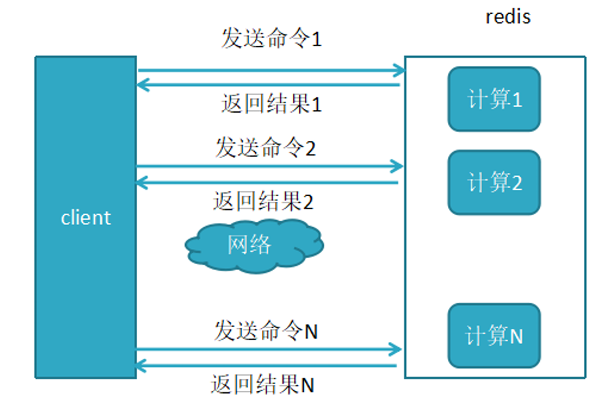

# Redis 基础

## NoSQL 数据库

数据库主要分为两大类：关系型数据库与 NoSQL 数据库。

NoSQL 数据库，全称为 Not Only SQL，意思就是适用关系型数据库的时候就使用关系型数据库，不适 用的时候可以考虑使用更加合适的数据存储。NoSQL 是对不同于传统的关系型数据库的数据库管理系统 的统称。

NoSQL 用于超大规模数据的存储。（例如谷歌或 Facebook 每天为他们的用户收集万亿比特的数据）。 这些类型的数据存储不需要固定的模式，无需多余操作就可以横向扩展。

## NoSQL 起源

NoSQL 一词最早出现于 1998 年，是 Carlo Strozzi 开发的一个轻量、开源、不提供 SQL 功能的关系数据 库。

2009 年，Last.fm 的 Johan Oskarsson 发起了一次关于分布式开源数据库的讨论，来自 Rackspace 的 Eric  Evans 再次提出了 NoSQL 的概念，这时的 NoSQL 主要指非关系型、分布式、不提供 ACID 的数据库设计模 式。

2009 年在亚特兰大举行的 "no: sql(east)" 讨论会是一个里程碑，其口号是 "select fun, profit from  real_world where relational = false;"。因此，对 NoSQL 最普遍的解释是 "非关联型的"，强调 Key-Value  Stores 和文档数据库的优点，而不是单纯的反对 RDBMS。

## 为什么使用 NoSQL

主要是由于随着互联网发展，数据量越来越大，对性能要求越来越高，传统数据库存在着先天性的缺 陷，即单机（单库）性能瓶颈，并且扩展困难。这样既有单机单库瓶颈，却又扩展困难，自然无法满足 日益增长的海量数据存储及其性能要求，所以才会出现了各种不同的 NoSQL 产品，NoSQL 根本性的优 势在于在云计算时代，简单、易于大规模分布式扩展，并且读写性能非常高

通过第三方平台（如：Google, Facebook 等）可以很容易的访问和抓取数据。用户的个人信息，社交网 络，地理位置，用户生成的数据和用户操作日志已经成倍的增加。如果要对这些用户数据进行挖掘，那 SQL 数据库已经不适合这些应用了, NoSQL 数据库的发展却能很好的处理这些大的数据。

## RDBMS 和 NOSQL 对比

RDBMS

*   高度组织化结构化数据 
*   结构化查询语言（SQL） 
*   数据和关系都存储在单独的表中。
*    数据操纵语言，数据定义语言 
*   严格的一致性 
*   基础事务

NoSQL

*   代表着不仅仅是 SQL, 没有声明性查询语言 
*   没有预定义的模式 
*   最终一致性，而非 ACID 属性 
*   非结构化和不可预知的数据 
*   CAP 定理 
*   高性能，高可用性和可伸缩性


## CAP theorem


它指出对于一个分布式计算系统，不可能同时满足以下三点:

*   C：Consistency 

    *   即一致性， 所有节点在同一时间具有相同的数据视图 换句话说，如果一个节点在写入操作完成后，所有其他节点都能立即读取到最新的数据。 

        注意，这里的一致性指的是强一致性，也就是数据更新完，访问任何节点看到的数据完全一致，要 和弱一致性，最终一致性区分开来。 

        每次读取的数据都应该是最近写入的数据或者返回一个错误, 而不是过期数据，也就是说，所有节 点的数据是一致的。

*   A：Availability

    *   即可用性，所有的节点都保持高可用性, 要求服务在接收到客户端请求后，都能够给出响应 

        每个非故障节点都能够在有限的时间内返回有效的响应，即系统一直可用。可用性强调系统对用户 请求的及时响应

        注意，这里的高可用还包括不能出现延迟，比如如果某个节点由于等待数据同步而阻塞请求，那么 该节点就不满足高可用性。 

        也就是说，任何没有发生故障的服务必须在有限的时间内返回合理的结果集。 

        每次请求都应该得到一个有效的响应，而不是返回一个错误或者失去响应，不过这个响应不需要保 证数据是最近写入的, 也就是说系统需要一直都是可用正常使用的，不会引起调用者的异常，但是并 不保证响应的数据是最新的。

*   P：Partiton tolerance

    *   分区是指系统中的节点由于网络故障无法相互通信，导致系统被分成多个孤立的子系统 在分布式系统中，不同节点之间通过网络进行通信 

        分区容忍性是指当分布式系统中出现网络分区（即系统中的一部分节点无法和其他节点进行通信） 时，系统能够容忍这种情况，并且分离的系统也能够正常运行。这意味着，即使系统中某些节点或 网络分区出现故障或延迟，整个系统仍然能够继续运作，不会受到单点故障的影响。 

        由于网络是不可靠的，所有节点之间很可能出现无法通讯的情况，在节点不能通信时，要保证系统 可以继续正常服务。 

        在分布式系统中，机器分布在各个不同的地方，由网络进行连接。由于各地的网络情况不同，网络 的延迟甚至是中断是不可避免的。 

        因此分区容错性通常是分布式系统的必要条件，即如果不能容忍分区，就只能是一个单一系统，而 非一个真正可用的分布式系统

遵循 CAP 原理，一个数据分布式系统不可能同时满足 C 和 A 和 P 这 3 个条件。所以系统架构师在设计系统 时，不要将精力浪费在如何设计能满足三者的完美分布式系统，而是应该进行取舍。由于网络的不可靠 的性质，大多数开源的分布式系统都会实现 P，也就是分区容忍性，之后在 C 和 A 中做抉择。

比如: MySQL 的主从服务器之间网络没有问题，主从复制正常，那么数据一致性，可用性是有保障的。 但是如果网络出现了问题，主从复制异常，那么就会有数据不同步的情况。这种情况下有两个选择，第 一个方法是保证可用性，允许出现数据不一致的情况，依然在主数据库写，从数据库读。第二个方法是 保证一致性，关闭主数据库，禁止写操作，确保主从数据一致，等服务器之间网络恢复了，再开放写操 作。

也就是说，在服务器之间的网络出现异常的情况下，一致性和可用性是不可能同时满足的，必须要放弃 一个，来保证另一个。这也正是 CAP 定理所说的，在分布式系统中，P 总是存在的。在 P 发生的前提下， C(一致性)和 A（可用性）不能同时满足。这种情况在做架构设计的时候就要考虑到，要评估对业务的影 响，进行权衡决定放弃哪一个。在通常的业务场景下，系统不可用是不能接受的，所以要优先保证可用 性，暂时放弃一致性。

因此，根据 CAP 原理将 NoSQL 数据库分成了满足 CA 原则、满足 CP 原则和满足 AP 原则三大类：

*   CA - 单点集群，满足一致性，可用性的系统，通常在可扩展性上不太强大。 
    *   放弃分区容忍性，即不进行分区，不考虑由于网络不通或结点挂掉的问题，则可以实现一致性和可 用性。那么系统将不是一个标准的分布式系统
    *   比如: 单一数据中心数据库, 所有节点都位于同一个数据中心，并且节点之间的通信是高可靠的
*   CP - 满足一致性，分区容忍性的系统，通常性能不是特别高。 放弃可用性，追求强一致性和分区 容错性
    *   例如: Zookeeper, ETCD, Consul, MySQL 的 PXC 等集群就是追求的强一致，再比如跨行转账，一次转 账请求要等待双方银行系统都完成整个事务才算完成。
*   AP - 满足可用性，分区容忍性的系统，通常可能对一致性要求低一些。
    *   放弃一致性，追求分区容忍性和可用性。这是很多分布式系统设计时的选择。
    *   例如：MySQL 主从复制，默认是异步机制就可以实现 AP，但是用户接受所查询的到数据在一定时 间内不是最新的.
    *   通常实现 AP 都会保证最终一致性，而 BASE 理论就是根据 AP 来扩展的，一些业务场景 比如：订单退 款，今日退款成功，明日账户到账，只要用户可以接受在一定时间内到账即可。

## Base 理论

Base 理论是三要素的缩写：基本可用（Basically Available）、软状态（Soft-state）、最终一致性 （Eventually Consistency）。


*   基本可用  （Basically Available）

    *   相对于 CAP 理论中可用性的要求：【任何时候，读写都是成功的】，“基本可用”要求系统能够基本 运行，一直提供服务，强调的是分布式系统在出现不可预知故障的时候，允许损失部分可用性。比 如系统通过断路保护而引发快速失败，在快速失败模式下，支持加载默认显示的内容（静态化的或 者被缓存的数据），从而保证服务依然可用。

        相比于正常的系统，可能是响应时间延长，或者是服务被降级。

        比如在在秒杀活动中，如果抢购人数太多，超过了系统的 QPS 峰值，可能会排队或者提示限流。

*   软状态 （Soft state）

    *   相对于 ACID 事务中原子性要求的要么全做，要么全不做，强调的是强制一致性，要求多个节点的数 据副本是一致的，强调数据的一致性。这种原子性可以理解为”硬状态“。

        而软状态则允许系统中的数据存在中间状态，并认为该状态不影响系统的整体可用性，即允许系统 在不同节点的数据副本上存在数据延时。

        比如粉丝数，关注后需要过一段时间才会显示正确的数据。

*   最终一致性（Eventuallyconsistent）

    *   数据不可能一直处于软状态，必须在一个时间期限后达到各个节点的一致性。在期限过后，应当保 证所有副本中的数据保持一致性，也就是达到了数据的最终一致性。

        在系统设计中，最终一致性实现的时间取决于网络延时、系统负载、不同的存储选型，不同数据复 制方案设计等因素。也就是说，不保证用户什么时候能看到更新完成后的数据，但是终究会看到 的。

## NoSQL 数据库分类


## Redis 特性

*   速度快: 10W QPS, 基于内存, C 语言实现 
*   单线程：引号的”单线程“ 
*   持久化：RDB，AOF 
*   支持多种数据类型 
*   支持多种编程语言 
*   功能丰富: 支持 Lua 脚本, 发布订阅, 事务, pipeline 等功能 
*   简单: 代码短小精悍(单机核心代码只有 23000 行左右), 单线程开发容易, 不依赖外部库, 使用简单 
*   主从复制 
*   支持高可用和分布式

## “单线程”

Redis 6.0 版本前一直是单线程方式处理用户的请求 


单线程为何如此快? 

*   纯内存 
*   非阻塞 
*   避免线程切换和竞态消耗 
*   基于 Epoll 实现 IO 多路复用


注意事项:

*   一次只运行一条命令 
*   避免执行长(慢)命令: keys *, flushall, flushdb, slow lua script, mutil/exec, operate big  value(collection)
*   其实不是单线程: 早期版本是单进程单线程,3.0 版本后实际还有其它的线程, 实现特定功能, 如: fysnc  file descriptor, close file descriptor


## Redis 对比 Memcached

| 比较类别       | Redis                                                        | Memcached                                                    |
| -------------- | ------------------------------------------------------------ | ------------------------------------------------------------ |
| 支持的数据结构 | 哈希、列表、集合、有序集合                                   | 纯粹 key-value                                                |
| 持久化支持     | 有                                                           | 无                                                           |
| 高可用支持     | redis 支持集群功能，可以实现主从复制、读写分离。官方也提供了 sentinel 集群管理工具，能够实现从服务器监控、故障自动转移，这一切，对于客户端都是透明的，无需程序改动，也无需人工介入 | 需要二次开发                                                 |
| 存储 value 容量  | 最大 512M                                                     | 最大 1M                                                       |
| 内存分配       | 临时申请空闲内存，可能导致碎片                               | 预分配内存池的方式管理内存，能够减少内存分配时间             |
| 虚拟内存使用   | 有自己的 VM 机器，理论上能够存储比物理内存更多的数据，当数据超量时，会引发 swap，把冷数据刷到磁盘 | 所有的数据存储在物理内存中                                   |
| 网络模型       | 非阻塞 I/O 复用模型提供一些 KV 存储之外的排序、聚合功能，在执行这些功能时，复读的 CPU 计算，会阻塞整个 I/O 调度 | 非阻塞 I/O 复用模型                                            |
| 水平扩展的支持 | redis cluster 可以横向扩展                                    | 暂无                                                         |
| 多线程         | Redis6.0 之前只支持单线程                                     | Memcached 支持多线程，CPU 利用方面 Memcache 优于 Redis            |
| 过期策略       | 有专门线程清除缓存数据                                       | 慢漏洞机制：每次在缓存放入数据的时候，都缓存一个时间，在读取的时候根据时间和设置的时间做 TTL 比较来判断是否过期 |
| 单机 QPS        | 约 10W                                                        | 约 60W                                                        |
| 源代码可读性   | 代码清晰简洁                                                 | 代码不清晰                                                   |
| 适用场景       | 复杂数据结构、支持持久化、高可用需求、value 存储容量较大      | 纯粹 KV，数据量非常大，并开发是非常大的业务                   |

## Redis 常见应用场景


*   缓存：缓存 RDBMS 中数据, 比如网站的查询结果、商品信息、微博、新闻、消息
*   Session 共享：实现 Web 集群中的多服务器间的 session 共享
*   计数器：商品访问排行榜、浏览数、粉丝数、关注、点赞、评论等和次数相关的数值统计场景
*   社交：朋友圈、共同好友、可能认识他们等
*   地理位置: 基于地理信息系统 GIS（Geographic Information System)实现摇一摇、附近的人、外卖 等功能
*   消息队列：ELK 等日志系统缓存、业务的订阅/发布系统

## 缓存的实现流程

数据更新操作流程：


数据读操作流程：


## 缓存穿透, 缓存击穿和缓存雪崩


### 缓存穿透 Cache Penetration

缓存穿透是指缓存和数据库中都没有的数据，而用户不断发起请求，比如： 发起为 id 为 “-1” 的数据或 id 为特别大不存在的数据。

这时的用户很可能是攻击者，攻击会导致数据库压力过大。

解决方法：

*   接口层增加校验，如用户鉴权校验，id 做基础校验，id <= 0 的直接拦截 
*   从缓存取不到的数据，在数据库中也没有取到，这时也可以将 key-value 对写为 key-null，缓存有效 时间可以设置短点，如 30 秒（设置太长会导致正常情况也没法使用）。这样可以防止攻击用户反复 用同一个 id 暴力攻击

###  缓存击穿 Cache breakdown

缓存击穿是指缓存中没有但数据库中有的数据，比如：热点数据的缓存时间到期后，这时由于并发用户 特别多，同时读缓存没读到数据，又同时去数据库去取数据，引起数据库压力瞬间增大，造成过大压力

解决方法：

*   设置热点数据永远不过期。


### 缓存雪崩 Thunder Hurd Problem

缓存雪崩是指缓存中数据大批量到过期时间，而查询数据量巨大，引起数据库压力过大甚至 down 机。和 缓存击穿不同的是，缓存击穿指并发查同一条数据，缓存雪崩是不同数据都过期了，很多数据都查不到 从而查数据库。

解决方法：

*   缓存数据的过期时间设置随机，防止同一时间大量数据过期现象发生
*   如果缓存数据库是分布式部署，将热点数据均匀分布在不同搞得缓存数据库中
*   设置热点数据永远不过期

### 缓存 crash

Redis 缓存服务宕机，造成 缓存服务失效

## Pipeline 流水线

Redis 客户端执行一条命令分 6 个过程：

发送命令 --> 网络传输 --> 命令排队 --> 命令执行 --> 网络传输 --> 返回结果

这个过程称为 Round trip time(简称 RTT, 往返时间)，mget, mset 指令可以一次性的批量对多个数据的执 行操作, 所以有效节约了 RTT

但大部分命令（如 hgetall）不支持批量操作，需要消耗 N 次 RTT ，利用 Pipeline 技术可以解决这一问题

未使用 pipeline 执行 N 条命令如下图



使用了 pipeline 执行 N 条命令如下图


两者性能对比


# Redis 安装

https://redis.io/docs/getting-started/installation/

## 包安装 Redis

```shell
apt-get install lsb-release curl gpg
curl -fsSL https://packages.redis.io/gpg | sudo gpg --dearmor -o /usr/share/keyrings/redis-archive-keyring.gpg
chmod 644 /usr/share/keyrings/redis-archive-keyring.gpg
echo "deb [signed-by=/usr/share/keyrings/redis-archive-keyring.gpg] https://packages.redis.io/deb $(lsb_release -cs) main" | sudo tee /etc/apt/sources.list.d/redis.list
apt update
apt install redis
```

## 编译安装 Redis

[Index of /releases/](https://download.redis.io/releases/)

官方的安装方法：

[Install Redis from Source | Docs](https://redis.io/docs/latest/operate/oss_and_stack/install/install-redis/install-redis-from-source/)

```shell
apt -y install make gcc libjemalloc-dev libsystemd-dev
mkdir -p /redis/{etc,log,data,run}
echo 'PATH=/apps/redis/bin:$PATH' >> /etc/profile
. /etc/profile

wget https://download.redis.io/releases/redis-7.4.2.tar.gz
tar -xzvf redis-7.4.2.tar.gz 
cd redis-7.4.2/
make -j 2  USE_SYSTEMD=yes  PREFIX=/redis install
cp redis.conf /redis/etc/
```

前台启动 redis

```shell
redis-server /redis/etc/redis.conf
```

创建 Redis 用户和设置数据目录权限及修改默认配置文件

```shell
useradd -r -s /sbin/nologin redis
chown -R redis:redis /redis/

vim /redis/etc/redis.conf
dir /redis/data
pidfile /redis/run/redis_6379.pid
```

创建 Redis 服务 Service 文件

```shell
cp /root/redis-7.4.2/utils/systemd-redis_server.service  /lib/systemd/system/redis.service

[Service]
ExecStart=/usr/local/bin/redis-server /redis/etc/redis.conf --supervised systemd --daemonize no

systemctl daemon-reload
```

验证

```shell
redis-cli
127.0.0.1:6379> ping
PONG
```

## 多实例

以编译安装为例实现 redis 多实例

多配置文件

```shell
/redis/etc# cp redis.conf redis-6380.conf
/redis/etc# cp redis.conf redis-6381.conf

# 三处改动
port 6380
pidfile /redis/run/redis_6380.pid
dbfilename dump_6380.rdb 

# 或者
sed  's/6379/6380/' /redis/etc/redis.conf > /redis/etc/redis-6380.conf
sed  's/6379/6381/' /redis/etc/redis.conf > /redis/etc/redis-6381.conf
# 但 dbfilename 要手动改
dbfilename dump_6380.rdb 
```

多服务文件

```shell
cp /lib/systemd/system/redis.service /lib/systemd/system/redis6380.service
ExecStart=/redis/bin/redis-server /redis/etc/redis-6381.conf --supervised systemd  

cp /lib/systemd/system/redis.service /lib/systemd/system/redis6381.service
ExecStart=/redis/bin/redis-server /redis/etc/redis-6381.conf --supervised systemd  
```


## 优化

消除启动时的三个 Warning 提示信息(可选)

### Tcp backlog

`WARNING: The TCP backlog setting of 511 cannot be enforced because  /proc/sys/net/core/somaxconn is set to the lower value of 128.****`

Tcp backlog 是指 TCP 的第三次握手服务器端收到客户端 ack 确认号之后到服务器用 Accept 函数处理请求 前的队列长度，即全连接队列

Ubuntu22.04 后默认值满足要求，不再有此告警

```shell
半连接队列
cat /proc/sys/net/ipv4/tcp_max_syn_backlog
128

#全连接队列默认值
cat  /proc/sys/net/core/somaxconn
4096

# 修改配置
vim /etc/sysctl.conf
net.core.somaxconn = 4096
sysctl -p
```

### overcommit_memory

`WARNING overcommit_memory is set to 0! Background save may fail under low memory  condition. To fix this issue add 'vm.overcommit_memory = 1' to /etc/sysctl.conf  and then reboot or run the command 'sysctl vm.overcommit_memory=1' for this to  take effect.`

内核参数 overcommit_memory 实现内存分配策略, 可选值有三个：0、1、2

*   0 

    表示内核将检查是否有足够的可用内存供应用进程使用；如果有足够的可用内存，内存申请允许；否则内存 申请失败，并把错误返回给应用进程

*   1 

    表示内核允许分配所有的物理内存，而不管当前的内存状态如何

    大小不超过物理内存大小

*   2 

    表示内核允许分配超过所有物理内存和交换空间总和的内存

    大小不超过物理内存和交换空间总和

```shell
sysctl vm.overcommit_memory

vim /etc/sysctl.conf
vm.overcommit_memory = 1
sysctl -p
```

### transparent hugepage

透明大页

`WARNING you have Transparent Huge Pages (THP) support enabled in your kernel.  This will create latency and memory usage issues with Redis. To fix this issue  run the command 'echo never > /sys/kernel/mm/transparent_hugepage/enabled' as  root, and add it to your /etc/rc.local in order to retain the setting after a  reboot. Redis must be restarted after THP is disabled.`

警告：您在内核中启用了透明大页面（THP, 不同于一般 4k 内存页, 而为 2M）支持。 这将在 Redis 中造成延迟 和内存使用问题。 要解决此问题，请以 root 用户身份运行命令“echo never >  /sys/kernel/mm/transparent_hugepage/enabled”，并将其添加到您的/etc/rc.local 中，以便在 重启后保留设置。禁用 THP 后，必须重新启动 Redis。

注意：Ubuntu24.04 .22.04 默认值满足要求，不再有此告警

```shell
cat /sys/kernel/mm/transparent_hugepage/enabled
always [madvise] never

vim /etc/rc.local
echo never > /sys/kernel/mm/transparent_hugepage/enabled

chmod +x /etc/rc.local
```

# Redis 工具和客户端连接

```shell
ll /redis/bin/
redis-benchmark*  # 性能测试
redis-check-aof -> redis-server* # AOF文件检查程序
redis-check-rdb -> redis-server* # RDB文件检查程序
redis-cli* # 客户端程序
redis-sentinel -> redis-server* # 哨兵程序
redis-server* # 服务端主程序
```

##  客户端程序 redis-cli

```shell
redis-cli -h <Redis服务器IP> -p <PORT> -a <PASSWORD> --no-auth-warning
```

## 程序连接 Redis

### Shell 脚本访问 Redis

```shell
NUM=100
PASS=123456
HOST=127.0.0.1
PORT=6379
DATABASE=0

for i in `seq $NUM`;do
    redis-cli -h ${HOST}  -a "$PASS" -p ${PORT} -n ${DATABASE} --no-auth-warning  set key${i} value${i}
    #redis-cli -h ${HOST} -p ${PORT} -n ${DATABASE} --no-auth-warning  set key${i} value${i}
    echo "key${i} value${i} 写入完成"
done
echo "$NUM个key写入到Redis完成"  
```


###  Python 程序连接 Redis

[Connect with Redis client API libraries | Docs](https://redis.io/docs/latest/develop/clients/)

```shell
apt update && apt -y install  python3-redis
```

py脚本

```python
#!/usr/bin/python3 
import redis
pool = redis.ConnectionPool(host="127.0.0.1",port=6379,password="123456",decode_responses=True)
r = redis.Redis(connection_pool=pool)
for i in range(100000):
    r.set("k%d" % i,"v%d" % i)
    data=r.get("k%d" % i)
    print(data)
```

## 图形工具

### RedisInsight

https://apps.microsoft.com/store/detail/redisinsight/XP8K1GHCB0F1R2

### Another-Redis-Desktop-Manager

当前 Redis7.2.1 无法连接，Redis7.2.2以后版本可以

https://github.com/qishibo/AnotherRedisDesktopManager

### RedisDesktopManager

当前 Redis-v7.2.1 无法连接，redis-v7.2.3以后版本可以支持连接


# Redis 基础功能

## Redis 常用命令

### INFO

显示当前节点redis运行状态信息

```shell
redis-cli info

# 指定显示部分
redis-cli info server

redis-cli info Cluster
```

### SELECT

切换数据库，相当于在MySQL的 USE DBNAME 指令

0-15

```shell
root@loong:~# redis-cli
127.0.0.1:6379> SELECT 0
OK
127.0.0.1:6379> SELECT 1
OK
127.0.0.1:6379[1]> SELECT 15
OK
127.0.0.1:6379[15]> SELECT 16
(error) ERR DB index is out of range
127.0.0.1:6379[15]> 
```

注意: 在Redis cluster 模式下不支持多个数据库,会出现下面错误

```shell
root@loong:~# redis-cli 
127.0.0.1:6379> info cluster
# Cluster
cluster_enabled:1
127.0.0.1:6379> select 0
OK
127.0.0.1:6379> select 1
(error) ERR SELECT is not allowed in cluster mode
```

### KEYS

查看当前库下的所有key，**此命令慎用！**


```shell
 127.0.0.1:6379> KEYS *
 redis> KEYS *o*
 redis> KEYS t??
 redis> KEYS t[w]*
```

### DBSIZE

返回当前库下的所有key 数量

```shell
127.0.0.1:6379> DBSIZE
(integer) 100000
```

### FLUSHDB

强制清空当前库中的所有key，**此命令慎用！**

```shell
127.0.0.1:6379> DBSIZE
(integer) 100000
127.0.0.1:6379> FLUSHDB
OK
127.0.0.1:6379> DBSIZE
(integer) 0
```

### FLUSHALL

强制清空当前Redis服务器**所有数据库中的所有key**，即删除所有数据，**此命令慎用！**

### SHUTDOWN

可用版本： >= 1.0.0

时间复杂度： O(N)，其中 N 为关机时需要保存的数据库键数量。

SHUTDOWN 命令执行以下操作：

*   关闭Redis服务,停止所有客户端连接
*   如果有至少一个保存点在等待，执行 SAVE 命令
*   如果 AOF 选项被打开，更新 AOF 文件
*   关闭 redis 服务器(server)
*   如果持久化被打开的话， SHUTDOWN 命令会保证服务器正常关闭而不丢失任何数据。
*   另一方面，假如只是单纯地执行 SAVE 命令，然后再执行 QUIT 命令，则没有这一保证 —— 因为在执行  SAVE 之后、执行 QUIT 之前的这段时间中间，其他客户端可能正在和服务器进行通讯，这时如果执行 QUIT  就会造成数据丢失。

**建议禁用此指令**

```shell
# 重新命令
vim /etc/redis.conf
rename-command shutdown ""
```

## Redis 配置文件说明

```ini
bind 0.0.0.0    
#指定监听地址，支持用空格隔开的多个监听IP

protected-mode yes 
# redis3.2之后加入的新特性，在没有设置bind IP和密码的时候,redis只允许访问127.0.0.1:6379，
# 可以远程连接，但当访问将提示警告信息并拒绝远程访问,redis-7版本后，只要没有密码就不能远程访问

requirepass foobared 
#设置redis连接密码，之后需要AUTH pass,如果有特殊符号，用" "引起来,生产建议设置

port 6379       
#监听端口,默认6379/tcp

tcp-backlog 511 
#三次握手的时候server端收到client ack确认号之后的队列值，即全连接队列长度

timeout 0       
#客户端和Redis服务端的连接超时时间，默认是0，表示永不超时

tcp-keepalive 300 
#tcp 会话保持时间300s

daemonize no 
#默认no,即直接运行redis-server程序时,不作为守护进程运行，而是以前台方式运行
#如果想在后台运行需改成yes,当redis作为守护进程运行的时候，它会写一个 pid 到/var/run/redis.pid 文件

supervised no
# 和OS相关参数，可设置通过upstart和systemd管理Redis守护进程，centos7后都使用systemd

pidfile /var/run/redis_6379.pid 
#pid文件路径

loglevel notice 
#日志级别

logfile "/path/redis.log" 
#日志路径

databases 16 
#设置数据库数量，默认：0-15，共16个库

always-show-logo yes 
#在启动redis 时是否显示或在日志中记录记录redis的logo

dir ./ 
#快照文件保存路径，示例：dir "/apps/redis/data"

rename-command 
#重命名一些高危命令，示例：rename-command FLUSHALL "" 禁用命令
#示例: rename-command del wang

maxclients 10000 
#Redis最大连接客户端,默认值10000

maxmemory <bytes> 
#redis使用的最大内存，单位为bytes字节，0为不限制，建议设为物理内存一半，
# 8G内存的计算方式8(G)*1024(MB)1024(KB)*1024(Kbyte)
# 需要注意的是缓冲区是不计算在maxmemory内,生产中如果不设置此项,可能会导致OOM

maxmemory-policy
# MAXMEMORY POLICY：当达到最大内存时，Redis 将如何选择要删除的内容。您可以从以下行为中选择一种：
# 
# volatile-lru -> Evict 使用近似 LRU（最近最少使用算法），只有设置了过期时间的键
# allkeys-lru -> 使用近似 LRU 驱逐任何键。
# volatile-lfu -> 使用近似 LFU 驱逐，只有设置了过期时间的键。
# allkeys-lfu -> 使用近似 LFU 驱逐任何键。
# volatile-random -> 删除设置了过期时间的随机键。
# allkeys-random -> 删除一个随机密钥，任何键。
# volatile-ttl -> 删除过期时间最近的key（次TTL）
# noeviction -> 不要驱逐任何东西，只是在写操作时返回一个错误。此为默认值
#
# LRU 表示最近最少使用
# LFU 表示最不常用
#
# LRU、LFU 和 volatile-ttl 都是使用近似随机算法实现的。
# 注意：使用上述任何一种策略，当没有合适的键用于驱逐时，Redis 将在需要更多内存的写操作时返回错误。
# 这些通常是创建新密钥、添加数据或修改现有密钥的命令。
# 一些示例是：SET、INCR、HSET、LPUSH、SUNIONSTORE、SORT（由于 STORE 参数）和 EXEC（如果事务包括任何需要内存的命令）。
```

持久化配置（snapshot（RDB），Append Only File（AOF））

```ini
save 900 1 #在900秒内有1个key内容发生更改,就执行快照机制
save 300 10 #在300秒内有10个key内容发生更改,就执行快照机制
save 60 10000  #60秒内如果有10000个key以上的变化，就自动快照备份

stop-writes-on-bgsave-error yes 
# 默认为yes时,可能会因空间满等原因快照无法保存出错时，
# 会禁止redis写入操作，生产建议为no
# 此项只针对配置文件中的自动save有效

rdbcompression yes 
#持久化到RDB文件时，是否压缩，"yes"为压缩，"no"则反之

rdbchecksum yes 
#是否对备份文件开启RC64校验，默认是开启

dbfilename dump.rdb 
#快照文件名

appendonly no
# 是否开启AOF日志记录，默认redis使用的是rdb方式持久化，
# 这种方式在许多应用中已经足够用了，但是redis如果中途宕机，会导致可能有几分钟的数据丢失(取决于dump数据的间隔时间)
# 根据save来策略进行持久化，Append Only File是另一种持久化方式，可以提供更好的持久化特性，
# Redis会把每次写入的数据在接收后都写入 appendonly.aof 文件，
# 每次启动时Redis都会先把这个文件的数据读入内存里，先忽略RDB文件。
# 默认不启用此功能

appendfilename "appendonly.aof" #文本文件AOF的文件名，存放在dir指令指定的目录中

appendfsync everysec #aof持久化策略的配置
```

主从复制相关

```

```

集群配置

```

```

